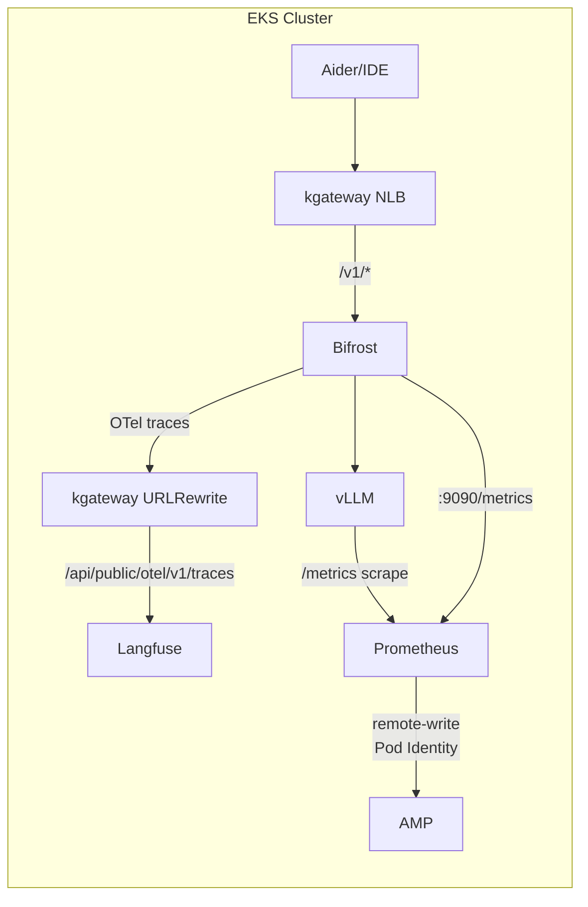

# 监控与 Observability 配置指南

本文档涵盖 Prometheus → AMP、AMG、Langfuse、Bifrost OTel 集成监控的**实战部署步骤**。架构概念和设计原则请参阅 [Agent 监控](../../operations-mlops/observability/agent-monitoring.md) 和 [LLMOps Observability](../../operations-mlops/observability/llmops-observability.md)。

---

## 1. 监控架构概述

本文档的详细内容（AMP/AMG 配置、Langfuse Helm 部署、ServiceMonitor YAML、Grafana 仪表板 JSON 等）由于篇幅原因请参阅[韩文原文](/docs/agentic-ai-platform/reference-architecture/integrations/monitoring-observability-setup)。

---

## 参考资料

- [Amazon Managed Prometheus 文档](https://docs.aws.amazon.com/prometheus/)
- [Amazon Managed Grafana 文档](https://docs.aws.amazon.com/grafana/)
- [Langfuse 自托管指南](https://langfuse.com/docs/deployment/self-host)
- [Bifrost OTel 集成](https://www.getmaxim.ai/bifrost/docs)
