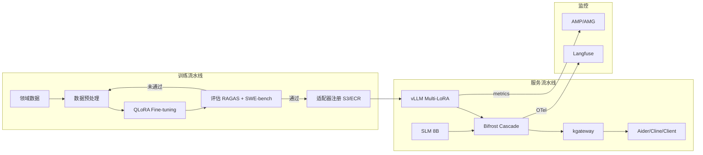

# 自定义模型流水线构建指南

## 1. 概述

### 为什么需要自定义模型流水线

SaaS AI 编码工具（如 Kiro、GitHub Copilot）可以快速启动，但在企业环境中面临根本局限。

| 限制 | SaaS（Kiro 等）| 自托管流水线 |
|------|----------------|---------------------|
| **LoRA Fine-tuning** | 不可 | 按领域训练适配器 |
| **数据主权** | 代码传输到外部 | VPC 内部完结 |
| **模型选择** | 仅使用提供的模型 | 自由选择开源模型 |
| **成本控制** | Token 单价固定 | SLM Cascade 节省 66% |
| **按客户优化** | 共享通用模型 | Multi-LoRA 按客户特化 |

:::info 核心策略
通过 **Base Model + LoRA 适配器** 模式在一组 GPU 上同时服务多个领域专家模型。共享基础模型权重最大化 GPU 内存效率。
:::

### 流水线整体流程

本文档的详细内容（QLoRA 训练、Multi-LoRA 配置、SLM Cascade 设置等）由于篇幅原因请参阅[韩文原文](/docs/agentic-ai-platform/reference-architecture/model-lifecycle/custom-model-pipeline)。

---

## 参考资料

- [LoRA Paper (Hu et al., 2021)](https://arxiv.org/abs/2106.09685)
- [QLoRA Paper (Dettmers et al., 2023)](https://arxiv.org/abs/2305.14314)
- [vLLM Multi-LoRA](https://docs.vllm.ai/en/latest/models/lora.html)
- [Unsloth Fast Training](https://github.com/unslothai/unsloth)
- [NeMo Framework](https://docs.nvidia.com/nemo-framework/user-guide/latest/)
