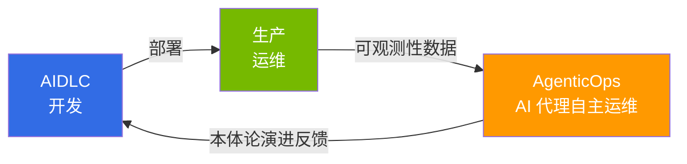

import { CoreTechStack } from '@site/src/components/AiopsIntroTables';

# AgenticOps：基于 AI 代理的运维反馈环路

> **阅读时间**：约 3 分钟

AgenticOps 是在通过 [AIDLC](/docs/aidlc) 完成软件开发之后，**通过 AI 代理自主构建实际运维环境中持续改进反馈环路的方法**。如果说传统 AIOps 将 AI 作为监控辅助工具，那么 AgenticOps 则是 AI 代理基于可观测性数据**自主执行感知 → 判断 → 执行**的下一阶段。

## 与 AIDLC 的关系

如果说 AIDLC 专注于**"如何构建"**（开发方法论），那么 AgenticOps 专注于**"如何运维和改进"**（运维反馈环路）。AIDLC 本体论定义的领域约束被 AgenticOps 的 AI 代理作为运维判断的标准使用，运维中发现的洞察则作为本体论演进的 Outer Loop 反馈回来。

## 核心基础：AWS 开源战略

AWS 通过 Managed Add-on（22+）、Community Add-ons Catalog、托管开源服务（AMP、AMG、ADOT）提供 Kubernetes 生态系统的核心工具。在此基础上，**Kiro + MCP（Model Context Protocol）** 作为 AgenticOps 的核心工具运行，通过 AWS MCP 服务器（50+ GA）自主执行 EKS 集群控制、CloudWatch 指标分析和成本优化。

<CoreTechStack />

:::info 学习路径
按照 **1 → 2 → 3** 的顺序阅读，可以跟随从 AgenticOps 战略制定到自主运维实现的完整旅程。

1. [AgenticOps 战略指南](./aiops-introduction.md) — 整体方向和 AWS 开源战略
2. [智能可观测性技术栈](./aiops-observability-stack.md) — 3-Pillar + AI 分析的数据基础构建
3. [预测扩缩容与自动恢复](./aiops-predictive-operations.md) — 自主运维的实现
:::

## 参考资料

- [Proactive EKS Monitoring with CloudWatch](https://aws.amazon.com/blogs/containers/proactive-amazon-eks-monitoring-with-amazon-cloudwatch-operator-and-aws-control-plane-metrics/)
- [AWS MCP Servers (个别 50+ GA)](https://github.com/awslabs/mcp)
- [Kagent - Kubernetes AI Agent](https://github.com/kagent-dev/kagent)
- [Strands Agents SDK](https://github.com/strands-agents/sdk-python)
