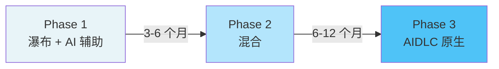
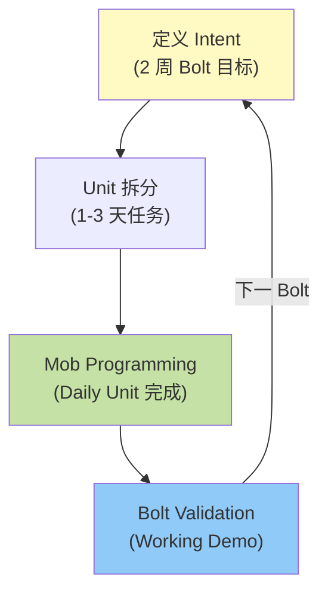
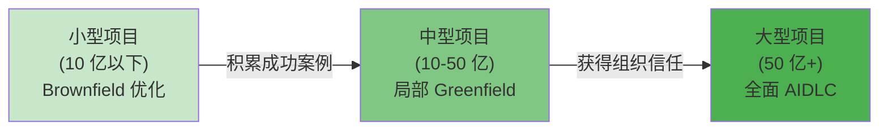
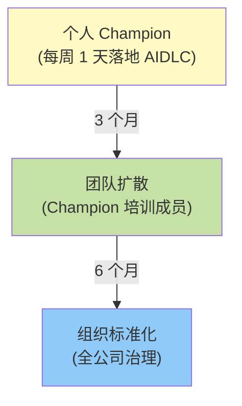

# 企业级 AIDLC 落地策略

本文提出在以瀑布为主的企业级 SI 环境中将开发文化转型至 AIDLC 的实战落地策略。

---

## 企业级 AIDLC 落地的现实

### 瀑布式 SI 市场的结构性约束

大型 SI 项目因以下原因难以直接引入 AIDLC:

| 约束要素 | 说明 | AIDLC 冲突点 |
|----------|------|--------------|
| **固定流程** | ISO 9001、CMMI 认证流程 | Intent/Bolt 周期与文档模板不匹配 |
| **RFP 文化** | 需求说明书 → 固定价合同 | Adaptive Elaboration 被解读为范围变更 |
| **角色僵化** | 需求策划 / 开发 / QA 分离 | Mob Programming 模糊了角色边界 |
| **以产物为中心** | 合同、需求说明书、设计书、测试计划 | 与 Working software over documentation 冲突 |
| **验收阶段** | 完结时一次性验收 | 与 Continuous Validation 节奏冲突 |

#### VP 压力与一线抵抗的两难

- **管理层**: 宣布 "AI 使用率达到 80%" 之类的定量目标
- **一线**: 固守既有方式 ("工期内没时间学"、"客户没要求")
- **中层管理者**: 在创新压力与项目交付期之间挣扎

→ **没有渐进转型模型,整个组织只会停留在表面性落地**

---

## 3 阶段转型模型

AIDLC 不要一次性引入,而是在既有瀑布框架内循序渐进地应用。

### Phase 1: 瀑布 + AI 辅助 (3-6 个月)

保持既有流程,仅在开发阶段把 AI 作为编码辅助使用。

#### 适用范围

- 需求分析: 保持既有方式
- 设计: 保持既有方式
- **开发**: 允许使用 Claude Code、GitHub Copilot 等编码辅助工具
- 测试: 保持既有 QA 流程

#### 绩效指标

- 开发速度提升: 20-30%
- 缺陷密度: 持平或略有改善
- 团队成员满意度: 积累 AI 工具使用经验

#### 组织变革

- 无 (角色、流程、产物均不变)
- 开展 AI 工具培训项目 (每周 1 次、2 小时)

---

### Phase 2: 混合 (6-12 个月)

保持瀑布框架,但在开发阶段引入 **Bolt 周期** 与 **Mob Programming**。

#### 适用范围

- 需求分析: 瀑布 (保持产物形式)
- 设计: 瀑布 + **Mob Elaboration** (仅限核心模块)
- **开发**: **Bolt 周期** (以 2 周为单位产出 Working Software)
- 测试: **Continuous Validation** (每个 Bolt 演示)

#### Bolt 周期结构

#### 绩效指标

- 开发速度提升: 40-60%
- 需求变更响应时间: 缩短 50%
- 客户满意度: 借 Bolt 演示提升可见度

#### 组织变革

- **角色柔性化**: 开发者部分参与设计,QA 参与 Bolt 演示
- **Mob 会话**: 每周 2-3 次、仅限核心逻辑
- **产物精简化**: Bolt 结束报告 = 演示视频 + 代码

---

### Phase 3: AIDLC 原生 (12 个月+)

应用 Intent → Unit → Bolt 全周期,并全面运用 Ontology/Harness。

#### 适用范围

- **Intent Driven**: 直接将客户需求转化为 Intent
- **Mob Elaboration**: 整个设计以 Mob 形式推进
- **Bolt 周期**: 以 1-2 周为单位完成 Intent
- **Harness 自动化**: Unit 测试、集成测试、部署自动化
- **Ontology**: 显式管理领域知识

#### 组织结构

- **角色再定义**: 参见 [角色再定义](./role-composition.md)
  - Facilitator: 精炼 Intent、主持 Mob
  - Domain Expert: 管理 Ontology
  - Infrastructure Engineer: 管理 Harness
- **项目结构**: 10-15 人 → 拆分为 5-7 人 Mob 单元
- **合同模式**: 固定价 → Time & Material 或按 Bolt 验收

#### 绩效指标

- 开发速度提升: 60-80%
- 需求变更成本: 下降 80%
- 部署频率: 每周 1 次 → 每天 1 次
- 质量: 线上缺陷减少 50%

---

## Brownfield-First 策略

不从新建项目开始,而是从 **既有系统优化** 起步。

### 为什么选 Brownfield?

| 要素 | Greenfield (新建) | Brownfield (既有) |
|------|------------------|-------------------|
| **风险** | 高 (全盘失败时责任明确) | 低 (局部改进,不会比现状更差) |
| **学习曲线** | 陡峭 (所有事项需重新决定) | 平缓 (需理解既有代码库) |
| **可见度** | 低 (完成前无产物) | 高 (可对比改进前后) |
| **客户信任** | 不确定 (取决于最终结果) | 高 (快速反馈) |

### 3 阶段扩散路径

#### Stage 1: 小型项目 (10 亿以下)

- **目标对象**: 遗留系统维护、功能追加
- **目的**: 积累 AIDLC 应用经验
- **周期**: 3-6 个月
- **成果**: 验证 Bolt 周期、Mob 会话、Harness 自动化

#### Stage 2: 中型项目 (10-50 亿)

- **目标对象**: 既有系统部分重写 + 新功能
- **目的**: 验证混合模型
- **周期**: 6-12 个月
- **成果**: 落地 Ontology、角色再定义、合同模式试验

#### Stage 3: 大型项目 (50 亿+)

- **目标对象**: 全公司系统全面重建
- **目的**: AIDLC 原生应用
- **周期**: 12 个月+
- **成果**: 组织整体流程转型,向客户扩散

---

## Champion 模型

组织内 AIDLC 的扩散从 **个人 Champion** 出发,扩散到 **团队**,再到 **组织**。

### 3 阶段扩散结构

### Stage 1: 个人 Champion (0-3 个月)

#### Champion 遴选标准

- **技术能力**: 编码经验、学习工具能力
- **软技能**: 团队内影响力、培训意愿
- **时间保障**: 每周 1 天 (周五) 允许应用 AIDLC

#### Champion 活动

- 每周 1 天落地 AIDLC (个人项目或小型任务)
- 学习 [10 大原则](../methodology/principles-and-model.md)
- 主导 Mob 会话 (邀请成员)
- 整理成功案例 (Steering 文件、Bolt 报告)

#### 组织支持

- 允许失败 (Champion 活动不计入绩效)
- 资助外部培训 (大会、工作坊)
- 每周评审会议 (VP 或部门长参与)

---

### Stage 2: 团队扩散 (3-6 个月)

#### 扩散机制

- Champion 每周组织 **1 次 Mob 会话**
- 成员依次参与 Mob (旁观 → 协助 → 主导)
- 为各项目设定 AIDLC 应用率目标 (20% → 50% → 80%)

#### 团队层面产物

- **Steering 文件标准**: 为各项目编写 Steering 文件模板
- **Bolt 报告格式**: 演示视频 + 代码 + 复盘摘要
- **Ontology 初稿**: 定义领域词汇、核心实体模型

#### 绩效指标

- 成员 AIDLC 应用率: 50% 以上
- Mob 会话参与率: 80% 以上
- 项目速度提升: 30% 以上

---

### Stage 3: 组织标准化 (6-12 个月)

#### 治理框架

- **Steering 文件标准**: 参见 [治理](./governance-framework.md)
- **Bolt 周期策略**: 长度 (1-2 周)、验收标准、演示形式
- **Mob 会话指南**: 角色、时长、工具、复盘形式
- **Ontology 管理**: 按领域建立 Ontology 注册表、版本管理

#### 组织结构变化

- 设立 **AIDLC CoE** (Center of Excellence)
  - 运营 Champion 网络
  - 开发培训项目
  - 工具标准化 (Claude Code、GitHub、Slack)
- **项目评价标准** 变更
  - 产物数量 → Working Software 频率
  - 计划达成率 → 客户满意度

#### 绩效指标

- 组织 AIDLC 应用率: 70% 以上
- 项目成功率: 90% 以上
- 员工满意度: NPS 50+ (相较既有 +20)

---

## 时间轴模板

### 3 个月目标

| 周次 | 活动 | 产物 | 负责人 |
|------|------|------|--------|
| 1-2 周 | 选定 Champion (1-2 人) | Champion 名单、活动计划 | VP/部门长 |
| 3-4 周 | AIDLC 培训 (8 小时) | 完成 [10 大原则](../methodology/principles-and-model.md) 学习 | Champion |
| 5-8 周 | 试点项目 1 (Brownfield) | 完成 1-2 个 Bolt、演示 | Champion + 2 位成员 |
| 9-12 周 | 试点项目 2 (小型 Greenfield) | 完成 3-4 个 Bolt、复盘 | Champion + 全队 |

**成果**: Champion 1-2 名、项目 2 个、Bolt 4-6 个完成

---

### 6 个月目标

| 月 | 活动 | 产物 | 负责人 |
|----|------|------|--------|
| 1-3 个月 | 达成 3 个月目标 | Champion 1-2 名 | VP/部门长 |
| 4 个月 | 团队扩散 (3-5 团队) | 各团队 Steering 文件 | Champion + 团队长 |
| 5 个月 | Mob 会话常态化 | 每周 1 次 Mob、录制视频 | Champion + 团队 |
| 6 个月 | Steering 文件标准化 | 组织标准模板 | AIDLC CoE |

**成果**: 团队 3-5 个、Champion 3-5 名、Steering 文件标准完成

---

### 12 个月目标

| 季度 | 活动 | 产物 | 负责人 |
|------|------|------|--------|
| Q1-Q2 | 达成 6 个月目标 | 团队 3-5 个 | VP/部门长 |
| Q3 | 建立治理框架 | [治理](./governance-framework.md) | AIDLC CoE |
| Q4 | 推行组织标准 (全部项目) | Ontology 注册表、Bolt 策略 | AIDLC CoE |

**成果**: 组织 AIDLC 应用率 70%、项目成功率 90%

---

## 成熟度模型

将组织的 AIDLC 应用水平按 4 个等级进行评估。

### Level 0: Pilot (试点)

| 要素 | 状态 |
|------|------|
| **Champion** | 1-2 名 |
| **项目** | 1-2 个 (Brownfield) |
| **Bolt 周期** | 非正式 (Champion 个人实验) |
| **Mob 会话** | 无或不定期 |
| **Ontology** | 无 |
| **Harness** | 人工测试 |

---

### Level 1: Team (团队)

| 要素 | 状态 |
|------|------|
| **Champion** | 3-5 名 |
| **项目** | 3-5 个 (Brownfield + 小型 Greenfield) |
| **Bolt 周期** | 团队标准 (2 周) |
| **Mob 会话** | 每周 1 次常态化 |
| **Ontology** | 团队初稿 |
| **Harness** | 部分自动化测试 |

---

### Level 2: Division (部门)

| 要素 | 状态 |
|------|------|
| **Champion** | 10 名+ (每部门 1-2 名) |
| **项目** | 全部项目的 50% |
| **Bolt 周期** | 部门标准 (1-2 周) |
| **Mob 会话** | 每周 2-3 次、录像共享 |
| **Ontology** | 部门注册表 |
| **Harness** | CI/CD 流水线 |

---

### Level 3: Enterprise (全公司)

| 要素 | 状态 |
|------|------|
| **Champion** | 全公司网络 (50 名+) |
| **项目** | 全部项目的 80% |
| **Bolt 周期** | 全公司标准 + [治理](./governance-framework.md) |
| **Mob 会话** | 每日 Mob (核心项目) |
| **Ontology** | 全公司注册表、版本管理 |
| **Harness** | 完全自动化 (含部署) |

---

## 反模式

### 1. 大爆炸式引入

**症状**: 宣布 "从下一个项目开始全面应用 AIDLC"

**风险**:
- 整个组织同时面临学习曲线 → 初期生产力急剧下降
- 失败时 AIDLC 整体失去信任
- 没有 Champion 的表面化应用 → 被误认为 "用上 AI 工具就是 AIDLC"

**替代方案**: Champion 模型 + Brownfield-First

---

### 2. 只引入工具而忽视方法论

**症状**: "在全公司部署 Claude Code 许可证" → "AIDLC 引入完成"

**风险**:
- 没有 Mob Programming、Bolt 周期,只使用工具 → 生产力提升微弱
- 不进行 Intent/Unit 拆分,仅作编码辅助 → 设计质量下降
- 忽视 Ontology/Harness → 可维护性恶化

**替代方案**: 先行 [10 大原则](../methodology/principles-and-model.md) 培训

---

### 3. 无度量的扩散

**症状**: "5 个团队在应用 AIDLC" (实际应用率、成果不明)

**风险**:
- 形式化应用 (既做 Mob 又继续传统代码评审 → 双重工作)
- 成果难以可视化 → 失去管理层支持
- 失败案例无法学习 → 反复同一错误

**替代方案**: 追踪 [成本效益](./cost-estimation.md) 指标

---

### 4. 缺乏管理层支持的自下而上

**症状**: 一线开发者自发尝试 AIDLC,管理者反对

**风险**:
- 项目工期吃紧时被迫中止 AIDLC
- 角色边界被侵犯 (Mob 时策划 / QA 拒绝参与)
- 预算不足 (工具许可证、培训项目无资助)

**替代方案**: 必须获得 VP / 部门长赞助

---

### 5. 客户说服失败

**症状**: SI 团队应用 AIDLC,但客户要求瀑布产物

**风险**:
- 双重工作 (AIDLC 开发 + 另外撰写瀑布产物)
- 拒绝 Bolt 验收 → 回归至项目结束时一次性验收
- 客户不信任 ("没有产物怎么知道进展?")

**替代方案**: 在合同中明示 Bolt 演示、协商产物精简化

---

## 执行清单

### 组织准备度评估

- [ ] 获得 VP / 部门长赞助
- [ ] 遴选 Champion 候选 (1-2 名)
- [ ] 选定试点项目 (Brownfield 优先)
- [ ] 建立允许失败政策

### 3 个月目标

- [ ] 完成 Champion 培训 ([10 大原则](../methodology/principles-and-model.md))
- [ ] 完成 1-2 个试点项目
- [ ] 产出 4-6 个 Bolt、获得演示视频
- [ ] 团队层面 Steering 文件初稿

### 6 个月目标

- [ ] 扩散至 3-5 个团队
- [ ] Steering 文件标准化
- [ ] Ontology 初稿 (按领域)
- [ ] 度量 [成本效益](./cost-estimation.md) 指标

### 12 个月目标

- [ ] 组织 AIDLC 应用率 70%
- [ ] 完成 [治理](./governance-framework.md) 框架
- [ ] 运营 Ontology 注册表
- [ ] 项目成功率 90%

---

## 下一步

- [角色再定义](./role-composition.md): AIDLC 团队结构与角色变化
- [成本效益](./cost-estimation.md): ROI 度量与管理层汇报
- [治理](./governance-framework.md): 全公司标准建立
- [10 大原则](../methodology/principles-and-model.md): AIDLC 方法论基础

**核心信息**: 从瀑布到 AIDLC 的转型不是大爆炸,而应通过 3 阶段渐进转型 (瀑布+AI → 混合 → 原生) 与 Champion 模型 (个人 → 团队 → 组织) 推进。以 Brownfield-First 建立信任,以可度量的成果进行扩散。
