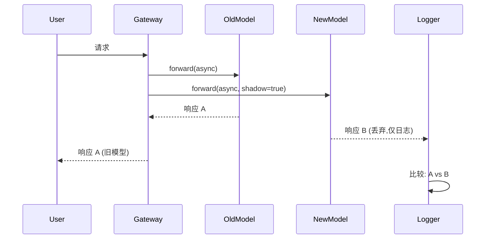
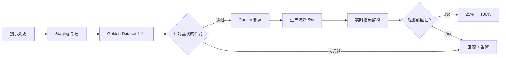

# Agent 变更管理

## 为什么需要 Agent Change Management

### 与传统软件变更的区别

在传统软件中,变更管理以代码、配置、基础设施变更为对象。Agent 系统则额外增加了 **概率性组件**:

| 变更类型 | 传统系统 | Agentic 系统 |
|-----------|---------|--------------|
| **输出确定性** | 相同输入 → 相同输出 | 相同输入 → 概率分布 |
| **回归检测** | 单元测试、集成测试 | 统计评估 (BLEU、Exact Match、LLM-as-Judge) |
| **回滚标准** | 功能故障、性能下降 | 准确率下降、幻觉增加、latency P99 |
| **变更单位** | 代码提交、二进制 | 提示版本、模型替换、参数调整 |

### 为什么 Prompt 与 Model 必须像代码一样管理

1. **Prompt 是逻辑的核心**  
   将 "你是金融分析专家" → "你是保守型投资顾问" 这一行修改,输出模式会整体变化。

2. **模型替换就是运行时替换**  
   将 GPT-4 → Claude 3.5 Sonnet 切换时,即使同一提示,回复风格、token 用量、latency 都会不同。

3. **缺乏变更追踪就无法回滚**  
   收到 "昨天还好好的,今天变怪了" 的反馈时,若不知是谁在何时更改了哪个提示,就无法恢复。

4. **监管要求**  
   金融、医疗、公共部门需要在审计 (Audit) 记录中留下 "此回复由哪个提示版本、哪个模型版本生成"。

---

## 提示注册中心

### Langfuse Prompt

[Langfuse](https://langfuse.com/) 是可自托管的 LLMOps 平台。提示注册中心功能:

- **版本管理**: 每次变更自动递增版本 (`v1`、`v2`、...)
- **标签**: 赋予 `production`、`staging`、`canary` 等环境标签
- **Rollout 管理**: 把某标签贴到某版本后,应用只引用标签 (`get_prompt("financial-analysis", label="production")`)
- **Diff 视图**: 版本间变更可视化
- **Access Log**: 追踪某会话使用了哪个提示版本

```python
from langfuse import Langfuse

client = Langfuse()

# 查询提示版本
prompt = client.get_prompt("financial-analysis", label="production")
print(prompt.version)  # 例: 5
print(prompt.prompt)   # 实际文本

# 发布新版本
client.create_prompt(
    name="financial-analysis",
    prompt="你是保守型投资顾问...",
    labels=["staging"]  # 先部署到 staging
)
# 校验后
client.update_prompt_label("financial-analysis", version=6, label="production")
```

**优点**:
- 可自托管,支持 RBAC、S3+KMS 后端
- 与可观测性集成 (在 trace 中自动记录提示版本)

**缺点**:
- 以 Python SDK 为主 (TypeScript SDK 功能有限)
- UI 简单 (可看 diff 但无审批流)

### PromptLayer

[PromptLayer](https://promptlayer.com/) 是 SaaS 提示注册中心。

- **版本打标**: Git 风格标签 (`v1.0`、`v1.1-alpha`)
- **Visual Diff**: 两个版本间词级别变更高亮
- **A/B 实验**: 同时部署两个版本并比较性能
- **Analytics**: 按版本的 latency、token 用量、错误率看板

**优点**:
- 无需安装,开箱即用
- 团队协作功能 (评论、审批流)

**缺点**:
- 仅 SaaS (不支持本地部署)
- 存在数据主权问题 (提示存储在外部服务器)

### Braintrust Prompts

[Braintrust](https://www.braintrust.dev/) 是评估 (Evaluation) 平台,同时提供提示管理功能。

- **Playground**: 编写提示 → 立即在测试集上评估
- **Versioning**: 自动递增版本 + commit message
- **Datasets 联动**: 提示变更时自动触发 evaluation run
- **Experimentation**: 两个版本 side-by-side 对比

**优点**:
- 评估与提示管理同平台
- 每次变更自动做质量回归检查

**缺点**:
- 擅长开发 · 测试阶段,弱于运行时部署
- Production rollout 功能弱 (需自行实现)

### AWS Bedrock Prompt Management

AWS Bedrock 提供 [Prompt Management](https://docs.aws.amazon.com/bedrock/latest/userguide/prompt-management.html) 功能 (2024 年 11 月 GA)。

- **Prompt 版本**: 用 `CreatePromptVersion` API 创建不可变版本
- **Alias**: 将 `PROD`、`STAGING` 之类的 alias 绑定到版本
- **IAM 集成**: 用策略限制只能使用特定版本
- **CloudTrail**: 审计日志 "谁在何时部署了哪个版本"

```python
import boto3

bedrock = boto3.client('bedrock-agent')

# 创建新版本
response = bedrock.create_prompt_version(
    promptIdentifier='arn:aws:bedrock:us-east-1:123456789012:prompt/fin-analysis',
    description='改为保守型投资顾问风格'
)
version_id = response['version']

# 更新生产 alias
bedrock.update_prompt_alias(
    promptIdentifier='arn:aws:bedrock:us-east-1:123456789012:prompt/fin-analysis',
    aliasIdentifier='PROD',
    promptVersion=version_id
)
```

**优点**:
- AWS 原生,集成 IAM/CloudTrail/KMS
- Lambda、Step Functions 可直接引用

**缺点**:
- 以使用 Bedrock 模型为前提 (Claude、Llama 等)
- 与自托管 LLM (vLLM、llm-d) 需额外配置

### 对比表

| 功能 | Langfuse | PromptLayer | Braintrust | Bedrock PM |
|------|----------|-------------|------------|------------|
| **部署方式** | Self-hosted | SaaS | SaaS | AWS Managed |
| **版本管理** | ✅ | ✅ | ✅ | ✅ |
| **标签/Alias** | ✅ | ✅ | ❌ | ✅ |
| **Visual Diff** | 基础 | ✅ | ✅ | ❌ |
| **审批流** | ❌ | ✅ | ❌ | ❌ (通过 IAM 实现) |
| **A/B 实验** | 手动 | ✅ | ✅ | 手动 |
| **自动评估联动** | 可 (基于 trace) | ❌ | ✅ | 可 (Lambda) |
| **数据主权** | ✅ | ❌ | ❌ | ✅ (地域内) |
| **与 AIDLC 契合度** | **⭐ 高** | 中 (SaaS) | 高 (Eval 为主) | 高 (Bedrock 专用) |

**AIDLC 推荐**: **Langfuse** (自托管需求) 或 **AWS Bedrock PM** (使用 Bedrock 时)。PromptLayer/Braintrust 适合可接受 SaaS 的场景。

---

## 模型替换策略

### Shadow Testing

**概念**: 新模型接收实际生产流量,但结果不返回给用户。仅返回旧模型的响应,新模型的输出只做日志 / 评估。



**何时使用**:
- 想 **零风险** 校验新模型的 latency、错误率、输出质量
- 接受成本增加 (每次请求双倍费用)

**实现示例 (Python、LiteLLM)**: LiteLLM 无原生 shadow 功能,需自行实现:

```python
import asyncio
from litellm import acompletion

async def shadow_call(user_request):
    # 旧模型 (production)
    old_task = acompletion(model="gpt-4", messages=user_request)
    # 新模型 (shadow)
    new_task = acompletion(model="claude-3-5-sonnet-20241022", messages=user_request)
    
    old_resp, new_resp = await asyncio.gather(old_task, new_task, return_exceptions=True)
    
    # 日志: 比较两个响应
    log_to_langfuse(user_request, old_resp, new_resp, shadow=True)
    
    # 仅向用户返回旧模型响应
    return old_resp
```

**优点**:
- 对用户体验无影响
- 使用真实流量模式测试

**缺点**:
- 成本翻倍
- 无法获得用户反馈 (用户看不到 shadow 响应)

### Canary Rollout

**概念**: 从少量流量 (5%) 开始,按阶段提升比例。

```
5% → 观察 (24h) → 无问题则 25% → 50% → 100%
```

**何时使用**:
- 新模型已充分校验,但一次性全量替换风险大
- 检测到回归需要快速回滚

**实现示例 (LaunchDarkly)**: 用 Feature Flag 控制模型选择

```python
from ldclient import LDClient, Context

ld_client = LDClient(sdk_key="your-key")

def get_model_for_user(user_id: str):
    context = Context.builder(user_id).kind("user").build()
    model = ld_client.variation("llm-model-selection", context, default="gpt-4")
    return model

# 在 LaunchDarkly 控制台将 "llm-model-selection" flag 设为 5% claude-3-5-sonnet、95% gpt-4
```

**监控标准**:
- Canary 组 vs Control 组的 **成功率** (200 响应占比)
- **Latency P50/P99** 差异
- **用户反馈** (thumbs up/down) 比例
- **成本** (token 用量)

**自动回滚触发器**:
```yaml
# 示例: Prometheus AlertManager 规则
- alert: CanaryRegressionDetected
  expr: |
    (rate(llm_success_total{model="claude-3-5-sonnet"}[5m]) 
     / rate(llm_requests_total{model="claude-3-5-sonnet"}[5m]))
    < 0.95
  for: 10m
  annotations:
    summary: "Canary 成功率低于 95%,需要回滚"
```

**优点**:
- 渐进分散风险
- 可收集真实用户反馈

**缺点**:
- 发布期被拉长 (数日 ~ 数周)
- 需要监控基础设施

### A/B Testing

**概念**: 将流量 **随机拆分** 为两组 (A: 旧模型、B: 新模型),用统计显著性比较业务指标 (conversion rate、用户满意度等)。

**何时使用**:
- 要用 **统计显著性** 证明 "新模型是否真的更好"
- 市场、UX 优化 (例如提示语气调整)

**实验设计**:
1. **原假设**: "新模型与旧模型没有性能差异"
2. **对立假设**: "新模型将 conversion rate 提升 5% 以上"
3. **样本量计算**: [AB Test Calculator](https://www.evanmiller.org/ab-testing/sample-size.html)  
   例: 基线 10%、检出 5%p 提升、80% power → 每组需 2,348 人
4. **实验周期**: 直到样本充足 (通常 1-4 周)

**实现示例 (Unleash)**:

```typescript
import { UnleashClient } from 'unleash-client';

const unleash = new UnleashClient({
  url: 'https://unleash.example.com/api',
  appName: 'agent-service',
  customHeaders: { Authorization: 'your-token' }
});

function selectModel(userId: string): string {
  const context = { userId };
  // 'ab-test-claude-vs-gpt' variant: 50% 'A', 50% 'B'
  const variant = unleash.getVariant('ab-test-claude-vs-gpt', context);
  return variant.name === 'B' ? 'claude-3-5-sonnet-20241022' : 'gpt-4';
}
```

**分析**: 实验结束后用 chi-square test 做显著性检验

```python
from scipy.stats import chi2_contingency

# A: gpt-4, B: claude-3-5-sonnet
# 成功 / 失败 列联表
obs = [[2100, 300],   # A: 成功 2100、失败 300
       [2200, 200]]   # B: 成功 2200、失败 200

chi2, p, dof, ex = chi2_contingency(obs)
print(f"p-value: {p}")  # p < 0.05 → B 在统计上显著更优
```

**优点**:
- 用数字证明业务影响
- 利于对市场 · 管理层做说服

**缺点**:
- 实验周期长
- 需要统计专业知识
- 流量不足则难以获得显著性

### Blue-Green Deployment

**概念**: 同时运行旧环境 (Blue) 与新环境 (Green),**一次性** 把流量切到 Green。出现问题立即切回 Blue。

**何时使用**:
- 替换模型服务基础设施本身 (vLLM 0.5 → 0.6)
- 运行时变更而非提示变更

**实现示例 (Kubernetes Service + Ingress)**:

```yaml
# blue-deployment.yaml
apiVersion: apps/v1
kind: Deployment
metadata:
  name: llm-blue
spec:
  replicas: 3
  selector:
    matchLabels:
      app: llm
      version: blue
  template:
    metadata:
      labels:
        app: llm
        version: blue
    spec:
      containers:
      - name: vllm
        image: vllm/vllm-openai:v0.5.4
        args: ["--model", "meta-llama/Llama-3.1-8B-Instruct"]
---
# green-deployment.yaml (新版本)
apiVersion: apps/v1
kind: Deployment
metadata:
  name: llm-green
spec:
  replicas: 3
  selector:
    matchLabels:
      app: llm
      version: green
  template:
    metadata:
      labels:
        app: llm
        version: green
    spec:
      containers:
      - name: vllm
        image: vllm/vllm-openai:v0.6.3
        args: ["--model", "meta-llama/Llama-3.1-8B-Instruct"]
---
# service.yaml (最初指向 blue)
apiVersion: v1
kind: Service
metadata:
  name: llm-service
spec:
  selector:
    app: llm
    version: blue  # ← 将这里改为 'green' 即切换
  ports:
  - port: 8000
```

**切换步骤**:
1. 完成 Green 部署 → 确认 Health check
2. `kubectl patch svc llm-service -p '{"spec":{"selector":{"version":"green"}}}'`
3. 监控 5 分钟 → 无问题则删除 Blue
4. 出现问题立刻切回 `version: blue`

**优点**:
- 回滚最快 (秒级)
- 切换过程简单

**缺点**:
- 切换期内占用双倍基础设施成本
- 无渐进校验 (all-or-nothing)

---

## 基于 Feature Flag 的提示发布

### LaunchDarkly

[LaunchDarkly](https://launchdarkly.com/) 是企业级 Feature Flag 平台。

**提示发布示例**:

```python
from ldclient import LDClient, Context

ld_client = LDClient(sdk_key="sdk-key")

def get_prompt_version(user_id: str, org_id: str) -> int:
    context = Context.builder(user_id) \
        .kind("user") \
        .set("org_id", org_id) \
        .build()
    
    # flag 'prompt-version-financial': 支持按组织精确定向
    # 例: org_id='acme-corp' → version=5、其余 → version=4
    version = ld_client.variation("prompt-version-financial", context, default=4)
    return version
```

**Kill Switch**: 紧急情况下将所有用户回到安全版本

```python
# 在 LaunchDarkly 控制台强制把 'prompt-version-financial' flag 设为 4
# 无需修改代码即可对所有用户立即生效
```

**定向规则示例**:
- **Beta 用户**: `user.beta == true` → 新版本
- **特定地域**: `user.region == "us-east-1"` → Canary 版本
- **组织层级**: `user.tier == "enterprise"` → 优先提供最新版本

### Unleash

[Unleash](https://www.getunleash.io/) 是开源 Feature Flag 平台。

**优点**:
- 可自托管
- 默认提供 Postgres 后端、RBAC、audit log

**提示发布**:

```typescript
import { Unleash } from 'unleash-client';

const unleash = new Unleash({
  url: 'https://unleash.internal.corp/api',
  appName: 'agent-gateway',
  customHeaders: { Authorization: 'token' }
});

function getPromptVariant(userId: string): string {
  const context = { userId, properties: { region: 'us-west-2' } };
  const variant = unleash.getVariant('prompt-experiment-2026-04', context);
  // variant.name: 'control', 'treatment-A', 'treatment-B'
  return variant.payload.value;  // 实际提示文本 或 版本号
}
```

### AWS AppConfig

[AWS AppConfig](https://docs.aws.amazon.com/appconfig/latest/userguide/what-is-appconfig.html) 支持 Feature Flag 与动态配置。

**优点**:
- AWS 原生,集成 Lambda/ECS/EKS
- Deployment strategy: Linear、Canary、All-at-once
- 基于 CloudWatch 告警自动回滚

**示例**:

```python
import boto3
import json

appconfig = boto3.client('appconfigdata')

session = appconfig.start_configuration_session(
    ApplicationIdentifier='agent-app',
    EnvironmentIdentifier='production',
    ConfigurationProfileIdentifier='prompt-config'
)
session_token = session['InitialConfigurationToken']

config = appconfig.get_latest_configuration(ConfigurationToken=session_token)
prompt_config = json.loads(config['Configuration'].read())

print(prompt_config['version'])  # 例: 5
print(prompt_config['text'])
```

**部署策略**:
```json
{
  "DeploymentStrategyId": "AppConfig.Canary10Percent20Minutes",
  "Description": "先对 10% 用户部署 20 分钟再扩散"
}
```

CloudWatch 告警 (`LLMErrorRate > threshold`) 触发时自动回滚。

---

## 与回归检测联动

### 与 Evaluation Framework 集成

使用 [AIDLC Evaluation Framework](../toolchain/evaluation-framework.md) 中定义的 **Golden Dataset**,在新版本部署前检测回归。

**Workflow**:



### Baseline vs New 统计比较

**指标**:
- **准确率**: Exact Match、F1、BLEU (翻译)
- **质量**: LLM-as-Judge 分数 (0-1)
- **Latency**: P50、P99
- **成本**: token 用量

**统计检验**:

```python
from scipy.stats import ttest_ind

# baseline: 旧版本 100 个样本的 Exact Match 分数
baseline_scores = [...]  # 例: 平均 0.82

# new: 新版本 100 个样本
new_scores = [...]  # 例: 平均 0.85

t_stat, p_value = ttest_ind(baseline_scores, new_scores)

if p_value < 0.05 and mean(new_scores) > mean(baseline_scores):
    print("新版本统计显著更优 → 批准发布")
elif mean(new_scores) < mean(baseline_scores) * 0.95:
    print("新版本下降 5% 以上 → 回滚")
else:
    print("无显著差异 → 需要进一步校验")
```

### 自动回滚触发

**条件**:
1. **准确率绝对下降**: `new_exact_match < baseline_exact_match - 0.05`
2. **Latency 回归**: `new_p99_latency > baseline_p99_latency * 1.5`
3. **错误率上升**: `new_error_rate > 5%`
4. **用户反馈**: `thumbs_down_rate > 20%`

**实现**:

```yaml
# Prometheus Alert
- alert: PromptRegressionDetected
  expr: |
    langfuse_eval_exact_match{prompt_version="6"} 
    < langfuse_eval_exact_match{prompt_version="5"} - 0.05
  for: 30m
  annotations:
    summary: "提示 v6 准确率下降 → 自动回滚"
  # Webhook → Lambda → Langfuse API (将 production 标签回退至 v5)
```

---

## 运维治理

### 变更审批流

应用 **AIDLC Checkpoints**:

| 阶段 | Checkpoint | 审批人 | 标准 |
|------|-----------|--------|------|
| 1. 提示变更提案 | `[Answer]:` | 领域专家 | 清晰表述意图与风险评估 |
| 2. Staging 评估结果 | 通过回归检测 | Lead Engineer | Exact Match ≥ 基线 - 2% |
| 3. Canary 5% 部署 | 实时指标检查 | SRE | 错误率 < 1%、P99 latency ≤ 1.2x |
| 4. 生产 100% 切换 | 最终审批 | Product Owner | 业务指标改善确认 |

**审批自动化 (GitHub Actions + Langfuse)**:

```yaml
# .github/workflows/prompt-approval.yml
name: Prompt Approval
on:
  pull_request:
    paths:
      - 'prompts/**'
jobs:
  evaluate:
    runs-on: ubuntu-latest
    steps:
      - uses: actions/checkout@v4
      - name: Run Golden Dataset Eval
        run: |
          python scripts/eval_prompt.py --new-version ${{ github.sha }}
      - name: Post Results
        uses: actions/github-script@v7
        with:
          script: |
            const results = require('./eval_results.json');
            if (results.exact_match < results.baseline - 0.02) {
              core.setFailed('检测到回归: Exact Match 下降');
            }
            github.rest.issues.createComment({
              issue_number: context.issue.number,
              body: `### 评估结果\n- Baseline: ${results.baseline}\n- New: ${results.exact_match}\n- 结论: ${results.pass ? '✅ 批准' : '❌ 驳回'}`
            });
```

### 变更记录 (Audit Log)

**Langfuse**: 所有提示变更自动进入版本历史。另外:

```python
# 变更时记录元数据
client.create_prompt(
    name="financial-analysis",
    prompt="...",
    labels=["production"],
    metadata={
        "changed_by": "jane@example.com",
        "jira_ticket": "AIDLC-1234",
        "approval": "approved_by_john_2026-04-17",
        "rollback_plan": "revert to v5 if error_rate > 5%"
    }
)
```

**AWS CloudTrail**: 使用 Bedrock Prompt Management 时

```json
{
  "eventName": "UpdatePromptAlias",
  "userIdentity": {
    "principalId": "AIDAI...",
    "arn": "arn:aws:iam::123456789012:user/jane"
  },
  "requestParameters": {
    "promptIdentifier": "fin-analysis",
    "aliasIdentifier": "PROD",
    "promptVersion": "6"
  },
  "eventTime": "2026-04-17T14:30:00Z"
}
```

### 必备回滚计划

所有变更请求均需附 **Rollback Plan**:

```markdown
## Rollback Plan

**Trigger**: 部署后 30 分钟内错误率 > 3%

**Steps**:
1. 在 Langfuse 中将 `production` 标签回退至 v5
2. 重启 Gateway (无需重启 pod,Langfuse SDK 每 30 秒轮询)
3. 在 Slack #incident 频道告警
4. 撰写 PostMortem (原因、预防措施)

**Validation**:
- 确认错误率恢复至 < 1%
- 监控 5 分钟后关闭事件
```

### 审计凭证

金融、医疗等行业需要的 **审计凭证**:

| 项 | 记录位置 | 保存周期 |
|----|----------|---------|
| 提示版本 | Langfuse DB (S3+KMS) | 7 年 |
| 模型版本 | 推理日志 (trace) | 7 年 |
| 审批记录 | GitHub PR + JIRA | 7 年 |
| 评估结果 | Braintrust/Langfuse Eval | 3 年 |
| 用户会话 | Langfuse Trace | 1 年 |
| 回滚事件 | CloudTrail + PagerDuty | 7 年 |

**示例查询 (审计员请求响应)**:

```sql
-- "2026 年 4 月 17 日 14 时谁部署了提示 v6?"
SELECT version, metadata->>'changed_by', metadata->>'jira_ticket', created_at
FROM langfuse_prompts
WHERE name = 'financial-analysis'
  AND created_at BETWEEN '2026-04-17 14:00:00' AND '2026-04-17 15:00:00';
```

---

## AIDLC 各阶段应用

### Construction Phase

**提示也要像代码一起做 Code Review**:

```
repo/
  src/
    agents/
      financial_analyst.py
  prompts/
    financial_analysis_v5.txt  # ← 提示也做版本管理
  tests/
    test_financial_analyst.py  # Golden Dataset 评估
```

**PR 模板**:

```markdown
## 变更内容
- 提示 v5 → v6: 强化 "保守型投资顾问" 语气

## 评估结果
- Exact Match: 0.82 → 0.85 (+3 个百分点)
- LLM-as-Judge: 0.78 → 0.81 (+3 个百分点)
- Latency P99: 1.2s → 1.3s (+10%,在允许范围内)

## 回滚计划
- Trigger: 错误率 > 3%
- Action: 将 Langfuse production 标签恢复到 v5

## Approval
- [x] 领域专家 (jane@) 批准
- [x] Golden Dataset 评估通过
- [ ] 等待 SRE 批准
```

### Operations Phase

**渐进 Rollout + 实时回归检测**:

| 时间 | 部署比例 | 监控 |
|------|----------|------|
| D+0 14:00 | Canary 5% 启动 | CloudWatch 看板实时 |
| D+0 16:00 | 错误率 0.8% ✅ | 扩展至 25% |
| D+0 20:00 | 错误率 1.2% ✅ | 扩展至 50% |
| D+1 10:00 | 错误率 0.9% ✅ | 切至 100% |
| D+1 14:00 | **错误率 5.2% ❌** | **触发自动回滚** |
| D+1 14:05 | 回滚完成,恢复 v5 | 撰写 Incident PostMortem |

**实时看板 (Grafana)**:

```promql
# Canary vs Control 错误率
rate(llm_errors_total{prompt_version="6"}[5m]) 
/ rate(llm_requests_total{prompt_version="6"}[5m])

# Latency P99
histogram_quantile(0.99, 
  rate(llm_latency_bucket{prompt_version="6"}[5m])
)
```

---

## 参考资料

### 提示注册中心

- **Langfuse Prompts**: [langfuse.com/docs/prompts](https://langfuse.com/docs/prompts)
- **PromptLayer**: [promptlayer.com](https://promptlayer.com/)
- **Braintrust Prompts**: [braintrust.dev/docs/guides/prompts](https://www.braintrust.dev/docs/guides/prompts)
- **AWS Bedrock Prompt Management**: [AWS 文档](https://docs.aws.amazon.com/bedrock/latest/userguide/prompt-management.html)

### Feature Flag 平台

- **LaunchDarkly**: [launchdarkly.com](https://launchdarkly.com/)
  - [AI/ML 相关文章](https://launchdarkly.com/blog/category/ai/)
- **Unleash**: [getunleash.io](https://www.getunleash.io/)
- **AWS AppConfig**: [AWS 文档](https://docs.aws.amazon.com/appconfig/latest/userguide/what-is-appconfig.html)

### 部署策略

- **Canary Deployment 模式**: [martinfowler.com/bliki/CanaryRelease.html](https://martinfowler.com/bliki/CanaryRelease.html)
- **Blue-Green Deployment**: [martinfowler.com/bliki/BlueGreenDeployment.html](https://martinfowler.com/bliki/BlueGreenDeployment.html)
- **Shadow Testing**: [Google SRE Workbook - Canarying Releases](https://sre.google/workbook/canarying-releases/)

### 统计检验

- **A/B Test Calculator**: [evanmiller.org/ab-testing](https://www.evanmiller.org/ab-testing/sample-size.html)
- **scipy.stats**: [docs.scipy.org/doc/scipy/reference/stats.html](https://docs.scipy.org/doc/scipy/reference/stats.html)

### AIDLC 相关文档

- [Evaluation Framework](../toolchain/evaluation-framework.md)
- [CI/CD 策略](../toolchain/cicd-strategy.md)
- [Agent 监控](../../agentic-ai-platform/operations-mlops/agent-monitoring.md)

---

## 下一步

如果已建立变更管理流程:

1. **[Agent 监控](../../agentic-ai-platform/operations-mlops/agent-monitoring.md)** — 构建实时回归检测的可观测性
2. **[Evaluation Framework](../toolchain/evaluation-framework.md)** — 设计 Golden Dataset 与自动评估流水线
3. **[CI/CD 策略](../toolchain/cicd-strategy.md)** — 将提示 · 模型变更集成到自动化流水线
