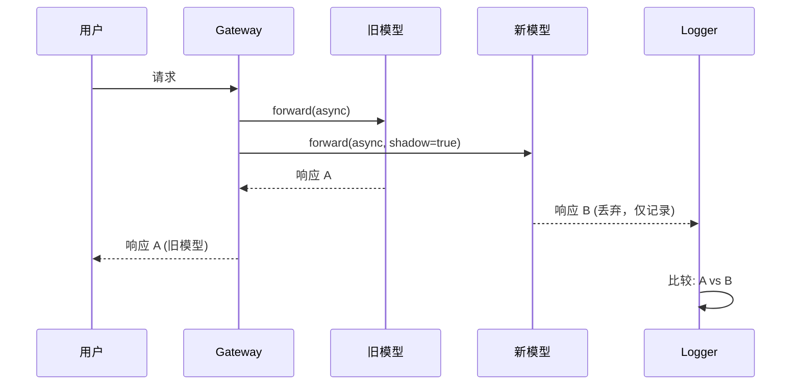

# 部署策略

## 模型替换策略

### Shadow Testing

**概念**：新模型接收实际生产流量，但不向用户返回响应。仅返回旧模型的响应，新模型输出仅用于日志/评估。



**何时使用**：
- 想要在**无风险**的情况下验证新模型的延迟、错误率和输出质量时
- 可以承担成本（每个请求 2 倍成本）

**实现示例(Python, LiteLLM)**：LiteLLM 没有原生 shadow 功能，需要直接实现：

```python
import asyncio
from litellm import acompletion

async def shadow_call(user_request):
    # 旧模型(production)
    old_task = acompletion(model="gpt-4", messages=user_request)
    # 新模型(shadow)
    new_task = acompletion(model="claude-3-5-sonnet-20241022", messages=user_request)
    
    old_resp, new_resp = await asyncio.gather(old_task, new_task, return_exceptions=True)
    
    # 记录：比较两个响应
    log_to_langfuse(user_request, old_resp, new_resp, shadow=True)
    
    # 仅向用户返回旧模型响应
    return old_resp
```

**优点**：
- 不影响用户体验
- 使用实际流量模式测试

**缺点**：
- 成本 2 倍
- 无法收集用户反馈（用户看不到 shadow 响应）

---

### Canary Rollout

**概念**：从少量流量(5%)开始，逐步提高比例。

```
5% → 观察(24h) → 无问题则 25% → 50% → 100%
```

**何时使用**：
- 新模型已充分验证，但生产全量替换风险较大时
- 需要在回归检测时快速回滚

**实现示例(LaunchDarkly)**：通过 Feature Flag 控制模型选择

```python
from ldclient import LDClient, Context

ld_client = LDClient(sdk_key="your-key")

def get_model_for_user(user_id: str):
    context = Context.builder(user_id).kind("user").build()
    model = ld_client.variation("llm-model-selection", context, default="gpt-4")
    return model

# 在 LaunchDarkly 控制台将 "llm-model-selection" flag 设置为 5% claude-3-5-sonnet, 95% gpt-4
```

**监控标准**：
- Canary 组 vs Control 组的**成功率**(200 响应比例)
- **Latency P50/P99** 差异
- **用户反馈**(thumbs up/down) 比例
- **成本**(token 使用量)

**自动回滚触发器**：
```yaml
# 示例：Prometheus AlertManager 规则
- alert: CanaryRegressionDetected
  expr: |
    (rate(llm_success_total{model="claude-3-5-sonnet"}[5m]) 
     / rate(llm_requests_total{model="claude-3-5-sonnet"}[5m]))
    < 0.95
  for: 10m
  annotations:
    summary: "Canary 成功率低于 95%，需要回滚"
```

**优点**：
- 渐进式风险分散
- 可以收集实际用户反馈

**缺点**：
- 部署周期变长（数天～数周）
- 必须具备监控基础设施

---

### A/B Testing

**概念**：将流量**随机分割**为两组(A: 旧模型, B: 新模型)，通过业务指标（转化率、用户满意度等）进行统计比较。

**何时使用**：
- 需要通过**统计显著性**证明"新模型真的更好"时
- 市场营销、UX 优化（提示词语气变更等）

**实验设计**：
1. **零假设**："新模型和旧模型性能无差异"
2. **对立假设**："新模型将转化率提高 5% 以上"
3. **样本量计算**：[AB Test Calculator](https://www.evanmiller.org/ab-testing/sample-size.html)  
   例：基线 10%，检测 5%p 改善，80% power → 每组需要 2,348 人
4. **实验周期**：直到收集足够样本（通常 1-4 周）

**实现示例(Unleash)**：

```typescript
import { UnleashClient } from 'unleash-client';

const unleash = new UnleashClient({
  url: 'https://unleash.example.com/api',
  appName: 'agent-service',
  customHeaders: { Authorization: 'your-token' }
});

function selectModel(userId: string): string {
  const context = { userId };
  // 'ab-test-claude-vs-gpt' variant: 50% 'A', 50% 'B'
  const variant = unleash.getVariant('ab-test-claude-vs-gpt', context);
  return variant.name === 'B' ? 'claude-3-5-sonnet-20241022' : 'gpt-4';
}
```

**分析**：实验结束后用 chi-square test 验证显著性

```python
from scipy.stats import chi2_contingency

# A: gpt-4, B: claude-3-5-sonnet
# 成功/失败 contingency table
obs = [[2100, 300],   # A: 2100 成功, 300 失败
       [2200, 200]]   # B: 2200 成功, 200 失败

chi2, p, dof, ex = chi2_contingency(obs)
print(f"p-value: {p}")  # p < 0.05 → B 统计显著优于 A
```

**优点**：
- 用数据证明业务影响
- 有利于市场营销、说服管理层

**缺点**：
- 实验周期长
- 需要统计专业知识
- 流量充足才能确保显著性

---

### Blue-Green Deployment

**概念**：同时运行旧环境(Blue)和新环境(Green)，然后**一次性**将流量切换到 Green。问题发生时立即切回 Blue。

**何时使用**：
- 替换模型服务基础设施本身时（vLLM 0.5 → 0.6）
- 与其说是提示词变更，更多是运行时变更

**实现示例(Kubernetes Service + Ingress)**：

```yaml
# blue-deployment.yaml
apiVersion: apps/v1
kind: Deployment
metadata:
  name: llm-blue
spec:
  replicas: 3
  selector:
    matchLabels:
      app: llm
      version: blue
  template:
    metadata:
      labels:
        app: llm
        version: blue
    spec:
      containers:
      - name: vllm
        image: vllm/vllm-openai:v0.5.4
        args: ["--model", "meta-llama/Llama-3.1-8B-Instruct"]
---
# green-deployment.yaml (新版本)
apiVersion: apps/v1
kind: Deployment
metadata:
  name: llm-green
spec:
  replicas: 3
  selector:
    matchLabels:
      app: llm
      version: green
  template:
    metadata:
      labels:
        app: llm
        version: green
    spec:
      containers:
      - name: vllm
        image: vllm/vllm-openai:v0.6.3
        args: ["--model", "meta-llama/Llama-3.1-8B-Instruct"]
---
# service.yaml (初始指向 blue)
apiVersion: v1
kind: Service
metadata:
  name: llm-service
spec:
  selector:
    app: llm
    version: blue  # ← 将此处改为 'green' 即可切换
  ports:
  - port: 8000
```

**切换流程**：
1. Green 部署完成 → Health check 确认
2. `kubectl patch svc llm-service -p '{"spec":{"selector":{"version":"green"}}}'`
3. 监控 5 分钟 → 无问题则删除 Blue
4. 问题发生时立即回滚到 `version: blue`

**优点**：
- 回滚速度最快（秒级）
- 切换过程简单

**缺点**：
- 基础设施成本 2 倍（切换期间）
- 没有渐进式验证（all-or-nothing）

---

## 基于 Feature Flag 的提示词展开

### LaunchDarkly

[LaunchDarkly](https://launchdarkly.com/) 是企业级 Feature Flag 平台。

**提示词展开示例**：

```python
from ldclient import LDClient, Context

ld_client = LDClient(sdk_key="sdk-key")

def get_prompt_version(user_id: str, org_id: str) -> int:
    context = Context.builder(user_id) \
        .kind("user") \
        .set("org_id", org_id) \
        .build()
    
    # flag 'prompt-version-financial': 可按组织定向
    # 例：org_id='acme-corp' → version=5, 其他 → version=4
    version = ld_client.variation("prompt-version-financial", context, default=4)
    return version
```

**Kill Switch**：紧急情况时将所有用户恢复到安全版本

```python
# 在 LaunchDarkly 控制台将 'prompt-version-financial' flag 强制设置为 4
# 无需代码更改，立即应用于所有用户
```

**定向规则示例**：
- **Beta 用户**：`user.beta == true` → 新版本
- **特定区域**：`user.region == "us-east-1"` → canary 版本
- **组织层级**：`user.tier == "enterprise"` → 优先提供最新版本

---

### Unleash

[Unleash](https://www.getunleash.io/) 是开源 Feature Flag 平台。

**优点**：
- 可以 Self-hosted
- Postgres 后端，RBAC、audit log 默认提供

**提示词展开**：

```typescript
import { Unleash } from 'unleash-client';

const unleash = new Unleash({
  url: 'https://unleash.internal.corp/api',
  appName: 'agent-gateway',
  customHeaders: { Authorization: 'token' }
});

function getPromptVariant(userId: string): string {
  const context = { userId, properties: { region: 'us-west-2' } };
  const variant = unleash.getVariant('prompt-experiment-2026-04', context);
  // variant.name: 'control', 'treatment-A', 'treatment-B'
  return variant.payload.value;  // 实际提示词文本或版本号
}
```

---

### AWS AppConfig

[AWS AppConfig](https://docs.aws.amazon.com/appconfig/latest/userguide/what-is-appconfig.html) 支持 Feature Flag 和动态配置。

**优点**：
- AWS 原生，与 Lambda/ECS/EKS 集成
- Deployment strategy: Linear, Canary, All-at-once
- 基于 CloudWatch 告警的自动回滚

**示例**：

```python
import boto3
import json

appconfig = boto3.client('appconfigdata')

session = appconfig.start_configuration_session(
    ApplicationIdentifier='agent-app',
    EnvironmentIdentifier='production',
    ConfigurationProfileIdentifier='prompt-config'
)
session_token = session['InitialConfigurationToken']

config = appconfig.get_latest_configuration(ConfigurationToken=session_token)
prompt_config = json.loads(config['Configuration'].read())

print(prompt_config['version'])  # 例：5
print(prompt_config['text'])
```

**部署策略**：
```json
{
  "DeploymentStrategyId": "AppConfig.Canary10Percent20Minutes",
  "Description": "向 10% 用户部署 20 分钟后扩大"
}
```

CloudWatch 告警(`LLMErrorRate > threshold`)发生时自动回滚。

---

## 部署策略比较

| 策略 | 风险 | 验证速度 | 成本 | 用户反馈 | 回滚速度 |
|------|-------|----------|------|-------------|----------|
| **Shadow** | 无 | 快 | 2倍 | 不可 | N/A |
| **Canary** | 低 | 中 | 1x | 可 | 快(分钟) |
| **A/B** | 中 | 慢 | 1x | 可 | 中(小时) |
| **Blue-Green** | 高 | 快 | 2倍(切换中) | 可 | 非常快(秒) |

**选择指南**：
- **初期验证**：Shadow → Canary 5%
- **业务影响测量**：A/B Testing
- **基础设施替换**：Blue-Green
- **需要紧急回滚**：Blue-Green + Canary 组合

---

## 参考资料

### Feature Flag 平台
- **LaunchDarkly**: [launchdarkly.com](https://launchdarkly.com/)
  - [AI/ML 相关文章](https://launchdarkly.com/blog/category/ai/)
- **Unleash**: [getunleash.io](https://www.getunleash.io/)
- **AWS AppConfig**: [AWS 文档](https://docs.aws.amazon.com/appconfig/latest/userguide/what-is-appconfig.html)

### 部署策略
- **Canary Deployment 模式**: [martinfowler.com/bliki/CanaryRelease.html](https://martinfowler.com/bliki/CanaryRelease.html)
- **Blue-Green Deployment**: [martinfowler.com/bliki/BlueGreenDeployment.html](https://martinfowler.com/bliki/BlueGreenDeployment.html)
- **Shadow Testing**: [Google SRE Workbook - Canarying Releases](https://sre.google/workbook/canarying-releases/)

### 统计检验
- **A/B Test Calculator**: [evanmiller.org/ab-testing](https://www.evanmiller.org/ab-testing/sample-size.html)
- **scipy.stats**: [docs.scipy.org/doc/scipy/reference/stats.html](https://docs.scipy.org/doc/scipy/reference/stats.html)

---

## 下一步

选择部署策略后：

1. **[治理·自动化](./governance-automation.md)** — 构建自动回归检测和回滚体系
2. **[提示词·模型注册中心](./prompt-model-registry.md)** — 构建版本管理体系
3. **[Agent 监控](../../../agentic-ai-platform/operations-mlops/observability/agent-monitoring.md)** — 构建实时 observability
