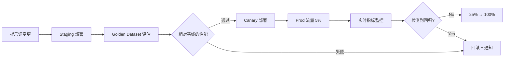

# 治理·自动化

## 回归检测集成

### 与 Evaluation Framework 连接

使用 [AIDLC Evaluation Framework](../../toolchain/evaluation-framework.md) 中定义的 **Golden Dataset**，在新版本部署前检测回归。

**工作流**：



---

### Baseline vs New 统计比较

**指标**：
- **准确率**：Exact Match, F1, BLEU(翻译)
- **质量**：LLM-as-Judge 分数(0-1)
- **延迟**：P50, P99
- **成本**：token 使用量

**统计检验**：

```python
from scipy.stats import ttest_ind

# baseline: 旧版本 100 个样本的 Exact Match 分数
baseline_scores = [...]  # 例：平均 0.82

# new: 新版本 100 个样本
new_scores = [...]  # 例：平均 0.85

t_stat, p_value = ttest_ind(baseline_scores, new_scores)

if p_value < 0.05 and mean(new_scores) > mean(baseline_scores):
    print("新版本统计显著优于旧版本 → 批准部署")
elif mean(new_scores) < mean(baseline_scores) * 0.95:
    print("新版本下降超过 5% → 回滚")
else:
    print("无显著差异 → 需要额外验证")
```

---

### 自动回滚触发器

**条件**：
1. **准确率绝对下降**：`new_exact_match < baseline_exact_match - 0.05`
2. **延迟回归**：`new_p99_latency > baseline_p99_latency * 1.5`
3. **错误率增加**：`new_error_rate > 5%`
4. **用户反馈**：`thumbs_down_rate > 20%`

**实现**：

```yaml
# Prometheus Alert
- alert: PromptRegressionDetected
  expr: |
    langfuse_eval_exact_match{prompt_version="6"} 
    < langfuse_eval_exact_match{prompt_version="5"} - 0.05
  for: 30m
  annotations:
    summary: "提示词 v6 准确率下降 → 自动回滚"
  # Webhook → Lambda → Langfuse API (将 production 标签恢复到 v5)
```

---

## 运营治理

### 变更审批工作流

**应用 AIDLC Checkpoints**：

| 阶段 | Checkpoint | 审批人 | 标准 |
|------|-----------|-------|------|
| 1. 提示词变更提案 | `[Answer]:` | 领域专家 | 明确意图和风险评估 |
| 2. Staging 评估结果 | 通过回归检测 | Lead Engineer | Exact Match ≥ 基线 - 2% |
| 3. Canary 5% 部署 | 实时指标审查 | SRE | 错误率 < 1%, P99 latency ≤ 1.2x |
| 4. Prod 100% 切换 | 最终批准 | Product Owner | 确认业务指标改善 |

**审批自动化(GitHub Actions + Langfuse)**：

```yaml
# .github/workflows/prompt-approval.yml
name: Prompt Approval
on:
  pull_request:
    paths:
      - 'prompts/**'
jobs:
  evaluate:
    runs-on: ubuntu-latest
    steps:
      - uses: actions/checkout@v4
      - name: Run Golden Dataset Eval
        run: |
          python scripts/eval_prompt.py --new-version ${{ github.sha }}
      - name: Post Results
        uses: actions/github-script@v7
        with:
          script: |
            const results = require('./eval_results.json');
            if (results.exact_match < results.baseline - 0.02) {
              core.setFailed('检测到回归：Exact Match 下降');
            }
            github.rest.issues.createComment({
              issue_number: context.issue.number,
              body: `### 评估结果\n- Baseline: ${results.baseline}\n- New: ${results.exact_match}\n- 判定: ${results.pass ? '✅ 批准' : '❌ 拒绝'}`
            });
```

---

### 变更记录(Audit Log)

**Langfuse**：所有提示词变更自动记录到版本历史。另外：

```python
# 变更时记录元数据
client.create_prompt(
    name="financial-analysis",
    prompt="...",
    labels=["production"],
    metadata={
        "changed_by": "jane@example.com",
        "jira_ticket": "AIDLC-1234",
        "approval": "approved_by_john_2026-04-17",
        "rollback_plan": "revert to v5 if error_rate > 5%"
    }
)
```

**AWS CloudTrail**：使用 Bedrock Prompt Management 时

```json
{
  "eventName": "UpdatePromptAlias",
  "userIdentity": {
    "principalId": "AIDAI...",
    "arn": "arn:aws:iam::123456789012:user/jane"
  },
  "requestParameters": {
    "promptIdentifier": "fin-analysis",
    "aliasIdentifier": "PROD",
    "promptVersion": "6"
  },
  "eventTime": "2026-04-17T14:30:00Z"
}
```

---

### 回滚计划必须

所有变更请求必须附带 **Rollback Plan**：

```markdown
## Rollback Plan

**触发器**：部署后 30 分钟内错误率 > 3%

**步骤**：
1. 在 Langfuse 将 `production` 标签恢复到 v5
2. 重启 Gateway（无需 pod restart，Langfuse SDK 每 30 秒轮询一次）
3. 在 Slack #incident 频道通知
4. 撰写 PostMortem（原因、防止再发措施）

**验证**：
- 确认错误率 < 1% 恢复
- 监控 5 分钟后关闭 incident
```

---

### 审计证据

金融、医疗等行业要求的**审计证据**：

| 项目 | 记录位置 | 保存期限 |
|------|----------|----------|
| 提示词版本 | Langfuse DB (S3+KMS) | 7年 |
| 模型版本 | 推理日志(trace) | 7年 |
| 审批记录 | GitHub PR + JIRA | 7年 |
| 评估结果 | Braintrust/Langfuse Eval | 3年 |
| 用户会话 | Langfuse Trace | 1年 |
| 回滚事件 | CloudTrail + PagerDuty | 7年 |

**示例查询(应对审计员请求)**：

```sql
-- "2026年4月17日14时谁部署了提示词 v6？"
SELECT version, metadata->>'changed_by', metadata->>'jira_ticket', created_at
FROM langfuse_prompts
WHERE name = 'financial-analysis'
  AND created_at BETWEEN '2026-04-17 14:00:00' AND '2026-04-17 15:00:00';
```

---

## AIDLC 阶段应用

### Construction Phase

**提示词也要和代码一起 Code Review**：

```
repo/
  src/
    agents/
      financial_analyst.py
  prompts/
    financial_analysis_v5.txt  # ← 提示词也要版本管理
  tests/
    test_financial_analyst.py  # Golden Dataset 评估
```

**PR 模板**：

```markdown
## 变更内容
- 提示词 v5 → v6：强化"保守型投资顾问"语气

## 评估结果
- Exact Match: 0.82 → 0.85 (+3%p)
- LLM-as-Judge: 0.78 → 0.81 (+3%p)
- Latency P99: 1.2s → 1.3s (增加10%，在允许范围内)

## 回滚计划
- 触发器：错误率 > 3%
- 操作：Langfuse production 标签 → 恢复 v5

## Approval
- [x] 领域专家 (jane@) 批准
- [x] Golden Dataset 评估通过
- [ ] 等待 SRE 批准
```

---

### Operations Phase

**渐进 Rollout + 实时回归检测**：

| 时间 | 部署比例 | 监控 |
|------|----------|----------|
| D+0 14:00 | Canary 5% 开始 | CloudWatch 仪表板实时 |
| D+0 16:00 | 错误率 0.8% ✅ | 扩大到 25% |
| D+0 20:00 | 错误率 1.2% ✅ | 扩大到 50% |
| D+1 10:00 | 错误率 0.9% ✅ | 切换到 100% |
| D+1 14:00 | **错误率 5.2% ❌** | **触发自动回滚** |
| D+1 14:05 | 回滚完成，恢复 v5 | 撰写 Incident PostMortem |

**实时仪表板(Grafana)**：

```promql
# Canary vs Control 错误率
rate(llm_errors_total{prompt_version="6"}[5m]) 
/ rate(llm_requests_total{prompt_version="6"}[5m])

# Latency P99
histogram_quantile(0.99, 
  rate(llm_latency_bucket{prompt_version="6"}[5m])
)
```

---

## 自动化工具集成

### Langfuse + Prometheus + Alertmanager

```yaml
# prometheus-rules.yaml
groups:
  - name: langfuse_regression
    interval: 1m
    rules:
      - alert: PromptVersionRegressionDetected
        expr: |
          langfuse_exact_match{prompt_version=~"v6"} 
          < on(prompt_name) langfuse_exact_match{prompt_version="v5"} - 0.05
        for: 30m
        labels:
          severity: critical
        annotations:
          summary: "检测到提示词 v6 回归"
          description: "{{ $labels.prompt_name }} v6 Exact Match 相比 v5 下降超过 5%p"
          
      - alert: LatencyRegressionDetected
        expr: |
          histogram_quantile(0.99, 
            rate(llm_latency_bucket{prompt_version="v6"}[10m])
          ) > 
          histogram_quantile(0.99, 
            rate(llm_latency_bucket{prompt_version="v5"}[10m])
          ) * 1.5
        for: 15m
        labels:
          severity: warning
        annotations:
          summary: "P99 Latency 超过 1.5 倍"
```

### Lambda 自动回滚

```python
# lambda_rollback.py
import boto3
from langfuse import Langfuse

def lambda_handler(event, context):
    """
    Alertmanager Webhook → Lambda → Langfuse 回滚
    """
    alert = event['alerts'][0]
    prompt_name = alert['labels']['prompt_name']
    current_version = alert['labels']['prompt_version']
    
    # 在 Langfuse 查询上一版本
    client = Langfuse()
    versions = client.list_prompt_versions(prompt_name)
    previous_version = int(current_version.replace('v', '')) - 1
    
    # 将 Production 标签回滚到上一版本
    client.update_prompt_label(
        prompt_name, 
        version=previous_version, 
        label="production"
    )
    
    # Slack 通知
    slack_webhook(
        f"🔴 执行自动回滚：{prompt_name} 恢复到 v{previous_version}"
    )
    
    return {"status": "rolled_back", "version": previous_version}
```

---

## 参考资料

### AIDLC 关联文档
- [Evaluation Framework](../../toolchain/evaluation-framework.md) — 基于 Golden Dataset 的回归检测
- [Agent 监控](../../../agentic-ai-platform/operations-mlops/agent-monitoring.md) — 实时 observability

### 监控·告警
- **Prometheus**: [prometheus.io](https://prometheus.io/)
- **Grafana**: [grafana.com](https://grafana.com/)
- **Alertmanager**: [prometheus.io/docs/alerting](https://prometheus.io/docs/alerting/latest/alertmanager/)

### 统计检验
- **scipy.stats**: [docs.scipy.org/doc/scipy/reference/stats.html](https://docs.scipy.org/doc/scipy/reference/stats.html)
- **Statsmodels**: [statsmodels.org](https://www.statsmodels.org/)

---

## 下一步

构建治理体系后：

1. **[提示词·模型注册中心](./prompt-model-registry.md)** — 构建版本管理系统
2. **[部署策略](./deployment-strategies.md)** — 实现 Canary/Shadow 策略
3. **[Agent 监控](../../../agentic-ai-platform/operations-mlops/agent-monitoring.md)** — 构建 Langfuse + Prometheus 集成 observability
