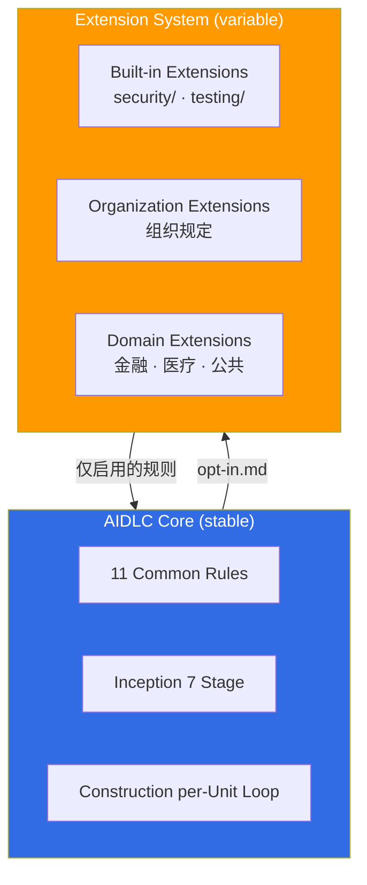
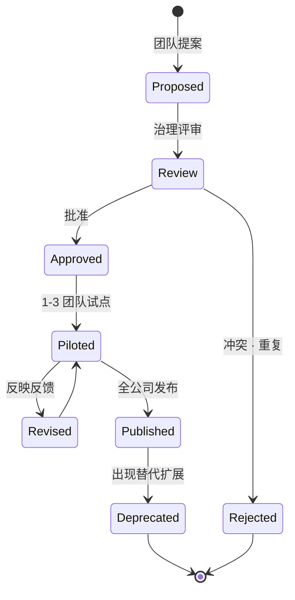

# Extension System

> 📅 **撰写日期**: 2026-04-18 | ⏱️ **阅读时间**: 约 15 分钟

AWS Labs [AIDLC Workflows](https://github.com/awslabs/aidlc-workflows) 除了官方 5 大原则与 11 项 Common Rules 之外,还提供了 **Extension System** 用于 **追加组织特定的监管 · 领域规则**。本文介绍 Extension 架构、Built-in 扩展、opt-in 运行机制,以及面向韩国企业 (ISMS-P (韩国信息安全管理体系 - 个人信息) · 韩国电子金融监督规定 (전자금융감독규정)) 的应用示例。

---

## 1. 概览: 为什么需要 Extension

### 1.1 Core 与 Extension 分离原则

AIDLC 明确划分 **方法论核心 (stable)** 与 **组织规则 (variable)**。



**核心原则:**
- Core 是 **适用于所有组织与行业** 的最小通用规则
- Extension **按组织 · 行业 · 项目选择性应用**
- **`opt-in.md` 文件的存在与内容决定启用与否**

### 1.2 Extension 引入效果

| 效果 | 说明 | 示例 |
|------|------|------|
| **监管响应** | 将行业法规嵌入 AIDLC 工作流 | 金融业反映韩国电子金融监督规定 (전자금융감독규정) |
| **组织标准化** | 将团队标准模板 · 清单拆为可复用模块 | 架构决策记录 (ADR) 模板 |
| **渐进落地** | 先导入核心方法论,再扩展组织特化 | MVP 上线后追加 Compliance |
| **工具独立** | Extension 以 Markdown + YAML 表达,可在所有 AIDLC 平台运行 | Kiro · Claude Code · Cursor |

---

## 2. Built-in Extensions

AWS Labs 仓库默认提供 2 个 **Built-in Extension**: `security/` 和 `testing/`。

### 2.1 security/ 扩展

**目的**: 将安全需求的抽取 · 校验 · 强制整合到 AIDLC 工作流中。

**主要规则:**
```yaml
# extensions/security/rules.yaml
security_extension:
  version: 0.1.0
  applies_to_stages:
    - requirements_analysis
    - application_design
    - construction.code_generation
    - construction.build_and_test

  rules:
    - id: SEC-001
      name: "Threat Modeling Required"
      stage: application_design
      action: "必须生成基于 STRIDE 的威胁建模文档"

    - id: SEC-002
      name: "Secrets Scanning"
      stage: construction.build_and_test
      action: "自动执行 git-secrets + truffleHog,阻断硬编码凭据"

    - id: SEC-003
      name: "SAST Integration"
      stage: construction.build_and_test
      action: "至少执行 Semgrep / Snyk / Checkov 中的一项"

    - id: SEC-004
      name: "Dependency Vulnerability Check"
      stage: construction.build_and_test
      action: "执行 OSV-Scanner 或 Trivy,Critical 漏洞阻断合并"

    - id: SEC-005
      name: "Least Privilege IAM"
      stage: construction.infrastructure_design
      action: "IAM Policy 禁止使用 wildcard Resource (特殊情况需说明正当性)"
```

### 2.2 testing/ 扩展

**目的**: 自动生成测试、管理覆盖率、强制质量门禁。

**主要规则:**
```yaml
# extensions/testing/rules.yaml
testing_extension:
  version: 0.1.0
  applies_to_stages:
    - construction.functional_design
    - construction.code_generation
    - construction.build_and_test

  rules:
    - id: TEST-001
      name: "TDD First"
      stage: construction.code_generation
      action: "先生成测试代码,再生成生产代码"

    - id: TEST-002
      name: "Minimum Coverage"
      stage: construction.build_and_test
      action: "单元测试覆盖率 ≥ 80%,失败时阻断 Checkpoint Approval"

    - id: TEST-003
      name: "Integration Test Required"
      stage: construction.build_and_test
      action: "必须为外部依赖 (DB、API) 编写集成测试"

    - id: TEST-004
      name: "Acceptance Test Linkage"
      stage: construction.functional_design
      action: "为每项 Functional Requirement 映射对应的 Acceptance Test"
```

---

## 3. Opt-in 机制

### 3.1 opt-in.md 文件结构

Extension 的启用通过项目根目录下的 **`opt-in.md`** 文件控制。

**位置**: `<project-root>/.aidlc/opt-in.md`

**文件结构:**
```markdown
# AIDLC Opt-in Extensions

**Project**: payment-service
**Updated**: 2026-04-18

## Enabled Extensions

### Built-in
- [x] security (version 0.1.0)
- [x] testing (version 0.1.0)

### Organization
- [x] org-lg-security (version 1.2.0) — LG CNS 内部安全标准
- [x] org-compliance-ismsp (version 2.1.0) — ISMS-P (韩国信息安全管理体系 - 个人信息) 认证标准

### Domain
- [x] finance-korea (version 1.0.0) — 韩国电子金融监督规定 (전자금융감독규정)

## Disabled Extensions (显式拒绝)

- [ ] healthcare-hipaa — 不适用 (金融服务)
- [ ] public-sector-korea — 不适用
```

### 3.2 Requirements Analysis 阶段的 opt-in 提问

AIDLC 的 Requirements Analysis stage 会读取 `opt-in.md` 文件以确认已启用的扩展。**若文件不存在或未指定扩展**,则按 Common Rules 规则 1 (Question Format) 向用户提问:

```markdown
Q. 请选择要在本项目应用的 Extension (可多选):

A. 仅 security (默认值,推荐所有项目)
B. security + testing (标准,一般生产项目)
C. security + testing + 组织规定 (企业级)
D. C + 行业监管 (金融 / 医疗 / 公共)
E. None (仅限演示 · PoC,禁止生产)

[Answer]:
```

**回答后自动生成:**
- `[Answer]: C` → AIDLC 自动在 `opt-in.md` 中添加 security、testing、组织扩展

### 3.3 Extension 优先级

当多个扩展中存在 **冲突规则** 时的优先级:

```
1. Common Rules (最高优先、官方规范)
2. Domain Extensions (行业监管)
3. Organization Extensions (组织标准)
4. Built-in Extensions (security、testing)
5. Project-local overrides (最低)
```

**冲突解决示例:**
```
Common Rules 11: Reproducible — 推荐 Temperature = 0
Organization Extension (金融): 允许 Temperature = 0.1 (允许部分创造性)

→ Common Rules 优先 → 强制 Temperature = 0
→ 若组织确需偏离,需执行 Common Rules 的 waiver 流程
```

---

## 4. 组织合规扩展示例

### 4.1 韩国 ISMS-P 扩展

**背景**: ISMS-P (韩国信息安全管理体系 - 个人信息) 是要求遵守韩国信息保护相关法规的民间认证。对承接公共合同 · 金融服务而言实质上是必备要求。

**扩展目录结构:**
```
extensions/org-compliance-ismsp/
  rules.yaml
  templates/
    pia-template.md           # 个人信息影响评估 (PIA)
    access-control-matrix.md
    incident-response-plan.md
  audit-mappings/
    ismsp-2.1.yaml           # ISMS-P 2.1 管理措施
    ismsp-2.8.yaml           # 个人信息处理阶段要求
```

**rules.yaml 示例:**
```yaml
extension:
  name: org-compliance-ismsp
  version: 2.1.0
  description: ISMS-P 2.1 认证标准与 AIDLC 整合
  applies_to:
    industries: [finance, public, healthcare]
    regions: [KR]

  rules:
    - id: ISMSP-2.5.1
      name: "用户账户管理"
      stage: application_design
      common_rules_mapping: [checkpoint_approval, audit_logging]
      action: |
        设计用户认证 · 授权时强制:
        - 密码策略 (≥ 9 位,≥ 3 种字符组合)
        - 会话超时 (静置 ≥ 10 分钟自动登出)
        - 连续登录失败 5 次锁定账户

    - id: ISMSP-2.8.2
      name: "个人信息处理阶段要求"
      stage: requirements_analysis
      action: |
        对个人信息收集 · 使用 · 提供 · 销毁全阶段明示要求:
        - 收集最小化原则
        - 禁止超目的使用
        - 加密存储 (AES-256 及以上)
        - 保存期限超过后自动销毁

    - id: ISMSP-2.9.1
      name: "信息安全事件响应"
      stage: operations.observability
      action: |
        检测到安全事件后 24 小时内报备体系:
        - 对接 KISA 报备
        - 通知相关方
        - 取证证据保存
```

### 4.2 韩国金融监督规定扩展

**背景**: 韩国电子金融监督规定 (전자금융감독규정) (金融监督院) 以及网络分离 · ISMS-P 的强制义务。

**rules.yaml 节选:**
```yaml
extension:
  name: finance-korea
  version: 1.0.0
  description: 韩国电子金融监督规定 (전자금융감독규정) 与 AIDLC 整合
  applies_to:
    industries: [finance]
    regions: [KR]

  rules:
    - id: EFSR-8
      name: "网络分离义务"
      stage: application_design
      action: |
        必须在逻辑 · 物理层面分离开发网 · 业务网 · 运行网:
        - EKS 集群独立 VPC
        - 禁止直接访问互联网 (经 Egress 代理)
        - 仅允许经 Bastion Host 访问

    - id: EFSR-13
      name: "敏感信息加密"
      stage: construction.infrastructure_design
      action: |
        银行卡号 · 韩国身份证号 · 账号应遵守:
        - 存储时: AES-256 + KMS 密钥分离
        - 传输时: TLS 1.3 以上
        - 日志: 必须掩码 (≥ 6 位)

    - id: EFSR-DR
      name: "灾难恢复义务"
      stage: application_design
      action: |
        必须建设灾备中心 (RTO ≤ 3 小时、RPO ≤ 24 小时):
        - Multi-AZ 部署
        - Cross-Region 备份
        - 每年至少 1 次 DR 演练
```

---

## 5. 自定义 Extension 编写指南

### 5.1 目录结构

```
extensions/<extension-name>/
  metadata.yaml          # 扩展元数据 (必需)
  rules.yaml             # 应用规则 (必需)
  templates/             # 产物模板 (可选)
    <template-name>.md
  audit-mappings/        # 审计 · 监管映射 (可选)
    <regulation>.yaml
  scripts/               # 自动化脚本 (可选)
    validate.sh
  README.md              # 使用指南 (必需)
```

### 5.2 metadata.yaml 规格

```yaml
extension:
  name: org-lg-security
  version: 1.2.0
  description: "LG CNS 内部安全标准与 AIDLC 整合"
  author: security-team@lgcns.com
  license: Proprietary
  created: 2026-02-15
  updated: 2026-04-10

  dependencies:
    - name: security        # 依赖 Built-in security 扩展
      version: ">=0.1.0"

  conflicts: []             # 冲突扩展列表

  applies_to:
    stages: [requirements_analysis, application_design, construction, operations]
    industries: []          # 空数组 = 所有行业
    regions: [KR]

  checksum: sha256:abc123... # 防篡改
```

### 5.3 rules.yaml 规格

```yaml
rules:
  - id: <UNIQUE-ID>
    name: "<人类可读名称>"
    description: "<规则详细说明>"
    severity: [low | medium | high | critical]
    stage: <target stage>
    common_rules_mapping:
      - <common rule name>  # 例如: checkpoint_approval
    action: |
      <具体执行指示,可多行>
    validation:
      command: <自动校验命令>
      expected_exit_code: 0
    references:
      - url: https://example.com/regulation
        title: "相关监管文档"
```

### 5.4 Extension 测试

部署新 Extension 前必做测试:

```bash
# 1. 语法校验
aidlc extension validate extensions/<extension-name>/

# 2. 冲突检查
aidlc extension check-conflicts --existing opt-in.md --new <extension-name>

# 3. 试点运行
aidlc run --pilot --extensions <extension-name> --input sample-request.md

# 4. 比对结果 (与未启用扩展的结果做 diff)
diff .aidlc/baseline/ .aidlc/pilot/
```

---

## 6. Extension 治理

### 6.1 Extension 生命周期



### 6.2 Extension 注册表

组织运营内部 Extension Registry 以管理扩展:

```yaml
# internal-registry.yaml
registry:
  url: https://extensions.lgcns.internal/aidlc/
  extensions:
    - name: org-lg-security
      version: 1.2.0
      status: published
      owner: security-team
      reviewed_at: 2026-04-10

    - name: org-compliance-ismsp
      version: 2.1.0
      status: published
      owner: compliance-team
      reviewed_at: 2026-03-20

    - name: domain-banking-kr
      version: 0.5.0-beta
      status: piloted
      owner: banking-domain-team
      reviewed_at: 2026-04-05
```

### 6.3 Extension 监控指标

衡量 Extension 是否真正创造价值:

| 指标 | 测量方式 | 目标 |
|------|----------|------|
| 应用率 | 启用该扩展的项目数 / 全部项目 | >80% |
| 规则触发频率 | 按月各规则的 warning · error 次数 | 团队 vs 组织均值比较 |
| 合规通过率 | 启用扩展项目的审计通过率 | 100% |
| 开发速度影响 | 启用扩展前后 lead time | ≤ 15% 下降可接受 |

---

## 7. 参考资料

### 官方仓库
- [AWS Labs AIDLC Extensions](https://github.com/awslabs/aidlc-workflows/tree/main/aws-aidlc-rule-details/extensions) — Built-in extension 原文
- [AWS Labs AIDLC Common Rules](https://github.com/awslabs/aidlc-workflows/tree/main/aws-aidlc-rule-details/common) — 与 Extension 交互的通用规则

### 相关文档
- [Common Rules](../methodology/common-rules.md) — 与 Extension 并行应用的 11 项通用规则
- [治理框架](./governance-framework.md) — 组织扩展的治理整合
- [落地策略](./adoption-strategy.md) — 扩展引入顺序 (Phase 1-4)
- [Audit & Governance Logging](../operations/audit-governance.md) — Extension 规则触发历史审计

### 监管参考
- [KISA ISMS-P (韩国信息安全管理体系 - 个人信息) 认证标准](https://isms.kisa.or.kr/) — ISMS-P 2.1/2.8/2.9 管理措施
- [韩国电子金融监督规定 (전자금융감독규정) (金融监督院)](https://fss.or.kr/) — 网络分离 · 加密 · 灾备义务
- [韩国个人信息保护法施行令](https://law.go.kr/) — 个人信息处理义务条款
