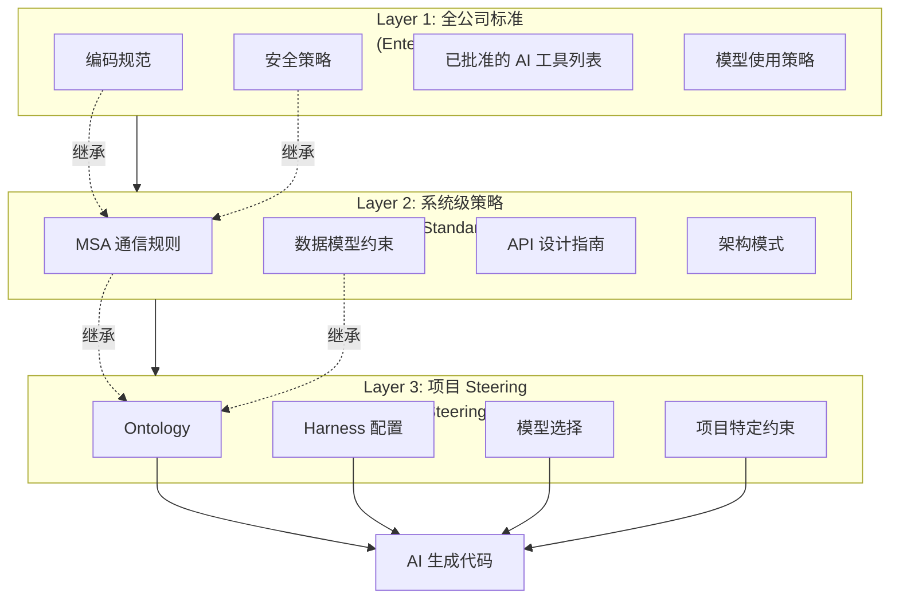
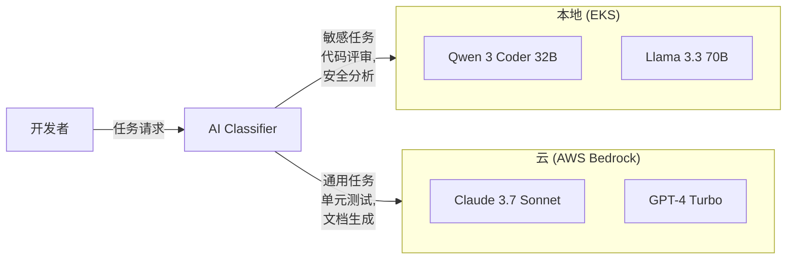

# 治理框架

当 AIDLC 向全公司扩散时,系统化管理 AI 生成代码的质量、安全、合规的治理框架。

## 治理的必要性

### AI 编码代理扩散的挑战

随着 AI 编码代理成为开发工作流的核心工具,组织面临新的治理挑战:

**质量一致性问题**
- 每个项目使用不同提示、不同质量标准
- 生成代码的质量依赖于提示编写者的能力
- 缺乏自动校验是否遵循全公司编码规范的手段

**安全风险增加**
- 需要自动检测 AI 生成代码的安全漏洞
- 敏感代码 / 数据可能泄露到外部 AI 服务
- 未授权 AI 工具被随意使用

**合规要求**
- 韩国 AI 基本法 (韩国,2026)、EU AI Act 等监管应对
- 保障 AI 生成代码的可追溯性 (traceability)
- 审计 (audit) 时须提交 AI 使用历史

**扩展性限制**
- 项目单独引入 AI 工具会重复投入
- 学习成果无法扩散到整个组织
- 需要在全公司标准与项目特性之间取得平衡

### 治理框架的角色

系统化的治理框架可实现:

1. **策略自动应用**: 通过 Steering 文件自动注入全公司标准
2. **风险最小化**: 通过数据主权策略保护敏感信息
3. **合规遵循**: 系统化应对 AI 基本法等法律要求
4. **持续改进**: 基于审计追踪数据完善策略

## 3 层治理模型

AIDLC 采用 "全公司—系统—项目" 的 3 层治理模型。



### Layer 1: 全公司标准 (Enterprise Policy)

适用于所有项目的最高层策略。

**编码规范**
- 各语言风格指南 (例如 Google Java Style Guide)
- 命名约定、注释策略
- 代码复杂度上限 (Cyclomatic Complexity ≤ 15)

**安全策略**
- 禁止 OWASP Top 10 漏洞 (SQL Injection、XSS 等)
- 必备的认证 / 授权实现模式
- 禁止敏感信息写日志
- 禁止硬编码凭据

**已批准 AI 工具列表**
- 可用的编码代理 (Aider、Continue、Cursor 等)
- 已批准的 LLM 提供商 (AWS Bedrock、Azure OpenAI 等)
- 按数据分类可用模型矩阵

**模型使用策略**
- 代码生成: GPT-4 Turbo / Claude 3.7 Sonnet / Qwen 3 Coder
- 安全评审: 本地部署 Open-Weight 模型
- 文档生成: GPT-4o-mini 等轻量模型

### Layer 2: 系统级策略 (System Architecture Standards)

定义特定系统或领域的架构模式。

**MSA 通信规则**
```yaml
# 示例: 微服务架构标准
communication:
  sync: gRPC (internal), REST (external)
  async: Kafka (event-driven), SNS/SQS (cloud-native)
  circuit-breaker: Istio 默认启用
  timeout: 3 秒 (default), 30 秒 (batch)
```

**数据模型约束**
- 按领域定义实体 (订单、支付、配送等)
- 必备属性 (created_at、updated_at、tenant_id)
- 外键命名规则

**API 设计指南**
- RESTful 资源命名 (/orders/\{orderId\}/items)
- HTTP 方法 (GET: 查询、POST: 创建、PUT/PATCH: 修改、DELETE: 删除)
- 分页参数 (page、size、sort)
- 错误响应格式 (RFC 9457 Problem Details)

**架构模式**
- Repository 模式 (数据访问层)
- CQRS (读写分离)
- Saga 模式 (分布式事务)

### Layer 3: 项目 Steering (Project Steering Files)

包含项目特有 AI 指令的 Steering 文件。

**Ontology**
- 项目领域词典
- 实体关系 (例如 Order → OrderItem → Product)
- 禁用术语 (例如 用 "replica" 代替 "slave")

详情参见 [Ontology](../methodology/ontology-engineering.md)。

**Harness 配置**
- Quality Gate 阈值 (代码覆盖率 ≥ 80%、代码重复 ≤ 3%)
- 必备评审者 (至少 1 位资深开发者)
- 部署审批策略 (Staging → 生产阶段部署)

详情参见 [Harness](../methodology/harness-engineering.md)。

**模型选择**
```yaml
# 示例: 按项目的模型路由
models:
  code_generation: Claude Sonnet 4.6  # 复杂业务逻辑
  code_review: qwen3-coder-32b-instruct # 本地部署安全评审
  test_generation: gpt-4o-mini          # 单元测试生成
  documentation: Claude Haiku 4.5       # API 文档自动生成
```

**项目特定约束**
```yaml
# 示例: 遗留对接约束
legacy_integration:
  - 禁止: JPA N+1 查询 (必须使用 fetch join)
  - 必须: 事务超时不超过 5 秒
  - 禁止: 同步 HTTP 调用 (使用异步消息)
```

## 基于 Steering 文件的治理自动化

### 什么是 Steering 文件

Steering File 是被注入 AI 编码代理的项目特定约束文件。

**目录结构**
```
project-root/
  .aidlc/
    steering.yaml          # 项目 Steering (Layer 3)
    system-standards.yaml  # 继承系统标准 (Layer 2)
    enterprise-policy.yaml # 继承全公司标准 (Layer 1)
  .aider/
    AIDLC-context.md       # Aider 专用上下文
  .continue/
    config.json            # Continue 专用配置
  CLAUDE.md                # Claude Code 专用指令
```

**steering.yaml 示例**
```yaml
project: order-management-service
version: 2.1.0

# Layer 1: 继承全公司标准
inherits:
  - /enterprise/coding-standards/java-style-guide.yaml
  - /enterprise/security/owasp-top10-prevention.yaml

# Layer 2: 继承系统标准
system_standards:
  - /systems/msa-communication-rules.yaml
  - /systems/data-model-constraints.yaml

# Layer 3: 项目设置
ontology:
  domain: e-commerce
  entities:
    - Order: 订单实体 (ID、customer、items、total、status)
    - OrderItem: 订单项 (ID、product、quantity、price)
  forbidden_terms:
    - master/slave → leader/follower
    - blacklist/whitelist → denylist/allowlist

harness:
  quality_gate:
    code_coverage: 80
    duplication: 3
    cognitive_complexity: 15
  mandatory_reviewers:
    - team: senior-backend
      min_approvals: 1

model_routing:
  code_generation: Claude Sonnet 4.6
  code_review: qwen3-coder-32b-instruct  # on-premises
  test_generation: gpt-4o-mini

constraints:
  - no_jpa_n_plus_1_query
  - transaction_timeout_5s
  - async_messaging_only
```

### 多 LLM Steering

根据不同 LLM 厂商优化 Steering 格式。

**Claude Code (CLAUDE.md)**
```markdown
# Project Instructions

## Domain Model
- Order: 订单实体
- OrderItem: 订单项

## Constraints
- 禁止 JPA N+1 查询 (必须使用 fetch join)
- 事务超时不超过 5 秒
```

**Aider (.aider/AIDLC-context.md)**
```markdown
# AIDLC Context

You are working on an e-commerce order management service.

## Key Entities
- Order, OrderItem, Product

## Rules
- Always use fetch join to prevent N+1 queries
- Transaction timeout: 5 seconds
```

**Continue (.continue/config.json)**
```json
{
  "systemMessage": "You are an AI assistant for order-management-service. Follow JPA N+1 prevention rules and 5-second transaction timeout.",
  "models": [
    {
      "title": "Claude 3.7 Sonnet",
      "provider": "anthropic",
      "model": "Claude Sonnet 4.6"
    }
  ]
}
```

### Governance as Code

将 Steering 文件纳入 Git 仓库,追踪变更历史并适用 PR 评审。

**Git 工作流**
```bash
# 修改 Steering 文件
git checkout -b update-steering-file
vim .aidlc/steering.yaml

# 提交变更
git add .aidlc/steering.yaml
git commit -m "feat: add async messaging constraint"

# 创建 PR → 资深开发者评审 → 审批后合并
gh pr create --title "Update steering file with async messaging rule"
```

**自动校验 CI/CD**
```yaml
# .github/workflows/steering-validation.yml
name: Validate Steering File
on: [pull_request]
jobs:
  validate:
    runs-on: ubuntu-latest
    steps:
      - uses: actions/checkout@v4
      - name: Validate steering.yaml schema
        run: |
          yamllint .aidlc/steering.yaml
          python scripts/validate-steering-schema.py
      - name: Check policy inheritance
        run: |
          python scripts/check-policy-inheritance.py
```

**版本管理**
- 在 Steering 文件中明示 `version` 字段
- 不兼容变更时升级主版本号
- AI 编码代理仅使用兼容版本

## 数据主权与驻留

### 敏感代码 / 数据保护要求

企业环境中以下数据不得向外部 AI 服务传输:

- **源代码**: 核心业务逻辑、算法
- **数据库 schema**: 客户信息、金融交易结构
- **API key / 凭据**: 云资源访问令牌
- **个人信息**: GDPR、韩国个人信息保护法 (PIPA) 适用数据

### 混合模型架构

敏感任务使用本地部署 Open-Weight 模型,通用任务使用云 API。



**敏感任务 (本地)**
- 代码安全评审 (分析 SAST 结果)
- 可能含个人信息的日志分析
- 生成数据库迁移脚本

**通用任务 (云)**
- 单元测试生成
- API 文档自动生成
- 重构建议 (去除敏感信息后)

### 数据分类体系

依据组织的数据分类策略限制 AI 工具使用。

| 数据分类 | 定义 | 允许的 AI 工具 | 示例 |
|----------|------|----------------|------|
| **公开** | 对外可公开 | 所有云 AI | 开源库代码 |
| **内部** | 员工可见 | 云 AI (签订数据处理合同的厂商) | 内部工具函数 |
| **机密** | 限定团队可访问 | 本地 Open-Weight 模型 | 业务逻辑、DB schema |
| **绝密** | 仅管理层 / 安全团队 | 禁止使用 AI (人工开发) | 加密密钥、认证逻辑 |

**Steering 文件应用**
```yaml
data_classification:
  level: confidential  # 机密
  allowed_models:
    - qwen3-coder-32b-instruct  # 本地
    - llama-3-3-70b-instruct    # 本地
  forbidden_models:
    - claude-*   # 禁止云 AI
    - gpt-*      # 禁止云 AI
```

### 驻留策略

在有数据驻留监管的国家 (如 EU、中国),保证数据不出该地域。

**按地域的模型路由**
```yaml
# 示例: EU 项目
region: eu-west-1
residency_policy:
  - 所有 AI 推理在 EU 区域执行
  - 可用模型: AWS Bedrock eu-west-1、Azure OpenAI Europe
  - 不可用模型: 美国为基础的 API (OpenAI、Anthropic Direct)
```

## AI 基本法合规 (韩国)

### 2026 韩国 AI 基本法 (AI 기본법) 核心要求

韩国人工智能基本法 (2026 年施行) 要求:

**透明度 (Transparency)**
- 标明为 AI 生成内容
- 公开所用模型与训练数据来源

**可解释性 (Explainability)**
- AI 决策过程可追溯
- 用户要求时提供解释

**安全性 (Safety)**
- 防止 AI 系统出错的机制
- 持续质量监控

**问责 (Accountability)**
- 明确 AI 系统运营主体
- 规定受损时的责任归属

### AIDLC 中的应对

**透明度: 标识 AI 生成代码**
```python
# 在代码顶部自动插入注释
# AI-GENERATED: Claude 3.7 Sonnet (2026-04-07)
# PROMPT: "实现订单创建 API 端点"
# REVIEW: @senior-developer (2026-04-07)

@app.post("/orders")
def create_order(order: OrderCreate):
    # 生成的代码...
```

**可解释性: 决策追踪**
```yaml
# .aidlc/audit-log.yaml
- timestamp: 2026-04-07T10:30:00Z
  action: code_generation
  model: Claude Sonnet 4.6
  prompt: "实现订单创建 API 端点"
  input_files:
    - src/models/order.py
    - src/schemas/order.py
  output_file: src/api/orders.py
  reviewer: @senior-developer
  approved: true
```

**安全性: 基于 Harness 的校验**
- Quality Gate 自动校验 AI 生成代码
- 执行安全漏洞扫描 (Bandit、Semgrep)
- 覆盖率未达标则阻断部署

详情参见 [Harness](../methodology/harness-engineering.md)。

**问责: 强制评审流程**
- AI 生成代码必须由资深开发者评审
- 未评审代码不能自动合并
- 评审历史记录到审计日志

### EU AI Act 应对

EU AI Act 对高风险 AI 系统适用严格监管。代码生成 AI 归为中等风险。

**要求**
- 编写风险评估文档
- 维护技术文档 (模型卡、训练数据、评估结果)
- CE 标识 (高风险系统)

**AIDLC 应对**
```yaml
# .aidlc/compliance/eu-ai-act.yaml
risk_assessment:
  category: limited-risk  # 中等风险
  transparency_required: true
  documentation:
    - model-card-claude-3-7.pdf
    - risk-assessment-report.pdf
    - audit-log-2026-Q1.csv
```

## 审计追踪与报告

### AI 生成代码的审计追踪体系

将所有 AI 操作以可追溯方式记录。

**审计日志结构**
```json
{
  "timestamp": "2026-04-07T10:30:00Z",
  "user": "devfloor9",
  "action": "code_generation",
  "model": "Claude Sonnet 4.6",
  "prompt": "实现订单创建 API 端点",
  "input_files": ["src/models/order.py", "src/schemas/order.py"],
  "output_file": "src/api/orders.py",
  "lines_generated": 87,
  "reviewer": "@senior-developer",
  "review_status": "approved",
  "quality_gate": {
    "passed": true,
    "code_coverage": 85.3,
    "duplication": 2.1,
    "vulnerabilities": 0
  }
}
```

**日志存储**
- 本地: `.aidlc/audit-log.jsonl` (提交到 Git)
- 中央: Elasticsearch / CloudWatch Logs
- 保留周期: 至少 3 年 (监管要求)

### 质量指标看板

用 Grafana/Kibana 实时监控 AI 生成代码质量。

**核心指标**
- **Quality Gate 通过率**: AI 生成代码中通过质量标准的比例
- **安全漏洞检测率**: SAST 扫描器检测到的漏洞数
- **评审耗时**: AI 生成代码评审的平均时长
- **返工率**: 评审后需要修改的比例
- **按模型性能**: 模型间代码质量对比

**看板示例**
```yaml
# Grafana 看板
panels:
  - title: Quality Gate 通过率
    query: |
      SELECT 
        COUNT(CASE WHEN quality_gate.passed = true THEN 1 END) * 100.0 / COUNT(*) AS pass_rate
      FROM audit_log
      WHERE timestamp > now() - interval '30 days'
    target: 95%
  
  - title: 安全漏洞趋势
    query: |
      SELECT 
        date_trunc('day', timestamp) AS day,
        SUM(quality_gate.vulnerabilities) AS total_vulns
      FROM audit_log
      GROUP BY day
      ORDER BY day
  
  - title: 各模型代码质量
    query: |
      SELECT 
        model,
        AVG(quality_gate.code_coverage) AS avg_coverage,
        AVG(quality_gate.duplication) AS avg_duplication
      FROM audit_log
      GROUP BY model
```

### 周期性报告

自动生成提交给管理层 / 监管机构的报告。

**月度治理报告**
- AI 代码生成次数
- Quality Gate 通过率
- 安全漏洞发现与处置现状
- 各模型使用统计
- 合规问题摘要

**自动生成脚本**
```python
# scripts/generate-governance-report.py
import json
from datetime import datetime, timedelta

def generate_monthly_report():
    logs = load_audit_logs(last_30_days=True)
    
    report = {
        "period": f"{datetime.now().strftime('%Y-%m')}",
        "total_generations": len(logs),
        "quality_gate_pass_rate": calculate_pass_rate(logs),
        "vulnerabilities_detected": sum(log["quality_gate"]["vulnerabilities"] for log in logs),
        "models_used": count_by_model(logs),
        "compliance_status": "COMPLIANT"
    }
    
    with open(f"reports/governance-{datetime.now().strftime('%Y-%m')}.json", "w") as f:
        json.dump(report, f, indent=2)

if __name__ == "__main__":
    generate_monthly_report()
```

## 治理落地清单

将 AIDLC 治理分阶段落地到组织中的清单。

### Phase 1: 策略制定 (2 周)

- [ ] 文档化全公司编码规范 (coding-standards.yaml)
- [ ] 定义安全策略 (security-policy.yaml)
- [ ] 编写已批准的 AI 工具列表 (approved-tools.yaml)
- [ ] 建立数据分类体系 (公开 / 内部 / 机密 / 绝密)
- [ ] 设计 Steering 文件 schema (steering.yaml template)

### Phase 2: 基础设施建设 (4 周)

- [ ] 部署本地 Open-Weight 模型 (Qwen 3 Coder、Llama 3.3)
  - 参见 [Open-Weight](../toolchain/open-weight-models.md)
- [ ] 构建 AI Classifier (自动分类敏感 / 通用任务)
- [ ] 搭建审计日志存储 (Elasticsearch / S3)
- [ ] 构建质量指标看板 (Grafana)
- [ ] 将 Quality Gate 集成到 CI/CD 流水线

### Phase 3: 试点项目 (4 周)

- [ ] 选定 1 个项目 (中等重要度、团队 5~10 人)
- [ ] 编写项目 Steering 文件 (steering.yaml)
- [ ] 配置 Ontology 与 Harness
- [ ] 培训开发者 (Steering 编写、AI 工具使用)
- [ ] 执行 4 周后收集反馈

### Phase 4: 全公司扩散 (12 周)

- [ ] 分析试点结果并改进策略
- [ ] 发布 Steering 文件模板
- [ ] 实施全公司开发者培训项目
- [ ] 系统级标准 (Layer 2) 文档化
- [ ] 组建治理委员会 (策略维护)

### Phase 5: 持续改进 (进行中)

- [ ] 自动生成月度治理报告
- [ ] 基于质量指标完善策略
- [ ] 新 AI 工具评估与审批流程
- [ ] 监控监管变化 (韩国 AI 基本法 (AI 기본법)、EU AI Act)
- [ ] 模型性能基准测试 (季度)

## 参考资料

- [Harness](../methodology/harness-engineering.md): 自动化质量校验流水线
- [Ontology](../methodology/ontology-engineering.md): 领域知识结构化
- [Open-Weight](../toolchain/open-weight-models.md): 本地 LLM 部署
- [落地策略](./adoption-strategy.md): 按组织的 AIDLC 落地路线图
