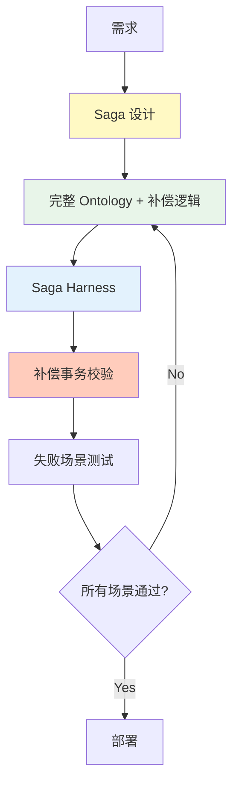
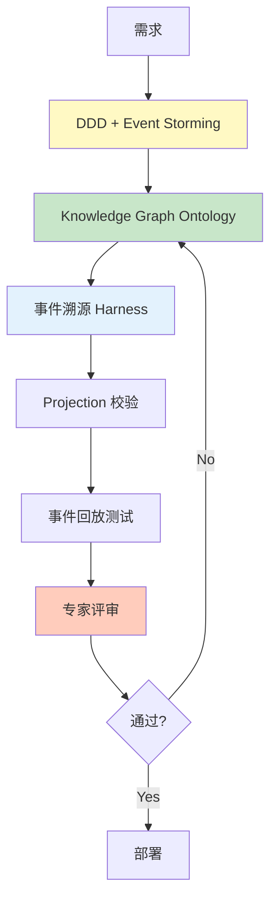
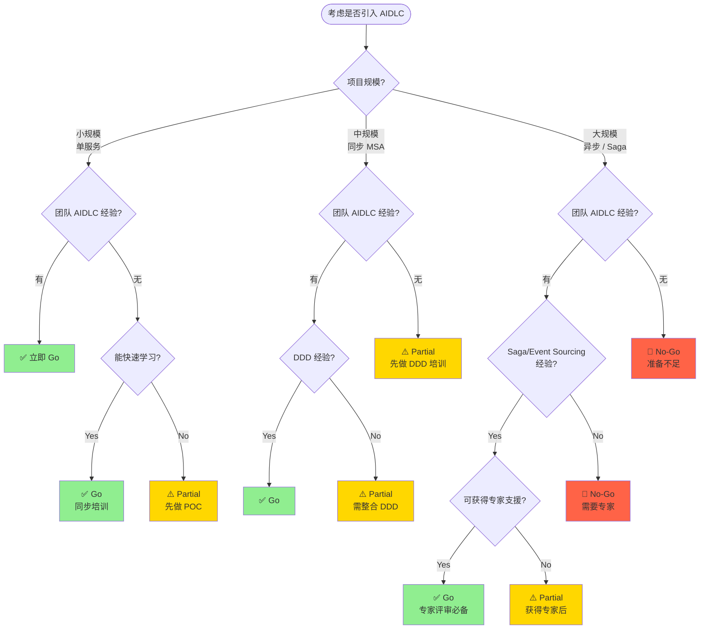

# MSA 复杂度评估

用于评估项目与 AIDLC (AI-Driven Development Life Cycle) 的适配性,并依据 MSA 难度决定 Ontology · Harness 策略的指南。

## 为什么 MSA 复杂度很重要

### 简单 CRUD vs 复杂 MSA

AIDLC 不会以同一方式适用于所有项目。需要根据项目的技术复杂度与组织准备度采用不同的落地方法。

**简单 CRUD 项目特点:**
- 单一服务、单一数据库
- 同步请求—响应
- 事务边界清晰
- 回滚简单 (DB 事务足够)

**复杂 MSA 项目特点:**
- 多个独立服务、分布式数据
- 异步事件驱动通信
- 分布式事务 (Saga、补偿事务)
- Eventually Consistent 数据模型
- 服务间复杂依赖

### AIDLC 落地的差异

| 复杂度 | AIDLC 落地方式 | Ontology 级别 | Harness 级别 |
|--------|---------------|---------------|--------------|
| **简单 CRUD** | 可立即全面应用 | 轻量 schema | 基础 Quality Gate |
| **同步 MSA** | 必须整合 DDD | 标准 Ontology | 服务契约校验 |
| **异步事件** | 必备事件 schema Ontology | 完整 Ontology | 事件 schema + 幂等性 |
| **Saga/CQRS** | 全套 AIDLC + 需要专家 | Knowledge Graph | 补偿事务校验 |

**核心原则:**
- 复杂度越高,Ontology 与 Harness 的精细度越重要
- 组织准备度低时需要分阶段落地
- 技术复杂度与组织准备度失衡是项目失败风险

## AIDLC 难度矩阵

以项目的 **技术复杂度** 与 **组织准备度** 为两个轴进行评估,决定 AIDLC 落地策略。

### 轴 1: 技术复杂度 (Technical Complexity)

| Level | 说明 | 特征 | 示例 |
|-------|------|------|------|
| **L1** | 单服务 CRUD | - 单一 DB<br/>- 同步 API<br/>- 简单事务 | 用户管理服务 |
| **L2** | 同步 MSA | - 多服务<br/>- REST/gRPC 编排<br/>- 分布式 DB | 订单 - 库存 - 支付 MSA |
| **L3** | 异步事件驱动 | - 事件总线<br/>- Eventually Consistent<br/>- 领域事件 | 事件溯源订单系统 |
| **L4** | Saga + 补偿事务 | - 分布式事务<br/>- 补偿逻辑<br/>- 编排 / 编舞 | 旅行预订 Saga |
| **L5** | 分布式事务 + CQRS + Event Sourcing | - 读写分离<br/>- 事件存储<br/>- 复杂 Projection | 金融交易平台 |

### 轴 2: 组织准备度 (Organizational Readiness)

| Level | 说明 | 特征 | 清单 |
|-------|------|------|------|
| **A** | 无 Champion | - 无 AIDLC 经验<br/>- 无 DDD 经验<br/>- 不了解 Ontology | ☐ 需要 AIDLC 培训<br/>☐ 需要 POC 项目 |
| **B** | 1 名 Champion | - 1 位 AIDLC 专家<br/>- 需要团队培训<br/>- 依赖指引 | ☐ 确认 Champion 能力<br/>☐ 团队 onboarding 计划 |
| **C** | 团队具备经验 | - 多位团队成员具 AIDLC 经验<br/>- 实战 DDD 经验<br/>- 可设计 Ontology | ☐ 团队评审流程<br/>☐ 共享最佳实践 |
| **D** | 组织标准 | - 全公司 AIDLC 标准<br/>- Ontology 复用库<br/>- Harness 模板 | ☐ 组织标准文档<br/>☐ 可复用资产 |

### 难度矩阵 (推荐落地策略)

```mermaid
graph TB
    subgraph "难度矩阵"
        style L1A fill:#90EE90
        style L1B fill:#90EE90
        style L1C fill:#90EE90
        style L1D fill:#90EE90
        
        style L2A fill:#FFD700
        style L2B fill:#90EE90
        style L2C fill:#90EE90
        style L2D fill:#90EE90
        
        style L3A fill:#FF6347
        style L3B fill:#FFD700
        style L3C fill:#90EE90
        style L3D fill:#90EE90
        
        style L4A fill:#FF0000
        style L4B fill:#FF6347
        style L4C fill:#FFD700
        style L4D fill:#90EE90
        
        style L5A fill:#FF0000
        style L5B fill:#FF0000
        style L5C fill:#FF6347
        style L5D fill:#FFD700
        
        L1A["L1-A<br/>🟢 立即可行"]
        L1B["L1-B<br/>🟢 立即可行"]
        L1C["L1-C<br/>🟢 立即可行"]
        L1D["L1-D<br/>🟢 立即可行"]
        
        L2A["L2-A<br/>🟡 需要 POC"]
        L2B["L2-B<br/>🟢 培训后可行"]
        L2C["L2-C<br/>🟢 立即可行"]
        L2D["L2-D<br/>🟢 立即可行"]
        
        L3A["L3-A<br/>🔴 风险较高"]
        L3B["L3-B<br/>🟡 需要专家"]
        L3C["L3-C<br/>🟢 团队评审"]
        L3D["L3-D<br/>🟢 立即可行"]
        
        L4A["L4-A<br/>⛔ 不建议"]
        L4B["L4-B<br/>🔴 高风险"]
        L4C["L4-C<br/>🟡 审慎推进"]
        L4D["L4-D<br/>🟢 可行"]
        
        L5A["L5-A<br/>⛔ 不建议"]
        L5B["L5-B<br/>⛔ 不建议"]
        L5C["L5-C<br/>🔴 必备专家"]
        L5D["L5-D<br/>🟡 审慎推进"]
    end
```



**颜色释义:**
- 🟢 **绿色 (立即可行):** 推荐 Full AIDLC 落地
- 🟡 **黄色 (注意):** 需要分阶段导入或专家支援
- 🔴 **红色 (高风险):** 风险较高,充分准备后再推进
- ⛔ **红色 (不建议):** 提升组织准备度后再尝试

## 按模式的 AIDLC 落地指南

### Level 1: 单服务 CRUD

**特点:**
- 单服务、单 DB
- REST API (CRUD 端点)
- 事务边界清晰
- 回滚简单 (DB 事务)

**AIDLC 落地方式:**


**Ontology 级别:**
- **轻量 schema:** 仅实体定义、属性、基础关系
- YAML/JSON schema 文件
- 无需复杂领域建模

**Harness 清单:**
- ✅ API 契约校验
- ✅ 数据校验 (输入 / 输出)
- ✅ 基础单元测试
- ✅ 集成测试 (含 DB)
- ⬜ 分布式事务校验 (不必要)

**Ontology 示例 (轻量):**

```yaml
# ontology/user-service.yaml
entities:
  User:
    attributes:
      - id: string (UUID)
      - name: string
      - email: string (unique)
      - createdAt: timestamp
    invariants:
      - email must be valid format
      - name length 2-50 characters

  Role:
    attributes:
      - id: string
      - name: string
      - permissions: list<string>

relationships:
  - User hasMany Role
```

**落地策略:**
- 立即可应用 Full AIDLC
- 使用基于 Agent 的代码生成
- Ontology 只需达到 schema 定义水平
- Harness 从基础 Quality Gate 起步

### Level 2: 同步 MSA 编排

**特点:**
- 多个独立服务
- REST/gRPC 同步调用
- 编排者模式 (订单服务调用库存 / 支付)
- 分布式 DB,但为同步事务

**AIDLC 落地方式:**


**Ontology 级别:**
- **标准 Ontology:** 实体 + 关系 + 不变量
- 按 Bounded Context 拆分 Ontology
- 明示服务间契约 (API 规格)

**Harness 清单:**
- ✅ 服务契约校验 (OpenAPI/gRPC)
- ✅ 服务间集成测试
- ✅ 超时 + 重试策略
- ✅ 断路器校验
- ⬜ 补偿事务 (尚不必要)

**Ontology 示例 (服务契约):**

```yaml
# ontology/order-service.yaml
boundedContext: OrderManagement

entities:
  Order:
    attributes:
      - orderId: string
      - userId: string
      - items: list<OrderItem>
      - status: OrderStatus (PENDING, CONFIRMED, CANCELLED)
    invariants:
      - total amount must match sum of item prices
      - order must have at least 1 item

serviceContracts:
  - name: CreateOrder
    input: CreateOrderRequest
    output: OrderResponse
    dependencies:
      - InventoryService.checkStock
      - PaymentService.processPayment
    timeout: 5s
    retryPolicy: exponentialBackoff(3)
```

**落地策略:**
- 必须整合 DDD (定义 Bounded Context)
- 明示服务契约 Ontology
- Harness 增加超时 / 重试 / 断路器
- 引入 Contract Testing (Pact、Spring Cloud Contract)

### Level 3: 异步事件驱动 MSA

**特点:**
- 事件总线 (Kafka、RabbitMQ、EventBridge)
- Eventually Consistent 数据模型
- 领域事件发布 / 订阅
- 异步通信、松耦合

**AIDLC 落地方式:**


**Ontology 级别:**
- **完整 Ontology:** 实体 + 关系 + 事件 schema + 不变量
- 明示事件契约 (Schema Registry)
- 定义事件顺序 / 依赖

**Harness 清单:**
- ✅ 事件 schema 校验 (Avro、Protobuf)
- ✅ 幂等性 Harness (重复事件处理)
- ✅ 事件顺序校验
- ✅ Eventually Consistent 测试 (最终状态校验)
- ✅ Dead Letter Queue 处理

**Ontology 示例 (事件 schema):**

```yaml
# ontology/order-events.yaml
events:
  OrderCreated:
    schema:
      orderId: string
      userId: string
      items: list<OrderItem>
      createdAt: timestamp
    producers:
      - OrderService
    consumers:
      - InventoryService (扣减库存)
      - NotificationService (发送通知)
    idempotencyKey: orderId
    ordering: strict (按 orderId)

  OrderConfirmed:
    schema:
      orderId: string
      confirmedAt: timestamp
    producers:
      - PaymentService
    consumers:
      - ShippingService
    idempotencyKey: orderId

invariants:
  - OrderCreated must precede OrderConfirmed
  - OrderCancelled cannot follow OrderShipped
```

**落地策略:**
- 用事件风暴梳理事件
- 必须定义事件 schema Ontology
- 设计幂等性 Harness (应对重复事件)
- 对接事件 schema 注册中心 (Schema Registry)
- 自动化最终一致性 (Eventual Consistency) 测试

### Level 4: Saga + 补偿事务

**特点:**
- 分布式事务 (Saga 模式)
- 补偿事务 (Compensating Transaction)
- 编排式 Saga 或编舞式 Saga
- 复杂失败场景

**AIDLC 落地方式:**



**Ontology 级别:**
- **完整 Ontology + Saga 规约:** 实体 + 事件 + Saga 步骤 + 补偿逻辑
- 定义每步 Saga 的状态转移
- 明示补偿逻辑 (回滚场景)

**Harness 清单:**
- ✅ 每步 Saga 校验
- ✅ 补偿事务校验 (回滚场景)
- ✅ 超时 Harness (防止无限等待)
- ✅ 重试策略校验
- ✅ 断路器
- ✅ 分布式追踪 (OpenTelemetry)

**Ontology 示例 (Saga):**

```yaml
# ontology/travel-booking-saga.yaml
saga:
  name: TravelBookingSaga
  type: orchestration
  orchestrator: BookingService

  steps:
    - name: ReserveFlight
      service: FlightService
      action: reserveFlight
      compensation: cancelFlightReservation
      timeout: 10s
      retryPolicy: exponentialBackoff(3)

    - name: ReserveHotel
      service: HotelService
      action: reserveHotel
      compensation: cancelHotelReservation
      timeout: 10s
      retryPolicy: exponentialBackoff(3)

    - name: ChargePayment
      service: PaymentService
      action: chargeCard
      compensation: refundPayment
      timeout: 5s
      retryPolicy: none

  failureScenarios:
    - scenario: FlightReservationFailed
      compensations:
        - (none, 首步失败)
    
    - scenario: HotelReservationFailed
      compensations:
        - cancelFlightReservation
    
    - scenario: PaymentFailed
      compensations:
        - cancelHotelReservation
        - cancelFlightReservation

  invariants:
    - All compensations must be idempotent
    - Compensation order is reverse of execution order
    - Saga timeout = sum of step timeouts + buffer
```

**落地策略:**
- 必须做 Saga 设计 (编排 vs 编舞)
- 明示补偿逻辑 Ontology
- Harness 增加补偿事务校验
- 对所有失败场景做测试 (Chaos Engineering)
- 必须由专家评审

### Level 5: 分布式事务 + CQRS + Event Sourcing

**特点:**
- 读写分离 (CQRS)
- 事件存储 (Event Store)
- 复杂 Projection (Read Model)
- 事件回放

**AIDLC 落地方式:**



**Ontology 级别:**
- **Knowledge Graph:** SemanticForge 模式
- 事件存储 schema
- 明示 Projection 逻辑
- 事件版本管理

**Harness 清单:**
- ✅ 事件 schema 校验 (版本管理)
- ✅ Projection 校验 (Read Model 一致性)
- ✅ 事件回放测试
- ✅ Snapshot 策略校验
- ✅ 事件迁移 Harness
- ✅ 幂等性 Harness
- ✅ 分布式追踪

**Ontology 示例 (Event Sourcing):**

```yaml
# ontology/banking-account.yaml
aggregateRoot: BankAccount

events:
  AccountOpened:
    version: v1
    schema:
      accountId: string
      customerId: string
      initialBalance: decimal
      openedAt: timestamp
  
  MoneyDeposited:
    version: v1
    schema:
      accountId: string
      amount: decimal
      transactionId: string
      depositedAt: timestamp
  
  MoneyWithdrawn:
    version: v1
    schema:
      accountId: string
      amount: decimal
      transactionId: string
      withdrawnAt: timestamp

eventStore:
  partitionKey: accountId
  snapshotStrategy: every 100 events
  retentionPolicy: 7 years

projections:
  AccountBalanceView:
    source: [AccountOpened, MoneyDeposited, MoneyWithdrawn]
    target: read_db.account_balance
    updateStrategy: eventually_consistent
  
  TransactionHistoryView:
    source: [MoneyDeposited, MoneyWithdrawn]
    target: read_db.transaction_history
    updateStrategy: eventually_consistent

invariants:
  - Balance cannot be negative
  - Events must be ordered by timestamp
  - TransactionId must be unique (idempotency)
```

**落地策略:**
- 必须结合 DDD + Event Storming
- 达到 Knowledge Graph 级别的 Ontology
- 制定事件版本管理策略
- 自动化 Projection 逻辑校验
- 必备事件回放测试
- 建议组建专家团队

## Ontology 深度指南

按复杂度推荐的 Ontology 级别。

### 按 Level 的 Ontology 级别

| 复杂度 | Ontology 级别 | 含要素 | 示例文件 |
|--------|---------------|-------|----------|
| **L1** | 轻量 schema | - 实体定义<br/>- 属性<br/>- 基础不变量 | `ontology/user-schema.yaml` |
| **L2** | 标准 Ontology | - 实体 + 关系<br/>- 服务契约<br/>- Bounded Context | `ontology/order-service.yaml` |
| **L3** | 完整 Ontology | - 事件 schema<br/>- 事件顺序<br/>- 幂等键 | `ontology/order-events.yaml` |
| **L4** | 完整 Ontology + Saga | - Saga 步骤<br/>- 补偿逻辑<br/>- 失败场景 | `ontology/booking-saga.yaml` |
| **L5** | Knowledge Graph | - 事件存储<br/>- Projection<br/>- 事件版本 | `ontology/banking-kg.yaml` |

### Ontology 编写指引

#### Level 1-2: 轻量 ~ 标准 Ontology

**聚焦:** 定义实体与关系

```yaml
# 实体定义
entities:
  Order:
    attributes:
      - orderId: string
      - customerId: string
      - items: list<OrderItem>
    invariants:
      - orderId must be unique
      - items must not be empty

# 关系定义
relationships:
  - Customer hasMany Order
  - Order hasMany OrderItem
```

**编写原则:**
- 明确实体边界
- 明示必须属性
- 定义基础不变量

#### Level 3-4: 完整 Ontology + Saga

**聚焦:** 事件 schema + 补偿逻辑

```yaml
# 事件契约
events:
  OrderCreated:
    schema: {...}
    producers: [OrderService]
    consumers: [InventoryService, NotificationService]
    idempotencyKey: orderId

# Saga 定义
saga:
  steps:
    - action: reserveInventory
      compensation: releaseInventory
      timeout: 5s
```

**编写原则:**
- 明示事件契约
- 定义补偿逻辑
- 超时 / 重试策略

#### Level 5: Knowledge Graph

**聚焦:** 事件溯源 + Projection

```yaml
# 事件存储
eventStore:
  aggregateRoot: BankAccount
  snapshotStrategy: every 100 events

# Projection
projections:
  AccountBalanceView:
    source: [AccountOpened, MoneyDeposited]
    target: read_db.account_balance
```

**编写原则:**
- 事件版本管理
- 明示 Projection 逻辑
- 事件回放策略

### SemanticForge 模式 (仅 L5)

Level 5 项目应用 [Ontology 工程](../methodology/ontology-engineering.md) 的 SemanticForge 模式。

**核心特征:**
- 事件 = 领域知识的原子单元
- 以 Knowledge Graph 表达事件间关系
- Projection = Knowledge Graph 查询

**参考:** 详见 [Ontology 工程](../methodology/ontology-engineering.md)

## Harness 清单

按模式的必备 Harness 与可选 Harness。

### 按模式的必备 Harness

| 模式 | 必备 Harness | 可选 Harness | 优先级 |
|------|--------------|--------------|--------|
| **L1: CRUD** | - API 契约校验<br/>- 基础单元测试<br/>- 集成测试 | - 性能测试<br/>- 安全扫描 | P0 |
| **L2: 同步 MSA** | - 服务契约校验<br/>- 超时 / 重试<br/>- 断路器<br/>- Contract Testing | - Chaos Engineering<br/>- 压测 | P1 |
| **L3: 异步事件** | - 事件 schema 校验<br/>- 幂等性 Harness<br/>- 事件顺序校验<br/>- Eventually Consistent 测试 | - 事件回放<br/>- Dead Letter Queue | P1 |
| **L4: Saga** | - Saga 步骤校验<br/>- 补偿事务校验<br/>- 失败场景测试<br/>- 超时 Harness | - 分布式追踪<br/>- Chaos Engineering | P0 |
| **L5: Event Sourcing** | - 事件 schema 校验<br/>- Projection 校验<br/>- 事件回放<br/>- 事件迁移 | - Snapshot 策略<br/>- 性能测试 | P0 |

### Harness 实现示例

#### 幂等性 Harness (L3+)

```python
# harness/idempotency_test.py
def test_duplicate_event_handling():
    """校验多次处理同一事件时结果相同"""
    event = OrderCreatedEvent(orderId="123", ...)
    
    # 首次处理
    result1 = event_handler.handle(event)
    state1 = get_order_state("123")
    
    # 第二次处理 (重复)
    result2 = event_handler.handle(event)
    state2 = get_order_state("123")
    
    # 结果应一致
    assert result1 == result2
    assert state1 == state2
```

#### 补偿事务 Harness (L4+)

```python
# harness/saga_compensation_test.py
def test_saga_compensation():
    """校验 Saga 失败时补偿逻辑正确执行"""
    saga = TravelBookingSaga()
    
    # 1. 预订 Flight 成功
    saga.execute_step("ReserveFlight")
    assert flight_service.is_reserved("flight123")
    
    # 2. 预订 Hotel 成功
    saga.execute_step("ReserveHotel")
    assert hotel_service.is_reserved("hotel456")
    
    # 3. 支付失败模拟
    with pytest.raises(PaymentFailedException):
        saga.execute_step("ChargePayment")
    
    # 4. 补偿事务校验
    saga.compensate()
    assert not hotel_service.is_reserved("hotel456")  # 已取消
    assert not flight_service.is_reserved("flight123")  # 已取消
```

#### Projection 校验 Harness (L5)

```python
# harness/projection_test.py
def test_projection_consistency():
    """校验事件溯源 Projection 的正确性"""
    # 1. 生成事件
    events = [
        AccountOpenedEvent(accountId="A1", balance=1000),
        MoneyDepositedEvent(accountId="A1", amount=500),
        MoneyWithdrawnEvent(accountId="A1", amount=200),
    ]
    
    # 2. 写入事件
    for event in events:
        event_store.append(event)
    
    # 3. 更新 Projection
    projection_service.rebuild("AccountBalanceView")
    
    # 4. 校验 Read Model
    balance_view = read_db.get_account_balance("A1")
    assert balance_view.balance == 1300  # 1000 + 500 - 200
    assert balance_view.version == 3
```

### Harness 优先级指南

**P0 (必备):**
- 失败时会导致数据丢失或严重业务影响
- 例: 补偿事务校验、事件 schema 校验

**P1 (强烈推荐):**
- 失败时会造成服务故障或用户体验下降
- 例: 超时 / 重试、幂等性校验

**P2 (可选):**
- 用于质量提升或运维便利
- 例: 性能测试、Chaos Engineering

## Go/No-Go 决策树

决定是否对项目应用 AIDLC 的流程图。



### 决策标准

#### ✅ Go (立即推进)

**条件:**
- 技术复杂度 ≤ L3 AND 组织准备度 ≥ B
- 或 技术复杂度 = L4-5 AND 组织准备度 ≥ C AND 有专家支援

**行动:**
- 落地 Full AIDLC
- 编写 Ontology / Harness
- 使用基于 Agent 的代码生成

#### ⚠️ Partial (分阶段推进)

**条件:**
- 技术复杂度 ≤ L2 AND 组织准备度 = A
- 或 技术复杂度 = L3 AND 组织准备度 ≤ B
- 或 技术复杂度 ≥ L4 AND 无专家

**行动:**
- 先做 POC 项目
- 完成培训项目
- 获得专家支援
- 分阶段落地 AIDLC

#### 🛑 No-Go (无法推进)

**条件:**
- 技术复杂度 ≥ L4 AND 组织准备度 ≤ A
- 或 技术复杂度 = L5 AND 组织准备度 ≤ B

**行动:**
- 提升组织准备度 (培训、POC)
- 招聘专家或聘请顾问
- 准备就绪后重新评估

### 风险评估矩阵

| 风险因素 | 高 🔴 | 中 🟡 | 低 🟢 |
|----------|--------|--------|--------|
| **技术复杂度** | L4-5 | L2-3 | L1 |
| **组织准备度** | A (无经验) | B-C (部分经验) | D (组织标准) |
| **数据敏感度** | 金融、医疗 | 个人信息 | 非敏感 |
| **项目规模** | 20+ 服务 | 5-20 服务 | 1-5 服务 |
| **进度压力** | 3 个月内 | 3-6 个月 | 6 个月以上 |

**综合风险判断:**
- 🔴 ≥ 3 项: No-Go
- 🔴 1-2 项: Partial (分阶段推进)
- 🔴 0 项: Go

## 校验方法论

在复杂 MSA 中落地 AIDLC 时保证质量的方法。

### 校验清单

#### Ontology 校验

- [ ] **完整性:** 所有实体 / 事件是否均在 Ontology 中定义?
- [ ] **一致性:** Bounded Context 之间 Ontology 是否一致?
- [ ] **正确性:** 不变量是否与业务规则相符?
- [ ] **可追溯性:** Ontology 与代码是否保持同步?

#### Harness 校验

- [ ] **覆盖度:** 必备 Harness 是否均已实现?
- [ ] **自动化:** Harness 是否集成至 CI/CD?
- [ ] **失败场景:** 是否测试了所有失败场景?
- [ ] **性能:** Harness 执行时间是否合理?

#### 部署校验

- [ ] **Canary 部署:** 是否有渐进式发布策略?
- [ ] **回滚计划:** 问题发生时能否回滚?
- [ ] **监控:** 部署后能否实时监控?
- [ ] **告警:** 是否设置了异常告警?

### 校验自动化

**CI/CD 流水线:**

```yaml
# .github/workflows/aidlc-validation.yml
name: AIDLC Validation

on: [push, pull_request]

jobs:
  validate-ontology:
    runs-on: ubuntu-latest
    steps:
      - uses: actions/checkout@v2
      - name: Validate Ontology
        run: |
          aidlc-cli validate-ontology --path ontology/
  
  run-harness:
    runs-on: ubuntu-latest
    steps:
      - uses: actions/checkout@v2
      - name: Run Harness Tests
        run: |
          aidlc-cli run-harness --suite saga
          aidlc-cli run-harness --suite idempotency
  
  quality-gate:
    runs-on: ubuntu-latest
    needs: [validate-ontology, run-harness]
    steps:
      - name: Check Quality Gate
        run: |
          aidlc-cli quality-gate --threshold 80
```

### 专家评审

**复杂度 L4-5 必备专家评审:**

**评审清单:**
- [ ] Saga 设计是否合理?
- [ ] 补偿逻辑是否覆盖了所有失败场景?
- [ ] 是否有事件 schema 版本管理策略?
- [ ] Projection 逻辑是否正确?
- [ ] 是否反映了性能 / 扩展性考虑?

## 下一步

- [DDD 集成](../methodology/ddd-integration.md): Domain-Driven Design 与 AIDLC 整合方法
- [Ontology 工程](../methodology/ontology-engineering.md): Ontology 设计详细指南
- [Harness 工程](../methodology/harness-engineering.md): Harness 实现最佳实践
- [落地策略](./adoption-strategy.md): 全公司 AIDLC 落地路线图

## 参考资料

- [MSA 模式目录](https://microservices.io/patterns/)
- [Saga 模式指南](https://microservices.io/patterns/data/saga.html)
- [Event Sourcing 模式](https://martinfowler.com/eaaDev/EventSourcing.html)
- [CQRS 模式](https://martinfowler.com/bliki/CQRS.html)
