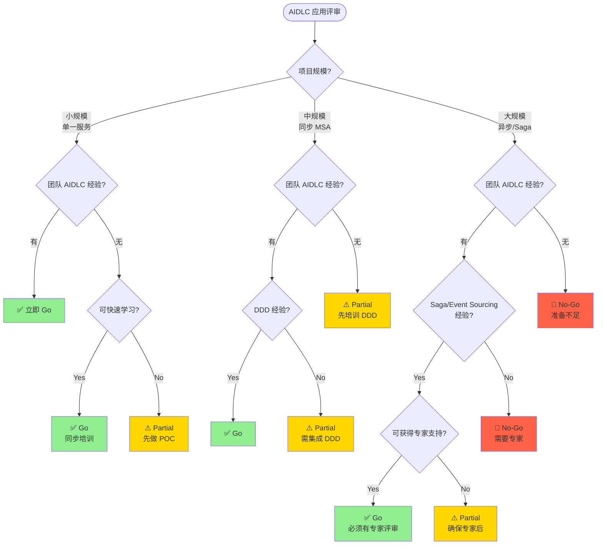

# MSA 复杂度指南

评估 AIDLC(AI-Driven Development Life Cycle)的项目适用性，并根据 MSA 难度确定本体和 Harness 策略的指南。

## 为什么 MSA 复杂度很重要

### 简单 CRUD vs 复杂 MSA

AIDLC 并非对所有项目都适用相同的方式。应根据项目的技术复杂度和组织准备度采用不同的应用方法。

**简单 CRUD 项目的特征:**
- 单一服务、单一数据库
- 同步请求-响应模式
- 明确的事务边界
- 回滚简单（DB 事务即可）

**复杂 MSA 项目的特征:**
- 多个独立服务、分布式数据
- 异步事件驱动通信
- 分布式事务（Saga、补偿事务）
- Eventually Consistent 数据模型
- 服务间复杂依赖关系

### AIDLC 应用的差异

| 复杂度 | AIDLC 应用方法 | 本体水平 | Harness 水平 |
|--------|----------------|----------|-------------|
| **简单 CRUD** | 可立即全面应用 | 轻量 Schema | 基本 Quality Gate |
| **同步 MSA** | 必须集成 DDD | 标准本体 | 服务契约验证 |
| **异步事件** | 必须有事件 Schema 本体 | 完整本体 | 事件 Schema + 幂等性 |
| **Saga/CQRS** | 完整 AIDLC + 需要专家 | Knowledge Graph | 补偿事务验证 |

**核心原则:**
- 复杂度越高，本体和 Harness 的精细度越重要
- 组织准备度低时需要分阶段引入
- 技术复杂度与组织准备度不平衡会导致项目失败风险

## AIDLC 难度矩阵

以**技术复杂度**和**组织准备度**为两轴评估项目，确定 AIDLC 应用策略。

### 轴 1: 技术复杂度 (Technical Complexity)

| Level | 说明 | 特征 | 示例 |
|-------|------|------|------|
| **L1** | 单一服务 CRUD | - 单一 DB - 同步 API - 简单事务 | 用户管理服务 |
| **L2** | 同步 MSA | - 多个服务 - REST/gRPC 编排 - 分布式 DB | 订单-库存-支付 MSA |
| **L3** | 异步事件驱动 | - 事件总线 - Eventually Consistent - 领域事件 | 事件溯源订单系统 |
| **L4** | Saga + 补偿事务 | - 分布式事务 - 补偿逻辑 - Orchestration/Choreography | 旅行预订 Saga |
| **L5** | 分布式事务 + CQRS + Event Sourcing | - 读写分离 - 事件存储 - 复杂投影 | 金融交易平台 |

### 轴 2: 组织准备度 (Organizational Readiness)

| Level | 说明 | 特征 | 检查清单 |
|-------|------|------|----------|
| **A** | 无冠军 | - 无 AIDLC 经验 - 无 DDD 经验 - 不了解本体 | ☐ 需要 AIDLC 培训 ☐ 需要 POC 项目 |
| **B** | 1名冠军 | - 1名 AIDLC 专家 - 需要团队培训 - 依赖指南 | ☐ 确认冠军能力 ☐ 团队入职计划 |
| **C** | 团队经验 | - 团队内多名 AIDLC 经验者 - DDD 实战经验 - 可设计本体 | ☐ 团队评审流程 ☐ 最佳实践共享 |
| **D** | 组织标准 | - 全组织 AIDLC 标准 - 本体复用库 - Harness 模板 | ☐ 组织标准文档 ☐ 可复用资产 |

### 难度矩阵（推荐应用策略）

```mermaid
graph TB
    subgraph "难度矩阵"
        style L1A fill:#90EE90
        style L1B fill:#90EE90
        style L1C fill:#90EE90
        style L1D fill:#90EE90
        
        style L2A fill:#FFD700
        style L2B fill:#90EE90
        style L2C fill:#90EE90
        style L2D fill:#90EE90
        
        style L3A fill:#FF6347
        style L3B fill:#FFD700
        style L3C fill:#90EE90
        style L3D fill:#90EE90
        
        style L4A fill:#FF0000
        style L4B fill:#FF6347
        style L4C fill:#FFD700
        style L4D fill:#90EE90
        
        style L5A fill:#FF0000
        style L5B fill:#FF0000
        style L5C fill:#FF6347
        style L5D fill:#FFD700
        
        L1A["L1-A<br/>🟢 立即可行"]
        L1B["L1-B<br/>🟢 立即可行"]
        L1C["L1-C<br/>🟢 立即可行"]
        L1D["L1-D<br/>🟢 立即可行"]
        
        L2A["L2-A<br/>🟡 需要 POC"]
        L2B["L2-B<br/>🟢 培训后可行"]
        L2C["L2-C<br/>🟢 立即可行"]
        L2D["L2-D<br/>🟢 立即可行"]
        
        L3A["L3-A<br/>🔴 高风险"]
        L3B["L3-B<br/>🟡 需要专家"]
        L3C["L3-C<br/>🟢 团队评审"]
        L3D["L3-D<br/>🟢 立即可行"]
        
        L4A["L4-A<br/>⛔ 不推荐"]
        L4B["L4-B<br/>🔴 高风险"]
        L4C["L4-C<br/>🟡 谨慎进行"]
        L4D["L4-D<br/>🟢 可行"]
        
        L5A["L5-A<br/>⛔ 不推荐"]
        L5B["L5-B<br/>⛔ 不推荐"]
        L5C["L5-C<br/>🔴 必须有专家"]
        L5D["L5-D<br/>🟡 谨慎进行"]
    end
```

**颜色解释:**
- 🟢 **绿色（立即可行）:** 推荐应用完整 AIDLC
- 🟡 **黄色（注意）:** 需要分阶段引入或专家支持
- 🔴 **红色（高风险）:** 风险高，充分准备后进行
- ⛔ **红色（不推荐）:** 提高组织准备度后重试

## Go/No-Go 决策树

决定是否对项目应用 AIDLC 的流程图。

### 决策标准

#### ✅ Go（立即进行）

**条件:**
- 技术复杂度 ≤ L3 AND 组织准备度 ≥ B
- 或 技术复杂度 = L4-5 AND 组织准备度 ≥ C AND 可获得专家支持

**行动:**
- 应用完整 AIDLC
- 编写本体/Harness
- 基于 Agent 的代码生成

#### ⚠️ Partial（分阶段进行）

**条件:**
- 技术复杂度 ≤ L2 AND 组织准备度 = A
- 或 技术复杂度 = L3 AND 组织准备度 ≤ B
- 或 技术复杂度 ≥ L4 AND 无专家

**行动:**
- 先进行 POC 项目
- 完成培训计划
- 确保专家支持
- 分阶段引入 AIDLC

#### 🛑 No-Go（无法进行）

**条件:**
- 技术复杂度 ≥ L4 AND 组织准备度 ≤ A
- 或 技术复杂度 = L5 AND 组织准备度 ≤ B

**行动:**
- 提高组织准备度（培训、POC）
- 招聘专家或咨询
- 准备完成后重新评估

### 风险评估矩阵

| 风险因素 | 高 🔴 | 中 🟡 | 低 🟢 |
|----------|-------|-------|-------|
| **技术复杂度** | L4-5 | L2-3 | L1 |
| **组织准备度** | A（无经验） | B-C（部分经验） | D（组织标准） |
| **数据敏感度** | 金融、医疗 | 个人信息 | 非敏感 |
| **项目规模** | 20+ 服务 | 5-20 服务 | 1-5 服务 |
| **时间压力** | 3个月内 | 3-6个月 | 6个月以上 |

**总体风险判断:**
- 🔴 3个以上: No-Go
- 🔴 1-2个: Partial（分阶段进行）
- 🔴 0个: Go

## 详细指南

import DocCardList from '@theme/DocCardList';

<DocCardList />

## 下一步

- [DDD 集成](../../methodology/ddd-integration.md): Domain-Driven Design 与 AIDLC 集成方法
- [本体工程](../../methodology/ontology-engineering.md): 本体设计详细指南
- [Harness 工程](../../methodology/harness-engineering.md): Harness 实现最佳实践
- [引入策略](../adoption-strategy.md): 全组织 AIDLC 引入路线图

## 参考资料

- [MSA 模式目录](https://microservices.io/patterns/)
- [Saga 模式指南](https://microservices.io/patterns/data/saga.html)
- [Event Sourcing 模式](https://martinfowler.com/eaaDev/EventSourcing.html)
- [CQRS 模式](https://martinfowler.com/bliki/CQRS.html)
