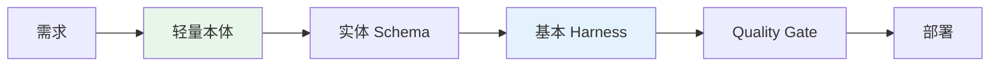
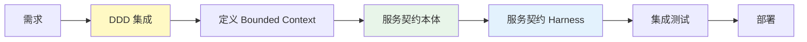

# Level 1-2: 简单 CRUD & 同步 MSA

从简单服务到同步 MSA，相对较低复杂度的 AIDLC 应用指南。

## Level 1: 简单服务 CRUD

**特征:**
- 单一服务、单一数据库
- REST API（CRUD 端点）
- 明确的事务边界
- 回滚简单（DB 事务）

**AIDLC 应用方法:**



### 本体水平

**轻量 Schema:** 仅实体定义、属性、基本关系
- YAML/JSON Schema 文件
- 无需复杂领域建模

**示例本体:**

```yaml
# ontology/user-service.yaml
entities:
  User:
    attributes:
      - id: string (UUID)
      - name: string
      - email: string (unique)
      - createdAt: timestamp
    invariants:
      - email must be valid format
      - name length 2-50 characters

  Role:
    attributes:
      - id: string
      - name: string
      - permissions: list<string>

relationships:
  - User hasMany Role
```

### Harness 检查清单

- ✅ API 契约验证
- ✅ 数据验证（输入/输出）
- ✅ 基本单元测试
- ✅ 集成测试（含 DB）
- ⬜ 分布式事务验证（不需要）

### 应用策略

- 可立即应用完整 AIDLC
- 利用基于 Agent 的代码生成
- 本体仅需 Schema 定义水平即可
- Harness 从基本 Quality Gate 开始

## Level 2: 同步 MSA 编排

**特征:**
- 多个独立服务
- REST/gRPC 同步调用
- Orchestrator 模式（订单服务调用库存/支付）
- 分布式 DB，但同步事务

**AIDLC 应用方法:**



### 本体水平

**标准本体:** 实体 + 关系 + 不变条件
- 按 Bounded Context 分离本体
- 明确服务间契约（API 规范）

**示例本体（服务契约）:**

```yaml
# ontology/order-service.yaml
boundedContext: OrderManagement

entities:
  Order:
    attributes:
      - orderId: string
      - userId: string
      - items: list<OrderItem>
      - status: OrderStatus (PENDING, CONFIRMED, CANCELLED)
    invariants:
      - total amount must match sum of item prices
      - order must have at least 1 item

serviceContracts:
  - name: CreateOrder
    input: CreateOrderRequest
    output: OrderResponse
    dependencies:
      - InventoryService.checkStock
      - PaymentService.processPayment
    timeout: 5s
    retryPolicy: exponentialBackoff(3)
```

### Harness 检查清单

- ✅ 服务契约验证（OpenAPI/gRPC）
- ✅ 服务间集成测试
- ✅ 超时 + 重试策略
- ✅ 断路器验证
- ⬜ 补偿事务（暂不需要）

### 应用策略

- 必须集成 DDD（定义 Bounded Context）
- 明确服务契约本体
- 在 Harness 中添加超时/重试/断路器
- 引入 Contract Testing（Pact、Spring Cloud Contract）

## 下一步

处理更复杂的异步模式和 Saga 模式的指南:

- [Level 3-4: 异步事件 & Saga](./l3-l4-async-saga.md)
- [Level 5: Event Sourcing](./l5-event-sourcing.md)
