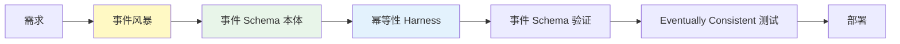
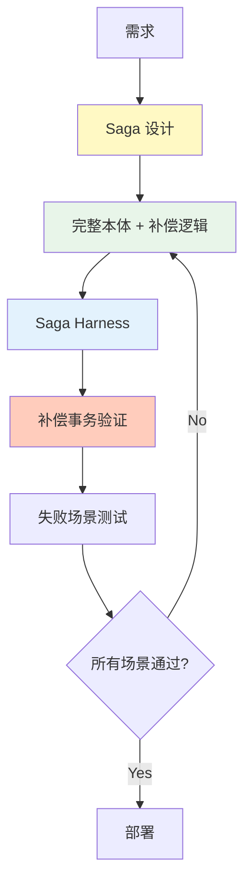

# Level 3-4: 异步事件 & Saga

处理事件驱动架构和分布式事务的中级~高级复杂度模式。

## Level 3: 异步事件驱动 MSA

**特征:**
- 事件总线（Kafka、RabbitMQ、EventBridge）
- Eventually Consistent 数据模型
- 领域事件发布/订阅
- 异步通信、松耦合

**AIDLC 应用方法:**



### 本体水平

**完整本体:** 实体 + 关系 + 事件 Schema + 不变条件
- 明确事件契约（Schema Registry）
- 定义事件顺序/依赖关系

**示例本体（事件 Schema）:**

```yaml
# ontology/order-events.yaml
events:
  OrderCreated:
    schema:
      orderId: string
      userId: string
      items: list<OrderItem>
      createdAt: timestamp
    producers:
      - OrderService
    consumers:
      - InventoryService（扣减库存）
      - NotificationService（发送通知）
    idempotencyKey: orderId
    ordering: strict（基于 orderId）

  OrderConfirmed:
    schema:
      orderId: string
      confirmedAt: timestamp
    producers:
      - PaymentService
    consumers:
      - ShippingService
    idempotencyKey: orderId

invariants:
  - OrderCreated must precede OrderConfirmed
  - OrderCancelled cannot follow OrderShipped
```

### Harness 检查清单

- ✅ 事件 Schema 验证（Avro、Protobuf）
- ✅ 幂等性 Harness（重复事件处理）
- ✅ 事件顺序验证
- ✅ Eventually Consistent 测试（最终状态验证）
- ✅ Dead Letter Queue 处理

### 应用策略

- 通过事件风暴定义事件
- 必须有事件 Schema 本体
- 幂等性 Harness（应对重复事件）
- 集成事件 Schema Registry
- 自动化 Eventual Consistency 测试

## Level 4: Saga + 补偿事务

**特征:**
- 分布式事务（Saga 模式）
- 补偿事务（Compensating Transaction）
- Orchestration Saga 或 Choreography Saga
- 复杂的失败场景

**AIDLC 应用方法:**



### 本体水平

**完整本体 + Saga 规范:** 实体 + 事件 + Saga 步骤 + 补偿逻辑
- 定义 Saga 各步骤的状态转换
- 明确补偿逻辑（回滚场景）

**示例本体（Saga）:**

```yaml
# ontology/travel-booking-saga.yaml
saga:
  name: TravelBookingSaga
  type: orchestration
  orchestrator: BookingService

  steps:
    - name: ReserveFlight
      service: FlightService
      action: reserveFlight
      compensation: cancelFlightReservation
      timeout: 10s
      retryPolicy: exponentialBackoff(3)

    - name: ReserveHotel
      service: HotelService
      action: reserveHotel
      compensation: cancelHotelReservation
      timeout: 10s
      retryPolicy: exponentialBackoff(3)

    - name: ChargePayment
      service: PaymentService
      action: chargeCard
      compensation: refundPayment
      timeout: 5s
      retryPolicy: none

  failureScenarios:
    - scenario: FlightReservationFailed
      compensations:
        - (无，第一步失败)
    
    - scenario: HotelReservationFailed
      compensations:
        - cancelFlightReservation
    
    - scenario: PaymentFailed
      compensations:
        - cancelHotelReservation
        - cancelFlightReservation

  invariants:
    - All compensations must be idempotent
    - Compensation order is reverse of execution order
    - Saga timeout = sum of step timeouts + buffer
```

### Harness 检查清单

- ✅ Saga 各步骤验证
- ✅ 补偿事务验证（回滚场景）
- ✅ 超时 Harness（防止无限等待）
- ✅ 重试策略验证
- ✅ 断路器
- ✅ 分布式追踪（OpenTelemetry）

### Harness 实现示例

#### 补偿事务 Harness

```python
# harness/saga_compensation_test.py
def test_saga_compensation():
    """验证 Saga 失败时补偿逻辑是否正确工作"""
    saga = TravelBookingSaga()
    
    # 1. Flight 预订成功
    saga.execute_step("ReserveFlight")
    assert flight_service.is_reserved("flight123")
    
    # 2. Hotel 预订成功
    saga.execute_step("ReserveHotel")
    assert hotel_service.is_reserved("hotel456")
    
    # 3. Payment 失败模拟
    with pytest.raises(PaymentFailedException):
        saga.execute_step("ChargePayment")
    
    # 4. 补偿事务验证
    saga.compensate()
    assert not hotel_service.is_reserved("hotel456")  # 已取消
    assert not flight_service.is_reserved("flight123")  # 已取消
```

### 应用策略

- 必须进行 Saga 设计（Orchestration vs Choreography）
- 在本体中明确补偿逻辑
- 在 Harness 中添加补偿事务验证
- 全面测试失败场景（Chaos Engineering）
- 必须有专家评审

## 下一步

最高复杂度的 Event Sourcing 模式:

- [Level 5: Event Sourcing](./l5-event-sourcing.md)
- [本体编写指南](../implementation/ontology-guide.md)
- [Harness 检查清单](../implementation/harness-checklist.md)
