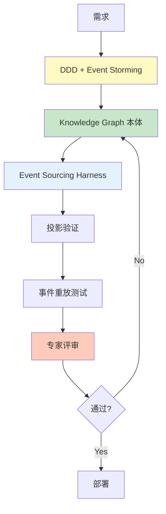

# Level 5: Event Sourcing & CQRS

最高复杂度的架构模式，必须有专家支持和精细的本体。

## 特征

- 读写分离（CQRS）
- 事件存储（Event Store）
- 复杂投影（Read Model）
- 事件重放

## AIDLC 应用方法



## 本体水平

**Knowledge Graph:** SemanticForge 模式
- 事件存储 Schema
- 明确投影逻辑
- 事件版本管理

**示例本体（Event Sourcing）:**

```yaml
# ontology/banking-account.yaml
aggregateRoot: BankAccount

events:
  AccountOpened:
    version: v1
    schema:
      accountId: string
      customerId: string
      initialBalance: decimal
      openedAt: timestamp
  
  MoneyDeposited:
    version: v1
    schema:
      accountId: string
      amount: decimal
      transactionId: string
      depositedAt: timestamp
  
  MoneyWithdrawn:
    version: v1
    schema:
      accountId: string
      amount: decimal
      transactionId: string
      withdrawnAt: timestamp

eventStore:
  partitionKey: accountId
  snapshotStrategy: every 100 events
  retentionPolicy: 7 years

projections:
  AccountBalanceView:
    source: [AccountOpened, MoneyDeposited, MoneyWithdrawn]
    target: read_db.account_balance
    updateStrategy: eventually_consistent
  
  TransactionHistoryView:
    source: [MoneyDeposited, MoneyWithdrawn]
    target: read_db.transaction_history
    updateStrategy: eventually_consistent

invariants:
  - Balance cannot be negative
  - Events must be ordered by timestamp
  - TransactionId must be unique (idempotency)
```

## Harness 检查清单

- ✅ 事件 Schema 验证（版本管理）
- ✅ 投影验证（Read Model 一致性）
- ✅ 事件重放测试
- ✅ Snapshot 策略验证
- ✅ 事件迁移 Harness
- ✅ 幂等性 Harness
- ✅ 分布式追踪

## Harness 实现示例

### 投影验证 Harness

```python
# harness/projection_test.py
def test_projection_consistency():
    """验证事件溯源投影是否准确"""
    # 1. 创建事件
    events = [
        AccountOpenedEvent(accountId="A1", balance=1000),
        MoneyDepositedEvent(accountId="A1", amount=500),
        MoneyWithdrawnEvent(accountId="A1", amount=200),
    ]
    
    # 2. 保存事件
    for event in events:
        event_store.append(event)
    
    # 3. 更新投影
    projection_service.rebuild("AccountBalanceView")
    
    # 4. 验证 Read Model
    balance_view = read_db.get_account_balance("A1")
    assert balance_view.balance == 1300  # 1000 + 500 - 200
    assert balance_view.version == 3
```

### 幂等性 Harness

```python
# harness/idempotency_test.py
def test_duplicate_event_handling():
    """验证多次接收相同事件时结果是否一致"""
    event = OrderCreatedEvent(orderId="123", ...)
    
    # 第一次处理
    result1 = event_handler.handle(event)
    state1 = get_order_state("123")
    
    # 第二次处理（重复）
    result2 = event_handler.handle(event)
    state2 = get_order_state("123")
    
    # 结果应该一致
    assert result1 == result2
    assert state1 == state2
```

## 应用策略

- 必须进行 DDD + Event Storming
- Knowledge Graph 水平本体
- 事件版本管理策略
- 自动化投影逻辑验证
- 必须进行事件重放测试
- 建议组建专家团队

## SemanticForge 模式

Level 5 项目应用[本体工程](../../../methodology/ontology-engineering.md)的 SemanticForge 模式。

**核心特征:**
- 事件 = 领域知识的原子单位
- 用 Knowledge Graph 表示事件间关系
- 投影 = Knowledge Graph 查询

**参考:** 在[本体工程](../../../methodology/ontology-engineering.md)中查看详细指南

## 下一步

- [本体编写指南](../implementation/ontology-guide.md)
- [Harness 检查清单](../implementation/harness-checklist.md)
- [验证方法论](../implementation/verification.md)
