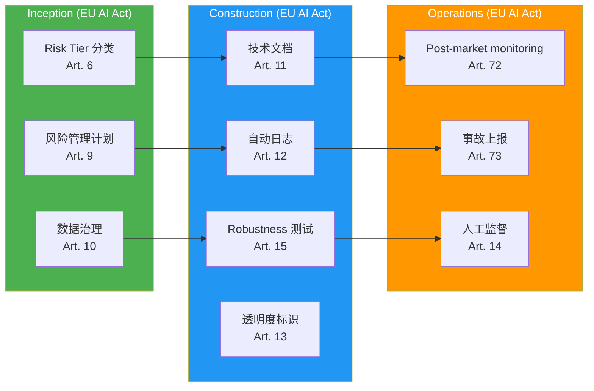
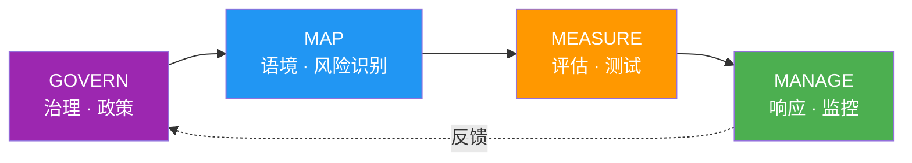
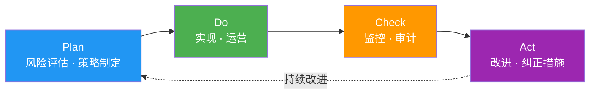

# AI 监管框架映射

> 📅 **撰写日期**: 2026-04-18 | ⏱️ **阅读时间**: 约 25 分钟

---

## 1. 为什么需要 AI 监管映射

### 同时并存的监管环境

截至 2026 年,全球企业面临 **同时遵守多个地区 AI 监管** 的复杂环境:

- **EU**: AI Act (2024 采纳,2026-2027 分阶段施行)
- **美国**: NIST AI RMF 1.1 (联邦采购要求)、各州单独监管
- **韩国**: 韩国 AI 基本法 (AI 기본법) (2026 年预计施行)
- **国际标准**: ISO/IEC 42001:2023 (AI 管理体系认证)

**面临的挑战:**
- 各监管的要求以 **不同术语** 定义
- 如果对重复的控制要素 **分别实现**,会造成成本浪费
- 审计 (audit) 时需要 **分别出具多份报告**
- 对监管变化的 **更新成本** 增加

### 与 AIDLC 工作流集成的收益

若把监管要求 **直接映射到 AIDLC 流程阶段**,则:

1. **自动合规**: 在各阶段自动执行所需 controls
2. **统一审计追踪**: 用单一审计体系应对全部监管
3. **高效更新**: 监管变化时只需修改 AIDLC 阶段定义
4. **自动收集证据**: 合规报告自动生成

```mermaid
graph TB
    subgraph Regulations["监管框架"]
        EU[EU AI Act]
        NIST[NIST AI RMF]
        ISO[ISO/IEC 42001]
        KR[韩国 AI 基本法 (AI 기본법)]
    end
    
    subgraph AIDLC["AIDLC 流程"]
        INC[Inception<br/>需求 · 设计]
        CON[Construction<br/>实现 · 测试]
        OPS[Operations<br/>部署 · 监控]
    end
    
    EU -->|risk tier 分类| INC
    NIST -->|GOVERN/MAP| INC
    ISO -->|PDCA 规划| INC
    KR -->|影响评估| INC
    
    EU -->|robustness tests| CON
    NIST -->|MEASURE| CON
    ISO -->|实现 · 校验| CON
    KR -->|透明度标识| CON
    
    EU -->|post-market monitoring| OPS
    NIST -->|MANAGE| OPS
    ISO -->|审计 · 改进| OPS
    KR -->|事后管理| OPS
    
    style Regulations fill:#ff9800,color:#fff
    style AIDLC fill:#2196f3,color:#fff
```

---

## 2. EU AI Act (2024-2027)

### 概览

**EU AI Act** 于 2024 年 5 月采纳,**自 2026 年起分阶段施行**,是全球首部全面 AI 监管法。

**施行时间线:**
- 2025 年 2 月: 对 Prohibited AI 的适用
- 2026 年 8 月: General Purpose AI (GPAI) 提供者义务
- 2027 年 8 月: High-risk AI 全面适用

### Risk Tier 分类

EU AI Act 将 AI 系统分为 **4 个风险等级**:

| Risk Tier | 定义 | 示例 | 监管强度 |
|-----------|------|------|----------|
| **Prohibited** | 不可接受的风险 | 社会信用评分、实时远程生物识别 (执法除外) | **禁止** |
| **High-risk** | 高风险 | 招聘工具、信用评估、关键基础设施管理 | **严格义务** |
| **Limited risk** | 受限风险 | 聊天机器人、情感识别 | **透明度义务** |
| **Minimal risk** | 最小风险 | 垃圾过滤、AI 游戏 | **自律监管** |

**代码生成 AI (AIDLC 对象) 分类:**
- **Limited risk**: 开发者知晓为 AI 生成代码 → 透明度义务
- **High-risk** (有条件): 关键基础设施 (医疗、金融、电力) 代码自动生成时

### High-risk AI 义务

**Article 9-15 核心要求:**

1. **风险管理体系** (Art. 9)
   - 覆盖整个生命周期的风险评估
   - 识别 · 分析 · 缓解 · 监控

2. **数据治理** (Art. 10)
   - 训练数据质量保证
   - 最小化偏差 (bias)

3. **技术文档** (Art. 11)
   - 文档化系统设计 · 开发 · 测试
   - 能提交给审计机构

4. **自动日志** (Art. 12)
   - 所有决策可追踪
   - 日志保留周期: 至少 6 个月

5. **透明度** (Art. 13)
   - 告知用户正在使用 AI
   - 输出可解释

6. **人工监督 (HITL)** (Art. 14)
   - 重要决策由人最终审批
   - 保障 Override 权利

7. **准确性 · 稳健性 · 网络安全** (Art. 15)
   - 定义性能指标
   - 抵御 Adversarial attack

### GPAI (General Purpose AI) 提供者义务

**Article 52-53**: Claude、GPT-4 等通用模型提供者的义务

- **透明度报告**: 公开训练数据、能耗
- **版权遵循**: 明示训练数据来源
- **Systemic risk** (高级 GPAI,> 10^25 FLOP): 有风险评估与缓解义务

### 违规罚款

| 违规类型 | 罚款 |
|----------|------|
| 使用禁止的 AI | **35M€** 或 **全球营收的 7%** (较高者) |
| 违反 High-risk AI 义务 | **15M€** 或 **营收的 3%** |
| 提供不准确信息 | **7.5M€** 或 **营收的 1.5%** |

### AIDLC 映射



**Inception 阶段清单:**
- [ ] Risk Tier 分类 (判定 Limited/High-risk)
- [ ] 制定风险管理计划 (识别与缓解策略)
- [ ] 定义数据治理策略 (训练数据来源、偏差缓解)

**Construction 阶段清单:**
- [ ] 自动生成技术文档 (设计 · 开发 · 测试)
- [ ] 实现审计日志 (记录所有 AI 决策)
- [ ] Robustness 测试 (Adversarial attack、边界用例)
- [ ] 在 AI 生成代码上添加透明度标识 (`# AI-GENERATED: Claude 3.7 Sonnet`)

**Operations 阶段清单:**
- [ ] Post-market monitoring (持续跟踪生产性能)
- [ ] 严重事故发生后 15 天内上报 (Art. 73)
- [ ] 运行人工监督流程 (重要决策审批)

---

## 3. NIST AI RMF 1.1 (Risk Management Framework)

### 概览

**NIST AI RMF (Risk Management Framework)** 是美国国家标准与技术研究院 (NIST) 于 2023 年发布的 AI 风险管理框架。

**特点:**
- **自愿遵循** (Voluntary) — 无法律强制力
- **联邦采购要求**: 签订美国政府合同时必须遵循 NIST AI RMF (EO 14110)
- **国际兼容**: 可与 ISO/IEC 42001 互相映射

**版本沿革:**
- v1.0 (2023.01): 首次发布
- v1.1 (2024.12): 新增 Generative AI 章节、强化透明度

### 4 Functions — GOVERN、MAP、MEASURE、MANAGE



#### 1. GOVERN

**目的**: 建立 AI 系统的治理政策 · 文化 · 责任

**核心子类别:**
- **GOVERN-1.1**: 制定 AI 风险管理策略
- **GOVERN-1.2**: 明确责任归属 (AI 系统所有人)
- **GOVERN-1.3**: 整合法律 · 监管 · 伦理考量
- **GOVERN-1.4**: 构建全组织 AI 风险文化

**AIDLC 映射**: [治理框架](./governance-framework.md) — 3 层治理模型

#### 2. MAP

**目的**: 理解 AI 系统语境,识别风险

**核心子类别:**
- **MAP-1.1**: 把握业务语境 (用例、干系人)
- **MAP-1.2**: 定义 AI 系统范围 (输入、输出、依赖)
- **MAP-2.1**: 评估数据质量
- **MAP-3.1**: 识别风险 (偏差、隐私、安全)
- **MAP-5.1**: 影响评估

**AIDLC 映射**: Inception → Requirements Analysis、Reverse Engineering

#### 3. MEASURE

**目的**: 测量 AI 系统性能 · 可信性 · 公平性

**核心子类别:**
- **MEASURE-1.1**: 定义性能指标 (准确率、F1、AUC)
- **MEASURE-2.1**: 评估可解释性
- **MEASURE-2.2**: 偏差测试 (demographic parity、equalized odds)
- **MEASURE-2.3**: 鲁棒性测试 (adversarial robustness)
- **MEASURE-3.1**: 隐私影响评估

**AIDLC 映射**: Construction → Build & Test、[Harness 工程](../methodology/harness-engineering.md) Quality Gates

#### 4. MANAGE

**目的**: AI 风险响应 · 监控 · 持续改进

**核心子类别:**
- **MANAGE-1.1**: 执行风险缓解策略
- **MANAGE-2.1**: 事件响应计划
- **MANAGE-3.1**: 持续监控
- **MANAGE-4.1**: 反馈循环 (风险再评估)

**AIDLC 映射**: Operations → Post-market monitoring、事件响应

### NIST AI RMF 1.0 → 1.1 主要变更

| 项 | v1.0 (2023.01) | v1.1 (2024.12) |
|----|----------------|----------------|
| **Generative AI** | 简短提及 | 新增专属章节 (Appendix B) |
| **透明度** | MEASURE-2.1 | 强化 (Model Card、Data Sheet 示例) |
| **Red Teaming** | - | 新增 MEASURE-2.3 (对抗性测试) |
| **Supply Chain** | GOVERN-1.5 | 扩展 (开源模型风险) |

### 美国联邦采购要求 (EO 14110)

**Executive Order 14110 (2023.10.30)**: "Safe, Secure, and Trustworthy AI"

**核心内容:**
- 联邦机构引入 AI 时 **必须遵循 NIST AI RMF**
- 开发 > 10^26 FLOP 模型时须 **向政府上报**
- 联邦采购合同须 **包含 AI 风险管理条款**

**AIDLC 应对**: 美国联邦合同项目必须做 NIST AI RMF 映射

---

## 4. ISO/IEC 42001:2023 (AI Management System)

### 概览

**ISO/IEC 42001:2023** 是 2023 年 12 月发布的 **AI 管理体系 (AIMS) 国际标准**。

**特点:**
- **可认证**: 与 ISO 9001 (质量)、ISO 27001 (信息安全) 同构
- **基于 PDCA**: Plan-Do-Check-Act 循环
- **可整合**: 可与 ISMS (ISO 27001)、QMS (ISO 9001) 整合运营

### PDCA 结构



### Annex A Controls (9 个类别)

| 类别 | Controls 数 | 主要内容 |
|------|-------------|----------|
| **A.5 政策** | 3 | AI 政策文档化,管理层批准 |
| **A.6 组织** | 7 | 角色 · 责任,资源分配 |
| **A.7 数据** | 12 | 数据质量、来源、偏差缓解 |
| **A.8 信息** | 8 | 透明度、可解释性、文档化 |
| **A.9 人力资源** | 6 | AI 能力、伦理培训 |
| **A.10 运营** | 15 | AI 生命周期管理、监控 |
| **A.11 性能** | 5 | 性能指标、持续改进 |
| **A.12 安全** | 10 | Adversarial attack 防御、隐私 |
| **A.13 第三方** | 6 | 供应链管理、开源模型 |

**AIDLC 映射:**
- **A.7 数据**: Inception → 数据治理策略
- **A.10 运营**: Construction → Harness Quality Gates
- **A.11 性能**: Operations → 持续监控

### 认证流程

**ISO/IEC 42001 认证 3 步:**

1. **Gap Analysis**: 分析当前状态与 ISO 42001 要求的差距
2. **Stage 1 Audit**: 文档审核 (政策、程序、技术文档)
3. **Stage 2 Audit**: 现场审核 (确认实际实施情况)
4. **颁发证书**: 有效期 3 年 (年度 surveillance audit)

**AIDLC 应对**: [治理框架](./governance-framework.md) 的 Steering 文件 → 自动映射到 ISO 42001 Controls

### 与 ISMS/QMS 整合

**ISO 42001 + ISO 27001 整合协同:**
- **A.12 安全** (ISO 42001) ↔ **A.8 资产管理** (ISO 27001)
- **A.10 运营** (ISO 42001) ↔ **A.12 运营安全** (ISO 27001)
- 一次审计可同时更新两项认证

---

## 5. 韩国 AI 基本法 (AI 기본법) (2026 年预计施行)

### 概览

**人工智能基本法** 是韩国首部全面 AI 监管法,**预计 2026 年上半年施行**。

**立法背景:**
- 韩国科学技术信息通信部主导
- 预计 2025 年国会通过
- 参考 EU AI Act,并结合韩国实情调整

### 核心条款

#### 1. 指定高影响 AI 系统

**定义**: 对人的生命 · 安全 · 权利具有重大影响的 AI

**示例:**
- 招聘 · 晋升决策辅助系统
- 信用评估 · 贷款审批
- 医疗诊断辅助
- 犯罪预测 · 量刑辅助

**义务:**
- 实施事前影响评估
- 告知用户正在使用 AI
- 对决策过程的解释义务

#### 2. 生成式 AI 标识义务

**对象**: 文本 · 图像 · 视频 · 代码生成 AI

**义务内容:**
- **明确标识** 为 AI 生成内容
- 建议嵌入水印或元数据

**AIDLC 应对:**
```python
# AI-GENERATED: Claude 3.7 Sonnet (2026-04-18)
# PROMPT: "实现用户认证 API 端点"
# REVIEW: @senior-developer (2026-04-18)

@app.post("/auth/login")
def login(credentials: LoginRequest):
    # 生成的代码...
```

#### 3. 影响评估

**对象**: 引入高影响 AI 系统前

**评估项:**
- 风险要素 (偏差、隐私侵害)
- 缓解措施
- 替代方案审视
- 事后监控计划

**AIDLC 映射**: Inception → Requirements Analysis (NFR 满足性)

#### 4. 事后管理

**义务内容:**
- 部署后 **持续监控**
- 发现异常 · 偏差时 **立即整改**
- 发生重大事故时 **上报韩国科学技术信息通信部**

**AIDLC 映射**: Operations → Post-market monitoring

### 与韩国个人信息保护法 (PIPA) 的交集

**PIPA (Personal Information Protection Act)** 与 AI 基本法 **互为补充**:

| 项 | PIPA | AI 基本法 |
|----|------|-----------|
| **适用对象** | 个人信息处理整体 | 专注于 AI 系统 |
| **画像** | 需同意 (Art. 15) | 高影响 AI 追加影响评估 |
| **自动化决策** | 保障拒绝权 (Art. 37-2) | 解释义务 (AI 基本法) |
| **责任** | 以信息主体权利为中心 | 以 AI 系统安全为中心 |

**AIDLC 应对**: 处理个人信息时需 **同时遵守** PIPA + AI 基本法

### 与 ISMS-P 联动

持有 **ISMS-P (韩国信息安全管理体系 - 个人信息)** 认证的组织:
- 可将 AI 基本法要求 **整合到 ISMS-P 管理体系**
- 认证审查将增加 AI 系统管理项 (2026 年之后)

---

## 6. 交叉映射表 (Comparative Matrix)

### 控制要素与监管映射

| 控制要素 | EU AI Act | NIST AI RMF | ISO/IEC 42001 | 韩国 AI 基本法 (AI 기본법) |
|----------|-----------|-------------|---------------|------------------------|
| **风险评估** | Art. 6, 9 (风险管理) | MAP-3.1 | A.5.1 (政策)、A.10.2 (风险管理) | 影响评估 (高影响 AI) |
| **数据治理** | Art. 10 (数据质量) | MAP-2.1 | A.7.* (12 项数据 controls) | 遵守 PIPA |
| **透明度 · 可解释性** | Art. 13 (透明度) | MEASURE-2.1 | A.8.2 (透明度)、A.8.3 (解释) | 生成式 AI 标识义务 |
| **人工监督 (HITL)** | Art. 14 (人工监督) | MANAGE-3.1 | A.10.5 (人工介入) | - |
| **技术文档** | Art. 11 (文档) | GOVERN-1.4 | A.8.1 (文档)、A.10.6 (记录) | - |
| **性能监控** | Art. 15 (准确性) | MEASURE-1.1 | A.11.1 (性能指标) | - |
| **事后监控** | Art. 72 (post-market) | MANAGE-3.1 | A.10.10 (持续监控) | 事后管理义务 |
| **事故上报** | Art. 73 (15 天内) | MANAGE-2.1 | A.10.11 (事件响应) | 重大事故上报 |
| **安全** | Art. 15 (网络安全) | MEASURE-2.3 | A.12.* (10 项安全) | 与 ISMS-P 联动 |
| **供应链管理** | - | GOVERN-1.5 | A.13.* (6 项第三方) | - |

### AIDLC 各阶段的监管要求汇总

```mermaid
graph TB
    subgraph Inception["Inception 阶段"]
        I1["EU AI Act: Risk Tier 分类 (Art. 6)"]
        I2["NIST: GOVERN + MAP"]
        I3["ISO 42001: Plan (PDCA)"]
        I4["韩国: 影响评估"]
    end
    
    subgraph Construction["Construction 阶段"]
        C1["EU AI Act: 文档 (Art. 11)、日志 (Art. 12)"]
        C2["NIST: MEASURE"]
        C3["ISO 42001: Do + Check (PDCA)"]
        C4["韩国: 生成标识义务"]
    end
    
    subgraph Operations["Operations 阶段"]
        O1["EU AI Act: Post-market monitoring (Art. 72)"]
        O2["NIST: MANAGE"]
        O3["ISO 42001: Act (PDCA)"]
        O4["韩国: 事后管理"]
    end
    
    I1 -.共同目标: 风险识别.-> I2
    I2 -.共同目标: 风险识别.-> I3
    I3 -.共同目标: 风险识别.-> I4
    
    C1 -.共同目标: 安全校验.-> C2
    C2 -.共同目标: 安全校验.-> C3
    C3 -.共同目标: 安全校验.-> C4
    
    O1 -.共同目标: 持续监控.-> O2
    O2 -.共同目标: 持续监控.-> O3
    O3 -.共同目标: 持续监控.-> O4
    
    style Inception fill:#4caf50,color:#fff
    style Construction fill:#2196f3,color:#fff
    style Operations fill:#ff9800,color:#fff
```



---

## 7. AIDLC 流程集成示例

### Inception 阶段清单 (Risk Classification)

**目的**: 统一满足所有监管的风险评估要求

```yaml
# .aidlc/compliance/risk-assessment.yaml
project: payment-service-v2
assessment_date: 2026-04-18
assessed_by: devfloor9

# EU AI Act: Risk Tier
eu_ai_act:
  risk_tier: limited-risk  # 代码生成 AI 为 Limited risk
  rationale: "使用代码生成 AI、必须经过开发者评审以缓解风险"
  transparency_required: true

# NIST AI RMF: MAP
nist_ai_rmf:
  map_1_1_business_context: "支付服务新功能开发"
  map_3_1_identified_risks:
    - "SQL Injection 漏洞"
    - "PII 泄露风险"
    - "不正确的业务逻辑"
  map_5_1_impact: "Medium (金融交易影响)"

# ISO/IEC 42001: A.10.2 风险管理
iso_42001:
  risk_id: RISK-2026-04-001
  controls:
    - A.7.3: "数据质量校验"
    - A.12.5: "安全代码评审"

# 韩国 AI 基本法 (AI 기본법): 影响评估
korea_ai_law:
  high_impact: false  # 非高影响 AI
  privacy_impact: "遵循 PIPA (个人信息加密)"
```

### Construction 阶段 Control 实现 (Guardrails Stack)

**目的**: 用架构方式强制落实所有监管的安全要求

```yaml
# .aidlc/harness/quality-gates.yaml
quality_gates:
  # EU AI Act: Art. 15 (准确性 · 稳健性)
  - gate: code_quality
    enabled: true
    thresholds:
      code_coverage: 80  # ≥ 80%
      duplication: 3     # ≤ 3%
      cognitive_complexity: 15
    failure_action: block_merge
  
  # NIST AI RMF: MEASURE-2.3 (安全)
  - gate: security_scan
    enabled: true
    tools:
      - bandit  # Python SAST
      - semgrep  # Multi-language
    severity_threshold: medium
    failure_action: block_merge
  
  # ISO/IEC 42001: A.12.5 (安全代码评审)
  - gate: independent_review
    enabled: true
    reviewers:
      - @senior-developer
    min_approvals: 1
    failure_action: block_merge
  
  # 韩国 AI 基本法 (AI 기본법): 生成标识义务
  - gate: ai_generated_marker
    enabled: true
    marker_format: |
      # AI-GENERATED: {model} ({date})
      # PROMPT: {prompt_summary}
      # REVIEW: {reviewer} ({review_date})
    failure_action: warning
```

**Harness 模式实现:**

```python
# src/harness/circuit_breaker.py
from typing import Callable
import time

class CircuitBreaker:
    """符合 EU AI Act Art. 15 + NIST MANAGE-1.1"""
    
    def __init__(self, failure_threshold: int = 5, timeout: int = 60):
        self.failure_threshold = failure_threshold
        self.timeout = timeout
        self.failures = 0
        self.last_failure_time = None
        self.state = "CLOSED"  # CLOSED, OPEN, HALF_OPEN
    
    def call(self, func: Callable, *args, **kwargs):
        if self.state == "OPEN":
            if time.time() - self.last_failure_time > self.timeout:
                self.state = "HALF_OPEN"
            else:
                raise Exception("Circuit breaker is OPEN")
        
        try:
            result = func(*args, **kwargs)
            if self.state == "HALF_OPEN":
                self.state = "CLOSED"
                self.failures = 0
            return result
        except Exception as e:
            self.failures += 1
            self.last_failure_time = time.time()
            if self.failures >= self.failure_threshold:
                self.state = "OPEN"
            raise e
```

### Operations 阶段要求 (Post-market Monitoring)

**目的**: 部署后进行持续监控和事件响应

```yaml
# .aidlc/monitoring/post-market.yaml
post_market_monitoring:
  # EU AI Act: Art. 72
  eu_ai_act:
    monitoring_frequency: daily
    performance_metrics:
      - accuracy: "> 95%"
      - latency_p99: "< 500ms"
    alert_threshold: 0.90  # < 90% 时告警
    incident_report_sla: 15d  # 15 天内上报 (Art. 73)
  
  # NIST AI RMF: MANAGE-3.1
  nist_ai_rmf:
    continuous_monitoring:
      - metric: "error_rate"
        target: "< 1%"
      - metric: "bias_score"
        target: "< 0.05 (demographic parity)"
    feedback_loop: monthly  # 月度风险再评估
  
  # ISO/IEC 42001: A.10.10
  iso_42001:
    kpis:
      - "AI 生成代码质量指标"
      - "安全漏洞检出率"
    audit_frequency: quarterly
  
  # 韩国 AI 基本法 (AI 기본법): 事后管理
  korea_ai_law:
    monitoring_responsible: "AI Governance Team"
    corrective_action_sla: 7d  # 发现异常后 7 天内整改
    reporting_authority: "韩国科学技术信息通信部"
```

**Grafana 看板示例:**

```yaml
# grafana/dashboards/compliance-dashboard.json
panels:
  - title: "EU AI Act: Post-market Performance"
    metrics:
      - accuracy: query: "ai_model_accuracy{model='claude-3-7-sonnet'}"
      - latency: query: "http_request_duration_seconds{quantile='0.99'}"
    alert_rule: "accuracy < 0.95"
  
  - title: "NIST AI RMF: Bias Monitoring"
    metrics:
      - demographic_parity: query: "ai_bias_score{metric='demographic_parity'}"
    alert_rule: "demographic_parity > 0.05"
  
  - title: "ISO 42001: Audit Trail"
    logs:
      - source: "elasticsearch"
        query: "action:code_generation AND quality_gate.passed:false"
  
  - title: "韩国 AI 基本法 (AI 기본법): 事故日志"
    logs:
      - source: "cloudwatch"
        query: "severity:CRITICAL AND ai_incident:true"
```

---

## 8. 实战 Adoption 路线图

组织分阶段落地合规体系的路线图:

### Tier-1: 核心合规 (3-6 个月)

**目标**: 最低满足法律义务

**适用监管:**
- EU AI Act (进入欧盟市场的组织)
- 韩国 AI 基本法 (AI 기본법) (在韩经营)

**实施项:**
- [ ] Risk Tier 分类自动化 (Inception 阶段)
- [ ] AI 生成代码的透明度标识 (Construction 阶段)
- [ ] 自动收集审计日志 (所有阶段)
- [ ] Post-market monitoring 看板 (Operations 阶段)

**预估投入**: 2 名工程师 × 3 个月 = 6 man-months

### Tier-2: 扩展 (6-12 个月)

**目标**: 获得竞争优势

**适用监管:**
- NIST AI RMF (美国联邦合同)
- PIPA/ISMS-P (与韩国个人信息保护整合)

**实施项:**
- [ ] NIST AI RMF 4 Functions 映射 (GOVERN/MAP/MEASURE/MANAGE)
- [ ] PIPA + AI 基本法整合审计日志
- [ ] 偏差测试自动化 (MEASURE-2.2)
- [ ] Adversarial robustness 测试 (MEASURE-2.3)

**预估投入**: 3 名工程师 × 6 个月 = 18 man-months

### Tier-3: 认证 (12-24 个月)

**目标**: 获取全球市场信任

**目标认证:**
- ISO/IEC 42001:2023 (AI Management System)

**实施项:**
- [ ] Gap Analysis (当前状态 vs ISO 42001)
- [ ] 实现 Annex A Controls (9 类、72 项 controls)
- [ ] 运行 PDCA 循环 (Plan-Do-Check-Act)
- [ ] 应对 Stage 1/2 Audit
- [ ] 取得并维护认证

**预估投入**: 2 名工程师 + 顾问 + 认证费用 = 30 man-months + $50k

---

## 9. 参考资料

### 官方文档

**EU AI Act:**
- [Regulation (EU) 2024/1689 (Official Text)](https://eur-lex.europa.eu/legal-content/EN/TXT/?uri=CELEX:32024R1689)
- [EU AI Act Timeline (European Commission)](https://digital-strategy.ec.europa.eu/en/policies/regulatory-framework-ai)

**NIST AI RMF:**
- [NIST AI RMF 1.1 (2024.12)](https://www.nist.gov/itl/ai-risk-management-framework)
- [Executive Order 14110 (White House)](https://www.whitehouse.gov/briefing-room/presidential-actions/2023/10/30/executive-order-on-the-safe-secure-and-trustworthy-development-and-use-of-artificial-intelligence/)

**ISO/IEC 42001:**
- [ISO/IEC 42001:2023 (ISO Store)](https://www.iso.org/standard/81230.html)
- [ISO 42001 Implementation Guide (BSI)](https://www.bsigroup.com/en-GB/iso-42001-artificial-intelligence-management-system/)

**韩国 AI 基本法 (AI 기본법):**
- [韩国科学技术信息通信部 AI 政策](https://www.msit.go.kr/bbs/list.do?sCode=user&mId=113&mPid=112) (官方发布时需更新)
- [韩国个人信息保护法 (PIPA)](https://www.pipc.go.kr/np/default/page.do?mCode=D030010000)

### AWS 相关资料

- [AWS Artifact (Compliance Reports)](https://aws.amazon.com/artifact/) — 面向 EU AI Act、ISO 42001 的报告
- [AWS Compliance Center](https://aws.amazon.com/compliance/programs/) — 按地区的监管映射
- [Amazon Bedrock Guardrails](https://docs.aws.amazon.com/bedrock/latest/userguide/guardrails.html) — 运行时 Guardrails 实现

### 相关 AIDLC 文档

- [治理框架](./governance-framework.md) — 3 层治理模型、Steering 文件
- [Harness 工程](../methodology/harness-engineering.md) — Quality Gates、独立校验原则
- [Adaptive Execution](../methodology/adaptive-execution.md) — AIDLC 各阶段执行条件
- [落地策略](./adoption-strategy.md) — 按组织的 AIDLC 落地路线图
