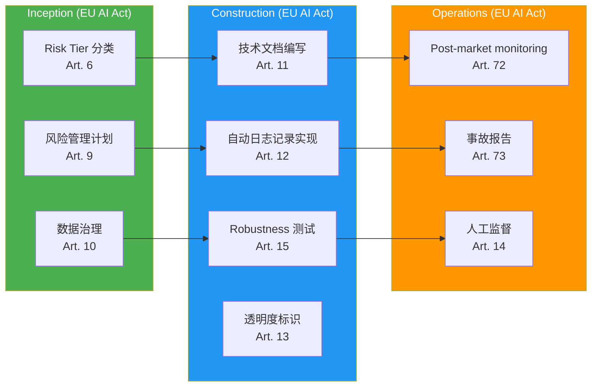

# EU AI Act (2024-2027)

> 📅 **编写日期**: 2026-04-18 | ⏱️ **阅读时间**: 约6分钟

---

## 概述

**EU AI Act** 于2024年5月通过,是**从2026年起分阶段实施**的全球首个综合性AI监管法规。

**实施时间表:**
- **2025年2月**: 禁止的AI系统实施 (Prohibited AI)
- **2026年8月**: 通用AI (GPAI) 提供者义务实施
- **2027年8月**: 高风险AI (High-risk) 系统义务全面实施

---

## Risk Tier 分类

EU AI Act将AI系统分为**4级风险度**:

| Risk Tier | 定义 | 示例 | 监管水平 |
|-----------|------|------|----------|
| **Prohibited** | 不可接受的风险 | 社会信用评分、实时远程生物识别 (执法除外) | **禁止** |
| **High-risk** | 高风险 | 招聘工具、信用评估、关键基础设施管理 | **严格义务事项** |
| **Limited risk** | 有限风险 | 聊天机器人、情绪识别 | **透明度义务** |
| **Minimal risk** | 最小风险 | 垃圾邮件过滤器、AI游戏 | **自律监管** |

**代码生成AI (AIDLC 对象) 分类:**
- **Limited risk**: 开发者意识到AI生成代码 → 透明度义务
- **High-risk** (有条件): 关键基础设施 (医疗、金融、电力) 代码自动生成时

---

## High-risk AI 义务事项

**Article 9-15 核心要求:**

### 1. 风险管理系统 (Art. 9)
- 全生命周期风险评估
- 识别·分析·缓解·监控

### 2. 数据治理 (Art. 10)
- 学习数据质量保证
- 偏见(bias)最小化

### 3. 技术文档 (Art. 11)
- 系统设计·开发·测试文档化
- 可提交给审计机构

### 4. 自动日志记录 (Art. 12)
- 所有决策可追溯
- 日志保存期限: 至少6个月

### 5. 透明度 (Art. 13)
- 向用户告知AI使用事实
- 可解释的输出

### 6. 人工监督 (HITL) (Art. 14)
- 重要决定由人最终批准
- 保障Override权限

### 7. 准确性·鲁棒性·网络安全 (Art. 15)
- 定义性能指标
- Adversarial attack 防御

---

## GPAI (General Purpose AI) 提供者义务

**Article 52-53**: Claude、GPT-4等通用模型提供者义务

- **透明度报告**: 公开学习数据、能源消耗量
- **版权遵守**: 明示学习数据来源
- **Systemic risk** (高级GPAI, 超过10^25 FLOP): 风险评估及缓解义务

---

## 违规罚款

| 违规类型 | 罚款 |
|----------|--------|
| 使用禁止的AI | **3500万欧元** 或 **全球营业额的7%** (取较大者) |
| High-risk AI 义务违反 | **1500万欧元** 或 **营业额的3%** |
| 提供不准确信息 | **750万欧元** 或 **营业额的1.5%** |

---

## AIDLC 映射

### Inception 阶段检查清单

- [ ] Risk Tier 分类 (Limited/High-risk 判定)
- [ ] 风险管理计划制定 (风险识别·缓解策略)
- [ ] 数据治理政策定义 (学习数据来源、偏见缓解)

### Construction 阶段检查清单

- [ ] 技术文档自动生成 (设计·开发·测试文档)
- [ ] 审计日志实现 (所有AI决策记录)
- [ ] Robustness 测试 (Adversarial attack、边界案例)
- [ ] AI生成代码透明度标识 (`# AI-GENERATED: Claude 3.7 Sonnet`)

### Operations 阶段检查清单

- [ ] Post-market monitoring (生产性能持续跟踪)
- [ ] 发生严重事故时15日内报告 (Art. 73)
- [ ] 人工监督流程运营 (重要决定批准)

---

## 参考资料

**官方文档:**
- [Regulation (EU) 2024/1689 (Official Text)](https://eur-lex.europa.eu/legal-content/EN/TXT/?uri=CELEX:32024R1689)
- [EU AI Act Timeline (European Commission)](https://digital-strategy.ec.europa.eu/en/policies/regulatory-framework-ai)

**相关文档:**
- [监管合规概述](../index.md)
- [治理框架](../../governance-framework.md)
- [Harness 工程](../../../methodology/harness-engineering.md)
