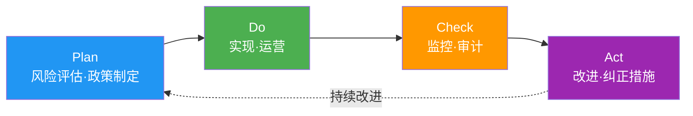

# ISO/IEC 42001:2023 (AI Management System)

> 📅 **编写日期**: 2026-04-18 | ⏱️ **阅读时间**: 约5分钟

---

## 概述

**ISO/IEC 42001:2023** 是2023年12月发布的 **AI管理系统(AIMS)国际标准**。

**特征:**
- **可认证**: 与 ISO 9001 (质量)、ISO 27001 (信息安全) 相同结构
- **基于 PDCA**: Plan-Do-Check-Act 循环
- **可集成**: 可与 ISMS (ISO 27001)、QMS (ISO 9001) 集成运营

---

## PDCA 结构



### Plan (计划)
- AI管理系统范围定义
- 风险及机会评估
- AI政策制定
- 目标设定

### Do (执行)
- AI系统开发及部署
- 运营控制实现
- 能力及意识培训
- 文档化

### Check (检查)
- 性能监控
- 内部审计
- 管理层审查
- 合规评估

### Act (改进)
- 不合格事项纠正
- 持续改进
- 反馈循环
- 经验学习

---

## Annex A Controls (9个类别)

| 类别 | Controls 数 | 主要内容 |
|----------|-------------|----------|
| **A.5 政策** | 3 | AI政策文档化、管理层批准 |
| **A.6 组织** | 7 | 角色·责任、资源分配 |
| **A.7 数据** | 12 | 数据质量、来源、偏见缓解 |
| **A.8 信息** | 8 | 透明度、可解释性、文档化 |
| **A.9 人力资源** | 6 | AI能力、伦理培训 |
| **A.10 运营** | 15 | AI生命周期管理、监控 |
| **A.11 性能** | 5 | 性能指标、持续改进 |
| **A.12 安全** | 10 | Adversarial attack 防御、隐私 |
| **A.13 第三方** | 6 | 供应链管理、开源模型 |

**AIDLC 映射:**
- **A.7 数据**: Inception → 数据治理政策
- **A.10 运营**: Construction → Harness Quality Gates
- **A.11 性能**: Operations → 持续监控

---

## 认证流程

**ISO/IEC 42001 认证4阶段:**

### 1. Gap Analysis
- 当前状态 vs ISO 42001 要求差异分析
- 识别不足的 Controls
- 制定实施路线图

### 2. Stage 1 Audit (文档审查)
- 审查政策、程序、技术文档
- 评估AI管理系统设计适当性
- 确认 Stage 2 Audit 准备事项

### 3. Stage 2 Audit (现场审查)
- 确认实际实现
- 审查运营证据
- 访谈及观察
- 指出不合格事项

### 4. 认证颁发及维护
- 有效期: 3年
- 年度 surveillance audit (维护审查)
- 每3年重新认证审查

**AIDLC 应对**: [治理框架](../../governance-framework.md) 指导文件 → ISO 42001 Controls 自动映射

---

## ISMS/QMS 集成

**ISO 42001 + ISO 27001 集成协同:**
- **A.12 安全** (ISO 42001) ↔ **A.8 资产管理** (ISO 27001)
- **A.10 运营** (ISO 42001) ↔ **A.12 运营安全** (ISO 27001)
- 单次审计可同时更新两个认证

**ISO 42001 + ISO 9001 集成:**
- **A.11 性能** (ISO 42001) ↔ **8. 运营** (ISO 9001)
- **A.5 政策** (ISO 42001) ↔ **5. 领导力** (ISO 9001)
- 质量管理系统与AI管理系统集成运营

---

## AIDLC 集成示例

### Inception 阶段: A.7 数据治理

```yaml
# .aidlc/compliance/iso-42001-data-governance.yaml
data_governance:
  # A.7.1: 数据收集
  collection:
    sources:
      - "GitHub public repositories"
      - "Stack Overflow"
    licensing: "MIT, Apache 2.0"
    
  # A.7.3: 数据质量
  quality:
    validation_rules:
      - "syntax correctness"
      - "no PII/credentials"
    rejection_criteria:
      - "license violation"
      - "malicious code"
  
  # A.7.5: 偏见缓解
  bias_mitigation:
    strategy: "多样化语言/框架平衡"
    monitoring: "生成代码语言分布跟踪"
```

### Construction 阶段: A.10 运营控制

```yaml
# .aidlc/harness/iso-42001-controls.yaml
operational_controls:
  # A.10.2: 风险管理
  - control_id: A.10.2
    name: "AI系统风险管理"
    implementation: "Quality Gates (SAST, 独立审查)"
    
  # A.10.5: 人工介入
  - control_id: A.10.5
    name: "人工监督"
    implementation: "Senior Developer 代码审查必需"
    
  # A.10.10: 持续监控
  - control_id: A.10.10
    name: "持续监控"
    implementation: "Grafana 仪表板 (性能指标)"
```

### Operations 阶段: A.11 性能测量

```yaml
# .aidlc/monitoring/iso-42001-performance.yaml
performance_kpis:
  # A.11.1: 性能指标
  - metric: "code_quality"
    target: "代码覆盖率 >= 80%"
    measurement: "SonarQube"
    
  - metric: "security_compliance"
    target: "重大漏洞 0件"
    measurement: "Bandit, Semgrep"
    
  # A.11.3: 持续改进
  improvement_process:
    frequency: "quarterly"
    review: "管理层审查会议"
    actions:
      - "指标未达标时流程改进"
      - "Best practice 更新"
```

---

## 参考资料

**官方文档:**
- [ISO/IEC 42001:2023 (ISO Store)](https://www.iso.org/standard/81230.html)
- [ISO 42001 Implementation Guide (BSI)](https://www.bsigroup.com/en-GB/iso-42001-artificial-intelligence-management-system/)

**认证机构:**
- [BSI (British Standards Institution)](https://www.bsigroup.com/)
- [DNV (Det Norske Veritas)](https://www.dnv.com/)
- [TÜV SÜD](https://www.tuvsud.com/)

**相关文档:**
- [监管合规概述](../index.md)
- [治理框架](../../governance-framework.md)
- [Harness 工程](../../../methodology/harness-engineering.md)
