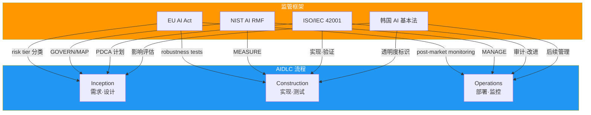

# AI 监管框架映射

> 📅 **编写日期**: 2026-04-18 | ⏱️ **阅读时间**: 约8分钟

---

## 概述

截至2026年,全球企业面临**同时遵守多个地区AI监管**的复杂环境:

- **EU**: AI Act (2024年通过,2026-2027年分阶段实施)
- **美国**: NIST AI RMF 1.1 (联邦采购要求),各州独立监管
- **韩国**: AI 基本法 (AI 기본법) (2026年预计实施)
- **国际标准**: ISO/IEC 42001:2023 (AI Management System 认证)

### 为什么需要 AIDLC 集成

将监管要求**直接映射到 AIDLC 流程阶段**可实现:

1. **自动合规**: 在每个阶段自动执行所需的控制措施
2. **统一审计日志**: 使用单一审计跟踪体系应对所有监管
3. **高效更新**: 监管变化时仅需修改 AIDLC 阶段定义
4. **证据自动收集**: 自动生成合规报告

---

## 四个框架摘要

### EU AI Act (2024-2027)

**核心特征:**
- 全球首个综合性AI监管 (具有法律约束力)
- 4级风险分类 (Prohibited/High-risk/Limited/Minimal)
- 高风险AI系统严格义务 (风险管理、数据治理、技术文档、自动日志记录、透明度、人工监督、鲁棒性)
- 违规罚款: 最高3500万欧元或全球营业额的7%

**AIDLC 应用:**
- **Inception**: Risk Tier 分类、风险管理计划
- **Construction**: 技术文档自动生成、审计日志、Robustness 测试
- **Operations**: Post-market monitoring、事故报告 (15日内)

[详细指南 →](./frameworks/eu-ai-act.md)

### NIST AI RMF 1.1

**核心特征:**
- 美国 NIST 发布 (自愿遵守,联邦采购必需)
- 4 Functions: GOVERN、MAP、MEASURE、MANAGE
- Generative AI 专用章节 (v1.1, 2024.12)
- 国际兼容 (可与 ISO/IEC 42001 互相映射)

**AIDLC 应用:**
- **Inception**: GOVERN + MAP (治理·风险识别)
- **Construction**: MEASURE (性能·偏见·鲁棒性评估)
- **Operations**: MANAGE (风险应对·持续监控)

[详细指南 →](./frameworks/nist-ai-rmf.md)

### ISO/IEC 42001:2023

**核心特征:**
- 国际标准 AI 管理系统 (可认证)
- 基于 PDCA (Plan-Do-Check-Act 循环)
- 9个类别72个 Controls (Annex A)
- 可与 ISMS (ISO 27001)、QMS (ISO 9001) 集成运营

**AIDLC 应用:**
- **Inception**: Plan (风险评估·政策制定)
- **Construction**: Do + Check (实现·验证·监控)
- **Operations**: Act (改进·纠正措施)

[详细指南 →](./frameworks/iso-42001.md)

### 韩国 AI 基本法 (AI 기본법) (2026)

**核心特征:**
- 2026年上半年预计实施
- 高影响AI系统事前影响评估义务
- 生成式AI标识义务 (建议使用水印/元数据)
- 与 PIPA/ISMS-P 交叉遵守

**AIDLC 应用:**
- **Inception**: 影响评估 (高影响AI判定)
- **Construction**: AI生成代码透明度标识
- **Operations**: 后续管理 (故障纠正、重大事故报告)

[详细指南 →](./frameworks/korea-ai-law.md)

---

## 交叉映射表 (Comparative Matrix)

### 按控制要素的监管映射

| 控制要素 | EU AI Act | NIST AI RMF | ISO/IEC 42001 | 韩国 AI 基本法 |
|----------|-----------|-------------|---------------|---------------|
| **风险评估** | Art. 6, 9 (风险管理) | MAP-3.1 | A.5.1 (政策), A.10.2 (风险管理) | 影响评估 (高影响AI) |
| **数据治理** | Art. 10 (数据质量) | MAP-2.1 | A.7.* (数据12个controls) | PIPA 遵守 |
| **透明度·可解释性** | Art. 13 (透明度) | MEASURE-2.1 | A.8.2 (透明度), A.8.3 (说明) | 生成式AI标识义务 |
| **人工监督 (HITL)** | Art. 14 (人工监督) | MANAGE-3.1 | A.10.5 (人工介入) | - |
| **技术文档** | Art. 11 (文档化) | GOVERN-1.4 | A.8.1 (文档), A.10.6 (记录) | - |
| **性能监控** | Art. 15 (准确性) | MEASURE-1.1 | A.11.1 (性能指标) | - |
| **后续监控** | Art. 72 (post-market) | MANAGE-3.1 | A.10.10 (持续监控) | 后续管理义务 |
| **事故报告** | Art. 73 (15日内) | MANAGE-2.1 | A.10.11 (事故响应) | 重大事故报告 |
| **安全** | Art. 15 (网络安全) | MEASURE-2.3 | A.12.* (安全10个) | ISMS-P 联动 |
| **供应链管理** | - | GOVERN-1.5 | A.13.* (第三方6个) | - |

### 按 AIDLC 阶段的监管要求汇总

```mermaid
graph TB
    subgraph Inception["Inception 阶段"]
        I1["EU AI Act: Risk Tier 分类 (Art. 6)"]
        I2["NIST: GOVERN + MAP"]
        I3["ISO 42001: Plan (PDCA)"]
        I4["韩国: 影响评估"]
    end
    
    subgraph Construction["Construction 阶段"]
        C1["EU AI Act: 文档化 (Art. 11), 日志记录 (Art. 12)"]
        C2["NIST: MEASURE"]
        C3["ISO 42001: Do + Check (PDCA)"]
        C4["韩国: 生成标识义务"]
    end
    
    subgraph Operations["Operations 阶段"]
        O1["EU AI Act: Post-market monitoring (Art. 72)"]
        O2["NIST: MANAGE"]
        O3["ISO 42001: Act (PDCA)"]
        O4["韩国: 后续管理"]
    end
    
    I1 -.共同目标: 风险识别.-> I2
    I2 -.共同目标: 风险识别.-> I3
    I3 -.共同目标: 风险识别.-> I4
    
    C1 -.共同目标: 安全性验证.-> C2
    C2 -.共同目标: 安全性验证.-> C3
    C3 -.共同目标: 安全性验证.-> C4
    
    O1 -.共同目标: 持续监控.-> O2
    O2 -.共同目标: 持续监控.-> O3
    O3 -.共同目标: 持续监控.-> O4
    
    style Inception fill:#4caf50,color:#fff
    style Construction fill:#2196f3,color:#fff
    style Operations fill:#ff9800,color:#fff
```

---

## 下一步

import DocCardList from '@theme/DocCardList';

<DocCardList />

---

## 参考资料

### 官方文档

**EU AI Act:**
- [Regulation (EU) 2024/1689 (Official Text)](https://eur-lex.europa.eu/legal-content/EN/TXT/?uri=CELEX:32024R1689)
- [EU AI Act Timeline (European Commission)](https://digital-strategy.ec.europa.eu/en/policies/regulatory-framework-ai)

**NIST AI RMF:**
- [NIST AI RMF 1.1 (2024.12)](https://www.nist.gov/itl/ai-risk-management-framework)
- [Executive Order 14110 (White House)](https://www.whitehouse.gov/briefing-room/presidential-actions/2023/10/30/executive-order-on-the-safe-secure-and-trustworthy-development-and-use-of-artificial-intelligence/)

**ISO/IEC 42001:**
- [ISO/IEC 42001:2023 (ISO Store)](https://www.iso.org/standard/81230.html)
- [ISO 42001 Implementation Guide (BSI)](https://www.bsigroup.com/en-GB/iso-42001-artificial-intelligence-management-system/)

**韩国 AI 基本法:**
- [科学技术信息通信部 AI 政策](https://www.msit.go.kr/bbs/list.do?sCode=user&mId=113&mPid=112)
- [个人信息保护法 (PIPA, 개인정보보호법)](https://www.pipc.go.kr/np/default/page.do?mCode=D030010000)

### AWS 相关资料

- [AWS Artifact (Compliance Reports)](https://aws.amazon.com/artifact/) — EU AI Act、ISO 42001 应对报告
- [AWS Compliance Center](https://aws.amazon.com/compliance/programs/) — 按地区监管映射
- [Amazon Bedrock Guardrails](https://docs.aws.amazon.com/bedrock/latest/userguide/guardrails.html) — 运行时护栏实现

### 相关 AIDLC 文档

- [治理框架](../governance-framework.md) — 三层治理模型、指导文件
- [Harness 工程](../../methodology/harness-engineering.md) — Quality Gates、独立验证原则
- [Adaptive Execution](../../methodology/adaptive-execution.md) — AIDLC 各阶段执行条件
- [采用策略](../adoption-strategy.md) — 按组织的 AIDLC 采用路线图
