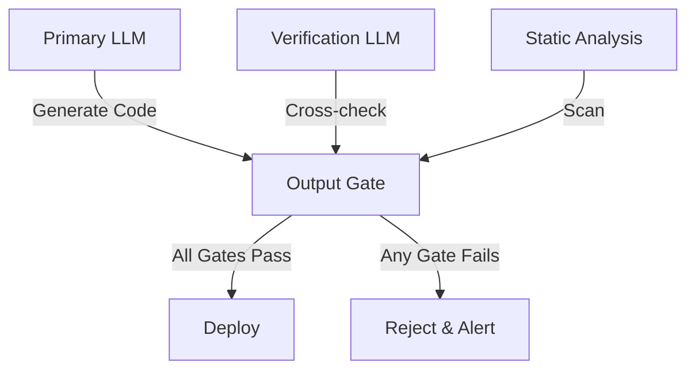
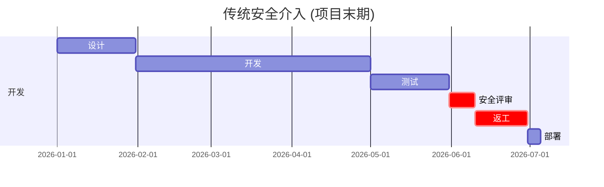
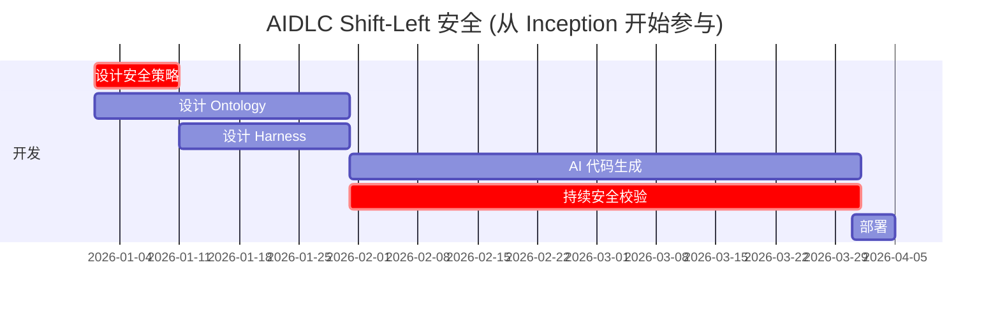
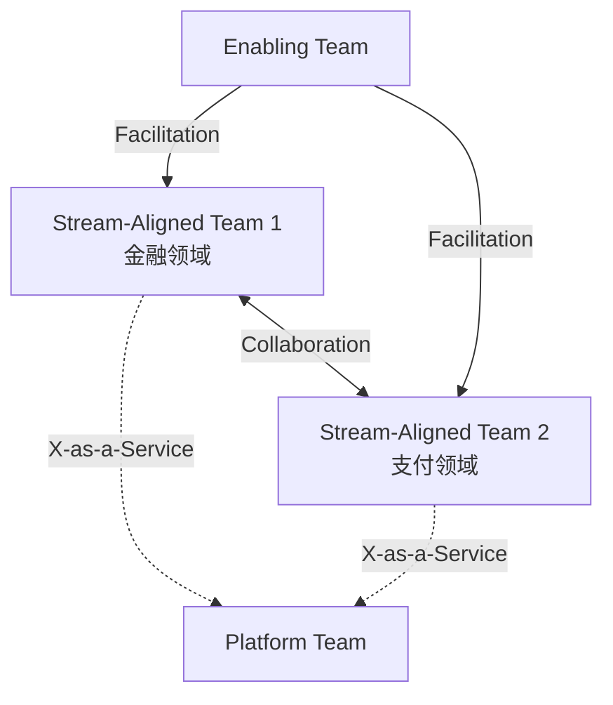

# 角色再定义

AIDLC 通过代码生成自动化从根本上改变传统 SI 团队结构。核心洞察是:**当 AI 承担代码生成后,人转向 Harness 设计、Ontology 管理、AI 输出校验**。

## 传统 SI 角色模型

传统 SI 项目以顺序式交接结构运行:


### 各角色职责

- **项目经理**: 范围定义、进度管理、客户沟通
- **设计师**: 架构设计、技术栈选型、接口定义
- **开发者**: 编码、单元测试、集成开发 (占团队 60~70%)
- **QA**: 编写测试用例、手工测试、缺陷跟踪 (占团队 15~20%)
- **安全负责人**: 在项目末期做漏洞扫描、安全评审 (每项目 1~2 人)

### 问题点

1. **顺序式交接**: 每个阶段都会产生上下文损失
2. **安全介入过晚**: 项目末期发现漏洞时返工成本骤增
3. **开发者瓶颈**: 团队大部分人投入编码,生产力依赖个人能力
4. **测试滞后**: QA 在开发完成后才开始,反馈周期变长

## AIDLC 角色转型

在 AIDLC 方法论中,角色被根本性地重新定义:

| 传统角色 | AIDLC 角色 | 变化内容 |
|----------|-----------|---------|
| 项目经理 | Intent Architect | 将业务意图转化为 AI 可理解的结构化规约 |
| 设计师 | Ontology Steward | 管理领域 Ontology 的设计 / 进化,知识图谱策展 |
| 开发者 | Harness 工程师 | 从写代码转向设计 Harness (断路器、质量门) |
| QA | AI 校验员 | 从手工测试转向校验 AI 生成测试的质量、测量 Harness 有效性 |
| 安全负责人 | Shift-Left 安全 | 从项目末期前移至 Inception 阶段,设计 Harness 安全策略 |

### Intent Architect

**传统 PM** 管理范围与进度,而 **Intent Architect** 将业务意图转化为 AI 可执行的结构。

#### 核心能力
- 将客户需求映射到领域 Ontology 实体
- 编写意图规约 (structured intent specification)
- 校验 AI 生成结果是否与业务意图一致
- 将变更请求表达为 Ontology 补丁

#### 工具
- Ontology 可视化工具 (Neo4j Bloom, GraphXR)
- 意图规约模板 (YAML/JSON schema)
- 业务规则引擎 (Drools, DMN)

### Ontology Steward

**传统设计师** 设计技术架构,而 **Ontology Steward** 设计并演化领域知识结构。

#### 核心能力
- 设计领域 Ontology (实体、关系、约束)
- Ontology 版本管理与迁移
- 多领域 Ontology 集成 (金融+支付、医疗+保险)
- Ontology 质量校验 (一致性、完整性、消除歧义)

#### 工具
- Ontology 编辑器 (Protégé, WebVOWL)
- 图数据库 (Neo4j, Amazon Neptune)
- RDF/OWL 转换工具

#### 与传统设计师的差异

| 方面 | 传统设计师 | Ontology Steward |
|-----|-----------|------------------|
| 产物 | API 规约、ERD | Ontology schema、知识图谱 |
| 工具 | UML、Swagger | Protégé、Neo4j |
| 校验方法 | 技术评审 | 推理引擎校验 (reasoning) |
| 变更管理 | 版本管理 (Git) | Ontology 补丁 (semantic diff) |

详情参见 [Ontology 工程](../methodology/ontology-engineering.md)。

## Harness 工程师角色详解

### 范式转换: "代码生成归 AI,人类是 Harness 设计者"

在 OpenAI Codex 案例中,100 万行以上代码由 AI 生成,而 **人类工程师专注于 Harness 设计** 以保障质量与稳定。

> "We don't write code anymore. We design guardrails and circuit breakers that keep AI-generated code safe and aligned with business intent."  
> — Production Engineering Team, OpenAI (2024)

### 核心能力

#### 1. 断路器设计

为应对 AI 生成代码的非预期行为,设计自动中断机制:

```yaml
# 示例: API 调用断路器
circuit_breaker:
  failure_threshold: 5
  timeout_seconds: 30
  fallback_strategy: cached_response
  monitoring:
    - metric: error_rate
      threshold: 0.05
      window: 5m
```

#### 2. 重试预算管理

限制 AI 代理的重试次数与成本:

```yaml
# 示例: LLM 调用重试预算
retry_budget:
  max_attempts: 3
  backoff_strategy: exponential
  cost_limit_usd: 0.50
  circuit_breaker:
    - condition: token_count > 8000
      action: switch_to_smaller_model
```

#### 3. 定义输出门

AI 生成结果在部署到生产前必须通过的校验门:

```yaml
# 示例: 代码生成输出门
output_gates:
  - name: security_scan
    tools: [semgrep, bandit]
    blocking: true
  - name: unit_test_coverage
    threshold: 0.85
    blocking: true
  - name: performance_regression
    baseline: p95_latency_100ms
    blocking: false
    alert: slack_channel
```

#### 4. 独立校验结构

用另一个 AI 模型或独立工具对 AI 生成结果进行交叉校验:



### 与传统开发者的差异

| 方面 | 传统开发者 | Harness 工程师 |
|-----|-----------|---------------|
| 主要活动 | 编码 (80%) | Harness 设计 (70%)、校验 (30%) |
| 生产力指标 | 提交数、LOC | Harness 命中率、缺陷预防率 |
| 技术栈 | 编程语言 | YAML/JSON DSL、监控工具 |
| 调试方式 | 读代码 | 分析 Harness 日志、追踪 AI 决策 |
| 协作方式 | 代码评审 | Harness 评审、Ontology 同步 |

详情参见 [Harness 工程](../methodology/harness-engineering.md)。

## AI 校验员

**传统 QA** 执行手工测试,而 **AI 校验员** 校验 AI 生成测试的质量,并测量 Harness 是否真的预防了缺陷。

### 核心能力

#### 1. AI 生成测试的质量校验
- 测试用例覆盖率分析 (核对遗漏的边缘用例)
- 校验测试数据多样性 (boundary、negative、fuzzing)
- 识别并剔除易抖测试 (flaky test)

#### 2. Harness 有效性测量
- 断路器命中率 (false positive/negative 比例)
- 输出门阻断率 (哪个门阻止了最多缺陷)
- 重试预算消耗模式 (哪些场景频繁重试)

#### 3. 独立校验设计
- 用与 Primary LLM 不同的模型做交叉校验
- 测量静态分析工具与 AI 判断的一致度
- 对比生产数据与生成数据分布

### 与传统 QA 的差异

| 方面 | 传统 QA | AI 校验员 |
|-----|--------|----------|
| 编写测试 | 手工编写 (80%) | 校验 AI 生成测试 (90%) |
| 发现缺陷方式 | 手工执行 | 分析 Harness 日志 |
| 覆盖率目标 | 行覆盖率 | 意图覆盖率 (intent coverage) |
| 回归测试 | 全量执行 | 由 Harness 自动筛选 |

## 团队构成比例变化

AIDLC 引入会从根本上改变团队构成比例。

### 小型项目 (5 人)

| 传统比例 | AIDLC 比例 |
|----------|-----------|
| PM 1 人 (20%) | Intent Architect 1 人 (20%) |
| 开发者 3 人 (60%) | Harness 工程师 2 人 (40%) |
| QA 1 人 (20%) | AI 校验员 1 人 (20%) |
| - | Ontology Steward 1 人 (20%) |

**解读**: 开发者 3 人可缩减为 Harness 工程师 2 人。Harness 工程师 1 人借助 AI 产出相当于传统开发者 1.5 人的产物。

### 中型项目 (15 人)

| 传统比例 | AIDLC 比例 |
|----------|-----------|
| PM 2 人 (13%) | Intent Architect 2 人 (13%) |
| 设计师 2 人 (13%) | Ontology Steward 2 人 (13%) |
| 开发者 8 人 (53%) | Harness 工程师 6 人 (40%) |
| QA 2 人 (13%) | AI 校验员 3 人 (20%) |
| 安全 1 人 (7%) | Shift-Left 安全 2 人 (13%) |

**解读**:
- 开发者 8 人 → Harness 工程师 6 人: AI 承担代码生成,人设计 Harness
- QA 2 人 → AI 校验员 3 人: 手工测试减少,Harness 校验增加
- 安全 1 人 → 2 人: Shift-Left,自 Inception 阶段介入

### 大型项目 (50 人)

| 传统比例 | AIDLC 比例 |
|----------|-----------|
| PM 5 人 (10%) | Intent Architect 5 人 (10%) |
| 设计师 5 人 (10%) | Ontology Steward 6 人 (12%) |
| 开发者 30 人 (60%) | Harness 工程师 20 人 (40%) |
| QA 7 人 (14%) | AI 校验员 10 人 (20%) |
| 安全 3 人 (6%) | Shift-Left 安全 9 人 (18%) |

**解读**:
- 开发者 30 人 → Harness 工程师 20 人: **减员 33%** 或 **同样人力实现多 50% 的功能开发**
- 安全 3 人 → 9 人: Shift-Left 人力增加 3 倍,但项目末期返工成本降低 90%
- Ontology Steward 6 人: 管理复杂领域 Ontology (金融、医疗、物流整合)

### 成本效应

| 项目规模 | 传统成本 | AIDLC 成本 | 节省 |
|----------|---------|-----------|------|
| 小型 (5 人) | 100% | 85% | 节省 15% |
| 中型 (15 人) | 100% | 75% | 节省 25% |
| 大型 (50 人) | 100% | 67% | 节省 33% |

详细成本分析参见 [成本效益](./cost-estimation.md)。

## 安全 Shift-Left

传统上安全负责人在 **项目末期** 介入进行漏洞扫描。发现问题时大规模返工,造成进度延迟与成本上升。

### 传统安全介入时点



**问题**:
- 安全漏洞在开发完成后才发现 → 返工成本增加 10 倍
- 安全评审成为部署阻塞 → 延期
- 安全与开发之间存在上下文错配

### AIDLC Shift-Left 安全



**效果**:
- 将安全策略嵌入 Harness → 代码生成时就应用安全规则
- 持续安全校验 → 漏洞被即时发现与自动修复
- 返工成本 **降低 90%** (NIST 研究: Shift-Left 效益)

### Shift-Left 安全职责

#### Inception 阶段
- 在领域 Ontology 中定义安全约束
- 将安全策略写成 Harness YAML
- 威胁建模 (STRIDE、DREAD)

#### 开发阶段
- Harness 实时校验 AI 生成代码
- 发现漏洞时自动告警与修复建议
- 安全门监控 (SAST、DAST、SCA)

#### 部署阶段
- 最终校验生产 Harness 策略
- 配置运行时安全监控 (RASP、WAF)

### 安全 Harness 示例

```yaml
# 示例: 防 SQL Injection Harness
security_harness:
  - name: sql_injection_guard
    trigger: ai_generates_sql_query
    checks:
      - type: static_analysis
        tools: [semgrep, sqlmap]
      - type: parameterized_query_validation
        enforce: true
      - type: input_sanitization
        allowed_patterns: [alphanumeric, underscore]
    action_on_failure: block_and_alert
    fallback: use_orm_instead
```

## 团队拓扑模式

AIDLC 组织遵循 Team Topologies (Matthew Skelton、Manuel Pais) 模式:

### Stream-Aligned Team

**目的**: 实现特定业务领域的端到端价值流

**构成**:
- Intent Architect 1 人
- Ontology Steward 1 人
- Harness 工程师 3~5 人
- AI 校验员 1~2 人
- Shift-Left 安全 1 人 (可兼任)

**职责**:
- 拥有领域 Ontology
- Harness 设计与实现
- 校验与部署 AI 生成代码

### Platform Team

**目的**: 运营 Harness 基础设施、AI 模型服务、Ontology 仓库

**构成**:
- Platform Engineer 3~5 人
- MLOps Engineer 2~3 人
- Ontology Architect 1~2 人

**职责**:
- Harness 框架开发与维护
- 管理 AI 模型部署流水线
- 运营 Ontology 仓库 (Neo4j、Amazon Neptune)
- 提供通用 Harness 库

### Enabling Team

**目的**: 增强 Stream-Aligned Team 的 AIDLC 能力

**构成**:
- AIDLC 教练 2~3 人
- Ontology 培训师 1~2 人
- Harness 最佳实践策展人 1 人

**职责**:
- AIDLC 方法论培训
- 运营 Ontology 设计工作坊
- Harness 模式库策展
- 促进团队间知识共享

### 团队交互模式



- **X-as-a-Service**: Platform Team 将 Harness 基础设施作为服务提供
- **Facilitation**: Enabling Team 临时支援 Stream-Aligned Team
- **Collaboration**: Ontology 集成时 Stream-Aligned Team 之间协作

## 引入策略

角色转型需渐进推进。详细路线图参见 [落地策略](./adoption-strategy.md)。

### Phase 1: 试点 (1 个团队,3 个月)
- 在传统开发者中选拔志愿者 → 培训为 Harness 工程师
- 在小型项目中应用 AIDLC
- 初步构建 Harness 模式库

### Phase 2: 扩展 (3~5 个团队,6 个月)
- 组建 Platform Team → Harness 基础设施标准化
- 组建 Enabling Team → 启动全组织培训
- 设立 Ontology Steward 角色 (按领域)

### Phase 3: 全公司落地 (整个组织,12 个月)
- 重组 Stream-Aligned Team (按领域)
- 扩展 Shift-Left 安全组织
- 运营 AIDLC CoE (Center of Excellence)

## 成功指标

衡量角色转型成败的指标:

### 团队层面
- **Harness 命中率**: Harness 实际预防缺陷的比例 (目标: 80% 以上)
- **AI 代码生成率**: AI 生成代码占全部代码的比例 (目标: 70% 以上)
- **Ontology 复用率**: 复用既有 Ontology 实体的比例 (目标: 60% 以上)

### 组织层面
- **开发人力效率**: 同等人力可实现的功能数 (目标: 增加 50%)
- **安全返工比例**: 修复安全漏洞所耗时间比例 (目标: 5% 以下)
- **项目进度达成率**: 相比计划的进度达成比 (目标: 90% 以上)

## 参考资料

- [Harness 工程](../methodology/harness-engineering.md) — Harness 设计指南
- [Ontology 工程](../methodology/ontology-engineering.md) — Ontology Steward 角色详解
- [落地策略](./adoption-strategy.md) — 渐进角色转型路线图
- [成本效益](./cost-estimation.md) — 团队构成比例变化的成本影响
- Team Topologies (Matthew Skelton, Manuel Pais, 2019)
- "The Cost of Fixing Bugs: Shift-Left vs Shift-Right" (NIST, 2023)
