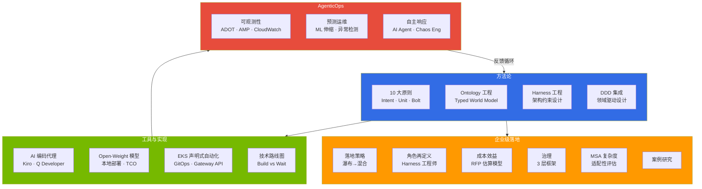

# AIDLC: AI-Driven Development Lifecycle

> **阅读时间**: 约 3 分钟

:::info 官方 AIDLC 参考
本章节基于 [AWS Labs AIDLC Workflows](https://github.com/awslabs/aidlc-workflows) (v0.1.7, 2026-04-02) 并叠加 DDD·Ontology·Harness 扩展。关于官方术语 (User Request/Requirements, Unit of Work) 与 engineering-playbook 术语 (Intent, Unit, Bolt) 的映射,请参阅 [10 大原则与执行模型](./methodology/principles-and-model.md#12-aws-labs-aidlc-官方术语映射)。
:::

AIDLC (AI-Driven Development Lifecycle) 是一种由 AI 主导软件开发全流程的新型开发方法论。如果说传统 SDLC 是以人为中心的流程,那么 AIDLC 则通过 **Intent → Unit → Bolt** 模型让 AI 从需求分析、设计、实现到测试加速整个开发周期。

**AIDLC 定义与 SDLC 对比详情**: 参见 [10 大原则与执行模型](/docs/aidlc/methodology/principles-and-model)

## 4 大轨道

AIDLC 指南根据读者的角色和关注点划分为 4 个轨道。

## 按角色划分的学习路径

| 角色 | 推荐路径 |
|------|----------|
| **管理层 · PM** | [企业级落地](/docs/aidlc/enterprise) → [成本效益](/docs/aidlc/enterprise/cost-estimation) → [案例研究](/docs/aidlc/enterprise/case-studies) |
| **架构师** | [方法论](/docs/aidlc/methodology) → [Ontology](/docs/aidlc/methodology/ontology-engineering) → [Harness](/docs/aidlc/methodology/harness-engineering) → [MSA 复杂度](/docs/aidlc/enterprise/msa-complexity) |
| **开发者** | [10 大原则](/docs/aidlc/methodology/principles-and-model) → [DDD 集成](/docs/aidlc/methodology/ddd-integration) → [AI 编码代理](/docs/aidlc/toolchain/ai-coding-agents) |
| **运维 · SRE** | [AgenticOps](/docs/aidlc/operations) → [可观测性](/docs/aidlc/operations/observability-stack) → [自主响应](/docs/aidlc/operations/autonomous-response) |
| **安全 · 合规** | [治理](/docs/aidlc/enterprise/governance-framework) → [Harness 工程](/docs/aidlc/methodology/harness-engineering) → [Open-Weight 模型](/docs/aidlc/toolchain/open-weight-models) |

## 核心概念

### 可信性双轴: Ontology × Harness

为系统性地保证 AI 生成代码的可信性,AIDLC 引入了两个轴的框架。Ontology 定义 "需要验证什么",Harness 实现 "如何验证",两者互为补充。

→ 详情请参阅 [Ontology 工程](/docs/aidlc/methodology/ontology-engineering) · [Harness 工程](/docs/aidlc/methodology/harness-engineering)

## 参考资料

### 官方参考
- [AWS Labs AIDLC Workflows](https://github.com/awslabs/aidlc-workflows) — 官方仓库 (v0.1.7)
- [AWS Labs Common Rules](https://github.com/awslabs/aidlc-workflows/tree/main/aws-aidlc-rule-details/common) — 11 项通用规则
- [AWS Labs Inception Stages](https://github.com/awslabs/aidlc-workflows/tree/main/aws-aidlc-rule-details/inception) — 7 个阶段 Adaptive Execution
- [AWS Labs Extensions](https://github.com/awslabs/aidlc-workflows/tree/main/aws-aidlc-rule-details/extensions) — opt-in 扩展机制
- [AWS AI-Driven Development Life Cycle Blog](https://aws.amazon.com/blogs/devops/ai-driven-development-life-cycle/)
- [Open-Sourcing Adaptive Workflows for AI-DLC](https://aws.amazon.com/blogs/devops/open-sourcing-adaptive-workflows-for-ai-driven-development-life-cycle-ai-dlc/)
