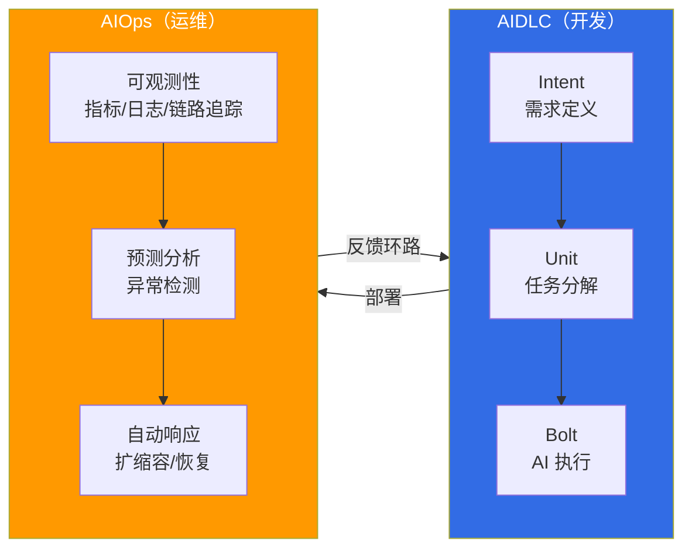

# AIDLC: AI-Driven Development Lifecycle

> **阅读时间**：约 3 分钟

AIDLC（AI-Driven Development Lifecycle）是一种由 AI 主导软件开发全过程的新型开发方法论。如果说传统 SDLC（Software Development Lifecycle）是以人为中心的流程，那么 AIDLC 通过 **Intent → Unit → Bolt** 模型，让 AI 从需求分析到设计、实现、测试，加速整个开发周期。

## 核心概念

AIDLC 由三个核心轴组成：

- **Intent（意图）**：由人以自然语言定义需求和业务意图。Kiro 的 Spec-driven 开发（requirements → design → tasks → 代码）支持这一阶段。
- **Unit（单元）**：AI 将意图分解为可执行的单元任务。结合 DDD（Domain-Driven Design）与 BDD/TDD 来保障质量。
- **Bolt（执行）**：AI 自动执行代码生成、测试编写和部署流水线配置。

## 可靠性双轴：本体论 × 约束工程

为了系统性地保障 AI 生成代码的可靠性，AIDLC 引入了两轴可靠性框架：

- **本体论（WHAT + WHEN）**：将领域知识形式化的 typed world model。通过自身反馈环路（Inner/Middle/Outer）持续演进的活的模型，防止 AI 幻觉。
- **约束工程（HOW）**：以架构方式验证和强制执行本体论定义的约束的结构

## AIDLC 十大原则

AIDLC 框架定义了十大原则来系统化 AI 驱动的开发。详细内容请参阅 [AIDLC 框架](./aidlc-framework.md)。

## 开发之后：运维与反馈环路

在通过 AIDLC 完成软件开发之后，需要在实际运维环境中进行**持续改进和反馈环路**。相关方法请参阅 [AIOps](/docs/aidlc/agentic-ops)。AIOps 是一种利用 AI 系统性构建运维可观测性、预测扩缩容、自动恢复等运维效率化反馈环路的方法论。

:::info 学习路径
1. [AIDLC 框架](./aidlc-framework.md) — 十大原则、Intent→Unit→Bolt 模型、DDD 集成、EKS 能力映射
2. [AIOps](/docs/aidlc/agentic-ops) — 开发之后的运维反馈环路构建
:::

## 参考资料

- [AWS AI-Driven Development Life Cycle](https://aws.amazon.com/blogs/devops/ai-driven-development-life-cycle/)
- [AWS Labs AIDLC Workflows (GitHub)](https://github.com/awslabs/aidlc-workflows)
