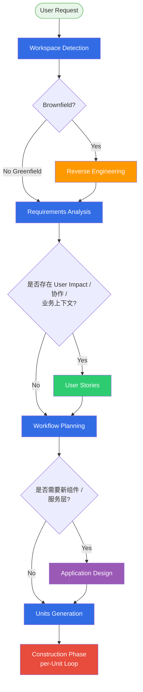
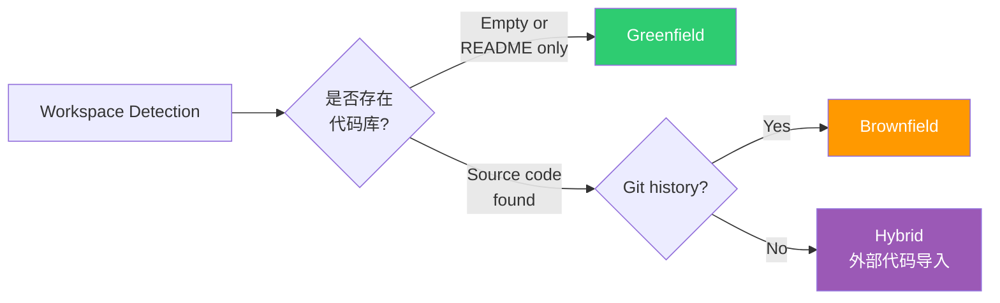
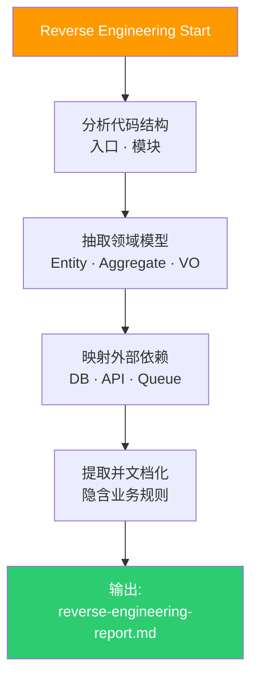
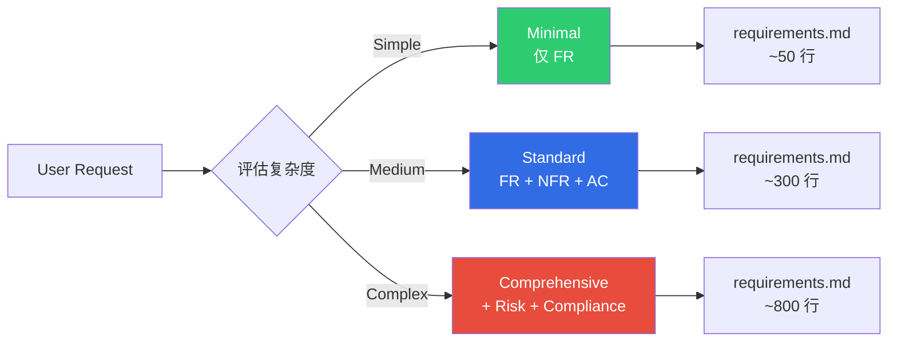
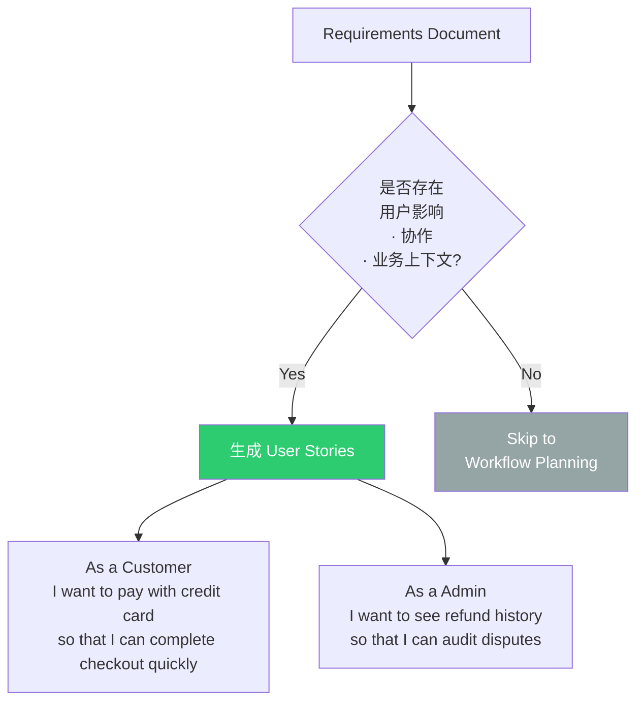
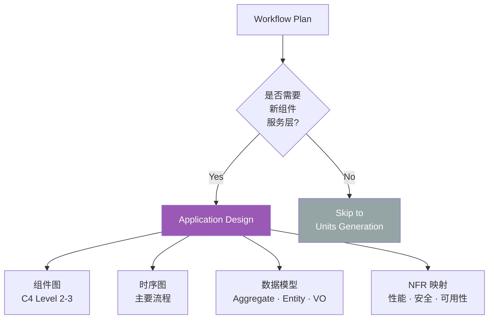
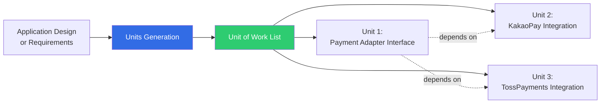
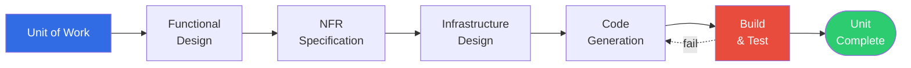
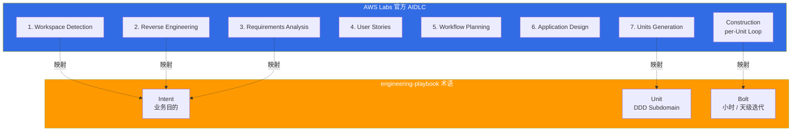

# AIDLC Adaptive Execution

> 📅 **撰写日期**: 2026-04-18 | ⏱️ **阅读时间**: 约 20 分钟

---

## 1. 概览: 为什么是 Adaptive

AWS Labs [AIDLC Workflows](https://github.com/awslabs/aidlc-workflows) 默认采用 **条件式 (adaptive) 执行,而非固定工作流**。如果说传统 SDLC 的各阶段 "始终顺序执行",那么 AIDLC 则根据项目特征、代码库状态、需求复杂度 **只选择、只重排所需的 stage**。



**核心信息:**
- **Workspace Detection** 与 **Workflow Planning** 为 **必需** (始终执行)
- **Reverse Engineering · User Stories · Application Design** 为 **条件执行** (按项目特性执行 / 跳过)
- **Requirements Analysis** 与 **Units Generation** 几乎始终执行,但 **深度 (Minimal/Standard/Comprehensive)** 会调整

:::info AWS Labs 官方说明
> "AIDLC is adaptive rather than prescriptive. Each stage's execution is conditional on the workspace state and user needs, allowing teams to skip stages that aren't relevant to their specific project."
>
> — [AWS Labs AIDLC Workflows, v0.1.7](https://github.com/awslabs/aidlc-workflows)
:::

---

## 2. Inception Phase: 7 个 Stage Decision Tree

### 2.1 Stage 1: Workspace Detection (必需)

**目的**: 判定当前工作空间是 **Greenfield** (新建) 还是 **Brownfield** (存在既有代码库)。



**执行条件**: 始终执行 (所有 AIDLC 会话的起点)

**产物**: `.aidlc/workspace.md`
```markdown
## Workspace Detection Result

**Type**: Brownfield
**Primary Language**: TypeScript (72%), Go (18%), YAML (10%)
**Framework**: Next.js 14 (detected from package.json)
**Infrastructure**: EKS 1.35 (detected from k8s/ directory)
**Git**: main branch, 847 commits
**Test Coverage**: 68% (发现 jest coverage 报告)
```

### 2.2 Stage 2: Reverse Engineering (Brownfield 条件)

**目的**: 在既有代码库中通过逆向工程提取 **隐含需求、领域模型、架构约束**。

**执行条件**:
- Workspace Detection 结果为 **Brownfield** 或 **Hybrid**
- 用户明确要求 "扩展既有系统"

**跳过条件**:
- Greenfield (无代码)
- 用户明确要求 "新写、忽略既有"



**产物**: `.aidlc/reverse-engineering-report.md`

### 2.3 Stage 3: Requirements Analysis (几乎始终执行,深度调整)

**目的**: 将 User Request 精炼为 **结构化 Requirements Document**。

**执行深度 3 种级别:**

| 级别 | 适用条件 | 包含要素 | 预计耗时 |
|------|----------|----------|----------|
| **Minimal** | bug 修复 · 简单重构 | FR 列表、影响范围 | 10-20 分钟 |
| **Standard** | 新功能 · 扩展既有功能 | FR、NFR、Acceptance Criteria、依赖 | 1-3 小时 |
| **Comprehensive** | 新服务 · 架构变更 | Standard + Risk Analysis、Compliance、Performance Model | 半天 - 1 天 |



**跳过条件**:
- User Request 已按 FR/NFR 结构提供 (仅执行 Content Validation)

### 2.4 Stage 4: User Stories (条件执行)

**目的**: 将 Requirements 转化为 **用户视角场景 (As a X, I want Y, so that Z)**。

**执行条件**:
- 需求中明确了 **用户影响** (UX 变更、工作流变更)
- **协作上下文** 重要时 (多团队 · 多角色参与)
- 需要明确 **业务上下文** (需向干系人说明)

**跳过条件**:
- 纯基础设施 · 后端变更 (用户无直接感知)
- DevOps 自动化 (CI/CD 流水线改进等)
- 数据迁移



### 2.5 Stage 5: Workflow Planning (必需)

**目的**: 决定 **本会话要执行的 stage 列表** 与 **Unit of Work 清单初稿**。

**执行条件**: 始终执行 (Adaptive 的核心)

**产物**: `.aidlc/workflow-plan.md`
```markdown
## Workflow Plan

**Scope**: 扩展 Payment Service 的支付方式 (信用卡 → + 简易支付)

**Stages to Execute**:
- [x] workspace_detection (完成)
- [x] reverse_engineering (完成,brownfield)
- [x] requirements_analysis (Standard 级)
- [x] user_stories (完成,4 个故事)
- [ ] **workflow_planning** (当前)
- [ ] application_design (需要新支付适配器服务层 → 执行)
- [ ] units_generation
- [ ] construction (per-unit loop)

**Estimated Units**: 3
1. Payment Adapter Interface
2. KakaoPay Integration
3. TossPayments Integration

**Estimated Duration**: 3-5 天
```

### 2.6 Stage 6: Application Design (条件执行)

**目的**: 当需要 **新组件 · 服务层 · 架构模式** 时生成设计文档。

**执行条件**:
- 需要新微服务 · 新 Bounded Context
- 既有架构发生分层变化 (如 monolith → modular monolith → MSA)
- 新增横切关注点 (如认证层、Audit 层)

**跳过条件**:
- 在既有服务中追加功能 (Workflow Planning 确认为既有 Bounded Context 扩展)
- 仅 UI 变更
- 仅配置变更



### 2.7 Stage 7: Units Generation (条件执行)

**目的**: 将 Application Design 或 Requirements 拆分为 **多个 Unit of Work (独立工作单元)**。

**执行条件**:
- Scope 大于 1 个原子变更 (< 100 行)
- 跨多个服务 · 多文件的变更
- 存在可并行的任务

**跳过条件**:
- 单函数 · 单文件修改 → 立即进入 Construction (自动生成 1 个 Unit)



**产物**: `.aidlc/units/` 目录
```
.aidlc/units/
  unit-001-payment-adapter-interface.md
  unit-002-kakaopay-integration.md
  unit-003-tosspayments-integration.md
  dependencies.md  ← Unit 间依赖图
```

---

## 3. Construction Phase: Per-Unit Loop

每个 Unit of Work 都拥有 **顺序执行 5 个 sub-stage** 的内部循环。



### 3.1 Sub-stage 1: Functional Design

**目的**: 规定 Unit 的 **输入 · 输出 · 业务规则**。

**产物示例:**
```markdown
## Unit-002: KakaoPay Integration — Functional Design

### Inputs
- OrderID (string, UUID v4)
- Amount (int, KRW, min 100, max 10_000_000)
- UserID (string, UUID v4)

### Outputs
- Success: PaymentToken (string), RedirectURL (string)
- Failure: ErrorCode (enum), ErrorMessage (string)

### Business Rules
- KakaoPay 会话须在 15 分钟内完成
- 防重复支付: 使用基于 OrderID 的 idempotency key
- 金额以 KRW 元为整数
```

### 3.2 Sub-stage 2: NFR Specification

**目的**: 以可度量形式定义该 Unit 的 **非功能需求**。

**产物示例:**
```markdown
## Unit-002 NFR

| ID | NFR | 指标 | 目标 |
|----|-----|------|------|
| KP-NFR-001 | 性能 | API latency P99 | < 500ms |
| KP-NFR-002 | 可用性 | 月可用性 | 99.9% |
| KP-NFR-003 | 安全 | 卡号日志 | 绝对禁止 |
| KP-NFR-004 | 可观测性 | 支付失败率面板 | Grafana 实时 |
```

### 3.3 Sub-stage 3: Infrastructure Design

**目的**: 设计运行该 Unit 所需的 **基础设施资源** (EKS Deployment、SQS Queue、Secret 等)。

**产物示例:**
```yaml
## Unit-002 Infrastructure

resources:
  - type: eks.Deployment
    name: kakaopay-adapter
    replicas: 2
    hpa:
      min: 2
      max: 10
      cpu_target: 70
  - type: ack.SecretsManager.Secret
    name: kakaopay-api-key
    rotation: 90d
  - type: ack.SQS.Queue
    name: kakaopay-retry-dlq
    visibility_timeout: 300
```

### 3.4 Sub-stage 4: Code Generation

**目的**: 以上面 3 个 sub-stage 的产物为输入生成 **真实代码**。

- 采用 TDD 原则: 先测试后实现
- 遵守 Harness Engineering 的约束
- 校验 Ontology 术语一致性

### 3.5 Sub-stage 5: Build & Test

**目的**: 对生成代码自动进行 **构建 + 单元测试 + 集成测试**。

**Loss Function 作用:**
- 构建失败 → 重试 Sub-stage 4
- 单元测试失败 → 修改代码或测试
- 集成测试失败 → 重审 Infrastructure Design

---

## 4. 各 Stage 执行条件 · 跳过条件总表

| Stage | 是否必需 | 执行条件 | 跳过条件 | 平均耗时 |
|-------|----------|----------|----------|----------|
| **Workspace Detection** | 必需 | 所有会话 | - | 1-2 分钟 |
| **Reverse Engineering** | 条件 | Brownfield | Greenfield | 30 分 - 2 小时 |
| **Requirements Analysis** | 几乎必需 | 始终 (深度调整) | User Request 已为 FR/NFR 结构 | 10 分 - 1 天 |
| **User Stories** | 条件 | 用户影响 · 协作 · 业务上下文 | 纯基础设施 · DevOps 变更 | 30 分 - 3 小时 |
| **Workflow Planning** | 必需 | 所有会话 | - | 15-30 分钟 |
| **Application Design** | 条件 | 新组件 · 服务层 | 既有服务内变更 | 1 小时 - 1 天 |
| **Units Generation** | 条件 | 多文件 · 多服务 | 单原子变更 | 15 分 - 2 小时 |
| **Construction (per Unit)** | 必需 | 所有 Unit | - | 每 Unit 1 小时 - 1 天 |

---

## 5. 与 engineering-playbook Intent/Unit/Bolt 的映射

| engineering-playbook 术语 | 在官方 AIDLC 中的位置 | 映射说明 |
|---------------------------|-----------------------|----------|
| **Intent** | Stage 1-3 (Workspace Detection → Requirements Analysis) 的输入与产物 | Intent 是 User Request + Requirements Document 的综合体 |
| **Unit** | Stage 7 (Units Generation) 的产物 | 与 Unit of Work 一一对应 |
| **Bolt** | Construction Phase 全部 (5 sub-stage) 一次执行 | 替代 Sprint 的短迭代 |

**可视化映射:**



---

## 6. 按实战场景的工作流示例

### 6.1 场景 A: 新建微服务 (Greenfield)

```
workspace_detection (1min) → [SKIP reverse_engineering]
  → requirements_analysis (Comprehensive, 半天)
  → user_stories (2 小时)
  → workflow_planning (30min)
  → application_design (1 天)
  → units_generation (1 小时) → 5 Units
  → construction x 5 (Units 并行执行,每 Unit 1 天)

总耗时: 5-7 天
```

### 6.2 场景 B: 既有服务 bug 修复

```
workspace_detection (1min)
  → reverse_engineering (Minimal, 仅 bug 周边代码 30min)
  → requirements_analysis (Minimal, 10min)
  → [SKIP user_stories]
  → workflow_planning (10min)
  → [SKIP application_design]
  → [SKIP units_generation, 自动生成单个 Unit]
  → construction (2-4 小时)

总耗时: 3-5 小时
```

### 6.3 场景 C: 遗留系统迁移

```
workspace_detection (5min, 遗留复杂度分析)
  → reverse_engineering (Comprehensive, 2-3 天)
  → requirements_analysis (Comprehensive, 1 天)
  → user_stories (1 天, 映射既有用户工作流)
  → workflow_planning (半天, 迁移路线图)
  → application_design (2 天, Strangler Fig 模式)
  → units_generation (半天, 20+ Units)
  → construction x 20 (渐进执行、数月)

总耗时: 3-6 个月
```

### 6.4 场景 D: DevOps 自动化 (CI/CD 改进)

```
workspace_detection (1min)
  → [SKIP reverse_engineering]
  → requirements_analysis (Standard, 1 小时)
  → [SKIP user_stories, 面向开发者内部工具]
  → workflow_planning (20min)
  → [SKIP application_design, 改进既有流水线]
  → units_generation (30min, 3-5 Units)
  → construction x 3-5 (每个 Unit 1-2 小时)

总耗时: 1-2 天
```

---

## 7. Adaptive Execution 实施清单

当组织引入 AIDLC Adaptive Execution 时应确认的项目:

- [ ] **Workspace Detection 自动化**: 集成代码库分析工具 (例如 `cloc`、`git log`、AST 解析器)
- [ ] **Complexity Scorer**: 对 Requirements 自动分级 Minimal/Standard/Comprehensive
- [ ] **User Stories Trigger**: 预先定义用户影响关键词
- [ ] **Application Design Trigger**: 判定是否为新 Bounded Context 的规则
- [ ] **Units Generation Splitter**: 定义 Unit 拆分基准 (文件数、LOC、团队所有权)
- [ ] **Stage Skip Logging**: 对被跳过的 stage 记录 **审计日志** (与 Audit Logging 规则联动)
- [ ] **Checkpoint Approval Gates**: 在各 stage 之间实现审批门禁
- [ ] **Session Continuity**: 会话中断 · 恢复时恢复下一步要执行的 stage

---

## 8. 参考资料

### 官方仓库
- [AWS Labs AIDLC Inception Stages](https://github.com/awslabs/aidlc-workflows/tree/main/aws-aidlc-rule-details/inception) — 7 stage 详细规则
- [AWS Labs AIDLC Construction](https://github.com/awslabs/aidlc-workflows/tree/main/aws-aidlc-rule-details/construction) — per-Unit loop 规格
- [Open-Sourcing Adaptive Workflows for AI-DLC (AWS Blog)](https://aws.amazon.com/blogs/devops/open-sourcing-adaptive-workflows-for-ai-driven-development-life-cycle-ai-dlc/) — Adaptive 概念原文

### 相关文档
- [10 大原则与执行模型](./principles-and-model.md) — Intent/Unit/Bolt 概览与官方术语映射
- [Common Rules](./common-rules.md) — 11 项通用规则 (含 Workflow Changes、Checkpoint Approval)
- [DDD 集成](./ddd-integration.md) — 将 Unit 映射到 DDD Bounded Context 的方法
- [AI 编码代理](../toolchain/ai-coding-agents.md) — Construction Phase 的工具选择
