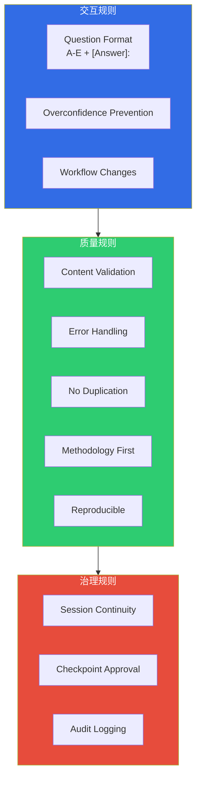
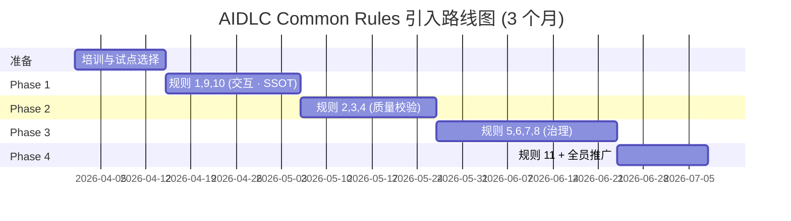

# AIDLC Common Rules

> 📅 **撰写日期**: 2026-04-18 | ⏱️ **阅读时间**: 约 18 分钟

AWS Labs [AIDLC Workflows](https://github.com/awslabs/aidlc-workflows) 的 `aws-aidlc-rule-details/common/` 目录定义了 **所有 stage 都必须共同遵循的 11 项规则**。这些规则规定了 Inception → Construction → Operations 全阶段中 AI 代理与人协作的方式,**保障产物的可复现性、可审计性与安全性**。

本文以 "是什么 (What) / 为什么 (Why) / 怎么做 (How)" 的 3 段式结构解读每条规则,并附上企业级环境的落地建议。

---

## 1. 概览: 11 项 Common Rules



| # | 规则 | 分类 | 核心价值 |
|---|------|------|----------|
| 1 | Question Format | 交互 | 强制结构化问答格式 |
| 2 | Content Validation | 质量 | 校验需求 / 响应 |
| 3 | Error Handling | 质量 | 异常的标准处理 |
| 4 | Overconfidence Prevention | 交互 | 控制 AI 置信度 |
| 5 | Session Continuity | 治理 | 跨会话上下文保留 |
| 6 | Workflow Changes | 交互 | 对工作流变更的显式批准 |
| 7 | Checkpoint Approval | 治理 | Stage 转换门禁 |
| 8 | Audit Logging | 治理 | ISO 8601 时间戳审计日志 |
| 9 | No Duplication | 质量 | 单一事实来源 (SSOT) |
| 10 | Methodology First | 质量 | 工具无关性 |
| 11 | Reproducible | 质量 | 模型间结果一致性 |

:::info 为什么 Common Rules 重要
AIDLC 需要在 **Kiro · Q Developer · Cursor · Cline · Claude Code · GitHub Copilot · AGENTS.md** 这 7 个平台上行为一致。即便平台与模型存在差异,Common Rules 也是保障 **相同输入产出相同质量产物** 的共同契约。
:::

---

## 2. 规则 1: Question Format

### 是什么
AI 代理向人提问时 **必须使用 A-E 5 选 1 + `[Answer]:` 标签** 格式。

### 为什么
- **可复现**: 自由格式答案会因模型 / 会话不同而被不同解读。5 选 1 消除了解读歧义
- **速度**: 人无需写冗长自由回复。只需选一个字母即可继续
- **审计**: 问答对结构化后,可用于审计日志与重放

### 怎么做

**问题模板:**
```markdown
Q1. Payment Service 的认证方式应设置为?

A. OAuth2 + JWT (含 Refresh Token)
B. API Key (基于 Header)
C. mTLS (服务间认证)
D. AWS IAM + SigV4
E. Other (please specify)

[Answer]:
```

**人作出的回复:**
```markdown
[Answer]: A
```

或在需要自由描述时:
```markdown
[Answer]: E - Cognito User Pool + JWT (符合现有组织标准)
```

### 企业级落地建议
- 每题保持 **5 个以下选项**。过多会导致决策疲劳
- 选项 D 固定为 "最常见默认值",选项 E 固定为 "Other"
- 推荐在 PR 正文 / Slack 频道粘贴题块,**团队达成一致后再填 `[Answer]:`**

---

## 3. 规则 2: Content Validation

### 是什么
对 AI 生成的所有产物 (Requirements Document、Design Document、Code 等) 执行 **自检查清单**,若存在失败项则 **明确向人报告**。

### 为什么
- AI 经常产生遗漏、矛盾、hallucination
- 由人全量检查所有产物不现实
- 把 AI 自检作为一道过滤,可减轻人工评审负担

### 怎么做

**自检清单示例 (Requirements Document):**
```markdown
## Content Validation Report

- [x] 每个功能需求均包含 Acceptance Criteria
- [x] 非功能需求 (NFR) 包含可度量指标 (P99 latency、可用性等)
- [ ] **FAIL**: FR-004 未明确错误处理路径
- [x] 术语与 Ontology/Ubiquitous Language 一致
- [x] 明确外部依赖 (DB、SQS 等)
- [ ] **FAIL**: NFR-002 发现 "足够快" 这类模糊表达

**Failed Checks**: 2
**Action Required**: 需用户确认后重写
```

### 企业级落地建议
- 将各类产物的 **检查清单保存在 Ontology 或组织扩展 (extensions) 中**
- 在 CI 流水线加入 `aidlc-validate` 阶段,将报告自动贴为 PR 评论
- 失败项自动创建 GitHub Issue,解决前阻断 Checkpoint Approval

---

## 4. 规则 3: Error Handling

### 是什么
AIDLC 执行中发生的所有异常 (文件缺失、工具出错、用户未响应等) 以 **结构化错误报告** 记录,并明确决定 **是否重试或由用户介入**。

### 为什么
- Silent failure 使审计追踪变得不可能
- 依据错误发生时机,需要在 **自动重试 / 用户介入 / 会话终止** 之间做出适当响应
- 对错误模式的分析可反过来改进 AIDLC 本身

### 怎么做

**错误报告格式:**
```yaml
error:
  id: ERR-2026-04-18-001
  timestamp: 2026-04-18T10:23:45Z
  stage: inception.requirements_analysis
  type: missing_context
  message: "会话中缺少 Workspace Detection 结果"
  severity: medium
  recovery:
    auto_retry: false
    user_action_required: true
    suggested_fix: "请先执行 Workspace Detection 阶段"
  context:
    session_id: sess-20260418-abc123
    prior_stage: workspace_detection
```

**错误分类:**
| Severity | 示例 | 响应 |
|----------|------|------|
| Low | 自由描述而非选项 | AI 自动解读后进行确认提问 |
| Medium | 缺少必要的前置 stage | 引导用户按逆序执行 stage |
| High | 工具调用失败 (如 MCP 服务器宕机) | 会话暂停,采集日志 |
| Critical | 违反 Ontology 契约 (例如使用未授权的领域术语) | 立即中止,人工介入 |

### 企业级落地建议
- 将错误报告发送至 **CloudWatch Logs Insights** 进行模式分析
- High/Critical 错误对接 PagerDuty
- 每月召开一次错误复盘会议,持续改进 AIDLC 自身

---

## 5. 规则 4: Overconfidence Prevention

### 是什么
AI 回复中要显式标注 **置信度 (confidence)**,当置信度较低时强制 **向用户请求更多上下文**。

### 为什么
- LLM 常常以非常自信的口吻给出错误答案 (hallucination)
- 置信度标注帮助用户判断 **在哪些地方应集中审查**
- 透明管理组织内 AI 决策的信赖水平

### 怎么做

**置信度标注:**
```markdown
## 建议: Payment Service 认证架构

**Confidence**: High (90%)

推荐 Cognito User Pool + JWT。原因是...

---

## 建议: DynamoDB 表设计

**Confidence**: Medium (60%)
**Reason for lower confidence**: 缺少 Payment 领域的读写比例信息,
GSI 设计可能非最优。

**Additional Context Needed**:
- 日均事务数?
- 查询模式 (按用户? 按时段?)

[Answer]:
```

### 企业级落地建议
- **Low confidence (< 50%) 的回复自动在 Checkpoint Approval 门禁暂停**
- 对置信度分布进行统计管理,用于确定 AI 改进的优先级
- 金融 / 医疗等受监管行业仅自动采纳 High confidence,Medium/Low 必须人工批准

---

## 6. 规则 5: Session Continuity

### 是什么
AIDLC 会话即使中断 / 恢复,也能 **完整还原以前的上下文 (提问 / 回答 / 产物)**。为此需要持久化状态。

### 为什么
- 企业级项目常跨越多日、多个团队
- 会话结束时上下文丢失 = 重复提问 · 返工 · 信息流失
- 团队成员交接时必须能判断 "目前走到哪一步"

### 怎么做

**会话状态文件 (`.aidlc/session.md`):**
```markdown
# AIDLC Session State

**Session ID**: sess-20260418-payment-service
**Started**: 2026-04-17T09:00:00Z
**Last Active**: 2026-04-18T10:30:00Z
**Owner**: yjeong@example.com

## Progress

| Stage | Status | Artifacts | Approved By | Approved At |
|-------|--------|-----------|-------------|-------------|
| workspace_detection | complete | `.aidlc/workspace.md` | yjeong | 2026-04-17T09:15:00Z |
| requirements_analysis | complete | `requirements.md` | yjeong | 2026-04-17T11:00:00Z |
| user_stories | complete | `user-stories.md` | yjeong | 2026-04-17T14:00:00Z |
| workflow_planning | in_progress | - | - | - |

## Pending Questions

Q3. Authentication 方式 (A-E) — 2026-04-18T10:30:00Z 提出,等待回答
```

### 企业级落地建议
- 会话状态通过 **Git 版本管理** (支持基于 PR 的协作)
- 使用 S3 + Versioning 对会话状态做备份 (审计用)
- 超过 30 天未激活的会话自动归档

---

## 7. 规则 6: Workflow Changes

### 是什么
**禁止 AI 擅自新增 / 跳过 / 修改工作流顺序**。变更 **必须经用户显式批准**。

### 为什么
- 如果 AI 擅自判断 "更有效率" 而跳过 stage,审计追踪就会崩坏
- 组织监管 (如金融监管规定) 要求特定 stage 必须执行
- 工作流变更历史本身是组织学习资产

### 怎么做

**工作流变更请求模板:**
```markdown
## Workflow Change Request

**Current Workflow**: workspace_detection → requirements_analysis → user_stories → workflow_planning

**Proposed Change**: 跳过 user_stories,直接进入 workflow_planning

**Reason**: 已存在 `user-stories.md`,无需再次审查

**Impact**:
- 会话耗时节省 1 小时
- 但存在遗漏最新需求变更的风险

**Approval Required**: A. 批准 / B. 拒绝 / C. 有条件批准 (附加审查后)

[Answer]:
```

### 企业级落地建议
- 在组织扩展 (extensions) 中定义 **不可跳过的 stage 列表** (如金融禁止跳过 security-review)
- 每月治理评审中回顾变更记录
- "异常变更 (outlier)" 模式即为工作流改进信号

---

## 8. 规则 7: Checkpoint Approval

### 是什么
在每次 stage 转换 (如 requirements_analysis → user_stories) 时,**要求人的显式批准**。

### 为什么
- stage 转换后难以回到上一产物 (不可逆)
- 批准同时充当 **质量门禁与治理证据**
- 是 Human in the loop 原则的具体实现

### 怎么做

**批准模板:**
```markdown
## Checkpoint Approval Gate

**Completing Stage**: requirements_analysis
**Next Stage**: user_stories

**Artifacts Produced**:
- `requirements.md` (1,234 行)
- `.aidlc/validation-report.md` (Content Validation 通过)
- `.aidlc/audit/stage-requirements-analysis.md`

**Review Checklist**:
- [x] 包含全部业务需求
- [x] NFR 可度量
- [x] 完成干系人评审

**Approver**: yjeong@example.com
**Approval Decision**:

A. Approve (进入下一 stage)
B. Reject (当前 stage 需返工)
C. Approve with comments

[Answer]:
```

### 企业级落地建议
- **多审批人模式**: 若需架构师 + 安全 + PM 3 人共同批准,实现多签门禁
- 批准记录与 **审计日志 (规则 8)** 自动联动
- 未经批准尝试执行下一 stage 时产生错误 (由规则 3 处理)

---

## 9. 规则 8: Audit Logging

### 是什么
对 AIDLC 执行中发生的所有事件 (提问、回答、批准、错误),以 **ISO 8601 时间戳 + 原文保留** 格式记录到审计日志。

### 为什么
- 金融 / 医疗等监管行业要求决策依据完全可复现
- 便于事件分析
- 为改进 AIDLC 本身累积数据

### 怎么做

**审计日志格式 (`audit.md`):**
```markdown
## Event: Checkpoint Approval Granted

**Event ID**: evt-2026-04-18-042
**Timestamp**: 2026-04-18T10:45:12.345Z
**Session**: sess-20260418-payment-service
**Actor**: yjeong@example.com
**Stage Transition**: requirements_analysis → user_stories

**Original User Response** (原文保留):
```
[Answer]: A
```

**AI Interpretation**: Approve (进入下一 stage)

**Artifacts Hash**:
- requirements.md: sha256:abc123...
- validation-report.md: sha256:def456...

---

## Event: Question Asked

**Event ID**: evt-2026-04-18-041
**Timestamp**: 2026-04-18T10:42:00.000Z
**Session**: sess-20260418-payment-service
**Stage**: requirements_analysis
**Question Text** (原文保留):
```
Q15. Payment Service 的数据存储应选择哪一项?
A. DynamoDB
B. Aurora PostgreSQL
...
```
```

**审计日志原则:**
1. **Append-only**: 既有日志绝对不可修改
2. **原文保留**: 记录用户 / AI 的 **原文**,而非 AI 的解读 / 摘要
3. **ISO 8601 时间戳**: 毫秒精度 + UTC 标记
4. **Artifact Hashing**: 对产物做 SHA-256 验证完整性

### 企业级落地建议
- 审计日志以 **S3 + Object Lock** (WORM) 存储,防篡改
- 金融业至少保存 7 年,医疗至少保存 10 年
- 详细规格见 [Audit & Governance Logging](../operations/audit-governance.md)

---

## 10. 规则 9: No Duplication

### 是什么
AIDLC 产物之间 **不允许重复生成相同信息**。信息仅放一处 (Single Source of Truth, SSOT),其他地方通过引用获取。

### 为什么
- 重复会导致不一致 (只更新一处,产物之间就会出现矛盾)
- AI 代理学习到重复信息会加剧幻觉
- 维护成本激增

### 怎么做

**重复示例 (错误模式):**
```markdown
# requirements.md
- API latency P99 < 200ms

# design.md
- API latency P99 < 200ms
- 此外需要 P95 < 100ms

# nfr.md
- API P99 latency < 150ms  ← 不一致!
```

**正确模式 (SSOT):**
```markdown
# nfr.md (SSOT)
- PAY-NFR-001: API latency P99 < 200ms, P95 < 100ms

# requirements.md
- 性能需求: 参考 PAY-NFR-001

# design.md
- 性能目标: 参考 PAY-NFR-001,HPA 阈值由此目标反推
```

### 企业级落地建议
- 为所有需求 / NFR / 决策 **分配唯一 ID** (如 `PAY-NFR-001`)
- 产物之间的引用仅允许 **基于 ID 的链接**
- CI 中检测重复字符串 (发现 >20 词相同语句时告警)

---

## 11. 规则 10: Methodology First

### 是什么
AIDLC 必须作为 **不绑定任何工具 / 平台的方法论** 运行。相同的产物无论在 Kiro、Claude Code、Cursor 都应可生成。

### 为什么
- 工具 lock-in 会阻碍组织敏捷性
- 只有 "方法论 > 工具" 的顺序才能使长期资产化成为可能
- 是实现 7 大平台行业标准化的基础

### 怎么做

**工具独立的设计原则:**
1. 产物仅使用 **纯 Markdown + YAML**
2. 禁止依赖特定 IDE 功能 (例如 Kiro 的 Spec 文件) — 提供通用模板
3. MCP 服务器等工具特定集成要 **拆为独立扩展**

**Bad (绑定工具):**
```markdown
# design.md
参见 Kiro 的 `.kiro/spec/design.md`
```

**Good (工具独立):**
```markdown
# design.md
MCP 集成详见本仓库的 `extensions/kiro-mcp/` (仅当使用 Kiro 时)
```

### 企业级落地建议
- 组织标准模板应在 **所有平台上工作** (至少在 2 个平台测试)
- 允许团队间存在工具偏好差异,但产物格式统一
- 更换平台时,产物迁移应处于 **简单复制文件** 的水平

---

## 12. 规则 11: Reproducible

### 是什么
对相同输入 (Workspace 状态 · Requirements · 问题响应),若 **相同模型 + 相同提示**,应生成 **几乎相同的产物**。

### 为什么
- 不可复现的系统无法审计 / 调试 / 改进
- 可实现团队间知识传递 (相同输入得到相同结果)
- 使 AIDLC 自身成为 **可信任的流程**

### 怎么做

**保证可复现的机制:**
1. **结构化问答格式 (规则 1)** — 答案解读一致
2. **Temperature 0 或低值** — LLM 输出稳定
3. **Frozen model version** — 如 `claude-opus-4-7` 显式锁定版本
4. **Seed 固定** (支持的模型) — 相同 seed 得到相同输出

**可复现性测试:**
```bash
# 相同输入执行 3 次后 diff 产物
aidlc run --input requirements.md --session test-1
aidlc run --input requirements.md --session test-2
aidlc run --input requirements.md --session test-3

diff .aidlc/test-1/requirements.md .aidlc/test-2/requirements.md
# 期望: 90% 以上相同
```

### 企业级落地建议
- **模型升级时必做可复现性回归测试** (维护 golden 输入集)
- 若因模型切换导致 **产物 drift > 20%** 则回滚
- 监管行业将模型版本锁定 3-5 年 (NIST SP 800-218A 建议)

---

## 13. 企业级应用综合指南

### 13.1 Common Rules → 治理映射

| 规则 | ISO 27001 相关 | SOC 2 相关 | 韩国 ISMS-P (韩国信息安全管理体系 - 个人信息) 相关 |
|------|----------------|-------------|------------------|
| Checkpoint Approval (7) | A.5.15 Access Control | CC6.2 | 2.8.3 变更管理 |
| Audit Logging (8) | A.8.15 Logging | CC7.2 | 2.9.4 日志管理 |
| Content Validation (2) | A.8.29 Security Testing | CC8.1 | 2.11.2 软件校验 |
| Error Handling (3) | A.5.24 Incident Management | CC7.3 | 2.10.4 信息安全事件应对 |

### 13.2 落地路线图



### 13.3 按工具 / 平台的实现状态 (截至 2026.04)

| 平台 | 规则 1-4 | 规则 5-8 | 规则 9-11 | 备注 |
|--------|---------|---------|-----------|------|
| **Kiro** | Full | Full | Full | 默认搭载 Spec-Driven |
| **Claude Code** | Full | Full | Partial | reproducibility 不支持 seed |
| **Cursor** | Partial | Partial | Partial | 需扩展 |
| **Q Developer** | Full | Full | Full | AWS 集成优秀 |
| **Cline** | Partial | Partial | Full | CLI 为主 |
| **Copilot** | Partial | Limited | Limited | 交互受限 |
| **AGENTS.md** | Full | Full | Full | 基于文档 |

---

## 14. 参考资料

### 官方仓库
- [AWS Labs AIDLC Common Rules](https://github.com/awslabs/aidlc-workflows/tree/main/aws-aidlc-rule-details/common) — 11 项规则原文
- [AWS Labs AIDLC Workflows (v0.1.7)](https://github.com/awslabs/aidlc-workflows) — 整仓库

### 相关文档
- [10 大原则与执行模型](./principles-and-model.md) — engineering-playbook 的 10 大原则 (官方 5 大原则 + 扩展)
- [Adaptive Execution](./adaptive-execution.md) — 条件化 stage 执行 (与规则 6 Workflow Changes 联动)
- [Audit & Governance Logging](../operations/audit-governance.md) — 规则 7、8 的运维实现
- [Harness 工程](./harness-engineering.md) — 规则 2 (Content Validation) 的架构级强制

### 合规映射
- [ISO/IEC 27001:2022](https://www.iso.org/standard/27001)
- [AICPA SOC 2 Trust Services Criteria](https://www.aicpa-cima.com/)
- [KISA ISMS-P 认证标准](https://isms.kisa.or.kr/)
