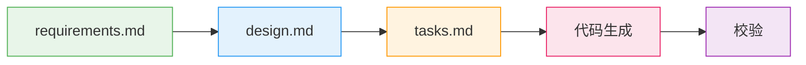
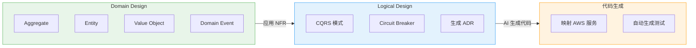
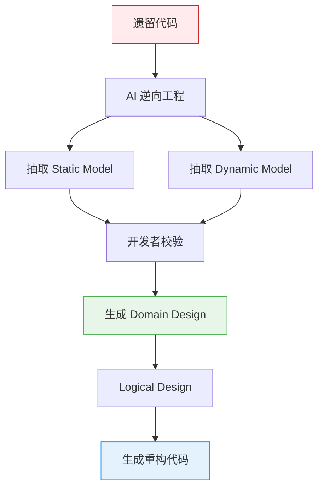

# DDD 集成 — AI 主导开发中的必备核心

> **核心信息**: 在 AIDLC 中,DDD 不是可选项,而是方法论内置的组成部分。AI 自动按照 DDD 原则为业务逻辑建模,团队对其进行验证与调整。

---

## 1. 为什么 DDD 是 AIDLC 的必备核心

在传统 Scrum 中,DDD (Domain-Driven Design) 是 **团队选择项**。架构师偏好 DDD 则引入,否则采用事务脚本或分层架构。设计技巧的选择取决于团队能力与偏好。

在 AIDLC 中情况完全不同。

```
传统 SDLC                             AIDLC
━━━━━━━━━━━━━━                      ━━━━━━━━━━━━━━━━━━━
设计技巧由团队选择                     DDD/BDD/TDD 内置于方法论
架构师手工建模                          AI 自动建模,团队校验
设计文档与代码逐步偏离                  Spec → Code 一致性自动维持
领域知识只存在于人的头脑中              以 Ontology 形式化,让 AI 理解
```

### 1.1 为何将 DDD 内置

AI 在结构化模式下表现最佳。DDD 提供将业务逻辑组织为 **Aggregate、Entity、Value Object、Domain Event** 的清晰词汇与规则。这在 AI 将需求转化为代码时充当一致的导轨。

```
非结构化需求 + AI = 任意实现 (每次风格不同)
DDD 模式 + AI = 可预测的实现 (Aggregate-first、Event-driven)
```

### 1.2 Scrum vs AIDLC: DDD 定位的变化

| 方面 | Scrum + DDD (可选) | AIDLC + DDD (必需) |
|------|-------------------|-------------------|
| **是否导入** | 架构师自决 | 方法论内置 |
| **建模主体** | 架构师 + 开发者 | AI 初稿 → 团队校验 |
| **维护** | 手工同步文档 | Spec 文件自动反映 |
| **学习曲线** | 高 (Red/Blue Book) | 低 (AI 套用模式) |
| **适用范围** | 仅核心领域 | 一致适用于全部 Unit |

---

## 2. Inception 阶段: 从需求到设计

DDD 集成在 **Inception 阶段** 开始。该阶段的核心仪式是 **Mob Elaboration**,AI 自动将需求按 DDD 模式建模,团队验证。

### 2.1 Mob Elaboration 仪式

Mob Elaboration 是 PO、开发者、QA 聚集一室与 AI 协作的需求精炼会议。

```
┌──────────────────────────────────────────────────┐
│              Mob Elaboration 仪式                  │
├──────────────────────────────────────────────────┤
│                                                   │
│  [AI] 将 Intent 拆分为 User Story + Unit 建议       │
│    ↓                                              │
│  [PO + Dev + QA] 评审 · 过度 / 不足设计调整         │
│    ↓                                              │
│  [AI] 反映修改 → 追加生成 NFR · Risk                │
│    ↓                                              │
│  [团队] 最终校验 → 确定 Bolt 计划                   │
│                                                   │
├──────────────────────────────────────────────────┤
│  产物:                                            │
│  PRFAQ · User Stories · NFR 定义                   │
│  Risk Register · 衡量标准 · Bolt 计划              │
└──────────────────────────────────────────────────┘
```

**时间压缩效果**: 在传统方法论中需 **数周~数月** 的顺序式需求分析,通过 AI 产出初稿 + 团队同步评审,压缩到 **数小时**。

### 2.2 Kiro Spec-Driven Inception

Kiro 将 Mob Elaboration 的产物体系化为 **Spec 文件**。将从自然语言需求到代码的整个过程进行结构化。



#### 2.2.1 Payment Service 示例

**requirements.md**:

```markdown
# Payment Service 部署需求

## 功能需求
- REST API 端点: /api/v1/payments
- 与 DynamoDB 表对接
- 通过 SQS 进行异步事件处理

## 非功能需求
- P99 延迟: < 200ms
- 可用性: 99.95%
- 自动伸缩: 2-20 Pod
- 兼容 EKS 1.35+
```

**design.md**:

```markdown
# Payment Service 架构

## 领域模型 (DDD)
- Aggregate: Payment (transactionId, amount, status)
- Entity: PaymentMethod, Customer
- Value Object: Money, Currency
- Domain Event: PaymentCreated, PaymentCompleted, PaymentFailed

## 基础设施
- EKS Deployment (最少 3 副本)
- ACK DynamoDB Table (on-demand)
- ACK SQS Queue (FIFO)
- HPA (CPU 70%、Memory 80%)
- Karpenter NodePool (graviton、spot)

## 可观测性
- ADOT sidecar (traces → X-Ray)
- Application Signals (SLI/SLO 自动)
- CloudWatch Logs (/eks/payment-service)

## 安全
- Pod Identity (替代 IRSA)
- NetworkPolicy (namespace 隔离)
- Secrets Manager CSI Driver
```

**tasks.md**:

```markdown
# 实现任务

## Bolt 1: 领域模型
- [ ] 实现 Payment Aggregate
- [ ] 定义 Value Object (Money、Currency)
- [ ] 定义 Domain Event
- [ ] 定义 Repository interface

## Bolt 2: 基础设施
- [ ] 编写 ACK DynamoDB Table CRD
- [ ] 编写 ACK SQS Queue CRD
- [ ] 配置 Karpenter NodePool

## Bolt 3: 应用
- [ ] 实现 Go REST API
- [ ] 实现 DynamoDB Repository
- [ ] 实现 SQS Event Publisher
- [ ] Dockerfile + multi-stage build

## Bolt 4: 部署 & 可观测性
- [ ] 编写 Helm chart
- [ ] 配置 ADOT sidecar
- [ ] Application Signals annotation
```

:::tip Spec-Driven 的核心价值
**指挥式**: "帮我建 DynamoDB" → "还要 SQS" → "现在部署" → 每次手工指令、存在上下文丢失风险

**Spec-Driven**: Kiro 分析 requirements.md → 生成 design.md → 拆分 tasks.md → 自动生成代码 → 校验,由一致的 Context Memory 串联
:::

### 2.3 基于 MCP 的实时上下文采集

Kiro 为 MCP 原生,在 Inception 阶段通过 AWS Hosted MCP 服务器采集实时基础设施状态。

```
[Kiro + MCP 交互]

Kiro: "检查 EKS 集群状态"
  → EKS MCP Server: get_cluster_status()
  → 响应: { version: "1.35", nodes: 5, status: "ACTIVE" }

Kiro: "成本分析"
  → Cost Analysis MCP Server: analyze_cost(service="EKS")
  → 响应: { monthly: "$450", recommendations: [...] }

Kiro: "分析当前工作负载"
  → EKS MCP Server: list_deployments(namespace="payment")
  → 响应: { deployments: [...], resource_usage: {...} }
```

借此在生成 design.md 时可得到 **反映当前集群状态与成本的设计**。

---

## 3. Construction 阶段: DDD 模式实现

在 Construction 阶段,AI 将 Inception 中定义的领域模型转化为 **实际代码**。此过程中 DDD 模式会映射到 AWS 服务与 Kubernetes 资源。

### 3.1 从 Domain Design 到 Logical Design



#### 3.1.1 Payment Service 实现步骤

**步骤 1: Domain Design** — AI 建模业务逻辑

```go
// Aggregate
type Payment struct {
    TransactionID string
    Amount        Money
    Status        PaymentStatus
    Customer      Customer
    Method        PaymentMethod
    Events        []DomainEvent
}

// Value Object
type Money struct {
    Amount   decimal.Decimal
    Currency Currency
}

// Domain Event
type PaymentCreated struct {
    TransactionID string
    Timestamp     time.Time
}
```

**步骤 2: Logical Design** — 应用 NFR + 选择架构模式

- **CQRS 模式**: 分离支付创建 (Command) 与查询 (Query)
  - Command: POST /api/v1/payments → DynamoDB 写入 + SQS 发布
  - Query: GET /api/v1/payments/\{id\} → DynamoDB Streams → ElastiCache 读取
- **Circuit Breaker**: 调用外部支付网关时使用 Envoy sidecar + Istio
- **ADR (Architecture Decision Record)**: 记录 "DynamoDB on-demand vs provisioned" 决策

**步骤 3: 代码生成** — 映射 AWS 服务

| DDD 元素 | AWS/Kubernetes 映射 |
|----------|---------------------|
| **Aggregate (Payment)** | EKS Deployment + DynamoDB Table |
| **Domain Event** | SQS FIFO Queue |
| **Repository** | DynamoDB SDK + ACK CRDs |
| **Circuit Breaker** | Envoy sidecar (Istio) |
| **Event Publisher** | 带重试逻辑的 SQS SDK |

### 3.2 AWS 服务映射详解

#### 3.2.1 DynamoDB Table (Aggregate 持久化)

AI 分析 design.md 的 Aggregate 定义,自动生成 ACK CRD。

```yaml
apiVersion: dynamodb.services.k8s.aws/v1alpha1
kind: Table
metadata:
  name: payment-table
spec:
  tableName: payment-service
  attributeDefinitions:
    - attributeName: transactionId
      attributeType: S
  keySchema:
    - attributeName: transactionId
      keyType: HASH
  billingMode: PAY_PER_REQUEST  # 在 ADR 中决定
  tags:
    - key: DomainAggregate
      value: Payment
```

#### 3.2.2 SQS Queue (Domain Event 发布)

```yaml
apiVersion: sqs.services.k8s.aws/v1alpha1
kind: Queue
metadata:
  name: payment-events
spec:
  queueName: payment-service-events.fifo
  fifoQueue: true
  contentBasedDeduplication: true
  tags:
    DomainEvent: PaymentCreated,PaymentCompleted,PaymentFailed
```

#### 3.2.3 Repository 实现

AI 使用 DynamoDB SDK 实现 DDD Repository 模式。

```go
type PaymentRepository interface {
    Save(ctx context.Context, payment *Payment) error
    FindByID(ctx context.Context, id string) (*Payment, error)
}

type DynamoDBPaymentRepository struct {
    client *dynamodb.Client
}

func (r *DynamoDBPaymentRepository) Save(ctx context.Context, p *Payment) error {
    item, _ := attributevalue.MarshalMap(p)
    _, err := r.client.PutItem(ctx, &dynamodb.PutItemInput{
        TableName: aws.String("payment-service"),
        Item:      item,
    })
    
    // 发布 Domain Event
    for _, event := range p.Events {
        publishToSQS(event)
    }
    
    return err
}
```

### 3.3 NFR 应用: CQRS、Circuit Breaker、ADR

#### 3.3.1 CQRS 模式

AI 分析 NFR (P99 < 200ms),建议 Command/Query 分离。

```
Command Side (Write):
  POST /api/v1/payments
    → Aggregate.CreatePayment()
    → DynamoDB.PutItem()
    → SQS.SendMessage(PaymentCreated)

Query Side (Read):
  GET /api/v1/payments/\{id\}
    → ElastiCache.Get(id)  # DynamoDB Streams → Cache
    → Fallback: DynamoDB.GetItem()
```

#### 3.3.2 Circuit Breaker (外部网关)

调用支付网关时为隔离故障,自动配置 Istio Circuit Breaker。

```yaml
apiVersion: networking.istio.io/v1beta1
kind: DestinationRule
metadata:
  name: payment-gateway-circuit-breaker
spec:
  host: external-payment-gateway.com
  trafficPolicy:
    outlierDetection:
      consecutiveErrors: 5
      interval: 30s
      baseEjectionTime: 60s
```

#### 3.3.3 自动生成 ADR

AI 在撰写 design.md 时以 ADR 形式记录架构决策。

```markdown
# ADR-001: 选择 DynamoDB On-Demand

## Context
Payment Service 的流量模式不规律且难以预测。

## Decision
选择 On-Demand 而非 Provisioned Capacity。

## Consequences
- 成本: 相比可预测流量贵约 15%
- 优势: 自动应对峰值,无需伸缩运维
- 劣势: 成本优化受限
```

---

## 4. Mob Construction 仪式

Construction 的核心仪式是 **Mob Construction**。团队聚在一室各自开发自己的 Unit,并交换 Domain Design 阶段生成的集成规约 (Integration Specification)。

```
[Mob Construction 流程]

Team A: Payment Unit        Team B: Notification Unit
  │                            │
  ├─ Domain Design 完成         ├─ Domain Design 完成
  │                            │
  └────── 交换集成规约 ────────┘
          (Domain Event 契约)
  │                            │
  ├─ Logical Design            ├─ Logical Design
  ├─ 代码生成                   ├─ 代码生成
  ├─ 测试                       ├─ 测试
  └─ 交付 Bolt                  └─ 交付 Bolt
```

### 4.1 基于 Domain Event 的集成

每个 Unit 松耦合,支持 **并行开发**,通过 Domain Event 集成。

**集成规约 (Integration Specification):**

```yaml
# payment-unit-events.yaml
events:
  - name: PaymentCompleted
    schema:
      transactionId: string
      amount: decimal
      currency: string
      timestamp: ISO8601
    consumers:
      - notification-unit  # Notification 团队订阅
      - analytics-unit     # Analytics 团队订阅
```

AI 基于该规约自动生成集成测试。

```go
func TestPaymentNotificationIntegration(t *testing.T) {
    // Payment Unit 发布 PaymentCompleted 事件
    payment := CreatePayment(amount)
    payment.Complete()
    
    // 确认从 SQS 收到事件
    event := sqsClient.ReceiveMessage("payment-events.fifo")
    assert.Equal(t, "PaymentCompleted", event.Type)
    
    // 确认 Notification Unit 已发送邮件
    notification := notificationClient.GetLastNotification()
    assert.Contains(t, notification.Body, payment.TransactionID)
}
```

### 4.2 Pair Programming 的 AI 扩展

Mob Construction 是将传统 Pair Programming 扩展到 AI 的做法。

| 方面 | Pair Programming | Mob Construction (AI) |
|------|-----------------|----------------------|
| **参与者** | 2 人 (Driver + Navigator) | N 人 + AI Agent |
| **分工** | 1 人编码、1 人评审 | N 人校验、AI 编码 |
| **速度** | 1x (人速度) | 10-50x (AI 速度) |
| **并行性** | 顺序工作 | 多 Unit 并行 |
| **知识传播** | 仅 2 人学习 | 全团队同时学习 |

---

## 5. Brownfield (既有系统) 方法

当需要在既有系统中添加功能或重构时,Construction 阶段需要 **额外步骤**。

:::warning Brownfield 策略: 优先优化
优先 **优化既有系统** 而非重新构建。AI 对遗留代码进行逆向工程得到 DDD 模型,再进行渐进式重构。
:::

### 5.1 逆向工程流程



**步骤 1: AI 将既有代码逆向工程为语义模型** (代码 → 模型提升)

- **Static Model**: 组件、职责、关系
  ```
  [PaymentController] → [PaymentService] → [PaymentDAO]
  - PaymentService 职责: 业务逻辑 + 事务管理
  - PaymentDAO 职责: 数据访问
  ```

- **Dynamic Model**: 主要用例下的组件交互
  ```
  支付创建 Flow:
  Controller.createPayment() 
    → Service.processPayment()
    → DAO.insertPayment()
    → DAO.insertPaymentEvent()
  ```

**步骤 2: 开发者校验并修正逆向工程模型**

确认 AI 提取的模型是否准确反映实际业务意图。

**步骤 3: 之后按 Green-field 的 Construction 流程推进**

将逆向工程模型重新设计为 DDD Aggregate/Entity/Value Object,由 AI 生成重构代码。

### 5.2 渐进式重构策略

不在一次性重构整个系统,而是 **以 Bolt 为单位渐进切换**。

```
Bolt 1: 抽取 Payment Aggregate
  - 既有: PaymentService (900 行的 God Object)
  - 新: Payment Aggregate + PaymentRepository

Bolt 2: 引入 Domain Event
  - 既有: 支付完成时直接调用 Notification
  - 新: 发布 PaymentCompleted 事件 → SQS → Notification 订阅

Bolt 3: CQRS 分离
  - 既有: 单一 Service 中读写混合
  - 新: 分离 PaymentCommandService / PaymentQueryService
```

---

## 6. 向 Ontology 扩展: 从 DDD 到形式化 Ontology

> "Prompt Engineering is Ontology Engineering" — 2026 AI 社区共识

DDD 的 Ubiquitous Language 是供团队内部沟通的 **非形式化共识**。在 AI 时代需将其提升为 **形式化 Ontology (typed world model)**,使 AI 能以机械方式理解与遵守。

### 6.1 DDD vs Ontology

| 方面 | DDD (Ubiquitous Language) | 形式化 Ontology |
|------|--------------------------|-----------------|
| **定义** | 自然语言共识 | 机器可解释 schema |
| **主要对象** | 人 (团队内沟通) | AI + 人 |
| **校验** | 代码评审时手工进行 | 自动校验 (提示时刻) |
| **进化** | 文档化滞后 | schema 版本管理 |
| **示例** | "支付有创建、完成、失败状态" | `Payment.status: enum(CREATED, COMPLETED, FAILED)` |

### 6.2 Ontology 工程工作流

```
1. 定义 DDD 模型 (requirements.md、design.md)
   ↓
2. AI 生成 Ontology schema (JSON Schema/OWL)
   ↓
3. Ontology 校验 (团队评审)
   ↓
4. AI 基于 Ontology 生成代码
   ↓
5. 运行时校验 (Ontology ↔ 实际行为一致)
```

该过程的详细内容见 [Ontology 工程](./ontology-engineering.md) 文档。

---

## 7. Quality Gates: DDD 模式校验

在 Construction 阶段,自动校验 AI 生成代码是否符合 DDD 原则。

### 7.1 Harness Engineering 集成

[Harness 工程](./harness-engineering.md) 所定义的 Quality Gates 校验 DDD 模式。

```yaml
# quality-gates.yaml
gates:
  - name: DDD Pattern Compliance
    rules:
      - check: "Aggregate 是否保持单一事务边界?"
        tool: static-analysis
      - check: "Domain Event 是否使用过去式命名?"
        tool: naming-convention
      - check: "Value Object 是否保证不可变性?"
        tool: immutability-checker
      - check: "Repository 是否仅持久化 Aggregate?"
        tool: dependency-analysis
```

### 7.2 自动校验示例

```go
// ❌ 反模式: Aggregate 直接引用另一个 Aggregate
type Order struct {
    OrderID  string
    Customer Customer  // ❌ 直接引用 Customer Aggregate
}

// ✅ 最佳实践: 只通过 ID 引用
type Order struct {
    OrderID    string
    CustomerID string  // ✅ 仅保存 ID,需要时通过 Repository 查询
}
```

AI 自动检测此类模式并生成修正建议。

---

## 8. AI 编码代理: 自动化 DDD 实现

在 AIDLC Construction 阶段使用的 AI 编码代理会自动应用 DDD 模式。

### 8.1 Kiro 的 DDD 自动化

**Kiro** 是 AWS Labs 开发的 AI 编码代理,执行 **Spec-Driven DDD 实现**。

```
Kiro 工作流:

1. 分析 requirements.md → 抽取领域概念
2. 生成 design.md → 识别 Aggregate/Entity/Value Object
3. 拆分 tasks.md → 按 Bolt 制定实现计划
4. 自动生成代码 → 应用 DDD 模式
5. 自动生成测试 → 校验领域逻辑
```

### 8.2 Amazon Q Developer 的实时校验

**Amazon Q Developer** 通过 2025 年 2 月发布的 **实时代码执行功能** 即时校验 DDD 实现。

```
传统方式:
  AI 生成代码 → 开发者手工构建 → 发现测试失败 → 反复修正

Q Developer:
  AI 生成代码 → 自动构建 → 自动测试 → 失败时立即再生成
```

这是让 AIDLC 的 **Loss Function** 在 Construction 阶段提早运行,阻止错误向下游传播的核心机制。

详细对比见 [AI 编码代理](../toolchain/ai-coding-agents.md) 文档。

---

## 9. MSA 环境中的 DDD 应用

在复杂的 Microservices Architecture (MSA) 环境中,DDD 是服务边界设定与集成策略的核心。

### 9.1 Bounded Context 与服务边界

DDD 的 **Bounded Context** 自然映射到 MSA 的 **服务边界**。

```
Payment Bounded Context → Payment Service
Notification Bounded Context → Notification Service
Analytics Bounded Context → Analytics Service
```

AI 分析 requirements.md 自动识别 Bounded Context,并将每个 Context 映射为独立的 EKS Deployment。

### 9.2 Context Mapping 模式

多个服务交互时应用 DDD Context Mapping 模式。

| 模式 | 说明 | 实现 |
|------|------|------|
| **Customer-Supplier** | 一个团队为另一个团队提供 API | REST API + API Gateway |
| **Conformist** | 下游团队完全接受上游模型 | 共享 Proto/Schema |
| **Anticorruption Layer** | 与遗留系统隔离 | Adapter 模式 |
| **Shared Kernel** | 共享通用领域模型 | Shared Library (最小化) |
| **Published Language** | 标准事件格式 | CloudEvents + SQS |

在复杂 MSA 环境中的 DDD 应用策略见 [MSA 复杂度](../enterprise/msa-complexity/index.md) 文档。

---

## 10. 核心要点

### 10.1 为何 DDD 是 AIDLC 的必备核心

1. **AI 在结构化模式下表现最佳** — DDD 提供清晰词汇与规则
2. **Spec → Code 自动转换** — requirements.md → design.md → tasks.md → 代码
3. **团队校验即 Loss Function** — AI 初稿 → 团队调整 → AI 改进 → 循环
4. **向 Ontology 进化** — 非形式化语言 → 形式化 schema → AI 机械理解

### 10.2 核心仪式

- **Mob Elaboration** (Inception): 从需求到 DDD 模型,压缩数周 → 数小时
- **Mob Construction**: 并行 Unit 开发,基于 Domain Event 集成

### 10.3 自动化范围

| 阶段 | AI 自动化 | 人类角色 |
|------|----------|----------|
| **Domain Design** | Aggregate/Entity/VO 初稿 | 验证业务正确性 |
| **Logical Design** | 应用 CQRS/Circuit Breaker | 决定 NFR 优先级 |
| **代码生成** | 实现 DDD 模式 | 代码评审 |
| **测试生成** | 领域逻辑测试 | 场景校验 |
| **撰写 ADR** | 记录架构决策 | 决策审批 |

---

## 11. 下一步

- **[Ontology 工程](./ontology-engineering.md)** — 从 DDD 向形式化 Ontology 扩展
- **[Harness 工程](./harness-engineering.md)** — 在 Quality Gates 中校验 DDD 模式
- **[AI 编码代理](../toolchain/ai-coding-agents.md)** — Kiro、Q Developer 详解
- **[MSA 复杂度](../enterprise/msa-complexity/index.md)** — 复杂 MSA 中的 DDD 应用

---

**📚 参考资料**

- AWS Labs AI-DLC Research: [arxiv.org/abs/2501.03604](https://arxiv.org/abs/2501.03604)
- Eric Evans, "Domain-Driven Design" (2003)
- Vaughn Vernon, "Implementing Domain-Driven Design" (2013)
- Chris Richardson, "Microservices Patterns" (2018)
