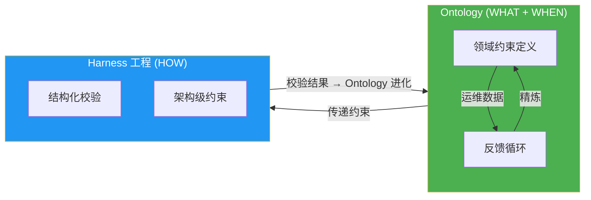
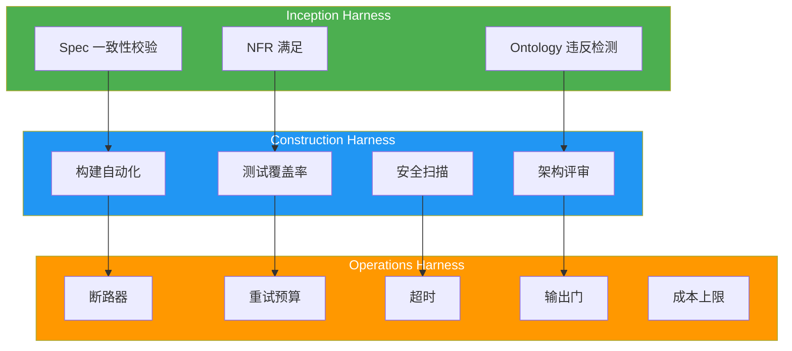
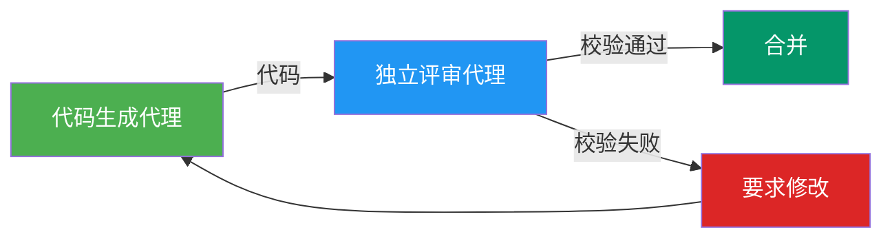

import { QualityGates } from '@site/src/components/AidlcTables';

# Harness 工程

:::info 扩展概念 (engineering-playbook 独立内容)
Ontology·Harness 工程不包含于 [AWS Labs AIDLC 官方方法论](https://github.com/awslabs/aidlc-workflows) 中,而是 engineering-playbook 的独立扩展内容。融合 DDD 与 2026 年 Agentic AI 最佳实践,强化企业级 AI 可信性。落地官方 AIDLC 时,可选择性引入此轴。
:::

> "不是 Agent 难,而是 Harness 难" — NxCode, 2026

## 概览

**Harness 工程 (Harness Engineering)** 是 AIDLC 可信性双轴的第二轴,以 **架构方式校验并强制** 执行 Ontology 所定义约束的结构。2026 年 AI 开发的核心教训如下:

> 当 OpenAI Codex 生成 100 万行代码时,人类工程师编写的代码为 0 行。工程师的角色从 **写代码转变为设计 Harness**。



**Harness 的作用:**
- 以架构方式校验 Ontology 所定义约束
- 设计重试预算、超时、输出门、断路器
- 保证独立校验 (代码生成代理 ≠ 校验代理)
- 将校验结果反馈到 Ontology 进化

---

## Harness vs Guardrails

许多团队混用 "Guardrails" 与 "Harness",但两者 **在范围与时机上根本不同**。

| 维度 | Guardrails | Harness |
|------|-----------|---------|
| **范围** | 运行时输入输出过滤 | 架构整体设计 |
| **作用** | PII 掩码、提示注入防御 | 重试预算、超时、输出门、断路器 |
| **时机** | 执行中 | 从设计之初 |
| **失败模式** | 阻断单个请求 | 保护整个系统 |
| **示例** | Bedrock Guardrails、NeMo Guardrails | AIDLC Quality Gates、独立校验代理 |

**核心差异:**
- **Guardrails** 是 "阻挡坏输入的过滤器" — 例如: 提示注入检测、PII 掩码
- **Harness** 是 "约束 AI 安全运行的架构" — 例如: 阻止 847 次重试、阻止成本爆炸

---

## Fintech Runaway 案例: 没有 Harness 的 AI 失败

:::danger 真实案例: $2,200 损失事件

某金融科技初创的 AI 代理在一个循环中执行了 **847 次 API 重试**,结果:
- 产生 **$2,200 的 LLM API 费用**
- 向客户发送 **14 封不完整的邮件**
- **3 小时服务中断** (需人工介入)

**原因分析:**
- ❌ 并非模型问题 (使用 GPT-4)
- ❌ 并非提示问题 (提示清晰)
- ✅ **架构失败** — 缺失 Harness

**缺失的 Harness 模式:**
1. 无重试预算 (无限重试)
2. 无超时 (循环可无限执行)
3. 无输出门 (未阻止不完整邮件发送)
4. 无断路器 (847 次失败后仍继续尝试)
5. 无成本上限 ($2,200 到账前无告警)

:::

**教训:** AI 系统的失败多数不是模型或提示问题,而是 **架构设计缺失** 导致的。

---

## AIDLC 3 阶段中的 Harness 模式

| 阶段 | Harness 类型 | 校验对象 | 实现方式 |
|------|-------------|----------|----------|
| **Inception** | Spec 校验 Harness | 需求完整性、冲突、NFR 满足 | 基于 Ontology 的 Spec 一致性自动校验 |
| **Construction** | 构建 / 测试 Harness | 代码正确性、安全、架构合规 | 独立代理评审 + Ontology 违反检测 |
| **Operations** | 运行时 Harness | AI Agent 行为约束、成本上限 | 断路器、重试预算、输出门 |



---

## Harness 模式目录

### 1. 断路器 (Circuit Breaker)

**目的:** 在重复失败时阻断后续尝试,保护整个系统

**模式:**
```yaml
circuit_breaker:
  failure_threshold: 5        # 失败 5 次后 Open
  timeout: 60s               # 60 秒后转 Half-Open
  success_threshold: 2       # 成功 2 次后 Closed
```

**应用场景:**
- LLM API 调用 (Bedrock、OpenAI)
- 外部服务对接 (支付、邮件)
- Agent 间通信 (多代理系统)

---

### 2. 重试预算 (Retry Budget)

**目的:** 防止无限重试,控制整体成本

**模式:**
```yaml
retry_budget:
  max_attempts: 3            # 最多重试 3 次
  backoff: exponential       # 指数退避
  max_backoff: 30s          # 最长等待 30 秒
  budget_limit: 10          # 每小时允许 10 次重试
```

**防止 Fintech Runaway:**
- ✅ 847 次重试 → 限制为 3 次
- ✅ 立即重试 → 指数退避 (1s、2s、4s)
- ✅ $2,200 成本 → 上限 $50

---

### 3. 超时 (Timeout)

**目的:** 防止无限循环、保证响应时间

**模式:**
```yaml
timeout:
  request: 30s              # 单次请求超时
  total: 300s               # 整体任务超时
  idle: 60s                 # 空闲超时
```

**应用场景:**
- LLM 推理 (超过 30 秒中断)
- 代码生成 (整体 5 分钟限制)
- 测试执行 (Idle 1 分钟超时终止)

---

### 4. 输出门 (Output Gate)

**目的:** 阻断不完整或有害的输出

**模式:**
```yaml
output_gate:
  validators:
    - syntax_check          # 代码语法校验
    - schema_validation     # JSON schema 校验
    - pii_detection         # PII 检测与掩码
    - toxicity_filter       # 有害内容过滤
  action_on_failure: reject # 失败时拒绝输出
```

**防止 Fintech Runaway:**
- ✅ 14 封不完整邮件 → 在输出门被阻断
- ✅ 防止 PII 泄露
- ✅ 过滤有害内容

---

### 5. PII 掩码 (PII Masking)

**目的:** 保护敏感信息 (输入输出均适用)

**模式:**
```yaml
pii_masking:
  patterns:
    - email: "***@***.***"
    - ssn: "***-**-****"
    - credit_card: "****-****-****-****"
  redact_in_logs: true      # 日志中也做掩码
```

---

### 6. 提示注入防御 (Prompt Injection Defense)

**目的:** 阻挡恶意提示

**模式:**
```yaml
prompt_injection_defense:
  techniques:
    - instruction_hierarchy  # 系统提示优先
    - delimiter_isolation    # 用分隔符隔离用户输入
    - output_validation      # 输出 schema 校验
```

---

### 7. 成本上限 (Cost Limit)

**目的:** 防止 LLM API 成本失控

**模式:**
```yaml
cost_limit:
  per_request: 0.50         # 每次请求上限 $0.50
  per_hour: 10.00           # 每小时上限 $10
  per_day: 100.00           # 每日上限 $100
  alert_threshold: 0.80     # 达到 80% 时告警
```

---

## Quality Gates — 全阶段质量保障

AI-DLC 中的人工校验是 **Loss Function** — 在每个阶段及早捕获错误,阻止向下游传递。Quality Gates 是对这一 Loss Function 的体系化。

```
Inception          Construction          Operations
    │                   │                    │
    ▼                   ▼                    ▼
[Mob Elaboration   [DDD 模型           [部署前校验]
 产物校验]          校验]
    │                   │                    │
    ▼                   ▼                    ▼
[Spec 一致性]      [代码 + 安全扫描]     [基于 SLO 的监控]
    │                   │                    │
    ▼                   ▼                    ▼
[NFR 满足]         [测试覆盖率]           [AI Agent 响应校验]
```

<QualityGates />

---

## 基于 AI 的 PR 评审自动化

传统代码评审依赖 lint 规则与静态分析,**而基于 AI 的评审会校验架构模式、安全最佳实践乃至业务逻辑一致性**。

### 校验项

**1. DDD 模式合规**
- 检测 Aggregate 封装违反
- 阻止直接修改 Entity
- 校验 Value Object 不可变性

**示例:**
```go
// ❌ 违规: 在 Aggregate 外部直接修改 Entity
func UpdateUserEmail(userID string, email string) error {
    user, _ := userRepo.FindByID(userID)
    user.Email = email  // ❌ 直接修改 Entity
    return userRepo.Save(user)
}

// ✅ 推荐: 通过 Aggregate 方法修改
func UpdateUserEmail(userID string, email string) error {
    user, _ := userRepo.FindByID(userID)
    return user.ChangeEmail(email)  // ✅ 使用 Aggregate 方法
}
```

**2. 微服务通信**
- 同步调用: 使用 gRPC
- 异步事件: 使用 SQS/SNS
- 外部 API: HTTP REST (必备 OpenAPI spec)

**3. 可观测性**
- 所有 handler 加 OpenTelemetry 埋点
- 业务指标通过 Prometheus 自定义指标暴露
- 结构化日志 (JSON 格式、包含上下文字段)

**4. 安全**
- 认证: JWT (禁止 HS256,使用 RS256)
- 敏感信息: 从 AWS Secrets Manager 读取
- SQL 查询: 使用 Prepared Statement (禁止字符串拼接)

---

## 独立校验原则

:::caution 同一代理写测试的陷阱

"同一 AI 代理写的测试抓不住同一代理的错误" — 这就像 AI 自己给自己的作业打分。

**症状:**
- 测试通过 ✅
- CI 绿灯 ✅
- PR 合并完成 ✅
- **3 天后功能只能半运行** ❌

**原因:**
- 测试优化的是 '完成' 而不是 '正确'
- 代码生成代理与测试生成代理是同一个
- 共享相同的偏差 (bias)

:::

**解决: 独立校验 Harness**



**实施原则:**
1. **使用不同代理** — 代码生成 ≠ 测试生成
2. **使用不同模型** — GPT-4 生成 → Claude 校验
3. **人工校验** — 核心逻辑由人做最终批准

---

## Harness 设计清单

AIDLC 3 阶段 Harness 模式清单:

### Inception Harness
- [ ] Spec 一致性自动校验
- [ ] NFR 满足性确认
- [ ] Ontology 违反检测
- [ ] 需求冲突检查

### Construction Harness
- [ ] 构建自动化 (CI/CD)
- [ ] 测试覆盖率 ≥ 80%
- [ ] 安全扫描 (SAST、SCA)
- [ ] 架构模式校验
- [ ] 独立代理评审
- [ ] 通过 Quality Gates

### Operations Harness
- [ ] 实现断路器
- [ ] 设置重试预算
- [ ] 定义超时
- [ ] 启用输出门
- [ ] PII 掩码
- [ ] 提示注入防御
- [ ] 设置成本上限
- [ ] 基于 SLO 的告警

---

## 参考资料

- **[Ontology 工程](./ontology-engineering.md)** — Harness 所校验约束的定义 (WHAT 轴)
- **[角色再定义](../enterprise/role-composition.md)** — Harness 工程师角色
- **[成本效益](../enterprise/cost-estimation.md)** — Harness ROI 计算
- **[MSA 复杂度](../enterprise/msa-complexity.md)** — 各类 MSA 的 Harness 模式

### 外部参考
- [Harness Engineering: Governing AI Agents through Architectural Rigor](https://harness-engineering.ai/blog/harness-engineering-governing-ai-agents-through-architectural-rigor/) — Kai Renner, 2026.03
- [Harness Engineering Complete Guide](https://www.nxcode.io/resources/news/harness-engineering-complete-guide-ai-agent-codex-2026) — NxCode, 2026.03
- [Specwright: Closes the Loop](https://obsidian-owl.github.io/engineering-blog/posts/specwright-spec-driven-development-that-closes-the-loop/) — Obsidian Owl, 2026.02
- [EleutherAI LM Evaluation Harness](https://github.com/EleutherAI/lm-evaluation-harness) — GitHub 11.7k+ stars
