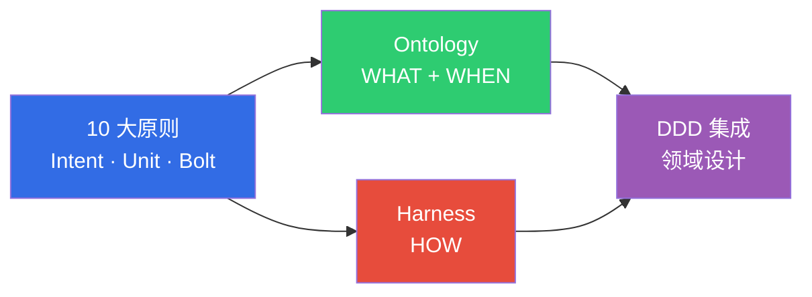

# AIDLC 方法论

> **阅读时间**: 约 2 分钟

:::info 官方 AIDLC 参考
本章节基于 [AWS Labs AIDLC Workflows](https://github.com/awslabs/aidlc-workflows) (v0.1.7, 2026-04-02) 并叠加 DDD·Ontology·Harness 扩展。官方 5 大原则、11 项 Common Rules、7 阶段 Adaptive Execution 保持完全遵循,engineering-playbook 在此基础上为 **企业级可信性** 独立扩展了 Ontology·Harness 轴。
:::

AIDLC 方法论为 AI 主导开发提供 **理论基础**。传统 SDLC 基于以人为中心的长期迭代周期设计,而 AIDLC 从第一性原则 (First Principles) 重新组织 AI,将其整合为开发生命周期的核心协作者。

**AIDLC 定义与 SDLC 对比**: 参见 [10 大原则与执行模型](./principles-and-model.md#11-sdlc-vs-aidlc-对比)

## 组成

方法论轨道由 4 个核心文档构成,按顺序阅读即可掌握 AIDLC 的整体理论体系。

| 顺序 | 文档 | 核心问题 |
|------|------|----------|
| 1 | [10 大原则与执行模型](./principles-and-model.md) | AIDLC 是什么?如何运作? (官方 5 大原则 + Intent/Unit/Bolt 映射) |
| 2 | [Ontology 工程](./ontology-engineering.md) 🧩 | 如何保证 AI 生成代码的 **正确性** ? (扩展) |
| 3 | [Harness 工程](./harness-engineering.md) 🧩 | 如何通过架构强制保证 AI 执行的 **安全性** ? (扩展) |
| 4 | [DDD 集成](./ddd-integration.md) | 如何将业务领域转化为 AI 能理解的设计? |
| 5 | [Common Rules](./common-rules.md) ⭐ | 官方 AIDLC 的 11 项通用规则是什么,如何应用? |
| 6 | [Adaptive Execution](./adaptive-execution.md) ⭐ | 官方 Inception 7 阶段与 Construction per-Unit 循环何时、如何执行? |

> ⭐ AWS Labs 官方 AIDLC 对齐文档  
> 🧩 engineering-playbook 独立扩展 (企业级可信性)

## 与其他轨道的关系

- **[企业级落地](/docs/aidlc/enterprise)**: 将方法论的概念 (Ontology、Harness) 诠释为组织变革与成本效益。
- **[工具与实现](/docs/aidlc/toolchain)**: 涵盖实现方法论的具体工具 (Kiro、Q Developer、EKS)。
- **[AgenticOps](/docs/aidlc/operations)**: 构建将运维数据反馈至 Ontology Outer Loop 的循环结构。
