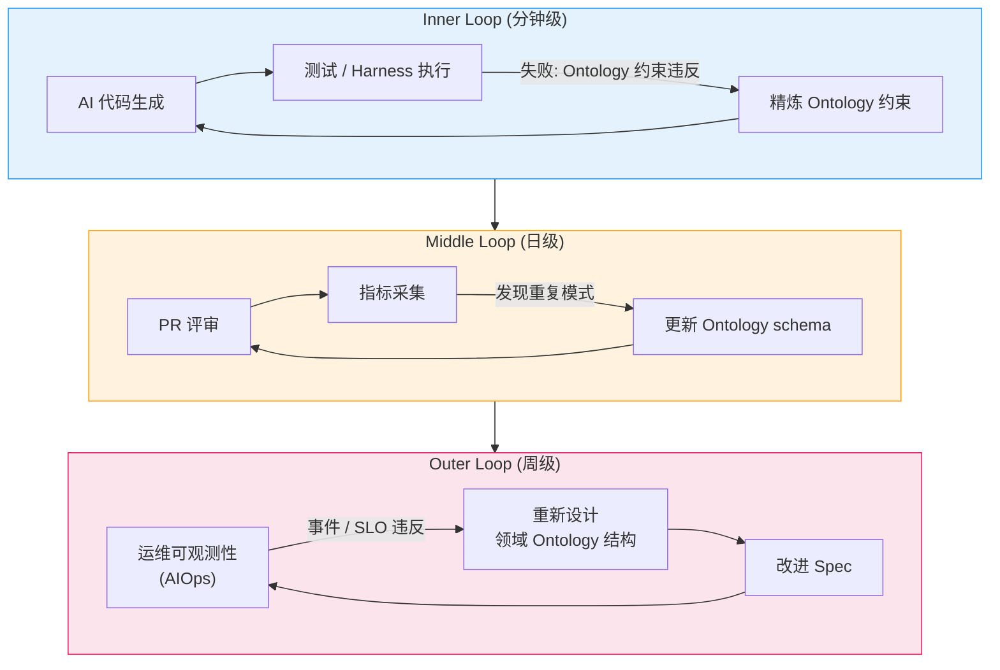
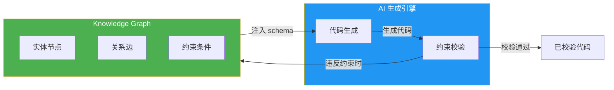
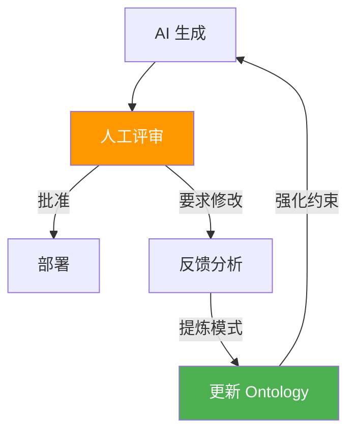
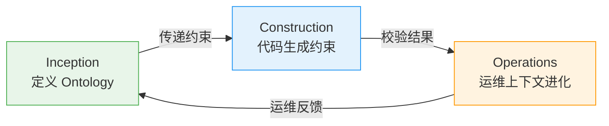
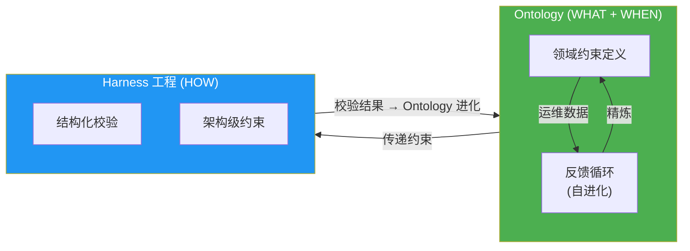

# Ontology 工程

:::info 扩展概念 (engineering-playbook 独立内容)
Ontology·Harness 工程不包含于 [AWS Labs AIDLC 官方方法论](https://github.com/awslabs/aidlc-workflows) 中,而是 engineering-playbook 的独立扩展内容。融合 DDD 与 2026 年 Agentic AI 最佳实践,强化企业级 AI 可信性。在落地官方 AIDLC 时,可选择性引入此轴。
:::

> "Prompt Engineering is Ontology Engineering" — 2026 AI 社区共识

AIDLC 可信性的第一轴 **Ontology 工程**,将 DDD 的 Ubiquitous Language 提升为 AI 可机械理解与遵循的 **形式化 schema (typed world model)**。这是在根本上阻断 AI 代理幻觉 (hallucination)、保障领域正确性的方法。

## 1. 什么是 Ontology

### 1.1 作为 Typed World Model 的 Ontology

**Ontology** 是将领域知识形式化的 "typed world model"。如果说 DDD 的 Ubiquitous Language 是团队内部沟通用的非形式共识,Ontology 则将其转换为 AI 可机械理解与遵循的结构化 schema。

**核心特征:**

- **形式性**: 明确定义实体、关系与约束
- **类型安全**: 所有领域概念由类型系统表达
- **可校验性**: 约束可自动校验的结构
- **可进化性**: 通过运维数据持续精炼

### 1.2 与 DDD Ubiquitous Language 的关系

| 方面 | Ubiquitous Language | Ontology |
|------|---------------------|----------|
| **形式性** | 非形式共识 (自然语言) | 形式化 schema (类型定义) |
| **范围** | 团队内部沟通 | AI 代理 + 团队 + 代码 |
| **校验** | 手动评审 | 自动约束校验 |
| **进化** | 文档更新 | 基于反馈循环的自动精炼 |
| **AI 理解** | 不可 (隐式上下文) | 可 (显式结构) |

DDD 的 Aggregate、Entity、Value Object、Domain Event 成为 Ontology 的 **基础构件**。差别在于它们的关系与约束以机器可读的形式表达。

## 2. 为什么需要 Ontology

### 2.1 AI 代理失败的根本原因

AI 代理失败的根本原因不是模型能力不足或提示词不准确,而是 **架构中缺乏语义结构 (semantic structure)**。

**典型失败模式:**

- **上下文丢失**: 当用户、订单、任务、规则的定义散落在提示中时,AI 会失去上下文
- **幻觉生成**: 缺乏显式约束时,AI 会生成 "逻辑上看似合理" 但错误的推理
- **一致性缺失**: 同一概念在不同会话中的定义不同,导致不可预测的行为

### 2.2 Ontology 解决的问题

**1. 防止幻觉**
- 所有领域概念显式定义,消除 AI 任意解读的空间
- 实体间关系形式化,无法生成不存在的连接

**2. 保证领域正确性**
- 不变量 (invariant) 编码到 Ontology 中,违反时自动检测
- 领域事件的状态迁移路径显式化,阻止错误的状态转换

**3. 上下文一致性**
- Ontology 注入到 AI 代理的 context window,成为所有生成工作的标尺
- 跨会话、跨代理保证相同的领域理解

### 2.3 实战证据

:::info 定量改进效果
整合基于 HITL (Human-in-the-Loop) 的 Ontology 反馈循环时:
- **准确率提升 31%**
- **False Positive 减少 67%**
- **错误率 8.3% → 1.2%** (31 天内达成)

未应用反馈循环时: 投入 $28K,错误率 8.3%→7.9%,改善微乎其微。
:::

## 3. Ontology 结构

### 3.1 DDD 概念到 Ontology 的映射

```yaml
domain_ontology:
  aggregates:
    Payment:
      description: "支付处理的事务边界"
      invariants:
        - "amount 必须大于 0"
        - "status 迁移: CREATED → PROCESSING → COMPLETED | FAILED"
        - "FAILED 状态下重试最多 2 次"
      entities:
        - PaymentMethod:
            type: "enum"
            values: ["CARD", "BANK", "WALLET"]
        - Customer:
            attributes:
              - customerId: "UUID"
              - tier: "enum[BASIC, PREMIUM, ENTERPRISE]"
      value_objects:
        - Money:
            currency: "ISO 4217"
            amount: "decimal(19,4)"
            invariants:
              - "amount >= 0"
              - "currency 不能为 null"
      domain_events:
        - PaymentCreated:
            trigger: "收到支付请求"
            data: ["paymentId", "amount", "customerId"]
            timestamp: "ISO 8601"
        - PaymentCompleted:
            trigger: "PG 授权完成"
            data: ["paymentId", "pgTransactionId"]
        - PaymentFailed:
            trigger: "PG 拒绝或超时"
            data: ["paymentId", "errorCode", "reason"]
  
  relationships:
    - "Payment CONTAINS PaymentMethod (1:1)"
    - "Customer INITIATES Payment (1:N)"
    - "Payment EMITS PaymentCreated (1:1)"
    - "Payment EMITS PaymentCompleted | PaymentFailed (1:1, mutually exclusive)"
  
  constraints:
    - "同一 Customer 的并发支付最多 3 笔"
    - "PROCESSING 状态最长保持 30 秒,超时自动转为 FAILED"
    - "PaymentMethod 变更仅在 CREATED 状态下允许"
```

### 3.2 Knowledge Source 分层

构建 Ontology 时,应对知识源的可信度进行分层管理。

| 优先级 | 来源 | 示例 | 可信度 | 使用方式 |
|--------|------|------|--------|----------|
| **1** | 实际实现代码 / PR | awslabs/ai-on-eks、Helm chart 源码 | 最高 | 以实际可运行代码为准 |
| **2** | 项目 GitHub issue / release | NVIDIA/KAI-Scheduler、ai-dynamo/dynamo | 高 | 开发者间的事实交换 |
| **3** | 官方文档 | docs.nvidia.com、docs.aws.amazon.com | 中 | 通论,可能存在更新延迟 |
| **4** | 博客 / 教程 | Medium、AWS Blog | 低 | 特定时间点的快照 |

:::caution 实战教训: 仅看官方文档是不够的
构建 Ontology 时 **仅参考官方文档 (Official Documentation),AI 会把 "逻辑上看似合理的推理" 误当作 "已验证的事实"**。

**真实案例:**
- **问题**: AWS EKS Auto Mode 官方文档写明 "AWS 管理 GPU 驱动" → AI 跳跃到 "无法安装 GPU Operator" → 对比表、架构、推荐项全部被污染
- **原因**: 未查阅实际实现仓库 ([awslabs/ai-on-eks PR #288](https://github.com/awslabs/ai-on-eks/pull/288)),仅凭官方文档的通论推理
- **结果**: "技术上不可能" 这一错误前提在整份文档中蔓延,12+ 张对比表和架构建议全部出错

**原则**: AI 生成的技术文档必须与 **实际实现代码进行交叉校验 (cross-validation)**。官方文档中的 "不可以" 可能只是 "尚未文档化"。
:::

### 3.3 规则模板分层

Ontology 超越单纯 schema,扩展为 **可执行规则**。

```yaml
rule_templates:
  validation_rules:
    - rule_id: "PAYMENT_AMOUNT_POSITIVE"
      condition: "Payment.amount > 0"
      error_message: "支付金额必须大于 0"
      severity: "ERROR"
    
    - rule_id: "PAYMENT_STATUS_TRANSITION"
      condition: |
        IF current_status == "CREATED" THEN next_status IN ["PROCESSING", "FAILED"]
        ELIF current_status == "PROCESSING" THEN next_status IN ["COMPLETED", "FAILED"]
        ELSE invalid_transition
      error_message: "支付状态迁移错误"
      severity: "ERROR"
  
  business_rules:
    - rule_id: "MAX_CONCURRENT_PAYMENTS"
      condition: "COUNT(Payment WHERE customer_id = X AND status = 'PROCESSING') <= 3"
      error_message: "同时处理中的支付超过最大限制"
      severity: "WARNING"
      action: "QUEUE_PAYMENT"
```

这些规则模板:
1. **代码生成时**: 自动转换为校验逻辑
2. **测试生成时**: 自动推导边界条件测试用例
3. **运行时**: 作为守护栏 (guardrail) 发挥作用

## 4. 三层反馈循环: 活的 Ontology

Ontology 并非一次性定义就结束的静态 schema,而是 **通过运维数据与研发经验持续进化的活模型**。

### 4.1 反馈循环结构



### 4.2 各循环的角色

| 循环 | 周期 | 触发器 | Ontology 变化 | 示例 |
|------|------|--------|---------------|------|
| **Inner Loop** | 分钟级 | 测试失败、Harness 违反 | 新增 / 修改约束 | 发现遗漏 invariant: 新增 "amount > 0" 约束 |
| **Middle Loop** | 日级 | PR 评审中的重复模式 | 更新实体 / 关系 schema | 重复错误模式 → 新增 Value Object |
| **Outer Loop** | 周级 | 运维事件、SLO 违反 | 重新设计领域模型结构 | P99 延迟上升 → 重新定义 Aggregate 边界 |

### 4.3 Inner Loop: 即时约束精炼

**场景**: AI 生成代码的测试失败

```python
# AI 生成代码 (第 1 次尝试)
def create_payment(amount: float, customer_id: str):
    payment = Payment(
        amount=amount,  # 忽略了 amount 可能为负数
        customer_id=customer_id,
        status="CREATED"
    )
    return payment

# 测试失败
def test_negative_amount():
    with pytest.raises(ValueError):
        create_payment(-100, "customer-123")
    # AssertionError: ValueError not raised

# 新增 Ontology 约束
invariants:
  - "amount > 0"

# AI 重新生成代码 (第 2 次尝试)
def create_payment(amount: float, customer_id: str):
    if amount <= 0:
        raise ValueError("支付金额必须大于 0")
    payment = Payment(...)
    return payment
```

**效果**: 分钟级精炼约束,防止同类错误复发。

### 4.4 Middle Loop: Schema 结构改进

**场景**: 在 PR 评审中发现重复模式

```markdown
## PR 评审指标 (7 天)
- "Currency mismatch" 错误: 12 次
- "Amount precision loss" 错误: 8 次
- 共通模式: Money 被当作 float 处理导致精度丢失

## Ontology 更新
value_objects:
  - Money:
      currency: "ISO 4217"
      amount: "decimal(19,4)"  # float → decimal 变更
      invariants:
        - "amount >= 0"
        - "currency 不能为 null"
```

**效果**: 重复错误模式反映到 Ontology schema 中,从结构上被阻断。

### 4.5 Outer Loop: 领域模型重设计

**场景**: 运维事件 — P99 延迟 SLO 违反

```markdown
## 事件分析
- 原因: Payment Aggregate 同时包含客户历史,过于臃肿
- 影响: 查询支付时加载不必要数据 → DB 查询增多

## Ontology 重设计
# Before
aggregates:
  Payment:
    entities:
      - Customer (含完整历史)

# After
aggregates:
  Payment:
    entities:
      - CustomerReference (仅引用 ID)
  
  CustomerProfile:  # 拆分为独立 Aggregate
    entities:
      - PaymentHistory
```

**效果**: 通过重新定义 Aggregate 边界,P99 延迟降低 42%。

## 5. SemanticForge 模式: Knowledge Graph 集成

### 5.1 Knowledge Graph as Constraint Satisfaction Harness

将 Ontology 具象化为 Knowledge Graph 后,可应用 **SemanticForge 模式**。Knowledge Graph 作为 constraint satisfaction harness,从根本上阻断 AI 生成代码的逻辑 / 结构幻觉。



### 5.2 SemanticForge 应用示例

**Knowledge Graph 结构:**

```cypher
// 实体定义
CREATE (p:Aggregate {name: "Payment"})
CREATE (pm:Entity {name: "PaymentMethod", type: "enum"})
CREATE (m:ValueObject {name: "Money"})

// 关系定义
CREATE (p)-[:CONTAINS {cardinality: "1:1"}]->(pm)
CREATE (p)-[:USES {cardinality: "1:1"}]->(m)

// 约束条件
CREATE (p)-[:INVARIANT {rule: "amount > 0"}]->(m)
CREATE (p)-[:INVARIANT {rule: "status transition: CREATED → PROCESSING → COMPLETED|FAILED"}]->(p)
```

**AI 生成时的校验:**

```python
# AI 生成的代码
payment.amount = -100  # 违反约束

# SemanticForge 查询 Knowledge Graph 校验
query = """
MATCH (p:Aggregate {name: "Payment"})-[:INVARIANT]->(m:ValueObject {name: "Money"})
WHERE m.rule CONTAINS "amount > 0"
RETURN m.rule
"""
# 检测到约束违反 → 要求 AI 重新生成
```

**效果**: AI 无法生成违反 Knowledge Graph 所编码约束的代码。

### 5.3 参考资料

- [SemanticForge: 基于 Knowledge Graph 的幻觉防治](https://arxiv.org/html/2511.07584v1)
- 提出将 Knowledge Graph 用作约束满足 harness 的具体模式

## 6. HITL (Human-in-the-Loop) 集成

### 6.1 HITL 的战略角色

将 HITL 定位为 **Ontology 进化的战略设计元素**,而非走向自治的过渡阶段。人类反馈是 Ontology 精炼的核心信号。



### 6.2 HITL 集成效果

:::info 定量证据
- **准确率提升 31%**: AI 生成代码的领域正确性
- **False Positive 减少 67%**: 减少不必要的错误告警
- **错误率 8.3% → 1.2%**: 31 天内达成

**成本对比:**
- 未应用反馈循环: $28K 成本,错误率 8.3%→7.9% (改善微弱)
- HITL 反馈循环: 运维成本大幅下降,错误率减少 85%
:::

### 6.3 HITL 反馈采集点

| 阶段 | HITL 介入点 | Ontology 改进方向 |
|------|-------------|------------------|
| **Inception** | Mob Elaboration 评审 | 细化领域约束定义 |
| **Construction** | PR 评审 | 更新实体关系 schema |
| **Operations** | 事件复盘 | 重新设计领域模型结构 |

### 6.4 参考资料

- [Human-in-the-Loop in Agentic AI](https://atalupadhyay.wordpress.com/2026/03/16/human-in-the-loop-in-agentic-ai/) — 2026.03
- [How to Build an AI Agent Feedback Loop](https://www.braincuber.com/blog/how-to-build-feedback-loop-ai-agent-improvement) — Braincuber, 2026.03

## 7. Kiro Spec + Ontology 集成

### 7.1 将 Ontology 嵌入 Spec

在 Kiro Spec 的 `requirements.md` 中直接包含 Ontology,让 AI 代理在需求分析阶段就识别领域约束。

**requirements.md 示例:**

```markdown
# Payment Service 部署需求

## 功能需求
- REST API 端点: /api/v1/payments
- 与 DynamoDB 表对接
- 通过 SQS 处理异步事件

## 非功能需求
- P99 延迟: < 200ms
- 可用性: 99.95%
- 自动伸缩: 2-20 Pod

## 领域 Ontology

### Aggregates
#### Payment
- **Invariants:**
  - amount 必须大于 0
  - status 迁移: CREATED → PROCESSING → COMPLETED | FAILED
  - FAILED 状态下重试最多 2 次

- **Entities:**
  - PaymentMethod: enum[CARD, BANK, WALLET]
  - Customer: { customerId: UUID, tier: enum[BASIC, PREMIUM, ENTERPRISE] }

- **Value Objects:**
  - Money: { currency: ISO 4217, amount: decimal(19,4) }

- **Domain Events:**
  - PaymentCreated: { trigger: "收到支付请求", data: [paymentId, amount, customerId] }
  - PaymentCompleted: { trigger: "PG 授权完成", data: [paymentId, pgTransactionId] }
  - PaymentFailed: { trigger: "PG 拒绝或超时", data: [paymentId, errorCode, reason] }

### Relationships
- Payment CONTAINS PaymentMethod (1:1)
- Customer INITIATES Payment (1:N)

### Constraints
- 同一 Customer 并发支付最多 3 笔
- PROCESSING 最长 30 秒,超时自动转为 FAILED
```

### 7.2 基于 Ontology 的代码生成

Kiro AI 代理将该 Ontology 注入 context window,实现:

1. **代码生成时**: 自动遵守实体关系与 invariant
   ```go
   func CreatePayment(amount decimal.Decimal, customerID uuid.UUID) (*Payment, error) {
       if amount.LessThanOrEqual(decimal.Zero) {
           return nil, errors.New("支付金额必须大于 0")
       }
       // 自动应用 Ontology 约束
   }
   ```

2. **测试生成时**: 基于领域事件的迁移路径自动推导边界用例
   ```go
   func TestPaymentStatusTransition(t *testing.T) {
       // 基于 Ontology 的状态迁移规则自动生成
       t.Run("CREATED to PROCESSING", ...)
       t.Run("PROCESSING to COMPLETED", ...)
       t.Run("Invalid transition: COMPLETED to CREATED", ...)
   }
   ```

3. **代码评审时**: 自动检测 Ontology 违反
   ```markdown
   ## Ontology 违反检测
   - ❌ Line 42: amount 可能为负 (违反 invariant)
   - ❌ Line 58: COMPLETED → PROCESSING 迁移 (非法状态转换)
   ```

## 8. Ontology 与生产力: ROI 证据

### 8.1 错误率下降案例

:::tip 实战数据
**Before (未应用 Ontology):**
- 初始错误率: 8.3%
- 投入: $28K
- 31 天后错误率: 7.9%
- 改善: 0.4 个百分点 (微弱)

**After (应用 Ontology + 反馈循环):**
- 初始错误率: 8.3%
- 31 天后错误率: 1.2%
- 改善: 7.1 个百分点 (减少 85%)
- 附加效果: False Positive 减少 67%,准确率提升 31%
:::

### 8.2 生产力指标

| 指标 | 未应用 Ontology | 应用 Ontology | 改善率 |
|------|----------------|---------------|--------|
| **PR 评审时间** | 平均 45 分钟 | 平均 18 分钟 | 减少 60% |
| **测试覆盖率** | 68% | 89% | 增加 31 个百分点 |
| **生产事件** | 每月 12 件 | 每月 2 件 | 减少 83% |
| **平均修复时间** | 2.3 天 | 0.4 天 | 减少 83% |

### 8.3 参考资料

- [Why Ontology Matters for Agentic AI in 2026](https://kenhuangus.substack.com/p/why-ontology-matters-for-agentic) — Ken Huang & Bhavya Gupta
- [Why AI Agents Fail Without Ontologies](https://medium.com/@itznihal/why-ai-agents-fail-without-ontologies-production-lessons-beb9fe9c3af9) — Nihal Parmar, 2026.03

## 9. AIDLC 3 阶段中的 Ontology 应用

### 9.1 Inception: 定义领域 Ontology

**活动:**
- 通过 Mob Elaboration 提取领域概念
- 定义 Aggregate、Entity、Value Object、Domain Event
- 明确约束条件 (invariant)
- 构建 Knowledge Graph 初版

**产物:**
- `requirements.md` 中的领域 Ontology 章节
- Knowledge Graph schema (Neo4j/RDF)

**Ontology 反馈:**
- Inner Loop: Mob Elaboration 会议内即时精炼
- 目标: 通过需求精炼循环完成 Ontology 初稿

### 9.2 Construction: 代码生成约束

**活动:**
- 将 Ontology 注入 AI 代理上下文
- 基于 Ontology 生成代码与测试
- PR 评审时自动检测 Ontology 违反

**产物:**
- 遵守 Ontology 约束的代码
- 基于领域事件的集成测试
- PR 评审指标 (Ontology 违反次数)

**Ontology 反馈:**
- Inner Loop: 测试失败时新增约束
- Middle Loop: 分析 PR 评审模式 → 更新 schema
- 目标: 将重复错误模式反映到 Ontology 中实现结构性阻断

### 9.3 Operations: 运维上下文模型进化

**活动:**
- 将运维可观测性数据作为 Ontology 反馈信号
- 通过事件分析重新设计领域模型
- 将 SLO 违反模式编码为约束条件

**产物:**
- 基于运维数据的 Ontology 更新
- 事件复盘 → Ontology 重设计文档
- AIOps 集成: 可观测性数据 → Ontology 自动精炼

**Ontology 反馈:**
- Outer Loop: 周级事件复盘 → 领域结构重设计
- 目标: 将运维经验持续反映到 Ontology (AIOps → AIDLC)

### 9.4 3 阶段集成效果



**效果:**
- Inception 定义的 Ontology 约束 Construction 的代码生成
- Construction 发现的模式精炼 Ontology
- Operations 发生的事件重新设计 Ontology 结构
- 通过循环反馈使 Ontology 持续进化

## 10. 相关文档

### 10.1 AIDLC 可信性双轴

Ontology 负责 **WHAT + WHEN** (领域约束定义),**HOW** (校验机制) 则由 [Harness 工程](./harness-engineering.md) 承担。两轴协同保证 AI 生成代码的可信性。



### 10.2 方法论整合

- **[DDD 集成](./ddd-integration.md)**: 将 DDD 概念形式化为 Ontology 的具体方法
- **[Harness 工程](./harness-engineering.md)**: 以架构方式校验 Ontology 所定义约束的方法

### 10.3 企业级落地

- **[成本效益](../enterprise/cost-estimation.md)**: Ontology 投入产出比分析
- **[落地策略](../enterprise/adoption-strategy.md)**: 在既有组织中渐进引入基于 Ontology 的开发策略

### 10.4 运维整合

- **[自主响应](../operations/autonomous-response.md)**: 将 Outer Loop 的运维反馈自动化的 AIOps 整合

## 参考资料

### 核心论文与文章

1. [Why Ontology Matters for Agentic AI in 2026](https://kenhuangus.substack.com/p/why-ontology-matters-for-agentic) — Ken Huang & Bhavya Gupta
2. [Why AI Agents Fail Without Ontologies](https://medium.com/@itznihal/why-ai-agents-fail-without-ontologies-production-lessons-beb9fe9c3af9) — Nihal Parmar, 2026.03
3. [SemanticForge: 基于 Knowledge Graph 的幻觉防治](https://arxiv.org/html/2511.07584v1)
4. [How to Build an AI Agent Feedback Loop](https://www.braincuber.com/blog/how-to-build-feedback-loop-ai-agent-improvement) — Braincuber, 2026.03
5. [Human-in-the-Loop in Agentic AI](https://atalupadhyay.wordpress.com/2026/03/16/human-in-the-loop-in-agentic-ai/) — 2026.03

### 相关框架

- **Kiro**: MCP 原生 AI 编码代理,支持基于 Ontology 的代码生成
- **Neo4j**: Knowledge Graph 构建与约束校验
- **SemanticForge**: 基于 Knowledge Graph 的幻觉防治模式
