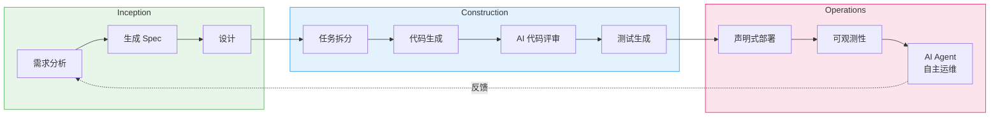
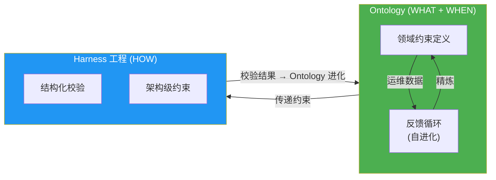

import { AidlcPrinciples, AidlcArtifacts, AidlcPhaseMapping, AidlcPhaseActivities } from '@site/src/components/AidlcTables';

# AIDLC 10 大原则与执行模型

> 📅 **撰写日期**: 2026-04-07 | ⏱️ **阅读时间**: 约 15 分钟

---

## 1. 为什么需要 AIDLC

传统软件开发生命周期 (SDLC) 是以人为中心的长期迭代周期 (周 / 月级) 为前提设计的。每日站会、冲刺评审、回顾会等仪式都针对这种长周期而优化。随着 AI 的出现,这一前提被打破。

AI 以 **小时 / 天级** 完成需求分析、任务拆分、代码生成与测试。把 AI 硬塞进现有 SDLC (Retrofit) 的做法会限制 AI 的潜力 — 就像在汽车时代去造更快的马车。

**AIDLC (AI-Driven Development Lifecycle)** 是 AWS Labs 提出的方法论,它从 **第一性原则 (First Principles)** 出发重新组织 AI,将其整合为开发生命周期的核心协作者。

### 1.1 SDLC vs AIDLC 对比

```
传统 SDLC                             AIDLC
━━━━━━━━━━━━━━                      ━━━━━━━━━━━━━━━━━━━
人规划并执行                           AI 提议,人验证
周 / 月级迭代 (Sprint)                小时 / 天级迭代 (Bolt)
设计技巧由团队选择                     DDD/BDD/TDD 内置于方法论
角色割裂 (FE/BE/DevOps)               借助 AI 跨越角色边界
手工需求分析                           AI 将 Intent 拆分为 Unit
顺序式交接                             连续流 + Loss Function 校验
```

### 1.2 AWS Labs AIDLC 官方术语映射

engineering-playbook 使用独立扩展术语 (Intent · Unit · Bolt),与 AWS Labs [AIDLC Workflows](https://github.com/awslabs/aidlc-workflows) 官方术语映射如下:

| engineering-playbook 术语 | AWS Labs 官方术语 | 备注 |
|---------------------------|-------------------|------|
| **Intent** | User Request / Requirements | 业务目标。官方仓库将自然语言形式的 User Request 精炼为 Requirements Document。概念相同 |
| **Unit** | Unit of Work | DDD 子域级工作单元。官方仓库在 `construction/` 阶段并行 / 顺序执行多个 Unit of Work — 概念相同 |
| **Bolt** | Phase Execution | Sprint 替代概念,**engineering-playbook 独立术语**。官方仓库无完全等价项,而是用 Phase 级 stage 执行来表达 |

:::info 术语选择理由
engineering-playbook 面向韩国企业级语境 (瀑布→混合转型、RFP 固定价竞标等),为 **提升团队内沟通效率** 采用了短而含义明确的术语 (Intent · Unit · Bolt)。与官方 AWS Labs 仓库协作或引用原文时,请使用上表进行术语翻译。
:::

### 1.3 AWS Labs AIDLC 官方 5 大原则

AWS Labs 仓库的 `aws-aidlc-rule-details/common/` 目录定义了作为 AIDLC 运行基础的官方 5 大原则。engineering-playbook 的 10 大原则是在此 5 大原则之上扩展与深化的版本。

:::note AWS Labs AIDLC 官方 5 大原则
1. **No duplication** — 保持单一事实来源 (SSOT)。同一信息不在多个文档 / 工具中重复
2. **Methodology first** — AIDLC 方法论优先于工具 / 平台。在 7 个支持平台 (Kiro · Q Developer · Cursor · Cline · Claude Code · GitHub Copilot · AGENTS.md) 上行为一致
3. **Reproducible** — 对相同输入 (User Request、Workspace 状态),**相同模型产生相同产物**。切换模型时结果差异不会过大,通过结构化问答格式强制
4. **Agnostic** — 不绑定特定语言 / 框架 / 云。产物以纯文本 Markdown + 标准化章节结构产出
5. **Human in the loop** — 通过 Checkpoint Approval 门禁要求每次 stage 转换都显式批准。保持 AI 自主性与人类掌控之间的平衡
:::

engineering-playbook 的 10 大原则 (§2) 在官方 5 大原则之上增加了 DDD/BDD/TDD 内置、连续流 (Loss Function)、Ontology·Harness 工程等 **企业级特化轴**。

### 1.4 核心转变: 反转对话方向

在传统开发中,人向计算机下达命令 ("实现这个功能")。在 AIDLC 中,**AI 先提出规划**,由人进行验证。这不仅仅是角色互换,而是 **将 AI 的探索能力与人的判断力最佳结合** 的结构。

用 Google Maps 做类比很合适:司机设置目的地 (Intent),AI 给出路线建议,司机验证并在需要时修改。AI 实时分析路况 (代码库、技术债、依赖),选出最优路径;司机结合业务上下文 (优先级、风险偏好) 做最终决策。

:::info 原文参考
AIDLC 的核心概念由 AWS Labs [AI-DLC Method Definition](https://prod.d13rzhkk8cj2z0.amplifyapp.com/) 定义。本文是对该方法论的哲学与执行模型所做的概念性梳理。
:::

---

## 2. AIDLC 10 大原则

<AidlcPrinciples />

### 2.1 核心 3 原则深入解读

#### 1. Reverse the Conversation Direction (反转对话方向)

**传统做法:**
```
开发者: "添加一个 /users API 端点"
AI: "好的,已创建"
开发者: "不对,需要鉴权"
AI: "已修改"
```

**AIDLC 做法:**
```
开发者: "我需要一个用户管理功能" (Intent)
AI: "分析后,需要以下 3 个 Unit:
     1. User Authentication Service (OAuth2 + JWT)
     2. User CRUD API (REST + GraphQL)
     3. User Profile Storage (DynamoDB)
     以下是每个 Unit 的 Domain Design 与 Logical Design 建议..."
开发者: "去掉 GraphQL,改用 RDS"
AI: "生成修改后的规划..."
```

AI 在生成代码之前先 **提议整体架构**,开发者结合业务上下文进行验证。这是 **设计层面的协作**,而不是代码层面。

#### 2. Integration of Design Techniques (内置设计技巧)

在 Scrum 中,DDD/BDD/TDD 是 "由团队自行选择" 的选项。AIDLC 把它们作为 **方法论的必备核心** 内置进来。

- **DDD (Domain-Driven Design)** — AI 自动将业务逻辑建模为 Aggregate、Entity、Value Object。与 [Ontology 工程](./ontology-engineering.md) 结合,对领域知识进行结构化。
- **BDD (Behavior-Driven Development)** — AI 生成 Given-When-Then 场景,明确业务行为。
- **TDD (Test-Driven Development)** — AI 先写测试,再生成能通过测试的最小代码。

这些不是可选项,而是 **AI 生成代码的标准工作流**。

#### 3. Minimize Stages, Maximize Flow (最小化阶段、最大化流动)

传统 SDLC 的交接 (规划 → 设计 → 开发 → 测试 → 部署) 在每个阶段都会造成知识损失与延迟。AIDLC 追求 **连续流 (Continuous Flow)**。

各阶段的人工验证扮演 **Loss Function** 的角色。正如机器学习中 Loss Function 衡量模型误差并引导学习一样,AIDLC 中的人工验证可及早捕获 AI 产物的错误,阻止错误向下游传递。

```
Intent 校验 (人) → Unit 拆分校验 (人) → Design 校验 (人) → 代码校验 (人)
     ↓                   ↓                      ↓                ↓
  Loss 1              Loss 2                 Loss 3            Loss 4
```

Loss 越小则继续下一阶段,Loss 大则由 AI 重新生成。这是一种 **自适应工作流**,只在必要时执行所需阶段。

---

## 3. Intent → Unit → Bolt 执行模型

AIDLC 将传统 SDLC 的术语在 AI 时代重新定义。

```
┌─────────┐    ┌─────────┐    ┌─────────┐
│  Intent │───▶│  Unit   │───▶│  Bolt   │
│高层目的 │    │独立工作 │    │快速迭代 │
│         │    │ 单元    │    │ (替代   │
│业务目标 │    │(DDD Sub-│    │ Sprint) │
│         │    │ domain) │    │         │
└─────────┘    └─────────┘    └─────────┘
                    │
              ┌─────┴─────┐
              ▼           ▼
        ┌──────────┐ ┌──────────┐
        │ Domain   │ │ Logical  │
        │ Design   │ │ Design   │
        │业务逻辑  │ │NFR+模式  │
        └──────────┘ └──────────┘
              │           │
              └─────┬─────┘
                    ▼
            ┌──────────────┐
            │ Deployment   │
            │    Unit      │
            │容器 + Helm + │
            │  Terraform   │
            └──────────────┘
```

<AidlcArtifacts />

### 3.1 Intent (意图)

**Epic/Feature 的 AI 版再定义**

传统的 Epic 是 "一组较大的 User Story"。AIDLC 中的 Intent 是 **明确业务目的的高层目标**。

**示例:**
```
传统 Epic: "实现用户认证功能"
            → 含糊、范围不清、包含技术细节

AIDLC Intent: "客户可以使用社交登录 (Google、GitHub)
               访问平台并使用个性化仪表板"
            → 业务价值清晰、由 AI 建议技术选型
```

Intent 明确 **WHAT (做什么) 与 WHY (为什么)**,将 **HOW (怎么做)** 交给 AI。

### 3.2 Unit (单元)

**User Story 的 AI 版再定义**

传统 User Story 通过 "As a X, I want Y, so that Z" 模板由人手工编写。AIDLC 中的 Unit 是 **AI 将 Intent 自动拆分为 DDD 子域级独立工作单元** 的产物。

**Intent → Unit 拆分示例:**
```
Intent: "客户可使用社交登录访问平台并使用个性化仪表板"

AI 生成的 Units:
1. Authentication Service (Core Subdomain)
   - OAuth2 集成 (Google、GitHub)
   - JWT 令牌签发 / 校验
   - Refresh Token 管理

2. User Profile Management (Core Subdomain)
   - 用户档案 CRUD
   - 头像上传 (S3)
   - 档案数据存储 (RDS)

3. Dashboard Service (Supporting Subdomain)
   - 用户级 Widget 配置
   - 仪表板布局保存
   - 实时数据聚合

4. IAM Integration (Generic Subdomain)
   - AWS Cognito 对接
   - 权限管理
   - 审计日志
```

每个 Unit 包含:
- **Domain Design** — DDD Aggregate、Entity、Value Object
- **Logical Design** — NFR (非功能需求)、架构模式、技术栈
- **Deployment Unit** — 容器、Helm Chart、Terraform 模块

### 3.3 Bolt (迭代)

**Sprint 的 AI 版再定义**

传统 Sprint 是 2~4 周的固定周期。AIDLC 中的 Bolt 是 **与 AI 快速执行节奏匹配的小时 / 天级短周期**。

**Sprint vs Bolt 对比:**
```
Sprint (传统)                      Bolt (AIDLC)
━━━━━━━━━━━━━━                  ━━━━━━━━━━━━━━
2-4 周固定周期                     小时 / 天级弹性周期
Planning → Daily → Review          AI 提议 → 校验 → 执行 → 校验
人工拆分任务                       AI 自动拆分任务
手工编码                           AI 生成代码 + 人工校验
Sprint 末尾部署                    完成即部署 (GitOps)
```

Bolt 是 **完成条件明确的最小部署单元**。与 Kubernetes Deployment、Helm Release、Terraform 模块等实际基础设施组件 1:1 映射。

:::tip Context Memory 与可追溯性
所有产物 (Intent、Unit、Domain Design、Logical Design、Deployment Unit) 均存入 **Context Memory**,在整个生命周期中供 AI 参考。产物之间保证双向可追溯 (Domain Model ↔ User Story ↔ 测试计划),使 AI 始终处于准确的上下文中工作。
:::

---

## 4. AI 主导的递归式工作流

AIDLC 的核心是 **AI 提议规划、由人校验的递归式精炼** 过程。

```
Intent (业务目的)
  │
  ▼
AI: 生成 Level 1 Plan ◀──── 人: 校验 · 修正
  │
  ├─▶ Step 1 ──▶ AI: Level 2 拆分 ◀── 人: 校验
  │                 ├─▶ Sub-task 1.1 ──▶ AI 执行 ◀── 人: 校验
  │                 └─▶ Sub-task 1.2 ──▶ AI 执行 ◀── 人: 校验
  │
  ├─▶ Step 2 ──▶ AI: Level 2 拆分 ◀── 人: 校验
  │                 └─▶ ...
  └─▶ Step N ──▶ ...

[所有产物 → Context Memory → 双向可追溯性]
```

### 4.1 作为 Loss Function 的人工校验

机器学习中 Loss Function 衡量模型预测与真实值的差异以引导学习。AIDLC 中的人工校验担任相同角色。

**Loss Function 层次:**

```
┌─────────────────────────────────────────────┐
│ Intent Loss                                 │
│ "业务目的是否清晰?"                         │
│ Loss 大 → 重写 Intent                       │
└─────────────────────────────────────────────┘
              ▼
┌─────────────────────────────────────────────┐
│ Unit Decomposition Loss                     │
│ "Unit 拆分是否合理?是否有遗漏 / 重复?"     │
│ Loss 大 → 重新拆分 Unit                     │
└─────────────────────────────────────────────┘
              ▼
┌─────────────────────────────────────────────┐
│ Design Loss                                 │
│ "DDD 模型是否准确反映领域?"                 │
│ Loss 大 → 重新生成 Design                   │
└─────────────────────────────────────────────┘
              ▼
┌─────────────────────────────────────────────┐
│ Code Loss                                   │
│ "生成的代码是否准确实现设计?"               │
│ Loss 大 → 重新生成代码                       │
└─────────────────────────────────────────────┘
```

Loss 小则前进到下一阶段,Loss 大则重做该阶段。这样可 **阻止错误向下游传递**,保证整体质量。

### 4.2 自适应工作流

AI 根据具体情境提供 **只执行必要阶段** 的自适应工作流。

**按场景的工作流:**

```
新功能开发:
  Intent → Unit 拆分 → Domain Design → Logical Design → 代码生成 → 测试

Bug 修复:
  Intent → 分析既有代码 → 生成修复代码 → 测试

重构:
  Intent → 分析既有 Design → 改进后的 Design → 代码重生成 → 测试

技术债清理:
  Intent → 识别债务区域 → 重构计划 → 分阶段执行
```

AI 不强制针对每条路径的固定工作流,而是 **根据情境提议 Level 1 Plan** 的灵活做法。

---

## 5. AIDLC 3 阶段总览

AIDLC 由 **Inception**、**Construction**、**Operations** 3 个阶段组成。

### 5.0 AWS Labs 官方 3 阶段与 engineering-playbook 扩展的映射

AWS Labs 官方仓库定义了 Inception → Construction → Operations 3 阶段,但 Operations 当前处于 **占位符状态 (仅有基础 stage 定义,详细工作流待后续发布)**。engineering-playbook 以 **AgenticOps 轨道** 填补了这一空白。

| 官方阶段 | 官方定义状态 (v0.1.7, 2026-04-02) | engineering-playbook 扩展 | 主要文档 |
|----------|-------------------------------------|---------------------------|----------|
| **Inception** | Workspace Detection · Reverse Engineering · Requirements Analysis · User Stories · Workflow Planning · Application Design · Units Generation (7 stage) | Intent 定义 + Ontology 建设 + DDD Strategic Design | [10 大原则](./principles-and-model.md) · [Ontology 工程](./ontology-engineering.md) · [DDD 集成](./ddd-integration.md) |
| **Construction** | Functional Design → NFR → Infrastructure → Code Generation → Build & Test (per Unit loop) | Bolt 执行 + Harness 工程 + Quality Gate | [Harness 工程](./harness-engineering.md) · [AI 编码代理](../toolchain/ai-coding-agents.md) · [EKS 声明式自动化](../toolchain/eks-declarative-automation.md) |
| **Operations** | Placeholder (仅 stage 定义) | **AgenticOps 轨道** — 基于 AI 代理的自主运维,可观测性 · 预测 · 自动响应,Ontology Outer Loop 反馈 | [AgenticOps](../operations/index.md) · [可观测性栈](../operations/observability-stack.md) · [预测运维](../operations/predictive-operations.md) · [自主响应](../operations/autonomous-response.md) |

:::tip AgenticOps 扩展的价值
官方 AIDLC 之所以将 Operations 阶段留作占位,是因为运维领域 **因组织的可观测性栈 · 监管环境 · SRE 成熟度而差异巨大**。engineering-playbook 的 AgenticOps 轨道提供的是基于 AWS 企业级环境 (EKS · CloudWatch · ADOT · Application Signals · MCP) 的参考实现。
:::

<AidlcPhaseMapping />



<AidlcPhaseActivities />

### 5.1 Inception (启动)

**目标:** 明确 Intent,并拆分为 Unit

**AI 角色:**
- 分析 Intent,并对不清晰之处提出问题
- 将 Intent 拆分为 DDD 子域 (Core/Supporting/Generic)
- 为每个 Unit 生成 Domain Design 初稿

**人类角色:**
- 校验 Intent (业务目的清晰度)
- 校验 Unit 拆分 (是否有遗漏 / 重复)
- 校验 Domain Design (是否反映领域知识)

**产物:**
- Intent Document
- Unit List (DDD 子域)
- Domain Design (Aggregate、Entity、Value Object)

### 5.2 Construction (构建)

**目标:** 将 Unit 实现为可运行的代码与基础设施

**AI 角色:**
- 生成 Logical Design (NFR、架构模式、技术栈)
- 生成代码 (TDD: 先写测试再实现)
- 代码评审 (静态分析、安全扫描)
- 生成 Deployment Unit (Dockerfile、Helm Chart、Terraform)

**人类角色:**
- 校验 Logical Design (NFR 是否满足)
- 校验代码 (业务逻辑正确性)
- 安全校验 (审查敏感逻辑)

**产物:**
- Logical Design 文档
- 源代码 + 测试
- Deployment Unit (容器、IaC)

### 5.3 Operations (运维)

**目标:** 部署后的监控、自动恢复、持续改进

**AI 角色:**
- GitOps 自动部署 (ArgoCD)
- 实时监控 (日志、指标、Trace 分析)
- 异常检测与自动恢复
- 将反馈转化为 Intent 并回传给 Inception

**人类角色:**
- 审批部署 (生产环境)
- 事件响应 (校验 AI 建议)
- 提供业务反馈

**产物:**
- 可观测性面板 (Grafana、CloudWatch)
- 事件报告
- 改进 Intent (下一循环)

---

## 6. 可信性保证: Ontology × Harness

为系统性保证 AI 生成代码的可信性,AIDLC 引入了 **Ontology** 与 **Harness 工程** 两个轴的可信性框架。



**两个轴的角色:**

- **[Ontology](./ontology-engineering.md)** — 将领域知识形式化的 "typed world model"。将 DDD 的 Ubiquitous Language 提升为 AI 可理解的结构化 schema。Ontology 不是静态 schema,而是 **通过自身反馈循环持续进化的活模型**。

- **[Harness 工程](./harness-engineering.md)** — 以架构方式校验并强制 Ontology 所定义约束的结构。"不是 Agent 难,而是 Harness 难" 是 2026 年的核心教训。Harness 的校验结果会促进 Ontology 进化。

:::tip 可信性框架的核心
Ontology 与 Harness **不是独立运行的**。Ontology 定义 "要校验什么",Harness 实现 "如何校验"。Harness 的校验结果又引导 Ontology 进化,从而构成 **自我改进的可信性系统**。
:::

---

## 7. 落地路线图

AIDLC 通过分阶段导入,逐步提升组织成熟度。

```
Phase 1: 引入 AI 编码工具
  └── 使用 Q Developer/Copilot 开始代码生成 · 评审
      (成熟度 Level 2)

Phase 2: Spec-Driven 开发
  └── 通过 AI Agent 构建系统化的 requirements → 代码工作流
      试点引入 Mob Elaboration 仪式
      (成熟度 Level 3)

Phase 3: 声明式自动化
  └── 使用 GitOps 自动化部署
      转换至 AI/CD 流水线
      (成熟度 Level 3→4)

Phase 4: AI Agent 扩展
  └── 由 AI Agent 自主运维
      推广 Mob Construction 仪式
      (成熟度 Level 4)
```

### 7.1 Phase 1: 引入 AI 编码工具 (2~4 周)

**目标:** 让开发者熟悉 AI 编码工具

**活动:**
- 安装 Amazon Q Developer 或 GitHub Copilot
- 练习代码自动补全、函数生成、测试生成
- 建立 AI 生成代码的校验流程

**成功指标:**
- 80% 以上开发者日常使用 AI 编码工具
- 编码速度提升 30% 以上

### 7.2 Phase 2: Spec-Driven 开发 (1~2 个月)

**目标:** 建立 AI 分析需求并提议设计的工作流

**活动:**
- 使用 AI Agent (Q Developer、开源 Agent) 练习 Intent → Unit 拆分
- 引入 Mob Elaboration 仪式 (每周 1 次,全员参与)
- 建设 Context Memory (项目文档、架构、代码库)

**成功指标:**
- 新功能的 50% 以上始于 AI 建议的设计
- 需求分析时间缩短 40% 以上

### 7.3 Phase 3: 声明式自动化 (2~3 个月)

**目标:** 使用 GitOps 自动化部署,并由 AI 生成基础设施代码

**活动:**
- 使用 ArgoCD 或 Flux 构建 GitOps
- AI 自动生成 Helm Chart、Terraform 模块
- 流水线由 CI/CD 转换为 AI/CD

**成功指标:**
- 部署前置时间缩短 50% 以上
- 70% 以上基础设施代码由 AI 生成

### 7.4 Phase 4: AI Agent 扩展 (3~6 个月)

**目标:** 由 AI Agent 自主执行运维

**活动:**
- 使用 AI Agent 分析日志 / 指标,异常检测,自动恢复
- 推广 Mob Construction 仪式 (常态化)
- 建设 [Ontology](./ontology-engineering.md) + [Harness](./harness-engineering.md) 可信性框架

**成功指标:**
- 事件响应时间缩短 60% 以上
- 40% 以上事件由 AI 自动恢复

---

## 8. 下一步

如果已掌握 AIDLC 的核心概念与执行模型,请参考以下文档:

- **[Ontology 工程](./ontology-engineering.md)** — 将领域知识转化为 AI 可理解的结构化 schema
- **[Harness 工程](./harness-engineering.md)** — 以架构方式校验并强制 AI Agent 行为的结构
- **[DDD 集成](./ddd-integration.md)** — 在 AIDLC 中实践 DDD 的具体方法

---

## 参考资料

### AIDLC 官方参考
- [AWS Labs AIDLC Workflows](https://github.com/awslabs/aidlc-workflows) — **官方参考仓库** (v0.1.7, 2026-04-02)。`aws-aidlc-rule-details/common/` 中定义了 11 项通用规则与 5 大原则
- [AWS Labs AIDLC Common Rules](https://github.com/awslabs/aidlc-workflows/tree/main/aws-aidlc-rule-details/common) — 11 项通用规则 permalink
- [AWS Labs AIDLC Inception Stages](https://github.com/awslabs/aidlc-workflows/tree/main/aws-aidlc-rule-details/inception) — 7 阶段 Decision Tree
- [AWS Labs AIDLC Extensions](https://github.com/awslabs/aidlc-workflows/tree/main/aws-aidlc-rule-details/extensions) — Built-in security/testing extensions + opt-in 机制
- [AWS AI-DLC Method Definition](https://prod.d13rzhkk8cj2z0.amplifyapp.com/) — AIDLC 原文 (Raja SP, AWS)
- [AWS AI-Driven Development Life Cycle Blog](https://aws.amazon.com/blogs/devops/ai-driven-development-life-cycle/)
- [Open-Sourcing Adaptive Workflows for AI-DLC](https://aws.amazon.com/blogs/devops/open-sourcing-adaptive-workflows-for-ai-driven-development-life-cycle-ai-dlc/) — AWS, 2025.11

### 设计技巧
- [Domain-Driven Design Reference](https://domainlanguage.com/ddd/reference/) — Eric Evans
- [Behavior-Driven Development](https://dannorth.net/introducing-bdd/) — Dan North
- [Test-Driven Development: By Example](https://www.amazon.com/Test-Driven-Development-Kent-Beck/dp/0321146530) — Kent Beck
