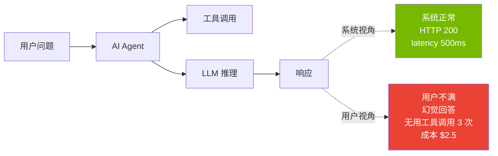
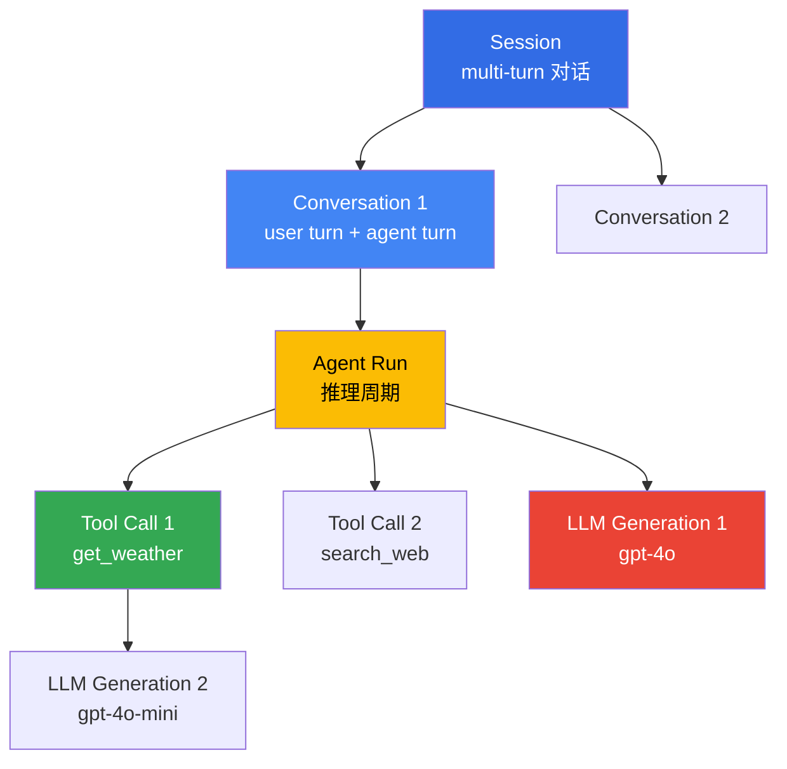

# AgenticOps 指标 — 运营中需观测的 Agent KPI

> **阅读时间**: 约 5 分钟

AI Agent 部署生产后,仅凭 **系统是否正常响应** 无法评判质量。必须测量 **用户感知质量 (Perceived Quality)**,比如 "是否准确理解了用户意图?"、"是否调用了正确工具?"、"回答是否充实?"。本文介绍 Agent 运营必备的 **KPI 类别** 与基于 **Langfuse · OTel** 的埋点方法。

---

## 1. 为什么需要 Agent 专用指标

### 1.1 传统 APM 的局限

传统 APM (Application Performance Monitoring) 以 HTTP 成功率、响应时间、错误率等 **系统指标** 为主设计。Agent 则需要额外指标,原因如下:

| 传统 APM | Agent 质量指标 | 差距 |
|----------|----------------|------|
| HTTP 200 OK | 回答是否正确 | 请求成功 ≠ 结果质量 |
| 响应时间 (整体) | Time to First Token | streaming 中用户感知速度不同 |
| 错误率 | Hallucination rate | LLM 错误并非 HTTP 500,而是正常响应 |
| CPU/Memory | Token cost | 云 LLM 按 token 计费 |
| N/A | Tool-call accuracy | 错误工具调用非系统错误 |

### 1.2 用户感知质量 vs 系统指标



Agent 的实际质量由 **是否准确完成用户所需任务** 判断,与系统成功指标相互独立。

---

## 2. 核心 KPI 类别

### 2.1 任务成功 (Task Success)

测量用户请求的工作是否完成。

| 指标 | 定义 | 测量方法 |
|------|------|----------|
| **Task success rate** | 成功对话会话比例 | 自动评估 (goal attainment) + HITL 抽样 (10%) |
| **Completion time (p50/p95)** | 完成任务耗时 | Session duration (秒) |
| **Goal attainment scale** | 用户目标达成度 (1-5) | 显式反馈 (thumbs up/down) 或 LLM-as-Judge |

**示例 (客服 Agent):**

```python
# Langfuse 自动评估示例
from langfuse import Langfuse
langfuse = Langfuse()

trace = langfuse.trace(
    name="customer-support-session",
    session_id="sess_abc123",
    metadata={"intent": "refund_request", "channel": "web"}
)

# 会话结束时评估
trace.score(
    name="task_success",
    value=1.0,  # 0.0 = 失败,1.0 = 成功
    comment="Refund processed and confirmation sent"
)
```

### 2.2 Tool Use 准确性

测量 Agent 是否正确调用了应有工具。

| 指标 | 定义 | 测量方法 |
|------|------|----------|
| **Tool-call accuracy** | 调用正确工具的比例 | (正确工具调用数) / (总工具调用数) |
| **Tool invocation rate** | 每会话平均工具调用数 | 分析 span 层级 |
| **Tool failure rate** | 工具调用失败率 | HTTP 5xx、Timeout、JSON parsing error |

**示例:**

```python
# 记录 tool call span
span = trace.span(
    name="tool_call",
    input={"tool": "get_weather", "args": {"location": "Seoul"}},
    metadata={"tool_name": "get_weather", "tool_version": "v1.2"}
)

# 评估标准: 意图="天气问" → 正确工具="get_weather"
# 反例: 调用 "search_web" 而非 "get_weather" → accuracy 0.0
span.score(
    name="tool_call_accuracy",
    value=1.0,  # 选择了正确工具
    comment="Correct tool selected for weather intent"
)
```

### 2.3 质量 · 安全

测量回答质量与安全违规情况。

| 指标 | 定义 | 测量方法 |
|------|------|----------|
| **Hallucination rate** | 无依据信息生成比例 | Ragas Faithfulness / SelfCheckGPT |
| **Guardrails violation rate** | 输入输出拦截比例 | input/output filter block count |
| **Toxicity incidence** | 有害内容生成比例 | Perspective API / OpenAI Moderation |

**Hallucination 测量示例 (Ragas Faithfulness):**

```python
from ragas.metrics import faithfulness
from ragas import evaluate

# 评估 RAG Agent
result = evaluate(
    dataset=test_dataset,
    metrics=[faithfulness],
    llm=ChatOpenAI(model="gpt-4o-mini")
)

# 把 Faithfulness 分数记录到 Langfuse
trace.score(
    name="faithfulness",
    value=result["faithfulness"],  # 0.0~1.0
    comment=f"Context: {len(context)} chars, Answer: {len(answer)} chars"
)
```

**Guardrails violation 测量:**

```python
# OpenClaw AI Gateway 的 PII redaction 拦截
if gateway_response.status == "blocked_pii":
    trace.score(
        name="guardrails_violation",
        value=1.0,  # 被拦截
        comment="PII detected: email, phone"
    )
```

### 2.4 成本 · 效率

测量 Agent 运营成本与资源效率。

| 指标 | 定义 | 测量方法 |
|------|------|----------|
| **Cost per interaction** | 每会话平均成本 (USD) | Σ(input_tokens × price_in + output_tokens × price_out) |
| **Token efficiency** | 有效 token 比例 | (回答 token) / (总消耗 token) |
| **Cache hit rate** | Semantic cache 命中率 | (cache hits) / (total queries) |

**成本跟踪示例:**

```python
# 在 Generation span 记录 token 与成本
generation = trace.generation(
    name="llm_call",
    model="gpt-4o-2025-01-31",
    input="What is the weather in Seoul?",
    output="The current weather in Seoul is...",
    usage={
        "input": 1200,
        "output": 80,
        "total": 1280,
        "input_cost": 0.012,   # $10 / 1M tokens
        "output_cost": 0.024,  # $30 / 1M tokens
        "total_cost": 0.036
    }
)
```

**Cache hit rate 测量:**

```python
# Semantic cache 命中时
if cache_hit:
    trace.event(
        name="cache_hit",
        metadata={"cache_key": cache_key, "latency_saved_ms": 2500}
    )
```

### 2.5 用户体验

测量用户的感受品质。

| 指标 | 定义 | 测量方法 |
|------|------|----------|
| **Time to First Token (TTFT)** | 首响应耗时 | streaming 开始时间 - 请求时间 |
| **Task-length quartiles** | 任务复杂度分布 | 基于 METR Task Standard 的分类 |
| **Escalation rate** | 人工接管比例 | (human handoff count) / (total sessions) |

**TTFT 测量示例:**

```python
import time

request_time = time.time()
# 调用 LLM (streaming)
first_token_time = None

async for chunk in llm_stream():
    if first_token_time is None:
        first_token_time = time.time()
        ttft_ms = (first_token_time - request_time) * 1000
        
        trace.event(
            name="time_to_first_token",
            metadata={"ttft_ms": ttft_ms, "model": "gpt-4o"}
        )
```

**Escalation rate 测量:**

```python
# 当 Agent 检测不确定时交接给人
if confidence_score < 0.7:
    trace.event(
        name="escalation",
        metadata={
            "reason": "low_confidence",
            "confidence": confidence_score,
            "fallback": "human_agent"
        }
    )
```

### 2.6 系统可靠性

测量 Agent 服务稳定性。

| 指标 | 定义 | 测量方法 |
|------|------|----------|
| **Availability** | 可用时间比例 | (uptime) / (total time) |
| **Error budget** | SLO 违反可容忍消耗率 | 1 - (actual SLI / SLO target) |
| **Session continuity rate** | 无中断完成比例 | (完成会话) / (开始会话) |
| **Retry exhaustion rate** | 重试超限比例 | (max retries exceeded) / (total requests) |

**SLO 示例 (Task success rate):**

```
Target SLO: Task success rate ≥ 95% (30 天)
Error budget: 5% → 每月允许 36 小时故障
```

---

## 3. Langfuse Trace Schema 建议

### 3.1 Span Hierarchy

把 Agent 执行流程表达为如下层级:



### 3.2 基础 Tag

对所有 trace/span 赋予以下 tag:

- `agent_name`: Agent 标识 (如 `customer-support-agent`)
- `model`: LLM 模型名 (如 `gpt-4o-2025-01-31`)
- `prompt_version`: 提示模板版本 (如 `v1.2.3`)
- `tool`: 调用的工具名 (如 `get_weather`)
- `guardrails`: 应用的 guardrails (如 `pii_redaction,prompt_injection`)

### 3.3 Score 事件

质量评估以 `score` 事件记录:

- `task_success`: 0.0~1.0
- `faithfulness`: 0.0~1.0 (Ragas)
- `cache_hit`: 0.0 (miss) / 1.0 (hit)
- `tool_call_accuracy`: 0.0~1.0
- `guardrails_violation`: 0.0 (pass) / 1.0 (block)

### 3.4 JSON 示例

```json
{
  "id": "trace_abc123",
  "name": "customer-support-session",
  "session_id": "sess_xyz789",
  "user_id": "user_456",
  "tags": ["agent_name:support-agent", "environment:production"],
  "metadata": {
    "channel": "web",
    "intent": "refund_request",
    "customer_tier": "premium"
  },
  "spans": [
    {
      "id": "span_001",
      "name": "agent_run",
      "start_time": "2026-04-18T10:00:00Z",
      "end_time": "2026-04-18T10:00:05Z",
      "input": "I want to request a refund for order #12345",
      "output": "I've processed your refund request...",
      "metadata": {
        "reasoning_steps": 3,
        "tools_called": ["get_order", "process_refund", "send_email"]
      }
    },
    {
      "id": "span_002",
      "parent_span_id": "span_001",
      "name": "tool_call",
      "type": "span",
      "start_time": "2026-04-18T10:00:01Z",
      "end_time": "2026-04-18T10:00:02Z",
      "input": {"tool": "get_order", "args": {"order_id": "12345"}},
      "output": {"status": "delivered", "amount": 129.99},
      "metadata": {
        "tool_name": "get_order",
        "tool_version": "v2.1",
        "latency_ms": 850
      }
    },
    {
      "id": "gen_001",
      "parent_span_id": "span_001",
      "name": "llm_generation",
      "type": "generation",
      "model": "gpt-4o-2025-01-31",
      "input": [{"role": "system", "content": "You are a support agent..."}, {"role": "user", "content": "I want a refund..."}],
      "output": "Based on your order status...",
      "usage": {
        "input": 1200,
        "output": 80,
        "total": 1280,
        "input_cost": 0.012,
        "output_cost": 0.024,
        "total_cost": 0.036
      },
      "metadata": {
        "temperature": 0.7,
        "prompt_version": "v1.2.3"
      }
    }
  ],
  "scores": [
    {
      "name": "task_success",
      "value": 1.0,
      "comment": "Refund processed successfully"
    },
    {
      "name": "faithfulness",
      "value": 0.92,
      "comment": "High context adherence"
    },
    {
      "name": "tool_call_accuracy",
      "value": 1.0,
      "comment": "All tools correctly selected"
    }
  ]
}
```

---

## 4. OpenTelemetry Semantic Conventions

### 4.1 GenAI Semantic Conventions (截至 2026-04)

OpenTelemetry 通过 **Gen AI Semantic Conventions** 定义 LLM 埋点标准 ([v1.28.0 experimental](https://opentelemetry.io/docs/specs/semconv/gen-ai/))。

**核心 attribute:**

| Attribute | 示例 | 说明 |
|-----------|------|------|
| `gen_ai.system` | `openai` | LLM 厂商 |
| `gen_ai.request.model` | `gpt-4o-2025-01-31` | 模型名 |
| `gen_ai.request.temperature` | `0.7` | 采样温度 |
| `gen_ai.request.max_tokens` | `2048` | 最大输出 token |
| `gen_ai.usage.input_tokens` | `1200` | 输入 token 数 |
| `gen_ai.usage.output_tokens` | `80` | 输出 token 数 |
| `gen_ai.response.finish_reason` | `stop` | 结束原因 (stop、length、tool_calls) |

### 4.2 Span Kind

- **client**: Agent → LLM API 调用
- **internal**: Agent 内部推理逻辑

### 4.3 OTel → Langfuse 桥接

```python
# OpenTelemetry instrumentation → 自动发送到 Langfuse
from opentelemetry import trace
from opentelemetry.exporter.otlp.proto.grpc.trace_exporter import OTLPSpanExporter
from opentelemetry.sdk.trace import TracerProvider
from opentelemetry.sdk.trace.export import BatchSpanProcessor

# OTLP Exporter → Langfuse OTLP endpoint
exporter = OTLPSpanExporter(
    endpoint="https://langfuse.example.com/api/public/otlp",
    headers={"Authorization": "Bearer <LANGFUSE_API_KEY>"}
)

provider = TracerProvider()
provider.add_span_processor(BatchSpanProcessor(exporter))
trace.set_tracer_provider(provider)

# 所有 OTel trace 都发送到 Langfuse
tracer = trace.get_tracer(__name__)

with tracer.start_as_current_span("agent_run") as span:
    span.set_attribute("gen_ai.system", "openai")
    span.set_attribute("gen_ai.request.model", "gpt-4o")
    # ... Agent 执行
```

---

## 5. Grafana/CloudWatch 看板示例

### 5.1 Top-line 指标 (面向管理层)

```
┌─────────────────────────────────────────────────────────────┐
│ Task Success Rate (30 天)          │ 96.2% (↑ 1.2% WoW)    │
│ Avg Cost per Interaction           │ $0.12 (↓ $0.03 WoW)  │
│ Hallucination Rate                 │ 2.1% (↑ 0.3% WoW)    │
│ Escalation Rate                    │ 3.5% (→ 0.0% WoW)    │
└─────────────────────────────────────────────────────────────┘
```

**Grafana Panel 配置:**

```promql
# Task success rate (30 天平均)
sum(rate(langfuse_trace_score_total{name="task_success", value="1"}[30d]))
/
sum(rate(langfuse_trace_score_total{name="task_success"}[30d]))
```

### 5.2 Drill-down 看板 (面向运维)

**Tool Call 分析:**

```
Tool Call Success Rate by Tool
┌──────────────┬──────────┬──────────┐
│ Tool         │ Calls    │ Success  │
├──────────────┼──────────┼──────────┤
│ get_weather  │ 1,234    │ 99.2%    │
│ search_web   │ 892      │ 94.5%    │
│ send_email   │ 456      │ 100%     │
│ get_order    │ 789      │ 98.7%    │
└──────────────┴──────────┴──────────┘
```

**Guardrails Violation 趋势:**

```
Guardrails Violation Rate (7 天)
┌─────────────────────────────────────────┐
│  5% ┤                                    │
│  4% ┤    ╭╮                              │
│  3% ┤  ╭╯╰╮  ╭╮                          │
│  2% ┤╭╯   ╰╮╭╯╰╮                         │
│  1% ┼╯     ╰╯  ╰─────────────────        │
│  0% ┴────────────────────────────────    │
└─────────────────────────────────────────┘
     Mon  Tue Wed Thu Fri Sat Sun
```

### 5.3 SLO 看板

```
Error Budget Burn Rate (Task Success SLO: 95%)
┌────────────────────────────────────────────────────┐
│ Current SLI: 96.2%                                 │
│ Error Budget: 5% → 36h/月                          │
│ Consumed: 12.5h (34.7%)                            │
│ Remaining: 23.5h (65.3%)                           │
│                                                    │
│ ██████████████████░░░░░░░░░░░ 34.7% consumed     │
│                                                    │
│ Status: 🟢 HEALTHY                                 │
│ Estimated Days Until Budget Exhausted: 45 天       │
└────────────────────────────────────────────────────┘
```

---

## 6. 告警 · 异常检测

### 6.1 异常模式示例

| 异常类型 | 检测规则 | 响应动作 |
|----------|----------|----------|
| **Guardrails rate 飙升** | 3σ 超限 (rolling 1 小时) | PagerDuty P2、审查提示 |
| **Cost spike** | 每小时成本 > $100 (基线 $20) | Slack 告警、启用限流 |
| **Escalation rate 上升** | 超过 10% (基线 3%) | 通知 on-call、审视 Agent 逻辑 |
| **Tool failure rate** | 单工具 > 20% 失败 | 自动熔断、启用 fallback |

### 6.2 基线设定与检测算法

**基于 Rolling window 均值的异常检测:**

```python
# 示例: Guardrails violation rate 异常检测
import numpy as np

def detect_anomaly(current_rate, historical_rates, threshold_sigma=3):
    """
    Args:
        current_rate: 当前时段 violation rate
        historical_rates: 过去 7 天同时段 rates
        threshold_sigma: 标准差倍数阈值
    """
    baseline_mean = np.mean(historical_rates)
    baseline_std = np.std(historical_rates)
    
    z_score = (current_rate - baseline_mean) / baseline_std
    
    if z_score > threshold_sigma:
        return {
            "anomaly": True,
            "severity": "high" if z_score > 5 else "medium",
            "z_score": z_score,
            "baseline": baseline_mean,
            "current": current_rate
        }
    return {"anomaly": False}

# 实时监控示例
current_rate = 0.08  # 8% violation rate
historical = [0.02, 0.021, 0.019, 0.022, 0.018, 0.023, 0.020]  # 过去 7 天

result = detect_anomaly(current_rate, historical)
if result["anomaly"]:
    print(f"🚨 Anomaly detected: {result['current']:.1%} (baseline {result['baseline']:.1%})")
    # 发送 PagerDuty 告警
```

### 6.3 PagerDuty/Slack 集成

**CloudWatch Alarm → SNS → Lambda → PagerDuty:**

```python
# Lambda handler: CloudWatch Alarm → PagerDuty
import boto3
import requests

def lambda_handler(event, context):
    alarm_name = event["detail"]["alarmName"]
    metric = event["detail"]["metric"]
    value = event["detail"]["state"]["value"]
    
    # PagerDuty Events API v2
    payload = {
        "routing_key": "PAGERDUTY_ROUTING_KEY",
        "event_action": "trigger",
        "payload": {
            "summary": f"Agent KPI Anomaly: {alarm_name}",
            "severity": "warning",
            "source": "cloudwatch",
            "custom_details": {
                "metric": metric,
                "current_value": value,
                "threshold": event["detail"]["threshold"]
            }
        }
    }
    
    response = requests.post(
        "https://events.pagerduty.com/v2/enqueue",
        json=payload
    )
    return {"statusCode": 200, "body": "Alert sent"}
```

**Slack 通知示例:**

```
🚨 Agent Metrics Alert

**Cost Spike Detected**
- Current hourly cost: $142.50 (baseline $18.20)
- Time: 2026-04-18 14:30 UTC
- Agent: customer-support-agent
- Model: gpt-4o-2025-01-31

**Probable Cause**: Unusual traffic spike (3.2k requests vs 800 baseline)

Actions:
- Rate limit activated (100 req/min → 50 req/min)
- Fallback to gpt-4o-mini for non-critical queries

📊 Dashboard: https://grafana.example.com/d/agent-cost
📖 Runbook: https://wiki.example.com/agent-cost-spike
```

---

## 7. AIDLC 各阶段应用

### 7.1 Inception: 定义基线

项目早期定义目标 KPI。

| KPI | 目标 (90 天后) | 基线 (当前) |
|-----|----------------|--------------|
| Task success rate | ≥ 95% | 88% (人类基线) |
| Tool-call accuracy | ≥ 90% | N/A (新) |
| Hallucination rate | ≤ 3% | 12% (初版原型) |
| Cost per interaction | ≤ $0.15 | $0.32 |
| Escalation rate | ≤ 5% | 18% |

### 7.2 Construction: CI 回归门禁

每个 PR 自动检测指标回归。

```yaml
# .github/workflows/agent-quality-gate.yml
name: Agent Quality Gate
on: [pull_request]

jobs:
  evaluate:
    runs-on: ubuntu-latest
    steps:
      - uses: actions/checkout@v4
      
      - name: Run Ragas evaluation
        run: |
          pytest tests/test_agent_quality.py --ragas
      
      - name: Check metrics regression
        run: |
          python scripts/check_regression.py \
            --baseline metrics/baseline.json \
            --current metrics/current.json \
            --threshold 0.05  # 下降 ≥ 5% 则 fail
```

### 7.3 Operations: 实时告警

生产部署后的实时监控。

```
Agent KPI SLO (生产)
┌──────────────────────┬──────────┬──────────┬──────────┐
│ Metric               │ SLO      │ Current  │ Status   │
├──────────────────────┼──────────┼──────────┼──────────┤
│ Task success rate    │ ≥ 95%    │ 96.2%    │ 🟢 OK    │
│ Tool-call accuracy   │ ≥ 90%    │ 93.5%    │ 🟢 OK    │
│ Hallucination rate   │ ≤ 3%     │ 2.1%     │ 🟢 OK    │
│ Cost per interaction │ ≤ $0.15  │ $0.12    │ 🟢 OK    │
│ Escalation rate      │ ≤ 5%     │ 3.5%     │ 🟢 OK    │
│ TTFT (p95)           │ ≤ 2s     │ 1.8s     │ 🟢 OK    │
└──────────────────────┴──────────┴──────────┴──────────┘
```

---

## 8. 参考资料

### 8.1 Langfuse 文档

- [Langfuse Scoring](https://langfuse.com/docs/scores): 为 trace/span 赋予质量分数
- [Langfuse Prompt Management](https://langfuse.com/docs/prompts): 提示版本管理与 A/B 测试
- [Langfuse OTLP Integration](https://langfuse.com/docs/integrations/opentelemetry): OpenTelemetry 桥接

### 8.2 OpenTelemetry

- [GenAI Semantic Conventions](https://opentelemetry.io/docs/specs/semconv/gen-ai/): LLM 埋点标准 (v1.28.0 experimental)
- [OTel Python SDK](https://opentelemetry.io/docs/languages/python/): Python instrumentation

### 8.3 评估框架

- [Ragas](https://docs.ragas.io/): RAG 评估 (faithfulness、answer relevancy、context precision)
- [SelfCheckGPT](https://github.com/potsawee/selfcheckgpt): Zero-resource hallucination 检测
- [METR Task Standard](https://metr.org/): Agent 任务基准

### 8.4 相关文档

- [LLMOps Observability 对比指南](../../agentic-ai-platform/operations-mlops/llmops-observability.md): Langfuse vs LangSmith vs Helicone
- [Ragas RAG 评估框架](../../agentic-ai-platform/operations-mlops/ragas-evaluation.md): Ragas 指标详解
- [可观测性栈](./observability-stack.md): AIDLC Operations 的遥测基础
- [预测运维](./predictive-operations.md): 基于指标的故障预测
