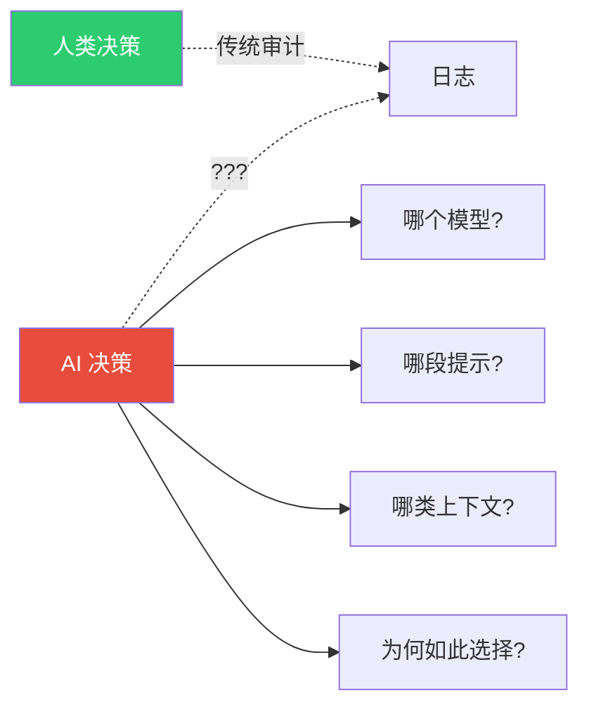
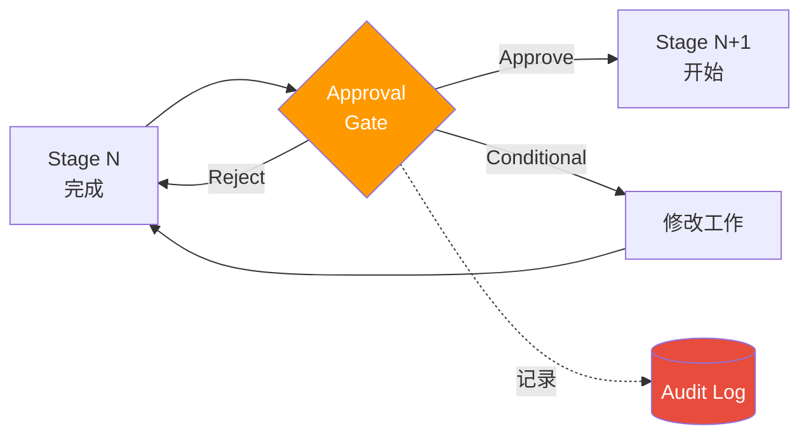
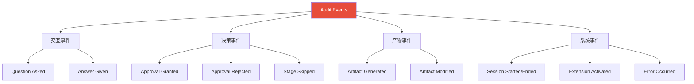
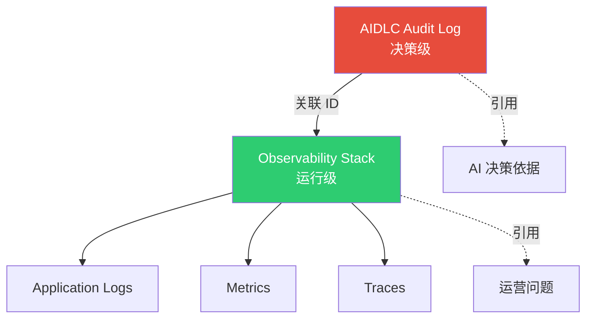
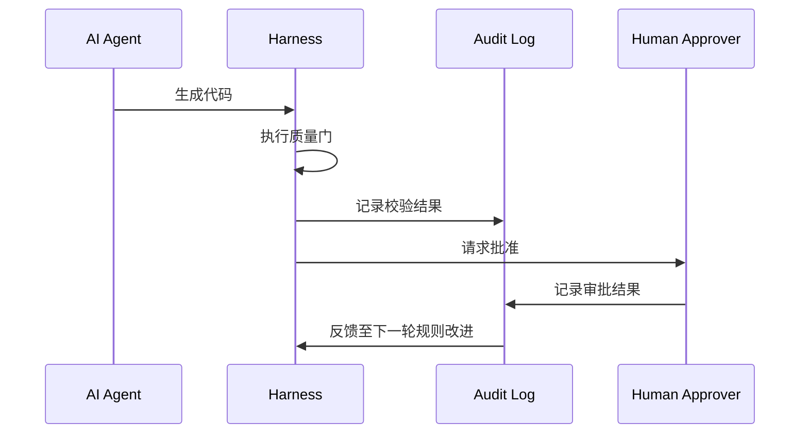

# Audit & Governance Logging

> 📅 **撰写日期**: 2026-04-18 | ⏱️ **阅读时间**: 约 17 分钟

在 AWS Labs [AIDLC Common Rules](https://github.com/awslabs/aidlc-workflows/tree/main/aws-aidlc-rule-details/common) 中,最具治理权重的两条规则是 **Checkpoint Approval (规则 7)** 与 **Audit Logging (规则 8)**。本文是在运营环境中把这两条规则实现为满足 **监管行业 (金融 · 医疗 · 公共)** 审计要求的实战指南。

---

## 1. 为何需要 Audit Log

### 1.1 监管要求

| 监管 | 审计要求 | 保留周期 | 与 AIDLC 的关联 |
|------|----------|----------|------------------|
| **韩国电子金融监督规定 (전자금융감독규정)** | 完整记录 IT 变更 · 访问 | 5 年 | 全部 AIDLC stage 的批准 · 决策记录 |
| **韩国个人信息保护法** | 个人信息处理决策记录 | 3 年 | Requirements Analysis、Application Design |
| **HIPAA (美国)** | PHI 访问 · 处理日志 | 6 年 | 医疗领域建模决策 |
| **SOX (美国)** | 财务系统变更管控 | 7 年 | Checkpoint Approval、产物哈希 |
| **ISMS-P (韩国)** | 信息系统运营日志 | 3 年 | 全部 Session 记录 |
| **GDPR (EU)** | 个人信息决策依据 | Case by case | Ontology 决策、数据处理设计 |

### 1.2 AIDLC 特有审计挑战



**AIDLC 审计较传统审计更难的原因:**
1. AI 输出可能 **非确定**,需要可复现性证明 (Common Rule 11)
2. AI 做出 **众多小决策**,需要全部记录
3. **模型版本变更** 会影响结果,因此版本信息必录
4. 存在 **提示注入** 攻击可能,需保留输入原文

### 1.3 可复现性与审计的关系

AIDLC 的审计要求 **超越简单事件记录,直达 "决策可复现"**:

```
审计官: "2026-03-15 为何决定支付服务用 Cognito 作为认证方式?"

传统系统: "工程师 Kim 某某 决定的批准记录"

AIDLC 系统:
  - User Request 原文
  - AI 提供的 5 选 1 选项原文
  - 用户答复 `[Answer]: A` 原文
  - 所用模型 (`claude-opus-4-7` 版本、temperature 0、seed 42)
  - 激活的 Extension 列表
  - 产物 SHA-256 哈希
  → 相同输入可重现相同结果
```

---

## 2. Checkpoint Approval 门禁

### 2.1 Stage 转换审批模式

AIDLC 各 stage 间的转换由 **显式审批门禁** 守护。



### 2.2 审批门禁模板

**标准审批文档格式:**
```markdown
# Checkpoint Approval: <stage name> → <next stage>

**Gate ID**: gate-2026-04-18-042
**Session ID**: sess-20260418-payment-service
**Timestamp**: 2026-04-18T10:45:12.345Z

## Completing Stage
**Stage**: requirements_analysis
**Duration**: 3h 25min
**Content Validation**: PASSED (0 failed checks)

## Artifacts Produced
| File | Size | SHA-256 |
|------|------|---------|
| `requirements.md` | 1,234 lines | `sha256:abc123...` |
| `.aidlc/validation-report.md` | 87 lines | `sha256:def456...` |
| `.aidlc/audit/stage-req-analysis.md` | 412 lines | `sha256:789abc...` |

## Approvers Required
- [x] Primary: Architect (yjeong@example.com)
- [ ] Secondary: Security Lead (security-lead@example.com)
- [ ] Tertiary: Compliance Officer (compliance@example.com) — 金融业必备

## Decision Options (Common Rule 1: Question Format)

A. **Approve** — 进入下一 stage
B. **Reject** — 当前 stage 返工 (必须附反馈)
C. **Conditional Approve** — 有条件批准 (必须明示条件)
D. **Escalate** — 升级到高层治理委员会
E. **Defer** — 暂缓 (必须明示截止)

**Primary Approver Decision**:
[Answer]: A

**Approval Rationale**:
所有 NFR 均可度量、主要风险已识别。

**Secondary Approver Decision**:
[Answer]: <pending>

**Tertiary Approver Decision**:
[Answer]: <pending>
```

### 2.3 多审批人模式 (Multi-Sig)

监管行业要求 **不得以单一审批完成 stage 转换**。

**多审批矩阵示例 (金融):**
| Stage 转换 | Primary | Secondary | Tertiary | 附加要求 |
|-----------|---------|-----------|----------|----------|
| Requirements → User Stories | Architect | - | - | 简单审查 |
| User Stories → Workflow Planning | Architect | PM | - | - |
| Workflow Planning → Application Design | Architect | Security Lead | - | 必备威胁建模 |
| Application Design → Units Generation | Architect | Security Lead | Compliance | 必备监管映射 |
| Construction → Production Deploy | Architect | Security Lead | Compliance + SRE | 4 人审批 |

### 2.4 自动阻断条件

以下条件下 AIDLC 会 **自动阻断 Checkpoint Approval**:

```yaml
auto_block_conditions:
  - condition: content_validation_failed
    reason: "违反 Common Rule 2"
    action: "回到当前 stage"

  - condition: audit_log_tampered
    reason: "审计日志哈希不一致"
    action: "中止会话,通知安全团队"

  - condition: model_drift_detected
    reason: "模型响应可复现性 < 80%"
    action: "违反 Common Rule 11,检查模型版本"

  - condition: extension_required_missing
    reason: "opt-in.md 缺少必备 Extension"
    action: "启用 Extension 后重试"

  - condition: overconfidence_unchecked
    reason: "Common Rule 4 — Low confidence 响应未附加上下文"
    action: "必须人工介入"
```

---

## 3. Audit Log 格式

### 3.1 事件类型分类



### 3.2 事件通用 schema

所有审计事件均 **必须** 含以下字段:

```yaml
event:
  id: evt-2026-04-18-042                     # 唯一 ID
  timestamp: 2026-04-18T10:45:12.345Z        # ISO 8601、毫秒精度、UTC
  session_id: sess-20260418-payment-service
  stage: requirements_analysis
  event_type: question_asked
  actor:
    type: [human | ai_agent | system]
    id: yjeong@example.com
  sequence_number: 42                         # 保证会话内顺序

# 每类事件的附加字段按类型另行定义
```

### 3.3 提问 · 回答事件

```yaml
event:
  id: evt-2026-04-18-041
  timestamp: 2026-04-18T10:42:00.000Z
  session_id: sess-20260418-payment-service
  stage: requirements_analysis
  event_type: question_asked
  actor:
    type: ai_agent
    id: claude-opus-4-7
    prompt_version: "aidlc-requirements-v1.3.2"

  question:
    text: |                                  # 保留原文 (Common Rule 8)
      Q15. Payment Service 的数据存储应选择哪一项?
      A. DynamoDB (NoSQL, Serverless)
      B. Aurora PostgreSQL (关系型、高可用)
      C. RDS MySQL (关系型、低成本)
      D. DocumentDB (MongoDB 兼容)
      E. Other (please specify)
      [Answer]:
    ai_confidence: high
    ai_recommendation: A
    ai_reasoning: |
      支付事务以写为主,DynamoDB 更合适...

---

event:
  id: evt-2026-04-18-042
  timestamp: 2026-04-18T10:45:12.345Z
  session_id: sess-20260418-payment-service
  stage: requirements_analysis
  event_type: answer_given
  actor:
    type: human
    id: yjeong@example.com

  references:
    question_id: evt-2026-04-18-041

  answer:
    raw_text: |                              # 严禁修改用户原文
      [Answer]: B
      
      组织标准使用 PostgreSQL,因此选 Aurora。
    parsed_option: B
    user_comment: "组织标准使用 PostgreSQL,因此选 Aurora。"
```

### 3.4 审批事件

```yaml
event:
  id: evt-2026-04-18-100
  timestamp: 2026-04-18T15:30:00.000Z
  session_id: sess-20260418-payment-service
  stage: checkpoint_gate
  event_type: approval_granted
  actor:
    type: human
    id: architect@example.com

  gate:
    id: gate-2026-04-18-042
    from_stage: requirements_analysis
    to_stage: user_stories
    approval_level: primary

  decision:
    raw_text: "[Answer]: A"
    parsed: approve
    rationale: |
      所有 NFR 可度量、主要风险已识别。

  artifacts_hash:
    - file: requirements.md
      sha256: abc123...
    - file: validation-report.md
      sha256: def456...

  signatures:
    method: "AWS KMS sign-verify"
    key_id: "arn:aws:kms:us-east-2:...:key/xxx"
    signature: "base64..."
```

### 3.5 产物事件

```yaml
event:
  id: evt-2026-04-18-075
  timestamp: 2026-04-18T13:15:22.000Z
  session_id: sess-20260418-payment-service
  stage: requirements_analysis
  event_type: artifact_generated
  actor:
    type: ai_agent
    id: claude-opus-4-7

  artifact:
    path: requirements.md
    sha256: abc123...
    size_bytes: 48_231
    line_count: 1_234

  generation_context:
    input_tokens: 8_421
    output_tokens: 12_305
    model_version: claude-opus-4-7
    temperature: 0
    seed: 42
    extensions_active:
      - security@0.1.0
      - testing@0.1.0
      - org-compliance-ismsp@2.1.0
```

---

## 4. Audit 存储结构

### 4.1 目录布局

```
.aidlc/audit/
  audit.md                                  # 面向人读的摘要
  events/                                   # 原子事件日志
    2026-04-18/
      00-session-start.yaml
      01-workspace-detected.yaml
      02-question-asked-ext-opt-in.yaml
      03-answer-given-ext-opt-in.yaml
      ...
      99-session-checkpoint.yaml
  stages/                                   # 各 stage 汇总
    stage-requirements-analysis.md
    stage-user-stories.md
    stage-workflow-planning.md
  gates/                                    # 审批门禁记录
    gate-2026-04-18-042.md
    gate-2026-04-19-015.md
  artifacts/                                # 产物快照
    2026-04-18T10:45/
      requirements.md
      validation-report.md
    2026-04-18T14:20/
      user-stories.md
  signatures/                               # 数字签名
    evt-2026-04-18-100.sig
  manifest.yaml                             # 整体元数据
```

### 4.2 manifest.yaml 示例

```yaml
audit_manifest:
  session_id: sess-20260418-payment-service
  created: 2026-04-18T09:00:00Z
  last_updated: 2026-04-18T18:30:00Z
  schema_version: "1.0"

  storage:
    primary: s3://company-audit-logs/aidlc/
    backup: glacier://company-audit-archive/
    retention: 7_years              # SOX 合规
    worm_enabled: true              # Object Lock

  integrity:
    hash_algorithm: sha256
    signature_algorithm: rsa-2048
    chain_of_custody: true          # 事件间哈希链

  events_count: 1_284
  gates_count: 7
  artifacts_count: 42
  
  compliance_mappings:
    - standard: ISMS-P
      version: "2.1"
      covered_controls: [2.5.1, 2.8.2, 2.9.1]
    - standard: SOX
      version: "2002"
      covered_controls: [Section 404]
```

### 4.3 Hash Chain 结构

每个事件包含前一事件的哈希,构成 **防篡改链**:

```yaml
event:
  id: evt-2026-04-18-043
  timestamp: 2026-04-18T10:50:00.000Z
  previous_event_hash: sha256:a1b2c3...     # evt-042 哈希
  content_hash: sha256:f9e8d7...
  # ...

# 完整性校验:
# 1. event.content_hash == sha256(event 正文)
# 2. next_event.previous_event_hash == 本事件 content_hash
# 3. 链断则检测到篡改
```

---

## 5. 监管行业审计示例

### 5.1 金融业 (韩国电子金融监督规定)

**审计场景**: 金融监督院 IT 检查时,请求 "2026 年 3 月 15 日支付服务 API 变更的审批路径"。

**AIDLC 审计响应:**
```bash
# 1. 检索该时间点的会话
aidlc audit query --date 2026-03-15 --service payment-service

→ Found: sess-20260315-payment-api-v2

# 2. 追踪审批门禁
aidlc audit gates --session sess-20260315-payment-api-v2

→ Gate 1: requirements_analysis → user_stories
  Approved by: architect@bank.com (2026-03-15T14:20:00Z)
  Signature: verified ✓
  
→ Gate 2: user_stories → workflow_planning  
  Approved by: architect@bank.com, security-lead@bank.com (2026-03-15T16:10:00Z)
  Signatures: all verified ✓
  
→ Gate 3: construction → production_deploy
  Approved by: architect + security + compliance + sre (2026-03-16T09:00:00Z)
  Signatures: all verified ✓
  Regulatory Compliance Check: PASSED (EFSR-8, EFSR-13, EFSR-DR)

# 3. 产物哈希校验
aidlc audit verify-artifacts --session sess-20260315-payment-api-v2

→ All 42 artifacts verified ✓
→ No tampering detected
```

### 5.2 医疗业 (HIPAA)

**审计场景**: HIPAA 审计官请求患者数据处理逻辑决策依据。

**可追溯项:**
- 识别 PHI (Protected Health Information) 字段的时点
- 加密方式决策的选项 · 审批人
- 访问控制 (RBAC) 设计决策记录
- 数据保留周期 (6 年) 的设定依据

### 5.3 公共行业 (ISMS-P)

**审计场景**: ISMS-P 审查员请求 "各个人信息处理阶段保护措施" 决策记录。

**可提供的证据:**
```
✓ 采集阶段: Requirements Analysis 中关于最小化采集的 Q&A 记录
✓ 使用阶段: Application Design 中使用目的限制的设计
✓ 提供阶段: Unit of Work 中对外 API 共享管控
✓ 销毁阶段: Infrastructure Design 中的 TTL 策略
✓ 各阶段的审批人 · 时间 · 签名
```

---

## 6. 与既有系统的关系

### 6.1 与 observability-stack 的关系

AIDLC Audit Log **不是** [可观测性栈](./observability-stack.md) 的子集,而是 **上层治理层**。



**职责分工:**
| 项 | Audit Log | Observability |
|----|-----------|---------------|
| 对象 | AIDLC 决策 · 审批 | 运行时事件 |
| 保留 | 5-7 年 (WORM) | 30-90 天 (一般) |
| 访问者 | 审计官 · 合规 | SRE · 开发者 |
| 格式 | 结构化 YAML + 签名 | JSON / OTel |

### 6.2 与 Harness 工程的关系

[Harness 工程](../methodology/harness-engineering.md) 的 **质量门禁** 与 Audit Log **双向集成**:

- Harness 检出的质量事件 → 记录到 Audit Log
- Audit Log 的 Checkpoint Approval 失败 → 作为 Harness 规则改进输入



### 6.3 与 Common Rules 的映射

本文实现来自于 AIDLC [Common Rules](../methodology/common-rules.md) 的以下条款运营化:

| Common Rule | 本文实现 |
|-------------|----------|
| 1. Question Format | §2.2 审批门禁模板 (A-E 选项) |
| 3. Error Handling | §2.4 自动阻断条件 |
| 5. Session Continuity | §4.1 `.aidlc/audit/` 目录结构 |
| 7. Checkpoint Approval | §2 全章 |
| 8. Audit Logging | §3-4 全章 |
| 11. Reproducible | §1.3 可复现性 |

---

## 7. 运营清单

### 7.1 Audit 基础设施建设

- [ ] S3 桶 + Object Lock (WORM) 启用
- [ ] KMS 密钥 (专用于审计日志、7 年内不轮换)
- [ ] 接入 Glacier Deep Archive (7 年后自动迁移)
- [ ] CloudTrail Data Events 记录 S3 访问
- [ ] VPC Endpoint 隔离 S3 访问路径

### 7.2 流程清单

- [ ] 审计事件 schema 文档化 (团队 wiki)
- [ ] 明示审批人角色与资格
- [ ] 绘制多审批矩阵 (stage × 行业)
- [ ] 每月 1 次自动执行完整性校验
- [ ] 每季度 1 次模拟审计

### 7.3 自动化工具

```bash
# 审计日志完整性校验
aidlc audit verify --session <session-id>

# 查询特定事件
aidlc audit query --event-type approval_granted --date 2026-03-15

# 按监管生成审计报告
aidlc audit report --standard ISMS-P --period 2026-Q1

# 恢复产物快照
aidlc audit restore-artifact --session <id> --timestamp 2026-03-15T10:00:00Z
```

---

## 8. 参考资料

### 官方仓库
- [AWS Labs AIDLC Common Rules](https://github.com/awslabs/aidlc-workflows/tree/main/aws-aidlc-rule-details/common) — Checkpoint Approval、Audit Logging 原文

### 相关文档
- [Common Rules](../methodology/common-rules.md) — 11 项通用规则完整解读
- [可观测性栈](./observability-stack.md) — 运营可观测性实现
- [Harness 工程](../methodology/harness-engineering.md) — 质量门禁与 Audit 整合
- [Extension System](../enterprise/extension-system.md) — 按 Extension 的审计规则
- [治理框架](../enterprise/governance-framework.md) — 3 层治理

### 监管 · 标准参考
- [ISO 27001:2022 Annex A.8.15 Logging](https://www.iso.org/standard/27001)
- [NIST SP 800-92 Guide to Computer Security Log Management](https://csrc.nist.gov/publications/detail/sp/800-92/final)
- [韩国电子金融监督规定 (전자금융감독규정)](https://fss.or.kr/) — IT 变更管控
- [HIPAA Security Rule 164.312(b) Audit Controls](https://www.hhs.gov/hipaa/)
- [SOX Section 404 IT General Controls](https://sarbanes-oxley-101.com/)
