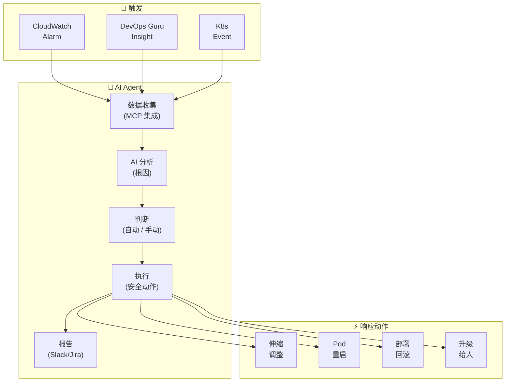
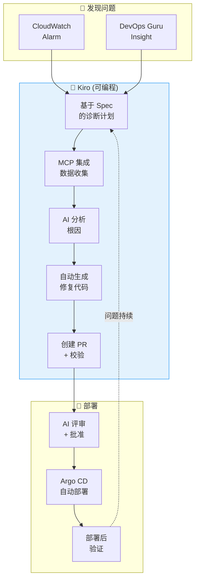
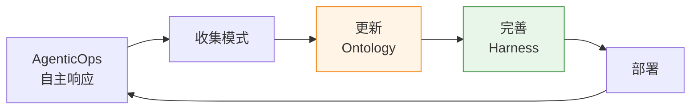

import { ResponsePatterns, ChaosExperiments } from '@site/src/components/PredictiveOpsTables';
import { OperationPatternsComparison, AiopsMaturityModel } from '@site/src/components/AiopsIntroTables';

# 自主响应

> 📅 **撰写日期**: 2026-04-07 | ⏱️ **阅读时间**: 约 12 分钟

---

## 1. 概览

**自主响应 (Autonomous Response)** 是 AI Agent 感知事件、收集并分析上下文后,在预先定义的守护栏内自主执行恢复的运营范式。

### 自主响应的 3 个阶段

```
[检测 (Detection)]
  CloudWatch Alarm · DevOps Guru · K8s Event
         ↓
[决策 (Decision)]
  通过 MCP 收集上下文 → AI 根因分析 → 决定响应方案
         ↓
[执行 (Execution)]
  在安全范围内自动恢复 或 升级
```

### 为什么需要自主响应

- **缩短 MTTR**: 手工响应平均 2 小时 → AI 自主响应平均 5 分钟
- **24/7 无人运营**: 大幅减少夜间 / 周末值守负担
- **一致性**: 消除人的判断偏差,标准化响应
- **学习效应**: 不断学习响应模式以提升准确率

---

## 2. 运维自动化模式: Human-Directed, Programmatically-Executed

AIOps 的核心是 **人定义意图 (Intent) 与守护栏,系统以可编程方式执行**。

### 2.1 三种模式谱系

**Prompt-Driven (Interactive)**
- 每一步由人以自然语言指令
- AI 执行单次任务
- 适用: 探索性调试、新类型故障
- 局限: Human-in-the-Loop、重复场景效率低

**Spec-Driven (Codified)**
- 以 Spec 声明式定义运营场景
- 由系统可编程执行
- 适用: 反复部署、标准化运维流程
- 要点: Spec 定义一次 → 重复执行零成本

**Agent-Driven (Autonomous)**
- AI Agent 检测事件 → 收集上下文 → 自主响应
- Human-on-the-Loop (人只设置守护栏)
- 适用: 事件自动响应、成本优化、预测性伸缩
- 要点: 秒级响应、基于上下文的智能判断

### 2.2 模式对比: EKS Pod CrashLoopBackOff 响应

<OperationPatternsComparison />

:::tip 实战中的模式组合
三种模式不是互斥,而是 **互补**。先用 **Prompt-Driven** 探索 · 分析新故障类型,再把可重复模式以 **Spec-Driven** 代码化,最终自治化为 **Agent-Driven**,这种渐进式成熟过程。
:::

---

## 3. AI Agent 事件响应

### 3.1 传统自动化的局限

基于 EventBridge + Lambda 的自动化属于 **规则驱动**,有以下局限:

```
[传统方式: 基于规则的自动化]
CloudWatch Alarm → EventBridge Rule → Lambda → 固定动作

问题点:
  ✗ "CPU > 80% 则扩容" — 原因可能是内存泄漏
  ✗ "Pod 重启 > 5 则告警" — 不同原因需要不同响应
  ✗ 无法应对复合故障
  ✗ 无法适应新模式
```

### 3.2 基于 AI Agent 的自主响应

<ResponsePatterns />

AI Agent 以 **基于上下文的判断** 自主响应。



### 3.3 Kagent 自动事件响应

**Kagent** 是 Kubernetes 原生 AI Agent,通过 CRD 定义自动响应。

```yaml
# Kagent: 自动事件响应代理
apiVersion: kagent.dev/v1alpha1
kind: Agent
metadata:
  name: incident-responder
  namespace: kagent-system
spec:
  description: "EKS 事件自动响应代理"
  modelConfig:
    provider: bedrock
    model: anthropic.claude-sonnet
    region: ap-northeast-2
  systemPrompt: |
    你是 EKS 事件响应代理。

    ## 响应原则
    1. 安全优先: 危险变更升级给人
    2. 原因优先: 响应根因而非症状
    3. 最小干预: 仅执行所需最小动作
    4. 全部记录: 自动向 Slack 与 JIRA 汇报

    ## 允许自动动作
    - 重启 Pod (CrashLoopBackOff,5 次以上)
    - 调整 HPA min/max (当前值 ±50%)
    - Deployment 回滚 (到上一版本)
    - 节点 drain (MemoryPressure/DiskPressure)

    ## 升级对象
    - 可能造成数据丢失的动作
    - 影响 ≥ 50% replicas
    - StatefulSet 相关变更
    - 网络策略变更

  tools:
    - name: kubectl
      type: kmcp
      config:
        allowedVerbs: ["get", "describe", "logs", "top", "rollout", "scale", "delete"]
        deniedResources: ["secrets", "configmaps"]
    - name: cloudwatch
      type: kmcp
      config:
        actions: ["GetMetricData", "DescribeAlarms", "GetInsight"]
    - name: slack
      type: mcp
      config:
        webhook_url: "${SLACK_WEBHOOK}"
        channel: "#incidents"

  triggers:
    - type: cloudwatch-alarm
      filter:
        severity: ["CRITICAL", "HIGH"]
    - type: kubernetes-event
      filter:
        reason: ["CrashLoopBackOff", "OOMKilled", "FailedScheduling"]
```

### 3.4 Strands Agent SOP: 复合故障响应

**Strands** 是基于 Python 的 OSS Agent 框架,以代码定义 SOP (Standard Operating Procedure)。

```python
# Strands Agent: 复合故障自动响应
from strands import Agent
from strands.tools import eks_tool, cloudwatch_tool, slack_tool, jira_tool

incident_agent = Agent(
    name="complex-incident-handler",
    model="bedrock/anthropic.claude-sonnet",
    tools=[eks_tool, cloudwatch_tool, slack_tool, jira_tool],
    sop="""
    ## 复合故障响应 SOP

    ### Phase 1: 态势掌握 (30 秒内)
    1. 查询 CloudWatch 告警与 DevOps Guru 洞察
    2. 检查相关服务 Pod 状态
    3. 检查节点状态与资源使用率
    4. 检查最近部署历史 (10 分钟内变更)

    ### Phase 2: 根因分析 (2 分钟内)
    1. 从日志中提取错误模式
    2. 指标关联分析 (CPU、Memory、Network、Disk)
    3. 与部署变更的时间关联分析
    4. 检查依赖服务状态

    ### Phase 3: 自动响应
    依原因自动动作:

    **部署相关故障:**
    - 10 分钟内存在部署 → 自动回滚
    - 回滚后状态确认 → 恢复则完成

    **资源不足:**
    - CPU/Memory > 90% → 调整 HPA 或 Karpenter 新增节点
    - Disk > 85% → 清理不必要日志 / 镜像

    **依赖服务故障:**
    - RDS 连接失败 → 检查连接池,需要时重启
    - SQS 延迟 → 检查 DLQ,消费者扩容

    **原因不明:**
    - 升级给人
    - 把收集的全部数据分享到 Slack

    ### Phase 4: 事后处理
    1. 生成事件时间线
    2. 创建 JIRA 事件工单
    3. 在 Slack #incidents 频道发布报告
    4. 保存为学习数据 (反馈循环)
    """
)
```

:::info AI Agent 的核心价值
超越 EventBridge+Lambda,实现基于 AI 上下文的自主响应。将 **多种数据源** (CloudWatch、EKS API、X-Ray、部署历史) 通过 **MCP 统一查询**,分析根因并自动执行恰当动作,可处理规则无法应对的复合故障。
:::

### 3.5 Amazon Q Developer 集成

Amazon Q Developer 以自然语言接口简化运维:

```
[用户问]
"请找出该集群中发生 OOM 的 Pod"

[Amazon Q Developer 回答]
发现的 OOM 事件:
- payment-service-7d8f9c4b-xyz (namespace: payment)
  └─ 最近 1 小时内 OOMKilled 3 次
  └─ memory limits: 512Mi,实际使用: 520Mi
  └─ 建议: 将 memory limits 调至 1Gi

执行的命令:
$ kubectl get events --all-namespaces --field-selector reason=OOMKilled
$ kubectl top pod -n payment payment-service-7d8f9c4b-xyz

是否继续执行以下动作?
1. 自动调整 memory limits (应用 VPA)
2. 启动详细内存剖析
3. 全量分析相关日志
```

---

## 4. 利用 Tribal Knowledge

AI Agent 通过学习团队的 **运营历史 (Tribal Knowledge)** 实现恢复自动化。

### 4.1 过往事件学习

```python
# 学习过往事件响应模式
from strands import Agent

knowledge_base = {
    "incident_patterns": [
        {
            "symptom": "payment-service 500 错误激增",
            "root_cause": "RDS 连接池耗尽",
            "solution": "增大 maxPoolSize 或修复连接泄漏",
            "frequency": 5,
            "last_occurrence": "2026-03-15"
        },
        {
            "symptom": "API Gateway 504 超时",
            "root_cause": "Lambda cold start + VPC ENI 分配延迟",
            "solution": "启用 Provisioned Concurrency",
            "frequency": 3,
            "last_occurrence": "2026-02-20"
        }
    ]
}

# AI Agent 参考过往模式
tribal_agent = Agent(
    name="tribal-knowledge-responder",
    model="bedrock/anthropic.claude-sonnet",
    tools=[eks_tool, knowledge_base_tool],
    sop="""
    ## 基于 Tribal Knowledge 的响应

    1. 分析当前症状
    2. 搜索过往相似模式
    3. 优先应用已验证方案
    4. 若为新模式则探索后更新 Knowledge Base
    """
)
```

### 4.2 知识库自动更新

```yaml
# 事件响应后自动学习
apiVersion: batch/v1
kind: Job
metadata:
  name: update-knowledge-base
spec:
  template:
    spec:
      containers:
        - name: learner
          image: my-registry/incident-learner:latest
          env:
            - name: INCIDENT_ID
              value: "INC-2026-04-07-001"
            - name: KNOWLEDGE_BASE_S3
              value: "s3://my-bucket/tribal-knowledge.json"
```

---

## 5. Kiro 可编程调试

### 5.1 指挥式 vs 可编程响应对比

```
[指挥式响应] — 手工、反复、成本高
━━━━━━━━━━━━━━━━━━━━━━━━━━━━━━━━━━━━━━━━━━
  运维: "payment-service 500 错误"
  AI:   "在哪个 Pod 发生?"
  运维: "payment-xxx Pod"
  AI:   "给我看日志"
  运维: (执行 kubectl logs 后复制粘贴)
  AI:   "像是 DB 连接错误,请检查 RDS 状态"
  ...反复...

  总耗时: 15-30 分钟,手工动作多

[可编程响应] — 自动、体系、成本高效
━━━━━━━━━━━━━━━━━━━━━━━━━━━━━━━━━━━━━━━━━━
  告警: "payment-service 500 错误"

  Kiro Spec:
    1. 通过 EKS MCP 查询 Pod 状态
    2. 收集并分析错误日志
    3. 检查相关 AWS 服务 (RDS、SQS) 状态
    4. 根因诊断
    5. 自动生成修复代码
    6. 创建 PR 并校验

  总耗时: 2-5 分钟,自动化
```

### 5.2 Kiro + MCP 调试工作流



### 5.3 具体场景: OOMKilled 自动响应

```
[Kiro 可编程调试: OOMKilled]

1. 检测: payment-service Pod OOMKilled 事件

2. 执行 Kiro Spec:
   → EKS MCP: get_events(namespace="payment", reason="OOMKilled")
   → EKS MCP: get_pod_logs(pod="payment-xxx", previous=true)
   → CloudWatch MCP: query_metrics("pod_memory_utilization", last="1h")

3. AI 分析:
   "payment-service 从启动后每 2 小时内存使用量增长 256Mi,
    检测到内存泄漏模式。日志显示 Redis 连接未正确关闭。"

4. 自动修复:
   - memory limits 256Mi → 512Mi (临时)
   - 生成修复 Redis 连接池的代码补丁
   - 追加内存剖析配置

5. 创建 PR:
   Title: "fix: payment-service Redis connection leak"
   - deployment.yaml: 调整 memory limits
   - redis_client.go: 增加 defer conn.Close()
   - monitoring: 添加内存使用看板
```

:::tip 可编程调试的核心
通过 Kiro + EKS MCP 可 **以可编程方式分析并解决** 问题。相较指挥式的手工响应,**成本高效且自动化**,在同类问题反复时还能复用已学 Spec。
:::

---

## 6. Chaos Engineering + AI

### 6.1 AWS FIS EKS 动作类型

AWS Fault Injection Service (FIS) 提供面向 EKS 的故障注入动作:

<ChaosExperiments />

### 6.2 基于 AI 的故障模式学习

AI 学习 Chaos Engineering 实验结果以提升应对能力。

```python
# FIS 实验后收集 AI 学习数据
from strands import Agent

chaos_analyzer = Agent(
    name="chaos-pattern-analyzer",
    model="bedrock/anthropic.claude-sonnet",
    sop="""
    ## Chaos Engineering 结果分析

    1. 收集 FIS 实验结果
       - 注入的故障类型
       - 系统反应时间
       - 恢复时间
       - 影响范围

    2. 模式分析
       - 绘制故障传播路径
       - 识别脆弱点
       - 定位恢复瓶颈

    3. 更新响应规则
       - 为已有 SOP 追加学习内容
       - 为新模式创建响应规则
       - 调整升级阈值

    4. 生成报告
       - 实验摘要
       - 发现的脆弱点
       - 改进建议
    """
)
```

### 6.3 FIS 实验示例: 保护 SLO 的 Pod 删除

```json
{
  "description": "EKS Pod 故障注入 with SLO 保护",
  "targets": {
    "eks-payment-pods": {
      "resourceType": "aws:eks:pod",
      "selectionMode": "COUNT(2)",
      "resourceTags": {
        "app": "payment-service"
      },
      "parameters": {
        "clusterIdentifier": "my-cluster",
        "namespace": "payment"
      }
    }
  },
  "actions": {
    "delete-pod-safely": {
      "actionId": "aws:eks:pod-delete",
      "parameters": {
        "kubernetesServiceAccount": "fis-experiment-role",
        "maxPodsToDelete": "2",
        "podDeletionMode": "one-at-a-time"
      },
      "targets": {
        "Pods": "eks-payment-pods"
      }
    }
  },
  "stopConditions": [
    {
      "source": "aws:cloudwatch:alarm",
      "value": "arn:aws:cloudwatch:ap-northeast-2:ACCOUNT_ID:alarm:PaymentService-ErrorRate-SLO"
    },
    {
      "source": "aws:cloudwatch:alarm",
      "value": "arn:aws:cloudwatch:ap-northeast-2:ACCOUNT_ID:alarm:PaymentService-Latency-P99-SLO"
    }
  ]
}
```

**安全措施**:
- 遵守 **PodDisruptionBudget**: 保证最低可用性
- **stopConditions**: 违反 SLO 则自动中止
- **渐进扩大**: 1 个 → 10% → 25% 分阶段

:::tip Chaos Engineering + AI 反馈循环
以 FIS 注入故障,AI 学习系统反应,AI Agent 的自动响应能力会持续提升。"注入 → 观测 → 学习 → 改进响应" 的反馈循环是自治运营的核心。
:::

---

## 7. 反馈循环 — 从运维到 Ontology

### 7.1 Outer Loop: 运维 → Ontology

把自主响应过程中学到的模式反馈到 **Ontology** 持续改进。

```
[Inner Loop: 实时事件响应]
  检测 → 分析 → 恢复 (秒 ~ 分)

[Outer Loop: Ontology 反馈]
  运维模式 → 更新 Ontology → 完善 Harness (日 ~ 周)
```

**反馈项**:

| 项 | 采集数据 | 在 Ontology 的反映 |
|----|----------|--------------------|
| **故障模式** | 根因、症状、恢复方法 | 追加新响应规则 |
| **恢复时间** | MTTR、自动 / 手动响应比例 | 调整自动化优先级 |
| **脆弱点** | 反复故障的服务 / 组件 | 架构改进建议 |
| **响应准确度** | AI 判断准确率、升级率 | 模型再训练、阈值调整 |

### 7.2 AgenticOps → AIDLC 循环



**实战示例**:

```yaml
# Ontology 反馈自动化
apiVersion: batch/v1
kind: CronJob
metadata:
  name: ontology-feedback
spec:
  schedule: "0 2 * * 0"  # 每周日 02:00
  jobTemplate:
    spec:
      template:
        spec:
          containers:
            - name: feedback-collector
              image: my-registry/ontology-feedback:latest
              env:
                - name: INCIDENT_DB
                  value: "dynamodb://incidents-table"
                - name: ONTOLOGY_REPO
                  value: "git://ontology-repo.git"
                - name: FEEDBACK_THRESHOLD
                  value: "5"  # 重复 5 次以上则加入 Ontology
```

**详情**: [Ontology 工程](../methodology/ontology-engineering.md)、[Harness 工程](../methodology/harness-engineering.md)

---

## 8. AIOps 成熟度模型

<AiopsMaturityModel />

### 成熟度等级与自主响应

| 等级 | 自主响应水平 | 实现方式 |
|------|--------------|----------|
| **Level 0** | 手工响应 | 人直接执行 kubectl |
| **Level 1** | 基于告警 | CloudWatch Alarm → 呼叫人 |
| **Level 2** | 反应式自动化 | EventBridge → Lambda → 固定脚本 |
| **Level 3** | 预测式自动化 | ML 预测 + 先发制人 |
| **Level 4** | 自主运维 | AI Agent 基于上下文自主响应 |

:::warning 建议分阶段引入
不要试图从 Level 0 一跃到 Level 4。在每一层积累足够运营经验与数据后再迈入下一层,成功率更高。尤其 Level 3 → Level 4 的过渡,核心是 **验证 AI 自主恢复的安全性**。
:::

---

## 9. 总结

### 核心要点

1. **运维自动化模式**: Prompt-Driven → Spec-Driven → Agent-Driven 渐进转型
2. **AI Agent 框架**: Kagent (K8s Native)、Strands (Python OSS)、Q Developer (AWS 托管)
3. **Tribal Knowledge**: 借过去事件学习实现响应自动化
4. **Kiro 可编程调试**: 基于 MCP 的自动诊断 · 修复 · 创建 PR
5. **Chaos Engineering + AI**: FIS 实验 → AI 学习 → 响应能力提升
6. **Outer Loop 反馈**: 运维模式 → 更新 Ontology → 完善 Harness

### 下一步

| 步 | 行动 | 参考文档 |
|----|------|----------|
| 1 | 构建可观测性栈 | [可观测性栈](./observability-stack.md) |
| 2 | 引入 ML 预测伸缩 | [预测运维](./predictive-operations.md) |
| 3 | 部署 Kagent/Strands Agent | 本文 §3 |
| 4 | 进行 Chaos Engineering 实验 | 本文 §6 |
| 5 | 构建 Ontology 反馈循环 | [Ontology 工程](../methodology/ontology-engineering.md) |

### 参考资料

- [Kagent - Kubernetes AI Agent](https://github.com/kagent-dev/kagent)
- [Strands Agents SDK](https://github.com/strands-agents/sdk-python)
- [AWS Fault Injection Service](https://docs.aws.amazon.com/fis/latest/userguide/what-is.html)
- [Amazon Q Developer for Operations](https://aws.amazon.com/q/developer/operate/)
- [Kiro IDE](https://kiro.dev/)
