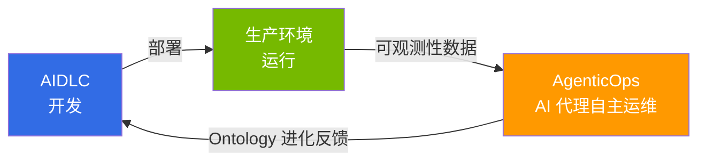

tags: [aidlc, operations, 'scope:ops']
---
title: "AgenticOps"
sidebar_label: "AgenticOps"
description: "AIDLC 所构建软件的基于 AI 代理的自主运维 — 可观测性、预测、自动响应"
last_update:
  date: 2026-04-18
  author: devfloor9
---

# AgenticOps: 基于 AI 代理的自主运维

> **阅读时间**: 约 2 分钟

AgenticOps 是在使用 [AIDLC](/docs/aidlc/methodology) 构建软件之后,**在真实生产环境中通过 AI 代理自主构建持续改进反馈循环的方法**。如果说传统 AIOps 将 AI 用作监控辅助工具,那么 AgenticOps 则由 AI 代理基于可观测性数据自主执行 **检测 → 判断 → 行动** 的全过程。

## 与 AIDLC 的关系

AIDLC 关注 **"如何构建"** (开发方法论),而 AgenticOps 关注 **"如何运维和改进"** (运维反馈循环)。AIDLC 中 [Ontology](/docs/aidlc/methodology/ontology-engineering) 定义的领域约束会被 AgenticOps 的 AI 代理用作运维判断的标准,而运维中发现的洞察则会反馈回 Ontology 进化的 Outer Loop。

## 组成

按 **1 → 2 → 3** 的顺序阅读,即可完整走过从数据基础构建到自主运维落地的整段旅程。

| 顺序 | 文档 | 核心问题 |
|------|------|----------|
| 1 | [可观测性栈](./observability-stack.md) | 如何采集与分析运维数据? |
| 2 | [预测运维](./predictive-operations.md) | 如何提前预测并预防故障? |
| 3 | [自主响应](./autonomous-response.md) | AI 代理如何自主应对? |

## 核心基础: AWS 开源战略

AWS 将 Kubernetes 生态的核心工具以 Managed Add-on (22+)、托管开源服务 (AMP、AMG、ADOT) 的形式提供。在此基础之上,**Kiro + MCP (Model Context Protocol)** 作为 AgenticOps 的核心工具运行,通过 AWS MCP 服务器 (50+ GA) 自主执行 EKS 集群控制、CloudWatch 指标分析、成本优化。

## 参考资料

- [Proactive EKS Monitoring with CloudWatch](https://aws.amazon.com/blogs/containers/proactive-amazon-eks-monitoring-with-amazon-cloudwatch-operator-and-aws-control-plane-metrics/)
- [AWS MCP Servers (50+ GA)](https://github.com/awslabs/mcp)
- [Kagent - Kubernetes AI Agent](https://github.com/kagent-dev/kagent)
- [Strands Agents SDK](https://github.com/strands-agents/sdk-python)
