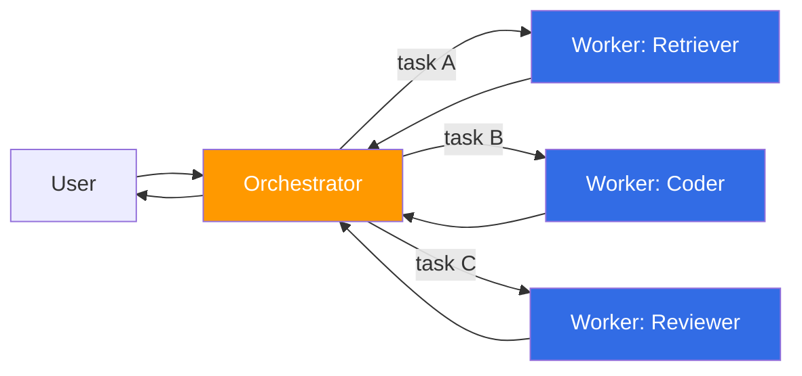
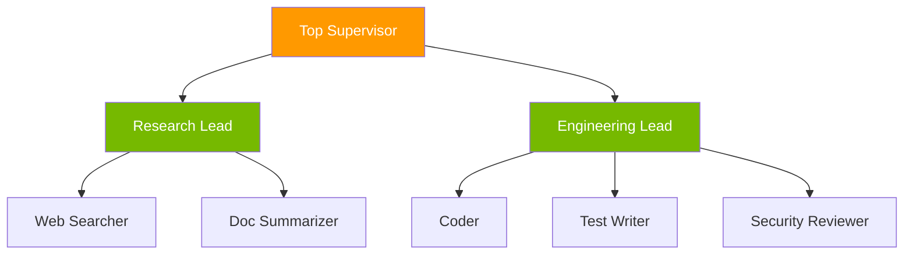
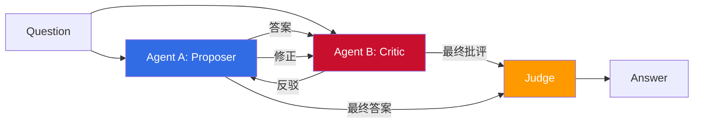
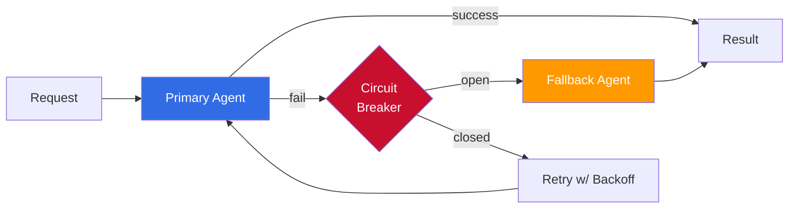
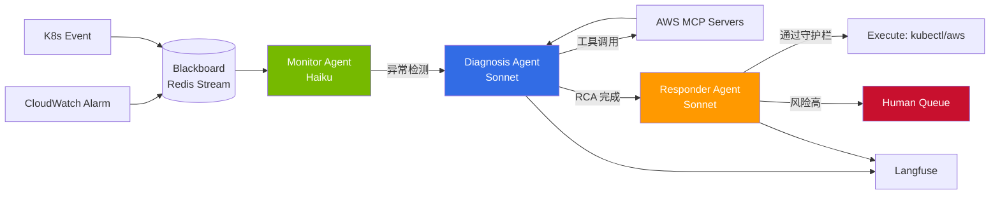

# Multi-Agent Collaboration Patterns

> 📅 **撰写日期**: 2026-04-18 | ⏱️ **阅读时间**: 约 15 分钟

---

## 1. 为什么要多代理

单个 LLM 代理在领域变宽、工具变复杂时会快速暴露局限。运行环境中常见的典型局限:

- **上下文窗口饱和**: Claude Opus 4.7 的 1M token 在大型 monorepo、长期会话中也会迅速耗尽,关键上下文因摘要而丢失。
- **Tool Sprawl**: 在单个代理上挂 20+ MCP 工具时,tool-choice 准确度急剧下降 (见 Anthropic 2024 "Building effective agents")。
- **专业性范围受限**: 代码评审 · SQL 编写 · 安全分析,其系统提示与 few-shot 组合差异大,单一提示难以同时满足。
- **成本-准确度取舍**: 全部子任务都用 Opus 级模型成本飙升,只用 Haiku 级在复杂推理上失败率高。

多代理系统通过 **角色分解 (role decomposition)**、**专属上下文 (scoped context)**、**并行执行 (parallel execution)** 解决这些问题。与此同时必须显式管理以下 **副作用**:

| 副作用 | 原因 | 缓解 |
|--------|------|------|
| 通信成本 | 代理间消息序列化、反复重新总结 | 结构化 shared state、仅传递 handoff 必要字段 |
| 合议延迟 | Voting/Debate 循环多轮 | 设置回合上限、timebox、早期终止 |
| Token 成本激增 | N 代理 × 平均 token × 回合数 | 条件性 escalation、模型分层 (Haiku → Sonnet → Opus) |
| 失败传播 | 一个代理失败导致全链中断 | 熔断器、fallback agent、允许部分结果 |
| 观测复杂度 | 嵌套 trace、根因追踪困难 | Langfuse/OTel 层级、强制 `agent_name` span tag |

:::tip 决策准则
仅当子任务 **(a) 角色明显可分** 或 **(b) 可独立并行执行** 时才引入多代理。线性管线几乎总是用单代理 + tool-use 更便宜。
:::

---

## 2. 核心协作模式

整理 6 个在实务中反复出现的模式。多数系统是其中 2-3 个的混合。

### 2.1 Orchestrator-Worker (Router 模式)

Orchestrator 代理接收用户请求,拆分为 sub-task 后交给专家 Worker。收集 Worker 结果并合成最终回复。



- **代表实现**: LangGraph Supervisor、Strands Agents Graph、OpenAI Agents SDK Handoff
- **适用**: 领域可明确分类 (SQL / 代码 / 检索)、Worker 池固定
- **注意**: Orchestrator 易成瓶颈。可并行的 sub-task 用 `asyncio.gather` 等 fan-out

### 2.2 Hierarchical Supervisor (Manager-Team)

将 Orchestrator-Worker 扩展为多层。顶层 Supervisor 委派给多位 Team Lead,各 Team Lead 管理其 Specialist。



- **代表实现**: LangGraph Multi-Agent Supervisor、CrewAI `Crew(process=Process.hierarchical, manager_agent=...)`
- **适用**: 需 3 级以上决策深度的大型任务 (如整个服务重构、企业级文档自动生成)
- **注意**: 层级越深延迟 / 成本越高。建议不超过 2-3 层

### 2.3 Voting / Ensemble

把同一问题独立发给 N 个代理 (或模型),再以多数决或加权平均得出结论。

- **技术**: Self-consistency、Mixture-of-Agents (MoA)、majority voting、weighted ensemble
- **适用**: 数学题、分类任务、幻觉风险大的 RAG 答复校验
- **成本**: 恰好 N 倍。常有报告显示 Haiku × 5 集成的准确度胜过 Opus × 1
- **实现贴士**: 给各代理设不同 temperature 或不同提示模板以保证多样性

### 2.4 Debate / Adversarial

两个代理相互批评 / 反驳数轮,最终由第三方 judge 代理选定结论。



- **适用**: 复杂推理、代码缺陷搜索、政策 · 伦理判断
- **效果**: Society of Minds、Multi-Agent Debate 等论文报告相较单代理准确率上升
- **局限**: 每回合 token 成本累积。一般设 2-3 轮 + Judge 为上限

### 2.5 Plan-and-Execute

Planner 代理先制定整体执行计划,Executor 代理按步执行。必要时 Re-Planner 根据中间结果修正计划。

- **代表实现**: LangChain Plan-and-Execute、OpenAI Deep Research (Planner + Browser + Writer)、Claude Code 的 TodoWrite + executor 模式
- **适用**: 长时任务 (研究报告、大规模重构、多步数据管道)
- **要点**: 规划用高性能模型 (Opus、GPT-5 Reasoning),执行用中低价模型,以兼顾成本与性能

### 2.6 Blackboard / Shared Memory

所有代理将观察与中间结果写入中央存储 (blackboard)。各代理在发现与自身专长相关的任务时自主贡献。

- **存储**: Redis、Postgres (LangGraph checkpointer)、DynamoDB 或文件系统
- **适用**: 长期会话 (数小时以上)、异步协作、代理频繁加入 / 退出
- **注意**: 竞态 — 用乐观锁、版本号或事件溯源保证一致性

---

## 3. 实现框架对比 (截至 2026-04)

| 框架 | 主要抽象 | 语言 | 主要模式 | 许可 |
|------|----------|------|----------|------|
| **LangGraph** | StateGraph + Node | Python/JS | Supervisor、Swarm、Conditional routing | MIT |
| **CrewAI** | Crew + Agent + Task | Python | Sequential / Hierarchical / Consensus | MIT |
| **AutoGen (v0.4+)** | ConversableAgent + GroupChat | Python | Conversation + Workflow | Apache 2.0 |
| **Strands Agents SDK** | Agent + Graph (Python) | Python | Orchestrator、Handoff | Apache 2.0 |
| **OpenAI Agents SDK** | Agent + Handoff | Python/TS | Orchestrator-Worker、Handoff | Apache 2.0 |
| **Amazon Bedrock AgentCore** | Agent + Action Group | AWS SDK | Managed、MCP native | AWS managed |

### 3.1 LangGraph

基于 StateGraph 以图形式定义节点间状态转移。用 `create_react_agent`、`create_supervisor`、swarm 辅助可在 10-50 行内实现大部分模式。通过 LangGraph Platform (付费) 或 self-host 部署,支持 Postgres/Redis checkpointer 以便长任务恢复。

### 3.2 CrewAI

以自然语言声明表达基于角色的协作。提供 `Process.sequential`、`Process.hierarchical`、`Process.consensual` 三种模式,可用 `manager_agent` 构造层级监督。实务中"role / goal / backstory" 的清晰定义决定质量。

### 3.3 AutoGen (v0.4+)

微软研究院框架,v0.4 基于 actor-model 重新设计。用 `GroupChat`、`SelectorGroupChat`、`MagenticOne` 等构造对话式多代理,对代码执行环境 (Docker、Jupyter) 的集成是其优势。

### 3.4 Strands Agents SDK

AWS 于 2025 年公开的开源 SDK,与 Bedrock 紧密集成,也支持直调 OpenAI/Anthropic。`Agent` + `Graph` 抽象类似 LangGraph,MCP 工具为一级公民 (first-class)。Strands Handoff 与 OpenAI Agents SDK 的 handoff 设计思路相近。

### 3.5 OpenAI Agents SDK

OpenAI 于 2025 年 3 月作为 Swarm 后续发布的 GA 级 SDK。`Agent`、`Runner`、`handoff`、`guardrail` 四个原语能组合出几乎所有模式。Tracing 与 OpenAI Dashboard 集成,可观测性搭建迅速。

### 3.6 Amazon Bedrock AgentCore

在 Agents for Bedrock 之上以托管方式提供 Action Group、Knowledge Base、Guardrails、Memory。原生支持 MCP,外部工具集成便捷,并可在 IAM · VPC 边界内执行多代理,适合监管行业。

:::tip 框架选择指南
- **快速原型**: CrewAI 或 OpenAI Agents SDK
- **复杂状态转移 · 恢复**: LangGraph + Postgres checkpointer
- **AWS 生态**: Strands Agents SDK 或 Bedrock AgentCore
- **研究 · 实验**: AutoGen v0.4 (易探索多种对话模式)
:::

### 3.7 最小实现示例: Supervisor 模式

```python
# LangGraph — Supervisor 路由到 Researcher/Coder 之一
from langgraph.graph import StateGraph, END
from langgraph.prebuilt import create_react_agent
from langchain_anthropic import ChatAnthropic

llm = ChatAnthropic(model="claude-sonnet-4-5")
researcher = create_react_agent(llm, tools=[web_search], name="researcher")
coder = create_react_agent(llm, tools=[execute_python], name="coder")

def supervisor(state):
    decision = llm.invoke([
        {"role": "system", "content": "Route to 'researcher' or 'coder'. Reply with one word."},
        {"role": "user", "content": state["input"]},
    ]).content.strip().lower()
    return {"next": decision}

graph = StateGraph(dict)
graph.add_node("supervisor", supervisor)
graph.add_node("researcher", researcher)
graph.add_node("coder", coder)
graph.set_entry_point("supervisor")
graph.add_conditional_edges("supervisor", lambda s: s["next"],
                             {"researcher": "researcher", "coder": "coder"})
graph.add_edge("researcher", END)
graph.add_edge("coder", END)
app = graph.compile()
```

```python
# CrewAI — Hierarchical Crew
from crewai import Agent, Task, Crew, Process

manager = Agent(role="Engineering Manager",
                goal="分派、审查、最终批准",
                backstory="10 年平台负责人")
coder = Agent(role="Coder", goal="功能实现", backstory="...")
reviewer = Agent(role="Reviewer", goal="代码评审", backstory="...")

crew = Crew(agents=[coder, reviewer],
            tasks=[Task(description="实现鉴权端点", agent=coder),
                   Task(description="评审并反馈", agent=reviewer)],
            manager_agent=manager,
            process=Process.hierarchical)
result = crew.kickoff()
```

```python
# OpenAI Agents SDK — Handoff
from agents import Agent, Runner, handoff

triage = Agent(
    name="Triage",
    instructions="将问题分类并交给合适的代理。",
    handoffs=[
        handoff(Agent(name="BillingBot", instructions="账单咨询")),
        handoff(Agent(name="TechBot", instructions="技术咨询")),
    ],
)
result = await Runner.run(triage, input="发票被重复开具了。")
```

---

## 4. 状态共享 · 冲突解决 · 失败恢复

### 4.1 状态共享模型

| 模型 | 说明 | 代表实现 |
|------|------|----------|
| Shared Memory | 所有代理读写中央存储 | LangGraph `StateGraph`、Redis/Postgres |
| Message Passing | 代理仅通过消息队列通信 | AutoGen GroupChat、AWS SQS |
| Blackboard | 事件溯源 + 订阅 | Kafka、EventBridge |
| Handoff Context | 调用时传递上下文,其后分离 | OpenAI Agents SDK、Strands Handoff |

实务中最常见是 **Shared Memory + Handoff Context** 组合。把公共状态 (用户请求、累计结果) 放入 shared state,代理专属指令放入 handoff payload。

### 4.2 冲突解决策略

- **Voting**: 多数决或加权平均。平局时指定 tiebreaker 代理
- **Referee Agent**: Debate 模式由 judge 做最终决定
- **Deterministic Winner Rule**: 如 "安全评审拒绝则一律返工" 的硬规则
- **优先级队列**: 若紧急任务进行中,其他代理等待

### 4.3 失败恢复



- **Retry Budget**: 每个代理最大重试次数与 token 预算。超出后升级至上层
- **Per-Agent Circuit Breaker**: 连续失败率超阈值时暂时熔断
- **Fallback Agent**: 使用更简单提示 + 廉价模型绕行。牺牲质量换可用性
- **Checkpointer 恢复**: LangGraph/Strands 的 checkpoint 可从中间状态恢复 (长任务必备)

---

## 5. 可观测性 (Langfuse + OpenTelemetry)

多代理系统的 trace 自然呈层级结构。在 Langfuse/OTel 中正确表达后,调试与性能分析会极大简化。

### 5.1 Trace 层级设计

```
Trace: user-request-<uuid>
└── Span: orchestrator.plan
    ├── Span: worker.retriever
    │   ├── Span: tool.vector_search
    │   └── Span: llm.claude-opus-4-7
    ├── Span: worker.coder
    │   └── Span: llm.sonnet-4-5
    └── Span: judge.reviewer
        └── Span: llm.opus-4-7
```

### 5.2 必备 Span 属性

在各 span 上一致打上以下属性,将成为运营时过滤 · 告警的基础。

- `agent.name`: 代理标识 (如 `retriever`、`coder`、`judge`)
- `agent.role`: 角色 (如 `worker`、`supervisor`、`critic`)
- `agent.model`: 使用模型 (如 `claude-opus-4-7`、`gpt-5-reasoning`)
- `handoff.reason`: 交接原因 (转交他代理时)
- `handoff.from` / `handoff.to`
- `round.index`: Voting/Debate 回合号
- `tokens.input` / `tokens.output` / `cost.usd`

### 5.3 Langfuse 看板示例

- **按代理 p95 延迟**: 按 `agent.name` 分组识别瓶颈
- **Handoff 热力图**: `handoff.from` × `handoff.to` 矩阵
- **按回合成本**: 验证 Debate/Voting 的成本收敛
- **失败率**: 按 `agent.name` 汇总 `status=error` span

:::tip OpenTelemetry 联动
Langfuse v3.x 作为 OTel 原生收集器工作。若应用使用 W3C `traceparent`,可与 AWS X-Ray、Datadog、Grafana Tempo 打通同一 trace。
:::

---

## 6. 成本 · 延迟模式

### 6.1 成本增长因素

- **代理数 N**: 成本线性于 N。Voting 恰好 N 倍
- **回合数 R**: Debate 2-3 轮约 2~3 倍成本
- **上下文累积**: 轮次增加使上一轮响应堆入上下文,输入 token 成本非线性增长
- **工具调用链**: tool-use 响应也会再进入 LLM 产生成本

### 6.2 成本优化清单

| 项 | 技巧 |
|----|------|
| 模型分层 | Planner=Opus、Worker=Sonnet、Summarizer=Haiku |
| Prompt 缓存 | Claude/OpenAI prompt caching 复用系统提示 |
| 条件性 escalation | 简单任务用 Haiku 起步,置信度低则升级 |
| 并行执行 | 用 `asyncio.gather`/`Promise.all` 缩短延迟 |
| 中间结果摘要 | 定期总结长对话历史,压缩上下文 |
| 提前终止 | Voting 过半即取消其余 |

### 6.3 延迟优化

- **流式 handoff**: 从首 token 起下一个代理开始处理 (speculative execution)
- **Fan-out + first-wins**: 同时请求 N 代理,用最先到达的可信回复
- **Prewarming**: 常用代理保持 idle (session 缓存)

---

## 7. AIDLC 各阶段应用

AIDLC 各阶段如何应用多代理模式。

### 7.1 Inception (构想 · 规划)

- **Planner Agent**: 将模糊需求转化为结构化 backlog
- **Critic Agent**: 对 Planner 产物做批判性检查,发现遗漏 · 矛盾
- 组合: Plan-and-Execute + Debate 混合

### 7.2 Construction (开发 · 校验)

- **Coder Agent**: 功能实现 (Sonnet)
- **Reviewer Agent**: 代码评审 (Opus,可拆分安全 / 质量)
- **Test Writer Agent**: 生成并执行测试
- 组合: Orchestrator-Worker、Hierarchical Supervisor

### 7.3 Operations (AgenticOps)

- **Monitor Agent**: 持续分析可观测数据 (Haiku)
- **Diagnosis Agent**: 发现异常时做根因分析 (Sonnet)
- **Responder Agent**: 在预设守护栏内自动恢复 (Sonnet/Opus)
- **Human Escalation Agent**: 风险变更路由到审批队列
- 组合: 详见 [自主响应](./autonomous-response.md)。Blackboard + Orchestrator-Worker

:::tip 贯穿 AIDLC 的共同原则
- 将各阶段代理输出映射到 [Ontology](/docs/aidlc/methodology/ontology-engineering) 以统一词汇
- 阶段间交接以 artifact (PRD、ADR、RCA 文档) 为介质 — 代理会话终止也不丢上下文
:::

---

## 8. 案例研究: AgenticOps 自主响应流水线

将多代理模式用于实际 EKS 事件响应的示例。以代理实现 [自主响应](./autonomous-response.md) 的三阶段 (检测 → 判断 → 执行)。

### 8.1 架构



### 8.2 角色与模型分层

| 代理 | 模型 | 平均调用 / 时 | 月度估算成本 |
|------|------|--------------|--------------|
| Monitor | claude-haiku-4-5 | 3,600 | ~$20 |
| Diagnosis | claude-sonnet-4-5 | 50 | ~$30 |
| Responder | claude-sonnet-4-5 + Opus 升级 | 30 | ~$40 |
| Judge (审批风险动作) | claude-opus-4-7 | 5 | ~$15 |

若 Monitor 用 Opus 月成本会飙到 $1,000+。仅分层即可节省 95%。

### 8.3 Handoff 契约 (Handoff Contract)

各代理间传递的 payload 用 JSON Schema 严格定义。

```json
{
  "incident_id": "inc-20260418-0042",
  "from_agent": "diagnosis",
  "to_agent": "responder",
  "severity": "P2",
  "root_cause": "Pod OOMKilled — memory limit 512Mi, actual peak 780Mi",
  "evidence": {
    "metrics": ["container_memory_working_set_bytes"],
    "logs": ["OOMKilled at 2026-04-18T10:32:15Z"],
    "affected_resources": ["deploy/api-gateway", "ns/prod"]
  },
  "proposed_action": {
    "type": "patch_deployment",
    "changes": {"spec.template.spec.containers[0].resources.limits.memory": "1Gi"}
  },
  "risk_level": "low",
  "requires_human_approval": false
}
```

该 schema 与 [Ontology](/docs/aidlc/methodology/ontology-engineering) 的 `Incident`、`Resource`、`Action` 实体 1:1 映射,保障代理间词汇一致。

### 8.4 结果 (3 个月运营)

- **MTTR**: 112 分钟 → 6 分钟 (下降 95%)
- **自主解决比**: 68%
- **升级到人**: 32% (风险高 + 新模式)
- **误报**: < 3% (守护栏 + Judge 组合的效果)

---

## 9. 反模式: 从失败学习

### 9.1 God Agent

把所有工具 / 知识塞进单个代理。最初省事,工具超过 15 个时 tool-choice 准确度急降。

- **征兆**: 系统提示超 2,000 token、工具 ≥ 20
- **解决**: 按领域拆分代理 + 引入 Orchestrator-Worker

### 9.2 无限 Handoff 循环

A → B → A → B → ... 乒乓。每个代理都以为不属于自己,互相推卸。

- **征兆**: 同一 trace 中同一 handoff 组合重复 ≥ 3 次
- **解决**: 设 hop 上限,检测到循环时升级

### 9.3 无合议的 Voting

偶数代理 Voting → 平局 → 无法处理。

- **解决**: 奇数代理,或单独指定 tiebreaker 代理

### 9.4 共享状态竞态

两个代理同时更新同一 blackboard 字段,一方结果丢失。

- **解决**: 乐观锁 (版本号)、CRDT 或事件溯源

### 9.5 观测空白

代理内 LLM 调用会进 trace,但代理间 handoff 被拆到不同 trace,无法追因。

- **解决**: 传递 `traceparent`,所有代理在同一 root trace 下加 span

### 9.6 Prompt Injection 传播

用户输入含注入,经一个代理原样传给下个代理被当作系统指令。

- **解决**: 在 Gateway 层净化输入,代理间 handoff payload 仅走 user/tool 角色而非 system

---

## 10. 运营最佳实践清单

多代理系统上线前的检查项。

- [ ] **角色边界清晰**: 在系统提示中明示每个代理的职责与 "不做的事"
- [ ] **Handoff 条件文档化**: 以决策树记录什么情况下交给谁
- [ ] **Guardrails 公共层**: 在 gateway 层实现 PII 掩码、提示注入防御、输出 schema 校验,而非各代理
- [ ] **成本 · 延迟上限**: 设请求最大 token、最大轮数、最大执行时间硬限
- [ ] **观测属性标准化**: 所有 span 强制有 `agent.name`、`agent.role`、`handoff.reason`
- [ ] **定义失败路径**: 代理失败时给用户展示什么 (部分结果 / 错误 / 重试引导)
- [ ] **模型版本锁定**: 通过 pinned version + canary 发布防模型更新带来的回归
- [ ] **测试套件**: 单代理独立测试 + 系统 E2E 测试 (LangSmith、Langfuse experiments)
- [ ] **Human-on-the-Loop 入口**: 自主执行期间也能介入的取消 · 修正 API
- [ ] **审计日志不可变**: 所有代理决策依据 (prompt + response + tool call) 存到 write-once 存储

---

## 11. 参考资料

### 框架官方文档

- [LangGraph](https://langchain-ai.github.io/langgraph/) — StateGraph、Supervisor、Swarm 教程
- [CrewAI](https://docs.crewai.com/) — Sequential/Hierarchical 流程指南
- [AutoGen](https://microsoft.github.io/autogen/) — v0.4 actor model、GroupChat
- [Strands Agents SDK](https://github.com/strands-agents/sdk-python) — AWS 开源 SDK
- [OpenAI Agents SDK](https://openai.github.io/openai-agents-python/) — Handoff、Guardrails
- [Amazon Bedrock Agents](https://docs.aws.amazon.com/bedrock/latest/userguide/agents.html) — Action Group、Knowledge Base

### 论文 · 博客

- Anthropic, ["Building effective agents"](https://www.anthropic.com/research/building-effective-agents) (2024) — 模式原典
- OpenAI, ["Introducing Deep Research"](https://openai.com/index/introducing-deep-research/) (2025) — Plan-and-Execute 案例
- OpenAI, ["Swarm: experimental framework"](https://github.com/openai/swarm) (2024) — Agents SDK 前身
- Du et al., ["Improving Factuality and Reasoning in Language Models through Multiagent Debate"](https://arxiv.org/abs/2305.14325) (2023)
- Wang et al., ["Mixture-of-Agents Enhances Large Language Model Capabilities"](https://arxiv.org/abs/2406.04692) (2024)

### 相关文档

- [自主响应](./autonomous-response.md) — AgenticOps 的 Agent-Driven 实战
- [可观测性栈](./observability-stack.md) — Langfuse + OTel 详解
- [Ontology 工程](/docs/aidlc/methodology/ontology-engineering) — 代理公共词汇
