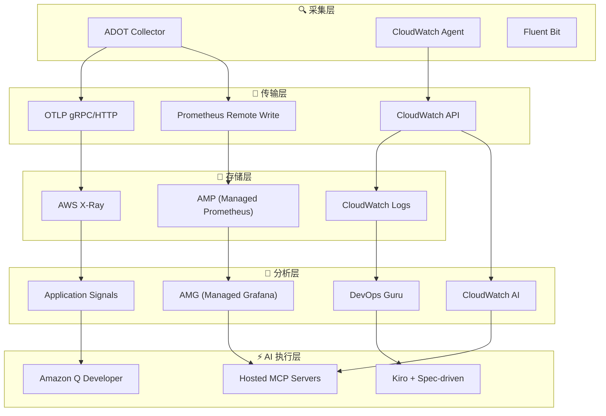
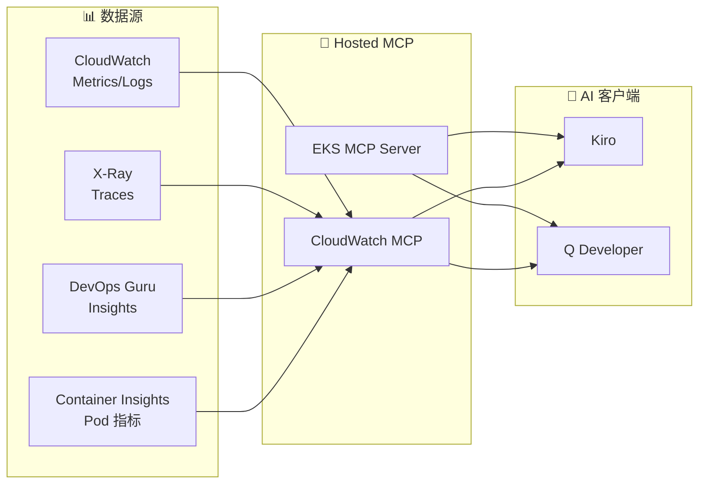
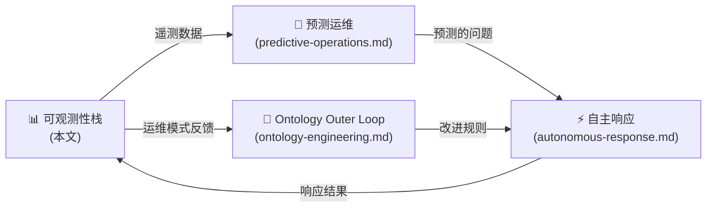

import { ObservabilityPillars, ArchitectureLayers, StackSelectionPatterns } from '@site/src/components/ObservabilityStackTables';

# 可观测性栈

> **AIDLC Operations 的数据基础** — 用 3-Pillar 遥测 + AI 分析层构建运维智能

---

## 1. 概览

### 1.1 可观测性为何是 AgenticOps 的数据基础

**可观测性 (Observability)** 指通过外部输出 (指标 · 日志 · Trace) 理解系统内部状态的能力。在 EKS 环境中,数百个 Pod、复杂服务网格、动态伸缩交织后,传统监控难以定位根因。

**AgenticOps 语境下的可观测性作用**:

- **[预测运维](./predictive-operations.md)**: 学习历史遥测模式 → 预测未来问题
- **[自主响应](./autonomous-response.md)**: 基于实时指标的自动伸缩与自愈
- **[Ontology 工程](../methodology/ontology-engineering.md) Outer Loop**: 把运维数据回馈以持续改进 Ontology

:::tip AIDLC 可信性双轴
可观测性栈扮演 **AIDLC 可信性的 Harness** 角色。Ontology 定义 "什么是正确行为",可观测性校验 "是否真的以正确方式运行"。二者结合形成可信性双轴 (Ontology × Harness)。
:::

### 1.2 3-Pillar 可观测性 + AI 分析层

<ObservabilityPillars />

**新增 AI 分析层**:
- **CloudWatch AI 自然语言查询**: 无需 PromQL/Logs Insights,以自然语言分析
- **CloudWatch Investigations**: 告警发生时基于 AI 的自动根因分析
- **DevOps Guru**: 基于 ML 的异常检测与洞察
- **MCP 集成**: AI Agent (Kiro/Q Dev) 直接查询并分析可观测性数据

### 1.3 EKS 可观测性的核心挑战

- **动态基础设施**: Pod 频繁创建 / 删除、Karpenter 动态置节点
- **微服务复杂度**: 服务间调用链复杂,难以追踪故障传播路径
- **多层问题**: 应用 · 容器 · 节点 · 网络 · AWS 服务等多层结构
- **成本优化**: 基于资源使用模式的 Right-sizing 需求
- **合规**: 审计日志、访问记录等合规要求

---

## 2. 5 层可观测性架构

### 2.1 层级结构

<ArchitectureLayers />

**数据流:**



### 2.2 各层核心职责

**1. 采集层 (Collection)**:
- **ADOT (OpenTelemetry)**: 一体化采集指标 · 日志 · Trace,CNCF 标准
- **CloudWatch Agent**: Container Insights Enhanced、Application Signals
- **Fluent Bit**: 高性能日志转发

**2. 传输层 (Transport)**:
- **OTLP (OpenTelemetry Protocol)**: 厂商中立标准协议
- **Prometheus Remote Write**: 长期指标存储
- **CloudWatch API**: AWS 原生集成

**3. 存储层 (Storage)**:
- **AMP**: 长期指标 (150 天),支持 PromQL
- **CloudWatch Logs**: 集中日志、Insights 查询
- **X-Ray**: 分布式 Trace 存储

**4. 分析层 (AI Analysis)**:
- **AMG**: Grafana 看板 (融合 AMP/CW/XRay)
- **CloudWatch AI**: 自然语言查询 + Investigations (根因分析)
- **DevOps Guru**: 基于 ML 的异常检测
- **Application Signals**: Zero-code 埋点服务图

**5. AI 执行层 (Action)**:
- **MCP 服务器**: 向 AI Agent 供给可观测性数据
- **Kiro**: Spec-driven 自主响应 (生成 IaC 代码)
- **Q Developer**: 对话式运维支持

### 2.3 可观测性栈选择模式

<StackSelectionPatterns />

:::tip 把 ADOT (OpenTelemetry) 作为采集层
无论选哪个后端,**只要用 ADOT 作采集层,就可自由更换后端**。OpenTelemetry 是 CNCF 标准,数据可导出到 Prometheus、Datadog、Sumo Logic 等大多数后端。这也是 AWS 选择以 Managed Add-on (ADOT) 提供 OpenTelemetry 而非自家 Agent 的原因。
:::

---

## 3. AWS 托管可观测性栈

### 3.1 基于 Managed Add-ons 构建

**EKS Managed Add-ons** 让 AWS 负责可观测性 Agent 的安装 · 升级 · 补丁,消除运维复杂度。

| Add-on | 作用 | 版本示例 |
|--------|------|----------|
| **adot** | ADOT Collector (OpenTelemetry) | v0.40.0-eksbuild.1 |
| **amazon-cloudwatch-observability** | Container Insights + Application Signals | v2.2.0-eksbuild.1 |

**安装示例:**

```bash
# ADOT Add-on
aws eks create-addon \
  --cluster-name my-cluster \
  --addon-name adot \
  --addon-version v0.40.0-eksbuild.1 \
  --service-account-role-arn arn:aws:iam::ACCOUNT_ID:role/adot-collector-role

# CloudWatch Observability Add-on
aws eks create-addon \
  --cluster-name my-cluster \
  --addon-name amazon-cloudwatch-observability \
  --service-account-role-arn arn:aws:iam::ACCOUNT_ID:role/cloudwatch-agent-role
```

:::info ADOT vs 自建 OpenTelemetry
使用 ADOT Add-on 的好处:
- 自动安装 OpenTelemetry Operator
- 内置 AWS 服务认证 (SigV4)
- AWS 保证 EKS 版本兼容性
- 相较自建运维负担降低 80%
:::

### 3.2 AMP + AMG 集成

**Amazon Managed Prometheus (AMP)**:
- 150 天长期指标保留 (较自建节省 60% 成本)
- 完整 PromQL 兼容
- 自动扩缩 (无限吞吐)

**Amazon Managed Grafana (AMG)**:
- 自动托管最新 Grafana v11.x
- 一体化 AMP/CloudWatch/X-Ray 数据源
- 内置 SAML/SSO 认证

**数据流:**

```
ADOT Collector → Prometheus Remote Write → AMP
                                            ↓
AMG ← PromQL 查询 ← Grafana 看板
```

### 3.3 可观测性后端对比

| 后端 | 优点 | 缺点 | 适用场景 |
|------|------|------|----------|
| **AWS 原生 (AMP+AMG+CW)** | 与 EKS 集成最佳、IAM 认证、托管负担最小 | 多云不利 | AWS 为主的基础设施 |
| **OSS (Prometheus+Grafana)** | 完全掌控、成本透明 | 运维负担 (HA、存储管理) | 具备自运营能力时 |
| **3rd Party (Datadog)** | 一体化平台、看板丰富 | 成本高、厂商绑定 | 多云环境 |

---

## 4. Container Insights Enhanced + Application Signals

### 4.1 Container Insights Enhanced

**EKS 1.28+** 中,Enhanced Container Insights 提供包含 **Control Plane 指标** 的深度可观测性。

**采集指标范围:**
- **Pod 指标**: CPU、内存、网络、磁盘 I/O
- **节点指标**: 资源使用率、Kubelet 状态
- **Control Plane 指标** (EKS 1.28+):
  - **API Server**: `apiserver_request_total`、`apiserver_request_duration_seconds`
  - **etcd**: `etcd_db_total_size_in_bytes`、`etcd_server_slow_apply_total`
  - **Scheduler**: `scheduler_schedule_attempts_total`、`scheduler_scheduling_duration_seconds`
  - **Controller Manager**: `workqueue_depth`、`workqueue_adds_total`

:::warning 成本提示
Enhanced Container Insights 每月新增约 $50-200 费用。建议开发 / 预发使用基础 Container Insights,仅生产启用 Enhanced。
:::

### 4.2 Application Signals

**Zero-code 埋点** 自动生成应用的服务图、SLI/SLO、调用图。

**支持语言:**
- **Java**: Spring Boot、Tomcat、Jetty (自动埋点)
- **Python**: Django、Flask、FastAPI (自动埋点)
- **.NET**: ASP.NET Core (自动埋点)
- **Node.js**: Express、Nest.js (手动埋点)

**自动生成项:**
- **Service Map**: 服务间调用可视化 (显示错误率 · 延迟)
- **SLI 自动设定**: 自动测量可用性 (错误率)、延迟 (P99)、吞吐
- **SLO 配置**: 基于 SLI 设定目标 (例 99.9%、P99 < 500ms)

**启用方式:**

```yaml
# 仅为 Pod 加 annotation 即可自动埋点
apiVersion: apps/v1
kind: Deployment
metadata:
  name: my-java-app
spec:
  template:
    metadata:
      annotations:
        instrumentation.opentelemetry.io/inject-java: "app-signals"
    spec:
      containers:
        - name: app
          image: my-java-app:latest
```

---

## 5. CloudWatch AI 自然语言查询 + Investigations

### 5.1 CloudWatch AI 自然语言查询

**无需 PromQL 或 Logs Insights 语法,用自然语言分析** 的能力。

**真实查询示例:**

```
问: "过去 1 小时 CPU 使用率超过 80% 的 EKS 节点?"
→ 自动生成 CloudWatch Metrics Insights 查询

问: "payment-service 5xx 错误最集中的时段?"
→ 自动生成 CloudWatch Logs Insights 查询

问: "相比昨天今天哪些服务 API 响应变慢了?"
→ 自动生成对比分析查询
```

**区域可用性 (2025 年 8 月 GA):**
- **本地处理**: us-east-1、us-east-2、us-west-2、ap-northeast-1、ap-southeast-1/2、eu-central-1、eu-west-1、eu-north-1
- **Cross-Region 处理**: ap-east-1 (Hong Kong) → 发送提示到美国区域

### 5.2 CloudWatch Investigations

**基于 AI 的根因分析工具**,在告警发生时自动收集相关指标 · 日志 · Trace 并分析。

**分析流程:**
1. **告警触发**: CloudWatch Alarm 或 DevOps Guru 洞察发生
2. **上下文收集**: 自动收集相关指标、日志、Trace、配置变更历史
3. **AI 分析**: 对收集数据进行 AI 分析以推断根因
4. **时间线生成**: 按时间整理事件顺序
5. **行动建议**: 给出具体解决方案

**输出示例:**

```
[CloudWatch Investigation 结果]
━━━━━━━━━━━━━━━━━━━━━━━━━━━━━━━━━━
📋 调查摘要: payment-service 延迟上升

⏱️ 时间线:
  14:23 - RDS 连接池使用率飙升 (70% → 95%)
  14:25 - payment-service P99 延迟 500ms → 2.3s
  14:27 - 下游 order-service 也受影响
  14:30 - 触发 CloudWatch Alarm

🔍 根因:
  RDS 实例 (db.r5.large) 连接数接近 max_connections,
  新连接创建出现延迟

📌 建议动作:
  1. 升级 RDS 实例或调整 max_connections
  2. 优化连接池 (HikariCP/PgBouncer) 设置
  3. 评估引入 RDS Proxy
━━━━━━━━━━━━━━━━━━━━━━━━━━━━━━━━━━
```

:::tip Investigation + Hosted MCP
可通过 **Hosted MCP 服务器** 在 Kiro 中直接查询 CloudWatch Investigations 结果。"当前是否有进行中的 Investigation?" → MCP 返回状态 → Kiro 自动生成应对代码。这就是 **AI 分析 → 自动响应** 的完整闭环。
:::

---

## 6. 基于 MCP 服务器的统一分析

### 6.1 MCP 带给可观测性的变化

过去需分别打开 CloudWatch 控制台、Grafana 看板、X-Ray 控制台才能诊断。使用 **AWS MCP 服务器** (各 Local 50+ GA 或 Fully Managed Preview) 后,可在 **Kiro/Q Developer 中统一查询所有可观测性数据**。



### 6.2 EKS MCP 服务器主要工具

| 工具 | 功能 | 使用示例 |
|------|------|----------|
| **list_pods** | 按命名空间查看 Pod 列表 | "payment namespace 的 Pod 状态?" |
| **get_pod_logs** | 查询 Pod 日志 (支持 tail) | "payment-xxx 最近 100 行日志?" |
| **describe_node** | 节点详情与资源使用率 | "i-0abc123 节点的 CPU/内存状态?" |
| **query_metrics** | 查询 CloudWatch 指标 | "RDS 连接数趋势?" |
| **get_insights** | 查询 DevOps Guru 洞察 | "当前活动的洞察?" |
| **get_investigation** | 查询 CloudWatch Investigation 结果 | "INV-xxxx 调查结果?" |

### 6.3 统一分析场景

**场景: 报告 "payment-service 变慢"**

在 Kiro 中通过 MCP 统一分析的过程:

```
[Kiro + MCP 统一分析]

1. EKS MCP: list_pods(namespace="payment") → 3/3 Running,0 Restarts ✓
2. EKS MCP: get_pod_logs(pod="payment-xxx", tail=100) → 大量 DB timeout 错误
3. CloudWatch MCP: query_metrics("RDSConnections") → 连接数达 98%
4. CloudWatch MCP: get_insights(service="payment") → 存在 DevOps Guru 洞察
5. CloudWatch MCP: get_investigation("INV-xxxx") → 确认 RDS 连接池饱和

→ Kiro 自动:
   - 生成引入 RDS Proxy 的 IaC 代码
   - 提交优化 HikariCP 连接池设置的 PR
   - 调整 Karpenter NodePool (按内存伸缩)
```

:::info 可编程可观测性自动化
MCP 的核心价值是 **把多个数据源统一到单一接口**。AI Agent 可一次性访问 CloudWatch 指标、X-Ray Trace、EKS API、DevOps Guru 洞察,相比人跨越多个控制台手工分析,更快更准。
:::

---

## 7. SLO/SLI + 告警优化

### 7.1 Alert Fatigue 问题

EKS 环境中告警疲劳是严重运维问题:

- **普通 EKS 集群**: 每天产生 50-200 个告警
- **真正需要行动的**: 仅 10-15%
- **Alert Fatigue 结果**: 忽视重要告警,故障处置滞后

### 7.2 基于 SLO 的告警策略

基于 **SLO (Service Level Objectives)** 组织告警,可大幅降低 Alert Fatigue。

**Error Budget 概念:**

| 项 | 说明 | 示例 (SLO 99.9%) |
|----|------|-------------------|
| **SLO (目标)** | 服务应达到的可用性目标 | 99.9% (月允许 43 分钟停机) |
| **SLI (指标)** | 实际测量到的可用性 | 99.95% (当前) |
| **Error Budget** | 允许的失败预算 | 0.1% (月 43 分钟) |
| **Error Budget 消耗率** | 预算消耗的速度 | 2 小时内消耗 50% → 需快速介入 |

**基于 SLO 的告警示例:**

```yaml
# 基于 Error Budget 消耗率的告警
apiVersion: monitoring.coreos.com/v1
kind: PrometheusRule
metadata:
  name: payment-service-slo
spec:
  groups:
    - name: slo.payment-service
      rules:
        # SLI: 错误率
        - record: sli:payment_error_rate:5m
          expr: |
            sum(rate(http_requests_total{service="payment",status=~"5.."}[5m]))
            / sum(rate(http_requests_total{service="payment"}[5m]))

        # Error Budget 消耗率 (1 小时窗口)
        - alert: PaymentErrorBudgetBurn
          expr: |
            sli:payment_error_rate:5m > (1 - 0.999) * 14.4
          for: 5m
          labels:
            severity: critical
            service: payment
          annotations:
            summary: "Payment 服务 Error Budget 快速消耗中"
            description: "当前错误率以 Error Budget 的 14.4 倍速度消耗"
```

### 7.3 CloudWatch Composite Alarms

把多个告警逻辑组合以降噪。

```bash
# 仅 CPU AND Memory 同时高时告警
aws cloudwatch put-composite-alarm \
  --alarm-name "EKS-Node-Resource-Pressure" \
  --alarm-rule 'ALARM("EKS-Node-HighCPU") AND ALARM("EKS-Node-HighMemory")' \
  --alarm-actions "arn:aws:sns:ap-northeast-2:ACCOUNT_ID:ops-team"
```

### 7.4 告警优化清单

| 项 | 当前问题 | 优化后 |
|----|----------|--------|
| **告警频率** | 日 200 件 | 日 20-30 件 (减少 90%) |
| **误报** | 85% | 15% (准确率 85%) |
| **平均响应时间** | 45 分钟 | 5 分钟 (缩短 90%) |
| **告警疲劳** | 高 (忽视重要告警) | 低 (即时响应) |

**优化策略:**
- ✅ 转向基于 SLO 的告警 (最小化资源阈值告警)
- ✅ 利用 Composite Alarm (多条件结合)
- ✅ 告警聚合 (5 分钟窗口内同告警合 1)
- ✅ 重新定义 Severity (Critical: Error Budget 消耗 50%、Warning: 20%)
- ✅ 设置静默时间 (维护窗口、发布时段)

### 7.5 日志成本优化

**CloudWatch Logs 成本结构** (ap-northeast-2):
- **采集 (Ingestion)**: $0.50/GB
- **存储 (Standard)**: $0.03/GB/月
- **存储 (Infrequent Access)**: $0.01/GB/月 (节省 70%)
- **分析 (Insights 查询)**: $0.005/GB 扫描

**成本优化策略:**

```bash
# 将日志组改为 Infrequent Access
aws logs put-log-group-policy \
  --log-group-name /eks/my-cluster/application \
  --policy-name InfrequentAccessPolicy

# 自动 S3 Export (7 天后迁移到 S3)
aws logs create-export-task \
  --log-group-name /eks/my-cluster/application \
  --destination-bucket eks-logs-archive \
  --destination-prefix logs/
```

**50 节点集群成本对比:**
- **优化前**: 月 $1,500-3,000 (全量存于 CloudWatch Logs)
- **优化后**: 月 $400-600 (7 天 CW + 长期 S3)
- **节省额**: 月 $1,100-2,400 (节省 70%+)

---

## 8. 总结

### 8.1 AIDLC Operations 整合流



**核心整合点:**
- **可观测 → 预测**: 学习过去遥测模式 → 预测未来问题
- **预测 → 自治**: 预测到的问题由系统自动处理 (伸缩、自愈)
- **自治 → 可观测**: 把响应结果回馈给可观测性栈
- **可观测 → Ontology**: 分析运维数据持续改进 Ontology

### 8.2 下一步

1. **[预测运维](./predictive-operations.md)**: 基于 DevOps Guru ML 的异常检测与预测性伸缩
2. **[自主响应](./autonomous-response.md)**: Kiro + Spec-driven 自主响应模式
3. **[Ontology 工程](../methodology/ontology-engineering.md)**: 将运维反馈整合进 Ontology

### 8.3 参考资料

**AWS 官方文档:**
- [Amazon EKS Observability Best Practices Guide](https://aws-observability.github.io/observability-best-practices/)
- [ADOT (AWS Distro for OpenTelemetry) Documentation](https://aws-otel.github.io/docs/introduction)
- [CloudWatch Container Insights for EKS](https://docs.aws.amazon.com/AmazonCloudWatch/latest/monitoring/ContainerInsights.html)
- [CloudWatch Application Signals](https://docs.aws.amazon.com/AmazonCloudWatch/latest/monitoring/CloudWatch-Application-Signals.html)
- [AWS MCP Servers](https://github.com/aws/mcp-servers)

**社区资源:**
- [OpenTelemetry Operator for Kubernetes](https://opentelemetry.io/docs/kubernetes/operator/)
- [Prometheus Operator Documentation](https://prometheus-operator.dev/)
- [SLO Calculator (Google SRE)](https://sre.google/workbook/implementing-slos/)

---

> **下一篇**: [预测运维](./predictive-operations.md) — 基于 DevOps Guru ML 的异常检测与预测性伸缩策略
