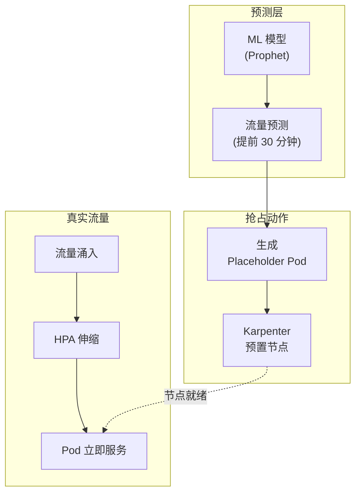
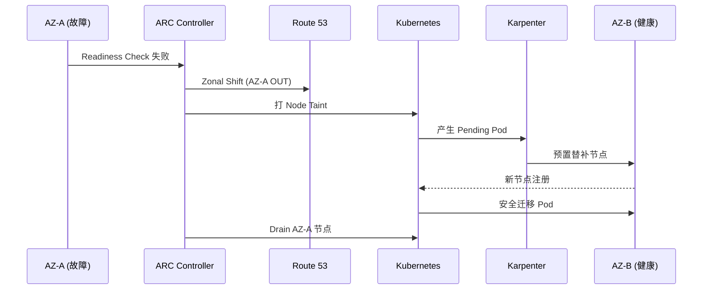
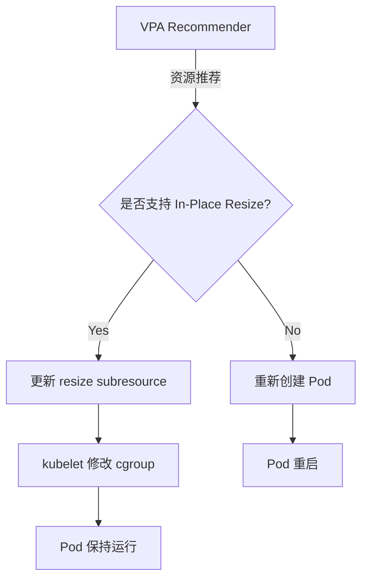

import { ScalingComparison, MLModelComparison, MaturityTable } from '@site/src/components/PredictiveOpsTables';

# 预测运维

> **核心**: 从反应式运维转向预测式运维 — 基于 ML 的预测性伸缩、异常检测、自动优化

---

## 1. 概览

### 从反应式到预测式

传统 EKS 运维以 **反应式** 为主。HPA 在 CPU / 内存超过阈值 **之后** 才开始伸缩,流量激增时用户已经受到影响。

**预测运维** 通过 ML 模型学习流量模式,**在增长前预先扩容**,保障服务质量。

```
反应式伸缩的问题:
  HPA 阈值超过 → 开始扩容 → Pod 启动 30 秒 - 2 分钟
  Karpenter 预置节点 → 再延 1-3 分钟
  → 产生性能下降区间 → 用户受影响

预测式伸缩的解:
  ML 预测 (提前 30 分钟) → 预先扩容 → 真实流量到达
  → 节点 / Pod 已就绪 → 无性能下降
```

### 核心价值

- **最小化用户影响**: 消除冷启动延迟
- **成本高效**: 无需过度预留,只在需要时扩展
- **应对复合故障**: 不仅单一指标,而是多维异常检测
- **自动优化**: 以 VPA + AI 自动 Right-Sizing

---

## 2. 基于 ML 的预测性伸缩

### 2.1 HPA 的局限

HPA (Horizontal Pod Autoscaler) 只对 **当前指标** 反应,存在结构性局限。

<ScalingComparison />

```
[HPA 反应式]
流量  ████████████████████████░░░░░░░░░
                      ↑ 超过阈值
Pod 数 ██████████░░░░████████████████████
                  ↑ 开始扩容 (延迟)
用户    ✓✓✓✓✓✓✓✓✗✗✗✓✓✓✓✓✓✓✓✓✓✓✓✓✓✓
体验                ↑ 性能下降区间

[ML 预测式]
流量  ████████████████████████░░░░░░░░░
             ↑ 预测点 (提前 30 分钟)
Pod 数 ██████████████████████████████████
             ↑ 预先扩容
用户    ✓✓✓✓✓✓✓✓✓✓✓✓✓✓✓✓✓✓✓✓✓✓✓✓✓✓
体验    (无性能下降)
```

### 2.2 时间序列预测模型

预测 EKS 工作负载流量的代表性 ML 模型:

<MLModelComparison />

**模型选择指南:**
- **周期性强的负载** (日 / 周模式): Prophet
- **趋势主导**: ARIMA
- **复杂非线性模式**: LSTM

### 2.3 实现模式

```python
# 基于 Prophet 的流量预测示例
from prophet import Prophet
import pandas as pd

def predict_scaling(metrics_df, forecast_hours=2):
    """使用 Prophet 预测未来流量"""
    df = metrics_df.rename(columns={'timestamp': 'ds', 'value': 'y'})
    
    model = Prophet(
        changepoint_prior_scale=0.05,
        seasonality_mode='multiplicative',
        daily_seasonality=True,
        weekly_seasonality=True
    )
    model.fit(df)
    
    future = model.make_future_dataframe(periods=forecast_hours * 12, freq='5min')
    forecast = model.predict(future)
    
    return forecast[['ds', 'yhat', 'yhat_upper', 'yhat_lower']]

def calculate_required_pods(predicted_rps, pod_capacity_rps=100):
    """按预测 RPS 计算所需 Pod 数"""
    # 使用上限 (yhat_upper) 保留安全冗余
    required = int(predicted_rps / pod_capacity_rps) + 1
    return max(required, 2)
```

**自动化模式:**
- 使用 CronJob 每 15 分钟做一次预测
- 从 AMP 获取最近 7 天指标
- 预测结果以 Prometheus Custom Metric 暴露
- HPA 或 KEDA 基于 Custom Metric 伸缩

---

## 3. Karpenter + AI 预测

### 3.1 Karpenter 基本动作

Karpenter 检测 Pending Pod 并执行 **Just-in-Time** 节点预置。但节点启动耗时 1-3 分钟。

### 3.2 基于 AI 预测的预先预置

结合 ML 预测可 **提前准备节点**。



**预先预置模式:**

```yaml
# 用 Placeholder Pod 预先占住节点
apiVersion: apps/v1
kind: Deployment
metadata:
  name: capacity-reservation
  namespace: scaling
spec:
  replicas: 0  # 由预测调度器动态调整
  selector:
    matchLabels:
      app: capacity-reservation
  template:
    metadata:
      labels:
        app: capacity-reservation
    spec:
      priorityClassName: capacity-reservation  # 低优先级
      terminationGracePeriodSeconds: 0
      containers:
        - name: pause
          image: registry.k8s.io/pause:3.9
          resources:
            requests:
              cpu: "1"
              memory: 2Gi
---
apiVersion: scheduling.k8s.io/v1
kind: PriorityClass
metadata:
  name: capacity-reservation
value: -10  # 会被真实负载驱逐
globalDefault: false
description: "用于 Karpenter 预先预置节点"
```

**工作原理:**
1. ML 模型预测 30 分钟后的流量增长
2. 增加 Placeholder Pod 的 replicas
3. Karpenter 检测 Pending Pod 并预置节点
4. 真实流量到达时 HPA 创建真实 Pod
5. Placeholder Pod 因低优先级被即时驱逐
6. 节点已就绪,真实 Pod 可立刻调度

### 3.3 ARC + Karpenter 集成 (AZ 故障自动撤离)

**ARC (Application Recovery Controller)** 自动检测 AZ 故障并把流量迁到健康的 AZ。与 Karpenter 结合后可实现 **节点级自动恢复**。



---

## 4. CloudWatch Anomaly Detection

### 4.1 异常检测带

CloudWatch Anomaly Detection 使用 ML 自动学习指标的 **正常区间带**,检测越界的异常。

```bash
# 创建 Anomaly Detection 模型
aws cloudwatch put-anomaly-detector \
  --namespace "ContainerInsights" \
  --metric-name "pod_cpu_utilization" \
  --dimensions Name=ClusterName,Value=my-cluster \
  --stat "Average"
```

### 4.2 EKS 应用模式

**核心指标:**
- `pod_cpu_utilization`: CPU 使用率 (检测偏离正常模式的峰值)
- `pod_memory_utilization`: 提早发现内存泄漏
- `pod_network_rx_bytes`: 检测网络异常流量
- `pod_restart_count`: 检测重启模式异常
- `node_cpu_utilization`: 检测节点级瓶颈

### 4.3 基于 Anomaly Detection 的告警

```bash
# 基于 Anomaly Detection 的 CloudWatch Alarm
aws cloudwatch put-metric-alarm \
  --alarm-name "EKS-CPU-Anomaly" \
  --comparison-operator GreaterThanUpperThreshold \
  --threshold-metric-id ad1 \
  --evaluation-periods 3 \
  --metrics '[
    {
      "Id": "m1",
      "MetricStat": {
        "Metric": {
          "Namespace": "ContainerInsights",
          "MetricName": "pod_cpu_utilization",
          "Dimensions": [{"Name": "ClusterName", "Value": "my-cluster"}]
        },
        "Period": 300,
        "Stat": "Average"
      }
    },
    {
      "Id": "ad1",
      "Expression": "ANOMALY_DETECTION_BAND(m1, 2)"
    }
  ]' \
  --alarm-actions "arn:aws:sns:ap-northeast-2:ACCOUNT_ID:ops-alerts"
```

**优点:**
- 较固定阈值大幅降低误报
- 自动学习周期性 (日 / 周模式)
- 自动适应季节性变化

---

## 5. AI Right-Sizing

### 5.1 基于 Container Insights 的推荐

CloudWatch Container Insights 通过分析 Pod 的真实资源使用推荐合适大小。

```promql
# 真实 CPU 使用量 vs requests 对比
avg(rate(container_cpu_usage_seconds_total{namespace="payment"}[1h]))
  by (pod)
/ avg(kube_pod_container_resource_requests{resource="cpu", namespace="payment"})
  by (pod)
* 100

# 真实 Memory 使用量 vs requests 对比
avg(container_memory_working_set_bytes{namespace="payment"})
  by (pod)
/ avg(kube_pod_container_resource_requests{resource="memory", namespace="payment"})
  by (pod)
* 100
```

### 5.2 基于 VPA + ML 的自动 Right-Sizing

```yaml
# VPA (Vertical Pod Autoscaler) 配置
apiVersion: autoscaling.k8s.io/v1
kind: VerticalPodAutoscaler
metadata:
  name: payment-service-vpa
  namespace: payment
spec:
  targetRef:
    apiVersion: apps/v1
    kind: Deployment
    name: payment-service
  updatePolicy:
    updateMode: "Auto"  # Off、Initial、Auto
  resourcePolicy:
    containerPolicies:
      - containerName: app
        minAllowed:
          cpu: 100m
          memory: 128Mi
        maxAllowed:
          cpu: "2"
          memory: 4Gi
        controlledResources: ["cpu", "memory"]
```

### 5.3 In-Place Pod Vertical Scaling (K8s 1.33+)

从 Kubernetes 1.33 开始 **In-Place Pod Vertical Scaling** 进入 Beta,解决了 VPA 最大的痛点 **Pod 重启问题**。

**既有 VPA 的问题:**
- Pod 资源变更时必须重启
- StatefulSet、DB、缓存等状态型工作负载难以使用
- 重启期间可能服务中断

**In-Place Resize 的解决:**
- 动态调整运行中 Pod 的资源
- 实时修改 cgroup 限制
- 无需重启即可增减资源
- 保持 QoS Class 时不必重启

| Kubernetes 版本 | 状态 | Feature Gate | 备注 |
|----------------|------|--------------|------|
| 1.27 | Alpha | `InPlacePodVerticalScaling` | 实验性 |
| 1.33 | Beta | 默认启用 | 建议在生产测试 |
| 1.35+ | Stable (预期) | 默认启用 | 可安全用于生产 |

**EKS 支持:**
- **EKS 1.33** (预计 2026 年 4 月): 可启用 Beta
- **EKS 1.35** (预计 2026 年 11 月): 支持 Stable

**VPA 自动 In-Place Resize:**

```yaml
apiVersion: autoscaling.k8s.io/v1
kind: VerticalPodAutoscaler
metadata:
  name: payment-service-vpa
spec:
  targetRef:
    apiVersion: apps/v1
    kind: Deployment
    name: payment-service
  updatePolicy:
    updateMode: "Auto"  # 若支持 In-Place Resize 则无需重启即可调整
  resourcePolicy:
    containerPolicies:
      - containerName: app
        minAllowed:
          cpu: 100m
          memory: 128Mi
        maxAllowed:
          cpu: "4"
          memory: 8Gi
        controlledResources: ["cpu", "memory"]
        mode: Auto
```

**工作流程:**



**限制:**
- CPU 可自由 resize
- Memory 增加可行,减少时若 QoS Class 变化则需要重启
- QoS Class 变化 (Guaranteed ↔ Burstable ↔ BestEffort) 需要重启

:::warning VPA 注意事项 (K8s 1.34 及以下)
在 K8s 1.34 及以下,VPA `Auto` 模式会重启 Pod 以调整资源。对 StatefulSet 等重启敏感负载,建议使用 `Off` 模式只获取推荐值并手工应用。VPA 与 HPA 若对同一指标 (CPU/Memory) 同时使用会发生冲突。
:::

### 5.4 Right-Sizing 效果

**预期成本节省:**
- Over-provisioning 从 40-60% 降至 20-30%
- 集群年成本节省 30-50%
- 提升节点 Consolidation 效率

---

## 6. 成熟度模型

<MaturityTable />

**Level 0: 反应式**
- HPA/VPA 基础配置
- 基于固定阈值的告警
- 手工伸缩

**Level 1: 预测就绪**
- 启用 Container Insights
- 引入 Anomaly Detection
- 指标历史积累 ≥ 7 天

**Level 2: 预测性伸缩**
- 基于 Prophet/ARIMA 的流量预测
- Karpenter 预先预置
- 基于 CronJob 的自动化

**Level 3: 自动优化**
- VPA Auto 模式
- 利用 In-Place Resize (K8s 1.33+)
- 基于 CloudWatch Anomaly Detection 的自动行动

**Level 4: 自主运维**
- 基于 AI Agent 的自动事件响应
- Chaos Engineering + AI 反馈循环
- 自主学习与改进

---

## 7. 参考资料

**相关文档:**
- [可观测性栈](./observability-stack.md) — 指标采集与分析基础
- [自主响应](./autonomous-response.md) — 基于 AI Agent 的事件响应
- [EKS 声明式自动化](../toolchain/eks-declarative-automation.md) — 基于 GitOps 的自动化

**AWS 官方文档:**
- [CloudWatch Anomaly Detection](https://docs.aws.amazon.com/AmazonCloudWatch/latest/monitoring/CloudWatch_Anomaly_Detection.html)
- [Karpenter Best Practices](https://aws.github.io/aws-eks-best-practices/karpenter/)
- [Container Insights](https://docs.aws.amazon.com/AmazonCloudWatch/latest/monitoring/ContainerInsights.html)
- [Application Recovery Controller](https://docs.aws.amazon.com/r53recovery/latest/dg/what-is-route53-recovery.html)

**Kubernetes 官方文档:**
- [In-Place Pod Vertical Scaling (KEP-1287)](https://github.com/kubernetes/enhancements/tree/master/keps/sig-node/1287-in-place-update-pod-resources)
- [VPA](https://github.com/kubernetes/autoscaler/tree/master/vertical-pod-autoscaler)
