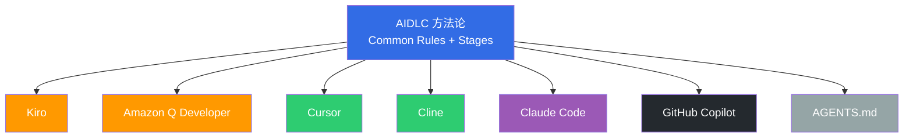

import { AiCodingAgentComparison } from '@site/src/components/AidlcTables';

# AI 编码代理

介绍在 AIDLC Construction 阶段将设计实现为代码的 AI 编码代理策略。本文先概述 **AWS Labs AIDLC 官方支持的 7 个平台**,再深入 Kiro 的 Spec-Driven 方式与 Amazon Q Developer 的实时构建 · 测试,最后介绍基于 MCP 的上下文采集、CI/CD 集成模式与代理选择指南。

## 0. AIDLC 官方支持的 7 个平台

AWS Labs [AIDLC Workflows](https://github.com/awslabs/aidlc-workflows) 定义了 AIDLC 方法论可运行的 **7 个官方支持平台**。每个平台都需实现 Common Rules 与 Inception/Construction 工作流,产物格式遵循统一规约。



### 0.1 Kiro
- **AIDLC 适配**: 默认内置 Spec-Driven。`requirements.md → design.md → tasks.md` 与 Inception 产物近似 1:1 映射。MCP 原生,能立即对接 AWS Hosted MCP 服务器
- **优势**: 完整支持 11 项 Common Rules。识别组织 Extension (opt-in.md)。与 AWS 服务 (EKS、DynamoDB 等) 紧密集成
- **限制**: 以 AWS 生态为主,多云团队有局限。IDE 选择有限

### 0.2 Amazon Q Developer
- **AIDLC 适配**: 聚焦 Construction 阶段的实时构建 · 测试 · 安全扫描。Inception 建议与 Kiro/Claude Code 等搭配
- **优势**: 自动构建 · 测试使 Loss Function 即时启动。与 CodeCatalyst · GitHub Actions 集成优秀。通过 `/transform` 支持遗留迁移 (Java、.NET)
- **限制**: Inception (需求 · 设计) 需要配合其他工具。自由度高的实验 · 原型开发,Cursor 等更灵活

### 0.3 Cursor
- **AIDLC 适配**: 基于代码上下文的 Spec-Driven。可通过 `.cursor/rules/` 目录表达部分 Common Rules。Composer 功能支持 multi-file 编辑
- **优势**: 擅长大规模重构 · 代码理解。Apply 功能可校验后合并建议代码。编辑器 UX 完成度高
- **限制**: 不支持 AIDLC Extension System → 组织规则需用手工提示补齐。Audit Log 自动生成有限

### 0.4 Cline
- **AIDLC 适配**: 基于 VS Code Extension 的 Autonomous Agent。适合 CLI 为主的工作流。Plan Mode / Act Mode 分离契合 Adaptive Execution
- **优势**: 完全开源、Bring Your Own Key (BYOK)。对本地文件系统 · 终端的控制自由度高。生成 · 修改 AIDLC 产物文件顺畅
- **限制**: IDE 集成 UX 相较 Cursor 较低。无商业支持 (依赖社区)

### 0.5 Claude Code
- **AIDLC 适配**: 同时支持 CLI + IDE 集成。基于 Sub-agent 的复杂任务拆分。可用 AGENTS.md / CLAUDE.md 表达 Common Rules
- **优势**: 默认使用 Anthropic Claude 模型。Sub-agent 可分离 Inception (planner) 与 Construction (executor)。与 MCP 生态平滑对接
- **限制**: 使用 Opus 模型成本较高。团队普及时需管理授权 · 速率限制

### 0.6 GitHub Copilot
- **AIDLC 适配**: 以代码自动补全为主。Copilot Chat + Workspace 部分支持 Spec-Driven。Copilot Enterprise 正扩展对 AGENTS.md 的识别
- **优势**: 支持最广泛的 IDE (VS Code · JetBrains · Neovim)。大多数开发者已熟悉。原生 GitHub 集成
- **限制**: 默认功能不含 AIDLC Stage Transition 或 Checkpoint Approval — 需人工运营。提示定制受限

### 0.7 AGENTS.md
- **AIDLC 适配**: 与其说是平台,不如说是 **工具无关的文档规范**。用 `AGENTS.md` 以纯文本描述 Common Rules · Extension · Stage
- **优势**: 任何 AI 代理只要读取 `AGENTS.md` 就可以遵循 AIDLC 规则 (Claude Code、Cursor、Cline 均支持)。易于 Git 追踪 · Review
- **限制**: 无法自动执行 · 强制 → 代理有忽略文件的可能。Audit/Checkpoint 需借助额外工具

### 0.8 平台选择总览

| 平台 | AIDLC Common Rules | Inception | Construction | Audit | 许可 | 推荐场景 |
|--------|-------------------|-----------|--------------|-------|------|-----------|
| Kiro | Full | Full | Full | Full | Commercial (AWS) | AWS 企业级、安全敏感 |
| Amazon Q Developer | Full | Partial | Full | Full | Commercial (AWS) | AWS + CI/CD 实时校验 |
| Cursor | Partial | Partial | Full | Manual | Commercial | 大规模重构 · 探索式开发 |
| Cline | Partial | Partial | Full | Manual | OSS (BYOK) | 成本节省 · 定制化 |
| Claude Code | Full | Full | Full | Partial | Commercial (Anthropic) | 基于 Sub-agent 的复杂任务 |
| GitHub Copilot | Partial | Limited | Full | Limited | Commercial (GitHub) | 广泛 IDE 支持 · 学习曲线低 |
| AGENTS.md | Full (文档) | Full (文档) | Full (文档) | Manual | OSS | 工具无关规约管理 |

:::tip 推荐混合策略
与其只用一个平台,**Kiro (Inception) + Q Developer (Construction) + GitHub Copilot (个人自动补全)** 按阶段组合最优工具的 **混合** 方式,在实战中最为高效。产物以 Markdown + YAML 标准化,平台间迁移成本低。
:::

## 1. AI 编码代理概览

AIDLC Construction 阶段把 Inception 阶段的产物 (需求、设计、Ontology) 转化为 **可执行的代码与基础设施**。AI 编码代理将此转换自动化,担任以下角色:

1. **需求 → 代码转换** — 将自然语言需求转为结构化规约 (Spec) 后生成代码
2. **实时构建 · 测试** — 代码生成后立即自动构建并测试,提早发现错误 (Loss Function)
3. **安全扫描** — 自动检测 Kubernetes manifest、应用代码的安全漏洞并给出修复建议
4. **CI/CD 集成** — 自动对接 GitHub Actions、Argo CD 等 GitOps 流水线
5. **实时上下文采集** — 通过 MCP 服务器反映当前基础设施状态 · 成本 · 工作负载信息

Amazon Q Developer 与 Kiro 默认使用 **Anthropic Claude** 模型,Kiro 还支持 [Open-Weight 模型](./open-weight-models.md),便于成本优化与特定领域扩展。

## 2. Kiro — Spec-Driven 开发

### 2.1 Spec-Driven Inception

Kiro 把 Inception 阶段的产物以 **Spec 文件** 体系化,让从自然语言需求到代码的整个过程结构化。

```
requirements.md → design.md → tasks.md → 代码生成 → 校验
```

#### EKS 示例: 部署 Payment Service

**requirements.md**

```markdown
# Payment Service 部署需求

## 功能需求
- REST API 端点: /api/v1/payments
- 对接 DynamoDB 表
- 通过 SQS 处理异步事件

## 非功能需求
- P99 延迟: < 200ms
- 可用性: 99.95%
- 自动伸缩: 2-20 Pod
- 兼容 EKS 1.35+
```

**design.md**

```markdown
# Payment Service 架构

## 基础设施
- EKS Deployment (最少 3 副本)
- ACK DynamoDB Table (on-demand)
- ACK SQS Queue (FIFO)
- HPA (CPU 70%、Memory 80%)
- Karpenter NodePool (graviton、spot)

## 可观测性
- ADOT sidecar (traces → X-Ray)
- Application Signals (SLI/SLO 自动)
- CloudWatch Logs (/eks/payment-service)

## 安全
- Pod Identity (替代 IRSA)
- NetworkPolicy (namespace 隔离)
- Secrets Manager CSI Driver
```

**tasks.md**

```markdown
# 实现任务

## Bolt 1: 基础设施
- [ ] 编写 ACK DynamoDB Table CRD
- [ ] 编写 ACK SQS Queue CRD
- [ ] 定义 KRO ResourceGroup (DynamoDB + SQS 整合)
- [ ] 配置 Karpenter NodePool (graviton、spot)

## Bolt 2: 应用
- [ ] 实现 Go REST API
- [ ] 对接 DynamoDB SDK
- [ ] 实现 SQS consumer
- [ ] Dockerfile + multi-stage build

## Bolt 3: 部署
- [ ] 编写 Helm chart
- [ ] 定义 Argo CD Application
- [ ] 编写 HPA manifest
- [ ] 编写 NetworkPolicy

## Bolt 4: 可观测性
- [ ] 配置 ADOT sidecar
- [ ] Application Signals annotation
- [ ] CloudWatch 看板
- [ ] 配置 SLO 告警
```

### 2.2 Spec-Driven vs 指挥式

:::tip Spec-Driven 的核心价值
**指挥式**: "帮我建 DynamoDB" → "还要 SQS" → "现在部署" → 每次都是手工指令,存在上下文丢失风险

**Spec-Driven**: Kiro 分析 `requirements.md` → 生成 `design.md` → 拆分 `tasks.md` → 自动生成代码 → 校验,由一致的 Context Memory 串联
:::

Spec-Driven 保持整体上下文,并在需求变更时自动追踪影响范围。DDD (Domain-Driven Design) 整合模式参见 [DDD 集成](../methodology/ddd-integration.md)。

### 2.3 MCP 原生架构

Kiro 设计为 MCP (Model Context Protocol) 原生,在 Inception 阶段通过 AWS Hosted MCP 服务器 **采集实时基础设施状态**。

```
[Kiro + MCP 交互]

Kiro: "检查 EKS 集群状态"
  → EKS MCP Server: get_cluster_status()
  → 响应: { version: "1.35", nodes: 5, status: "ACTIVE" }

Kiro: "成本分析"
  → Cost Analysis MCP Server: analyze_cost(service="EKS")
  → 响应: { monthly: "$450", recommendations: [...] }

Kiro: "分析当前工作负载"
  → EKS MCP Server: list_deployments(namespace="payment")
  → 响应: { deployments: [...], resource_usage: {...} }
```

借此在生成 `design.md` 时可得到 **反映当前集群状态与成本的设计**。MCP 集成架构的详情参见 AIDLC MCP 策略文档。

### 2.4 Open-Weight 模型支持

Kiro 除 Claude 外,还支持 Open-Weight 模型 (Llama 3.1 405B、Mixtral 8x22B、DeepSeek R1 等),带来以下收益:

- **成本优化** — 对简单代码生成任务使用小模型 (token 成本 1/10)
- **特定领域扩展** — 在金融、医疗等领域使用微调模型
- **本地部署** — 不将敏感数据外传,于 EKS 集群内推理

Open-Weight 模型部署策略参见 [Open-Weight 模型](./open-weight-models.md)。

## 3. Amazon Q Developer — 实时构建与测试

AWS 于 2025 年 2 月发布了 **Amazon Q Developer 的实时代码执行能力**。这是 AI 生成代码后 **自动构建并运行测试、校验结果后再呈现给开发者** 的创新方式。

它是让 AIDLC Construction 阶段的 **Loss Function 提早启动**、阻断错误向下游传递的核心机制。

### 3.1 实时代码执行机制

传统 AI 编码工具在生成代码后需开发者手工构建 · 测试。Q Developer 将此过程自动化。

```
传统方式:
  AI 生成代码 → 开发者手工构建 → 开发者手工测试 → 发现错误 → 反馈给 AI → 再生成
  (循环周期: 5-10 分钟)

Q Developer 实时执行:
  AI 生成代码 → 自动构建 → 自动测试 → 校验结果 → (错误时自动再生成) → 开发者评审
  (循环周期: 1-2 分钟,开发者介入最少)
```

**核心机制**

1. **自动构建流水线**
   - 自动运行项目的构建工具 (Maven、Gradle、npm、pip 等)
   - 立即检测编译错误、依赖冲突
   - 构建失败时分析错误消息并自动重新生成修正代码

2. **测试自动运行**
   - 自动执行单元测试、集成测试
   - 测试失败时分析原因,修改代码或测试
   - 保持既有测试覆盖率的同时追加新代码

3. **开发者评审前的校验**
   - 开发者收到代码时 **已通过构建与测试**
   - 开发者聚焦业务逻辑与设计审查 (Loss Function 角色)
   - 校验的是 "代码是否正确",而非 "代码能否跑通"

### 3.2 安全扫描自动修复

Q Developer 自动扫描 Kubernetes YAML 与应用代码的安全漏洞并给出修复建议。

**Kubernetes YAML 安全扫描**

1. **检测 Root 权限** — 检测 `runAsUser: 0` 或 `runAsNonRoot: false`,建议改为 `runAsUser: 1000`、`runAsNonRoot: true`
2. **检测 Privileged 容器** — 检测 `securityContext.privileged: true`,建议仅显式添加必要 capabilities
3. **检测未设置 securityContext** — 对 Pod/Container 没有 `securityContext` 的情况,按最小权限原则提出建议

**自动修复建议示例**

```yaml
# Q Developer 检测到的问题
apiVersion: v1
kind: Pod
metadata:
  name: payment-pod
spec:
  containers:
    - name: payment
      image: payment:v1
      securityContext:
        runAsUser: 0  # ⚠️ 使用 Root 权限
        privileged: true  # ⚠️ Privileged 模式

# Q Developer 建议的修复
apiVersion: v1
kind: Pod
metadata:
  name: payment-pod
spec:
  securityContext:
    runAsNonRoot: true
    runAsUser: 1000
    fsGroup: 1000
    seccompProfile:
      type: RuntimeDefault
  containers:
    - name: payment
      image: payment:v1
      securityContext:
        allowPrivilegeEscalation: false
        readOnlyRootFilesystem: true
        capabilities:
          drop:
            - ALL
          add:
            - NET_BIND_SERVICE  # 仅添加必要 capabilities
```

### 3.3 反馈周期缩短的效果

```
传统 Construction 阶段:
  [开发者] 编码 (30 分钟)
    → [开发者] 手工构建 (2 分钟)
    → [开发者] 手工测试 (5 分钟)
    → [开发者] 发现错误 (调试 10 分钟)
    → [开发者] 修改代码 (20 分钟)
    → 循环...
  总耗时: 2-3 小时

Q Developer 实时执行:
  [AI] 生成代码 (1 分钟)
    → [AI] 自动构建 · 测试 (30 秒)
    → [AI] 检测错误并自动修复 (1 分钟)
    → [开发者] Loss Function 校验 (10 分钟)
    → [Argo CD] 自动部署
  总耗时: 15-20 分钟
```

:::tip Q Developer 在 AIDLC 中的价值
Q Developer 的实时执行实现了 AIDLC 的核心原则 **"Minimize Stages, Maximize Flow"**。将代码生成 → 构建 → 测试 → 校验各阶段自动化,去除交接,让开发者只专注于 **决策 (Loss Function)**。这是把传统 SDLC 的周 / 月级周期压缩到 AIDLC 小时 / 天级周期的核心机制。
:::

## 4. AI 编码代理对比

<AiCodingAgentComparison />

## 5. 基于 MCP 的实时上下文采集

Kiro 是 MCP 原生架构,在 Construction 阶段通过 AWS Hosted MCP 服务器 **采集实时基础设施状态** 并融入设计。

### 5.1 使用 AWS Hosted MCP 服务器

**EKS MCP Server**

```typescript
// Kiro 实时查询 EKS 集群状态
const cluster = await mcp.call('eks-mcp-server', 'get_cluster_status', {
  clusterName: 'prod-eks'
});

// 响应: { version: "1.35", nodes: 5, status: "ACTIVE", capacityType: "SPOT" }
// → 生成 design.md 时反映当前集群版本
```

**Cost Analysis MCP Server**

```typescript
// 基于成本分析优化设计
const cost = await mcp.call('cost-analysis-mcp', 'analyze_cost', {
  service: 'EKS',
  timeRange: 'last_30_days'
});

// 响应: { monthly: "$450", recommendations: ["Use Spot for dev clusters", "Enable Karpenter consolidation"] }
// → 在 design.md 中反映成本优化策略
```

**Workload MCP Server**

```typescript
// 基于当前工作负载分析决定资源分配
const workload = await mcp.call('eks-mcp-server', 'list_deployments', {
  namespace: 'payment'
});

// 响应: { deployments: [...], resource_usage: { cpu: "60%", memory: "75%" } }
// → 用于决定 HPA 阈值与 NodePool 配置
```

### 5.2 MCP 集成收益

1. **上下文驱动设计** — 生成反映当前基础设施状态的现实设计
2. **成本优化** — 分析真实使用模式,自动建议 Spot、Graviton 等节省策略
3. **资源效率** — 基于当前工作负载状态优化 HPA、Karpenter 配置
4. **一致性保障** — 以实时数据最小化设计与现实的偏差

## 6. CI/CD 集成

将 AI 编码代理整合到 CI/CD 流水线,实现 **Quality Gate 自动化**。

### 6.1 GitHub Actions 集成

```yaml
# .github/workflows/aidlc-construction.yml
name: AIDLC Construction Quality Gate
on:
  pull_request:
    types: [opened, synchronize]

jobs:
  q-developer-validation:
    runs-on: ubuntu-latest
    steps:
      - uses: actions/checkout@v4

      # 1. Q Developer 安全扫描
      - name: Q Developer Security Scan
        uses: aws/amazon-q-developer-action@v1
        with:
          scan-type: security
          source-path: .
          auto-fix: true  # 应用自动修复建议

      # 2. 实时构建与测试
      - name: Q Developer Build & Test
        uses: aws/amazon-q-developer-action@v1
        with:
          action: build-and-test
          test-coverage-threshold: 80

      # 3. 校验 Kubernetes manifest
      - name: K8s Manifest Security Check
        run: |
          kube-linter lint deploy/ --config .kube-linter.yaml

      # 4. 通过后才允许 Argo CD 同步
      - name: Approve for GitOps
        if: success()
        run: echo "Quality Gate passed. Ready for Argo CD sync."
```

### 6.2 Argo CD 集成

```yaml
apiVersion: argoproj.io/v1alpha1
kind: Application
metadata:
  name: payment-service
  namespace: argocd
spec:
  project: default
  source:
    repoURL: https://github.com/org/payment-service
    targetRevision: main
    path: deploy/
  destination:
    server: https://kubernetes.default.svc
    namespace: payment
  syncPolicy:
    automated:
      prune: true
      selfHeal: true
    syncOptions:
      - CreateNamespace=true
    # Quality Gate 通过后方可同步
    retry:
      limit: 3
      backoff:
        duration: 5s
        factor: 2
        maxDuration: 3m
```

### 6.3 Quality Gate 工作流

1. **PR 创建** — 开发者把 Kiro 生成的代码以 PR 提交
2. **安全扫描** — Q Developer 扫描 Kubernetes manifest 与应用代码
3. **构建 · 测试** — Q Developer 自动执行构建与测试
4. **校验通过** — 通过所有检查后 Argo CD 自动同步
5. **部署完成** — 部署到 EKS 集群,Application Signals 自动激活

该工作流是 [Harness 工程](../methodology/harness-engineering.md) 的核心实现模式。

## 7. 代理选择指南

按项目特性选择 AI 编码代理的标准。

### 7.1 按项目规模

| 项目规模 | 推荐代理 | 原因 |
|----------|----------|------|
| 小型 (1-5 微服务) | Amazon Q Developer | IDE 集成、快速反馈、安全扫描 |
| 中型 (5-20 微服务) | Kiro + Q Developer | Spec-Driven 一致性、Q Developer 实时校验 |
| 大型 (20+ 微服务) | Kiro + Open-Weight 模型 | 成本优化、利用领域特化模型 |

### 7.2 按领域

| 领域 | 推荐代理 | 原因 |
|------|----------|------|
| 通用 Web 应用 | Amazon Q Developer | 支持通用语言 · 框架,快速原型 |
| EKS 基础设施自动化 | Kiro + MCP | 反映实时集群状态、ACK/KRO 集成 |
| 金融 · 医疗等特定领域 | Kiro + 微调 Open 模型 | 领域合规、本地部署 |
| 遗留迁移 | Amazon Q Developer `/transform` | 自动转换 Java 8→17、.NET Framework→Core |

### 7.3 按团队成熟度

| 团队成熟度 | 推荐代理 | 原因 |
|------------|----------|------|
| 首次引入 AI 工具 | Amazon Q Developer | IDE 集成、学习曲线低、AWS 官方支持 |
| DevOps 熟练团队 | Kiro + Q Developer | Spec-Driven 结构化、CI/CD 自动化、利用 MCP |
| AI 平台运营团队 | Kiro + Open-Weight 模型 | 定制模型部署、成本优化、特殊需求 |

### 7.4 成本考量

| 月请求量 | 推荐策略 | 预估成本 |
|----------|----------|----------|
| < 10,000 请求 | 仅 Amazon Q Developer | ~$50-100 |
| 10,000 - 100,000 请求 | Kiro + Claude (简单任务用小模型) | ~$200-500 |
| > 100,000 请求 | Kiro + Open-Weight 模型 (EKS 自托管) | ~$100-300 (基础设施) |

## 8. 实战模式

### 8.1 混合策略

大多数团队最优解是 **Amazon Q Developer + Kiro 混合**:

1. **开发初期** — 用 Q Developer 做快速原型、实时反馈
2. **设计确定后** — 用 Kiro Spec-Driven 做一致性实现
3. **安全校验** — 用 Q Developer 自动扫描早期发现漏洞
4. **自动部署** — 通过 Kiro MCP 生成反映当前集群状态的部署配置

### 8.2 基于 Ontology 的代码生成

把 Inception 阶段构建的 Ontology 交给 Kiro,就可生成 **反映领域术语与关系的代码**:

```markdown
# ontology.md (提供给 Kiro)

## 领域模型
- Payment (支付) → Order (订单) → Customer (客户)
- Payment.status: [pending, completed, failed]
- Payment.method: [card, bank_transfer, wallet]

## 业务规则
- 创建 Payment 时 Order.status 必须为 "confirmed"
- Payment.amount 必须与 Order.total_amount 一致
- Payment 失败时发送到 SQS 重试队列 (最多 3 次)
```

Kiro 基于该 Ontology 生成 `design.md` 与代码,保证领域术语一致。

### 8.3 持续学习

AI 编码代理通过团队的代码评审反馈逐步改进:

1. **代码评审反馈** — 通过 PR 评论学习团队编码约定
2. **Ontology 更新** — 新增领域概念时更新 `ontology.md`
3. **MCP 服务器扩展** — 新增基础设施服务时集成 MCP 服务器
4. **微调** — 用团队代码库微调 Open-Weight 模型 (可选)

## 参考资料

- [AWS DevOps Blog: Enhancing Code Generation with Real-Time Execution in Amazon Q Developer](https://aws.amazon.com/blogs/devops/enhancing-code-generation-with-real-time-execution-in-amazon-q-developer/) (2025-02-06)
- [Amazon Q Developer 官方文档](https://docs.aws.amazon.com/amazonq/latest/qdeveloper-ug/)
- [Model Context Protocol (MCP) 规范](https://modelcontextprotocol.io/)
- [Open-Weight 模型部署指南](./open-weight-models.md)
- [DDD 集成](../methodology/ddd-integration.md)
- [Harness 工程](../methodology/harness-engineering.md)
