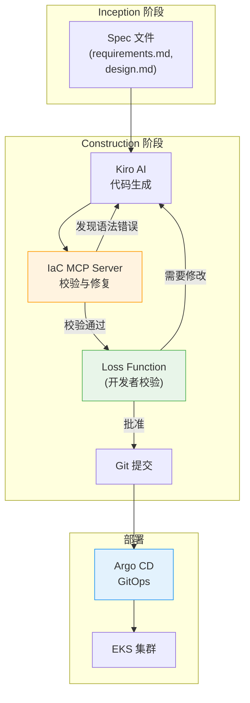

import { EksCapabilities, AidlcPipeline } from '@site/src/components/AidlcTables';

# EKS 声明式自动化

EKS Capabilities (2025.11) 将流行开源工具以 AWS 托管形式提供,是把 AIDLC Construction 阶段产物声明式部署,并在 Operations 阶段持续管理的核心基础设施。

<EksCapabilities />

## 1. EKS Capabilities 概览

EKS Capabilities 由以下 5 种托管服务构成:

1. **Managed Argo CD** — 基于 GitOps 的持续交付
2. **ACK (AWS Controllers for Kubernetes)** — 将 AWS 资源作为 K8s CRD 管理
3. **KRO (Kubernetes Resource Orchestrator)** — 将复合资源编排为单一部署单元
4. **Gateway API (LBC v3)** — L4/L7 流量路由与高级网络
5. **Node Readiness Controller** — 声明式节点就绪状态管理

这些工具让 Kiro 生成的代码在推送到 Git 后自动部署到 EKS,并由 AI Agent 在 Operations 阶段监控 · 自动响应,共同构成完整流水线。

---

## 2. Managed Argo CD — GitOps 模式

Managed Argo CD 在 AWS 基础设施上以托管形式运行 GitOps。Kiro 生成的代码推送到 Git 后自动部署到 EKS。

### 核心概念

- **Application CRD**: 声明单一环境 (如 production) 部署
- **ApplicationSet**: 自动生成多环境 (dev/staging/production)
- **Self-healing**: Git 状态与集群状态不一致时自动同步
- **Progressive Delivery**: Canary/Blue-Green 部署自动化

### 与 AIDLC 的集成

| 阶段 | 角色 |
|------|------|
| **Construction** | 将 Kiro 生成的 Helm chart/Kustomize 提交到 Git → Argo CD 自动部署 |
| **Operations** | AI Agent 监控部署状态,违反 SLO 时触发自动回滚 |

### 参考资料

- [EKS User Guide: Managed Argo CD](https://docs.aws.amazon.com/eks/latest/userguide/eks-capabilities-argocd.html)
- [Argo CD Best Practices](https://argo-cd.readthedocs.io/en/stable/operator-manual/declarative-setup/)

---

## 3. ACK — AWS 资源 CRD 管理

ACK 以声明方式将 50+ AWS 服务作为 K8s CRD 管理。Kiro 生成的 Domain Design 中基础设施要素 (DynamoDB、SQS、S3 等) 可用 `kubectl apply` 部署,自然融入 Argo CD 的 GitOps 工作流。

### 核心价值

使用 ACK 可以 **把集群外的 AWS 资源也用 K8s 声明式模型管理**。将 DynamoDB、SQS、S3、RDS 等作为 K8s CRD 创建 / 修改 / 删除,形成 "以 K8s 为中心统一声明式管理全部基础设施" 的策略。

### 与 AIDLC 的集成

- **Inception**: 在 [DDD 集成](../methodology/ddd-integration.md) 中做领域边界分析 → 识别所需 ACK 资源
- **Construction**: Kiro 自动生成 ACK CRD manifest
- **Operations**: 通过 [可观测性栈](../operations/observability-stack.md) 监控 ACK 资源状态

### 参考资料

- [AWS Controllers for Kubernetes (ACK)](https://aws-controllers-k8s.github.io/community/)
- [EKS Best Practices: ACK](https://aws.github.io/aws-eks-best-practices/security/docs/ack/)

---

## 4. KRO — ResourceGroup 编排

KRO 把多个 K8s 资源打包为 **单一部署单元 (ResourceGroup)**。它与 AIDLC 的 Deployment Unit 概念直接映射,可把 Deployment + Service + HPA + ACK 资源作为一个 Custom Resource 创建。

### 核心概念

- **ResourceGroup**: 定义逻辑部署单元 (如 Payment Service = Deployment + Service + DynamoDB Table)
- **Dependencies**: 自动管理资源间依赖 (如 Deployment 在 DynamoDB Table 创建后启动)
- **Rollback**: 按 ResourceGroup 原子回滚

### 与 DDD Aggregate 的映射

| DDD 概念 | KRO 实现 |
|----------|----------|
| Aggregate Root | ResourceGroup CRD |
| Entity | Deployment、StatefulSet |
| Value Object | ConfigMap、Secret |
| Repository | ACK DynamoDB/RDS CRD |

### 参考资料

- [Kubernetes Resource Orchestrator (KRO)](https://github.com/awslabs/kro)
- [EKS Best Practices: KRO](https://aws.github.io/aws-eks-best-practices/scalability/docs/kro/)

---

## 5. Gateway API — L4/L7 流量路由

AWS Load Balancer Controller v3 将 Gateway API 转为 GA,提供 L4 (NLB) + L7 (ALB) 路由、QUIC/HTTP3、JWT 校验、Header 变换等。

### Gateway API 的设计理念

Gateway API 采用面向角色 (role-oriented) 设计,使基础设施运维、集群运维、应用开发者各司其责地管理流量。

| 资源 | 所有者 | 职责 |
|------|--------|------|
| **GatewayClass** | 基础设施运维 | 定义负载均衡器类型 (ALB/NLB) |
| **Gateway** | 集群运维 | 定义监听 (端口、TLS)、命名空间访问控制 |
| **HTTPRoute/GRPCRoute** | 应用开发者 | 基于路径的路由、Canary 部署、Header 变换 |

### 支持功能 (LBC v2.14+)

1. **L4 Routes** (NLB, v2.13.3+)
   - TCPRoute、UDPRoute、TLSRoute
   - 基于 SNI 的 TLS 路由、QUIC/HTTP3

2. **L7 Routes** (ALB, v2.14.0+)
   - HTTPRoute: 按路径 / Header / 查询路由
   - GRPCRoute: 按 gRPC 方法路由

3. **高级功能** (Gateway API v1.4)
   - JWT 校验 (Gateway 级)
   - Header 变换 (RequestHeaderModifier、ResponseHeaderModifier)
   - 基于权重的 Canary 部署

### YAML 示例 (3 资源分离模式)

```yaml
# GatewayClass — 由基础设施运维定义
apiVersion: gateway.networking.k8s.io/v1
kind: GatewayClass
metadata:
  name: aws-alb
spec:
  controllerName: gateway.alb.aws.amazon.com/controller
---
# Gateway — 由集群运维定义
apiVersion: gateway.networking.k8s.io/v1
kind: Gateway
metadata:
  name: payment-gateway
  namespace: production
spec:
  gatewayClassName: aws-alb
  listeners:
    - name: https
      protocol: HTTPS
      port: 443
---
# HTTPRoute — 由应用开发者定义
apiVersion: gateway.networking.k8s.io/v1
kind: HTTPRoute
metadata:
  name: payment-api-route
  namespace: production
spec:
  parentRefs:
    - name: payment-gateway
  rules:
    - matches:
        - path:
            type: PathPrefix
            value: /api/v1/payments
      backendRefs:
        - name: payment-service-v1
          port: 8080
          weight: 90  # Canary 部署: v1 90%
        - name: payment-service-v2
          port: 8080
          weight: 10  # v2 10%
```

### 在 AIDLC Construction 阶段的应用

1. **在 Kiro Spec 中定义 API 路由需求**
   - 在 `requirements.md` 中明示 "用 Canary 把 10% 流量路由到 v2" 等需求
   - Kiro 自动生成 HTTPRoute manifest

2. **通过 GitOps 工作流声明式部署**
   - 一次 Git 提交即可部署 Gateway、HTTPRoute
   - Argo CD 自动同步变更到 EKS
   - LBC 配置 ALB/NLB 并应用路由规则

3. **与 Operations 阶段集成**
   - 用 CloudWatch Application Signals 监控各版本 SLO
   - AI Agent 违反 SLO 时自动调整 HTTPRoute weight 进行回滚

### Gateway API vs Ingress

**Ingress** 把所有路由规则集中到单个资源,基础设施运维与开发者职责混杂。**Gateway API** 按 GatewayClass (基础设施)、Gateway (集群)、HTTPRoute (应用) 分离角色,各团队可独立工作。这与 AIDLC 的 **Loss Function** 理念一致 — 在每一层进行校验,阻止错误传播。

### 参考资料

- [Kubernetes Gateway API v1.4 Release](https://kubernetes.io/blog/2025/11/06/gateway-api-v1-4/) (2025-11-06)
- [AWS Load Balancer Controller — Gateway API Docs](https://kubernetes-sigs.github.io/aws-load-balancer-controller/latest/guide/gateway/gateway/)
- [Kubernetes Gateway API in Action (AWS Blog)](https://aws.amazon.com/blogs/containers/kubernetes-gateway-api-in-action/)

---

## 6. Node Readiness Controller — 声明式节点就绪管理

**Node Readiness Controller (NRC)** 是一种控制器,用声明方式定义节点接收工作负载前须满足的条件。它在 AIDLC Construction 阶段将基础设施需求以代码形式表达,并通过 GitOps 自动生效,是核心工具。

### 核心概念

NRC 通过 `NodeReadinessRule` CRD 定义节点转为 "Ready" 前须满足的条件。传统上节点就绪由 kubelet 自动判定,使用 NRC 后可 **将应用级需求以声明方式注入基础设施层**。

- **声明式策略**: 用 `NodeReadinessRule` 以 YAML 定义节点就绪条件
- **GitOps 兼容**: 通过 Argo CD 对节点 readiness 策略做版本管理与自动部署
- **保护工作负载**: 必备 DaemonSet (CNI、CSI、安全代理) 就绪前阻止调度

### 在 AIDLC 各阶段的使用

| 阶段 | NRC 角色 | 示例 |
|------|----------|------|
| **Inception** | AI 分析工作负载需求 → 自动定义所需 NodeReadinessRule | "GPU 工作负载仅在 NVIDIA device plugin 就绪后调度" |
| **Construction** | 将 NRC 规则纳入 Helm chart,使用 Terraform EKS Blueprints AddOn 部署 | Kiro 自动生成 `NodeReadinessRule` manifest |
| **Operations** | NRC 在运行时自动管理节点就绪,AI 分析规则效果 | 使用 CloudWatch Application Signals 跟踪节点就绪延迟 |

### Infrastructure as Code 视角

NRC 把 AIDLC "基础设施即代码,基础设施也要测试" 的原则扩展到节点级别。

1. **基于 GitOps 的策略管理**
   - 将 `NodeReadinessRule` CRD 保存到 Git
   - Argo CD 自动同步到 EKS 集群
   - 策略变更通过一次 Git 提交即应用到全集群

2. **Kiro + MCP 自动化**
   - Kiro 从 Inception 阶段的 `design.md` 解析工作负载需求
   - [AI 编码代理](./ai-coding-agents.md) 检查当前集群 DaemonSet 状态
   - 自动生成所需的 `NodeReadinessRule` 并加入 IaC 仓库

### YAML 示例: 面向 GPU 工作负载的 NodeReadinessRule

```yaml
apiVersion: node.k8s.io/v1alpha1
kind: NodeReadinessRule
metadata:
  name: gpu-node-readiness
  namespace: kube-system
spec:
  # 仅应用于 GPU 节点
  nodeSelector:
    matchLabels:
      node.kubernetes.io/instance-type: p4d.24xlarge
  # 以下 DaemonSet 全部 Ready 前不将节点置为 Ready
  requiredDaemonSets:
    - name: nvidia-device-plugin-daemonset
      namespace: kube-system
    - name: gpu-feature-discovery
      namespace: kube-system
    - name: dcgm-exporter
      namespace: monitoring
  # 超时: 10 分钟内不满足条件则节点保持 NotReady
  timeout: 10m
```

### 实战用例

| 场景 | NRC 规则 | 效果 |
|------|----------|------|
| **Cilium CNI 集群** | 等待 Cilium agent 就绪 | 网络初始化前不调度 Pod |
| **GPU 集群** | 等待 NVIDIA device plugin + DCGM exporter 就绪 | GPU 资源未暴露前阻止调度 |
| **安全强化环境** | 等待 Falco、OPA Gatekeeper 就绪 | 安全策略未应用前不执行工作负载 |
| **存储工作负载** | 等待 EBS CSI driver + snapshot controller 就绪 | 防止卷挂载失败 |

### 参考资料

- [Kubernetes Blog: Introducing Node Readiness Controller](https://kubernetes.io/blog/2026/02/03/introducing-node-readiness-controller/) (2026-02-03)
- [Node Readiness Controller GitHub Repository](https://github.com/kubernetes-sigs/node-readiness-controller)

---

## 7. 基于 MCP 的 IaC 自动化

AWS 于 2025 年 11 月 28 日发布 **AWS Infrastructure as Code (IaC) MCP Server**。该服务在 Kiro CLI 等 AI 工具中提供可编程接口,可检索 CloudFormation 与 CDK 文档、自动校验模板、由 AI 协助排障。

### AWS IaC MCP Server 概览

AWS IaC MCP Server 通过 Model Context Protocol 提供以下能力:

- **文档检索**: 实时检索 CloudFormation 资源类型、CDK 语法、最佳实践
- **模板校验**: 自动检测 IaC 模板的语法错误并给出修复建议
- **部署排障**: 分析栈部署失败的根本原因,并给出解决方法
- **可编程接入**: 与 Kiro、Amazon Q Developer 等 AI 工具原生集成

### 与 AIDLC Construction 阶段的集成

1. **Kiro Spec → IaC 代码生成校验**
   - Kiro 基于 Inception 阶段生成的 `design.md` 生成 CDK/Terraform/Helm 代码
   - IaC MCP Server 自动校验生成代码的语法、资源约束、安全策略合规性
   - 对 CloudFormation 模板,可提前检测资源类型拼写错误、循环依赖、无效属性

2. **与既有基础设施兼容性的预校验**
   - 与 EKS MCP Server、Cost Analysis MCP 联动分析当前集群状态
   - 校验新 IaC 代码是否与既有资源 (VPC、子网、安全组) 冲突

3. **作为 Loss Function 的作用**
   - 在错误的 IaC 代码进入生产前阻断
   - 校验 [DDD 集成](../methodology/ddd-integration.md) 定义的领域边界与基础设施需求一致性

### 参考资料

- [AWS DevOps Blog: Introducing the AWS IaC MCP Server](https://aws.amazon.com/blogs/devops/introducing-the-aws-infrastructure-as-code-mcp-server-ai-powered-cdk-and-cloudformation-assistance/) (2025-11-28)

---

## 8. AIDLC 流水线整合

EKS Capabilities 与 AIDLC 结合后,Kiro 从 Spec 生成的所有产物可 **通过一次 Git Push 完成整栈部署**。这是 Construction → Operations 过渡的核心。

<AidlcPipeline />

### 整合流程



### 核心原则

1. **声明式**: 所有基础设施 · 应用 · 网络配置以 YAML/HCL 定义
2. **GitOps**: 把 Git 用作单一事实来源 (Single Source of Truth)
3. **自动化**: 用 Kiro + MCP + Argo CD 最小化人工干预
4. **校验**: Loss Function 在每一阶段尽早捕获错误

---

## 总结

EKS Capabilities 是把 AIDLC 的 Construction/Operations 阶段声明式自动化的核心基础设施:

- **Managed Argo CD**: 基于 GitOps 的持续交付
- **ACK**: 将 AWS 资源作为 K8s CRD 管理
- **KRO**: 将复合资源编排为单一部署单元
- **Gateway API**: 基于角色分离的流量路由,与 AIDLC Loss Function 一致
- **Node Readiness Controller**: 声明式节点就绪状态管理
- **IaC MCP Server**: 基于 AI 的 IaC 代码校验与排障

这些工具共同构建出完整流水线: Kiro 生成的代码通过一次 Git Push 全栈部署,AI Agent 在 Operations 阶段自动监控 · 响应。
