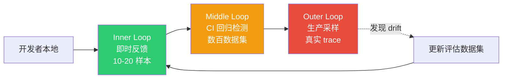
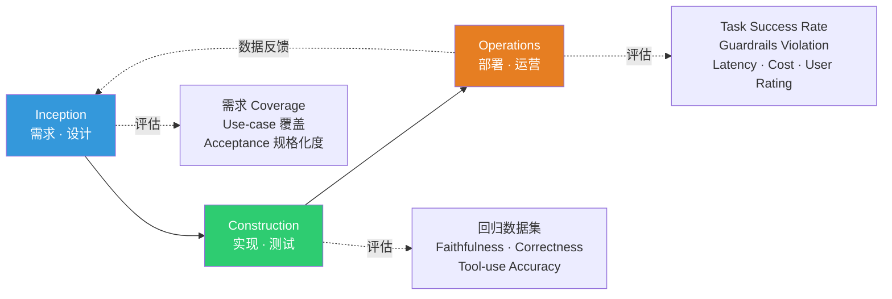
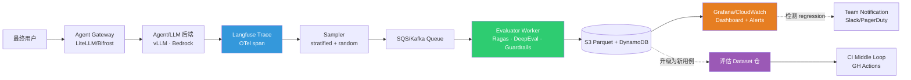

# AIDLC Evaluation Framework

> **阅读时间**: 约 12 分钟

AIDLC (AI Development Life Cycle) 与传统 SDLC 不同,处理 **概率性 (stochastic) 产物**。对同一输入,LLM/Agent 响应会变化,一次单元测试通过并不保证 "永远正确"。本文整理截至 2026-04 的实战基准、工具、架构,说明如何在 AIDLC 三重循环 (Inner/Middle/Outer) 中嵌入评估 (Evaluation)。

---

## 1. 为什么采用 Evaluation-driven Loop

### 1.1 SDLC TDD vs AIDLC Evaluation-driven

| 项 | 传统 SDLC (TDD) | AIDLC (Evaluation-driven) |
|----|------------------|--------------------------|
| 产物性质 | Deterministic (相同输入 → 相同输出) | Stochastic (相同输入 → 分布) |
| 正确性定义 | 单一 expected value | 容忍区间 + 质量指标分布 |
| 失败信号 | Assertion 失败 = bug | 指标下降 = drift · regression · 质量可疑 |
| 可复现性 | 100% 可复现 | 固定 seed/temperature 则近似可复现 |
| 门禁条件 | 全部测试 green | 评估指标达阈值 (如 Faithfulness ≥ 0.90) |
| 循环周期 | 按提交 | 提交 + 数据集替换 + 生产采样 |

若说 TDD 是 "写失败测试 → 实现 → 重构" 的循环,AIDLC 的 Evaluation-driven Loop 则是 "**评估数据集 → 代理/提示/模型变更 → 指标对比 → 门禁通过**"。单次功能追加可能在 10 个指标中降低 2 个,因此默认需要 **多维指标看板**,而非简单 pass/fail。

### 1.2 从学习到部署流程的 CI 角色

在传统 SDLC,CI 指的是 "构建 + 单元测试"。AIDLC 中 CI 的任务扩展:

1. 当提示 / 代理 / 模型有提交时,与评估数据集基线对比
2. 确认核心指标 (faithfulness、task success rate、tool-use accuracy 等) 在允许范围
3. 成本指标 (token · latency) 亦检查是否回归
4. 判断相对生产样本是否存在 drift
5. 通过门禁后才进入部署流水线

也就是说,CI 从 **"代码能否编译"** 变成 **"代理是否仍保持质量"**。

### 1.3 与 Inner / Middle / Outer Loop 的关系

AIDLC 将评估分为三层,以组合成本 · 速度 · 准确度。



- **Inner Loop (数秒 ~ 数分钟)**: 开发者修改单个提示 / 函数时,用 10-20 样本即时检测局部回归。promptfoo、基于 pytest 的工具适用
- **Middle Loop (数分钟 ~ 几十分钟)**: 以 PR 为单位 CI。用数百数据集运行 Ragas/DeepEval,检查与基线的容差。由 GitHub Actions/CodeBuild 执行
- **Outer Loop (持续)**: 对生产 trace 采样做异步评估。监控 drift · regression · safety violation,并定期更新评估数据集

---

## 2. 公共基准 (截至 2026-04)

AIDLC 仅靠各团队数据集难以横向比较全貌。**公开基准** 起到外部参考作用。

### 2.1 编码 Agent 专项基准

| 基准 | 规模 | 重点 | 2026-04 SOTA | URL |
|------|------|------|---------------|-----|
| **SWE-bench Verified** | 500 个 human-verified GitHub issue | 真实 PR 风格 bug 修复 | 70%+ pass@1 (头部 Agent) | [swebench.com](https://www.swebench.com/) |
| **SWE-bench Multimodal** | 含截图的 Web UI bug 修复 | 视觉 + 代码结合 | 初期 | [swebench.com/multimodal](https://www.swebench.com/multimodal.html) |
| **TerminalBench** | 真实 shell/CLI 任务 | 终端操作 · 文件系统 | ~50% 成功率 | [tbench.ai](https://www.tbench.ai/) |
| **AgentBench** | 8 个环境 (OS、DB、KG、Web 等) | Multi-turn tool use | 各模型差异大 | [github.com/THUDM/AgentBench](https://github.com/THUDM/AgentBench) |
| **MLE-bench** | 75 个 Kaggle 风格 ML 任务 | 端到端 ML 工程 | 以获牌率为指标 | [github.com/openai/mle-bench](https://github.com/openai/mle-bench) |

- **SWE-bench Verified** 是 Princeton + OpenAI 于 2024 年人工复核的 500 个 issue,截至 2026-04 是事实上比较 Agent 能力的标准基准
- **MLE-bench** 是 OpenAI 公开的 ML 工程能力评估,衡量模型在 Kaggle 风格任务中获得奖牌的程度

#### SWE-bench Verified 结构

原始 SWE-bench (2,294 个) 难度 · 可复现性偏差大,Verified 500 个以下列标准筛选:

1. **规格清晰度**: issue 描述 · 复现步骤人类可读
2. **测试可靠性**: 评估测试能精确捕获 bug (剔除 flaky)
3. **环境可复现**: 容器镜像确定性可复现
4. **范围适度**: 排除过宽或不可完成的用例

从 AIDLC 视角看,它是单一公开基准,能评估 Agent 在 "规格 → 设计 → 实现 → 验证" 周期上能否以 **真实 PR 单元** 完成。

#### 使用基准时注意事项

- **训练污染 (Training Contamination)**: 公开基准可能已包含在预训练数据 → 搭配 LiveCodeBench 这类定期新增题目的基准使用
- **样本量与显著性**: 500 issues 下 A 68%、B 70% 的差别可能不显著 → 用 bootstrap CI 判断
- **成本与区分度**: 顶级模型一次评估可达数千美元规模 — 不适合每次 PR 运行。可以周 / 发布级别执行

### 2.2 通用 LLM/推理基准 (参考)

不直接用于编码 Agent,但可作为模型选型的初筛。

| 基准 | 重点 | 注意 |
|------|------|------|
| **MMLU-Pro** | 14 个领域五选一专业知识 (MMLU 改进版) | 2026-04 顶级模型收敛至 80%+,区分度下降 |
| **GPQA Diamond** | 研究生级科学题 (198) | 常用于 Google/OpenAI 推理专用模型评估 |
| **MATH** | 高中竞赛数学 | 接近饱和 |
| **HumanEval / HumanEval+** | Python 函数生成 | 几近饱和,建议替换为 LiveCodeBench |
| **LiveCodeBench** | 实时更新的编程题 | 用于防训练污染,按月追加 |

> **注意**: 不要仅凭基准分数判定服务质量。实务基准是 **领域数据集 + 公开基准组合**。

### 2.3 METR task-length doubling

METR (Model Evaluation & Threat Research) 在 "Measuring AI Ability to Complete Long Tasks" 研究中提出重要观察:

- 模型能完成的 **连续任务长度每 ~7 个月翻倍**
- 2019 年为数秒级 → 2024-2025 年达几十分钟 → 若趋势延续,2027-2028 年可能达数小时
- 测量方法: HCAST (Human-Calibrated Autonomy Software Tasks) 等以人类用时为基准,估算 "Agent 以 50% 成功率能完成的任务长度"

企业视角的意义:

1. 今日 "人耗时一小时" 的业务即使目前不自动化,1-2 年内也可能越过临界点
2. 评估数据集需定期扩充 **更长任务 (long-horizon task)**
3. Guardrails · Audit · HITL 体系应随任务长度同步强化

URL: [metr.org/blog/2025-03-19-measuring-ai-ability-to-complete-long-tasks](https://metr.org/blog/2025-03-19-measuring-ai-ability-to-complete-long-tasks/)

---

## 3. 评估工具对比 (截至 2026-04)

从 AIDLC Middle Loop 视角 (CI 集成、生产对接) 做详细对比。

| 工具 | 许可 | 主要指标 | CI 集成 | 生产采样 | 优点 | 局限 |
|------|------|----------|---------|----------|------|------|
| **Ragas v0.2+** | Apache 2.0 | faithfulness、context_precision、context_recall、answer_relevancy、noise_sensitivity | Python SDK、GH Actions、CodeBuild | 官方支持 (对接 Langfuse/Phoenix) | RAG 评估最成熟,参考丰富 | LLM-as-judge 调用成本 |
| **DeepEval** | Apache 2.0 | 30+ (G-Eval、Toxicity、PII、Hallucination、Bias、Correctness 等) | PyTest-like DSL (`@pytest.mark.llm_eval`) | 自家 Confident AI | PyTest 用户最亲切、自定义指标 DSL | 生态成熟度中等,部分指标需校验 |
| **LangSmith** | SaaS + self-host beta | Trace、Dataset、Auto/Custom Evaluator、LLM-as-judge | `langsmith evaluate` CLI、GH Actions | 托管 (LangChain 原生) | LangChain/LangGraph 集成、A/B 实验管理 | 依赖 SaaS、数据治理问题 |
| **Braintrust** | SaaS + self-host Enterprise | Dataset、Grading、Replay、Playground | `braintrust eval` CLI | 托管、log SDK | 开发者体验出色、Playground UX 优秀 | 供应商绑定、本地部署受限 |
| **AWS Labs aidlc-evaluator** | Apache 2.0 (early, v0.1.6+) | AIDLC 阶段产物合规度 · Common Rules 合规 · Stage Transition 指标 | `scripts/` 执行 (Python) | - | 专评 AIDLC 方法论合规 | 缺少通用质量指标 → 需与 Ragas/DeepEval 同用 |
| **Promptfoo** | MIT | Assertions、LLM-as-judge、classifiers | YAML 配置 + `promptfoo eval` + GH Actions | 部分 | 轻量 · 声明式、擅长 prompt 对比 | 对 Agent 评估 · 复杂工作流有限 |
| **Inspect AI (UK AISI)** | Apache 2.0 | Agent safety/capability (solver + scorer) | Python/CLI、GH Actions | - | 政府机构基准、支持 sandbox 执行 | 有学习曲线、社区规模不大 |

### 3.1 工具选择指南

- **RAG 管道为主** → Ragas + Langfuse (开源组合)
- **以 Python/PyTest 为中心** → DeepEval
- **使用 LangChain/LangGraph** → LangSmith (原生)
- **顶级 DX + 团队实验管理** → Braintrust
- **自审 AIDLC 方法论合规** → AWS Labs aidlc-evaluator
- **单纯 prompt A/B 比较** → Promptfoo
- **评估 Agent safety/capability** → Inspect AI

> 实务中常用的是 **Ragas (质量) + Inspect AI (safety) + aidlc-evaluator (方法论合规)** 或 **Braintrust (实验) + Langfuse (可观测性)** 等 2-3 个组合。

### 3.2 Ragas v0.2+ 核心指标

| 指标 | 含义 | 计算概要 |
|------|------|----------|
| Faithfulness | 回答是否基于 retrieved context | 将回答拆为 claim → 统计各 claim 被 context 支持的比例 |
| Context Precision | 检索文档中与正确答案相关比例 | 反映 top-k 顺序的 MAP 风格计算 |
| Context Recall | 是否检索到了正确答案所需的信息 | 将 ground truth 拆为句子 → context 的覆盖率 |
| Answer Relevancy | 回答是否符合问题意图 | 从回答生成回问题,与原问题嵌入相似度 |
| Noise Sensitivity | 注入无关文档时回答是否改变 | RAG 管道鲁棒性指标 |

RAG 管道中 "检索质量" 与 "生成质量" 相互纠缠,难以诊断,Ragas 的指标组合能帮你拆解。例如:Faithfulness↓ · Context Precision↑ → **生成阶段幻觉**;Context Precision↓ → **检索失败**。

### 3.3 DeepEval 与 PyTest 集成

DeepEval 的 `@pytest.mark.llm_eval` 与 `assert_test()` 可将评估用例嵌入既有 PyTest 流水线。结果可发送到 Confident AI 面板或存为本地 JSON。

- **G-Eval**: 用自然语言写 rubric,由 LLM-as-judge 打分
- **Hallucination / Bias / Toxicity**: 内置安全性指标
- **Custom Metric DSL**: 继承 `BaseMetric` 实现团队专有标准

### 3.4 LangSmith / Braintrust — SaaS 实验管理

大型团队要体系化实验 10-20 个提示组合 · 3-5 个模型组合时需要。共同功能:

- 数据集版本管理 (类 Git)
- run 级 trace 存储与 side-by-side 对比
- A/B 实验分组
- 在 Playground 直接编辑失败 trace 并重放
- Evaluator 结果与历史 run 的时间序列对比

**差异**: LangSmith 原生对接 LangChain/LangGraph,Braintrust 与框架无关并专注 DX。若强需本地部署,可考虑 self-host 选项或用 Langfuse (开源) 替代。

### 3.5 AWS Labs aidlc-evaluator — 方法论合规审计

不是通用质量指标,而专审 **"该项目是否真的遵循 AIDLC 方法论"**。

- Common Rules 是否应用 (产物文件名 · 结构 · 审批检查点)
- Stage Transition 基准是否满足 (Inception → Construction 转换前产物完整性)
- Extension (opt-in.md) 是否遵循
- 检测组织自定义规则违反

v0.1.x 阶段通用性 · 稳定性有限,但若组织已把 AIDLC 作为标准,它是唯一能与 Ragas/DeepEval 并行在 CI 监视方法论合规度的工具。

---

## 4. CI/CD 集成模式

### 4.1 Inner Loop — 开发者本地

- 工具: `pytest-deepeval`、`promptfoo`、`ragas.evaluate()` 行内调用
- 数据: 10-20 样本 (smoke set)
- 周期: 保存代码时 pre-commit 或 `make eval-fast`
- 目的: 立即阻断致命回归,秒级反馈

```python
# Inner Loop 示例 — DeepEval smoke test
import pytest
from deepeval import evaluate
from deepeval.metrics import FaithfulnessMetric, AnswerRelevancyMetric
from deepeval.test_case import LLMTestCase

@pytest.mark.llm_eval
def test_rag_smoke():
    cases = [LLMTestCase(input=q, actual_output=run_pipeline(q), retrieval_context=ctx)
             for q, ctx in smoke_dataset]
    metrics = [FaithfulnessMetric(threshold=0.85), AnswerRelevancyMetric(threshold=0.80)]
    evaluate(cases, metrics)
```

### 4.2 Middle Loop — CI (GitHub Actions)

- 工具: Ragas + DeepEval + 阈值门禁
- 数据: 200-500 回归数据集 (领域特化 + 公开基准子集)
- 周期: PR、合入 main 时
- 目的: 回归检测、变更影响可视化、部署门禁

```yaml
# .github/workflows/eval.yml (节选)
name: LLM Regression Eval
on: [pull_request]
jobs:
  eval:
    runs-on: ubuntu-latest
    steps:
      - uses: actions/checkout@v5
      - uses: actions/setup-python@v6
        with: {python-version: '3.12'}
      - run: pip install -r requirements-eval.txt
      - name: Run Ragas regression
        env:
          OPENAI_API_KEY: ${{ secrets.OPENAI_API_KEY }}
        run: python eval/run_ragas.py --dataset eval/datasets/regression.jsonl --out results.json
      - name: Gate on thresholds
        run: python eval/gate.py results.json \
               --faithfulness 0.90 --context-precision 0.85 --answer-relevancy 0.85
      - uses: actions/upload-artifact@v4
        with: {name: eval-results, path: results.json}
```

- `gate.py` 在阈值不达时 `exit 1`,阻塞 PR
- 结果作为 artifact 上传,并推送至 Langfuse/Braintrust 看板

### 4.3 Outer Loop — 生产采样

- 工具: Langfuse trace → SQS/Queue → 异步 evaluator → S3/DB → Grafana
- 数据: 从生产 trace 按统计方式采样 (随机 + 分层)
- 周期: 持续 (按小时聚合)
- 目的: drift 检测、safety violation 早期告警、更新评估数据集

> 离线 CI 捕捉 "基于历史数据集的回归",生产采样捕捉 "现实分布变化"。分开运营才能区分 **Concept drift vs Code regression**。

---

## 5. AIDLC 各阶段的评估布置



### 5.1 Inception

- **需求 Coverage Evaluation**: 度量 `requirements.md` 定义的 use-case 被评估数据集覆盖的比例
- **AIDLC Common Rules 合规**: 用 `aidlc-evaluator` 检查产物格式 · Extension 合规
- **Acceptance Criteria 规格化**: 把模糊的 "工作正常" 转换为可度量指标 (如 "faithfulness ≥ 0.90、p95 延迟 ≤ 3s")

### 5.2 Construction

- **维护 Regression Dataset**: 以提交为单位运行的 200-500 用例
- **基于 Ground-truth 的指标**: Correctness、Exact-match、Tool-use precision/recall
- **LLM-as-judge 指标**: Faithfulness、Relevancy、Toxicity
- **预算 / 成本指标**: 对 token · 延迟回归也用同一数据集测量
- **Stage Transition Gate**: Construction → Operations 转换前核心指标 Green

### 5.3 Operations

- **生产可观测性**: Langfuse/Phoenix trace、OTel span attributes (model、tokens、latency)
- **Guardrails Violation Rate**: PII 泄露 · 提示注入 · Toxicity 阈值违反比例
- **Task Success Rate**: 端到端任务成功率 (用户确认或 heuristic)
- **Feedback Loop**: 将失败 trace 升级为新评估用例 (Dataset 更新管道)

### 5.4 Stage Transition Gate 清单

| 转换 | 必备条件 | 评估工具 |
|------|----------|----------|
| Inception → Construction | 需求 coverage ≥ 95% · Acceptance 基准可度量 · AIDLC Common Rules 合规 | aidlc-evaluator + 人工评审 |
| Construction → Operations | 回归数据集主要指标 ≥ baseline · p95 延迟达标 · 通过安全扫描 | Ragas/DeepEval + CI gate |
| Operations 持续运营 | 生产指标无 drift · Guardrails violation rate 在阈值以下 | Langfuse + 异步 evaluator |

各阶段转换点需同时要求 **自动门禁 (指标阈值) + 人工审批 (Checkpoint Approval)**。仅靠自动门禁无法识别 "指标通过但实际质量不足"。

---

## 6. 回归检测 · 告警策略

### 6.1 设定 Baseline

- 指定特定 git tag 或月度快照为 "golden baseline"
- 记录各指标的 mean/std/95th percentile
- 新运行以相对于基线的变化做报告

### 6.2 统计显著性

- 样本 ≤ 200 时 **bootstrap confidence interval** 更实际 (正态性假设不稳)
- p-value 作辅助。小样本数据集应并行 **效应量 (Cohen's d、Δmean/σ)**
- 多重比较问题: 同时看多指标时应用 Bonferroni 或 BH 校正

### 6.3 阈值门禁示例

| 指标 | 下限 | 动作 |
|------|------|------|
| Faithfulness | < 0.90 | 阻塞 PR |
| Context Precision | < 0.85 | 阻塞 PR |
| Toxicity | > 0.01 | 阻塞 PR + 通知安全团队 |
| PII Leak Rate | > 0 | 立即回滚 |
| Task Success Rate | baseline - 5 个百分点 | 告警、人工审视 |
| p95 Latency | +20% | 告警 |
| Cost per task | +15% | 告警 |

### 6.4 控制告警噪声

- 用 **指数加权移动平均 (EWMA)** 缓和一次性尖峰
- 同一告警 30 分钟内去重
- 分级: Blocker / Warning / Info 各走不同通道
- 每周回顾误报率并调优阈值

### 6.5 区分 Drift 类型

生产端观测到的质量下降大致分三类,应对路径不同。

| Drift 类型 | 信号 | 原因示例 | 首要应对 |
|-----------|------|----------|----------|
| Data Drift | 输入分布变化、主题漂移 | 新品类上市、季节性 | 更新评估数据集 |
| Concept Drift | 同一问题的正解本身变了 | 政策变化、版本更新 | 重新打 Ground truth |
| Model Drift | 外部 API 模型更新导致行为变 | OpenAI/Anthropic 版本静默更新 | 固定模型 + shadow 评估 |

Data Drift 以增强 coverage,Concept Drift 以重写 ground truth,Model Drift 以使用固定版本并对新版本做 shadow。

---

## 7. 成本考量

### 7.1 LLM-as-judge 成本结构

- 每用例 2-5 次评估调用 (指标数) × judge 模型 token × 数据集大小
- 500 数据集 × 5 指标 × GPT-4o: **单次运行数千 ~ 数万 token** 级
- 若 CI 每 PR 运行月度费用显著 — 需设定费用上限

### 7.2 成本节省策略

1. **降级 judge 模型**: GPT-4o → GPT-4o-mini 或 Claude 3.5 Haiku 做一次判断,仅边界用例交给更高级模型
2. **本地 Evaluator 模型**: Prometheus-Eval、Ragas 内建轻量模型替代 Inner/Middle Loop
3. **采样策略**: 用分层抽样 100 替代 500 做 Middle Loop,每月 1 次 500 全量扫
4. **缓存**: 对相同 prompt + response 对的 judge 结果做缓存 (无输入变化则免重算)
5. **异步评估**: 把部分指标从 PR 阻塞切为 "Advisory"

### 7.3 性价比组合

| 团队规模 | 组合 | 月度预估费用 |
|----------|------|--------------|
| 小型 (&lt;5 人) | Ragas 本地 + Langfuse OSS + Haiku judge | $50-200 |
| 中型 (5-20 人) | Ragas + DeepEval + Langfuse + Haiku/4o-mini | $300-1,500 |
| 大型 (20+) | Braintrust SaaS 或 LangSmith + 4o judge | $2,000-10,000+ |

### 7.4 成本估算工作表

编制预算时可用以下公式把握组织规模感:

```
月度评估成本 ≈
  (CI 运行次数/月 × 数据集规模 × 指标数 × judge token 单价)
+ (生产 trace 数/月 × 采样率 × 指标数 × judge token 单价)
+ (每周公开基准执行成本)
```

示例: 月 50 次 PR、200 用例数据集、5 指标、judge 平均 2k tokens、GPT-4o-mini 单价 → 仅 CI 部分约 50 × 200 × 5 × 2,000 tokens = 100M tokens/月。从这一量级起,降级 judge 与采样策略是必需。

---

## 8. 生产采样架构

对真实运维场景的 **trace → 异步评估 → 看板** 参考架构。



### 8.1 核心设计点

- **分层采样**: 随机 5% + 错误/低评分 trace 100% + 高成本 trace 100% — 关键 trace 不遗漏
- **异步解耦**: 评估调用不影响生产延迟,用 Queue 解耦
- **数据治理**: PII 过滤后落 S3,KMS 加密,记录访问日志
- **反馈循环**: 把失败 trace 升级到 **Dataset 仓**,下一 CI 周期合入回归用例
- **观测一致**: 用 Langfuse trace ID 作为共享键,打通线上 / 线下关联分析

### 8.2 部署位置

- **EKS 基**: Langfuse (Helm)、Evaluator Worker (Karpenter 弹性)、Grafana Operator
- **AWS Native**: Bedrock Agent + CloudWatch + SQS + Lambda Evaluator (小规模)
- **混合**: Edge 放 filter/sampler,中央 EKS 跑 Evaluator 与 Dashboard

### 8.3 采样 · 评估 Worker 伪代码

```python
# sampler.py — 分层采样
def should_sample(trace):
    if trace.error or trace.user_rating is not None and trace.user_rating <= 2:
        return True  # 负面信号 100%
    if trace.estimated_cost_usd > 0.50:
        return True  # 高成本 trace 100%
    return random.random() < 0.05  # 其余 5% 随机

# worker.py — 异步 evaluator
def evaluate_trace(trace_id):
    trace = langfuse.fetch_trace(trace_id)
    cases = [LLMTestCase(input=trace.input, actual_output=trace.output,
                         retrieval_context=trace.retrieved_docs)]
    result = ragas.evaluate(cases, metrics=[faithfulness, answer_relevancy])
    store_result(trace_id, result, target="s3://eval-results/")
    if result.faithfulness < 0.85:
        promote_to_dataset(trace, dataset="regression_v2")
        alert_team(trace_id, severity="warning")
```

### 8.4 安全与治理

- **PII 掩码**: 采样阶段过滤邮箱 / 身份证号 / 卡号模式,必要时用 Microsoft Presidio 等 PII 引擎
- **加密**: trace payload 用 KMS CMK 做服务器端加密,传输使用 TLS 1.3
- **访问控制**: 评估看板置于 IAM + SSO 后,启用审计日志 (CloudTrail)
- **保留期**: 原始 trace 保留 30-90 天,聚合指标长期保留 (Parquet 分区)
- **防数据泄露**: 调用外部 LLM judge 时在前置步骤仅发送去 PII 的摘要

### 8.5 扩展模式

1. **多租户分离**: 按团队划分 trace 命名空间与面板,公用 evaluator
2. **成本 - 性能帕累托监控**: 同一面板上追踪质量、成本、延迟的 Pareto front
3. **Human-in-the-Loop 集成**: 周期性把边界 trace 入队由人工标注,标注结果用于再训练 / 微调
4. **Shadow Traffic**: 把新模型 / 提示并行跑 X% 生产流量,对比指标,通过门禁后渐进晋升

---

## 9. 参考资料

### 官方文档 · 项目

- AWS Labs AIDLC Workflows — [github.com/awslabs/aidlc-workflows](https://github.com/awslabs/aidlc-workflows)
- AWS Labs AIDLC Evaluator (scripts) — [github.com/awslabs/aidlc-workflows/tree/main/scripts](https://github.com/awslabs/aidlc-workflows/tree/main/scripts)
- Ragas 官方文档 — [docs.ragas.io](https://docs.ragas.io/)
- DeepEval — [github.com/confident-ai/deepeval](https://github.com/confident-ai/deepeval)
- LangSmith — [docs.smith.langchain.com](https://docs.smith.langchain.com/)
- Braintrust — [braintrust.dev/docs](https://www.braintrust.dev/docs)
- Promptfoo — [promptfoo.dev](https://www.promptfoo.dev/)
- Inspect AI (UK AISI) — [inspect.ai-safety-institute.org.uk](https://inspect.ai-safety-institute.org.uk/)

### 基准

- SWE-bench Verified — [swebench.com](https://www.swebench.com/)
- SWE-bench Multimodal — [swebench.com/multimodal](https://www.swebench.com/multimodal.html)
- TerminalBench — [tbench.ai](https://www.tbench.ai/)
- AgentBench — [github.com/THUDM/AgentBench](https://github.com/THUDM/AgentBench)
- MLE-bench — [github.com/openai/mle-bench](https://github.com/openai/mle-bench)
- LiveCodeBench — [livecodebench.github.io](https://livecodebench.github.io/)
- GPQA — [github.com/idavidrein/gpqa](https://github.com/idavidrein/gpqa)
- MMLU-Pro — [github.com/TIGER-AI-Lab/MMLU-Pro](https://github.com/TIGER-AI-Lab/MMLU-Pro)

### 研究报告

- METR — Measuring AI Ability to Complete Long Tasks — [metr.org/blog/2025-03-19-measuring-ai-ability-to-complete-long-tasks](https://metr.org/blog/2025-03-19-measuring-ai-ability-to-complete-long-tasks/)
- METR HCAST — [metr.org/blog/2025-01-27-hcast](https://metr.org/blog/2025-01-27-hcast/)

### 内部文档

- [AIDLC 方法论](/docs/aidlc/methodology)
- [AI 编码代理](./ai-coding-agents.md)
- [技术路线图](./technology-roadmap.md)
- [LLMOps Observability](/docs/agentic-ai-platform/operations-mlops/observability/llmops-observability)
- [Ragas Evaluation](/docs/agentic-ai-platform/operations-mlops/governance/ragas-evaluation)
