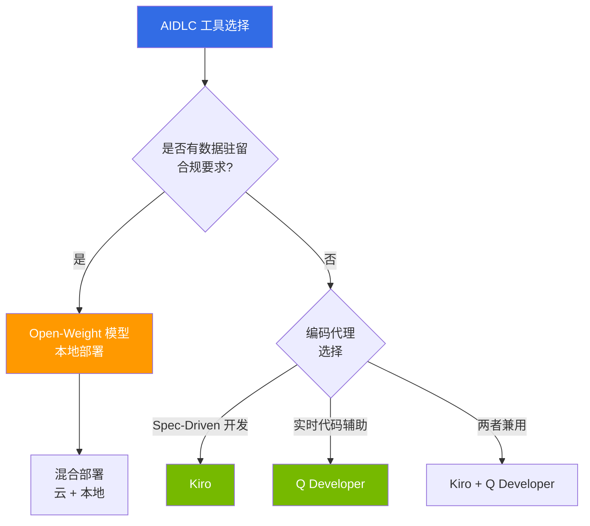

tags: [aidlc, toolchain, 'scope:toolchain']
---
title: "工具与实现"
sidebar_label: "工具与实现"
description: "实现 AIDLC 的工具 — AI 编码代理、Open-Weight 模型、EKS 自动化、技术路线图"
last_update:
  date: 2026-04-18
  author: devfloor9
---

# AIDLC 工具与实现

> **阅读时间**: 约 2 分钟

本章节介绍在实际项目中实施 AIDLC [方法论](/docs/aidlc/methodology) 所需的工具与技术栈。从 AI 编码代理、Open-Weight 模型落地、基于 EKS 的声明式自动化到技术投资路线图,提供达到实操水平的指南。

## 组成

| 文档 | 核心内容 | 目标读者 |
|------|----------|----------|
| [AI 编码代理](./ai-coding-agents.md) | Kiro Spec-Driven 开发、Q Developer、代理对比 | 开发者、技术负责人 |
| [Open-Weight 模型](./open-weight-models.md) | 本地部署、云 vs 自托管 TCO、数据驻留 | 架构师、安全负责人 |
| [EKS 声明式自动化](./eks-declarative-automation.md) | Managed Argo CD、ACK、KRO、Gateway API | 开发者、DevOps |
| [技术路线图](./technology-roadmap.md) | Build-vs-Wait 决策矩阵、投资规划 | CTO、企业架构师 |

## 工具选择决策

