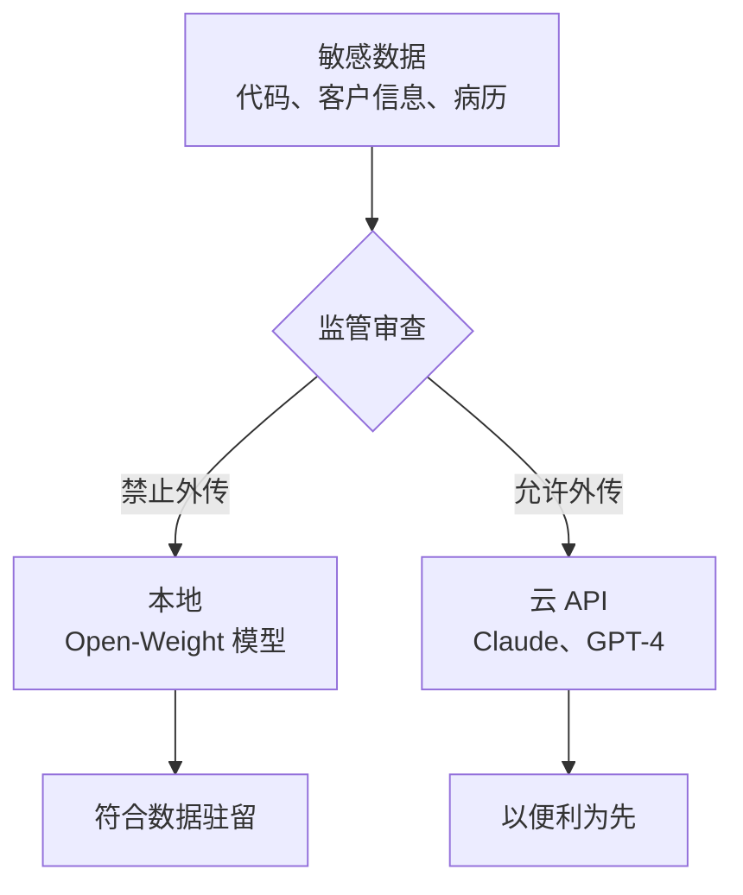
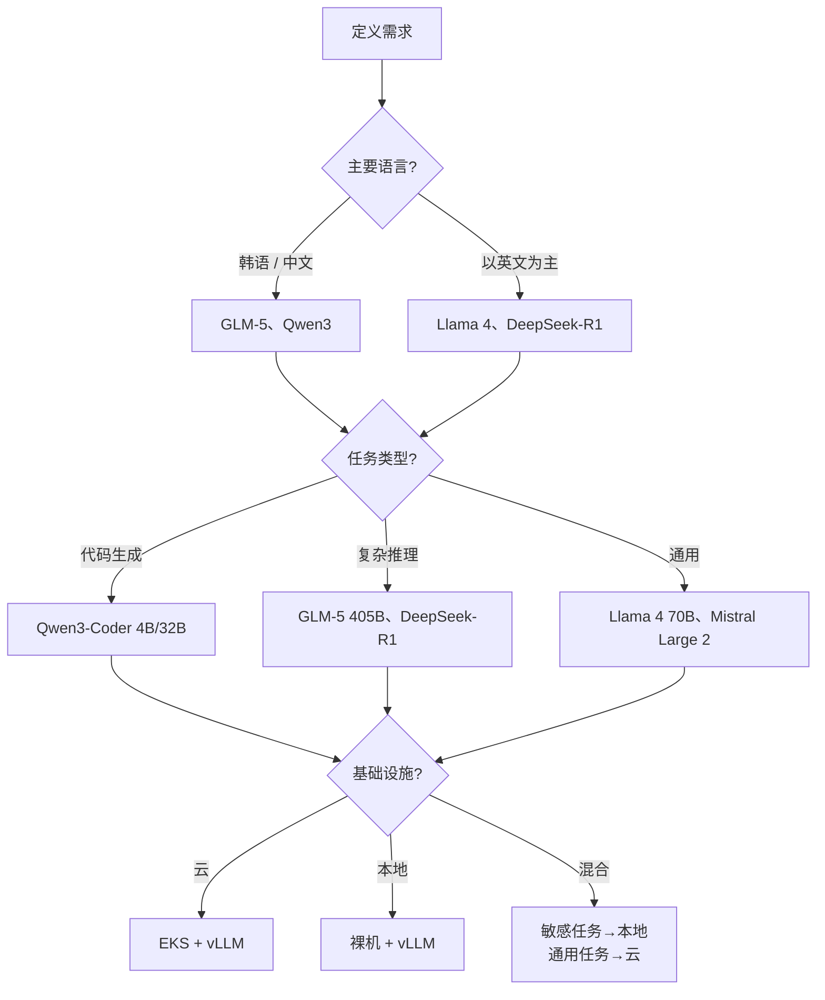
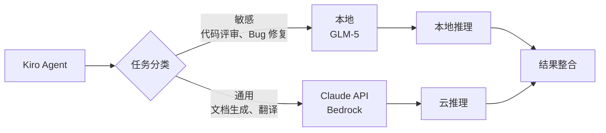
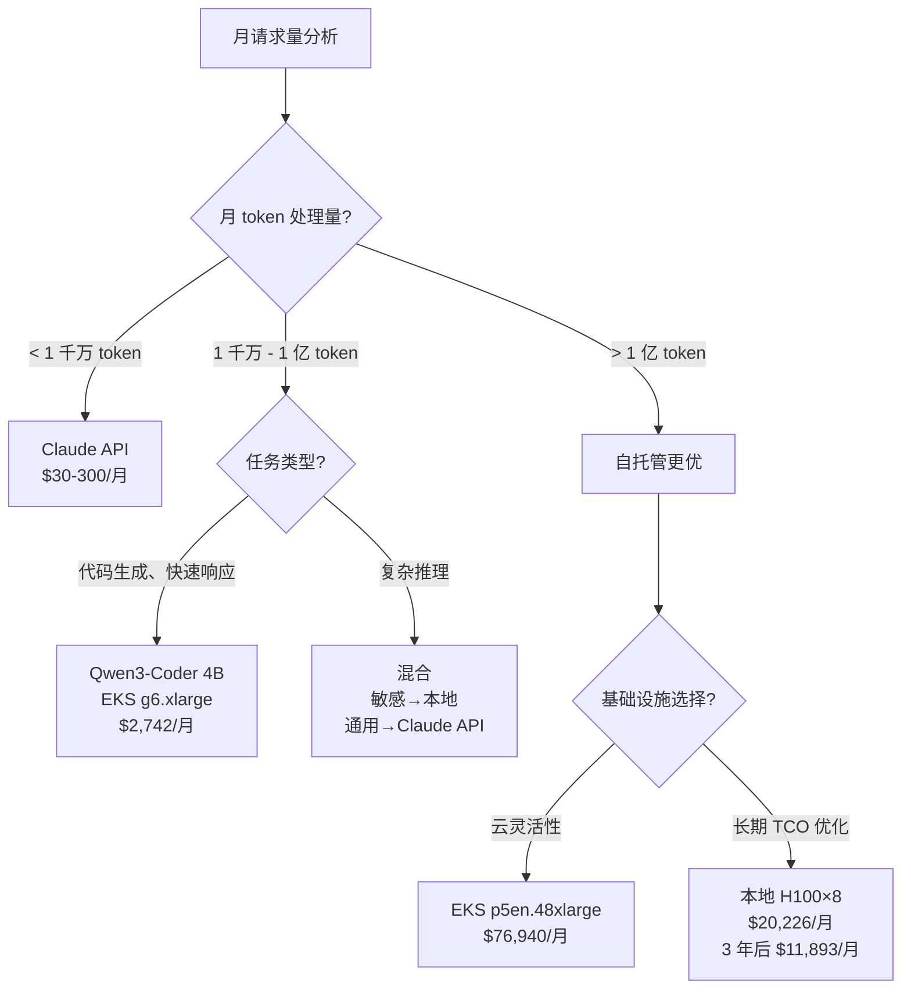

# Open-Weight 模型

在企业环境中运行 AI 开发生命周期 (AIDLC) 时,数据驻留与成本效率是核心决策点。相较云 API (Claude、GPT-4),Open-Weight 模型可带来三大差异化价值: **保障数据主权**、**可预测的 TCO**、**领域特化定制**。

## 为什么选 Open-Weight 模型

### 三大核心驱动

#### 1. 数据驻留要求

金融、医疗、公共部门因监管禁止敏感数据外传。

- **合规义务**: GDPR、HIPAA、金融业个人信息保护法对数据处理位置有严格限制
- **保护内部代码库**: 不把源代码外发到外部 API,在本地处理
- **主权 AI (Sovereign AI)**: 国家 / 企业自主掌控 AI 推理基础设施



#### 2. 成本优化

当月处理 token 超过数百万时,自托管 Open 模型可能比云 API 便宜。

- **摆脱按量计费**: 不再按调用次数付费,转为固定基础设施费用
- **最大化 GPU 利用率**: 24 小时运维下最小化空闲时间
- **盈亏平衡点**: 处理超过每月 1 亿 token 时自托管更优 (受 GPU 类型影响)

#### 3. 领域定制

Open-Weight 模型可通过微调、提示工程、Ontology 注入面向特定领域优化。

- **提升专业术语准确度**: 强化医疗、法律、金融术语处理
- **控制输出格式**: 遵守 JSON schema、代码风格指南
- **Ontology 集成**: 与 [Ontology 工程](../methodology/ontology-engineering.md) 结合注入领域知识

## 模型图谱 (2026 年 4 月)

| 模型 | 提供方 | 参数量 | 主要特点 | 许可 | 建议部署 |
|------|--------|--------|----------|------|----------|
| **GLM-5** | THUDM | 405B | 多语言 (韩 / 中 / 英) 强、数学 / 推理佳 | Apache 2.0 | p5en.48xlarge (H200×8) |
| **Qwen3-Coder** | Alibaba | 4B-32B | 编码特化、推理快 | Apache 2.0 | g6.xlarge (L4×1) |
| **Qwen3-235B** | Alibaba | 235B | MoE 架构、多模态 | Apache 2.0 | p5.48xlarge (H100×8) |
| **DeepSeek-R1** | DeepSeek | 671B | 擅长 CoT 推理、基于 RL 训练 | MIT | p5en.48xlarge (H200×8) |
| **Llama 4** | Meta | 70B-405B | 生态广、性能稳 | Llama 4 License | p4d.24xlarge (A100×8) |
| **Mistral Large 2** | Mistral | 123B | 考虑欧洲数据主权设计 | Mistral License | p4d.24xlarge (A100×8) |

### 选型标准



## 部署模式

### 模式 1: EKS + vLLM 服务 (云)

在云上运行 Open 模型,保留数据驻留的同时把基础设施管理交给 AWS。

```yaml
# GLM-5 405B 部署示例 (EKS Standard Mode)
apiVersion: apps/v1
kind: Deployment
metadata:
  name: glm5-vllm
spec:
  replicas: 1
  template:
    spec:
      nodeSelector:
        node.kubernetes.io/instance-type: p5en.48xlarge
      containers:
      - name: vllm
        image: vllm/vllm-openai:v0.18.2
        args:
        - --model
        - THUDM/glm-5-405b
        - --served-model-name
        - glm5
        - --tensor-parallel-size
        - "8"
        - --max-model-len
        - "8192"
        - --trust-remote-code
        resources:
          limits:
            nvidia.com/gpu: "8"
```

**优点**:
- 利用 Auto Scaling、Spot 实例节省成本
- 通过 Karpenter 实现动态节点配置
- CloudWatch、Prometheus 集成监控

**缺点**:
- GPU 实例按小时收费 (p5en.48xlarge: ~$98/h)
- 数据留在 VPC 内,但基础设施仍依赖云

### 模式 2: 本地裸机 + vLLM

需要完整数据主权或禁止外发到云时使用。

```bash
# 在 NVIDIA H100×8 服务器上部署 vLLM
docker run --gpus all \
  -p 8000:8000 \
  -v /data/models:/models \
  vllm/vllm-openai:v0.18.2 \
  --model /models/glm-5-405b \
  --served-model-name glm5 \
  --tensor-parallel-size 8 \
  --max-model-len 8192 \
  --trust-remote-code
```

**基础设施要求**:
- GLM-5 405B: H100 8 张或 H200 8 张 (FP16 ~810GB VRAM)
- Qwen3-Coder 4B: L4 1 张 (FP16 ~8GB VRAM)
- 网络: 仅内网专用终端,无需外部互联网

**优点**:
- 绝对数据掌控
- 网络时延最小化 (企业内 10G 网络)
- 长期可节省云费用

**缺点**:
- 资本性支出 (CapEx) 高 (H100 服务器 ~$300K)
- 需运维人员 (GPU 管理、模型更新)
- 空闲时段也消耗电力

### 模式 3: 混合架构

按任务敏感度混合使用本地与云 API。



**实现示例 (LiteLLM 路由)**:

```yaml
# litellm-config.yaml
model_list:
  - model_name: sensitive-tasks
    litellm_params:
      model: openai/glm5
      api_base: http://on-prem-vllm.internal:8000/v1
      api_key: dummy
  - model_name: general-tasks
    litellm_params:
      model: bedrock/anthropic.claude-sonnet-4-20250514
      aws_region_name: us-east-1

router_settings:
  routing_strategy: simple-shuffle
  fallbacks:
    - sensitive-tasks: []  # 无降级 (禁止外传)
    - general-tasks: [openai/gpt-4o]
```

## TCO 对比框架

### 成本项

#### 云 API (Claude、GPT-4)

| 项 | Claude Sonnet 4.5 | 备注 |
|----|-------------------|------|
| 输入 token | $3/1M tokens | Bedrock |
| 输出 token | $15/1M tokens | 输出比输入贵 5 倍 |
| 运维人力 | $0 | 无需管理 |
| 初期投入 | $0 | 按量付费 |

**月度费用示例**:
- 月 5 千万输入 + 1 千万输出 token
- 输入: 50M × $3/1M = $150
- 输出: 10M × $15/1M = $150
- 合计: **$300/月**

#### 自托管 Open 模型 (EKS + vLLM)

| 项 | Qwen3-Coder 4B (g6.xlarge) | GLM-5 405B (p5en.48xlarge) |
|----|---------------------------|-----------------------------|
| GPU 实例 | $1.01/h × 730h = $737/月 | $98/h × 730h = $71,540/月 |
| 存储 (模型) | ~$5/月 (8GB) | ~$400/月 (810GB) |
| 网络出口 | 内网免费 | 内网免费 |
| 运维人力 | 0.2 FTE (~$2,000/月) | 0.5 FTE (~$5,000/月) |
| 合计 | **~$2,742/月** | **~$76,940/月** |

**本地裸机 (3 年摊销)**:

| 项 | H100×8 服务器 | 备注 |
|----|---------------|------|
| 硬件 | $300,000 / 36 个月 = $8,333/月 | 初始 CapEx |
| 电力 | 10.2kW × $0.12/kWh × 730h = $893/月 | 电价因地区波动 |
| 数据中心 | ~$1,000/月 | 散热、空间 |
| 运维人力 | 1 FTE (~$10,000/月) | 24/7 响应 |
| 合计 | **~$20,226/月** | 3 年后扣除硬件约 ~$11,893/月 |

### 盈亏平衡指南



**决策标准**:

1. **< 月 1 千万 token**: 使用 Claude API 或 GPT-4 (无管理开销)
2. **月 1 千万~1 亿 token**: 按任务类型与敏感度混合
3. **> 月 1 亿 token**: 考虑自托管 (EKS 或本地)
4. **可投入 CapEx 且运营 3 年以上**: 本地裸机最便宜

## 与 AIDLC 的集成

### Kiro + Open-Weight 模型

[AI 编码代理 Kiro](./ai-coding-agents.md) 可使用 Open-Weight 模型作为后端执行 Spec-Driven 开发。

```typescript
// kiro-config.ts
export const kiroConfig = {
  models: {
    sensitive: {
      provider: 'vllm',
      endpoint: 'http://on-prem-vllm.internal:8000/v1',
      model: 'glm5',
      use_cases: ['code-review', 'security-audit', 'refactoring']
    },
    general: {
      provider: 'bedrock',
      model: 'anthropic.claude-sonnet-4-20250514',
      region: 'us-east-1',
      use_cases: ['documentation', 'translation', 'test-generation']
    }
  },
  routing: {
    strategy: 'by-file-path',
    rules: [
      { pattern: 'src/core/**', model: 'sensitive' },
      { pattern: 'docs/**', model: 'general' }
    ]
  }
};
```

### Steering 文件: 针对模型的提示优化

Open-Weight 模型因训练数据与架构不同,对同一提示可能有不同反应。

**面向 GLM-5 的 Steering 文件**:

```yaml
# .aider.glm5.yml
model: glm5
edit_format: diff
use_git: true
auto_commits: false
stream: true

# GLM-5 在中英韩混用时表现更佳
prompts:
  system: |
    你是专业的软件工程师。
    修改代码时必须以 unified diff 格式响应。
    说明用中文,技术术语保留英文原文。
```

**面向 Qwen3-Coder 的 Steering 文件**:

```yaml
# .aider.qwen3.yml
model: qwen3-coder
edit_format: whole
use_git: true

# Qwen3-Coder 整文件替换方式更稳定
prompts:
  system: |
    You are a coding assistant specialized in Python and TypeScript.
    Always return the complete modified file.
    Use type hints and follow PEP 8 style guide.
```

### Ontology 注入

将 [Ontology 工程](../methodology/ontology-engineering.md) 构建的领域 Ontology 注入 Open 模型上下文以提升准确度。

```python
# ontology_injection.py
from typing import Dict, List

class OntologyInjector:
    def __init__(self, ontology_path: str):
        self.ontology = self.load_ontology(ontology_path)
    
    def inject_context(self, prompt: str, domain: str) -> str:
        """将领域 Ontology 添加到提示中"""
        domain_terms = self.ontology.get(domain, {})
        
        context = "# Domain Knowledge\n"
        for term, definition in domain_terms.items():
            context += f"- {term}: {definition}\n"
        
        return f"{context}\n# Task\n{prompt}"
    
    def load_ontology(self, path: str) -> Dict[str, Dict[str, str]]:
        # 加载 JSON/YAML 格式的 Ontology 文件
        pass

# 使用示例
injector = OntologyInjector("/data/ontology/finance.yaml")
prompt = injector.inject_context(
    "请分析下列交易记录并找出异常模式。",
    domain="finance"
)
```

**收益**:
- 提升金融术语 (如套利、做空) 解读准确度
- 强化领域规则 (如 KYC、AML) 合规
- 用 Ontology 取代 Few-shot 示例,节省 token

## 安全与合规

### 模型许可审查

即便是 Open-Weight 模型,许可可能也限制商用。

| 许可 | 商用 | 衍生模型分发 | 注意 |
|------|------|--------------|------|
| **Apache 2.0** | ✅ 允许 | ✅ 允许 | 含专利保护条款 |
| **MIT** | ✅ 允许 | ✅ 允许 | 必须保留免责声明 |
| **Llama 4 License** | ✅ 允许 (MAU < 700M) | ⚠️ 有限 | 大规模服务需另行协商 |
| **Mistral License** | ✅ 允许 | ⚠️ 有限 | 分发微调模型需告知 |

**推荐流程**:
1. 与法务团队进行许可审核 (尤其 Llama、Mistral)
2. 追踪模型来源 (确认 Hugging Face Model Card)
3. 微调时一并检查数据集许可

### 输出审计

Open 模型训练数据可能包含敏感信息,需对输出做过滤。

```python
# output_filter.py
import re
from typing import List

class OutputFilter:
    def __init__(self):
        self.patterns = [
            (r'\b\d{3}-\d{2}-\d{4}\b', '[SSN-REDACTED]'),  # 韩国身份证号
            (r'\b[\w\.-]+@[\w\.-]+\.\w+\b', '[EMAIL-REDACTED]'),  # 邮箱
            (r'\b\d{4}-\d{4}-\d{4}-\d{4}\b', '[CARD-REDACTED]')  # 卡号
        ]
    
    def filter(self, text: str) -> str:
        """自动去除敏感信息"""
        for pattern, replacement in self.patterns:
            text = re.sub(pattern, replacement, text)
        return text
    
    def audit_log(self, text: str, redacted_count: int) -> None:
        """记录过滤历史"""
        # 发往 CloudWatch Logs 或 S3
        pass
```

### AI 基本法应对

欧洲 AI Act、韩国 AI 基本法 (AI 기본법) 等监管对高风险 AI 系统 (医疗、金融、招聘) 要求:

1. **可解释性**: 提供模型决策依据 (attention weights、RAG 来源)
2. **人工监督**: 最终决策由人做出
3. **偏差监控**: 测量按种族、性别、年龄的输出公平性
4. **事件响应程序**: 模型异常时的回滚流程

**AIDLC 应用**:
- 在 [治理框架](../enterprise/governance-framework.md) 中建立模型治理策略
- 通过 Langfuse 记录所有推理请求 / 响应
- 每季度执行偏差审计 (如 [RAGAS](../../agentic-ai-platform/operations-mlops/governance/ragas-evaluation.md) 评估)

## 参考资料

### 内部文档
- [治理框架](../enterprise/governance-framework.md) — 数据主权策略
- [成本效益](../enterprise/cost-estimation.md) — TCO 详细计算
- [AI 编码代理](./ai-coding-agents.md) — Kiro 集成指南
- [Ontology 工程](../methodology/ontology-engineering.md) — Ontology 注入模式

### 模型官方文档
- [GLM-5 GitHub](https://github.com/THUDM/GLM-5) — Apache 2.0 许可
- [Qwen3 Model Card](https://huggingface.co/Qwen/Qwen3-235B) — MoE 架构详解
- [DeepSeek-R1 Paper](https://arxiv.org/abs/2501.12948) — RL 训练方法
- [vLLM Documentation](https://docs.vllm.ai/en/v0.18.2/) — 服务优化

### 成本分析工具
- [AWS Pricing Calculator](https://calculator.aws/) — EKS GPU 实例费用
- [Hugging Face LLM Leaderboard](https://huggingface.co/spaces/open-llm-leaderboard/open_llm_leaderboard) — 模型性能对比
- [LLM TCO Calculator](https://github.com/anthropics/llm-tco-calculator) — 自托管 vs API 对比

## 下一步

1. **试点项目**: 在小型项目上部署 Qwen3-Coder 4B (1 台 g6.xlarge)
2. **成本追踪**: 2 个月内对比云 API 与自托管 TCO
3. **敏感度分类**: 将代码库分类为敏感 / 通用,设计混合架构
4. **治理策略**: 在 [治理框架](../enterprise/governance-framework.md) 中明示 Open 模型使用规则
5. **扩展**: 试点成功后扩展到 GLM-5 405B 或 DeepSeek-R1
