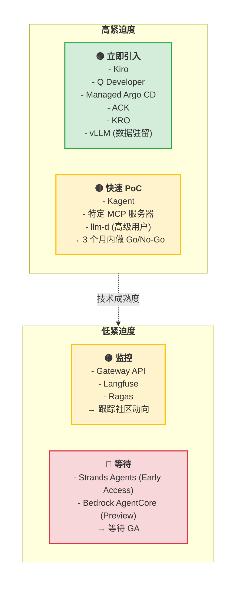
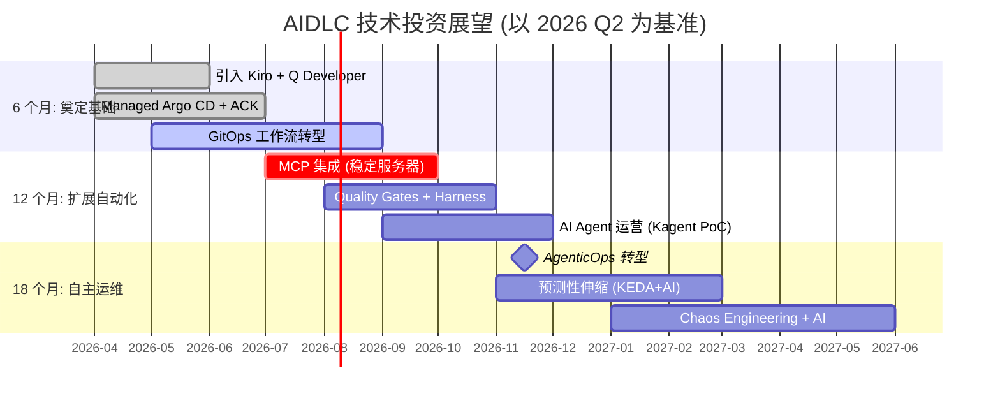

tags: [aidlc, toolchain, 'scope:toolchain']
---
title: 技术路线图
sidebar_label: 技术路线图
description: AIDLC 技术投资决策 — Build-vs-Wait 矩阵、工具成熟度评估、6/12/18 个月展望
last_update:
  date: 2026-04-18
  author: devfloor9
---

# 技术路线图

支持 AIDLC 的工具生态正在快速演进。**"是现在立即构建,还是等技术更成熟?"** 是每季度都需做出的核心决策。本文按 2026 年第二季度现状评估 AWS 及开源 AIDLC 工具的成熟度,并给出投资优先级。

## 1. 技术投资的两难

### 1.1 "立即构建" vs "等待后导入"

在实施 AIDLC 时,组织常面临的代表性问题:

**应立即构建的情形:**
- 业务紧迫度高,且技术已进入 GA (General Availability)
- 在开发速度上已落后于竞争者
- 监管 (数据驻留、合规) 需要立即落实
- 遗留系统债务导致手工运维成本激增

**应等待的情形:**
- 工具处于 Early Access/Preview,API 有变更可能
- 供应商绑定风险高且无替代方案
- 当前团队能力难以支撑该工具运维
- PoC 表明 ROI 不清晰或存在增加技术债的担忧

:::tip 投资决策框架
利用 **紧迫度 × 成熟度矩阵** (参见第 3 节) 来决定各工具的引入时点。先从 **立即引入** (High 紧迫度 + Stable 成熟度) 象限的工具开始。
:::

### 1.2 2026 年技术环境特点

**成熟的技术:**
- Kubernetes (v1.35 GA,含 DRA)
- vLLM (v0.18+、PagedAttention v2)
- GitOps (Argo CD、Flux CD)
- ACK (50+ AWS 服务 GA)
- Gateway API (v1.2 GA)

**快速演进中:**
- MCP (Model Context Protocol) 服务器生态 (50+ 开源服务器)
- AI 编码代理 (Kiro、Q Developer、Cursor、Windsurf)
- Kubernetes 算子 (KRO、Kagent)
- 分布式推理引擎 (llm-d v0.5、Dynamo v1.x)

**初期阶段:**
- Strands Agents SDK (Early Access)
- Bedrock AgentCore (Preview)
- Kagent (Early、社区驱动)

---

## 2. 当前工具成熟度评估 (2026 Q2)

下表汇总支持 AIDLC 工作流的核心工具的成熟度、建议、替代方案。

| 工具 | 成熟度 | 建议 | 备注 |
|------|--------|------|------|
| **Kiro** | GA | ✅ 立即引入 | Spec-driven 开发核心。MCP 集成。替代: Cursor Composer、Windsurf Flows |
| **Q Developer** | GA | ✅ 立即引入 | AWS 原生、实时代码生成。替代: GitHub Copilot、Cursor |
| **Managed Argo CD** | GA | ✅ 立即引入 | EKS 原生 GitOps。替代: Flux CD (自托管) |
| **ACK (AWS Controllers for Kubernetes)** | GA (50+ services) | ✅ 立即引入 | 声明式 AWS 资源管理。替代: Crossplane |
| **KRO (Kubernetes Resource Orchestrator)** | GA | ✅ 立即引入 | 复杂 Kubernetes 资源图自动化。替代: Helm、Kustomize |
| **Gateway API + LBC v3** | GA | ✅ 立即引入 | 支持 ExtProc、构建 AI Gateway 的基础。替代: Istio + EnvoyFilter |
| **MCP Servers** | 50+ GA | 🟡 选择性引入 | 服务器成熟度差异大。实验后仅导入稳定者。参见 [mcp.run](https://mcp.run) |
| **Kagent** | Early | 🟠 实验阶段 | K8s AI Agent 自动化。生产前需充分验证。替代: kubectl + 脚本 |
| **Strands Agents SDK** | GA | ✅ 构建自定义代理时 | 基于 Bedrock Agents + CDK。替代: LangGraph、CrewAI |
| **vLLM** | v0.18+ (Mature) | ✅ 数据驻留场景 | Open-Weight 模型服务。替代: TensorRT-LLM、SGLang |
| **llm-d** | v0.5+ (GA) | 🟡 高级用户 | Disaggregated Serving、NIXL KV 传输。替代: Ray Serve、vLLM multi-instance |
| **Dynamo** | v1.x (GA) | 🟡 高级用户 | NVIDIA 企业级推理平台。替代: vLLM、TensorRT-LLM |
| **Langfuse** | v3.x (GA) | ✅ 立即引入 | 自托管可观测性。替代: LangSmith (SaaS)、Helicone |
| **Ragas** | v0.2+ (GA) | ✅ 立即引入 | AI Agent 评估框架。替代: PromptFoo、TruLens |

:::info 成熟度释义
- **GA**: 可用于生产,API 稳定
- **Early**: 功能可用,但 API 可能变更
- **Preview**: AWS 预览服务,实验用途
:::

### 2.1 各工具详细评估

#### Kiro (Spec-Driven 开发)
- **成熟度**: GA (2025 年 11 月正式发布)
- **优点**: 需求 → 代码自动生成、MCP 集成、直到 Git 提交的完全自动化
- **缺点**: 供应商绑定 (仅限 AWS)、初期学习曲线
- **建议**: 从新微服务开发起步,结合 Mob Elaboration 仪式
- **替代**: Cursor Composer (多云)、Windsurf Flows (IDE 独立)

详情参见 **[AI 编码代理](./ai-coding-agents.md)**。

#### Q Developer
- **成熟度**: GA (2024 年推出,持续更新)
- **优点**: AWS 服务代码生成优化、IDE 集成优秀、提供免费层
- **缺点**: 非 AWS 环境下弱于 GitHub Copilot
- **建议**: 以 AWS 为主的组织应作为标准工具引入
- **替代**: GitHub Copilot (通用)、Cursor (AI-first IDE)

#### Managed Argo CD
- **成熟度**: GA (2024 年 re:Invent 发布)
- **优点**: EKS 原生、AWS 托管、IAM 集成
- **缺点**: 供应商绑定 (仅 AWS)、部分社区插件不支持
- **建议**: 新建 EKS 集群优先考虑 Managed Argo CD
- **替代**: Flux CD (自托管)、Jenkins X (遗留)

#### MCP Servers
- **成熟度**: 各服务器差异大 (50+ 中约 20 个稳定)
- **优点**: 标准化的上下文传递、50+ 开源服务器
- **缺点**: 质量参差、生产前需安全验证
- **建议**: 仅引入已验证稳定的服务器 (如 `@modelcontextprotocol/server-filesystem`、`@modelcontextprotocol/server-github`)
- **替代**: 直接 API 集成 (不用 MCP)

MCP 服务器列表与评估: [mcp.run](https://mcp.run)

#### Kagent
- **成熟度**: Early (2025 年开源)
- **优点**: K8s AI Agent 自动化、Mob Construction 工作流实验
- **缺点**: 社区驱动、无企业支持
- **建议**: 在沙箱环境试验,生产前充分验证
- **替代**: kubectl + bash 脚本、Helm hooks

---

## 3. Build-vs-Wait 决策矩阵

以下 2x2 矩阵依据 **业务紧迫度** 与 **技术成熟度** 给出工具引入策略。

### 3.1 各象限策略

#### 🟢 立即引入 (高紧迫度 + 稳定技术)
- **特征**: 处于 GA、API 稳定、有参考架构
- **做法**: 从新项目开始适用,3 个月内制定全公司扩散路线图
- **风险**: 低 (有厂商支持、社区活跃)
- **示例工具**: Kiro、Q Developer、Managed Argo CD、ACK、KRO

#### 🟡 快速 PoC (高紧迫度 + 初期技术)
- **特征**: 功能可用但 API 可能变更、企业级支持不足
- **做法**: 沙箱 3 个月 PoC → Go/No-Go 决策
- **风险**: 中 (可能引入技术债、需 API 迁移)
- **示例工具**: Kagent、特定 MCP 服务器、llm-d (高级用户)

#### 🟡 监控 (低紧迫度 + 稳定技术)
- **特征**: GA 但当前业务优先级低
- **做法**: 跟踪社区动向,季度复评
- **风险**: 低 (与竞争出现差距时可迅速追赶)
- **示例工具**: Gateway API、Langfuse、Ragas

#### 🔴 等待 (低紧迫度 + 初期技术)
- **特征**: Preview/Early Access 阶段,业务紧迫度低
- **做法**: 等待 GA,仅做基准评估
- **风险**: 低 (等待成本 < 过早引入风险)
- **示例工具**: Strands Agents (Early Access)、Bedrock AgentCore (Preview)

---

## 4. 投资展望: 6 个月 / 12 个月 / 18 个月

以下时间线展示 AIDLC 引入的 **分阶段投资优先级**。

### 4.1 Phase 1: 奠定基础 (6 个月)

**目标**: 搭建 AI 编码工具 + GitOps 基础,AIOps 成熟度 Level 2 → 3

| 主要活动 | 工具 | 产物 |
|----------|------|------|
| 引入 AI 编码代理 | Q Developer、Kiro | 开发速度提升 30% |
| 试运行 Spec-Driven 工作流 | Kiro + MCP | 固化 Mob Elaboration 仪式 |
| GitOps 转型 | Managed Argo CD + ACK | 部署自动化率 80%+ |
| 声明式基础设施管理 | KRO + ACK | Terraform 依赖降低 50% |

**成功指标:**
- 代码生成自动化率 30%+ (Q Developer)
- 部署前置时间降低 50% (GitOps)
- 手工基础设施变更次数降低 70% (ACK)

### 4.2 Phase 2: 扩展自动化 (12 个月)

**目标**: 转为 AI/CD 流水线,AIOps 成熟度 Level 3 → 4

| 主要活动 | 工具 | 产物 |
|----------|------|------|
| 扩大 MCP 集成 | 稳定化 MCP 服务器 5+ | AI Agent 上下文自动注入 |
| 构建 Quality Gates | Ragas + Harness | 自动校验 AI 输出质量 |
| AI Agent 自动化 PoC | Kagent、Strands Agents | Mob Construction 实验 |
| 可观测性 AI 集成 | Langfuse + ADOT | 自动采集 LLMOps 指标 |

**成功指标:**
- AI Agent 自主作业比例 15%+ (Kagent)
- Quality Gate 通过率 90%+ (Ragas)
- 事件检测时间缩短 70% (AI 可观测性)

### 4.3 Phase 3: 自主运维 (18 个月)

**目标**: 转入 AgenticOps,AIOps 成熟度 Level 4+ (自主运维)

| 主要活动 | 工具 | 产物 |
|----------|------|------|
| AgenticOps 转型 | Kagent + Strands Agents | 运维自动化率 60%+ |
| 预测性伸缩 | KEDA + AI 预测模型 | 资源浪费减少 30% |
| Chaos Engineering + AI | Chaos Mesh + AI Agent | 故障自动恢复场景 |
| 持续改进循环 | Langfuse + Ragas | 每周自动性能报告 |

**成功指标:**
- 运维自动化率 60%+ (AI Agent)
- 预测伸缩准确率 85%+ (KEDA + AI)
- 故障自动恢复率 40%+ (Chaos + AI)

:::tip 按展望的投资优先级
- **6 个月**: 立即可见 ROI 的工具 (Kiro、Q Developer、Argo CD)
- **12 个月**: 扩展自动化 (MCP、Quality Gates)
- **18 个月**: 自主运维 (AgenticOps、预测伸缩)
:::

---

## 5. 供应商绑定风险评估

选择 AIDLC 工具时需同时考量 **供应商绑定风险** 与 **可移植性 (Portability)**。

| 工具 | 供应商绑定风险 | 替代方案 | 可移植性 |
|------|----------------|----------|----------|
| **Kiro** | 🔴 高 (仅 AWS) | ✅ Cursor、Windsurf | 低 (需重写 spec → code) |
| **Q Developer** | 🔴 高 (仅 AWS) | ✅ GitHub Copilot、Cursor | 中 (可换 IDE) |
| **Managed Argo CD** | 🟡 中 (仅 EKS) | ✅ Flux CD、自管 Argo CD | 高 (基于 Git、K8s 标准) |
| **ACK** | 🟡 中 (仅 AWS) | ✅ Crossplane、Terraform | 低 (CRD 需迁移到其他 IaC) |
| **KRO** | 🟢 低 (K8s 标准) | ✅ Helm、Kustomize | 高 (K8s 标准 CRD) |
| **Gateway API** | 🟢 低 (K8s 标准) | ✅ Istio、Envoy | 高 (K8s 标准 API) |
| **vLLM** | 🟢 低 (开源) | ✅ TensorRT-LLM、SGLang | 高 (OpenAI 兼容 API) |
| **Langfuse** | 🟢 低 (开源) | ✅ LangSmith、Helicone | 高 (OTel 标准) |

### 5.1 缓解供应商绑定的策略

#### 多云就绪 (Multi-Cloud Ready)
- **用 Cursor 替代 Kiro**: 多云环境可考虑 Cursor Composer
- **用 Crossplane 替代 ACK**: 需支持 AWS 之外云时考虑 Crossplane
- **保持 GitOps 基座**: Argo CD/Flux CD 均以 Git 为单一真相来源,可保持可移植性

#### 开源优先原则
- **vLLM、Langfuse、Ragas**: 开源工具无供应商绑定
- **MCP**: 标准协议,支持多厂商

#### 渐进迁移计划
- **Phase 1**: 用 AWS 原生工具快速起步 (Kiro、Q Developer、Managed Argo CD)
- **Phase 2**: 按需逐步替换为供应商中立工具
- **Phase 3**: 若业务需要,转向多云架构

:::warning 警惕供应商绑定风险
**Kiro + Q Developer + Managed Argo CD** 组合强大,但 **AWS 绑定度高**。若需多云,请从一开始考虑 **Cursor + GitHub Copilot + Flux CD** 组合。
:::

---

## 6. 投资计划模板

按项目规模与组织成熟度推荐的工具组合。

### 6.1 小型团队 (5~20 人,微服务 3~10 个)

**核心工具:**
- Q Developer (AI 编码)
- Managed Argo CD (GitOps)
- ACK (AWS 资源自动化)
- Langfuse (自托管可观测性)

**预估投入:**
- 初期搭建: 2~3 个月
- 年度许可: $0 (开源 + AWS 托管)
- 基础设施: ~$500/月 (Langfuse 托管)

**ROI 预期:**
- 开发速度提升 30% (Q Developer)
- 部署前置时间下降 50% (GitOps)

### 6.2 中型组织 (50~200 人,微服务 20~100 个)

**核心工具:**
- Kiro + Q Developer (Spec-driven + AI 编码)
- Managed Argo CD + ACK + KRO (GitOps + 资源编排)
- vLLM (Open-Weight 模型服务、数据驻留)
- Langfuse + Ragas (LLMOps + 评估)
- MCP 服务器 5+ (仅稳定者)

**预估投入:**
- 初期搭建: 6~9 个月
- 年度许可: $0~50k (选择企业级支持时)
- 基础设施: ~$5k/月 (GPU 推理、Langfuse、MCP)

**ROI 预期:**
- 开发速度提升 50% (Kiro + Q Developer)
- 部署自动化率 80%+ (GitOps + ACK)
- 运维成本下降 30% (AI Agent 自动化)

### 6.3 大型企业 (200 人+、微服务 100+)

**核心工具:**
- Kiro + Q Developer + Cursor (混合 AI 编码)
- Managed Argo CD + ACK + KRO (GitOps + 资源编排)
- vLLM + llm-d (分布式推理)
- Kagent + Strands Agents (AI Agent 自动化)
- Langfuse + Ragas + Harness (LLMOps + Quality Gates)
- MCP 服务器 10+ (含自定义)
- Gateway API + LBC v3 (AI Gateway)

**预估投入:**
- 初期搭建: 12~18 个月
- 年度许可: $100k~500k (企业支持、自定义 MCP)
- 基础设施: ~$50k/月 (多区域 GPU、高可用)

**ROI 预期:**
- 开发速度提升 70% (AI 编码 + Spec-driven)
- 部署自动化率 90%+ (GitOps + AI Agent)
- 运维成本下降 50% (AgenticOps)
- 事件检测时间缩短 80% (AI 可观测性)

---

## 7. 投资决策清单

引入工具前请回答以下问题:

### 7.1 业务对齐
- [ ] 该工具解决的问题是否在组织当前 Top 3 优先级中?
- [ ] 不引入的业务影响是什么? (对手差距、违规等)
- [ ] 预期 ROI 回收周期? (建议 6 个月以内)

### 7.2 技术成熟度
- [ ] 工具是否 GA (General Availability)?
- [ ] 是否有参考架构?
- [ ] 社区是否活跃? (GitHub Stars、论坛)
- [ ] 是否保证厂商支持?

### 7.3 组织就绪度
- [ ] 团队是否具备运维该工具的能力?
- [ ] 3 个月内是否有资源完成 PoC?
- [ ] 工具上线后运维责任人是否明确?

### 7.4 风险评估
- [ ] 供应商绑定风险是否可接受?
- [ ] 是否存在替代方案? (Exit 策略)
- [ ] 是否满足安全 / 合规要求?

:::tip 决策框架
若以上清单 **80% 以上 Yes**,立即引入;**50~80%**,先 PoC 再决;**< 50%**,建议等待。
:::

---

## 8. 下一步

### 8.1 相关文档

- **[AI 编码代理](./ai-coding-agents.md)** — Kiro、Q Developer、Cursor 对比与引入策略
- **[Open-Weight 模型服务](./open-weight-models.md)** — vLLM、llm-d、数据驻留考量
- **[落地策略](../enterprise/adoption-strategy.md)** — 各组织的分阶段落地路线图
- **[成本效益分析](../enterprise/cost-estimation.md)** — AIDLC 工具投入 ROI 计算

### 8.2 实践指南

1. **现状评估**: 参考 [第 2 节](#2-当前工具成熟度评估-2026-q2) 清单,勾选组织已用的工具
2. **编写紧迫度 × 成熟度矩阵**: 使用 [第 3 节](#3-build-vs-wait-决策矩阵) 模板定制矩阵
3. **制定 6 个月投资计划**: 依据 [第 4.1 节](#41-phase-1-奠定基础-6-个月) Phase 1 活动调整
4. **执行 PoC**: 从 "立即引入" 象限开始 3 个月 PoC

:::info 按季度复评
AIDLC 工具生态变化快。**每季度重新审视本文档**,更新成熟度评估。
:::

---

## 参考资料

**AIDLC 官方文档:**
- [AWS AI-DLC Method Definition](https://prod.d13rzhkk8cj2z0.amplifyapp.com/)
- [AWS Labs AIDLC Workflows (GitHub)](https://github.com/awslabs/aidlc-workflows)

**工具评估参考:**
- [MCP Servers 列表](https://mcp.run)
- [CNCF Technology Radar](https://radar.cncf.io/)
- [ThoughtWorks Technology Radar](https://www.thoughtworks.com/radar)

**ROI 计算工具:**
- [AWS Pricing Calculator](https://calculator.aws/)
- [Managed Argo CD Pricing](https://aws.amazon.com/eks/pricing/)
