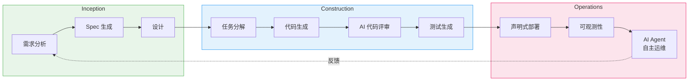
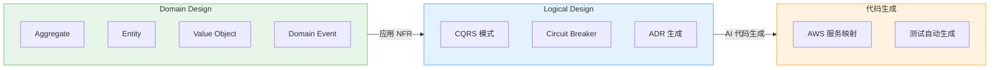
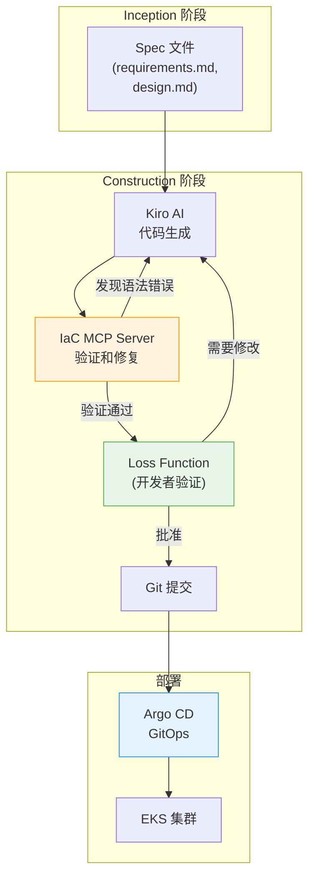
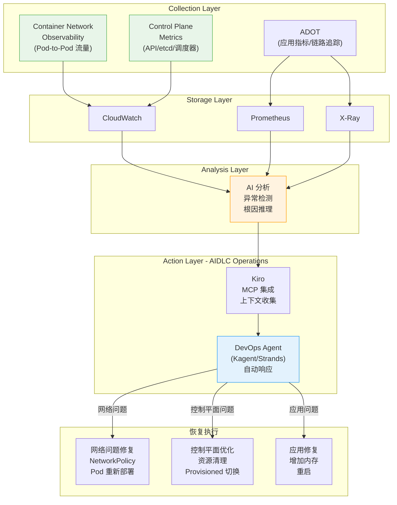
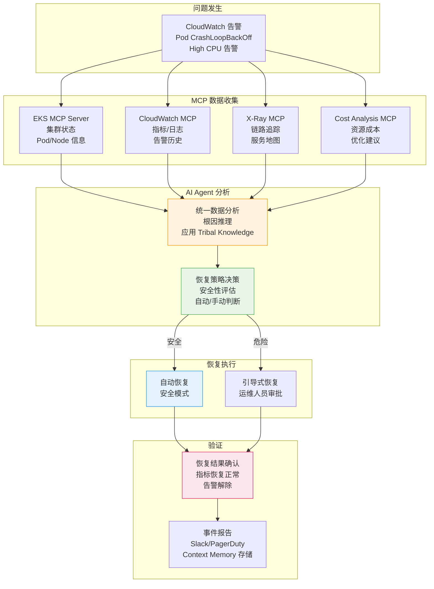
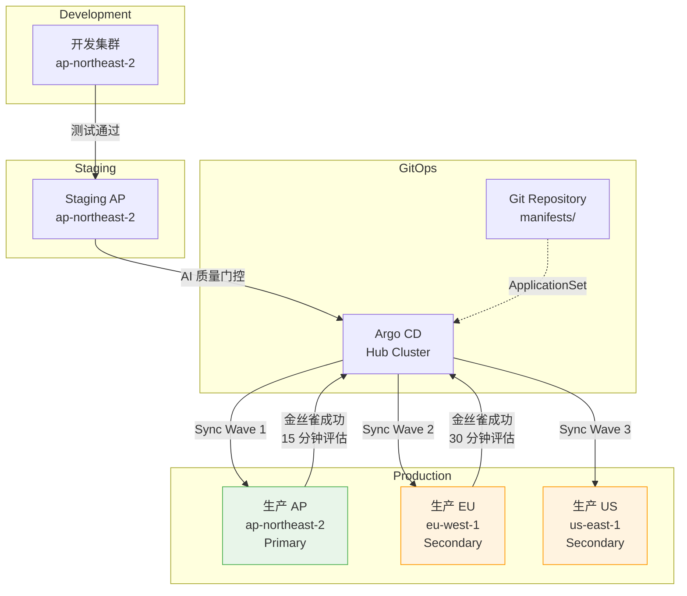

import { AidlcPhaseMapping, EksCapabilities, ProductivityMetrics, AidlcPrinciples, AidlcPhaseActivities, AiCodingAgentComparison, QualityGates, AiAgentEcosystem, DetailedMetrics, AidlcPipeline, AidlcArtifacts } from '@site/src/components/AidlcTables';

# AIDLC 框架 — EKS 环境下 AI 驱动的开发·运维高度化

> 📅 **撰写日期**: 2026-02-12 | **修改日期**: 2026-02-14 | ⏱️ **阅读时间**: 约 39 分钟

---

## 1. 概述

### 1.1 为什么选择 AIDLC

传统软件开发生命周期（SDLC）是以人为中心、长周期迭代（周/月为单位）为前提设计的。每日站会、Sprint 评审、回顾等仪式都是为这种长周期优化的。AI 的出现打破了这一前提。

AI 能够在**小时/天为单位**内完成需求分析、任务分解、代码生成和测试。将 AI 硬塞进（Retrofit）现有 SDLC 的做法会限制这种潜力——就像在汽车时代试图制造更快的马车一样。

**AIDLC（AI-Driven Development Lifecycle）**是 AWS Labs 提出的方法论，从**第一性原理（First Principles）**出发重新构建 AI，将其整合为开发生命周期的核心协作者。

```
传统 SDLC                            AIDLC
━━━━━━━━━━━━━━                      ━━━━━━━━━━━━━━━━━━━
人来规划和执行                          AI 提出建议，人来验证
周/月为单位迭代 (Sprint)               小时/天为单位迭代 (Bolt)
设计方法由团队自行选择                   DDD/BDD/TDD 内置于方法论中
角色竖井 (FE/BE/DevOps)               AI 打破角色边界
手动需求分析                            AI 将 Intent 分解为 Unit
顺序交接                               持续流 + Loss Function 验证
```

### 1.2 与 AIOps 战略的关联

[1. AIOps 战略指南](./aiops-introduction.md)中介绍的 AWS 开源战略 → MCP 集成 → AI 工具 → Kiro 编排是实现 AIDLC 的**技术基础**。[2. 智能可观测性技术栈](./aiops-observability-stack.md)中构建的 3-Pillar + AI 分析层是 Operations 阶段的**数据基础**。本文在这些技术和数据基础之上，提出**系统化提升开发与运维的方法论**。

```
[1] AIOps 战略指南 ──── 技术基础 (MCP, Kiro, AI Agent)
           │
[2] 智能可观测性技术栈 ──── 数据基础 (ADOT, AMP/AMG, CloudWatch AI)
           │
[3] AIDLC 框架 ── 方法论（本文档）
           │
[4] 预测性扩缩容与自动恢复 ──────── 深化 (ML 预测, 自动恢复, Chaos)
```

:::info 原文参考
AIDLC 的核心概念定义于 AWS Labs 的 [AI-DLC Method Definition](https://prod.d13rzhkk8cj2z0.amplifyapp.com/)。本文是在 EKS 环境中实际实施该方法论的指南。
:::

---

## 2. AIDLC 核心概念

### 2.1 十大原则

<AidlcPrinciples />

其中在 EKS 环境中特别重要的 3 项：

- **Reverse the Conversation Direction** — AI 通过 MCP 收集 EKS 集群状态，率先提出部署计划。开发者像 Google Maps 的驾驶员一样设定目的地（Intent），然后验证 AI 提出的路线。
- **Integration of Design Techniques** — 将 DDD 内置于方法论核心，AI 自动将业务逻辑建模为 Aggregate、Entity、Value Object。在 Scrum 中"由团队自行选择"的设计方法，在 AI-DLC 中成为必备核心。
- **Minimize Stages, Maximize Flow** — 最小化交接，实现持续流。每个阶段的人工验证扮演 **Loss Function** 的角色，在早期拦截可能向下游传播的错误。

### 2.2 核心产物 (Artifacts)

AI-DLC 重新定义了传统 SDLC 的术语以适应 AI 时代。

```
┌─────────┐    ┌─────────┐    ┌─────────┐
│  Intent  │───▶│  Unit   │───▶│  Bolt   │
│ 高层目标  │    │独立工作单元│   │快速迭代  │
│          │    │(DDD Sub- │   │(Sprint  │
│业务目标   │   │ domain)  │   │ 替代)   │
└─────────┘    └─────────┘    └─────────┘
                    │
              ┌─────┴─────┐
              ▼           ▼
        ┌──────────┐ ┌──────────┐
        │ Domain   │ │ Logical  │
        │ Design   │ │ Design   │
        │业务逻辑   │ │NFR+模式  │
        └──────────┘ └──────────┘
              │           │
              └─────┬─────┘
                    ▼
            ┌──────────────┐
            │ Deployment   │
            │    Unit      │
            │容器+Helm+     │
            │  Terraform   │
            └──────────────┘
```

<AidlcArtifacts />

:::tip Context Memory 与可追溯性
所有产物作为 **Context Memory** 保存，供 AI 在整个生命周期中参考。产物之间的双向追溯（Domain Model ↔ User Story ↔ 测试计划）得到保障，使 AI 始终在准确的上下文中工作。
:::

### 2.3 AI 驱动的递归式工作流

AI-DLC 的核心是 **AI 提出计划、人来验证的递归精化** 过程。

```
Intent (业务目标)
  │
  ▼
AI: 生成 Level 1 Plan ◀──── 人: 验证 · 修改
  │
  ├─▶ Step 1 ──▶ AI: Level 2 分解 ◀── 人: 验证
  │                 ├─▶ Sub-task 1.1 ──▶ AI 执行 ◀── 人: 验证
  │                 └─▶ Sub-task 1.2 ──▶ AI 执行 ◀── 人: 验证
  │
  ├─▶ Step 2 ──▶ AI: Level 2 分解 ◀── 人: 验证
  │                 └─▶ ...
  └─▶ Step N ──▶ ...

[所有产物 → Context Memory → 双向可追溯性]
```

每个阶段的人工验证就是 **Loss Function**——在早期捕获错误，防止向下游传播。AI 不规定按路径（新开发、重构、缺陷修复）的固定工作流，而是提出适合当前情况的 Level 1 Plan，这是一种灵活的方法。

### 2.4 AIDLC 三阶段概览

AIDLC 由 **Inception**、**Construction**、**Operations** 三个阶段组成。

<AidlcPhaseMapping />



<AidlcPhaseActivities />

---

## 3. Inception 阶段 — 从需求到设计

### 3.1 Mob Elaboration

Inception 的核心仪式是 **Mob Elaboration**——Product Owner、开发者、QA 齐聚一室，与 AI 协作进行需求精化的会议。

```
┌──────────────────────────────────────────────────┐
│              Mob Elaboration 仪式                  │
├──────────────────────────────────────────────────┤
│                                                   │
│  [AI] 将 Intent 分解为 User Story + Unit 提案     │
│    ↓                                              │
│  [PO + Dev + QA] 评审 · 调整过度/不足设计          │
│    ↓                                              │
│  [AI] 反映修改 → 追加生成 NFR · Risk               │
│    ↓                                              │
│  [团队] 最终验证 → 确定 Bolt 计划                   │
│                                                   │
├──────────────────────────────────────────────────┤
│  产物:                                            │
│  PRFAQ · User Stories · NFR 定义                  │
│  Risk Register · 度量标准 · Bolt 计划              │
└──────────────────────────────────────────────────┘
```

在传统方法论中需要**数周~数月**的顺序需求分析，通过 AI 生成初稿、团队同时评审，可以压缩到**数小时**。

### 3.2 Kiro Spec-Driven Inception

Kiro 将 Mob Elaboration 的产物体系化为 **Spec 文件**。将从自然语言需求到代码的整个过程结构化。

```
requirements.md → design.md → tasks.md → 代码生成 → 验证
```

**EKS 示例: Payment Service 部署**

`requirements.md`:

```markdown
# Payment Service 部署需求

## 功能需求
- REST API 端点: /api/v1/payments
- 与 DynamoDB 表集成
- 通过 SQS 进行异步事件处理

## 非功能需求
- P99 延迟: < 200ms
- 可用性: 99.95%
- 自动伸缩: 2-20 Pod
- EKS 1.35+ 兼容
```

`design.md`:

```markdown
# Payment Service 架构

## 基础设施配置
- EKS Deployment (3 replicas min)
- ACK DynamoDB Table (on-demand)
- ACK SQS Queue (FIFO)
- HPA (CPU 70%, Memory 80%)
- Karpenter NodePool (graviton, spot)

## 可观测性
- ADOT sidecar (traces → X-Ray)
- Application Signals (SLI/SLO 自动)
- CloudWatch Logs (/eks/payment-service)

## 安全
- Pod Identity (替代 IRSA)
- NetworkPolicy (namespace 隔离)
- Secrets Manager CSI Driver
```

`tasks.md`:

```markdown
# 实现任务

## Bolt 1: 基础设施
- [ ] 编写 ACK DynamoDB Table CRD
- [ ] 编写 ACK SQS Queue CRD
- [ ] 定义 KRO ResourceGroup (DynamoDB + SQS 集成)
- [ ] 配置 Karpenter NodePool (graviton, spot)

## Bolt 2: 应用
- [ ] 实现 Go REST API
- [ ] 集成 DynamoDB SDK
- [ ] 实现 SQS consumer
- [ ] Dockerfile + multi-stage build

## Bolt 3: 部署
- [ ] 编写 Helm chart
- [ ] 定义 Argo CD Application
- [ ] 编写 HPA manifest
- [ ] 编写 NetworkPolicy

## Bolt 4: 可观测性
- [ ] 配置 ADOT sidecar
- [ ] Application Signals annotation
- [ ] CloudWatch 仪表板
- [ ] SLO 告警设置
```

:::tip Spec-Driven 的核心价值
**指令式方式**: "创建 DynamoDB" → "还需要 SQS" → "现在部署" → 每次手动指示，存在上下文丢失风险
**Spec-Driven**: Kiro 分析 requirements.md → 生成 design.md → 分解 tasks.md → 自动生成代码 → 通过一致的 Context Memory 连接到验证
:::

### 3.3 基于 MCP 的实时上下文收集

Kiro 原生支持 MCP，在 Inception 阶段通过 AWS Hosted MCP 服务器收集实时基础设施状态。

```
[Kiro + MCP 交互]

Kiro: "检查 EKS 集群状态"
  → EKS MCP Server: get_cluster_status()
  → 响应: { version: "1.35", nodes: 5, status: "ACTIVE" }

Kiro: "成本分析"
  → Cost Analysis MCP Server: analyze_cost(service="EKS")
  → 响应: { monthly: "$450", recommendations: [...] }

Kiro: "分析当前工作负载"
  → EKS MCP Server: list_deployments(namespace="payment")
  → 响应: { deployments: [...], resource_usage: {...} }
```

通过这种方式，在生成 design.md 时可以实现**反映当前集群状态和成本的设计**。MCP 集成架构的详细内容请参阅 [1. AIOps 战略指南](./aiops-introduction.md)。

---

## 4. Construction 阶段 — 从设计到代码

### 4.1 DDD 集成: 从 Domain Design 到 Logical Design

在 AI-DLC 中，DDD 是**方法论的内置要素而非可选项**。AI 自动按照 DDD 原则对业务逻辑进行建模。



**Payment Service 示例**:

1. **Domain Design** — AI 对业务逻辑建模
   - Aggregate: `Payment` (transactionId, amount, status)
   - Entity: `PaymentMethod`, `Customer`
   - Value Object: `Money`, `Currency`
   - Domain Event: `PaymentCreated`, `PaymentCompleted`, `PaymentFailed`

2. **Logical Design** — 应用 NFR + 选择架构模式
   - CQRS: 支付创建(Command) / 查询(Query) 分离
   - Circuit Breaker: 外部支付网关调用
   - ADR: "DynamoDB on-demand vs provisioned" 决策记录

3. **代码生成** — AWS 服务映射
   - Aggregate → EKS Deployment + DynamoDB Table
   - Domain Event → SQS FIFO Queue
   - Circuit Breaker → Envoy sidecar + Istio

开发者在每个阶段**验证·调整** AI 生成的模型。这种验证就是 Loss Function 的作用。

### 4.2 Mob Construction

Construction 的核心仪式是 **Mob Construction**。团队齐聚一室各自开发自己的 Unit，交换在 Domain Design 阶段生成的集成规范（Integration Specification）。

```
[Mob Construction 流程]

Team A: Payment Unit        Team B: Notification Unit
  │                            │
  ├─ Domain Design 完成        ├─ Domain Design 完成
  │                            │
  └────── 交换集成规范 ──────┘
          (Domain Event 契约)
  │                            │
  ├─ Logical Design            ├─ Logical Design
  ├─ 代码生成                  ├─ 代码生成
  ├─ 测试                      ├─ 测试
  └─ Bolt 交付                 └─ Bolt 交付
```

各 Unit 松耦合，支持**并行开发**，通过 Domain Event 进行集成。AI 也会自动生成集成测试。

:::warning Brown-field（现有系统）方法
在对现有系统进行功能添加或重构时，Construction 阶段需要**额外步骤**：

1. AI 将现有代码**逆向工程为语义模型**（代码 → 模型提升）
   - **Static Model**: 组件、职责、关系
   - **Dynamic Model**: 主要用例的组件交互
2. 开发者验证·修正逆向工程的模型
3. 之后按照与 Green-field 相同的 Construction 流程进行

通过这种方式，AI 在准确把握现有系统上下文的状态下进行变更。
:::

### 4.3 AI 编码代理

AIDLC Construction 阶段使用的 AI 编码代理。Amazon Q Developer 和 Kiro 使用 **Anthropic Claude** 模型，Kiro 还支持开源权重模型，可实现成本优化和特殊领域扩展。

<AiCodingAgentComparison />

#### 4.3.4 Amazon Q Developer — 实时代码构建和测试 (2025)

AWS 于 2025 年 2 月发布了 **Amazon Q Developer 的实时代码执行功能**。这是一种创新方法，AI 生成代码后**自动构建并执行测试验证结果**，然后再呈现给开发者。在 AIDLC Construction 阶段**提前激活 Loss Function**，防止错误向下游传播的核心机制。

**实时代码执行功能**

传统 AI 编码工具在生成代码后需要开发者手动构建和测试。Q Developer 自动化了这一过程，实现了**代码生成 → 自动构建 → 测试执行 → 结果验证 → 开发者评审**的闭环。

```
传统方式:
  AI 代码生成 → 开发者手动构建 → 开发者手动测试 → 发现错误 → 反馈给 AI → 重新生成
  (迭代周期: 5-10 分钟)

Q Developer 实时执行:
  AI 代码生成 → 自动构建 → 自动测试 → 结果验证 → (错误时自动修正重试) → 开发者评审
  (迭代周期: 1-2 分钟, 开发者干预最小化)
```

**核心机制**

1. **自动构建流水线**
   - Q Developer 在代码更改后自动运行项目的构建工具（Maven, Gradle, npm, pip 等）
   - 即时检测编译错误和依赖冲突
   - 构建失败时分析错误消息并自动重试代码修正

2. **测试自动执行**
   - 自动执行单元测试和集成测试
   - 测试失败时分析失败原因并修正代码或测试
   - 在维护现有测试覆盖率的同时添加新代码

3. **开发者评审前验证**
   - 开发者收到的代码**已经通过了构建和测试**
   - 开发者专注于业务逻辑和设计评审（Loss Function 角色）
   - 验证的不是"代码能否运行？"而是"代码是否正确？"

**安全扫描自动修复建议**

Q Developer 自动扫描 Kubernetes YAML 和应用代码的安全漏洞，并提供修复建议。

**Kubernetes YAML 安全扫描**

1. **Root 权限检测**
   - 检测 `runAsUser: 0` 或 `runAsNonRoot: false`
   - 建议: `runAsUser: 1000`, `runAsNonRoot: true`

2. **Privileged 容器检测**
   - 检测 `securityContext.privileged: true`
   - 建议: 仅显式添加所需的 capabilities（如: `NET_ADMIN`）

3. **未设置 securityContext 检测**
   - Pod/Container 没有 `securityContext` 时发出警告
   - 建议: 按照最小权限原则添加 securityContext

**自动修复建议示例**

```yaml
# Q Developer 检测到的问题
apiVersion: v1
kind: Pod
metadata:
  name: payment-pod
spec:
  containers:
    - name: payment
      image: payment:v1
      securityContext:
        runAsUser: 0  # ⚠️ 使用 Root 权限
        privileged: true  # ⚠️ Privileged 模式

# Q Developer 建议的修复
apiVersion: v1
kind: Pod
metadata:
  name: payment-pod
spec:
  securityContext:
    runAsNonRoot: true
    runAsUser: 1000
    fsGroup: 1000
    seccompProfile:
      type: RuntimeDefault
  containers:
    - name: payment
      image: payment:v1
      securityContext:
        allowPrivilegeEscalation: false
        readOnlyRootFilesystem: true
        capabilities:
          drop:
            - ALL
          add:
            - NET_BIND_SERVICE  # 仅添加所需的 capabilities
```

**AIDLC Construction 阶段集成**

Q Developer 的实时执行和安全扫描**自动化了 Construction 阶段的 Quality Gate**，实现了 AIDLC 的快速迭代周期（Bolt）。

1. **在 Quality Gate 中自动运行 Q Developer 安全扫描**
   - Kiro 生成代码时将 Q Developer 安全扫描集成到流水线中
   - 自动扫描 Kubernetes manifest、Dockerfile、应用代码
   - 发现漏洞时向开发者提出修复建议（Loss Function）

2. **在 CI/CD 流水线中添加 Q Developer 验证步骤**
   - 创建 PR 时在 GitHub Actions/GitLab CI 中运行 Q Developer 扫描
   - 通过自动构建·测试保证"代码可运行"
   - 通过安全扫描保证"代码是安全的"
   - 开发者只需验证"代码是否正确"（角色分离）

**集成工作流示例**

```yaml
# .github/workflows/aidlc-construction.yml
name: AIDLC Construction Quality Gate
on:
  pull_request:
    types: [opened, synchronize]

jobs:
  q-developer-validation:
    runs-on: ubuntu-latest
    steps:
      - uses: actions/checkout@v4

      # 1. Q Developer 安全扫描
      - name: Q Developer Security Scan
        uses: aws/amazon-q-developer-action@v1
        with:
          scan-type: security
          source-path: .
          auto-fix: true  # 应用自动修复建议

      # 2. 实时构建和测试
      - name: Q Developer Build & Test
        uses: aws/amazon-q-developer-action@v1
        with:
          action: build-and-test
          test-coverage-threshold: 80

      # 3. Kubernetes manifest 验证
      - name: K8s Manifest Security Check
        run: |
          # 确认 Q Developer 建议的修复已应用
          kube-linter lint deploy/ --config .kube-linter.yaml

      # 4. 通过后才允许 Argo CD 同步
      - name: Approve for GitOps
        if: success()
        run: echo "Quality Gate passed. Ready for Argo CD sync."
```

**实际效果 — 反馈循环缩短**

```
传统 Construction 阶段:
  [开发者] 编写代码 (30 分钟)
    → [开发者] 手动构建 (2 分钟)
    → [开发者] 手动测试 (5 分钟)
    → [开发者] 发现错误 (10 分钟调试)
    → [开发者] 修改代码 (20 分钟)
    → 重复...
  总耗时: 2-3 小时

Q Developer 实时执行:
  [AI] 代码生成 (1 分钟)
    → [AI] 自动构建·测试 (30 秒)
    → [AI] 错误检测及自动修复 (1 分钟)
    → [开发者] Loss Function 验证 (10 分钟)
    → [Argo CD] 自动部署
  总耗时: 15-20 分钟
```

:::tip AIDLC 中 Q Developer 的价值
Q Developer 的实时执行实现了 AIDLC 的核心原则 **"Minimize Stages, Maximize Flow"**。自动化代码生成 → 构建 → 测试 → 验证的各个阶段，消除交接，开发者只需专注于**决策（Loss Function）**。这就是将传统 SDLC 的周/月单位周期缩短为 AIDLC 的小时/天单位周期的核心机制。
:::

**参考资料**

- [AWS DevOps Blog: Enhancing Code Generation with Real-Time Execution in Amazon Q Developer](https://aws.amazon.com/blogs/devops/enhancing-code-generation-with-real-time-execution-in-amazon-q-developer/) (2025-02-06)
- AWS re:Invent 2025 EKS Research — Section 13.4 参考

### 4.4 基于 EKS Capabilities 的声明式自动化

EKS Capabilities（2025.11）将热门开源工具作为 AWS 托管服务提供，以声明式方式部署 Construction 阶段的产物。

<EksCapabilities />

#### 4.4.1 Managed Argo CD — GitOps

Managed Argo CD 在 AWS 基础设施上以托管方式运行 GitOps。Kiro 生成的代码推送到 Git 后自动部署到 EKS。通过 Application CRD 管理单一环境，通过 ApplicationSet 声明式管理多环境（dev/staging/production）。

#### 4.4.2 ACK — AWS 资源声明式管理

ACK 以 K8s CRD 声明式管理 50+ AWS 服务。Kiro 生成的 Domain Design 中的基础设施要素（DynamoDB、SQS、S3 等）通过 `kubectl apply` 部署，自然集成到 Argo CD 的 GitOps 工作流中。

:::info ACK 的核心价值
使用 ACK 可以将**集群外部的 AWS 资源也纳入 K8s 声明式模型管理**。通过 K8s CRD 创建/修改/删除 DynamoDB、SQS、S3、RDS 等，这就是"以 K8s 为中心声明式管理所有基础设施"的策略。
:::

#### 4.4.3 KRO — 复合资源编排

KRO 将多个 K8s 资源捆绑为**单一部署单元（ResourceGroup）**。与 AIDLC 的 Deployment Unit 概念直接映射，将 Deployment + Service + HPA + ACK 资源作为一个 Custom Resource 创建。

#### 4.4.4 LBC v3 Gateway API

AWS Load Balancer Controller v3 将 Gateway API 正式 GA，提供 L4(NLB) + L7(ALB) 路由、QUIC/HTTP3、JWT 验证、Header 转换。通过 Gateway + HTTPRoute CRD 声明式管理流量。

#### 4.4.5 LBC v3 Gateway API — 高级功能详解

AWS Load Balancer Controller v3 的 Gateway API 支持通过 Kubernetes 标准流量管理 API 提供强大的 L4/L7 路由功能。这是在 AIDLC Construction 阶段声明式实现 Kiro Spec 网络需求的核心工具。

**Gateway API v1.4 + LBC v2.14+ 支持范围**

Gateway API 采用面向角色（role-oriented）的设计，使基础设施运维、集群运维和应用开发者能够在各自的职责范围内管理流量。

1. **L4 Routes — TCPRoute, UDPRoute, TLSRoute (NLB, v2.13.3+)**
   - **TCPRoute**: TCP 应用路由（如: PostgreSQL, Redis, gRPC with TCP）
   - **UDPRoute**: UDP 协议路由（如: DNS, QUIC, 游戏服务器）
   - **TLSRoute**: 基于 SNI（Server Name Indication）的 TLS 路由
   - 通过 Network Load Balancer(NLB) 配置，保证高吞吐量和低延迟
   - 示例: 多租户数据库集群中基于 SNI 的分片路由

2. **L7 Routes — HTTPRoute, GRPCRoute (ALB, v2.14.0+)**
   - **HTTPRoute**: 基于路径、Header、查询参数的 HTTP/HTTPS 路由
   - **GRPCRoute**: 基于 gRPC 方法名的路由，gRPC 专属 Header 管理
   - 通过 Application Load Balancer(ALB) 配置，支持基于内容的路由
   - 示例: `/api/v1/*` → v1 服务, `/api/v2/*` → v2 服务（金丝雀部署）

3. **QUIC 协议支持 (HTTP/3 on NLB)**
   - NLB 原生支持 HTTP/3(QUIC) 协议
   - 基于 UDP 解决 TCP 队头阻塞问题
   - 支持移动网络环境下的连接迁移（connection migration）
   - 示例: 实时视频流、游戏服务器、低延迟 API

**JWT 验证功能**

Gateway API v1.4 支持在 **Gateway 级别进行 JWT（JSON Web Token）验证**。通过将认证逻辑从后端服务分离来降低负载。

- **认证策略定义**: 在 Gateway 上声明 JWT 验证规则（发行者、公钥、声明验证）
- **降低后端负载**: 在 ALB/NLB 验证 JWT，提前拦截无效请求
- **集中式认证**: 多个服务复用通用认证策略
- **示例**: Payment Service 在 `/api/v1/payments` 路径上验证 `iss=https://auth.example.com`, `aud=payment-api`

**Header 转换**

HTTPRoute 可以动态添加·修改·删除请求和响应 Header。

- **RequestHeaderModifier**: 在转发到后端之前操作请求 Header
  - 示例: 添加 `X-User-ID` Header（从 JWT 声明中提取的用户 ID）
  - 示例: 强制 `X-Forwarded-Proto: https`（后端在代理后面时）
- **ResponseHeaderModifier**: 在响应客户端之前操作响应 Header
  - 示例: 添加 `X-Frame-Options: DENY`（安全 Header）
  - 示例: 移除 `Server` Header（防止信息泄露）

**在 AIDLC Construction 阶段的应用**

Gateway API 是将 Kiro Spec 中定义的网络需求通过 GitOps 工作流自动部署的核心工具。

1. **在 Kiro Spec 中定义 API 路由需求**
   - 在 `requirements.md` 中明确"通过金丝雀部署将 10% 流量路由到 v2"等需求
   - 在 `design.md` 中设计使用 Gateway API 的路由策略
   - Kiro 自动生成 HTTPRoute manifest

2. **通过 Gateway API CRD 声明式流量管理**
   - 一次 Git 提交即可部署 Gateway、GatewayClass、HTTPRoute
   - Argo CD 自动将变更同步到 EKS
   - LBC 配置 ALB/NLB 并应用路由规则

3. **金丝雀/蓝绿部署策略自动化**
   - 通过 HTTPRoute 的 `weight` 字段调整流量分配比例
   - 示例: v1 服务 90%, v2 服务 10% → 逐步将 v2 增加到 100%
   - 通过 CloudWatch Application Signals 监控各版本的 SLO
   - AI Agent 在 SLO 违规时自动回滚（与 Operations 阶段集成）

**Gateway, GatewayClass, HTTPRoute YAML 示例**

```yaml
# gatewayclass.yaml — 基础设施运维定义
apiVersion: gateway.networking.k8s.io/v1
kind: GatewayClass
metadata:
  name: aws-alb
spec:
  controllerName: gateway.alb.aws.amazon.com/controller
  description: "AWS Application Load Balancer"
---
# gateway.yaml — 集群运维定义
apiVersion: gateway.networking.k8s.io/v1
kind: Gateway
metadata:
  name: payment-gateway
  namespace: production
  annotations:
    gateway.alb.aws.amazon.com/scheme: internet-facing
    gateway.alb.aws.amazon.com/tags: Environment=production,Service=payment
spec:
  gatewayClassName: aws-alb
  listeners:
    - name: https
      protocol: HTTPS
      port: 443
      tls:
        mode: Terminate
        certificateRefs:
          - name: payment-tls-cert
            kind: Secret
      allowedRoutes:
        namespaces:
          from: Selector
          selector:
            matchLabels:
              gateway-access: enabled
---
# httproute.yaml — 应用开发者定义
apiVersion: gateway.networking.k8s.io/v1
kind: HTTPRoute
metadata:
  name: payment-api-route
  namespace: production
spec:
  parentRefs:
    - name: payment-gateway
      namespace: production
      sectionName: https
  rules:
    # 金丝雀部署: v1 90%, v2 10%
    - matches:
        - path:
            type: PathPrefix
            value: /api/v1/payments
      backendRefs:
        - name: payment-service-v1
          port: 8080
          weight: 90
        - name: payment-service-v2
          port: 8080
          weight: 10
      filters:
        # JWT 验证 (Gateway API v1.4)
        - type: RequestHeaderModifier
          requestHeaderModifier:
            add:
              - name: X-User-ID
                value: "{jwt.sub}"  # 从 JWT 声明中提取
        # 安全 Header 添加
        - type: ResponseHeaderModifier
          responseHeaderModifier:
            add:
              - name: X-Frame-Options
                value: DENY
              - name: X-Content-Type-Options
                value: nosniff
            remove:
              - Server  # 防止服务器信息泄露
---
# grpcroute.yaml — gRPC 服务路由
apiVersion: gateway.networking.k8s.io/v1alpha2
kind: GRPCRoute
metadata:
  name: payment-grpc-route
  namespace: production
spec:
  parentRefs:
    - name: payment-gateway
  rules:
    - matches:
        - method:
            service: payment.v1.PaymentService
            method: CreatePayment
      backendRefs:
        - name: payment-grpc-service
          port: 9090
```

:::tip Gateway API 与 Ingress 的比较
**Ingress** 在单个资源中定义所有路由规则，导致基础设施运维和开发者的职责混杂。**Gateway API** 通过 GatewayClass（基础设施）、Gateway（集群）、HTTPRoute（应用）分离角色，使各团队能够独立工作。这与 AIDLC 的 **Loss Function** 概念一致——在每一层进行验证以防止错误传播。
:::

**参考资料**

- [Kubernetes Gateway API v1.4 Release](https://kubernetes.io/blog/2025/11/06/gateway-api-v1-4/) (2025-11-06)
- [AWS Load Balancer Controller — Gateway API Docs](https://kubernetes-sigs.github.io/aws-load-balancer-controller/latest/guide/gateway/gateway/)
- [Kubernetes Gateway API in Action (AWS Blog)](https://aws.amazon.com/blogs/containers/kubernetes-gateway-api-in-action/)
- AWS re:Invent 2025 EKS Research — Section 3.5 参考

#### 4.4.6 Node Readiness Controller — 声明式节点就绪状态管理

**Node Readiness Controller（NRC）**是一个控制器，声明式定义 Kubernetes 节点在接受工作负载之前必须满足的条件。这是在 AIDLC Construction 阶段将基础设施需求表达为代码并通过 GitOps 自动应用的核心工具。

**核心概念**

NRC 通过 `NodeReadinessRule` CRD 定义节点在转换为"Ready"状态之前必须满足的条件。传统上节点就绪状态由 kubelet 自动决定，但使用 NRC 可以**将特定于应用的需求声明式注入到基础设施层**。

- **声明式策略**: 通过 `NodeReadinessRule` 以 YAML 定义节点就绪条件
- **GitOps 兼容**: 通过 Argo CD 对节点就绪策略进行版本管理和自动部署
- **工作负载保护**: 在必要的 DaemonSet（CNI、CSI、安全代理）就绪之前阻止调度

**在 AIDLC 各阶段的应用**

| 阶段 | NRC 角色 | 示例 |
|------|----------|------|
| **Inception** | AI 分析工作负载需求 → 自动定义所需的 NodeReadinessRule | "GPU 工作负载仅在 NVIDIA device plugin 就绪后才调度" |
| **Construction** | 将 NRC 规则包含在 Helm chart 中，作为 Terraform EKS Blueprints AddOn 部署 | Kiro 自动生成 `NodeReadinessRule` manifest |
| **Operations** | NRC 在运行时自动管理节点就绪状态，AI 分析规则效果 | 通过 CloudWatch Application Signals 追踪节点就绪延迟 |

**Infrastructure as Code 视角**

NRC 将 AIDLC 的"基础设施即代码，基础设施也要测试"原则扩展到节点级别。

1. **基于 GitOps 的策略管理**
   - 将 `NodeReadinessRule` CRD 存储在 Git 仓库中
   - Argo CD 自动同步到 EKS 集群
   - 策略变更时一次 Git 提交即可应用到整个集群

2. **Kiro + MCP 自动化**
   - Kiro 从 Inception 阶段的 `design.md` 解析工作负载需求
   - 通过 EKS MCP Server 确认当前集群的 DaemonSet 状态
   - 自动生成所需的 `NodeReadinessRule` 并添加到 IaC 仓库

3. **Terraform EKS Blueprints 集成**
   - 将 NRC 控制器作为 EKS Blueprints AddOn 声明式安装
   - 通过 Helm values 自动化默认策略设置
   - 在多集群环境中应用一致的节点就绪策略

**Quality Gate 集成**

在 AIDLC 的 Quality Gate 阶段，NRC 作为部署前验证节点就绪状态的工具使用。

- **部署前 Dry-run**: 模拟应用 NRC 规则后对现有工作负载的影响
- **CI/CD 流水线验证**: 在 GitHub Actions/GitLab CI 中进行 `kubectl apply --dry-run` + NRC 规则有效性检查
- **作为 Loss Function 的角色**: 在错误的节点就绪策略部署到生产环境之前进行拦截

**YAML 示例: GPU 工作负载用 NodeReadinessRule**

```yaml
apiVersion: node.k8s.io/v1alpha1
kind: NodeReadinessRule
metadata:
  name: gpu-node-readiness
  namespace: kube-system
spec:
  # 仅应用于 GPU 节点
  nodeSelector:
    matchLabels:
      node.kubernetes.io/instance-type: p4d.24xlarge
  # 在以下 DaemonSet 全部 Ready 之前不将节点转换为 Ready
  requiredDaemonSets:
    - name: nvidia-device-plugin-daemonset
      namespace: kube-system
    - name: gpu-feature-discovery
      namespace: kube-system
    - name: dcgm-exporter
      namespace: monitoring
  # 超时: 10 分钟内未满足条件则保持节点为 NotReady
  timeout: 10m
```

**实战使用场景**

| 场景 | NRC 规则 | 效果 |
|----------|----------|------|
| **Cilium CNI 集群** | 等待 Cilium agent Ready | 防止在网络初始化前调度 Pod |
| **GPU 集群** | 等待 NVIDIA device plugin + DCGM exporter 就绪 | 在 GPU 资源暴露前阻止工作负载调度 |
| **安全加固环境** | 等待 Falco, OPA Gatekeeper 就绪 | 防止在安全策略应用前执行工作负载 |
| **存储工作负载** | 等待 EBS CSI driver + snapshot controller 就绪 | 防止卷挂载失败 |

**Terraform EKS Blueprints AddOn 示例**

```hcl
module "eks_blueprints_addons" {
  source = "aws-ia/eks-blueprints-addons/aws"

  cluster_name      = module.eks.cluster_name
  cluster_endpoint  = module.eks.cluster_endpoint

  enable_node_readiness_controller = true
  node_readiness_controller = {
    namespace = "kube-system"
    values = [
      yamlencode({
        defaultRules = {
          cilium = {
            enabled = true
            daemonSets = ["cilium"]
          }
          gpuNodes = {
            enabled = true
            nodeSelector = {
              "node.kubernetes.io/instance-type" = "p4d.24xlarge"
            }
            daemonSets = ["nvidia-device-plugin-daemonset", "dcgm-exporter"]
          }
        }
      })
    ]
  }
}
```

:::tip NRC + AIDLC 协同效应
Node Readiness Controller 将 AIDLC 的**"声明式表达基础设施需求并自动验证"**原则扩展到节点级别。Kiro 在 Inception 阶段分析工作负载需求自动生成 `NodeReadinessRule`，Argo CD 通过 GitOps 部署，在 Operations 阶段 AI Agent 自动检测和响应节点就绪状态异常。
:::

**参考资料**

- [Kubernetes Blog: Introducing Node Readiness Controller](https://kubernetes.io/blog/2026/02/03/introducing-node-readiness-controller/) (2026-02-03)
- [Node Readiness Controller GitHub Repository](https://github.com/kubernetes-sigs/node-readiness-controller)

:::tip EKS Capabilities + AIDLC 协同效应
Managed Argo CD（部署）+ ACK（基础设施）+ KRO（编排）+ LBC v3（网络）+ NRC（节点就绪）结合后，Kiro 从 Spec 生成的所有产物都可以通过**一次 Git Push 完成全栈部署**。这就是 Construction → Operations 转换的核心。
:::

### 4.5 基于 MCP 的 IaC 自动化流水线

结合 Kiro 和 AWS Hosted MCP 服务器，可以从 Inception 的 Spec 到 Construction 的 IaC 自动生成并通过 Argo CD 部署。

<AidlcPipeline />

#### 4.5.3 AWS IaC MCP Server — CDK/CloudFormation AI 支持

AWS 于 2025 年 11 月 28 日发布了 **AWS Infrastructure as Code (IaC) MCP Server**。这是一个编程接口，使 Kiro CLI 等 AI 工具能够搜索 CloudFormation 和 CDK 文档、自动验证模板，并让 AI 支持部署故障排除。

**AWS IaC MCP Server 概述**

AWS IaC MCP Server 通过 Model Context Protocol 提供以下功能：

- **文档搜索**: 实时搜索 CloudFormation 资源类型、CDK 构造、最佳实践
- **模板验证**: 自动检测 IaC 模板的语法错误并建议修复
- **部署故障排除**: 栈部署失败时分析根本原因并提出解决方案
- **编程式访问**: 与 Kiro、Amazon Q Developer 等 AI 工具原生集成

**AIDLC Construction 阶段集成**

在 AIDLC 的 Construction 阶段，IaC MCP Server 的应用方式如下：

1. **Kiro Spec → IaC 代码生成验证**
   - 基于 Inception 阶段生成的 `design.md`，Kiro 生成 CDK/Terraform/Helm 代码
   - IaC MCP Server 自动验证生成代码的语法、资源约束、安全策略合规性
   - 对于 CloudFormation 模板，预先检测资源类型拼写错误、循环依赖、错误属性

2. **CloudFormation 模板语法错误自动修复**
   - 部署前对模板进行静态分析以识别错误模式
   - 示例: `Properties` 拼写错误 → `Properties`，错误的内置函数 → 建议正确的函数
   - 修复建议由 Kiro 自动应用或请求开发者进行 Loss Function 验证

3. **与现有基础设施的兼容性预验证**
   - 与 EKS MCP Server、Cost Analysis MCP 集成，分析当前集群状态
   - 验证新的 IaC 代码与现有资源（VPC、子网、安全组）是否冲突
   - 示例: 创建 DynamoDB 表时检查与现有表的名称重复，确认 VPC 端点是否可复用

**代码示例: 在 Kiro 中使用 IaC MCP Server 的工作流**

```bash
# 1. 激活 IaC MCP Server
kiro mcp add aws-iac

# 2. 从 Spec 文件生成 IaC 代码
kiro generate --spec requirements.md --output infra/

# 3. IaC MCP Server 自动执行的验证过程
# - CloudFormation 模板语法检查
# - CDK construct 兼容性验证
# - 资源约束条件确认（如: DynamoDB on-demand vs provisioned）

# 4. 确认验证结果
kiro verify --target infra/

# 输出示例:
# ✓ CloudFormation syntax valid
# ⚠ Warning: DynamoDB table 'payments' uses on-demand billing (estimated $150/month)
# ✓ VPC endpoint 'vpce-dynamodb' already exists, reusing
# ✗ Error: Security group 'sg-app' conflicts with existing rule

# 5. 自动修复错误
kiro fix --interactive

# IaC MCP Server 建议的修复:
# - Security group rule conflict → 更改为新的规则 ID
# - 开发者批准后自动应用

# 6. 通过 Argo CD 部署
git add infra/ && git commit -m "Add Payment Service infrastructure"
git push origin main
# Argo CD 自动 synced → 部署到 EKS
```

**Construction 阶段的集成流程**



:::tip IaC MCP Server 与 Kiro 的协同效应
AWS IaC MCP Server 与 Kiro 的 Spec-driven 开发结合，自动验证基础设施代码的质量。可通过 `kiro mcp add aws-iac` 命令激活，确保生成的 CloudFormation/CDK 代码自动遵循 AWS 最佳实践。这在 Construction 阶段扮演**提前捕获 IaC 错误的 Loss Function** 角色。
:::

**参考资料**

- [AWS DevOps Blog: Introducing the AWS IaC MCP Server](https://aws.amazon.com/blogs/devops/introducing-the-aws-infrastructure-as-code-mcp-server-ai-powered-cdk-and-cloudformation-assistance/) (2025-11-28)

---


## 5. Operations 阶段 -- 从部署到自主运营

### 5.1 可观测性基础

Operations 阶段的数据基础是在 [2. 智能可观测性技术栈](./aiops-observability-stack.md) 中构建的 5 层架构。

```
[可观测性技术栈 → Operations 连接]

Collection Layer (ADOT, CloudWatch Agent, NFM Agent)
      |
Transport Layer (OTLP, Prometheus Remote Write)
      |
Storage Layer (AMP, CloudWatch, X-Ray)
      |
Analysis Layer (AMG, CloudWatch AI, DevOps Guru)
      |
Action Layer <- AIDLC Operations 位于此处
  +-- MCP 驱动的统一分析
  +-- AI Agent 自动响应
  +-- 预测性扩缩容
```

在 [2. 智能可观测性技术栈](./aiops-observability-stack.md) 中收集的指标、日志和链路追踪通过 MCP 传递给 AI 工具和 Agent，成为 Operations 阶段决策的基础。

#### 5.1.3 2025-2026 可观测性创新 -- 强化 AIDLC Operations

AWS 从 2025 年 11 月到 2026 年初在 EKS 可观测性领域发布了**两项重大创新**。这些创新**极大地增强了 AIDLC Operations 阶段的数据基础**，使 AI Agent 能够主动检测和响应网络问题和控制平面问题。

**Container Network Observability（2025 年 11 月 19 日）**

AWS 发布了 **Container Network Observability**，为 EKS 集群的网络层提供细粒度的可见性。这弥补了现有 CloudWatch Container Insights 侧重于应用/容器层的不足，**将网络流量模式与 Kubernetes 上下文相结合**。

**核心功能**

1. **Pod-to-Pod 通信模式分析**
   - 实时可视化跨命名空间、跨服务的流量流向
   - 自动生成微服务架构依赖关系图
   - 例如：Payment Service -> DynamoDB 调用模式、与 Notification Service 的通信频率

2. **跨 AZ 流量可见性**
   - 跟踪可用区之间的数据传输量和成本
   - 识别跨 AZ 流量较多的服务，提供成本优化机会
   - 例如：AZ-a 的 Pod 调用 AZ-b 的 DynamoDB 端点 -> 每月 $200 的不必要成本

3. **网络异常检测**
   - 基于 AI 自动检测与平时不同的流量模式
   - 例如：突然向外部 IP 发送大量流量 -> 疑似潜在数据泄露
   - 例如：特定 Pod 的连接尝试失败率急剧上升 -> NetworkPolicy 错误或服务故障

**在 AIDLC Operations 阶段的应用**

Container Network Observability **强化了 Collection Layer**，使 AI Agent 能够自动识别和响应网络问题：

- **自动根因分析**：当 Pod 无响应时，AI Agent 分析网络指标，自动判断是"NetworkPolicy 导致的流量阻断"还是"目标服务故障"
- **成本优化建议**：分析跨 AZ 流量模式，提出"修改 Pod Topology Spread Constraints 可每月节省 $500"等具体建议
- **安全异常检测**：与 GuardDuty Extended Threat Detection 联动，在网络层面早期检测攻击模式

**实现示例：通过 Kiro + MCP 进行网络问题分析**

```bash
# 通过 CloudWatch MCP 查询 Container Network Observability 指标
kiro diagnose --issue "payment-service high latency"

# AI Agent 的分析过程（内部运作）：
# 1. CloudWatch MCP -> Container Network Observability 指标查询
#    - payment-service -> dynamodb-endpoint: P99 latency 500ms（平时 50ms）
#    - 跨 AZ 流量比例：80%（平时 20%）
#
# 2. EKS MCP -> Pod 部署状态检查
#    - payment-service Pods：5 个全部部署在 AZ-a
#    - DynamoDB endpoint：仅存在于 AZ-b、AZ-c
#
# 3. 根因推理
#    - Pod Topology Spread 未正常工作
#    - 所有流量通过跨 AZ 传输 -> 网络延迟 + 成本增加
#
# 4. 恢复建议
#    - 修改 Pod Topology Spread Constraints
#    - 在 Karpenter NodePool 中强制 AZ 分散
#    - 预期效果：P99 latency 恢复至 50ms，每月节省 $400 成本

# 输出示例：
# 网络问题检测：跨 AZ 流量过多
# 当前状态：payment-service Pods 100% 集中在 AZ-a
# 建议：Pod Topology Spread + Karpenter AZ 分散
# 预期效果：P99 latency 改善 90%，每月节省 $400
# 是否执行自动修复？[Y/n]
```

**CloudWatch Control Plane Metrics（2025 年 12 月 19 日）**

AWS 与 **CloudWatch Observability Operator** 一起发布了 **EKS Control Plane 指标**。这使得能够主动监控 Kubernetes API 服务器、etcd、调度器和控制器管理器的健康状况和性能。

**核心功能**

1. **API 服务器延迟监控**
   - 跟踪 `kubectl` 命令、Deployment 更新、HPA 扩缩容等 API 请求延迟
   - 例如：API 服务器 P99 latency 超过 500ms -> 早期检测集群过载状态

2. **etcd 性能跟踪**
   - 监控 etcd 磁盘同步延迟、Leader 选举时间、数据库大小
   - 例如：etcd 磁盘延迟增加 -> 疑似集群资源（ConfigMap、Secret）过多创建

3. **调度器状态监控**
   - 跟踪 Pending Pod 数量、调度延迟时间、调度失败原因
   - 例如：调度失败急剧增加 -> 节点容量不足或 Affinity 约束错误

**在 AIDLC Operations 阶段的应用**

CloudWatch Control Plane Metrics **强化了 Analysis Layer**，使 AI Agent 能够主动应对基础设施层面的问题：

- **前瞻性扩缩容**：当 API 服务器延迟呈上升趋势时，AI Agent 建议升级到 Provisioned Control Plane
- **资源清理自动化**：当 etcd 数据库大小达到阈值时，自动识别未使用的 ConfigMap/Secret 并建议清理
- **调度优化**：分析 Pending Pod 原因，提出"NodeSelector 约束过于严格"等具体改进建议

**实现示例：CloudWatch Observability Operator 配置**

```yaml
# cloudwatch-operator-config.yaml
apiVersion: v1
kind: ConfigMap
metadata:
  name: cloudwatch-operator-config
  namespace: amazon-cloudwatch
data:
  config.yaml: |
    enableControlPlaneMetrics: true
    controlPlaneMetrics:
      - apiserver_request_duration_seconds
      - apiserver_request_total
      - etcd_disk_backend_commit_duration_seconds
      - etcd_disk_wal_fsync_duration_seconds
      - scheduler_pending_pods
      - scheduler_schedule_attempts_total

    # AI Agent 集成配置
    alerting:
      - metric: apiserver_request_duration_seconds_p99
        threshold: 500ms
        action: trigger_ai_agent_analysis
        context: |
          API 服务器延迟正在增加。
          AI Agent 将分析根本原因并提出应对方案。

      - metric: etcd_mvcc_db_total_size_in_bytes
        threshold: 8GB
        action: trigger_ai_agent_cleanup
        context: |
          etcd 数据库大小正在接近阈值。
          AI Agent 将识别可清理的资源。
```

**Operations 阶段的集成：Kiro + DevOps Agent 自动响应**

Container Network Observability 和 Control Plane Metrics 使 **Kiro + DevOps Agent（Kagent/Strands）** 能够基于可观测性数据自动响应：



**实际场景：集成响应工作流**

```bash
# 场景 1：网络问题自动检测和修复
# [15:00] Container Network Observability：跨 AZ 流量急增
# [15:01] Kiro + EKS MCP：分析 Pod 部署状态
# [15:02] AI Agent 判断：Pod Topology Spread 错误
# [15:03] 自动修复：在 Deployment 中添加 topologySpreadConstraints
# [15:10] 验证：跨 AZ 流量从 80% 降至 20%，P99 latency 改善 90%

# 场景 2：控制平面性能下降的前瞻性应对
# [09:00] Control Plane Metrics：API 服务器 P99 latency 呈上升趋势
# [09:05] Kiro 分析：当前 300ms，预计 10 分钟后达到 500ms
# [09:10] AI Agent 建议：切换到 Provisioned Control Plane（XL tier）
# [09:11] 运维人员批准（点击 Slack 按钮）
# [09:30] 切换完成：API 服务器 latency 稳定在 50ms

# 场景 3：etcd 容量管理自动化
# [18:00] Control Plane Metrics：etcd DB 大小 7.5GB（阈值 8GB）
# [18:05] Kiro + EKS MCP：扫描未使用资源
#         - 超过 90 天未使用的 ConfigMap：250 个
#         - 已删除 Namespace 的 Secret：120 个
# [18:10] AI Agent 建议：清理 370 个资源可释放 1.2GB
# [18:11] 自动执行（安全模式）：备份后清理
# [18:20] 完成：etcd DB 大小 6.3GB，已释放可用空间
```

:::warning 生产环境引入注意事项
Container Network Observability 和 Control Plane Metrics 会产生**额外费用**：
- Container Network Observability：基于 VPC Flow Logs 产生日志收集费用
- Control Plane Metrics：适用 CloudWatch 自定义指标费用

在生产环境引入前请评估费用影响，从重要集群开始逐步启用。可以使用 AWS Cost Calculator 来计算预估费用。
:::

**参考资料**

- [AWS News Blog: Monitor network performance with Container Network Observability](https://aws.amazon.com/blogs/aws/monitor-network-performance-and-traffic-across-your-eks-clusters-with-container-network-observability/) (2025-11-19)
- [Container Blog: Proactive EKS monitoring with CloudWatch Operator](https://aws.amazon.com/blogs/containers/proactive-amazon-eks-monitoring-with-amazon-cloudwatch-operator-and-aws-control-plane-metrics/) (2025-12-19)
- AWS re:Invent 2025 EKS Research -- Section 1.1(Network Obs), 1.3(Control Plane) 参考

### 5.2 AI Agent 运营自动化

<AiAgentEcosystem />

#### 5.2.1 Amazon Q Developer (GA)

这是最成熟的生产环境模式。可在 CloudWatch Investigations 和 EKS 故障排除中立即使用。

- **CloudWatch Investigations**：AI 检测指标异常并分析根本原因
- **EKS 故障排除**：用自然语言诊断集群状态、Pod 故障、节点问题
- **安全扫描**：代码漏洞检测 + 自动修复建议

#### 5.2.2 Strands Agents (OSS)

经过 AWS 生产环境验证的 Agent SDK，以自然语言定义 **Agent SOPs（标准操作流程）**。

```python
# Strands Agent SOP：Pod CrashLoopBackOff 响应
from strands import Agent
from strands.tools import eks_tool, cloudwatch_tool, slack_tool

ops_agent = Agent(
    name="eks-incident-responder",
    model="bedrock/anthropic.claude-sonnet",
    tools=[eks_tool, cloudwatch_tool, slack_tool],
    sop="""
    ## Pod CrashLoopBackOff 响应 SOP

    1. 识别故障 Pod
       - kubectl get pods --field-selector=status.phase!=Running
       - 记录命名空间、Pod 名称、重启次数

    2. 日志分析
       - kubectl logs <pod> --previous
       - 错误模式分类：OOM、ConfigError、DependencyFailure

    3. 根本原因诊断
       - OOM -> 检查内存 limits
       - ConfigError -> 检查 ConfigMap/Secret
       - DependencyFailure -> 检查依赖服务状态

    4. 自动响应
       - OOM 且 limits < 2Gi -> 将 limits 提升 1.5 倍并 patch（自动）
       - ConfigError -> Slack 告警 + 提及负责人（手动）
       - DependencyFailure -> 尝试重启依赖服务（自动）

    5. 事后报告
       - 在 Slack #incidents 频道发布事件报告
    """
)
```

#### 5.2.3 Kagent (K8s Native)

通过 K8s CRD 以声明式方式管理 AI Agent。支持 MCP 集成（kmcp），但仍处于早期阶段。

```yaml
# Kagent Agent 定义
apiVersion: kagent.dev/v1alpha1
kind: Agent
metadata:
  name: eks-ops-agent
  namespace: kagent-system
spec:
  description: "EKS 运营自动化 Agent"
  modelConfig:
    provider: bedrock
    model: anthropic.claude-sonnet
    region: ap-northeast-2
  systemPrompt: |
    这是 EKS 集群运营 Agent。
    自动诊断和响应 Pod 故障、节点问题、扩缩容问题。
    仅执行安全操作，对危险变更请求审批。
  tools:
    - name: kubectl
      type: kmcp
      config:
        server: kubernetes.default.svc
        namespace: "*"
        allowedVerbs: ["get", "describe", "logs", "top"]
    - name: cloudwatch
      type: kmcp
      config:
        region: ap-northeast-2
        actions: ["GetMetricData", "DescribeAlarms"]
```

#### 5.2.5 Kagent 成熟度重新评估及最新功能（2025-2026）

Kagent 从 2024 年的早期阶段起步，在 2025-2026 年期间**获得了多项生产就绪功能**，成熟度大幅提升。除了 Kubernetes 原生声明式 AI Agent 管理这一独特价值外，还新增了 MCP 集成和多 Agent 编排功能。

**当前成熟度评估**

| 评估领域 | 2024 初期 | 2025-2026 当前 | 变化 |
|----------|----------|---------------|------|
| **CRD 稳定性** | Alpha (v1alpha1) | Alpha (v1alpha1, 稳定 API) | CRD Schema 稳定化 |
| **MCP 集成** | 实验性 | kmcp 生产支持 | kubectl、CloudWatch、Prometheus 原生 |
| **Custom Tool** | 不支持 | 在 CRD 中声明式定义 | 可扩展性大幅提升 |
| **Multi-Agent** | 单一 Agent | 多 Agent 协作模式 | 可解决复合问题 |
| **生产使用** | 不推荐 | 可试点（遵守检查清单时） | 提供渐进式引入路径 |

**最新功能更新**

1. **kmcp（Kubernetes MCP）集成**

Kagent 通过 **Kubernetes MCP（kmcp）** 无需 kubectl 命令即可用自然语言管理集群。

```yaml
# 通过 kmcp 进行自然语言集群管理
apiVersion: kagent.dev/v1alpha1
kind: Agent
metadata:
  name: cluster-manager
spec:
  tools:
    - name: kubernetes
      type: kmcp
      config:
        # 将 kubectl get pods、kubectl describe、kubectl logs 等
        # 转换为自然语言请求
        operations:
          - get
          - describe
          - logs
          - top
          - events
        # 写操作需要明确审批
        writeOperations:
          - patch
          - delete
          - scale
        approvalRequired: true  # 危险操作需要审批
```

**kmcp 使用示例**：
- Agent 请求："检查 payment-service 的最近日志"
- kmcp 转换：`kubectl logs -l app=payment-service --tail=100`
- Agent 分析：在日志中检测到 OOM 模式 -> 建议增加内存 limits

2. **Custom Tool 定义**

可以在 Kagent CRD 中声明式定义自定义工具。这是将团队特有的运维脚本集成到 AI Agent 的核心功能。

```yaml
# Custom Tool 示例：DynamoDB 表分析工具
apiVersion: kagent.dev/v1alpha1
kind: Tool
metadata:
  name: dynamodb-analyzer
  namespace: kagent-system
spec:
  description: "分析 DynamoDB 表的容量、限流和成本"
  type: script
  script:
    language: python
    code: |
      import boto3
      import json

      def analyze_table(table_name):
          dynamodb = boto3.client('dynamodb')
          cloudwatch = boto3.client('cloudwatch')

          # 查询表指标
          response = dynamodb.describe_table(TableName=table_name)
          table = response['Table']

          # CloudWatch 指标：ThrottledRequests
          metrics = cloudwatch.get_metric_statistics(
              Namespace='AWS/DynamoDB',
              MetricName='ThrottledRequests',
              Dimensions=[{'Name': 'TableName', 'Value': table_name}],
              StartTime=datetime.now() - timedelta(hours=1),
              EndTime=datetime.now(),
              Period=300,
              Statistics=['Sum']
          )

          return {
              'table_name': table_name,
              'billing_mode': table['BillingModeSummary']['BillingMode'],
              'item_count': table['ItemCount'],
              'size_bytes': table['TableSizeBytes'],
              'throttled_requests': sum(m['Sum'] for m in metrics['Datapoints'])
          }
---
# Agent 使用 Custom Tool
apiVersion: kagent.dev/v1alpha1
kind: Agent
metadata:
  name: dynamodb-ops-agent
spec:
  tools:
    - name: dynamodb-analyzer
      type: custom
      ref:
        name: dynamodb-analyzer
        namespace: kagent-system
  systemPrompt: |
    这是 DynamoDB 运营 Agent。
    自动诊断表性能问题并提供优化建议。
```

3. **Multi-Agent 编排**

多个 Kagent 协作解决复合问题。每个 Agent 专注于各自的专业领域，上级 Orchestrator Agent 协调工作流。

```yaml
# Orchestrator Agent：事件响应总协调
apiVersion: kagent.dev/v1alpha1
kind: Agent
metadata:
  name: incident-orchestrator
spec:
  description: "分析事件并委派给专业 Agent"
  systemPrompt: |
    分析事件并将任务委派给专业 Agent。
    - network-agent：网络问题
    - resource-agent：CPU/内存问题
    - storage-agent：存储问题
  delegates:
    - name: network-agent
      namespace: kagent-system
    - name: resource-agent
      namespace: kagent-system
    - name: storage-agent
      namespace: kagent-system
---
# Network 专业 Agent
apiVersion: kagent.dev/v1alpha1
kind: Agent
metadata:
  name: network-agent
spec:
  description: "网络问题专业 Agent"
  tools:
    - name: kubernetes
      type: kmcp
    - name: network-troubleshoot
      type: custom
      ref:
        name: network-troubleshoot-tool
  systemPrompt: |
    诊断网络问题：
    - Pod 间通信故障
    - NetworkPolicy 错误
    - DNS 解析问题
```

**Multi-Agent 工作流示例**：
1. **Orchestrator**："payment-service Pod 无响应"
2. **Orchestrator -> Resource Agent**：检查 CPU/内存状态
3. **Resource Agent**："资源正常"
4. **Orchestrator -> Network Agent**：检查网络连接
5. **Network Agent**："发现 NetworkPolicy 中的 egress 阻断" -> 修复建议
6. **Orchestrator**：向运维人员请求审批 -> 应用 -> 验证

4. **Prometheus 指标直接查询功能**

Kagent 将 Prometheus 作为 MCP 集成，自动将自然语言查询转换为 PromQL。

```yaml
apiVersion: kagent.dev/v1alpha1
kind: Agent
metadata:
  name: metrics-analyst
spec:
  tools:
    - name: prometheus
      type: kmcp
      config:
        endpoint: http://prometheus.monitoring.svc:9090
        queryLanguage: promql
        autoTranslate: true  # 自然语言 -> PromQL 自动转换
```

**使用示例**：
- Agent 请求："payment-service 过去 1 小时的 P99 延迟"
- kmcp 转换：`histogram_quantile(0.99, rate(http_request_duration_seconds_bucket{service="payment-service"}[1h]))`
- Agent 分析：P99 超过 200ms 阈值 -> 开始根因分析

**生产使用检查清单**

在将 Kagent 引入生产环境之前，请确认以下事项：

| 检查清单 | 说明 | 示例 |
|-----------|------|------|
| **RBAC 最小权限** | 仅授予 Agent 的 ServiceAccount 所需的最小权限 | 仅允许 `get`、`list`、`watch`，`delete` 需要审批 |
| **自动操作范围限制** | 通过 `allowedActions` 字段仅自动执行安全操作 | 允许 `patch`（增加内存），禁止 `delete`（删除 Pod） |
| **启用审计日志** | 将所有 Agent 操作记录到 Kubernetes Audit Log | 在 `auditPolicy` 中配置 Kagent 命名空间日志记录 |
| **以 Dry-run 模式开始** | 初始部署以只读模式启动 | 设置 `dryRun: true`，仅生成建议 |
| **渐进式扩大自动化** | 在验证安全模式后逐步扩大自动操作范围 | 1 周 dry-run -> 内存 patch 自动化 -> 扩缩容自动化 |

**示例：生产就绪 Kagent 配置**

```yaml
apiVersion: kagent.dev/v1alpha1
kind: Agent
metadata:
  name: production-ops-agent
  namespace: kagent-system
spec:
  description: "生产 EKS 集群运营 Agent"
  modelConfig:
    provider: bedrock
    model: anthropic.claude-sonnet

  # 最小权限原则
  rbac:
    serviceAccount: kagent-ops-sa
    permissions:
      - apiGroups: [""]
        resources: ["pods", "services"]
        verbs: ["get", "list", "watch"]
      - apiGroups: ["apps"]
        resources: ["deployments"]
        verbs: ["get", "list", "watch", "patch"]  # 仅允许 patch

  # 自动操作范围限制
  allowedActions:
    automatic:
      - name: increase_memory
        description: "将内存 limits 增加 1.5 倍（最大 4Gi）"
        condition: "OOMKilled && limits < 4Gi"
      - name: scale_up
        description: "没有 HPA 时 replicas +1（最大 10）"
        condition: "HighCPU && replicas < 10"
    requiresApproval:
      - name: delete_pod
        description: "强制删除 Pod"
      - name: restart_deployment
        description: "重启 Deployment"

  # 审计日志
  audit:
    enabled: true
    logLevel: detailed
    destinations:
      - cloudwatch
      - s3

  # 初始部署使用 dry-run
  dryRun: true  # 审批后改为 false
```

**Kagent vs Strands vs Q Developer 对比更新**

| 项目 | Kagent (2025-2026) | Strands | Q Developer |
|------|-------------------|---------|-------------|
| **部署方式** | K8s CRD（声明式） | Python SDK（代码） | AWS 托管 |
| **MCP 集成** | kmcp 原生 | MCP Server 联动 | AWS Hosted MCP |
| **Custom Tool** | 通过 CRD 声明 | Python 函数 | Q API 扩展 |
| **Multi-Agent** | Orchestrator + 专业 Agent | SOP 链 | 单一 Agent |
| **Prometheus** | kmcp 自然语言查询 | Python client | CloudWatch 集成 |
| **生产成熟度** | 可试点（遵守检查清单） | 已生产验证 | GA |
| **学习曲线** | 需要 K8s CRD 知识 | 需要 Python 开发知识 | 无（完全托管） |
| **可扩展性** | 高（CRD 无限扩展） | 中（Python 生态系统） | 有限（AWS 提供的功能） |

:::tip Kagent 引入场景
**试点阶段**：从 Q Developer（GA）开始 -> 扩展到 Strands（生产） -> 过渡到 Kagent（K8s Native）

**Kagent 适用场景**：
- 希望将 Agent 定义集成到 GitOps 工作流中
- 需要编排多个专业 Agent
- 希望将团队特有的运维工具集成到 Agent
- 偏好 Kubernetes 原生方式的平台团队

**注意事项**：仍处于 Alpha 阶段，生产引入前需要彻底测试和渐进式发布
:::

**参考资料**

- [Kagent GitHub Repository](https://github.com/kagent-dev/kagent)
- AWS re:Invent 2025 EKS Research -- Section 2.1(CNS421) 参考

#### 5.2.4 Agentic AI for EKS Operations -- re:Invent 2025 CNS421

AWS re:Invent 2025 的 **CNS421 会议**以"Streamline Amazon EKS Operations with Agentic AI"为题，通过实际运行的代码演示了基于 AI Agent 的 EKS 运营自动化的实用模式。该会议展示了 AIDLC Operations 阶段从 **Level 3（预测型）到 Level 4（自主型）** 转换的核心技术。

**CNS421 会议核心内容：3 阶段自动化模式**

CNS421 提出了**逐步演进** EKS 运营自动化的方法：

1. **实时问题诊断（Real-Time Issue Diagnosis）**
   - AI Agent 统一分析 CloudWatch、EKS API、Prometheus 指标
   - 自动检测异常征兆并推理根本原因
   - 例如：发生 Pod CrashLoopBackOff -> 分析日志模式 -> 分类为 OOM/ConfigError/DependencyFailure

2. **引导式恢复（Guided Remediation）**
   - AI 基于诊断结果**明确提出恢复步骤**
   - 运维人员在审查和批准每个步骤后执行
   - 例如："1) 将内存 limits 从 1Gi 增加到 1.5Gi，2) 重启 Deployment，3) 监控 5 分钟"

3. **自动恢复（Auto-Remediation）**
   - 安全的模式由 AI **无需人工干预自动执行**
   - 危险变更（如终止生产节点）仍需审批
   - 例如：检测到 OOM -> 自动 patch limits -> Deployment 滚动更新 -> Slack 通知

这三个阶段的模式与 AIDLC 的 **Loss Function 概念**完全一致 -- 自动化安全操作，通过人工验证危险操作来防止错误传播。

**基于 MCP 的集成架构**

CNS421 演示的架构通过**集成多个 MCP 服务器**为 AI Agent 提供上下文：



**Tribal Knowledge 应用：将团队运营经验传递给 AI**

CNS421 的核心创新之一是**将 Tribal Knowledge（团队隐性知识）作为上下文提供给 AI Agent** 的方法。团队长期积累的运营经验被 AI 利用，执行**定制化故障排除**。

**Tribal Knowledge 示例：Payment Service 运营经验**

```yaml
# tribal-knowledge/payment-service.yaml
service: payment-service
namespace: production
tribal_knowledge:
  known_issues:
    - pattern: "OOM Killed"
      root_cause: "流量高峰时内存泄漏"
      context: |
        2025 年 1 月黑色星期五期间发现。
        当支付请求超过每秒 1000 笔时，Redis 连接池未释放。
      remediation:
        - "将内存 limits 增加 1.5 倍（临时）"
        - "设置 Redis 连接池 maxIdle=50（永久）"
        - "部署后监控指标 10 分钟"
      safe_to_auto_remediate: false
      requires_approval: true

    - pattern: "DynamoDB ThrottlingException"
      root_cause: "促销期间写入容量超限"
      context: |
        每月 1 日促销开始时反复出现。
        DynamoDB 表使用的是 provisioned 模式而非 on-demand。
      remediation:
        - "将 DynamoDB 表切换为 on-demand（自动）"
        - "检查指数退避重试逻辑"
      safe_to_auto_remediate: true
      cost_impact: "预计每月增加 $50"

  dependencies:
    - service: notification-service
      impact_if_down: "支付完成通知失败，用户体验下降"
      fallback: "堆积在通知队列中，恢复后重新发送"

    - service: fraud-detection
      impact_if_down: "无法批准支付，业务中断"
      fallback: "无 -- 需要立即呼叫 oncall"

  escalation_rules:
    - condition: "Error rate > 10% for 5 分钟"
      action: "Slack #payments-oncall + PagerDuty"
    - condition: "Revenue impact > $10,000"
      action: "Slack #executive-alerts + CTO"
```

AI Agent 读取这些 Tribal Knowledge，当检测到相同模式时，会考虑团队的运营历史进行恢复。例如，检测到"DynamoDB ThrottlingException"时，基于过去促销期间的经验**自动切换到 on-demand 模式**，并在 Slack 中通知成本影响（$50/月）。

**AIDLC Operations 阶段映射：Level 3 -> Level 4 转换**

CNS421 的 Agentic AI 模式是将 AIDLC Operations 阶段的成熟度从 **Level 3（预测型）提升到 Level 4（自主型）** 的核心技术：

| 成熟度 | 特征 | CNS421 模式映射 |
|--------|------|-----------------|
| **Level 2：响应型** | 告警触发 -> 人工手动响应 | 传统基于 CloudWatch 告警的运营 |
| **Level 3：预测型** | AI 预测异常征兆 -> 通知人员 | **实时问题诊断** -- MCP 统一分析自动推理根因 |
| **Level 4：自主型** | AI 自动执行安全操作 + 危险操作请求审批 | **引导式恢复 + 自动恢复** -- 基于 Tribal Knowledge 的定制化响应 |

AIDLC 的 **Loss Function** 概念在这里至关重要 -- 即使在 Level 4 也**不会自动化一切**。经过安全性验证的模式（增加内存 limits、切换到 on-demand）自动执行，而危险变更（终止节点、变更数据库 Schema）由人工验证。这就是 **Guided Remediation** 的核心。

**通过 Kiro + MCP 的实现示例**

将 CNS421 演示的模式用 Kiro 和 MCP 实现的实际工作流：

```bash
# 1. 将 Tribal Knowledge 加载到 Kiro Context Memory
kiro context add tribal-knowledge/payment-service.yaml

# 2. 激活 MCP 服务器
kiro mcp add eks
kiro mcp add cloudwatch
kiro mcp add xray

# 3. 以 Agentic AI 模式开始监控
kiro monitor --namespace production --agent-mode enabled

# 实时日志输出示例：
# [12:05:30] CloudWatch 告警：payment-service Pod OOM
# [12:05:31] MCP 数据收集：EKS Pod 状态、CloudWatch 指标、X-Ray 链路追踪
# [12:05:35] AI 分析：Tribal Knowledge 匹配 - "流量高峰时内存泄漏"
# [12:05:36] 需要恢复审批（safe_to_auto_remediate: false）
# [12:05:36] 建议的恢复步骤：
#            1) 将内存 limits 从 1Gi 增加到 1.5Gi
#            2) 重启 Deployment
#            3) 设置 Redis 连接池 maxIdle=50
# [12:05:40] 已获批准（运维人员在 Slack 中批准）
# [12:05:45] 正在应用 Deployment patch...
# [12:06:00] 恢复完成。已确认指标恢复正常。
# [12:06:01] 事件报告 -> Slack #payments-oncall

# 4. 自动恢复日志（DynamoDB Throttling 示例）
# [14:30:00] CloudWatch 告警：DynamoDB ThrottlingException
# [14:30:02] AI 分析：Tribal Knowledge 匹配 - "促销期间写入容量超限"
# [14:30:03] 可自动恢复（safe_to_auto_remediate: true）
# [14:30:05] DynamoDB 表 -> 切换为 on-demand 模式
# [14:30:20] 恢复完成。成本影响：每月增加 $50（已发送 Slack 通知）
```

:::info CNS421 的实用性
CNS421 被评为 re:Invent 2025 中**最具实用性的 AIOps 会议**。这是因为它展示的不是理论概念，而是**实际运行的代码和 MCP 服务器集成模式**。在会议视频（[YouTube Link](https://www.youtube.com/watch?v=4s-a0jY4kSE)）中，可以看到 **AI Agent 用自然语言对话诊断和恢复 EKS 集群的完整过程**，取代了 Terraform、kubectl、AWS CLI。
:::

**参考资料**

- [CNS421 Session Video: Streamline Amazon EKS Operations with Agentic AI](https://www.youtube.com/watch?v=4s-a0jY4kSE) -- re:Invent 2025
- AWS re:Invent 2025 EKS Research -- Section 2.1 参考

:::tip 引入顺序
**首先引入** Q Developer（GA）的完全托管分析，然后添加 Strands（OSS）的 SOP 驱动工作流，最后逐步扩展 Kagent（早期阶段）的 K8s 原生方式。CNS421 的 Agentic AI 模式可以通过 **Strands + MCP 组合**实现，Tribal Knowledge 通过 Strands 的 SOP 文件管理。与 [1. AIOps 战略指南](./aiops-introduction.md) 的成熟度模型 Level 3->4 转换相关联。
:::

### 5.3 从 CI/CD 到 AI/CD -- 利用 Bedrock AgentCore

在 AIDLC 中，部署流水线从传统 CI/CD 演进为 AI 增强的 **AI/CD**。

```
[CI/CD -> AI/CD 转换]

传统 CI/CD：
  代码提交 -> 构建 -> 测试 -> 手动审批 -> 部署

AI/CD：
  Spec 提交 -> AI 代码生成 -> AI 安全扫描 -> AI 审查
     -> Loss Function 验证（人工） -> Argo CD 自动部署
     -> AI 可观测性监控 -> AI Agent 自动响应
```

核心转换点：
- **代码提交** -> **Spec 提交**（requirements.md 作为触发器）
- **手动审批** -> **AI 审查 + Loss Function 验证**（人专注于决策）
- **手动监控** -> **AI Agent 自主响应**（基于 MCP 的统一分析）

:::info Operations 深入
基于 ML 的预测扩缩容、Karpenter + AI 预测、Chaos Engineering + AI 学习等 Operations 阶段的深入模式在 [4. 预测扩缩容和自动恢复](./aiops-predictive-operations.md) 中介绍。
:::

Bedrock AgentCore 是 AWS 的托管 Agent 框架，使**将部署流水线的决策委托给 AI** 成为可能。传统 CI/CD 按照预定义规则线性执行，而基于 AgentCore 的流水线**分析实时指标来自主判断是否继续部署或回滚**。

Bedrock AgentCore 是 AWS 的托管 Agent 框架，使**将部署流水线的决策委托给 AI** 成为可能。传统 CI/CD 按照预定义规则线性执行，而基于 AgentCore 的流水线**分析实时指标来自主判断是否继续部署或回滚**。

#### 5.3.1 基于 Agent 的金丝雀部署判断

传统金丝雀部署使用固定阈值（例如：错误率 > 1%、P99 延迟 > 500ms）来判断成功/失败。AgentCore 执行**考虑上下文的动态判断**。

```yaml
# bedrock-agent-canary-deployment.yaml
apiVersion: bedrock.aws/v1
kind: Agent
metadata:
  name: canary-deployment-agent
  namespace: cicd-system
spec:
  modelArn: arn:aws:bedrock:ap-northeast-2::foundation-model/anthropic.claude-sonnet-3-5-v2
  instruction: |
    你是管理 EKS 金丝雀部署的 AI Agent。
    分析指标来判断是推进（promote）还是回滚部署。

    判断标准：
    1. 错误率：新版本比现有版本增加 20% 以上 -> 立即回滚
    2. 延迟：P99 超过阈值但原因是流量激增 -> 等待 5 分钟后重新评估
    3. 业务指标：支付成功率下降 -> 即使技术指标正常也回滚
    4. 渐进式风险：连续 3 次正常 -> 流量 10% -> 25% -> 50% -> 100% 自动推进

    注意：金融服务保守判断，内部工具积极判断。

  actionGroups:
    - name: metrics-analysis
      description: "CloudWatch 指标查询和分析"
      tools:
        - name: get_cloudwatch_metrics
          type: aws-service
          service: cloudwatch
          actions:
            - GetMetricData
            - GetMetricStatistics
        - name: get_application_signals
          type: aws-service
          service: application-signals
          actions:
            - GetServiceLevelIndicator

    - name: deployment-control
      description: "Argo Rollouts 控制"
      tools:
        - name: promote_canary
          type: lambda
          functionArn: arn:aws:lambda:ap-northeast-2:123456789012:function:promote-canary
        - name: rollback_canary
          type: lambda
          functionArn: arn:aws:lambda:ap-northeast-2:123456789012:function:rollback-canary

    - name: notification
      description: "Slack 通知"
      tools:
        - name: send_slack
          type: lambda
          functionArn: arn:aws:lambda:ap-northeast-2:123456789012:function:send-slack

  # 自动执行工作流
  triggers:
    - type: EventBridge
      schedule: rate(2 minutes)  # 每 2 分钟评估金丝雀状态
      condition: |
        仅在 Argo Rollouts 金丝雀部署进行中时执行
```

**执行流程**：

```
[金丝雀部署开始]
  |
[EventBridge：每 2 分钟触发]
  |
[AgentCore 评估开始]
  +---> CloudWatch Metrics 查询
  |   - 错误率：stable 0.1%, canary 0.15%（增加 50%）
  |   - P99 延迟：stable 80ms, canary 120ms
  |   - 流量：占总量 10%
  |
  +---> Application Signals SLI 查询
  |   - 支付成功率：99.8% -> 99.7%（下降 0.1%p）
  |
  +---> AI 判断（考虑上下文）
  |   "错误率增加了 50% 但绝对值仍然很低（0.15%）。
  |    延迟增加推测为新版本的初始化延迟。
  |    支付成功率下降在统计上不显著。
  |    -> 建议等待 5 分钟后重新评估"
  |
  +---> Slack 通知
      "金丝雀部署进行中 - 5 分钟后重新评估"

[5 分钟后]
  |
[AgentCore 重新评估]
  +---> 指标查询
  |   - 错误率：stable 0.1%, canary 0.12%（增加 20%）
  |   - P99 延迟：stable 80ms, canary 85ms（已稳定）
  |
  +---> AI 判断
  |   "延迟已稳定，错误率也在可接受范围内。
  |    -> 批准将流量增加到 25%"
  |
  +---> 执行 promote_canary
      Argo Rollouts setWeight 25%

[10 分钟后：评估 25% 流量 -> 推进到 50%]
[15 分钟后：评估 50% 流量 -> 推进到 100%]
```

#### 5.3.2 CodePipeline + Bedrock Agent 集成模式

可以在 CodePipeline 中调用 Bedrock Agent，**由 AI 决定部署审批与否**。

```yaml
# codepipeline-with-bedrock-agent.yaml
AWSTemplateFormatVersion: '2010-09-09'
Resources:
  DeploymentPipeline:
    Type: AWS::CodePipeline::Pipeline
    Properties:
      Name: ai-controlled-deployment
      Stages:
        - Name: Source
          Actions:
            - Name: GitHubSource
              ActionTypeId:
                Category: Source
                Owner: ThirdParty
                Provider: GitHub
                Version: 1
              Configuration:
                Repo: payment-service
                Branch: main

        - Name: Build
          Actions:
            - Name: BuildImage
              ActionTypeId:
                Category: Build
                Owner: AWS
                Provider: CodeBuild
                Version: 1

        - Name: DeployToStaging
          Actions:
            - Name: DeployStaging
              ActionTypeId:
                Category: Deploy
                Owner: AWS
                Provider: ECS  # 或 EKS
                Version: 1

        - Name: AIGatekeeper
          Actions:
            - Name: BedrockAgentApproval
              ActionTypeId:
                Category: Invoke
                Owner: AWS
                Provider: Lambda
                Version: 1
              Configuration:
                FunctionName: !Ref BedrockAgentInvoker
                UserParameters: |
                  {
                    "agentId": "AGENT_ID",
                    "agentAliasId": "ALIAS_ID",
                    "decision": "approve_production_deployment",
                    "context": {
                      "service": "payment-service",
                      "environment": "staging",
                      "evaluationPeriod": "15m"
                    }
                  }

        - Name: DeployToProduction
          Actions:
            - Name: DeployProd
              ActionTypeId:
                Category: Deploy
                Owner: AWS
                Provider: EKS
                Version: 1

  BedrockAgentInvoker:
    Type: AWS::Lambda::Function
    Properties:
      Runtime: python3.12
      Handler: index.handler
      Code:
        ZipFile: |
          import json
          import boto3

          bedrock_agent = boto3.client('bedrock-agent-runtime')
          codepipeline = boto3.client('codepipeline')

          def handler(event, context):
              # CodePipeline job 信息
              job_id = event['CodePipeline.job']['id']
              user_params = json.loads(
                  event['CodePipeline.job']['data']['actionConfiguration']['configuration']['UserParameters']
              )

              # 调用 Bedrock Agent
              response = bedrock_agent.invoke_agent(
                  agentId=user_params['agentId'],
                  agentAliasId=user_params['agentAliasId'],
                  sessionId=job_id,
                  inputText=f"""
                  评估部署到 staging 环境的 {user_params['context']['service']}，
                  在 {user_params['context']['evaluationPeriod']} 期间
                  判断是否批准生产部署。

                  评估项目：
                  1. 错误率是否比现有版本增加？
                  2. 延迟是否违反 SLO？
                  3. 业务指标（支付成功率等）是否下降？
                  4. 是否发现安全漏洞？

                  如果满足批准标准返回 "APPROVE"，否则返回 "REJECT" 并说明原因。
                  """
              )

              # 解析 Agent 响应
              decision = parse_agent_response(response)

              if decision['action'] == 'APPROVE':
                  codepipeline.put_job_success_result(jobId=job_id)
              else:
                  codepipeline.put_job_failure_result(
                      jobId=job_id,
                      failureDetails={
                          'type': 'JobFailed',
                          'message': decision['reason']
                      }
                  )
```

#### 5.3.3 AgentCore vs Strands SOPs 对比（CI/CD 视角）

| 对比项目 | Bedrock AgentCore | Strands SOPs |
|----------|-------------------|--------------|
| **部署方式** | AWS 托管（无服务器） | 自托管（容器/Lambda） |
| **费用模型** | 按 Agent 调用计费 | 基于计算资源 |
| **CI/CD 集成** | CodePipeline 原生 | 自定义 Lambda/Webhook |
| **状态管理** | Agent 会话自动管理 | 需要外部存储（DynamoDB 等） |
| **工具扩展性** | 通过 ActionGroups 声明 | 通过 Python 函数实现 |
| **多步骤工作流** | 内置支持 | 通过 SOP 链实现 |
| **可观测性** | CloudWatch Logs 自动 | 需要自行实现 |
| **生产成熟度** | GA（2024.11 发布） | 已生产验证 |
| **学习曲线** | 低（声明式 YAML） | 中（Python + 框架） |

:::tip CI/CD 自动化选择指南
**推荐 AgentCore**：
- 以 CodePipeline 为主力的团队
- 偏好无服务器架构
- 快速原型和实验很重要

**推荐 Strands**：
- 需要复杂的自定义逻辑
- 拥有现有的 Python 自动化基础设施
- 需要精细的成本优化（Agent 调用成本 vs 计算成本）

**组合模式**：
- AgentCore：部署审批门控（高层判断）
- Strands：详细恢复自动化（低层执行）
:::

### 5.4 多区域 AIDLC 模式

在多区域 EKS 环境中，AIDLC 需要平衡**渐进式部署策略**和**区域级自动化控制**。基于 GitOps（Argo CD）保证区域间一致性，同时根据各区域的特性（流量模式、合规要求）调整部署。

#### 5.4.1 多区域 EKS AIDLC 工作流



#### 5.4.2 GitOps 多区域渐进式部署

使用 Argo CD ApplicationSet 自动化**区域级顺序部署**，根据各区域的金丝雀评估结果控制下一个区域的部署。

```yaml
# argocd-multi-region-applicationset.yaml
apiVersion: argoproj.io/v1alpha1
kind: ApplicationSet
metadata:
  name: payment-service-multi-region
  namespace: argocd
spec:
  generators:
    - list:
        elements:
          - region: ap-northeast-2
            cluster: prod-ap-cluster
            syncWave: "1"
            canaryDuration: "15m"
            trafficWeight: "10,25,50,100"
            primary: "true"
          - region: eu-west-1
            cluster: prod-eu-cluster
            syncWave: "2"
            canaryDuration: "30m"
            trafficWeight: "20,50,100"
            primary: "false"
          - region: us-east-1
            cluster: prod-us-cluster
            syncWave: "3"
            canaryDuration: "30m"
            trafficWeight: "20,50,100"
            primary: "false"

  template:
    metadata:
      name: payment-service-{{region}}
      annotations:
        # 通过 Sync Wave 保证区域间顺序
        argocd.argoproj.io/sync-wave: "{{syncWave}}"
        # 仅在上一个 Wave 成功后才继续
        argocd.argoproj.io/sync-options: SkipDryRunOnMissingResource=true
    spec:
      project: production
      source:
        repoURL: https://github.com/company/k8s-manifests
        targetRevision: HEAD
        path: apps/payment-service/overlays/{{region}}
        helm:
          parameters:
            - name: region
              value: "{{region}}"
            - name: canary.duration
              value: "{{canaryDuration}}"
            - name: canary.trafficWeight
              value: "{{trafficWeight}}"
      destination:
        server: "{{cluster}}"
        namespace: payment-service
      syncPolicy:
        automated:
          prune: true
          selfHeal: true
        syncOptions:
          - CreateNamespace=true
        # 金丝雀评估 Hook
        postSync:
          - hook: Job
            hookType: PostSync
            manifest: |
              apiVersion: batch/v1
              kind: Job
              metadata:
                name: canary-evaluation-{{region}}
              spec:
                template:
                  spec:
                    containers:
                    - name: bedrock-agent-evaluator
                      image: aws-bedrock-agent-evaluator:latest
                      env:
                      - name: REGION
                        value: "{{region}}"
                      - name: SERVICE
                        value: payment-service
                      - name: DURATION
                        value: "{{canaryDuration}}"
                      - name: IS_PRIMARY
                        value: "{{primary}}"
                      command:
                      - /bin/sh
                      - -c
                      - |
                        # 调用 Bedrock Agent 评估金丝雀
                        DECISION=$(aws bedrock-agent-runtime invoke-agent \
                          --agent-id $AGENT_ID \
                          --agent-alias-id $AGENT_ALIAS_ID \
                          --session-id "argo-$ARGOCD_APP_NAME-$REGION" \
                          --input-text "评估 {{region}} 区域的 payment-service 金丝雀部署 {{canaryDuration}}。Primary 区域：{{primary}}" \
                          | jq -r '.decision')

                        if [ "$DECISION" = "APPROVE" ]; then
                          echo "金丝雀评估成功：{{region}} 区域部署完成"
                          exit 0
                        else
                          echo "金丝雀评估失败：{{region}} 区域需要回滚"
                          # 将 Argo CD Application 回滚到之前版本
                          argocd app rollback $ARGOCD_APP_NAME --prune
                          exit 1
                        fi
                    restartPolicy: Never
```

#### 5.4.3 区域级测试策略

在多区域环境中，需要**针对区域特性进行差异化测试**。

| 测试阶段 | Primary 区域 (AP) | Secondary 区域 (EU, US) | 目的 |
|------------|-------------------|------------------------|------|
| **Canary** | 10% -> 25% -> 50% -> 100%（15 分钟） | 20% -> 50% -> 100%（30 分钟） | 先在 Primary 验证 |
| **SLO 验证** | P99 < 200ms，错误率 < 0.1% | P99 < 300ms（考虑跨区域延迟） | 区域级阈值差异化 |
| **负载测试** | 实际流量模式（peak: 10K rps） | 半数水平（peak: 5K rps） | 考虑区域级流量 |
| **故障注入** | Chaos Mesh 每周执行 | Chaos Mesh 每两周执行 | Primary 优先验证 |
| **安全扫描** | 所有区域相同（Q Developer Security Scan） | 所有区域相同 | 一致的安全策略 |

**区域级 AI 质量门控示例**：

```yaml
# quality-gate-regional-config.yaml
apiVersion: v1
kind: ConfigMap
metadata:
  name: quality-gate-config
  namespace: cicd-system
data:
  ap-northeast-2: |
    # Primary 区域：严格标准
    slo:
      p99_latency_ms: 200
      error_rate_pct: 0.1
      availability_pct: 99.95
    canary:
      duration: 15m
      traffic: [10, 25, 50, 100]
      autoPromote: true
    chaos:
      enabled: true
      frequency: weekly

  eu-west-1: |
    # Secondary 区域：考虑跨区域延迟
    slo:
      p99_latency_ms: 300
      error_rate_pct: 0.15
      availability_pct: 99.9
    canary:
      duration: 30m
      traffic: [20, 50, 100]
      autoPromote: true
    chaos:
      enabled: true
      frequency: biweekly

  us-east-1: |
    # Secondary 区域：与 eu-west-1 相同
    slo:
      p99_latency_ms: 300
      error_rate_pct: 0.15
      availability_pct: 99.9
    canary:
      duration: 30m
      traffic: [20, 50, 100]
      autoPromote: true
    chaos:
      enabled: true
      frequency: biweekly
```

#### 5.4.4 DR（灾难恢复）场景的 AIDLC 集成

多区域 AIDLC 将**灾难恢复场景集成到正常部署流程中**，使 DR 切换成为经过验证的工作流。

**DR 切换场景**：

```
[正常状态]
Primary (AP)：100% 流量
Secondary (EU, US)：0% 流量（Standby）

[检测到 AP 区域故障]
  |
[AI Agent 自动判断]
  - CloudWatch Synthetics：AP 区域端点连续 3 次失败
  - Container Network Observability：AP 区域 Pod-to-Pod 通信中断
  - Control Plane Metrics：AP API 服务器无响应
  |
[DR 切换决策]
  AI Agent："确认 AP 区域控制平面故障。建议故障转移到 EU 区域。"
  |
[自动执行]
  1. Route 53 Health Check 检测到失败
  2. Route 53 加权路由变更：EU 100%，AP 0%
  3. EU 区域 HPA 扩容：2 -> 10 replicas
  4. EU 区域 Karpenter NodePool 扩展
  5. Slack 通知："DR 切换完成。EU 区域已升级为 Primary。"
  |
[AP 区域恢复后]
  1. AI Agent 检测到 AP 区域健康检查恢复正常
  2. 渐进式流量回切：EU 100% -> EU 50%, AP 50% -> AP 100%
  3. 以金丝雀模式验证 AP 区域稳定性（30 分钟）
  4. 恢复正常状态
```

**DR 切换 Argo CD 配置**：

```yaml
# argocd-dr-failover-application.yaml
apiVersion: argoproj.io/v1alpha1
kind: Application
metadata:
  name: payment-service-dr-controller
  namespace: argocd
spec:
  project: production
  source:
    repoURL: https://github.com/company/k8s-manifests
    path: dr-controller
    helm:
      parameters:
        - name: primary.region
          value: ap-northeast-2
        - name: secondary.regions
          value: "eu-west-1,us-east-1"
        - name: failover.automatic
          value: "true"
        - name: failover.healthCheckFailureThreshold
          value: "3"
        - name: failback.canaryDuration
          value: "30m"
  destination:
    server: https://kubernetes.default.svc
    namespace: dr-system
  syncPolicy:
    automated:
      prune: true
      selfHeal: true
```

:::warning DR 切换的生产注意事项
**自动 DR 切换需谨慎**：
- 初始引入时禁用自动切换（`failover.automatic: false`）
- 反复进行手动 DR 切换演练（每季度 DR 演练）
- 为 AI Agent 判断添加人工审批步骤（Slack Approval Workflow）
- 切换后验证数据一致性（检查 RDS Cross-Region Replication Lag）

**数据库 DR**：
- RDS Aurora Global Database：支持自动故障转移（RPO < 1 秒）
- DynamoDB Global Tables：多区域自动复制
- ElastiCache Global Datastore：Redis 多区域复制
:::

---

## 6. Quality Gates -- 全阶段质量保证

在 AI-DLC 中，人工验证是 **Loss Function** -- 在每个阶段早期捕获错误，防止向下游传播。Quality Gates 是对这一 Loss Function 的体系化。

```
Inception          Construction          Operations
    |                   |                    |
    v                   v                    v
[Mob Elaboration    [DDD Model         [部署前验证]
 产出物验证]        验证]
    |                   |                    |
    v                   v                    v
[Spec 一致性]      [代码 + 安全扫描]    [基于 SLO 的监控]
    |                   |                    |
    v                   v                    v
[NFR 满足情况]    [测试覆盖率]         [AI Agent 响应验证]
```

<QualityGates />

### 6.1 基于 AI 的 PR 审查自动化

传统代码审查依赖 lint 规则和静态分析，而**基于 AI 的审查还能验证架构模式、安全最佳实践和业务逻辑一致性**。

```yaml
# .github/workflows/ai-review.yml
name: AI Code Review
on:
  pull_request:
    types: [opened, synchronize]

jobs:
  ai-review:
    runs-on: ubuntu-latest
    steps:
      - uses: actions/checkout@v4
        with:
          fetch-depth: 0

      - name: Q Developer Security Scan
        uses: aws/amazon-q-developer-action@v1
        with:
          scan-type: security
          source-path: .

      - name: K8s Manifest Validation
        run: |
          kube-linter lint deploy/ --config .kube-linter.yaml

      - name: Terraform Validation
        if: contains(github.event.pull_request.changed_files, 'terraform/')
        run: |
          cd terraform/
          terraform init -backend=false
          terraform validate
          tflint --recursive
```

### 6.2 基于 LLM 的代码审查自动化（Beyond Lint）

超越 lint 工具，**LLM 验证架构模式和业务逻辑**的高级质量门控。

#### 6.2.1 架构模式验证

利用 Q Developer 自动验证代码是否遵守团队的架构原则。

```yaml
# .github/workflows/architecture-review.yml
name: AI Architecture Review
on:
  pull_request:
    types: [opened, synchronize]

jobs:
  architecture-review:
    runs-on: ubuntu-latest
    steps:
      - uses: actions/checkout@v4
        with:
          fetch-depth: 0

      - name: Extract Changed Files
        id: changed-files
        run: |
          git diff --name-only origin/${{ github.base_ref }}..HEAD > changed_files.txt
          echo "files=$(cat changed_files.txt | tr '\n' ' ')" >> $GITHUB_OUTPUT

      - name: Q Developer Architecture Review
        id: q-review
        run: |
          # 使用 Q Developer CLI 进行架构验证
          aws q-developer review \
            --files "${{ steps.changed-files.outputs.files }}" \
            --review-type architecture \
            --context-file ARCHITECTURE.md \
            --output review-result.json

          # 验证标准
          VIOLATIONS=$(jq -r '.violations | length' review-result.json)
          if [ "$VIOLATIONS" -gt 0 ]; then
            echo "架构违规发现：$VIOLATIONS 项"
            jq -r '.violations[] | "- [\(.severity)] \(.file):\(.line) - \(.message)"' review-result.json
            exit 1
          fi

      - name: Post Review Comments
        if: failure()
        uses: actions/github-script@v7
        with:
          script: |
            const fs = require('fs');
            const review = JSON.parse(fs.readFileSync('review-result.json', 'utf8'));

            for (const violation of review.violations) {
              await github.rest.pulls.createReviewComment({
                owner: context.repo.owner,
                repo: context.repo.repo,
                pull_number: context.issue.number,
                body: `**${violation.severity}**: ${violation.message}\n\n**建议**: ${violation.suggestion}`,
                commit_id: context.payload.pull_request.head.sha,
                path: violation.file,
                line: violation.line
              });
            }
```

**验证示例（ARCHITECTURE.md）**：

```markdown
# 架构原则

## DDD 模式遵守
- Aggregate 定义为单个文件（例如：`user_aggregate.go`）
- Entity 仅在 Aggregate 内部修改
- Value Object 实现为不可变对象

## 微服务通信
- 同步调用：使用 gRPC
- 异步事件：使用 SQS/SNS
- 外部 API：HTTP REST（需要 OpenAPI spec）

## 可观测性
- 所有处理器使用 OpenTelemetry 仪表化
- 业务指标通过 Prometheus 自定义指标暴露
- 结构化日志（JSON 格式，包含上下文字段）

## 安全
- 认证：JWT（禁止 HS256，使用 RS256）
- 敏感信息：从 AWS Secrets Manager 获取
- SQL 查询：使用 Prepared Statement（禁止字符串拼接）
```

**Q Developer 检测示例**：

```go
// 违规：在 Aggregate 外部直接修改 Entity
func UpdateUserEmail(userID string, email string) error {
    user, _ := userRepo.FindByID(userID)
    user.Email = email  // 直接修改 Entity
    return userRepo.Save(user)
}

// 推荐：通过 Aggregate 方法修改
func UpdateUserEmail(userID string, email string) error {
    user, _ := userRepo.FindByID(userID)
    return user.ChangeEmail(email)  // 使用 Aggregate 方法
}
```

**AI 审查评论**：

> **MEDIUM**：`user.Email = email` 违反了 Aggregate 封装。
>
> **建议**：在 `User` Aggregate 中添加 `ChangeEmail(email string) error` 方法，将邮箱格式验证逻辑移到 Aggregate 内部。
>
> **参考**：ARCHITECTURE.md - DDD 模式遵守

#### 6.2.2 基于 AI 的测试用例自动生成

利用 Q Developer **在代码变更时自动生成测试用例**，防止覆盖率不足。

```yaml
# .github/workflows/test-generation.yml
name: AI Test Generation
on:
  pull_request:
    types: [opened, synchronize]

jobs:
  generate-tests:
    runs-on: ubuntu-latest
    steps:
      - uses: actions/checkout@v4

      - name: Q Developer Test Generation
        run: |
          # 为变更的文件自动生成测试
          for file in $(git diff --name-only origin/${{ github.base_ref }}..HEAD | grep '\.go$'); do
            # 如果不存在测试文件则创建
            test_file="${file%.*}_test.go"
            if [ ! -f "$test_file" ]; then
              aws q-developer generate-tests \
                --source-file "$file" \
                --output "$test_file" \
                --framework "testify" \
                --coverage-target 80
            fi

            # 为现有测试添加缺失的用例
            aws q-developer augment-tests \
              --source-file "$file" \
              --test-file "$test_file" \
              --coverage-analysis
          done

      - name: Run Tests and Check Coverage
        run: |
          go test ./... -coverprofile=coverage.out
          COVERAGE=$(go tool cover -func=coverage.out | grep total | awk '{print $3}' | sed 's/%//')

          if (( $(echo "$COVERAGE < 80" | bc -l) )); then
            echo "测试覆盖率不足：$COVERAGE%（目标：80%）"

            # 分析未覆盖的函数
            aws q-developer analyze-coverage \
              --coverage-file coverage.out \
              --recommend-tests

            exit 1
          fi

      - name: Commit Generated Tests
        if: success()
        run: |
          git config user.name "Q Developer Bot"
          git config user.email "q-developer@aws.amazon.com"
          git add "*_test.go"
          git commit -m "chore: add AI-generated tests [skip ci]" || true
          git push
```

**生成的测试示例**：

```go
// user_service_test.go（AI 生成）
package service

import (
    "testing"
    "github.com/stretchr/testify/assert"
    "github.com/stretchr/testify/mock"
)

func TestUserService_ChangeEmail_Success(t *testing.T) {
    // Arrange
    mockRepo := new(MockUserRepository)
    service := NewUserService(mockRepo)

    user := &User{ID: "user-123", Email: "old@example.com"}
    mockRepo.On("FindByID", "user-123").Return(user, nil)
    mockRepo.On("Save", mock.Anything).Return(nil)

    // Act
    err := service.ChangeEmail("user-123", "new@example.com")

    // Assert
    assert.NoError(t, err)
    assert.Equal(t, "new@example.com", user.Email)
    mockRepo.AssertExpectations(t)
}

func TestUserService_ChangeEmail_InvalidFormat(t *testing.T) {
    // Arrange
    mockRepo := new(MockUserRepository)
    service := NewUserService(mockRepo)

    user := &User{ID: "user-123", Email: "old@example.com"}
    mockRepo.On("FindByID", "user-123").Return(user, nil)

    // Act
    err := service.ChangeEmail("user-123", "invalid-email")

    // Assert
    assert.Error(t, err)
    assert.Contains(t, err.Error(), "invalid email format")
}

func TestUserService_ChangeEmail_UserNotFound(t *testing.T) {
    // Arrange
    mockRepo := new(MockUserRepository)
    service := NewUserService(mockRepo)

    mockRepo.On("FindByID", "nonexistent").Return(nil, ErrUserNotFound)

    // Act
    err := service.ChangeEmail("nonexistent", "new@example.com")

    // Assert
    assert.ErrorIs(t, err, ErrUserNotFound)
}
```

### 6.3 安全漏洞 AI 分析

结合 Q Developer Security Scan 和 CodeGuru 执行**多层安全验证**。

```yaml
# .github/workflows/security-scan.yml
name: Multi-Layer Security Scan
on:
  pull_request:
    types: [opened, synchronize]
  schedule:
    - cron: '0 2 * * *'  # 每天 02:00 全量扫描

jobs:
  security-scan:
    runs-on: ubuntu-latest
    steps:
      - uses: actions/checkout@v4

      - name: Q Developer Security Scan
        id: q-security
        run: |
          aws q-developer scan \
            --scan-type security \
            --source-path . \
            --output q-security-report.json \
            --severity-threshold MEDIUM

          CRITICAL=$(jq -r '.findings[] | select(.severity=="CRITICAL") | .id' q-security-report.json | wc -l)
          HIGH=$(jq -r '.findings[] | select(.severity=="HIGH") | .id' q-security-report.json | wc -l)

          echo "critical=$CRITICAL" >> $GITHUB_OUTPUT
          echo "high=$HIGH" >> $GITHUB_OUTPUT

      - name: CodeGuru Reviewer
        run: |
          # CodeGuru Reviewer 联动
          aws codeguru-reviewer create-code-review \
            --name "${{ github.event.pull_request.title }}" \
            --repository-association-arn $CODEGURU_ARN \
            --type '{"RepositoryAnalysis":{"RepositoryHead":{"BranchName":"${{ github.head_ref }}"}}}'

      - name: Container Image Scan (ECR)
        if: contains(github.event.pull_request.changed_files, 'Dockerfile')
        run: |
          # 构建 Docker 镜像
          docker build -t ${{ github.repository }}:${{ github.sha }} .

          # 推送到 ECR 并扫描
          aws ecr get-login-password | docker login --username AWS --password-stdin $ECR_REGISTRY
          docker push $ECR_REGISTRY/${{ github.repository }}:${{ github.sha }}

          # 等待扫描结果并验证
          aws ecr wait image-scan-complete \
            --repository-name ${{ github.repository }} \
            --image-id imageTag=${{ github.sha }}

          FINDINGS=$(aws ecr describe-image-scan-findings \
            --repository-name ${{ github.repository }} \
            --image-id imageTag=${{ github.sha }} \
            --query 'imageScanFindings.findingSeverityCounts')

          CRITICAL=$(echo $FINDINGS | jq -r '.CRITICAL // 0')
          if [ "$CRITICAL" -gt 0 ]; then
            echo "在容器镜像中发现 Critical 漏洞"
            exit 1
          fi

      - name: Security Gate Decision
        run: |
          CRITICAL=${{ steps.q-security.outputs.critical }}
          HIGH=${{ steps.q-security.outputs.high }}

          if [ "$CRITICAL" -gt 0 ]; then
            echo "发现 CRITICAL 漏洞 - PR 无法合并"
            exit 1
          elif [ "$HIGH" -gt 3 ]; then
            echo "HIGH 漏洞超过 3 个 - 需要安全团队审批"
            # Slack 通知
            curl -X POST $SLACK_WEBHOOK_URL -d '{
              "text": "需要安全审批：PR #${{ github.event.pull_request.number }}\nHIGH 漏洞：'"$HIGH"'个",
              "channel": "#security-approvals"
            }'
            exit 1
          else
            echo "安全验证通过"
          fi
```

### 6.4 Quality Gate 评分体系

基于 AI 置信度设置**自动审批阈值**，高质量变更立即合并，危险变更要求手动审查。

```yaml
# quality-gate-scoring.yaml
apiVersion: v1
kind: ConfigMap
metadata:
  name: quality-gate-config
  namespace: cicd-system
data:
  scoring-rules: |
    # Quality Gate 评分体系（0-100）

    ## 1. 代码质量（40 分）
    - 无 lint 违规：+10
    - 测试覆盖率 80% 以上：+15
    - AI 架构审查通过：+15

    ## 2. 安全（30 分）
    - Critical 漏洞 0 个：+15
    - High 漏洞 3 个以下：+10
    - 无敏感信息暴露：+5

    ## 3. 性能（20 分）
    - 构建时间 < 5 分钟：+10
    - 镜像大小增长 < 10%：+5
    - 内存使用增长 < 20%：+5

    ## 4. 文档化（10 分）
    - README 更新：+5
    - API 变更时 OpenAPI spec 更新：+5

  auto-approval-threshold: "85"  # 85 分以上自动审批
  manual-review-threshold: "70"  # 70 分以下强制手动审查
```

**GitHub Actions 集成**：

```yaml
# .github/workflows/quality-gate.yml
name: Quality Gate Scoring
on:
  pull_request:
    types: [opened, synchronize]

jobs:
  quality-gate:
    runs-on: ubuntu-latest
    steps:
      - uses: actions/checkout@v4

      - name: Calculate Quality Score
        id: score
        run: |
          SCORE=0

          # 代码质量（40 分）
          LINT_VIOLATIONS=$(golangci-lint run --out-format json | jq '.Issues | length')
          [ "$LINT_VIOLATIONS" -eq 0 ] && SCORE=$((SCORE + 10))

          COVERAGE=$(go test ./... -coverprofile=coverage.out | grep coverage | awk '{print $2}' | sed 's/%//')
          (( $(echo "$COVERAGE >= 80" | bc -l) )) && SCORE=$((SCORE + 15))

          ARCH_REVIEW=$(jq -r '.violations | length' architecture-review.json)
          [ "$ARCH_REVIEW" -eq 0 ] && SCORE=$((SCORE + 15))

          # 安全（30 分）
          CRITICAL=$(jq -r '[.findings[] | select(.severity=="CRITICAL")] | length' q-security-report.json)
          [ "$CRITICAL" -eq 0 ] && SCORE=$((SCORE + 15))

          HIGH=$(jq -r '[.findings[] | select(.severity=="HIGH")] | length' q-security-report.json)
          [ "$HIGH" -le 3 ] && SCORE=$((SCORE + 10))

          SECRETS=$(gitleaks detect --no-git --report-format json | jq '.findings | length')
          [ "$SECRETS" -eq 0 ] && SCORE=$((SCORE + 5))

          # 性能（20 分）
          BUILD_TIME=$(cat build-metrics.json | jq -r '.duration_seconds')
          (( $(echo "$BUILD_TIME < 300" | bc -l) )) && SCORE=$((SCORE + 10))

          # 文档化（10 分）
          README_UPDATED=$(git diff --name-only origin/${{ github.base_ref }}..HEAD | grep -c README.md)
          [ "$README_UPDATED" -gt 0 ] && SCORE=$((SCORE + 5))

          echo "score=$SCORE" >> $GITHUB_OUTPUT

      - name: Quality Gate Decision
        run: |
          SCORE=${{ steps.score.outputs.score }}

          if [ "$SCORE" -ge 85 ]; then
            echo "Quality Score: $SCORE/100 - 自动审批"
            gh pr review ${{ github.event.pull_request.number }} --approve --body "AI Quality Gate 自动审批（分数：$SCORE/100）"
          elif [ "$SCORE" -ge 70 ]; then
            echo "Quality Score: $SCORE/100 - 建议手动审查"
            gh pr comment ${{ github.event.pull_request.number }} --body "Quality Score: $SCORE/100\n请团队审查后合并。"
          else
            echo "Quality Score: $SCORE/100 - 强制手动审查"
            gh pr review ${{ github.event.pull_request.number }} --request-changes --body "Quality Score 较低（$SCORE/100）。请改进后重新检查。"
            exit 1
          fi
```

:::tip Quality Gate 评分应用
**自动审批（85 分以上）**：
- lint、测试、安全全部通过
- 文档化完成
- 无性能下降
- 合并后可自动部署

**建议手动审查（70-84 分）**：
- 大部分通过但部分需要改进
- 团队审查后决定合并
- 部署需要手动审批

**强制手动审查（70 分以下）**：
- 未达到质量标准
- 代码改进后重新检查
- 无法合并状态
:::

---

---

## 7. 度量指标

### 7.1 AIDLC 生产力指标

衡量 AIDLC 引入效果的核心指标。

<ProductivityMetrics />

### 7.2 详细度量项目及 DORA 映射

<DetailedMetrics />

---

## 8. 总结

### 8.1 引入路线图

```
Phase 1：引入 AI 编码工具
  +-- 使用 Q Developer/Copilot 开始代码生成和审查
      （AIOps 成熟度 Level 2）

Phase 2：Spec 驱动开发
  +-- 通过 Kiro + MCP 建立系统化的 requirements -> 代码工作流
      试点引入 Mob Elaboration 仪式
      （AIOps 成熟度 Level 3）

Phase 3：声明式自动化
  +-- 通过 Managed Argo CD + ACK + KRO 完善 GitOps
      转换到 AI/CD 流水线
      （AIOps 成熟度 Level 3->4）

Phase 4：AI Agent 扩展
  +-- 通过 Q Developer + Strands + Kagent 实现自主运营
      推广 Mob Construction 仪式
      （AIOps 成熟度 Level 4）
```

### 8.2 下一步

- **[4. 预测扩缩容和自动恢复](./aiops-predictive-operations.md)** -- Operations 阶段深入：基于 ML 的预测扩缩容、AI Agent 自动事件响应、Chaos Engineering
- **[2. 智能可观测性技术栈](./aiops-observability-stack.md)** -- Operations 阶段的数据基础：ADOT、AMP/AMG、CloudWatch AI 构建
- **[1. AIOps 战略指南](./aiops-introduction.md)** -- AIDLC 的技术基础：AWS 开源战略、MCP 集成、AI 工具生态系统

### 8.3 学习路径

```
[上一篇] 1. AIOps 战略指南 -- 理解技术基础（MCP、Kiro、AI Agent）
     |
[上一篇] 2. 智能可观测性技术栈 -- 构建数据基础（ADOT、AMP/AMG）
     |
[当前] 3. AIDLC 框架 -- 方法论实践（本文档）
     |
[下一篇] 4. 预测扩缩容和自动恢复 -- 自主运营深入
```

:::info 参考资料
- [AWS AI-DLC Method Definition](https://prod.d13rzhkk8cj2z0.amplifyapp.com/) -- AIDLC 原文（Raja SP, AWS）
- [AWS AI-Driven Development Life Cycle Blog](https://aws.amazon.com/blogs/devops/ai-driven-development-life-cycle/)
- [AWS Labs AIDLC Workflows (GitHub)](https://github.com/awslabs/aidlc-workflows)
- [EKS Capabilities (2025.11)](https://aws.amazon.com/blogs/containers/)
- [Strands Agents SDK](https://github.com/strands-agents/sdk-python)
- [Kagent - Kubernetes AI Agent](https://github.com/kagent-dev/kagent)
:::
