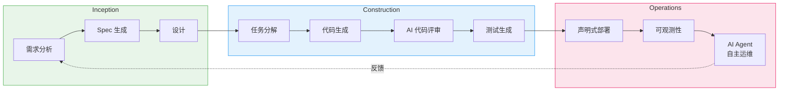
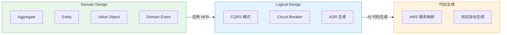
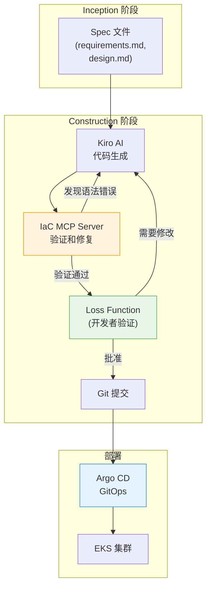

import { AidlcPhaseMapping, EksCapabilities, ProductivityMetrics, AidlcPrinciples, AidlcPhaseActivities, AiCodingAgentComparison, QualityGates, AiAgentEcosystem, DetailedMetrics, AidlcPipeline, AidlcArtifacts } from '@site/src/components/AidlcTables';

# AIDLC 框架 — EKS 环境下 AI 驱动的开发·运维高度化

> 📅 **撰写日期**: 2026-02-12 | **修改日期**: 2026-02-14 | ⏱️ **阅读时间**: 约 39 分钟

---

## 1. 概述

### 1.1 为什么选择 AIDLC

传统软件开发生命周期（SDLC）是以人为中心、长周期迭代（周/月为单位）为前提设计的。每日站会、Sprint 评审、回顾等仪式都是为这种长周期优化的。AI 的出现打破了这一前提。

AI 能够在**小时/天为单位**内完成需求分析、任务分解、代码生成和测试。将 AI 硬塞进（Retrofit）现有 SDLC 的做法会限制这种潜力——就像在汽车时代试图制造更快的马车一样。

**AIDLC（AI-Driven Development Lifecycle）**是 AWS Labs 提出的方法论，从**第一性原理（First Principles）**出发重新构建 AI，将其整合为开发生命周期的核心协作者。

```
传统 SDLC                            AIDLC
━━━━━━━━━━━━━━                      ━━━━━━━━━━━━━━━━━━━
人来规划和执行                          AI 提出建议，人来验证
周/月为单位迭代 (Sprint)               小时/天为单位迭代 (Bolt)
设计方法由团队自行选择                   DDD/BDD/TDD 内置于方法论中
角色竖井 (FE/BE/DevOps)               AI 打破角色边界
手动需求分析                            AI 将 Intent 分解为 Unit
顺序交接                               持续流 + Loss Function 验证
```

### 1.2 与 AIOps 战略的关联

[1. AIOps 战略指南](./aiops-introduction.md)中介绍的 AWS 开源战略 → MCP 集成 → AI 工具 → Kiro 编排是实现 AIDLC 的**技术基础**。[2. 智能可观测性技术栈](./aiops-observability-stack.md)中构建的 3-Pillar + AI 分析层是 Operations 阶段的**数据基础**。本文在这些技术和数据基础之上，提出**系统化提升开发与运维的方法论**。

```
[1] AIOps 战略指南 ──── 技术基础 (MCP, Kiro, AI Agent)
           │
[2] 智能可观测性技术栈 ──── 数据基础 (ADOT, AMP/AMG, CloudWatch AI)
           │
[3] AIDLC 框架 ── 方法论（本文档）
           │
[4] 预测性扩缩容与自动恢复 ──────── 深化 (ML 预测, 自动恢复, Chaos)
```

:::info 原文参考
AIDLC 的核心概念定义于 AWS Labs 的 [AI-DLC Method Definition](https://prod.d13rzhkk8cj2z0.amplifyapp.com/)。本文是在 EKS 环境中实际实施该方法论的指南。
:::

---

## 2. AIDLC 核心概念

### 2.1 十大原则

<AidlcPrinciples />

其中在 EKS 环境中特别重要的 3 项：

- **Reverse the Conversation Direction** — AI 通过 MCP 收集 EKS 集群状态，率先提出部署计划。开发者像 Google Maps 的驾驶员一样设定目的地（Intent），然后验证 AI 提出的路线。
- **Integration of Design Techniques** — 将 DDD 内置于方法论核心，AI 自动将业务逻辑建模为 Aggregate、Entity、Value Object。在 Scrum 中"由团队自行选择"的设计方法，在 AI-DLC 中成为必备核心。
- **Minimize Stages, Maximize Flow** — 最小化交接，实现持续流。每个阶段的人工验证扮演 **Loss Function** 的角色，在早期拦截可能向下游传播的错误。

### 2.2 核心产物 (Artifacts)

AI-DLC 重新定义了传统 SDLC 的术语以适应 AI 时代。

```
┌─────────┐    ┌─────────┐    ┌─────────┐
│  Intent  │───▶│  Unit   │───▶│  Bolt   │
│ 高层目标  │    │独立工作单元│   │快速迭代  │
│          │    │(DDD Sub- │   │(Sprint  │
│业务目标   │   │ domain)  │   │ 替代)   │
└─────────┘    └─────────┘    └─────────┘
                    │
              ┌─────┴─────┐
              ▼           ▼
        ┌──────────┐ ┌──────────┐
        │ Domain   │ │ Logical  │
        │ Design   │ │ Design   │
        │业务逻辑   │ │NFR+模式  │
        └──────────┘ └──────────┘
              │           │
              └─────┬─────┘
                    ▼
            ┌──────────────┐
            │ Deployment   │
            │    Unit      │
            │容器+Helm+     │
            │  Terraform   │
            └──────────────┘
```

<AidlcArtifacts />

:::tip Context Memory 与可追溯性
所有产物作为 **Context Memory** 保存，供 AI 在整个生命周期中参考。产物之间的双向追溯（Domain Model ↔ User Story ↔ 测试计划）得到保障，使 AI 始终在准确的上下文中工作。
:::

### 2.3 AI 驱动的递归式工作流

AI-DLC 的核心是 **AI 提出计划、人来验证的递归精化** 过程。

```
Intent (业务目标)
  │
  ▼
AI: 生成 Level 1 Plan ◀──── 人: 验证 · 修改
  │
  ├─▶ Step 1 ──▶ AI: Level 2 分解 ◀── 人: 验证
  │                 ├─▶ Sub-task 1.1 ──▶ AI 执行 ◀── 人: 验证
  │                 └─▶ Sub-task 1.2 ──▶ AI 执行 ◀── 人: 验证
  │
  ├─▶ Step 2 ──▶ AI: Level 2 分解 ◀── 人: 验证
  │                 └─▶ ...
  └─▶ Step N ──▶ ...

[所有产物 → Context Memory → 双向可追溯性]
```

每个阶段的人工验证就是 **Loss Function**——在早期捕获错误，防止向下游传播。AI 不规定按路径（新开发、重构、缺陷修复）的固定工作流，而是提出适合当前情况的 Level 1 Plan，这是一种灵活的方法。

### 2.4 AIDLC 三阶段概览

AIDLC 由 **Inception**、**Construction**、**Operations** 三个阶段组成。

<AidlcPhaseMapping />



<AidlcPhaseActivities />

---

## 3. Inception 阶段 — 从需求到设计

### 3.1 Mob Elaboration

Inception 的核心仪式是 **Mob Elaboration**——Product Owner、开发者、QA 齐聚一室，与 AI 协作进行需求精化的会议。

```
┌──────────────────────────────────────────────────┐
│              Mob Elaboration 仪式                  │
├──────────────────────────────────────────────────┤
│                                                   │
│  [AI] 将 Intent 分解为 User Story + Unit 提案     │
│    ↓                                              │
│  [PO + Dev + QA] 评审 · 调整过度/不足设计          │
│    ↓                                              │
│  [AI] 反映修改 → 追加生成 NFR · Risk               │
│    ↓                                              │
│  [团队] 最终验证 → 确定 Bolt 计划                   │
│                                                   │
├──────────────────────────────────────────────────┤
│  产物:                                            │
│  PRFAQ · User Stories · NFR 定义                  │
│  Risk Register · 度量标准 · Bolt 计划              │
└──────────────────────────────────────────────────┘
```

在传统方法论中需要**数周~数月**的顺序需求分析，通过 AI 生成初稿、团队同时评审，可以压缩到**数小时**。

### 3.2 Kiro Spec-Driven Inception

Kiro 将 Mob Elaboration 的产物体系化为 **Spec 文件**。将从自然语言需求到代码的整个过程结构化。

```
requirements.md → design.md → tasks.md → 代码生成 → 验证
```

**EKS 示例: Payment Service 部署**

`requirements.md`:

```markdown
# Payment Service 部署需求

## 功能需求
- REST API 端点: /api/v1/payments
- 与 DynamoDB 表集成
- 通过 SQS 进行异步事件处理

## 非功能需求
- P99 延迟: < 200ms
- 可用性: 99.95%
- 自动伸缩: 2-20 Pod
- EKS 1.35+ 兼容
```

`design.md`:

```markdown
# Payment Service 架构

## 基础设施配置
- EKS Deployment (3 replicas min)
- ACK DynamoDB Table (on-demand)
- ACK SQS Queue (FIFO)
- HPA (CPU 70%, Memory 80%)
- Karpenter NodePool (graviton, spot)

## 可观测性
- ADOT sidecar (traces → X-Ray)
- Application Signals (SLI/SLO 自动)
- CloudWatch Logs (/eks/payment-service)

## 安全
- Pod Identity (替代 IRSA)
- NetworkPolicy (namespace 隔离)
- Secrets Manager CSI Driver
```

`tasks.md`:

```markdown
# 实现任务

## Bolt 1: 基础设施
- [ ] 编写 ACK DynamoDB Table CRD
- [ ] 编写 ACK SQS Queue CRD
- [ ] 定义 KRO ResourceGroup (DynamoDB + SQS 集成)
- [ ] 配置 Karpenter NodePool (graviton, spot)

## Bolt 2: 应用
- [ ] 实现 Go REST API
- [ ] 集成 DynamoDB SDK
- [ ] 实现 SQS consumer
- [ ] Dockerfile + multi-stage build

## Bolt 3: 部署
- [ ] 编写 Helm chart
- [ ] 定义 Argo CD Application
- [ ] 编写 HPA manifest
- [ ] 编写 NetworkPolicy

## Bolt 4: 可观测性
- [ ] 配置 ADOT sidecar
- [ ] Application Signals annotation
- [ ] CloudWatch 仪表板
- [ ] SLO 告警设置
```

:::tip Spec-Driven 的核心价值
**指令式方式**: "创建 DynamoDB" → "还需要 SQS" → "现在部署" → 每次手动指示，存在上下文丢失风险
**Spec-Driven**: Kiro 分析 requirements.md → 生成 design.md → 分解 tasks.md → 自动生成代码 → 通过一致的 Context Memory 连接到验证
:::

### 3.3 基于 MCP 的实时上下文收集

Kiro 原生支持 MCP，在 Inception 阶段通过 AWS Hosted MCP 服务器收集实时基础设施状态。

```
[Kiro + MCP 交互]

Kiro: "检查 EKS 集群状态"
  → EKS MCP Server: get_cluster_status()
  → 响应: { version: "1.35", nodes: 5, status: "ACTIVE" }

Kiro: "成本分析"
  → Cost Analysis MCP Server: analyze_cost(service="EKS")
  → 响应: { monthly: "$450", recommendations: [...] }

Kiro: "分析当前工作负载"
  → EKS MCP Server: list_deployments(namespace="payment")
  → 响应: { deployments: [...], resource_usage: {...} }
```

通过这种方式，在生成 design.md 时可以实现**反映当前集群状态和成本的设计**。MCP 集成架构的详细内容请参阅 [1. AIOps 战略指南](./aiops-introduction.md)。

---

## 4. Construction 阶段 — 从设计到代码

### 4.1 DDD 集成: 从 Domain Design 到 Logical Design

在 AI-DLC 中，DDD 是**方法论的内置要素而非可选项**。AI 自动按照 DDD 原则对业务逻辑进行建模。



**Payment Service 示例**:

1. **Domain Design** — AI 对业务逻辑建模
   - Aggregate: `Payment` (transactionId, amount, status)
   - Entity: `PaymentMethod`, `Customer`
   - Value Object: `Money`, `Currency`
   - Domain Event: `PaymentCreated`, `PaymentCompleted`, `PaymentFailed`

2. **Logical Design** — 应用 NFR + 选择架构模式
   - CQRS: 支付创建(Command) / 查询(Query) 分离
   - Circuit Breaker: 外部支付网关调用
   - ADR: "DynamoDB on-demand vs provisioned" 决策记录

3. **代码生成** — AWS 服务映射
   - Aggregate → EKS Deployment + DynamoDB Table
   - Domain Event → SQS FIFO Queue
   - Circuit Breaker → Envoy sidecar + Istio

开发者在每个阶段**验证·调整** AI 生成的模型。这种验证就是 Loss Function 的作用。

### 4.2 Mob Construction

Construction 的核心仪式是 **Mob Construction**。团队齐聚一室各自开发自己的 Unit，交换在 Domain Design 阶段生成的集成规范（Integration Specification）。

```
[Mob Construction 流程]

Team A: Payment Unit        Team B: Notification Unit
  │                            │
  ├─ Domain Design 完成        ├─ Domain Design 完成
  │                            │
  └────── 交换集成规范 ──────┘
          (Domain Event 契约)
  │                            │
  ├─ Logical Design            ├─ Logical Design
  ├─ 代码生成                  ├─ 代码生成
  ├─ 测试                      ├─ 测试
  └─ Bolt 交付                 └─ Bolt 交付
```

各 Unit 松耦合，支持**并行开发**，通过 Domain Event 进行集成。AI 也会自动生成集成测试。

:::warning Brown-field（现有系统）方法
在对现有系统进行功能添加或重构时，Construction 阶段需要**额外步骤**：

1. AI 将现有代码**逆向工程为语义模型**（代码 → 模型提升）
   - **Static Model**: 组件、职责、关系
   - **Dynamic Model**: 主要用例的组件交互
2. 开发者验证·修正逆向工程的模型
3. 之后按照与 Green-field 相同的 Construction 流程进行

通过这种方式，AI 在准确把握现有系统上下文的状态下进行变更。
:::

### 4.3 AI 编码代理

AIDLC Construction 阶段使用的 AI 编码代理。Amazon Q Developer 和 Kiro 使用 **Anthropic Claude** 模型，Kiro 还支持开源权重模型，可实现成本优化和特殊领域扩展。

<AiCodingAgentComparison />

#### 4.3.4 Amazon Q Developer — 实时代码构建和测试 (2025)

AWS 于 2025 年 2 月发布了 **Amazon Q Developer 的实时代码执行功能**。这是一种创新方法，AI 生成代码后**自动构建并执行测试验证结果**，然后再呈现给开发者。在 AIDLC Construction 阶段**提前激活 Loss Function**，防止错误向下游传播的核心机制。

**实时代码执行功能**

传统 AI 编码工具在生成代码后需要开发者手动构建和测试。Q Developer 自动化了这一过程，实现了**代码生成 → 自动构建 → 测试执行 → 结果验证 → 开发者评审**的闭环。

```
传统方式:
  AI 代码生成 → 开发者手动构建 → 开发者手动测试 → 发现错误 → 反馈给 AI → 重新生成
  (迭代周期: 5-10 分钟)

Q Developer 实时执行:
  AI 代码生成 → 自动构建 → 自动测试 → 结果验证 → (错误时自动修正重试) → 开发者评审
  (迭代周期: 1-2 分钟, 开发者干预最小化)
```

**核心机制**

1. **自动构建流水线**
   - Q Developer 在代码更改后自动运行项目的构建工具（Maven, Gradle, npm, pip 等）
   - 即时检测编译错误和依赖冲突
   - 构建失败时分析错误消息并自动重试代码修正

2. **测试自动执行**
   - 自动执行单元测试和集成测试
   - 测试失败时分析失败原因并修正代码或测试
   - 在维护现有测试覆盖率的同时添加新代码

3. **开发者评审前验证**
   - 开发者收到的代码**已经通过了构建和测试**
   - 开发者专注于业务逻辑和设计评审（Loss Function 角色）
   - 验证的不是"代码能否运行？"而是"代码是否正确？"

**安全扫描自动修复建议**

Q Developer 自动扫描 Kubernetes YAML 和应用代码的安全漏洞，并提供修复建议。

**Kubernetes YAML 安全扫描**

1. **Root 权限检测**
   - 检测 `runAsUser: 0` 或 `runAsNonRoot: false`
   - 建议: `runAsUser: 1000`, `runAsNonRoot: true`

2. **Privileged 容器检测**
   - 检测 `securityContext.privileged: true`
   - 建议: 仅显式添加所需的 capabilities（如: `NET_ADMIN`）

3. **未设置 securityContext 检测**
   - Pod/Container 没有 `securityContext` 时发出警告
   - 建议: 按照最小权限原则添加 securityContext

**自动修复建议示例**

```yaml
# Q Developer 检测到的问题
apiVersion: v1
kind: Pod
metadata:
  name: payment-pod
spec:
  containers:
    - name: payment
      image: payment:v1
      securityContext:
        runAsUser: 0  # ⚠️ 使用 Root 权限
        privileged: true  # ⚠️ Privileged 模式

# Q Developer 建议的修复
apiVersion: v1
kind: Pod
metadata:
  name: payment-pod
spec:
  securityContext:
    runAsNonRoot: true
    runAsUser: 1000
    fsGroup: 1000
    seccompProfile:
      type: RuntimeDefault
  containers:
    - name: payment
      image: payment:v1
      securityContext:
        allowPrivilegeEscalation: false
        readOnlyRootFilesystem: true
        capabilities:
          drop:
            - ALL
          add:
            - NET_BIND_SERVICE  # 仅添加所需的 capabilities
```

**AIDLC Construction 阶段集成**

Q Developer 的实时执行和安全扫描**自动化了 Construction 阶段的 Quality Gate**，实现了 AIDLC 的快速迭代周期（Bolt）。

1. **在 Quality Gate 中自动运行 Q Developer 安全扫描**
   - Kiro 生成代码时将 Q Developer 安全扫描集成到流水线中
   - 自动扫描 Kubernetes manifest、Dockerfile、应用代码
   - 发现漏洞时向开发者提出修复建议（Loss Function）

2. **在 CI/CD 流水线中添加 Q Developer 验证步骤**
   - 创建 PR 时在 GitHub Actions/GitLab CI 中运行 Q Developer 扫描
   - 通过自动构建·测试保证"代码可运行"
   - 通过安全扫描保证"代码是安全的"
   - 开发者只需验证"代码是否正确"（角色分离）

**集成工作流示例**

```yaml
# .github/workflows/aidlc-construction.yml
name: AIDLC Construction Quality Gate
on:
  pull_request:
    types: [opened, synchronize]

jobs:
  q-developer-validation:
    runs-on: ubuntu-latest
    steps:
      - uses: actions/checkout@v4

      # 1. Q Developer 安全扫描
      - name: Q Developer Security Scan
        uses: aws/amazon-q-developer-action@v1
        with:
          scan-type: security
          source-path: .
          auto-fix: true  # 应用自动修复建议

      # 2. 实时构建和测试
      - name: Q Developer Build & Test
        uses: aws/amazon-q-developer-action@v1
        with:
          action: build-and-test
          test-coverage-threshold: 80

      # 3. Kubernetes manifest 验证
      - name: K8s Manifest Security Check
        run: |
          # 确认 Q Developer 建议的修复已应用
          kube-linter lint deploy/ --config .kube-linter.yaml

      # 4. 通过后才允许 Argo CD 同步
      - name: Approve for GitOps
        if: success()
        run: echo "Quality Gate passed. Ready for Argo CD sync."
```

**实际效果 — 反馈循环缩短**

```
传统 Construction 阶段:
  [开发者] 编写代码 (30 分钟)
    → [开发者] 手动构建 (2 分钟)
    → [开发者] 手动测试 (5 分钟)
    → [开发者] 发现错误 (10 分钟调试)
    → [开发者] 修改代码 (20 分钟)
    → 重复...
  总耗时: 2-3 小时

Q Developer 实时执行:
  [AI] 代码生成 (1 分钟)
    → [AI] 自动构建·测试 (30 秒)
    → [AI] 错误检测及自动修复 (1 分钟)
    → [开发者] Loss Function 验证 (10 分钟)
    → [Argo CD] 自动部署
  总耗时: 15-20 分钟
```

:::tip AIDLC 中 Q Developer 的价值
Q Developer 的实时执行实现了 AIDLC 的核心原则 **"Minimize Stages, Maximize Flow"**。自动化代码生成 → 构建 → 测试 → 验证的各个阶段，消除交接，开发者只需专注于**决策（Loss Function）**。这就是将传统 SDLC 的周/月单位周期缩短为 AIDLC 的小时/天单位周期的核心机制。
:::

**参考资料**

- [AWS DevOps Blog: Enhancing Code Generation with Real-Time Execution in Amazon Q Developer](https://aws.amazon.com/blogs/devops/enhancing-code-generation-with-real-time-execution-in-amazon-q-developer/) (2025-02-06)
- AWS re:Invent 2025 EKS Research — Section 13.4 参考

### 4.4 基于 EKS Capabilities 的声明式自动化

EKS Capabilities（2025.11）将热门开源工具作为 AWS 托管服务提供，以声明式方式部署 Construction 阶段的产物。

<EksCapabilities />

#### 4.4.1 Managed Argo CD — GitOps

Managed Argo CD 在 AWS 基础设施上以托管方式运行 GitOps。Kiro 生成的代码推送到 Git 后自动部署到 EKS。通过 Application CRD 管理单一环境，通过 ApplicationSet 声明式管理多环境（dev/staging/production）。

#### 4.4.2 ACK — AWS 资源声明式管理

ACK 以 K8s CRD 声明式管理 50+ AWS 服务。Kiro 生成的 Domain Design 中的基础设施要素（DynamoDB、SQS、S3 等）通过 `kubectl apply` 部署，自然集成到 Argo CD 的 GitOps 工作流中。

:::info ACK 的核心价值
使用 ACK 可以将**集群外部的 AWS 资源也纳入 K8s 声明式模型管理**。通过 K8s CRD 创建/修改/删除 DynamoDB、SQS、S3、RDS 等，这就是"以 K8s 为中心声明式管理所有基础设施"的策略。
:::

#### 4.4.3 KRO — 复合资源编排

KRO 将多个 K8s 资源捆绑为**单一部署单元（ResourceGroup）**。与 AIDLC 的 Deployment Unit 概念直接映射，将 Deployment + Service + HPA + ACK 资源作为一个 Custom Resource 创建。

#### 4.4.4 LBC v3 Gateway API

AWS Load Balancer Controller v3 将 Gateway API 正式 GA，提供 L4(NLB) + L7(ALB) 路由、QUIC/HTTP3、JWT 验证、Header 转换。通过 Gateway + HTTPRoute CRD 声明式管理流量。

#### 4.4.5 LBC v3 Gateway API — 高级功能详解

AWS Load Balancer Controller v3 的 Gateway API 支持通过 Kubernetes 标准流量管理 API 提供强大的 L4/L7 路由功能。这是在 AIDLC Construction 阶段声明式实现 Kiro Spec 网络需求的核心工具。

**Gateway API v1.4 + LBC v2.14+ 支持范围**

Gateway API 采用面向角色（role-oriented）的设计，使基础设施运维、集群运维和应用开发者能够在各自的职责范围内管理流量。

1. **L4 Routes — TCPRoute, UDPRoute, TLSRoute (NLB, v2.13.3+)**
   - **TCPRoute**: TCP 应用路由（如: PostgreSQL, Redis, gRPC with TCP）
   - **UDPRoute**: UDP 协议路由（如: DNS, QUIC, 游戏服务器）
   - **TLSRoute**: 基于 SNI（Server Name Indication）的 TLS 路由
   - 通过 Network Load Balancer(NLB) 配置，保证高吞吐量和低延迟
   - 示例: 多租户数据库集群中基于 SNI 的分片路由

2. **L7 Routes — HTTPRoute, GRPCRoute (ALB, v2.14.0+)**
   - **HTTPRoute**: 基于路径、Header、查询参数的 HTTP/HTTPS 路由
   - **GRPCRoute**: 基于 gRPC 方法名的路由，gRPC 专属 Header 管理
   - 通过 Application Load Balancer(ALB) 配置，支持基于内容的路由
   - 示例: `/api/v1/*` → v1 服务, `/api/v2/*` → v2 服务（金丝雀部署）

3. **QUIC 协议支持 (HTTP/3 on NLB)**
   - NLB 原生支持 HTTP/3(QUIC) 协议
   - 基于 UDP 解决 TCP 队头阻塞问题
   - 支持移动网络环境下的连接迁移（connection migration）
   - 示例: 实时视频流、游戏服务器、低延迟 API

**JWT 验证功能**

Gateway API v1.4 支持在 **Gateway 级别进行 JWT（JSON Web Token）验证**。通过将认证逻辑从后端服务分离来降低负载。

- **认证策略定义**: 在 Gateway 上声明 JWT 验证规则（发行者、公钥、声明验证）
- **降低后端负载**: 在 ALB/NLB 验证 JWT，提前拦截无效请求
- **集中式认证**: 多个服务复用通用认证策略
- **示例**: Payment Service 在 `/api/v1/payments` 路径上验证 `iss=https://auth.example.com`, `aud=payment-api`

**Header 转换**

HTTPRoute 可以动态添加·修改·删除请求和响应 Header。

- **RequestHeaderModifier**: 在转发到后端之前操作请求 Header
  - 示例: 添加 `X-User-ID` Header（从 JWT 声明中提取的用户 ID）
  - 示例: 强制 `X-Forwarded-Proto: https`（后端在代理后面时）
- **ResponseHeaderModifier**: 在响应客户端之前操作响应 Header
  - 示例: 添加 `X-Frame-Options: DENY`（安全 Header）
  - 示例: 移除 `Server` Header（防止信息泄露）

**在 AIDLC Construction 阶段的应用**

Gateway API 是将 Kiro Spec 中定义的网络需求通过 GitOps 工作流自动部署的核心工具。

1. **在 Kiro Spec 中定义 API 路由需求**
   - 在 `requirements.md` 中明确"通过金丝雀部署将 10% 流量路由到 v2"等需求
   - 在 `design.md` 中设计使用 Gateway API 的路由策略
   - Kiro 自动生成 HTTPRoute manifest

2. **通过 Gateway API CRD 声明式流量管理**
   - 一次 Git 提交即可部署 Gateway、GatewayClass、HTTPRoute
   - Argo CD 自动将变更同步到 EKS
   - LBC 配置 ALB/NLB 并应用路由规则

3. **金丝雀/蓝绿部署策略自动化**
   - 通过 HTTPRoute 的 `weight` 字段调整流量分配比例
   - 示例: v1 服务 90%, v2 服务 10% → 逐步将 v2 增加到 100%
   - 通过 CloudWatch Application Signals 监控各版本的 SLO
   - AI Agent 在 SLO 违规时自动回滚（与 Operations 阶段集成）

**Gateway, GatewayClass, HTTPRoute YAML 示例**

```yaml
# gatewayclass.yaml — 基础设施运维定义
apiVersion: gateway.networking.k8s.io/v1
kind: GatewayClass
metadata:
  name: aws-alb
spec:
  controllerName: gateway.alb.aws.amazon.com/controller
  description: "AWS Application Load Balancer"
---
# gateway.yaml — 集群运维定义
apiVersion: gateway.networking.k8s.io/v1
kind: Gateway
metadata:
  name: payment-gateway
  namespace: production
  annotations:
    gateway.alb.aws.amazon.com/scheme: internet-facing
    gateway.alb.aws.amazon.com/tags: Environment=production,Service=payment
spec:
  gatewayClassName: aws-alb
  listeners:
    - name: https
      protocol: HTTPS
      port: 443
      tls:
        mode: Terminate
        certificateRefs:
          - name: payment-tls-cert
            kind: Secret
      allowedRoutes:
        namespaces:
          from: Selector
          selector:
            matchLabels:
              gateway-access: enabled
---
# httproute.yaml — 应用开发者定义
apiVersion: gateway.networking.k8s.io/v1
kind: HTTPRoute
metadata:
  name: payment-api-route
  namespace: production
spec:
  parentRefs:
    - name: payment-gateway
      namespace: production
      sectionName: https
  rules:
    # 金丝雀部署: v1 90%, v2 10%
    - matches:
        - path:
            type: PathPrefix
            value: /api/v1/payments
      backendRefs:
        - name: payment-service-v1
          port: 8080
          weight: 90
        - name: payment-service-v2
          port: 8080
          weight: 10
      filters:
        # JWT 验证 (Gateway API v1.4)
        - type: RequestHeaderModifier
          requestHeaderModifier:
            add:
              - name: X-User-ID
                value: "{jwt.sub}"  # 从 JWT 声明中提取
        # 安全 Header 添加
        - type: ResponseHeaderModifier
          responseHeaderModifier:
            add:
              - name: X-Frame-Options
                value: DENY
              - name: X-Content-Type-Options
                value: nosniff
            remove:
              - Server  # 防止服务器信息泄露
---
# grpcroute.yaml — gRPC 服务路由
apiVersion: gateway.networking.k8s.io/v1alpha2
kind: GRPCRoute
metadata:
  name: payment-grpc-route
  namespace: production
spec:
  parentRefs:
    - name: payment-gateway
  rules:
    - matches:
        - method:
            service: payment.v1.PaymentService
            method: CreatePayment
      backendRefs:
        - name: payment-grpc-service
          port: 9090
```

:::tip Gateway API 与 Ingress 的比较
**Ingress** 在单个资源中定义所有路由规则，导致基础设施运维和开发者的职责混杂。**Gateway API** 通过 GatewayClass（基础设施）、Gateway（集群）、HTTPRoute（应用）分离角色，使各团队能够独立工作。这与 AIDLC 的 **Loss Function** 概念一致——在每一层进行验证以防止错误传播。
:::

**参考资料**

- [Kubernetes Gateway API v1.4 Release](https://kubernetes.io/blog/2025/11/06/gateway-api-v1-4/) (2025-11-06)
- [AWS Load Balancer Controller — Gateway API Docs](https://kubernetes-sigs.github.io/aws-load-balancer-controller/latest/guide/gateway/gateway/)
- [Kubernetes Gateway API in Action (AWS Blog)](https://aws.amazon.com/blogs/containers/kubernetes-gateway-api-in-action/)
- AWS re:Invent 2025 EKS Research — Section 3.5 参考

#### 4.4.6 Node Readiness Controller — 声明式节点就绪状态管理

**Node Readiness Controller（NRC）**是一个控制器，声明式定义 Kubernetes 节点在接受工作负载之前必须满足的条件。这是在 AIDLC Construction 阶段将基础设施需求表达为代码并通过 GitOps 自动应用的核心工具。

**核心概念**

NRC 通过 `NodeReadinessRule` CRD 定义节点在转换为"Ready"状态之前必须满足的条件。传统上节点就绪状态由 kubelet 自动决定，但使用 NRC 可以**将特定于应用的需求声明式注入到基础设施层**。

- **声明式策略**: 通过 `NodeReadinessRule` 以 YAML 定义节点就绪条件
- **GitOps 兼容**: 通过 Argo CD 对节点就绪策略进行版本管理和自动部署
- **工作负载保护**: 在必要的 DaemonSet（CNI、CSI、安全代理）就绪之前阻止调度

**在 AIDLC 各阶段的应用**

| 阶段 | NRC 角色 | 示例 |
|------|----------|------|
| **Inception** | AI 分析工作负载需求 → 自动定义所需的 NodeReadinessRule | "GPU 工作负载仅在 NVIDIA device plugin 就绪后才调度" |
| **Construction** | 将 NRC 规则包含在 Helm chart 中，作为 Terraform EKS Blueprints AddOn 部署 | Kiro 自动生成 `NodeReadinessRule` manifest |
| **Operations** | NRC 在运行时自动管理节点就绪状态，AI 分析规则效果 | 通过 CloudWatch Application Signals 追踪节点就绪延迟 |

**Infrastructure as Code 视角**

NRC 将 AIDLC 的"基础设施即代码，基础设施也要测试"原则扩展到节点级别。

1. **基于 GitOps 的策略管理**
   - 将 `NodeReadinessRule` CRD 存储在 Git 仓库中
   - Argo CD 自动同步到 EKS 集群
   - 策略变更时一次 Git 提交即可应用到整个集群

2. **Kiro + MCP 自动化**
   - Kiro 从 Inception 阶段的 `design.md` 解析工作负载需求
   - 通过 EKS MCP Server 确认当前集群的 DaemonSet 状态
   - 自动生成所需的 `NodeReadinessRule` 并添加到 IaC 仓库

3. **Terraform EKS Blueprints 集成**
   - 将 NRC 控制器作为 EKS Blueprints AddOn 声明式安装
   - 通过 Helm values 自动化默认策略设置
   - 在多集群环境中应用一致的节点就绪策略

**Quality Gate 集成**

在 AIDLC 的 Quality Gate 阶段，NRC 作为部署前验证节点就绪状态的工具使用。

- **部署前 Dry-run**: 模拟应用 NRC 规则后对现有工作负载的影响
- **CI/CD 流水线验证**: 在 GitHub Actions/GitLab CI 中进行 `kubectl apply --dry-run` + NRC 规则有效性检查
- **作为 Loss Function 的角色**: 在错误的节点就绪策略部署到生产环境之前进行拦截

**YAML 示例: GPU 工作负载用 NodeReadinessRule**

```yaml
apiVersion: node.k8s.io/v1alpha1
kind: NodeReadinessRule
metadata:
  name: gpu-node-readiness
  namespace: kube-system
spec:
  # 仅应用于 GPU 节点
  nodeSelector:
    matchLabels:
      node.kubernetes.io/instance-type: p4d.24xlarge
  # 在以下 DaemonSet 全部 Ready 之前不将节点转换为 Ready
  requiredDaemonSets:
    - name: nvidia-device-plugin-daemonset
      namespace: kube-system
    - name: gpu-feature-discovery
      namespace: kube-system
    - name: dcgm-exporter
      namespace: monitoring
  # 超时: 10 分钟内未满足条件则保持节点为 NotReady
  timeout: 10m
```

**实战使用场景**

| 场景 | NRC 规则 | 效果 |
|----------|----------|------|
| **Cilium CNI 集群** | 等待 Cilium agent Ready | 防止在网络初始化前调度 Pod |
| **GPU 集群** | 等待 NVIDIA device plugin + DCGM exporter 就绪 | 在 GPU 资源暴露前阻止工作负载调度 |
| **安全加固环境** | 等待 Falco, OPA Gatekeeper 就绪 | 防止在安全策略应用前执行工作负载 |
| **存储工作负载** | 等待 EBS CSI driver + snapshot controller 就绪 | 防止卷挂载失败 |

**Terraform EKS Blueprints AddOn 示例**

```hcl
module "eks_blueprints_addons" {
  source = "aws-ia/eks-blueprints-addons/aws"

  cluster_name      = module.eks.cluster_name
  cluster_endpoint  = module.eks.cluster_endpoint

  enable_node_readiness_controller = true
  node_readiness_controller = {
    namespace = "kube-system"
    values = [
      yamlencode({
        defaultRules = {
          cilium = {
            enabled = true
            daemonSets = ["cilium"]
          }
          gpuNodes = {
            enabled = true
            nodeSelector = {
              "node.kubernetes.io/instance-type" = "p4d.24xlarge"
            }
            daemonSets = ["nvidia-device-plugin-daemonset", "dcgm-exporter"]
          }
        }
      })
    ]
  }
}
```

:::tip NRC + AIDLC 协同效应
Node Readiness Controller 将 AIDLC 的**"声明式表达基础设施需求并自动验证"**原则扩展到节点级别。Kiro 在 Inception 阶段分析工作负载需求自动生成 `NodeReadinessRule`，Argo CD 通过 GitOps 部署，在 Operations 阶段 AI Agent 自动检测和响应节点就绪状态异常。
:::

**参考资料**

- [Kubernetes Blog: Introducing Node Readiness Controller](https://kubernetes.io/blog/2026/02/03/introducing-node-readiness-controller/) (2026-02-03)
- [Node Readiness Controller GitHub Repository](https://github.com/kubernetes-sigs/node-readiness-controller)

:::tip EKS Capabilities + AIDLC 协同效应
Managed Argo CD（部署）+ ACK（基础设施）+ KRO（编排）+ LBC v3（网络）+ NRC（节点就绪）结合后，Kiro 从 Spec 生成的所有产物都可以通过**一次 Git Push 完成全栈部署**。这就是 Construction → Operations 转换的核心。
:::

### 4.5 基于 MCP 的 IaC 自动化流水线

结合 Kiro 和 AWS Hosted MCP 服务器，可以从 Inception 的 Spec 到 Construction 的 IaC 自动生成并通过 Argo CD 部署。

<AidlcPipeline />

#### 4.5.3 AWS IaC MCP Server — CDK/CloudFormation AI 支持

AWS 于 2025 年 11 月 28 日发布了 **AWS Infrastructure as Code (IaC) MCP Server**。这是一个编程接口，使 Kiro CLI 等 AI 工具能够搜索 CloudFormation 和 CDK 文档、自动验证模板，并让 AI 支持部署故障排除。

**AWS IaC MCP Server 概述**

AWS IaC MCP Server 通过 Model Context Protocol 提供以下功能：

- **文档搜索**: 实时搜索 CloudFormation 资源类型、CDK 构造、最佳实践
- **模板验证**: 自动检测 IaC 模板的语法错误并建议修复
- **部署故障排除**: 栈部署失败时分析根本原因并提出解决方案
- **编程式访问**: 与 Kiro、Amazon Q Developer 等 AI 工具原生集成

**AIDLC Construction 阶段集成**

在 AIDLC 的 Construction 阶段，IaC MCP Server 的应用方式如下：

1. **Kiro Spec → IaC 代码生成验证**
   - 基于 Inception 阶段生成的 `design.md`，Kiro 生成 CDK/Terraform/Helm 代码
   - IaC MCP Server 自动验证生成代码的语法、资源约束、安全策略合规性
   - 对于 CloudFormation 模板，预先检测资源类型拼写错误、循环依赖、错误属性

2. **CloudFormation 模板语法错误自动修复**
   - 部署前对模板进行静态分析以识别错误模式
   - 示例: `Properties` 拼写错误 → `Properties`，错误的内置函数 → 建议正确的函数
   - 修复建议由 Kiro 自动应用或请求开发者进行 Loss Function 验证

3. **与现有基础设施的兼容性预验证**
   - 与 EKS MCP Server、Cost Analysis MCP 集成，分析当前集群状态
   - 验证新的 IaC 代码与现有资源（VPC、子网、安全组）是否冲突
   - 示例: 创建 DynamoDB 表时检查与现有表的名称重复，确认 VPC 端点是否可复用

**代码示例: 在 Kiro 中使用 IaC MCP Server 的工作流**

```bash
# 1. 激活 IaC MCP Server
kiro mcp add aws-iac

# 2. 从 Spec 文件生成 IaC 代码
kiro generate --spec requirements.md --output infra/

# 3. IaC MCP Server 自动执行的验证过程
# - CloudFormation 模板语法检查
# - CDK construct 兼容性验证
# - 资源约束条件确认（如: DynamoDB on-demand vs provisioned）

# 4. 确认验证结果
kiro verify --target infra/

# 输出示例:
# ✓ CloudFormation syntax valid
# ⚠ Warning: DynamoDB table 'payments' uses on-demand billing (estimated $150/month)
# ✓ VPC endpoint 'vpce-dynamodb' already exists, reusing
# ✗ Error: Security group 'sg-app' conflicts with existing rule

# 5. 自动修复错误
kiro fix --interactive

# IaC MCP Server 建议的修复:
# - Security group rule conflict → 更改为新的规则 ID
# - 开发者批准后自动应用

# 6. 通过 Argo CD 部署
git add infra/ && git commit -m "Add Payment Service infrastructure"
git push origin main
# Argo CD 自动 synced → 部署到 EKS
```

**Construction 阶段的集成流程**



:::tip IaC MCP Server 与 Kiro 的协同效应
AWS IaC MCP Server 与 Kiro 的 Spec-driven 开发结合，自动验证基础设施代码的质量。可通过 `kiro mcp add aws-iac` 命令激活，确保生成的 CloudFormation/CDK 代码自动遵循 AWS 最佳实践。这在 Construction 阶段扮演**提前捕获 IaC 错误的 Loss Function** 角色。
:::

**参考资料**

- [AWS DevOps Blog: Introducing the AWS IaC MCP Server](https://aws.amazon.com/blogs/devops/introducing-the-aws-infrastructure-as-code-mcp-server-ai-powered-cdk-and-cloudformation-assistance/) (2025-11-28)

---

