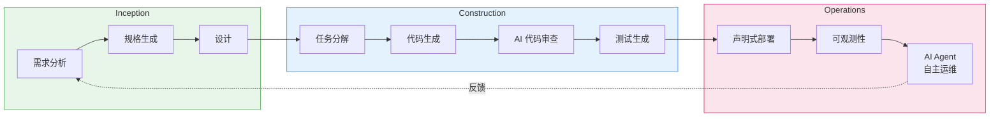
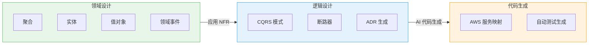

import { AidlcPhaseMapping, EksCapabilities, ProductivityMetrics, AidlcPrinciples, AidlcPhaseActivities, AiCodingAgentComparison, QualityGates, AiAgentEcosystem, DetailedMetrics, AidlcPipeline, AidlcArtifacts } from '@site/src/components/AidlcTables';

# AIDLC 框架 — 在 EKS 环境中的 AI 驱动开发与运维增强

> 📅 **撰写日期**: 2026-02-12 | ⏱️ **阅读时间**: 约 30 分钟 | 📌 **目标环境**: EKS 1.35+, Kiro, Managed Argo CD

---

## 1. 概述

### 1.1 为什么需要 AIDLC

传统的软件开发生命周期(SDLC)是围绕以人为中心、长迭代周期(每周/每月)设计的。每日站会、冲刺评审和回顾等仪式是为这些延长的周期优化的。AI 的出现打破了这一前提。

AI 可以在**几小时/几天**内完成需求分析、任务分解、代码生成和测试。将 AI 改装到现有的 SDLC 方法中会限制这种潜力——就像在汽车时代建造更快的马车一样。

**AIDLC (AI 驱动开发生命周期)** 是 AWS 实验室提出的一种方法论,它从**第一性原理**重新构建开发生命周期,将 AI 集成为核心协作者。

```
传统 SDLC                          AIDLC
━━━━━━━━━━━━━━                      ━━━━━━━━━━━━━━━━━━━
人类计划和执行                        AI 提议,人类验证
每周/每月迭代(Sprint)                 每小时/每天迭代(Bolt)
设计技术是团队选择                     DDD/BDD/TDD 内置于方法论
角色孤岛(FE/BE/DevOps)                AI 超越角色边界
手动需求分析                          AI 将 Intent 分解为 Units
顺序交接                             持续流动 + Loss Function 验证
```

### 1.2 与 AIOps 策略的联系

[AIOps 策略指南](./aiops-introduction.md)中讨论的 AWS 开源策略 → MCP 集成 → AI 工具 → Kiro 编排形成了实现 AIDLC 的**技术基础**。在[智能可观测性堆栈](./aiops-observability-stack.md)中构建的三柱 + AI 分析层提供了运维阶段的**数据基础**。本文档在该技术和数据基础之上呈现了一种**系统化增强开发和运维的方法论**。

```
[文档 1] AIOps 策略 ──── 技术基础 (MCP, Kiro, AI Agent)
           │
[文档 2] 可观测性堆栈 ──── 数据基础 (ADOT, AMP/AMG, CloudWatch AI)
           │
[文档 3] AIDLC 框架 ── 方法论 (本文档)
           │
[文档 4] 预测性运维 ──────── 高级 (ML 预测, 自动恢复, Chaos)
```

:::info 原始参考
核心 AIDLC 概念定义在 AWS 实验室的 [AI-DLC 方法定义](https://prod.d13rzhkk8cj2z0.amplifyapp.com/)中。本文档是该方法论在 EKS 环境中的实践实施指南。
:::

---

## 2. AIDLC 核心概念

### 2.1 10 条原则

<AidlcPrinciples />

在 EKS 环境中特别重要的三个原则:

- **反转对话方向** — AI 通过 MCP 收集 EKS 集群状态并首先提出部署计划。开发人员像使用 Google 地图的司机一样设置目的地(Intent)并验证 AI 呈现的路线。
- **设计技术的集成** — DDD 嵌入方法论的核心,AI 自动将业务逻辑建模为聚合、实体和值对象。在 Scrum 中是"团队选择"的设计技术在 AI-DLC 中是强制性核心。
- **最小化阶段,最大化流动** — 最小化交接并实现持续流动。每个阶段的人工验证充当**损失函数**,在错误向下游传播之前及早拦截。

### 2.2 核心产物

AI-DLC 为 AI 时代重新定义传统 SDLC 术语。

```
┌─────────┐    ┌─────────┐    ┌─────────┐
│  Intent  │───▶│  Unit   │───▶│  Bolt   │
│高层次    │    │独立工作  │   │ 快速    │
│ 目的     │    │单元(DDD  │   │迭代     │
│业务目标  │    │子域)     │   │(替代    │
│          │    │          │   │Sprint)  │
└─────────┘    └─────────┘    └─────────┘
                    │
              ┌─────┴─────┐
              ▼           ▼
        ┌──────────┐ ┌──────────┐
        │ Domain   │ │ Logical  │
        │ Design   │ │ Design   │
        │业务逻辑  │ │NFR+      │
        │          │ │模式      │
        └──────────┘ └──────────┘
              │           │
              └─────┬─────┘
                    ▼
            ┌──────────────┐
            │ Deployment   │
            │    Unit      │
            │Container+    │
            │Helm+Terraform│
            └──────────────┘
```

<AidlcArtifacts />

:::tip 上下文内存和可追溯性
所有产物都存储在**上下文内存**中,供 AI 在整个生命周期中参考。产物之间的双向可追溯性(领域模型 ↔ 用户故事 ↔ 测试计划)得到保证,确保 AI 始终使用准确的上下文工作。
:::

### 2.3 AI 驱动的递归工作流

AI-DLC 的核心是一个**递归细化过程,其中 AI 提出计划,人类验证**。

```
Intent (业务目的)
  │
  ▼
AI: 生成 Level 1 计划 ◀──── 人类: 验证 · 修改
  │
  ├─▶ 步骤 1 ──▶ AI: Level 2 分解 ◀── 人类: 验证
  │                 ├─▶ 子任务 1.1 ──▶ AI 执行 ◀── 人类: 验证
  │                 └─▶ 子任务 1.2 ──▶ AI 执行 ◀── 人类: 验证
  │
  ├─▶ 步骤 2 ──▶ AI: Level 2 分解 ◀── 人类: 验证
  │                 └─▶ ...
  └─▶ 步骤 N ──▶ ...

[所有产物 → 上下文内存 → 双向可追溯性]
```

每个阶段的人工验证充当**损失函数**——及早捕获错误以防止下游传播。这是一种灵活的方法,AI 不按路径(新开发、重构、缺陷修复)规定固定工作流,而是根据情况提出适合的 Level 1 计划。

### 2.4 AIDLC 三阶段概述

AIDLC 由三个阶段组成:**启动**、**构建**、**运维**。

<AidlcPhaseMapping />



<AidlcPhaseActivities />

---

## 3. 启动阶段 — 从需求到设计

### 3.1 Mob Elaboration

启动阶段的核心仪式是**Mob Elaboration**——产品负责人、开发人员和 QA 在一个房间聚集,与 AI 协作的需求细化会议。

```
┌──────────────────────────────────────────────────┐
│              Mob Elaboration 仪式                  │
├──────────────────────────────────────────────────┤
│                                                   │
│  [AI] 提议将 Intent 分解为                         │
│       用户故事 + Units                             │
│    ↓                                              │
│  [PO + Dev + QA] 审查 · 调整过度/不足              │
│                   工程化                           │
│    ↓                                              │
│  [AI] 反映修改 → 生成额外                          │
│       NFR · 风险                                   │
│    ↓                                              │
│  [团队] 最终验证 → 确认 Bolt 计划                  │
│                                                   │
├──────────────────────────────────────────────────┤
│  输出:                                             │
│  PRFAQ · 用户故事 · NFR 定义                       │
│  风险登记 · 指标 · Bolt 计划                       │
└──────────────────────────────────────────────────┘
```

传统方法论中需要**数周到数月**的顺序需求分析,通过让 AI 生成草稿和团队同时审查,被压缩到**几小时**。

### 3.2 Kiro 规格驱动启动

Kiro 将 Mob Elaboration 输出系统化为**规格文件**,将从自然语言需求到代码的整个过程结构化。

```
requirements.md → design.md → tasks.md → 代码生成 → 验证
```

**EKS 示例: 支付服务部署**

`requirements.md`:

```markdown
# 支付服务部署需求

## 功能需求
- REST API 端点: /api/v1/payments
- 与 DynamoDB 表集成
- 通过 SQS 异步事件处理

## 非功能需求
- P99 延迟: < 200ms
- 可用性: 99.95%
- 自动扩展: 2-20 Pods
- EKS 1.35+ 兼容
```

`design.md`:

```markdown
# 支付服务架构

## 基础设施配置
- EKS Deployment (3 副本最小)
- ACK DynamoDB Table (按需)
- ACK SQS Queue (FIFO)
- HPA (CPU 70%, Memory 80%)
- Karpenter NodePool (graviton, spot)

## 可观测性
- ADOT sidecar (traces → X-Ray)
- Application Signals (自动 SLI/SLO)
- CloudWatch Logs (/eks/payment-service)

## 安全
- Pod Identity (替代 IRSA)
- NetworkPolicy (命名空间隔离)
- Secrets Manager CSI Driver
```

`tasks.md`:

```markdown
# 实施任务

## Bolt 1: 基础设施
- [ ] 编写 ACK DynamoDB Table CRD
- [ ] 编写 ACK SQS Queue CRD
- [ ] 定义 KRO ResourceGroup (DynamoDB + SQS 集成)
- [ ] 配置 Karpenter NodePool (graviton, spot)

## Bolt 2: 应用
- [ ] 实现 Go REST API
- [ ] DynamoDB SDK 集成
- [ ] 实现 SQS 消费者
- [ ] Dockerfile + 多阶段构建

## Bolt 3: 部署
- [ ] 编写 Helm chart
- [ ] 定义 Argo CD Application
- [ ] 编写 HPA manifest
- [ ] 编写 NetworkPolicy

## Bolt 4: 可观测性
- [ ] 配置 ADOT sidecar
- [ ] Application Signals 注解
- [ ] CloudWatch 仪表板
- [ ] SLO 告警配置
```

:::tip 规格驱动的核心价值
**指令方法**: "创建 DynamoDB" → "还需要 SQS" → "现在部署它" → 每次手动指令,有上下文丢失的风险
**规格驱动**: Kiro 分析 requirements.md → 生成 design.md → 分解 tasks.md → 自动生成代码 → 验证,所有内容通过一致的上下文内存连接
:::

### 3.3 基于 MCP 的实时上下文收集

Kiro 是 MCP 原生的,在启动阶段通过 AWS 托管的 MCP 服务器收集实时基础设施状态。

```
[Kiro + MCP 交互]

Kiro: "检查 EKS 集群状态"
  → EKS MCP Server: get_cluster_status()
  → 响应: { version: "1.35", nodes: 5, status: "ACTIVE" }

Kiro: "分析成本"
  → Cost Analysis MCP Server: analyze_cost(service="EKS")
  → 响应: { monthly: "$450", recommendations: [...] }

Kiro: "分析当前工作负载"
  → EKS MCP Server: list_deployments(namespace="payment")
  → 响应: { deployments: [...], resource_usage: {...} }
```

这使得在生成 design.md 时能够创建**反映当前集群状态和成本的设计**。有关 MCP 集成架构的详细信息,请参阅 [AIOps 策略指南 — MCP 集成接口](./aiops-introduction.md)。

---

## 4. 构建阶段 — 从设计到代码

### 4.1 DDD 集成: 从领域设计到逻辑设计

在 AI-DLC 中,DDD **不是可选的,而是内置的方法论元素**。AI 根据 DDD 原则自动建模业务逻辑。



**支付服务示例**:

1. **领域设计** — AI 建模业务逻辑
   - 聚合: `Payment` (transactionId, amount, status)
   - 实体: `PaymentMethod`, `Customer`
   - 值对象: `Money`, `Currency`
   - 领域事件: `PaymentCreated`, `PaymentCompleted`, `PaymentFailed`

2. **逻辑设计** — 应用 NFR + 选择架构模式
   - CQRS: 分离支付创建(命令) / 查询(查询)
   - 断路器: 外部支付网关调用
   - ADR: 记录 "DynamoDB 按需 vs 预配置" 决策

3. **代码生成** — 映射到 AWS 服务
   - 聚合 → EKS Deployment + DynamoDB Table
   - 领域事件 → SQS FIFO Queue
   - 断路器 → Envoy sidecar + Istio

开发人员在每个阶段**验证和调整** AI 生成的模型。这种验证充当损失函数。

### 4.2 Mob Construction

构建阶段的核心仪式是**Mob Construction**。团队在一个房间聚集,每个人开发自己的 Units,同时交换在领域设计阶段生成的集成规范。

```
[Mob Construction 流程]

团队 A: 支付 Unit            团队 B: 通知 Unit
  │                            │
  ├─ 领域设计完成              ├─ 领域设计完成
  │                            │
  └────── 交换集成规范 ──────┘
          (领域事件契约)
  │                            │
  ├─ 逻辑设计                  ├─ 逻辑设计
  ├─ 代码生成                  ├─ 代码生成
  ├─ 测试                      ├─ 测试
  └─ 交付 Bolt                 └─ 交付 Bolt
```

每个 Unit 都是松耦合的,实现**并行开发**,并通过领域事件集成。AI 还会自动生成集成测试。

:::warning Brown-field (遗留系统) 方法
在向现有系统添加功能或重构时,构建阶段需要**额外步骤**:

1. AI **逆向工程**现有代码为语义模型(代码 → 模型提升)
   - **静态模型**: 组件、职责、关系
   - **动态模型**: 关键用例中的组件交互
2. 开发人员验证和修改逆向工程的模型
3. 按照与 Green-field 相同的构建流程进行

这确保 AI 在进行更改之前准确理解现有系统的上下文。
:::

### 4.3 AI 编码代理

AIDLC 构建阶段中使用的 AI 编码代理。Amazon Q Developer 和 Kiro 使用 **Anthropic Claude** 模型,而 Kiro 还支持开放权重模型以进行成本优化和专业化领域扩展。

<AiCodingAgentComparison />

### 4.4 基于 EKS Capabilities 的声明式自动化

EKS Capabilities (2025.11) 将流行的开源工具作为 AWS 托管服务提供,实现构建阶段输出的声明式部署。

<EksCapabilities />

#### 4.4.1 Managed Argo CD — GitOps

Managed Argo CD 在 AWS 基础设施上作为托管服务运行 GitOps。Kiro 生成的代码在 Git 推送时自动部署到 EKS。使用 Application CRD 管理单个环境,使用 ApplicationSets 声明式管理多个环境(dev/staging/production)。

#### 4.4.2 ACK — 声明式 AWS 资源管理

ACK 通过 K8s CRD 声明式管理 50 多个 AWS 服务。Kiro 生成的领域设计中的基础设施元素(DynamoDB、SQS、S3 等)使用 `kubectl apply` 部署,并自然集成到 Argo CD 的 GitOps 工作流中。

:::info ACK 的核心价值
使用 ACK,您可以**使用 K8s 声明式模型管理集群外的 AWS 资源**。通过 K8s CRD 创建/修改/删除 DynamoDB、SQS、S3、RDS 等,实现"围绕 K8s 集中声明式管理所有基础设施"的策略。
:::

#### 4.4.3 KRO — 复合资源编排

KRO 将多个 K8s 资源捆绑为**单个部署单元 (ResourceGroup)**。直接映射到 AIDLC 的部署单元概念,将 Deployment + Service + HPA + ACK 资源作为一个自定义资源创建。

#### 4.4.4 LBC v3 Gateway API

AWS Load Balancer Controller v3 将 Gateway API 过渡到 GA,提供 L4 (NLB) + L7 (ALB) 路由、QUIC/HTTP3、JWT 验证和标头转换。使用 Gateway + HTTPRoute CRD 声明式管理流量。

:::tip EKS Capabilities + AIDLC 协同
Managed Argo CD (部署) + ACK (基础设施) + KRO (编排) + LBC v3 (网络) 的组合使得通过**单个 Git Push** 完成从规格生成的所有产物的全栈部署成为可能。这是构建 → 运维过渡的核心。
:::

### 4.5 基于 MCP 的 IaC 自动化流水线

将 Kiro 与 AWS 托管的 MCP 服务器结合,可以从启动规格自动生成构建 IaC 并通过 Argo CD 部署。

<AidlcPipeline />

---

## 5. 运维阶段 — 从部署到自主运维

### 5.1 可观测性基础 — 文档 2 连接

运维阶段的数据基础是在[智能可观测性堆栈](./aiops-observability-stack.md)中构建的 5 层架构。

```
[可观测性堆栈 → 运维连接]

收集层 (ADOT, CloudWatch Agent, NFM Agent)
      ↓
传输层 (OTLP, Prometheus Remote Write)
      ↓
存储层 (AMP, CloudWatch, X-Ray)
      ↓
分析层 (AMG, CloudWatch AI, DevOps Guru)
      ↓
行动层 ← AIDLC 运维定位在这里
  ├── 基于 MCP 的集成分析
  ├── AI Agent 自动响应
  └── 预测性扩展
```

可观测性堆栈收集的指标、日志和跟踪通过 MCP 传递给 AI 工具和代理,形成运维阶段的决策基础。

### 5.2 AI Agent 运维自动化

<AiAgentEcosystem />

#### 5.2.1 Amazon Q Developer (GA)

最成熟的生产模式。可立即用于 CloudWatch 调查和 EKS 故障排除。

- **CloudWatch Investigations**: AI 检测指标异常并分析根本原因
- **EKS Troubleshooting**: 以自然语言诊断集群状态、Pod 故障、节点问题
- **Security Scanning**: 检测代码漏洞 + 建议自动修复

#### 5.2.2 Strands Agents (OSS)

AWS 生产验证的代理 SDK,以自然语言定义**代理 SOP(标准操作程序)**。

```python
# Strands Agent SOP: Pod CrashLoopBackOff 响应
from strands import Agent
from strands.tools import eks_tool, cloudwatch_tool, slack_tool

ops_agent = Agent(
    name="eks-incident-responder",
    model="bedrock/anthropic.claude-sonnet",
    tools=[eks_tool, cloudwatch_tool, slack_tool],
    sop="""
    ## Pod CrashLoopBackOff 响应 SOP

    1. 识别失败的 Pod
       - kubectl get pods --field-selector=status.phase!=Running
       - 记录命名空间、Pod 名称、重启计数

    2. 分析日志
       - kubectl logs <pod> --previous
       - 分类错误模式: OOM, ConfigError, DependencyFailure

    3. 诊断根本原因
       - OOM → 检查内存限制
       - ConfigError → 检查 ConfigMap/Secret
       - DependencyFailure → 检查依赖服务状态

    4. 自动响应
       - OOM 且 limits < 2Gi → 将 limits 修补为 1.5x (自动)
       - ConfigError → Slack 告警 + 提及负责人 (手动)
       - DependencyFailure → 尝试重启依赖服务 (自动)

    5. 事后报告
       - 向 Slack #incidents 频道发布事件报告
    """
)
```

#### 5.2.3 Kagent (K8s 原生)

使用 K8s CRD 声明式管理 AI 代理。支持 MCP 集成(kmcp),但仍处于早期阶段。

```yaml
# Kagent Agent 定义
apiVersion: kagent.dev/v1alpha1
kind: Agent
metadata:
  name: eks-ops-agent
  namespace: kagent-system
spec:
  description: "EKS 运维自动化代理"
  modelConfig:
    provider: bedrock
    model: anthropic.claude-sonnet
    region: ap-northeast-2
  systemPrompt: |
    EKS 集群运维代理。
    自动诊断和响应 Pod 故障、节点问题、扩展问题。
    仅执行安全操作;对于风险变更请求批准。
  tools:
    - name: kubectl
      type: kmcp
      config:
        server: kubernetes.default.svc
        namespace: "*"
        allowedVerbs: ["get", "describe", "logs", "top"]
    - name: cloudwatch
      type: kmcp
      config:
        region: ap-northeast-2
        actions: ["GetMetricData", "DescribeAlarms"]
```

:::tip 采用顺序
**首先**完全采用 Q Developer (GA) 完全托管分析,**然后**添加 Strands (OSS) 基于 SOP 的工作流,**最后**逐步扩展 Kagent (早期阶段) K8s 原生方法。与 [AIOps 策略指南](./aiops-introduction.md)成熟度模型 Level 3→4 过渡一致。
:::

### 5.3 从 CI/CD 到 AI/CD

在 AIDLC 中,部署流水线从传统 CI/CD 演变为 AI 增强的 **AI/CD**。

```
[CI/CD → AI/CD 转换]

传统 CI/CD:
  代码提交 → 构建 → 测试 → 手动批准 → 部署

AI/CD:
  规格提交 → AI 代码生成 → AI 安全扫描 → AI 审查
     → Loss Function 验证 (人工) → Argo CD 自动部署
     → AI 可观测性监控 → AI Agent 自动响应
```

关键转换点:
- **代码提交** → **规格提交** (requirements.md 触发)
- **手动批准** → **AI 审查 + Loss Function 验证** (人类关注决策)
- **手动监控** → **AI Agent 自主响应** (基于 MCP 的集成分析)

:::info 运维高级主题
高级运维模式,如基于 ML 的预测性扩展、Karpenter + AI 预测、混沌工程 + AI 学习,在[预测性扩展和自动恢复](./aiops-predictive-operations.md)中介绍。
:::

---

## 6. 质量门 — 所有阶段的质量保证

在 AI-DLC 中,人工验证是一个**损失函数**——在每个阶段及早捕获错误以防止下游传播。质量门将这个损失函数系统化。

```
启动              构建                运维
    │                   │                    │
    ▼                   ▼                    ▼
[Mob Elaboration    [DDD 模型          [部署前
 输出验证]           验证]              验证]
    │                   │                    │
    ▼                   ▼                    ▼
[规格一致性]        [代码 + 安全        [基于 SLO
                     扫描]              的监控]
    │                   │                    │
    ▼                   ▼                    ▼
[NFR 合规性]        [测试覆盖率]        [AI Agent 响应
                                        验证]
```

<QualityGates />

### 6.1 基于 AI 的 PR 审查自动化

```yaml
# .github/workflows/ai-review.yml
name: AI Code Review
on:
  pull_request:
    types: [opened, synchronize]

jobs:
  ai-review:
    runs-on: ubuntu-latest
    steps:
      - uses: actions/checkout@v4
        with:
          fetch-depth: 0

      - name: Q Developer Security Scan
        uses: aws/amazon-q-developer-action@v1
        with:
          scan-type: security
          source-path: .

      - name: K8s Manifest Validation
        run: |
          kube-linter lint deploy/ --config .kube-linter.yaml

      - name: Terraform Validation
        if: contains(github.event.pull_request.changed_files, 'terraform/')
        run: |
          cd terraform/
          terraform init -backend=false
          terraform validate
          tflint --recursive
```

---

## 7. 指标

### 7.1 AIDLC 生产力指标

用于衡量 AIDLC 采用影响的关键指标。

<ProductivityMetrics />

### 7.2 详细指标和 DORA 映射

<DetailedMetrics />

---

## 8. 结论

### 8.1 采用路线图

```
阶段 1: AI 编码工具采用
  └── 使用 Q Developer/Copilot 开始代码生成/审查
      (AIOps 成熟度 Level 2)

阶段 2: 规格驱动开发
  └── 使用 Kiro + MCP 的系统化需求 → 代码工作流
      试点 Mob Elaboration 仪式
      (AIOps 成熟度 Level 3)

阶段 3: 声明式自动化
  └── 使用 Managed Argo CD + ACK + KRO 完成 GitOps
      过渡到 AI/CD 流水线
      (AIOps 成熟度 Level 3→4)

阶段 4: AI Agent 扩展
  └── 使用 Q Developer + Strands + Kagent 自主运维
      扩展 Mob Construction 仪式
      (AIOps 成熟度 Level 4)
```

### 8.2 后续步骤

- **[预测性扩展和自动恢复](./aiops-predictive-operations.md)** — 运维阶段高级: 基于 ML 的预测性扩展、AI Agent 自动事件响应、混沌工程
- **[智能可观测性堆栈](./aiops-observability-stack.md)** — 运维阶段数据基础: ADOT、AMP/AMG、CloudWatch AI 实施
- **[AIOps 策略指南](./aiops-introduction.md)** — AIDLC 技术基础: AWS 开源策略、MCP 集成、AI 工具生态系统

### 8.3 学习路径

```
[前置] AIOps 策略指南 — 理解技术基础 (MCP, Kiro, AI Agent)
     ↓
[前置] 智能可观测性堆栈 — 构建数据基础 (ADOT, AMP/AMG)
     ↓
[当前] AIDLC 框架 — 实践方法论 (本文档)
     ↓
[后续] 预测性扩展和自动恢复 — 高级自主运维
```

:::info 参考资料
- [AWS AI-DLC 方法定义](https://prod.d13rzhkk8cj2z0.amplifyapp.com/) — AIDLC 原文 (Raja SP, AWS)
- [AWS AI-Driven Development Life Cycle Blog](https://aws.amazon.com/blogs/devops/ai-driven-development-life-cycle/)
- [AWS Labs AIDLC Workflows (GitHub)](https://github.com/awslabs/aidlc-workflows)
- [EKS Capabilities (2025.11)](https://aws.amazon.com/blogs/containers/)
- [Strands Agents SDK](https://github.com/strands-agents/sdk-python)
- [Kagent - Kubernetes AI Agent](https://github.com/kagent-dev/kagent)
:::
