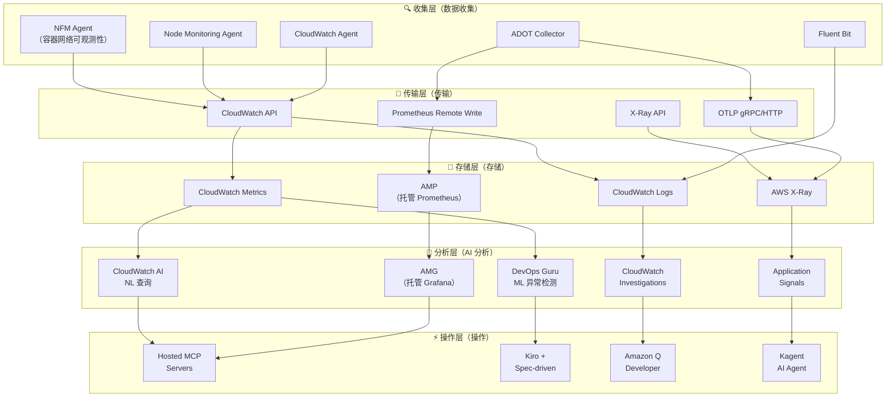
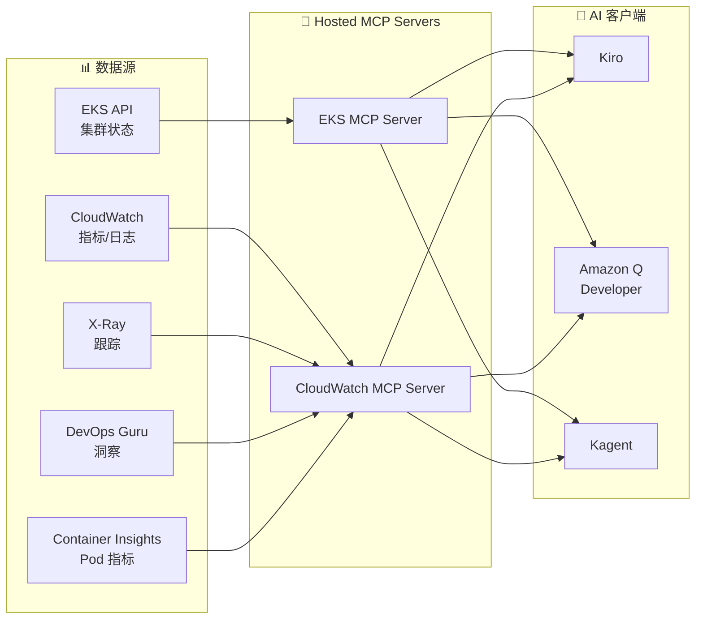

import { ArchitectureLayers, ManagedAddons, ServiceComparison, ObservabilityPillars, StackSelectionPatterns, DataFlowSummary, ProcessorSettings, ContainerInsightsMetrics, ApplicationSignalsLanguages, DevOpsGuruCost, EKSMCPTools, ErrorBudget, AlertOptimization } from '@site/src/components/ObservabilityStackTables';

# 为 EKS 构建智能可观测性栈

> 📅 **撰写日期**: 2026-02-12 | ⏱️ **阅读时间**: 约 35 分钟 | 📌 **参考环境**: EKS 1.35+、ADOT v0.40+、AMP、AMG

---

## 1. 概述

在现代分布式系统中，**可观测性（Observability）** 不仅仅是简单的监控——它是通过外部输出了解系统内部状态的能力。在 EKS 环境中，随着数百个 Pods、复杂的服务网格和动态扩展的结合，传统监控很难识别问题的根本原因。

### 1.1 3 支柱可观测性 + AI 分析层

将可观测性的三大支柱与 AI 分析层相结合，可实现真正的智能运维。

<ObservabilityPillars />

:::info 本文档范围
本文档涵盖在 EKS 环境中构建智能可观测性栈的整个过程，从基于托管 add-on 的可观测性基础到 AI 分析层。我们专注于一种策略，即 AWS 将开源可观测性工具作为托管服务运营，以**消除复杂性**，同时**最大化 K8s 原生可观测性**。虽然本文档基于 AWS 原生栈，但使用 ADOT（OpenTelemetry）作为收集层允许将相同的架构应用于第三方后端。
:::

### 1.3 可观测性栈选择模式

在实际的 EKS 生产环境中，基于组织需求和现有投资，主要使用三种可观测性栈模式：

<StackSelectionPatterns />

:::tip 收集层的核心：ADOT（OpenTelemetry）

无论您选择哪个后端，**在收集层使用 ADOT（OpenTelemetry）可以自由切换后端。** 由于 OpenTelemetry 是 CNCF 标准，您可以将数据导出到大多数后端，包括 Prometheus、Jaeger、Datadog 和 Sumo Logic。这就是为什么 AWS 将 OpenTelemetry 作为 Managed Add-on（ADOT）提供，而不是专有代理。
:::

本文档基于 **AWS Native** 和 **OSS-focused** 模式解释配置。使用第三方后端时，您可以通过仅更改 ADOT Collector 的导出器配置来利用相同的收集管道。

### 1.2 为什么可观测性在 EKS 中很重要

EKS 环境中的可观测性对于以下原因至关重要：

- **动态基础设施**：Pods 不断创建/删除，节点由 Karpenter 动态配置
- **微服务复杂性**：服务之间的复杂调用链使得很难识别单点故障
- **多层问题**：包括应用程序、容器运行时、节点、网络和 AWS 服务的多层结构
- **成本优化**：需要通过资源使用模式分析进行合理调整
- **合规性**：审计日志和访问记录的监管要求

---

## 2. 基于 Managed Add-ons 的可观测性基础

EKS Managed Add-ons 通过让 AWS 管理可观测性代理的安装、升级和修补来消除运维复杂性。您可以使用单个 `aws eks create-addon` 命令建立生产级可观测性基础。

<ManagedAddons />

### 2.1 ADOT（AWS Distro for OpenTelemetry）Add-on

ADOT 是 AWS 的 OpenTelemetry 发行版，使用单个代理收集指标、日志和跟踪。

```bash
# 安装 ADOT Add-on
aws eks create-addon \
  --cluster-name my-cluster \
  --addon-name adot \
  --addon-version v0.40.0-eksbuild.1 \
  --service-account-role-arn arn:aws:iam::ACCOUNT_ID:role/adot-collector-role

# 验证安装
aws eks describe-addon \
  --cluster-name my-cluster \
  --addon-name adot \
  --query 'addon.status'
```

:::tip ADOT vs 自管理 OpenTelemetry 部署
使用 ADOT Add-on 会自动安装 OpenTelemetry Operator，并包含内置的 AWS 服务身份验证（SigV4）。与自管理部署相比，运维负担显著降低，AWS 保证 EKS 版本兼容性。
:::

### 2.2 CloudWatch Observability Agent Add-on

CloudWatch Observability Agent 提供集成的 Container Insights Enhanced、Application Signals 和 CloudWatch Logs。

```bash
# CloudWatch Observability Agent Add-on
aws eks create-addon \
  --cluster-name my-cluster \
  --addon-name amazon-cloudwatch-observability \
  --service-account-role-arn arn:aws:iam::ACCOUNT_ID:role/cloudwatch-agent-role

# 验证配置
kubectl get pods -n amazon-cloudwatch
```

### 2.3 Node Monitoring Agent Add-on（2025）

Node Monitoring Agent 检测 EC2 节点上的硬件和操作系统级别问题。

```bash
# Node Monitoring Agent Add-on
aws eks create-addon \
  --cluster-name my-cluster \
  --addon-name eks-node-monitoring-agent
```

关键检测项目：

- **NVMe 磁盘错误**：EBS 卷性能下降的早期检测
- **内存硬件错误**：EDAC（错误检测和纠正）事件
- **内核软锁定**：CPU 异常保持较长时间
- **OOM（内存不足）**：由于内存短缺导致的进程终止

### 2.4 容器网络可观测性（2025.11）

**容器网络可观测性**，于 2025 年 11 月的 re:Invent 上宣布，是一项在 EKS 环境中提供包括 K8s 上下文在内的网络可见性的功能。虽然传统的 VPC Flow Logs 只显示 IP 级别的流量，但容器网络可观测性在 **Pod → Pod、Pod → Service、Pod → 外部服务** 级别提供网络流以及 K8s 元数据（命名空间、服务名称、Pod 标签）。

```bash
# 安装 Network Flow Monitoring Agent Add-on
aws eks create-addon \
  --cluster-name my-cluster \
  --addon-name aws-network-flow-monitoring-agent

# 在 VPC CNI 中启用容器网络可观测性
aws eks update-addon \
  --cluster-name my-cluster \
  --addon-name vpc-cni \
  --configuration-values '{"enableNetworkPolicy":"true"}'
```

关键功能：

- **Pod 级网络指标**：按 Pod/Service 跟踪 TCP 重传、数据包丢失和连接延迟
- **跨 AZ 流量可见性**：按服务测量跨 AZ 数据传输，以识别不必要的跨 AZ 成本
- **K8s 上下文网络地图**：使用命名空间、服务名称和 Pod 标签自动映射网络流
- **AWS 服务通信跟踪**：分析从 Pods 到 AWS 服务（如 S3、RDS、DynamoDB）的流量模式
- **首选可观测性栈集成**：将指标发送到任何后端，包括 AMP/Grafana、CloudWatch、Datadog

:::tip 增强的网络安全策略（2025.12）
随着容器网络可观测性，EKS 引入了**增强的网络安全策略**。您可以在整个集群中集中应用网络访问过滤器，并使用基于 DNS 的出口策略精细控制外部流量。它基于 VPC CNI 的网络策略功能运行。
:::

:::info 关键信息
仅使用 5 个可观测性 Managed Add-ons，您就可以在所有层建立可观测性基础：**基础设施（Node Monitoring）**、**网络（NFM Agent → 容器网络可观测性）** 和 **应用程序（ADOT、CloudWatch Agent）**。所有这些都使用单个 `aws eks create-addon` 命令部署，AWS 处理版本管理和安全补丁。
:::

---

## 3. 整体架构

EKS 智能可观测性栈由 5 层组成。

<ArchitectureLayers />



### 3.1 数据流摘要

<DataFlowSummary />

---

## 4. ADOT Collector 部署

### 4.1 OpenTelemetryCollector CRD

安装 ADOT Add-on 会部署 OpenTelemetry Operator，允许通过 `OpenTelemetryCollector` CRD 进行声明式收集器管理。

```yaml
apiVersion: opentelemetry.io/v1beta1
kind: OpenTelemetryCollector
metadata:
  name: adot-collector
  namespace: observability
spec:
  mode: deployment
  replicas: 2
  resources:
    limits:
      cpu: "1"
      memory: 2Gi
    requests:
      cpu: 200m
      memory: 512Mi
  config:
    receivers:
      otlp:
        protocols:
          grpc:
            endpoint: "0.0.0.0:4317"
          http:
            endpoint: "0.0.0.0:4318"
      prometheus:
        config:
          scrape_configs:
            - job_name: 'kubernetes-pods'
              kubernetes_sd_configs:
                - role: pod
              relabel_configs:
                - source_labels: [__meta_kubernetes_pod_annotation_prometheus_io_scrape]
                  action: keep
                  regex: true
    processors:
      batch:
        timeout: 10s
        send_batch_size: 1024
      memory_limiter:
        check_interval: 1s
        limit_mib: 512
        spike_limit_mib: 128
      resource:
        attributes:
          - key: cluster.name
            value: "my-eks-cluster"
            action: upsert
          - key: aws.region
            value: "ap-northeast-2"
            action: upsert
      filter:
        metrics:
          exclude:
            match_type: regexp
            metric_names:
              - "go_.*"
              - "process_.*"
    exporters:
      prometheusremotewrite:
        endpoint: "https://aps-workspaces.ap-northeast-2.amazonaws.com/workspaces/ws-xxxxx/api/v1/remote_write"
        auth:
          authenticator: sigv4auth
        resource_to_telemetry_conversion:
          enabled: true
      awsxray:
        region: ap-northeast-2
        indexed_attributes:
          - "otel.resource.service.name"
          - "otel.resource.deployment.environment"
      awscloudwatchlogs:
        region: ap-northeast-2
        log_group_name: "/eks/my-cluster/application"
        log_stream_name: "otel-logs"
    extensions:
      sigv4auth:
        region: ap-northeast-2
        service: aps
      health_check:
        endpoint: "0.0.0.0:13133"
    service:
      extensions: [sigv4auth, health_check]
      pipelines:
        metrics:
          receivers: [otlp, prometheus]
          processors: [memory_limiter, filter, batch, resource]
          exporters: [prometheusremotewrite]
        traces:
          receivers: [otlp]
          processors: [memory_limiter, batch, resource]
          exporters: [awsxray]
        logs:
          receivers: [otlp]
          processors: [memory_limiter, batch, resource]
          exporters: [awscloudwatchlogs]
```

### 4.2 DaemonSet 模式部署

当需要按节点收集指标时，使用 DaemonSet 模式。

```yaml
apiVersion: opentelemetry.io/v1beta1
kind: OpenTelemetryCollector
metadata:
  name: adot-node-collector
  namespace: observability
spec:
  mode: daemonset
  hostNetwork: true
  volumes:
    - name: hostfs
      hostPath:
        path: /
  volumeMounts:
    - name: hostfs
      mountPath: /hostfs
      readOnly: true
  env:
    - name: K8S_NODE_NAME
      valueFrom:
        fieldRef:
          fieldPath: spec.nodeName
  config:
    receivers:
      hostmetrics:
        root_path: /hostfs
        collection_interval: 30s
        scrapers:
          cpu: {}
          disk: {}
          filesystem: {}
          load: {}
          memory: {}
          network: {}
      kubeletstats:
        collection_interval: 30s
        auth_type: serviceAccount
        endpoint: "https://${env:K8S_NODE_NAME}:10250"
        insecure_skip_verify: true
    processors:
      batch:
        timeout: 30s
      resourcedetection:
        detectors: [env, eks]
    exporters:
      prometheusremotewrite:
        endpoint: "https://aps-workspaces.ap-northeast-2.amazonaws.com/workspaces/ws-xxxxx/api/v1/remote_write"
        auth:
          authenticator: sigv4auth
    extensions:
      sigv4auth:
        region: ap-northeast-2
        service: aps
    service:
      extensions: [sigv4auth]
      pipelines:
        metrics:
          receivers: [hostmetrics, kubeletstats]
          processors: [resourcedetection, batch]
          exporters: [prometheusremotewrite]
```

:::tip Deployment vs DaemonSet 选择标准

- **Deployment 模式**：应用程序指标/跟踪收集（OTLP 接收），集中处理
- **DaemonSet 模式**：节点级指标收集（hostmetrics、kubeletstats），网络高效
- **Sidecar 模式**：仅为特定 Pods 收集日志/跟踪，需要隔离时
:::

### 4.3 管道配置原则

ADOT Collector 管道按 `receivers → processors → exporters` 的顺序处理数据。

```
┌─────────────┐    ┌──────────────┐    ┌─────────────┐
│  Receivers  │───▶│  Processors  │───▶│  Exporters  │
│             │    │              │    │             │
│ • otlp      │    │ • memory_    │    │ • prometheus│
│ • prometheus│    │   limiter    │    │   remotewrite│
│ • hostmetrics│   │ • batch      │    │ • awsxray   │
│ • kubelet   │    │ • filter     │    │ • cwlogs    │
│   stats     │    │ • resource   │    │             │
└─────────────┘    └──────────────┘    └─────────────┘
```

**核心处理器设置**：

<ProcessorSettings />

---

## 5. AMP + AMG 集成

### 5.1 AMP（Amazon Managed Prometheus）

AMP 是一个与 Prometheus 兼容的托管服务，无需基础设施管理即可存储和查询大规模指标。

```bash
# 创建 AMP 工作区
aws amp create-workspace \
  --alias my-eks-observability \
  --tags Environment=production

# 检查工作区 ID
aws amp list-workspaces \
  --query 'workspaces[?alias==`my-eks-observability`].workspaceId' \
  --output text
```

### 5.2 Remote Write 配置

从 ADOT 向 AMP 发送指标的 Remote Write 配置。

```yaml
# Prometheus remote_write 配置
remoteWrite:
  - url: "https://aps-workspaces.ap-northeast-2.amazonaws.com/workspaces/ws-xxxxx/api/v1/remote_write"
    sigv4:
      region: ap-northeast-2
    queue_config:
      max_samples_per_send: 1000
      max_shards: 200
      capacity: 2500
    write_relabel_configs:
      - source_labels: [__name__]
        regex: "go_.*|process_.*"
        action: drop
```

:::warning Remote Write 成本优化
AMP 根据摄入的指标样本数量收费。通过 `write_relabel_configs` 丢弃不必要的指标（go_*、process_*）可以降低 30-50% 的成本。此外，将 `scrape_interval` 从 15 秒增加到 30 秒可将样本数量减半。
:::

### 5.3 AMG（Amazon Managed Grafana）数据源连接

在 AMG 中添加 AMP 作为数据源。

```bash
# 创建 AMG 工作区
aws grafana create-workspace \
  --workspace-name my-eks-grafana \
  --account-access-type CURRENT_ACCOUNT \
  --authentication-providers AWS_SSO \
  --permission-type SERVICE_MANAGED \
  --workspace-data-sources PROMETHEUS CLOUDWATCH XRAY

# 自动数据源配置（AMP 连接）
aws grafana create-workspace-service-account \
  --workspace-id g-xxxxxxxxxx \
  --grafana-role ADMIN \
  --name amp-datasource
```

在 AMG 中添加 AMP 数据源后可用的核心 PromQL 查询。

### 5.4 核心 PromQL 查询

```promql
# CPU 使用率最高的前 10 个 Pods
topk(10,
  sum(rate(container_cpu_usage_seconds_total{namespace!="kube-system"}[5m])) by (pod)
)

# 按节点的内存使用率
100 * (1 - (
  node_memory_MemAvailable_bytes / node_memory_MemTotal_bytes
))

# HTTP 请求错误率（5xx）
sum(rate(http_requests_total{status=~"5.."}[5m]))
/ sum(rate(http_requests_total[5m])) * 100

# P99 延迟
histogram_quantile(0.99,
  sum(rate(http_request_duration_seconds_bucket[5m])) by (le, service)
)

# Pod 重启计数（最近 1 小时）
increase(kube_pod_container_status_restarts_total[1h])

# Karpenter 节点配置等待时间
histogram_quantile(0.95,
  sum(rate(karpenter_provisioner_scheduling_duration_seconds_bucket[10m])) by (le)
)
```

:::info AMP + AMG 的核心价值
AWS 处理 Prometheus 和 Grafana 的所有基础设施管理（扩展、修补、高可用性、备份）。团队可以仅专注于**仪表板配置和查询编写**，从而专注于可观测性的基本价值。这是 AWS 战略的核心，即"保持开源优势，同时消除复杂性"。
:::

---

## 6. CloudWatch Container Insights Enhanced

### 6.1 Enhanced Container Insights 功能

在 EKS 1.28+ 中，Enhanced Container Insights 提供包括**控制平面指标**在内的深度可观测性。

```bash
# 安装 CloudWatch Observability Operator（Helm）
helm install amazon-cloudwatch-observability \
  oci://public.ecr.aws/cloudwatch-agent/amazon-cloudwatch-observability \
  --namespace amazon-cloudwatch --create-namespace \
  --set clusterName=my-cluster \
  --set region=ap-northeast-2 \
  --set containerInsights.enhanced=true \
  --set containerInsights.acceleratedCompute=true
```

### 6.2 收集的指标范围

Enhanced Container Insights 收集的指标范围：

<ContainerInsightsMetrics />

### 6.3 EKS 控制平面指标

在 EKS 1.28+ 中自动收集的控制平面指标对于了解集群健康状态至关重要。

```bash
# 验证控制平面指标激活
aws eks describe-cluster \
  --name my-cluster \
  --query 'cluster.logging.clusterLogging[?types[?contains(@, `api`)]]'
```

核心控制平面指标：

- **API Server**：`apiserver_request_total`、`apiserver_request_duration_seconds` — API 服务器负载和延迟
- **etcd**：`etcd_db_total_size_in_bytes`、`etcd_server_slow_apply_total` — etcd 状态和性能
- **Scheduler**：`scheduler_schedule_attempts_total`、`scheduler_scheduling_duration_seconds` — 调度效率
- **Controller Manager**：`workqueue_depth`、`workqueue_adds_total` — 控制器队列状态

:::warning 成本考虑
Enhanced Container Insights 收集大量指标，增加 CloudWatch 成本。生产集群每月可能产生额外 $50-200 的费用。我们建议在 dev/staging 环境中使用基本 Container Insights，仅在生产环境中启用 Enhanced。
:::

---

## 7. CloudWatch Application Signals

Application Signals 通过**零代码插桩**自动生成服务地图、SLI/SLOs 和调用图。

### 7.1 支持的语言和插桩方法

<ApplicationSignalsLanguages />

### 7.2 激活方法

```yaml
# 使用 Instrumentation CRD 启用零代码插桩
apiVersion: opentelemetry.io/v1alpha1
kind: Instrumentation
metadata:
  name: app-signals
  namespace: my-app
spec:
  exporter:
    endpoint: http://adot-collector.observability:4317
  propagators:
    - tracecontext
    - baggage
    - xray
  java:
    image: public.ecr.aws/aws-observability/adot-autoinstrumentation-java:latest
    env:
      - name: OTEL_AWS_APPLICATION_SIGNALS_ENABLED
        value: "true"
      - name: OTEL_METRICS_EXPORTER
        value: "none"
  python:
    image: public.ecr.aws/aws-observability/adot-autoinstrumentation-python:latest
```

向 Pod 添加注释会自动注入插桩代理：

```yaml
apiVersion: apps/v1
kind: Deployment
metadata:
  name: my-java-app
spec:
  template:
    metadata:
      annotations:
        instrumentation.opentelemetry.io/inject-java: "app-signals"
    spec:
      containers:
        - name: app
          image: my-java-app:latest
```

### 7.3 自动服务地图生成

激活 Application Signals 后，会自动生成以下内容：

- **服务地图**：可视化服务间调用关系，显示错误率/延迟
- **自动 SLI 设置**：自动测量可用性（错误率）、延迟（P99）、吞吐量
- **SLO 配置**：基于 SLI 设置目标（例如，99.9% 可用性，P99 < 500ms）
- **调用图**：跟踪单个请求的服务间调用路径

:::tip Application Signals + DevOps Guru 集成
当 DevOps Guru 分析 Application Signals 的 SLI 数据时，可以进行服务级异常检测。例如，您可以收到服务上下文化的告警，如"支付服务 P99 延迟比正常增加了 3 倍"。
:::

---

## 8. DevOps Guru EKS 集成

Amazon DevOps Guru 使用 ML 自动检测运维异常并分析根本原因。

### 8.1 资源组配置

```bash
# 使用基于 EKS 集群的资源组启用 DevOps Guru
aws devops-guru update-resource-collection \
  --action ADD \
  --resource-collection '{
    "Tags": {
      "TagValues": [
        {
          "AppBoundaryKey": "eks-cluster",
          "TagValues": ["my-cluster"]
        }
      ]
    }
  }'
```

### 8.2 ML 异常检测操作

DevOps Guru 的异常检测在以下阶段运行：

1. **学习期**（1-2 周）：ML 模型学习正常运维模式
2. **异常检测**：检测偏离学习模式的指标变化
3. **关联分析**：将同时发生的异常指标分组
4. **根本原因推断**：分析异常指标之间的因果关系
5. **洞察生成**：发送带有推荐操作的告警

### 8.3 真实异常检测场景

**场景：EKS 节点内存压力**

```
[DevOps Guru Insight]
━━━━━━━━━━━━━━━━━━━━━━━━━━━━━━━━━━
严重性：HIGH
类型：反应性异常

相关指标（关联分析）：
  ✦ node_memory_utilization：92% → 98%（异常增加）
  ✦ pod_eviction_count：0 → 5（异常增加）
  ✦ container_restart_count：2 → 18（异常增加）
  ✦ kube_node_status_condition{condition="MemoryPressure"}：0 → 1

根本原因分析：
  → 节点 i-0abc123 的内存利用率超过正常范围（60-75%）
    进入 MemoryPressure 状态
  → 没有内存请求的 Pods 消耗过多内存

推荐操作：
  1. 识别没有内存请求/限制的 Pods
  2. 通过 LimitRange 设置命名空间默认限制
  3. 向 Karpenter NodePool 添加基于内存的扩展
━━━━━━━━━━━━━━━━━━━━━━━━━━━━━━━━━━
```

### 8.4 成本和激活技巧

<DevOpsGuruCost />

---

## 9. CloudWatch AI 自然语言查询 + Investigations

### 9.1 CloudWatch AI 自然语言查询

CloudWatch AI NL 查询允许您使用自然语言分析指标和日志。您可以使用自然语言提出问题，而无需了解 PromQL 或 CloudWatch Logs Insights 查询语法。

**真实查询示例**：

```
# 自然语言查询 → 自动转换

问题："过去一小时内哪些 EKS 节点超过了 80% 的 CPU 使用率？"
→ 自动生成 CloudWatch Metrics Insights 查询

问题："payment-service 在哪个时间段有最多的 5xx 错误？"
→ 自动生成 CloudWatch Logs Insights 查询

问题："今天哪些服务的 API 响应时间比昨天慢？"
→ 自动生成比较分析查询
```

### 9.2 CloudWatch Investigations

CloudWatch Investigations 是一个基于 AI 的根本原因分析工具，当告警发生时自动收集和分析相关指标、日志和跟踪。

**分析过程**：

1. **告警触发**：CloudWatch Alarm 或 DevOps Guru 洞察发生
2. **上下文收集**：自动收集相关指标、日志、跟踪和配置变更历史
3. **AI 分析**：AI 分析收集的数据以推断根本原因
4. **时间线生成**：按时间段组织事件发生顺序
5. **推荐操作**：提出具体解决方案

```
[CloudWatch Investigation 结果]
━━━━━━━━━━━━━━━━━━━━━━━━━━━━━━━━━━
📋 调查摘要：payment-service 延迟增加

⏱️ 时间线：
  14:23 - RDS 连接池利用率激增（70% → 95%）
  14:25 - payment-service P99 延迟 500ms → 2.3s
  14:27 - 下游 order-service 也开始受到影响
  14:30 - CloudWatch Alarm 触发

🔍 根本原因：
  RDS 实例（db.r5.large）连接数接近 max_connections
  导致新连接创建延迟

📌 推荐操作：
  1. 升级 RDS 实例类或调整 max_connections
  2. 优化连接池库（HikariCP/PgBouncer）设置
  3. 考虑引入 RDS Proxy
━━━━━━━━━━━━━━━━━━━━━━━━━━━━━━━━━━
```

:::tip Investigation + Hosted MCP
您可以通过 Hosted MCP 服务器在 Kiro 中直接查询 CloudWatch Investigations 结果。"是否有正在进行的 Investigations？" → MCP 返回 Investigation 状态 → Kiro 自动生成响应代码。这是 **AI 分析 → 自动化响应**的完整循环。
:::

---

## 10. 基于 MCP 服务器的集成分析

### 10.1 MCP 为可观测性带来的变化

以前，诊断问题需要分别打开 CloudWatch 控制台、Grafana 仪表板和 X-Ray 控制台。使用 AWS MCP 服务器（50+ GA 单独本地或 Fully Managed Preview），您可以**从 Kiro 或 Q Developer 以集成方式查询所有可观测性数据**。



### 10.2 EKS MCP 服务器工具

EKS MCP 服务器提供的主要工具：

<EKSMCPTools />

### 10.3 集成分析场景

**场景："payment-service 很慢"报告**

通过 MCP 在 Kiro 中的集成分析过程：

```
[Kiro + MCP 集成分析]

1. EKS MCP：list_pods(namespace="payment") → 3/3 Running，0 Restarts ✓
2. EKS MCP：get_pod_logs(pod="payment-xxx"，tail=100) → 多个 DB 超时错误
3. CloudWatch MCP：query_metrics("RDSConnections") → 连接数达到 98%
4. CloudWatch MCP：get_insights(service="payment") → DevOps Guru 洞察存在
5. CloudWatch MCP：get_investigation("INV-xxxx") → 确认 RDS 连接池饱和

→ Kiro 自动：
   - 生成 RDS Proxy 引入 IaC 代码
   - 生成 HikariCP 连接池优化 PR
   - 调整 Karpenter NodePool（基于内存的扩展）
```

:::info 基于各种数据源的运维洞察
MCP 的核心价值是**将多个数据源集成到单个接口中**。随着 AI agents 一次性访问 CloudWatch 指标、X-Ray 跟踪、EKS API 和 DevOps Guru 洞察，与手动浏览多个控制台相比，可以实现更快、更准确的诊断。
:::

### 10.4 程序化可观测性自动化

通过 MCP 的可观测性实现**程序化自动化**：

```
[指令方法] - 手动、重复
  "打开 CloudWatch 控制台并检查 payment-service 指标"
  → "在 X-Ray 中查找该时间段的跟踪"
  → "也检查 RDS 指标"
  → "那么原因是什么？"

[程序化方法] - 自动、系统化
  Kiro Spec："payment-service 延迟异常的自动诊断"
  → MCP 对 CloudWatch + X-Ray + EKS API 执行集成查询
  → AI 分析根本原因
  → 自动生成修复代码 + PR
```

---

## 11. 告警优化和 SLO/SLI

### 11.1 告警疲劳问题

告警疲劳是 EKS 环境中的严重运维问题：

- **平均 EKS 集群**：每天 50-200 个告警
- **实际需要操作的告警**：总数的 10-15%
- **告警疲劳结果**：忽略重要告警，事件响应延迟

### 11.2 基于 SLO 的告警策略

基于 SLO（Service Level Objectives）配置告警可以显著减少告警疲劳。

```yaml
# 基于 SLO 的告警示例 - 基于错误预算消耗率
apiVersion: monitoring.coreos.com/v1
kind: PrometheusRule
metadata:
  name: payment-service-slo
spec:
  groups:
    - name: slo.payment-service
      rules:
        # SLI：错误率
        - record: sli:payment_error_rate:5m
          expr: |
            sum(rate(http_requests_total{service="payment",status=~"5.."}[5m]))
            / sum(rate(http_requests_total{service="payment"}[5m]))

        # 错误预算消耗率（1 小时）
        - alert: PaymentErrorBudgetBurn
          expr: |
            sli:payment_error_rate:5m > (1 - 0.999) * 14.4
          for: 5m
          labels:
            severity: critical
            service: payment
          annotations:
            summary: "支付服务错误预算快速消耗"
            description: "当前错误率以 14.4 倍速度消耗错误预算（1 小时窗口）"
```

### 11.3 错误预算概念

<ErrorBudget />

### 11.4 CloudWatch Composite Alarms

通过逻辑组合多个告警来减少噪音。

```bash
# Composite Alarm：仅当 CPU 和内存都高时告警
aws cloudwatch put-composite-alarm \
  --alarm-name "EKS-Node-Resource-Pressure" \
  --alarm-rule 'ALARM("EKS-Node-HighCPU") AND ALARM("EKS-Node-HighMemory")' \
  --alarm-actions "arn:aws:sns:ap-northeast-2:ACCOUNT_ID:ops-team" \
  --alarm-description "仅当节点 CPU 和内存都高时告警"
```

<ServiceComparison />

### 11.5 告警优化清单

<AlertOptimization />

---

## 12. 结论

### 12.1 构建顺序摘要

我们建议按以下顺序构建智能可观测性栈：

```
阶段 1：部署 Managed Add-ons
  └── ADOT + CloudWatch Observability + Node Monitoring + Flow Monitor

阶段 2：连接 AMP + AMG
  └── Remote Write 配置 + Grafana 仪表板设置

阶段 3：启用 Application Signals
  └── 零代码插桩 + 自动 SLI/SLO 设置

阶段 4：启用 DevOps Guru
  └── ML 异常检测 + 根本原因分析

阶段 5：CloudWatch AI + MCP 集成
  └── 自然语言查询 + Kiro/Q Developer 集成

阶段 6：告警优化
  └── 基于 SLO 的告警 + Composite Alarms + 自动恢复
```

### 12.2 下一步

基于此可观测性栈学习以下主题：

- **[AIDLC 框架](./aidlc-framework.md)**：AI 驱动的开发生命周期和使用可观测性数据的开发反馈循环
- **[预测性扩展和自动修复](./aiops-predictive-operations.md)**：基于可观测性数据的 ML 预测和自动修复模式
- **[AIOps 介绍](./aiops-introduction.md)**：整体 AIOps 战略和可观测性的作用

### 12.3 学习路径

```
[当前文档] 构建智能可观测性栈
     ↓
[下一步] AIDLC 框架 — 使用可观测性数据的 AI 开发自动化
     ↓
[高级] 预测性运维 — 基于可观测性的预测性扩展和自动修复
```

:::info 相关文档

- [AIOps 战略指南](./aiops-introduction.md) — 整体 AIOps 上下文
- [AIDLC 框架](./aidlc-framework.md) — AI 驱动的开发方法论
- [预测性扩展和自动修复](./aiops-predictive-operations.md) — 基于可观测性的预测性运维
:::
