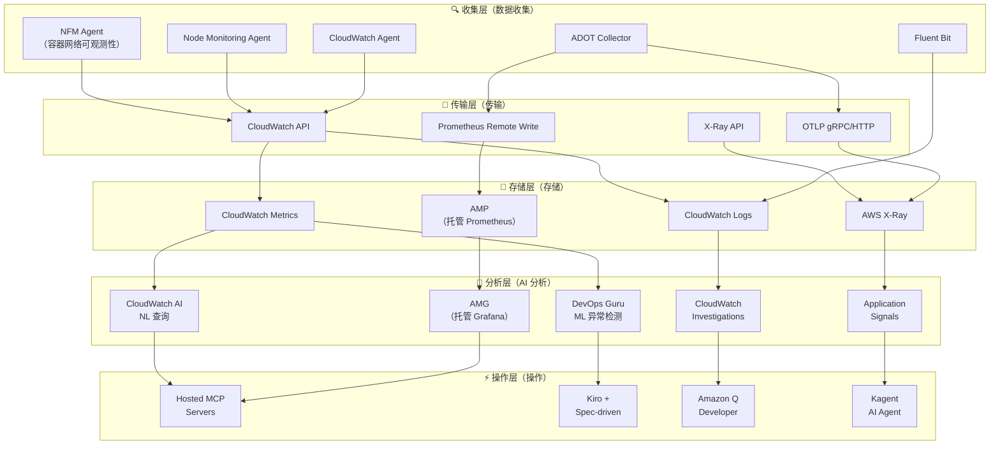
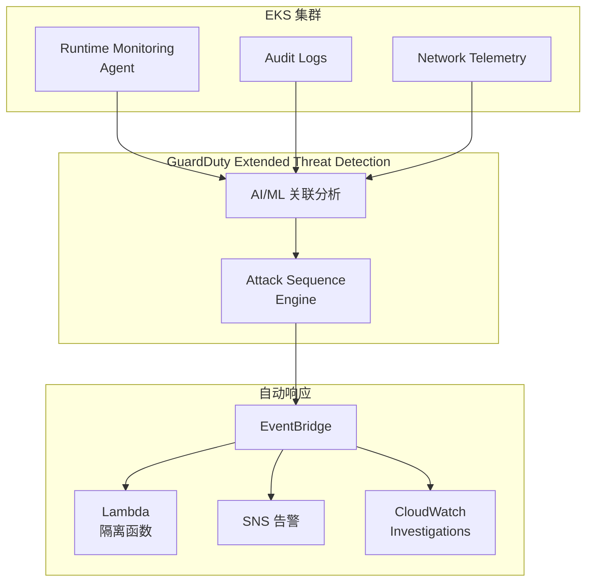
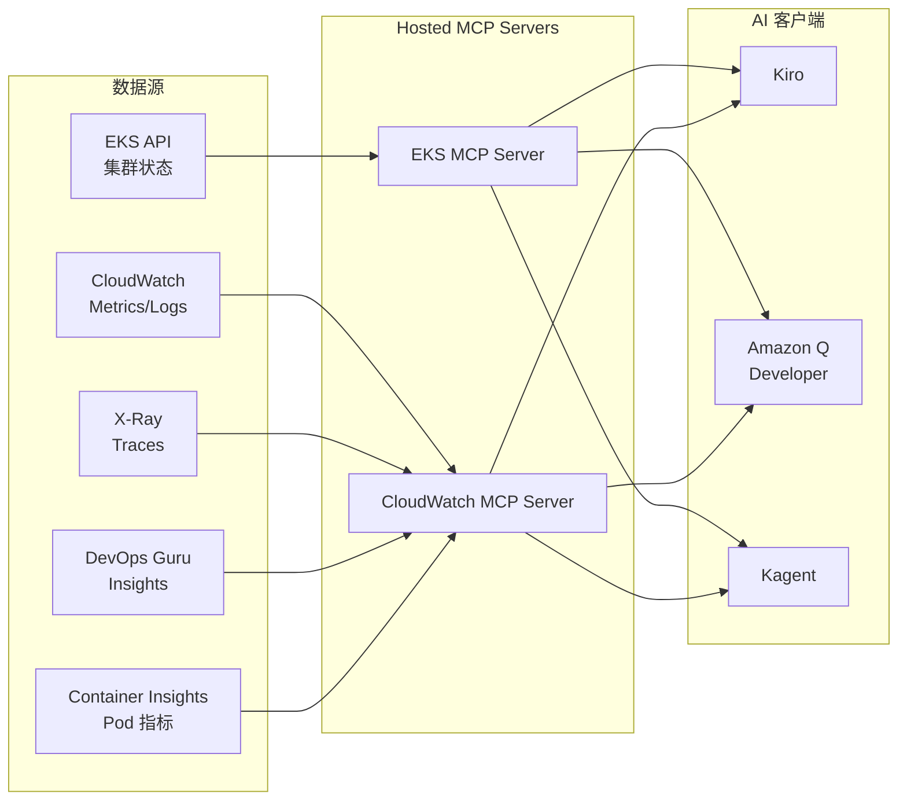
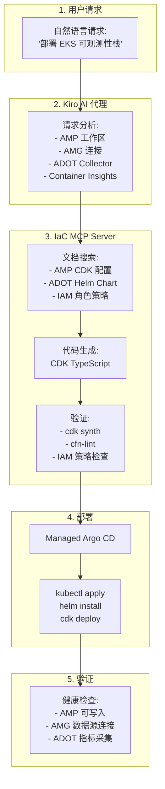

import { ArchitectureLayers, ManagedAddons, ServiceComparison, ObservabilityPillars, StackSelectionPatterns, DataFlowSummary, ProcessorSettings, ContainerInsightsMetrics, ApplicationSignalsLanguages, DevOpsGuruCost, EKSMCPTools, ErrorBudget, AlertOptimization } from '@site/src/components/ObservabilityStackTables';

# 为 EKS 构建智能可观测性栈

> 📅 **撰写日期**: 2026-02-12 | ⏱️ **阅读时间**: 约 35 分钟 | 📌 **参考环境**: EKS 1.35+、ADOT v0.40+、AMP、AMG

---

## 1. 概述

在现代分布式系统中，**可观测性（Observability）** 不仅仅是简单的监控——它是通过外部输出了解系统内部状态的能力。在 EKS 环境中，随着数百个 Pods、复杂的服务网格和动态扩展的结合，传统监控很难识别问题的根本原因。

### 1.1 3 支柱可观测性 + AI 分析层

将可观测性的三大支柱与 AI 分析层相结合，可实现真正的智能运维。

<ObservabilityPillars />

:::info 本文档范围
本文档涵盖在 EKS 环境中构建智能可观测性栈的整个过程，从基于托管 add-on 的可观测性基础到 AI 分析层。我们专注于一种策略，即 AWS 将开源可观测性工具作为托管服务运营，以**消除复杂性**，同时**最大化 K8s 原生可观测性**。虽然本文档基于 AWS 原生栈，但使用 ADOT（OpenTelemetry）作为收集层允许将相同的架构应用于第三方后端。
:::

### 1.3 可观测性栈选择模式

在实际的 EKS 生产环境中，基于组织需求和现有投资，主要使用三种可观测性栈模式：

<StackSelectionPatterns />

:::tip 收集层的核心：ADOT（OpenTelemetry）

无论您选择哪个后端，**在收集层使用 ADOT（OpenTelemetry）可以自由切换后端。** 由于 OpenTelemetry 是 CNCF 标准，您可以将数据导出到大多数后端，包括 Prometheus、Jaeger、Datadog 和 Sumo Logic。这就是为什么 AWS 将 OpenTelemetry 作为 Managed Add-on（ADOT）提供，而不是专有代理。
:::

本文档基于 **AWS Native** 和 **OSS-focused** 模式解释配置。使用第三方后端时，您可以通过仅更改 ADOT Collector 的导出器配置来利用相同的收集管道。

### 1.2 为什么可观测性在 EKS 中很重要

EKS 环境中的可观测性对于以下原因至关重要：

- **动态基础设施**：Pods 不断创建/删除，节点由 Karpenter 动态配置
- **微服务复杂性**：服务之间的复杂调用链使得很难识别单点故障
- **多层问题**：包括应用程序、容器运行时、节点、网络和 AWS 服务的多层结构
- **成本优化**：需要通过资源使用模式分析进行合理调整
- **合规性**：审计日志和访问记录的监管要求

---

## 2. 基于 Managed Add-ons 的可观测性基础

EKS Managed Add-ons 通过让 AWS 管理可观测性代理的安装、升级和修补来消除运维复杂性。您可以使用单个 `aws eks create-addon` 命令建立生产级可观测性基础。

<ManagedAddons />

### 2.1 ADOT（AWS Distro for OpenTelemetry）Add-on

ADOT 是 AWS 的 OpenTelemetry 发行版，使用单个代理收集指标、日志和跟踪。

```bash
# 安装 ADOT Add-on
aws eks create-addon \
  --cluster-name my-cluster \
  --addon-name adot \
  --addon-version v0.40.0-eksbuild.1 \
  --service-account-role-arn arn:aws:iam::ACCOUNT_ID:role/adot-collector-role

# 验证安装
aws eks describe-addon \
  --cluster-name my-cluster \
  --addon-name adot \
  --query 'addon.status'
```

:::tip ADOT vs 自管理 OpenTelemetry 部署
使用 ADOT Add-on 会自动安装 OpenTelemetry Operator，并包含内置的 AWS 服务身份验证（SigV4）。与自管理部署相比，运维负担显著降低，AWS 保证 EKS 版本兼容性。
:::

### 2.2 CloudWatch Observability Agent Add-on

CloudWatch Observability Agent 提供集成的 Container Insights Enhanced、Application Signals 和 CloudWatch Logs。

```bash
# CloudWatch Observability Agent Add-on
aws eks create-addon \
  --cluster-name my-cluster \
  --addon-name amazon-cloudwatch-observability \
  --service-account-role-arn arn:aws:iam::ACCOUNT_ID:role/cloudwatch-agent-role

# 验证配置
kubectl get pods -n amazon-cloudwatch
```

### 2.3 Node Monitoring Agent Add-on（2025）

Node Monitoring Agent 检测 EC2 节点上的硬件和操作系统级别问题。

```bash
# Node Monitoring Agent Add-on
aws eks create-addon \
  --cluster-name my-cluster \
  --addon-name eks-node-monitoring-agent
```

关键检测项目：

- **NVMe 磁盘错误**：EBS 卷性能下降的早期检测
- **内存硬件错误**：EDAC（错误检测和纠正）事件
- **内核软锁定**：CPU 异常保持较长时间
- **OOM（内存不足）**：由于内存短缺导致的进程终止

### 2.4 容器网络可观测性（2025.11）

**容器网络可观测性**，于 2025 年 11 月的 re:Invent 上宣布，是一项在 EKS 环境中提供包括 K8s 上下文在内的网络可见性的功能。虽然传统的 VPC Flow Logs 只显示 IP 级别的流量，但容器网络可观测性在 **Pod → Pod、Pod → Service、Pod → 外部服务** 级别提供网络流以及 K8s 元数据（命名空间、服务名称、Pod 标签）。

```bash
# 安装 Network Flow Monitoring Agent Add-on
aws eks create-addon \
  --cluster-name my-cluster \
  --addon-name aws-network-flow-monitoring-agent

# 在 VPC CNI 中启用容器网络可观测性
aws eks update-addon \
  --cluster-name my-cluster \
  --addon-name vpc-cni \
  --configuration-values '{"enableNetworkPolicy":"true"}'
```

关键功能：

- **Pod 级网络指标**：按 Pod/Service 跟踪 TCP 重传、数据包丢失和连接延迟
- **跨 AZ 流量可见性**：按服务测量跨 AZ 数据传输，以识别不必要的跨 AZ 成本
- **K8s 上下文网络地图**：使用命名空间、服务名称和 Pod 标签自动映射网络流
- **AWS 服务通信跟踪**：分析从 Pods 到 AWS 服务（如 S3、RDS、DynamoDB）的流量模式
- **首选可观测性栈集成**：将指标发送到任何后端，包括 AMP/Grafana、CloudWatch、Datadog

:::tip 增强的网络安全策略（2025.12）
随着容器网络可观测性，EKS 引入了**增强的网络安全策略**。您可以在整个集群中集中应用网络访问过滤器，并使用基于 DNS 的出口策略精细控制外部流量。它基于 VPC CNI 的网络策略功能运行。
:::

:::info 关键信息
仅使用 5 个可观测性 Managed Add-ons，您就可以在所有层建立可观测性基础：**基础设施（Node Monitoring）**、**网络（NFM Agent → 容器网络可观测性）** 和 **应用程序（ADOT、CloudWatch Agent）**。所有这些都使用单个 `aws eks create-addon` 命令部署，AWS 处理版本管理和安全补丁。
:::

---

## 3. 整体架构

EKS 智能可观测性栈由 5 层组成。

<ArchitectureLayers />



### 3.1 数据流摘要

<DataFlowSummary />

---

## 4. ADOT Collector 部署

### 4.1 OpenTelemetryCollector CRD

安装 ADOT Add-on 会部署 OpenTelemetry Operator，允许通过 `OpenTelemetryCollector` CRD 进行声明式收集器管理。

```yaml
apiVersion: opentelemetry.io/v1beta1
kind: OpenTelemetryCollector
metadata:
  name: adot-collector
  namespace: observability
spec:
  mode: deployment
  replicas: 2
  resources:
    limits:
      cpu: "1"
      memory: 2Gi
    requests:
      cpu: 200m
      memory: 512Mi
  config:
    receivers:
      otlp:
        protocols:
          grpc:
            endpoint: "0.0.0.0:4317"
          http:
            endpoint: "0.0.0.0:4318"
      prometheus:
        config:
          scrape_configs:
            - job_name: 'kubernetes-pods'
              kubernetes_sd_configs:
                - role: pod
              relabel_configs:
                - source_labels: [__meta_kubernetes_pod_annotation_prometheus_io_scrape]
                  action: keep
                  regex: true
    processors:
      batch:
        timeout: 10s
        send_batch_size: 1024
      memory_limiter:
        check_interval: 1s
        limit_mib: 512
        spike_limit_mib: 128
      resource:
        attributes:
          - key: cluster.name
            value: "my-eks-cluster"
            action: upsert
          - key: aws.region
            value: "ap-northeast-2"
            action: upsert
      filter:
        metrics:
          exclude:
            match_type: regexp
            metric_names:
              - "go_.*"
              - "process_.*"
    exporters:
      prometheusremotewrite:
        endpoint: "https://aps-workspaces.ap-northeast-2.amazonaws.com/workspaces/ws-xxxxx/api/v1/remote_write"
        auth:
          authenticator: sigv4auth
        resource_to_telemetry_conversion:
          enabled: true
      awsxray:
        region: ap-northeast-2
        indexed_attributes:
          - "otel.resource.service.name"
          - "otel.resource.deployment.environment"
      awscloudwatchlogs:
        region: ap-northeast-2
        log_group_name: "/eks/my-cluster/application"
        log_stream_name: "otel-logs"
    extensions:
      sigv4auth:
        region: ap-northeast-2
        service: aps
      health_check:
        endpoint: "0.0.0.0:13133"
    service:
      extensions: [sigv4auth, health_check]
      pipelines:
        metrics:
          receivers: [otlp, prometheus]
          processors: [memory_limiter, filter, batch, resource]
          exporters: [prometheusremotewrite]
        traces:
          receivers: [otlp]
          processors: [memory_limiter, batch, resource]
          exporters: [awsxray]
        logs:
          receivers: [otlp]
          processors: [memory_limiter, batch, resource]
          exporters: [awscloudwatchlogs]
```

### 4.2 DaemonSet 模式部署

当需要按节点收集指标时，使用 DaemonSet 模式。

```yaml
apiVersion: opentelemetry.io/v1beta1
kind: OpenTelemetryCollector
metadata:
  name: adot-node-collector
  namespace: observability
spec:
  mode: daemonset
  hostNetwork: true
  volumes:
    - name: hostfs
      hostPath:
        path: /
  volumeMounts:
    - name: hostfs
      mountPath: /hostfs
      readOnly: true
  env:
    - name: K8S_NODE_NAME
      valueFrom:
        fieldRef:
          fieldPath: spec.nodeName
  config:
    receivers:
      hostmetrics:
        root_path: /hostfs
        collection_interval: 30s
        scrapers:
          cpu: {}
          disk: {}
          filesystem: {}
          load: {}
          memory: {}
          network: {}
      kubeletstats:
        collection_interval: 30s
        auth_type: serviceAccount
        endpoint: "https://${env:K8S_NODE_NAME}:10250"
        insecure_skip_verify: true
    processors:
      batch:
        timeout: 30s
      resourcedetection:
        detectors: [env, eks]
    exporters:
      prometheusremotewrite:
        endpoint: "https://aps-workspaces.ap-northeast-2.amazonaws.com/workspaces/ws-xxxxx/api/v1/remote_write"
        auth:
          authenticator: sigv4auth
    extensions:
      sigv4auth:
        region: ap-northeast-2
        service: aps
    service:
      extensions: [sigv4auth]
      pipelines:
        metrics:
          receivers: [hostmetrics, kubeletstats]
          processors: [resourcedetection, batch]
          exporters: [prometheusremotewrite]
```

:::tip Deployment vs DaemonSet 选择标准

- **Deployment 模式**：应用程序指标/跟踪收集（OTLP 接收），集中处理
- **DaemonSet 模式**：节点级指标收集（hostmetrics、kubeletstats），网络高效
- **Sidecar 模式**：仅为特定 Pods 收集日志/跟踪，需要隔离时
:::

### 4.3 管道配置原则

ADOT Collector 管道按 `receivers → processors → exporters` 的顺序处理数据。

```
┌─────────────┐    ┌──────────────┐    ┌─────────────┐
│  Receivers  │───▶│  Processors  │───▶│  Exporters  │
│             │    │              │    │             │
│ • otlp      │    │ • memory_    │    │ • prometheus│
│ • prometheus│    │   limiter    │    │   remotewrite│
│ • hostmetrics│   │ • batch      │    │ • awsxray   │
│ • kubelet   │    │ • filter     │    │ • cwlogs    │
│   stats     │    │ • resource   │    │             │
└─────────────┘    └──────────────┘    └─────────────┘
```

**核心处理器设置**：

<ProcessorSettings />

---

## 5. AMP + AMG 集成

### 5.1 AMP（Amazon Managed Prometheus）

AMP 是一个与 Prometheus 兼容的托管服务，无需基础设施管理即可存储和查询大规模指标。

```bash
# 创建 AMP 工作区
aws amp create-workspace \
  --alias my-eks-observability \
  --tags Environment=production

# 检查工作区 ID
aws amp list-workspaces \
  --query 'workspaces[?alias==`my-eks-observability`].workspaceId' \
  --output text
```

### 5.2 Remote Write 配置

从 ADOT 向 AMP 发送指标的 Remote Write 配置。

```yaml
# Prometheus remote_write 配置
remoteWrite:
  - url: "https://aps-workspaces.ap-northeast-2.amazonaws.com/workspaces/ws-xxxxx/api/v1/remote_write"
    sigv4:
      region: ap-northeast-2
    queue_config:
      max_samples_per_send: 1000
      max_shards: 200
      capacity: 2500
    write_relabel_configs:
      - source_labels: [__name__]
        regex: "go_.*|process_.*"
        action: drop
```

:::warning Remote Write 成本优化
AMP 根据摄入的指标样本数量收费。通过 `write_relabel_configs` 丢弃不必要的指标（go_*、process_*）可以降低 30-50% 的成本。此外，将 `scrape_interval` 从 15 秒增加到 30 秒可将样本数量减半。
:::

### 5.3 AMG（Amazon Managed Grafana）数据源连接

在 AMG 中添加 AMP 作为数据源。

```bash
# 创建 AMG 工作区
aws grafana create-workspace \
  --workspace-name my-eks-grafana \
  --account-access-type CURRENT_ACCOUNT \
  --authentication-providers AWS_SSO \
  --permission-type SERVICE_MANAGED \
  --workspace-data-sources PROMETHEUS CLOUDWATCH XRAY

# 自动数据源配置（AMP 连接）
aws grafana create-workspace-service-account \
  --workspace-id g-xxxxxxxxxx \
  --grafana-role ADMIN \
  --name amp-datasource
```

在 AMG 中添加 AMP 数据源后可用的核心 PromQL 查询。

### 5.4 核心 PromQL 查询

```promql
# CPU 使用率最高的前 10 个 Pods
topk(10,
  sum(rate(container_cpu_usage_seconds_total{namespace!="kube-system"}[5m])) by (pod)
)

# 按节点的内存使用率
100 * (1 - (
  node_memory_MemAvailable_bytes / node_memory_MemTotal_bytes
))

# HTTP 请求错误率（5xx）
sum(rate(http_requests_total{status=~"5.."}[5m]))
/ sum(rate(http_requests_total[5m])) * 100

# P99 延迟
histogram_quantile(0.99,
  sum(rate(http_request_duration_seconds_bucket[5m])) by (le, service)
)

# Pod 重启计数（最近 1 小时）
increase(kube_pod_container_status_restarts_total[1h])

# Karpenter 节点配置等待时间
histogram_quantile(0.95,
  sum(rate(karpenter_provisioner_scheduling_duration_seconds_bucket[10m])) by (le)
)
```

:::info AMP + AMG 的核心价值
AWS 处理 Prometheus 和 Grafana 的所有基础设施管理（扩展、修补、高可用性、备份）。团队可以仅专注于**仪表板配置和查询编写**，从而专注于可观测性的基本价值。这是 AWS 战略的核心，即"保持开源优势，同时消除复杂性"。
:::

### 5.5 Grafana Alloy: 下一代采集器模式

**Grafana Alloy** 是 Grafana Agent 的后续产品，于 2024 年 4 月正式发布。它同时支持 OpenTelemetry 和 Prometheus 采集，基于 **Flow 模式**提供更灵活的管道配置。

#### 5.5.1 Grafana Alloy vs ADOT 对比

| 特性 | ADOT (AWS 视角) | Grafana Alloy | 推荐场景 |
|------|----------------|---------------|----------|
| **管理方式** | EKS Managed Add-on | 自部署 (Helm) | ADOT: 优先 AWS 集成时 |
| **后端重点** | AWS 服务 (AMP, CloudWatch, X-Ray) | Grafana Cloud, Prometheus, Loki | Alloy: 以 Grafana 生态为中心时 |
| **OpenTelemetry 支持** | 原生 (基于 OTEL Collector) | 原生 (内置 OTEL Receiver) | 同等 |
| **Prometheus 采集** | (prometheus receiver) | (prometheus.scrape) | Alloy 更轻量快速 |
| **日志采集** | CloudWatch Logs, S3 | Loki, CloudWatch Logs | Alloy: Loki 优化 |
| **跟踪** | X-Ray, OTLP | Tempo, Jaeger, OTLP | Alloy: Tempo 优化 |
| **配置方式** | YAML (OTEL Collector 标准) | River 语言 (声明式 + 动态) | Alloy 更直观 |
| **AWS IAM 集成** | SigV4 内置 | (需手动设置) | ADOT 更便捷 |
| **资源使用量** | 中等 (Go 基础) | 低 (优化的 Go) | Alloy 约少 30% |

:::tip ADOT vs Grafana Alloy 选择指南

**选择 ADOT 的情况：**
- 需要 AWS Managed Add-on 的便利性
- 以 AMP + CloudWatch + X-Ray 为主后端
- 需要自动处理 AWS IAM 认证
- 需要 AWS 保证 EKS 版本兼容性

**选择 Grafana Alloy 的情况：**
- 使用 Grafana Cloud 或自托管 Grafana 栈
- 使用 Loki + Tempo + Mimir 组合构建完全开源栈
- 更轻量的资源使用量很重要（成本敏感）
- 需要 River 语言的动态配置功能
:::

#### 5.5.2 在 EKS 中部署 Grafana Alloy

```bash
# 添加 Helm 仓库
helm repo add grafana https://grafana.github.io/helm-charts
helm repo update

# 安装 Grafana Alloy
helm install grafana-alloy grafana/alloy \
  --namespace observability \
  --create-namespace \
  --set alloy.configMap.content='
logging {
  level = "info"
  format = "logfmt"
}

// Prometheus 指标采集
prometheus.scrape "kubernetes_pods" {
  targets = discovery.kubernetes.pods.targets
  forward_to = [prometheus.remote_write.amp.receiver]

  clustering {
    enabled = true
  }
}

// Kubernetes Pod 自动发现
discovery.kubernetes "pods" {
  role = "pod"

  selectors {
    role  = "pod"
    field = "spec.nodeName=" + env("HOSTNAME")
  }
}

// 向 AMP 发送指标 (SigV4 认证)
prometheus.remote_write "amp" {
  endpoint {
    url = "https://aps-workspaces.ap-northeast-2.amazonaws.com/workspaces/ws-xxxxx/api/v1/remote_write"

    sigv4 {
      region = "ap-northeast-2"
    }
  }
}

// 向 Loki 发送日志
loki.source.kubernetes "pods" {
  targets    = discovery.kubernetes.pods.targets
  forward_to = [loki.write.default.receiver]
}

loki.write "default" {
  endpoint {
    url = "https://logs-prod-012.grafana.net/loki/api/v1/push"

    basic_auth {
      username = env("LOKI_USERNAME")
      password = env("LOKI_PASSWORD")
    }
  }
}

// OpenTelemetry 跟踪接收
otelcol.receiver.otlp "default" {
  grpc {
    endpoint = "0.0.0.0:4317"
  }

  http {
    endpoint = "0.0.0.0:4318"
  }

  output {
    traces  = [otelcol.exporter.otlp.tempo.input]
  }
}

otelcol.exporter.otlp "tempo" {
  client {
    endpoint = "tempo.grafana.net:443"

    auth {
      authenticator = otelcol.auth.basic.tempo.handler
    }
  }
}

otelcol.auth.basic "tempo" {
  username = env("TEMPO_USERNAME")
  password = env("TEMPO_PASSWORD")
}
'
```

#### 5.5.3 AMP + Alloy 组合 vs AMP + ADOT 组合

**场景 1: AMP + Grafana Alloy**

```
优点:
✅ 资源使用量减少 30% (CPU/Memory)
✅ Prometheus 采集性能优秀 (每秒 100K 样本)
✅ River 语言支持动态配置 (无需重新部署即可更改配置)

缺点:
❌ 需要手动设置 AWS IAM 认证 (SigV4 凭证管理)
❌ 不支持 EKS Managed Add-on (手动升级)
❌ CloudWatch Logs 集成复杂 (需要额外配置)
```

**场景 2: AMP + ADOT**

```
优点:
✅ 通过 EKS Managed Add-on 完全自动管理
✅ AWS IAM 集成 (SigV4 自动化, IRSA 支持)
✅ CloudWatch + X-Ray 原生集成
✅ AWS 支持及兼容性保障

缺点:
❌ 资源使用量略高于 Alloy
❌ 配置以 YAML 为主 (不如 River 灵活)
```

:::info 实战建议
**混合方法**: 可以使用 Grafana Alloy 采集指标并发送到 AMP，同时使用 ADOT 采集跟踪和日志并发送到 X-Ray 和 CloudWatch。这是一种发挥各工具优势的策略。
:::

#### 5.5.4 与 Grafana Cloud 的集成

使用 Grafana Cloud 时，Alloy 可以通过 Loki + Tempo + Mimir 构建完整的可观测性栈。

```yaml
# Grafana Cloud 集成示例 (alloy-config.river)
prometheus.remote_write "grafana_cloud" {
  endpoint {
    url = "https://prometheus-prod-01-eu-west-0.grafana.net/api/prom/push"

    basic_auth {
      username = env("GRAFANA_CLOUD_PROMETHEUS_USERNAME")
      password = env("GRAFANA_CLOUD_API_KEY")
    }
  }
}

loki.write "grafana_cloud" {
  endpoint {
    url = "https://logs-prod-eu-west-0.grafana.net/loki/api/v1/push"

    basic_auth {
      username = env("GRAFANA_CLOUD_LOKI_USERNAME")
      password = env("GRAFANA_CLOUD_API_KEY")
    }
  }
}

otelcol.exporter.otlp "grafana_cloud_traces" {
  client {
    endpoint = "tempo-prod-04-prod-eu-west-0.grafana.net:443"

    auth {
      authenticator = otelcol.auth.basic.grafana_cloud.handler
    }
  }
}
```

**Grafana Cloud 的优势：**
- **完全托管**: 无需管理 Loki、Tempo、Mimir 基础设施
- **统一视图**: 在单一 Grafana UI 中浏览指标、日志和跟踪
- **免费层**: 每月免费提供 10K 时间序列、50GB 日志、50GB 跟踪
- **全球高可用**: 自动复制到多个区域

**成本对比 (月度, 中小型 EKS 集群):**

| 项目 | AMP + AMG | Grafana Cloud | 自托管 Grafana |
|------|-----------|--------------|-------------------|
| 指标 (100K 样本/秒) | $50-80 | $60-100 | $150-200 (EC2 成本) |
| 日志 (50GB/月) | $25 (CloudWatch) | $30 (Loki) | $100 (EBS + 实例) |
| 跟踪 (10K spans/秒) | $15 (X-Ray) | $20 (Tempo) | $50 (EBS + 实例) |
| 管理负担 | 低 | 非常低 | 高 |
| **总预估成本** | **$90-120** | **$110-150** | **$300-350** |

---

## 6. CloudWatch Cross-Account Observability

### 6.1 多账户可观测性的必要性

在大型组织中，为了安全、隔离和成本管理，会将 AWS 账户分离。但当各账户的可观测性数据分散时，会出现以下问题：

- **缺乏统一视图**: 需要在各个控制台中分别查看多个账户的指标/日志
- **关联分析困难**: 无法追踪跨账户的服务调用
- **告警管理复杂**: 需要重复管理各账户的告警设置
- **运营效率下降**: 故障时需要在多个账户间切换排查原因

AWS 通过 **CloudWatch Cross-Account Observability** 提供集中式可观测性。

### 6.2 Cross-Account 架构

```
┌─────────────────────────────────────────────────────────────┐
│                   Monitoring Account                         │
│  ┌────────────────────────────────────────────────────────┐ │
│  │         CloudWatch (集中视图)                            │ │
│  │  - 整合所有账户的指标/日志/跟踪                           │ │
│  │  - 统一仪表板和告警                                     │ │
│  └────────────────────────────────────────────────────────┘ │
│                          ↑                                   │
│                    OAM Links                                 │
└──────────────────────────┬──────────────────────────────────┘
                           │
        ┌──────────────────┼──────────────────┐
        │                  │                  │
┌───────▼──────┐  ┌────────▼─────┐  ┌────────▼─────┐
│  Source 账户 A │  │ Source 账户 B │  │ Source 账户 C │
│  (EKS Dev)    │  │ (EKS Staging)│  │ (EKS Prod)   │
│               │  │              │  │              │
│  ADOT         │  │  ADOT        │  │  ADOT        │
│  Container    │  │  Container   │  │  Container   │
│  Insights     │  │  Insights    │  │  Insights    │
└───────────────┘  └──────────────┘  └──────────────┘
```

### 6.3 OAM (Observability Access Manager) 设置

#### 6.3.1 在 Monitoring 账户中创建 Sink

```bash
# 在 Monitoring 账户中执行
aws oam create-sink \
  --name central-observability-sink \
  --tags Key=Environment,Value=production

# 确认 Sink ARN (在 Source 账户中使用)
SINK_ARN=$(aws oam list-sinks \
  --query 'Items[0].Arn' \
  --output text)

echo $SINK_ARN
# arn:aws:oam:ap-northeast-2:MONITORING_ACCOUNT_ID:sink/sink-id
```

#### 6.3.2 Sink Policy 设置 (访问授权)

```json
{
  "Version": "2012-10-17",
  "Statement": [
    {
      "Effect": "Allow",
      "Principal": {
        "AWS": [
          "arn:aws:iam::SOURCE_ACCOUNT_A:root",
          "arn:aws:iam::SOURCE_ACCOUNT_B:root",
          "arn:aws:iam::SOURCE_ACCOUNT_C:root"
        ]
      },
      "Action": [
        "oam:CreateLink",
        "oam:UpdateLink"
      ],
      "Resource": "arn:aws:oam:ap-northeast-2:MONITORING_ACCOUNT_ID:sink/*",
      "Condition": {
        "ForAllValues:StringEquals": {
          "oam:ResourceTypes": [
            "AWS::CloudWatch::Metric",
            "AWS::Logs::LogGroup",
            "AWS::XRay::Trace"
          ]
        }
      }
    }
  ]
}
```

```bash
# 应用 Sink Policy
aws oam put-sink-policy \
  --sink-identifier $SINK_ARN \
  --policy file://sink-policy.json
```

#### 6.3.3 在 Source 账户中创建 Link

```bash
# 在 Source 账户 A、B、C 中分别执行
aws oam create-link \
  --label-template '$AccountName-$Region' \
  --resource-types "AWS::CloudWatch::Metric" \
                   "AWS::Logs::LogGroup" \
                   "AWS::XRay::Trace" \
  --sink-identifier arn:aws:oam:ap-northeast-2:MONITORING_ACCOUNT_ID:sink/sink-id \
  --tags Key=Account,Value=dev

# 确认 Link 状态
aws oam list-links \
  --query 'Items[*].[Label,ResourceTypes,SinkArn]' \
  --output table
```

:::info OAM Link 的工作原理
OAM Link 将 Source 账户的可观测性数据**流式传输**到 Monitoring 账户。数据在 Source 账户中也会保留，Monitoring 账户提供统一视图。这不是数据复制，而是**逻辑连接**。
:::

### 6.4 统一仪表板配置

在 Monitoring 账户的 CloudWatch 中，将所有账户的数据配置为一个仪表板。

```json
{
  "widgets": [
    {
      "type": "metric",
      "properties": {
        "metrics": [
          [ { "accountId": "SOURCE_ACCOUNT_A", "expression": "SELECT AVG(pod_cpu_utilization) FROM SCHEMA(\"ContainerInsights\", ClusterName,Namespace,PodName) WHERE ClusterName = 'dev-cluster'" } ],
          [ { "accountId": "SOURCE_ACCOUNT_B", "expression": "SELECT AVG(pod_cpu_utilization) FROM SCHEMA(\"ContainerInsights\", ClusterName,Namespace,PodName) WHERE ClusterName = 'staging-cluster'" } ],
          [ { "accountId": "SOURCE_ACCOUNT_C", "expression": "SELECT AVG(pod_cpu_utilization) FROM SCHEMA(\"ContainerInsights\", ClusterName,Namespace,PodName) WHERE ClusterName = 'prod-cluster'" } ]
        ],
        "view": "timeSeries",
        "region": "ap-northeast-2",
        "title": "全环境 Pod CPU 使用率",
        "period": 300
      }
    }
  ]
}
```

### 6.5 Cross-Account X-Ray 跟踪

在多账户环境中追踪服务间调用需要配置 X-Ray 的 Cross-Account 设置。

```yaml
# Source 账户的 ADOT Collector 设置
exporters:
  awsxray:
    region: ap-northeast-2
    # 启用 Cross-Account 跟踪
    role_arn: arn:aws:iam::MONITORING_ACCOUNT_ID:role/XRayCrossAccountRole
    indexed_attributes:
      - "aws.account_id"
      - "otel.resource.service.name"
```

**Monitoring 账户的 IAM 角色：**

```json
{
  "Version": "2012-10-17",
  "Statement": [
    {
      "Effect": "Allow",
      "Principal": {
        "AWS": "arn:aws:iam::SOURCE_ACCOUNT_A:root"
      },
      "Action": "sts:AssumeRole"
    }
  ]
}
```

### 6.6 成本考虑

Cross-Account Observability 会产生额外的数据传输和存储成本。

| 成本项目 | 说明 | 月预估成本 (每集群) |
|----------|------|------------------------|
| **OAM Link** | 免费 (仅产生数据传输费用) | $0 |
| **跨区域传输** | 向其他区域的 Monitoring 账户传输时 | $0.01/GB (约 $50-150) |
| **CloudWatch 存储** | 在中央账户存储指标 | 与现有成本相同 |
| **X-Ray 跟踪** | Cross-Account 跟踪存储 | $5.00/百万跟踪记录 |

:::warning 成本优化策略
1. **同区域配置**: 将 Monitoring 账户部署在与 Source 账户相同的区域以消除数据传输成本
2. **指标过滤**: 创建 OAM Link 时仅选择所需资源 (例如: 仅生产环境包含 X-Ray)
3. **采样**: 调整 X-Ray 采样率 (默认 1req/s → 0.1req/s)
:::

### 6.7 实战运营模式

**模式 1: 按环境分离账户 + 集中可观测性**

```
Dev 账户 (111111111111)
  └── EKS 集群: dev-cluster
       └── OAM Link → Monitoring 账户

Staging 账户 (222222222222)
  └── EKS 集群: staging-cluster
       └── OAM Link → Monitoring 账户

Prod 账户 (333333333333)
  └── EKS 集群: prod-cluster
       └── OAM Link → Monitoring 账户

Monitoring 账户 (444444444444)
  └── CloudWatch 统一仪表板
  └── 统一告警 (SNS → Slack)
  └── X-Ray Service Map (全环境)
```

**模式 2: 按团队分离账户 + 共享可观测性**

```
Team-A 账户 (Frontend)
Team-B 账户 (Backend)
Team-C 账户 (Data)
  └── 各团队的 EKS + ADOT
       └── OAM Link → Shared Monitoring 账户

Shared Monitoring 账户
  └── 按团队过滤的仪表板
  └── 按团队路由的告警
```


// OpenTelemetry 跟踪接收
otelcol.receiver.otlp "default" {
  grpc {
    endpoint = "0.0.0.0:4317"
  }

  http {
    endpoint = "0.0.0.0:4318"
  }

  output {
    traces  = [otelcol.exporter.otlp.tempo.input]
  }
}

otelcol.exporter.otlp "tempo" {
  client {
    endpoint = "tempo.grafana.net:443"

    auth {
      authenticator = otelcol.auth.basic.tempo.handler
    }
  }
}

otelcol.auth.basic "tempo" {
  username = env("TEMPO_USERNAME")
  password = env("TEMPO_PASSWORD")
}
'
```

#### 5.5.3 AMP + Alloy 组合 vs AMP + ADOT 组合

**场景 1: AMP + Grafana Alloy**

```
优点:
✅ 资源使用量减少 30% (CPU/Memory)
✅ Prometheus 采集性能优秀 (每秒 100K 样本)
✅ River 语言支持动态配置 (无需重新部署即可更改配置)

缺点:
❌ 需要手动设置 AWS IAM 认证 (SigV4 凭证管理)
❌ 不支持 EKS Managed Add-on (手动升级)
❌ CloudWatch Logs 集成复杂 (需要额外配置)
```

**场景 2: AMP + ADOT**

```
优点:
✅ 通过 EKS Managed Add-on 完全自动管理
✅ AWS IAM 集成 (SigV4 自动化, IRSA 支持)
✅ CloudWatch + X-Ray 原生集成
✅ AWS 支持及兼容性保障

缺点:
❌ 资源使用量略高于 Alloy
❌ 配置以 YAML 为主 (不如 River 灵活)
```

:::info 实战建议
**混合方法**: 可以使用 Grafana Alloy 采集指标并发送到 AMP，同时使用 ADOT 采集跟踪和日志并发送到 X-Ray 和 CloudWatch。这是一种发挥各工具优势的策略。
:::

#### 5.5.4 与 Grafana Cloud 的集成

使用 Grafana Cloud 时，Alloy 可以通过 Loki + Tempo + Mimir 构建完整的可观测性栈。

```yaml
# Grafana Cloud 集成示例 (alloy-config.river)
prometheus.remote_write "grafana_cloud" {
  endpoint {
    url = "https://prometheus-prod-01-eu-west-0.grafana.net/api/prom/push"

    basic_auth {
      username = env("GRAFANA_CLOUD_PROMETHEUS_USERNAME")
      password = env("GRAFANA_CLOUD_API_KEY")
    }
  }
}

loki.write "grafana_cloud" {
  endpoint {
    url = "https://logs-prod-eu-west-0.grafana.net/loki/api/v1/push"

    basic_auth {
      username = env("GRAFANA_CLOUD_LOKI_USERNAME")
      password = env("GRAFANA_CLOUD_API_KEY")
    }
  }
}

otelcol.exporter.otlp "grafana_cloud_traces" {
  client {
    endpoint = "tempo-prod-04-prod-eu-west-0.grafana.net:443"

    auth {
      authenticator = otelcol.auth.basic.grafana_cloud.handler
    }
  }
}
```

**Grafana Cloud 的优势：**
- **完全托管**: 无需管理 Loki、Tempo、Mimir 基础设施
- **统一视图**: 在单一 Grafana UI 中浏览指标、日志和跟踪
- **免费层**: 每月免费提供 10K 时间序列、50GB 日志、50GB 跟踪
- **全球高可用**: 自动复制到多个区域

**成本对比 (月度, 中小型 EKS 集群):**

| 项目 | AMP + AMG | Grafana Cloud | 自托管 Grafana |
|------|-----------|--------------|-------------------|
| 指标 (100K 样本/秒) | $50-80 | $60-100 | $150-200 (EC2 成本) |
| 日志 (50GB/月) | $25 (CloudWatch) | $30 (Loki) | $100 (EBS + 实例) |
| 跟踪 (10K spans/秒) | $15 (X-Ray) | $20 (Tempo) | $50 (EBS + 实例) |
| 管理负担 | 低 | 非常低 | 高 |
| **总预估成本** | **$90-120** | **$110-150** | **$300-350** |

---

## 6. CloudWatch Cross-Account Observability

### 6.1 多账户可观测性的必要性

在大型组织中，为了安全、隔离和成本管理，会将 AWS 账户分离。但当各账户的可观测性数据分散时，会出现以下问题：

- **缺乏统一视图**: 需要在各个控制台中分别查看多个账户的指标/日志
- **关联分析困难**: 无法追踪跨账户的服务调用
- **告警管理复杂**: 需要重复管理各账户的告警设置
- **运营效率下降**: 故障时需要在多个账户间切换排查原因

AWS 通过 **CloudWatch Cross-Account Observability** 提供集中式可观测性。

### 6.2 Cross-Account 架构

```
┌─────────────────────────────────────────────────────────────┐
│                   Monitoring Account                         │
│  ┌────────────────────────────────────────────────────────┐ │
│  │         CloudWatch (集中视图)                            │ │
│  │  - 整合所有账户的指标/日志/跟踪                           │ │
│  │  - 统一仪表板和告警                                     │ │
│  └────────────────────────────────────────────────────────┘ │
│                          ↑                                   │
│                    OAM Links                                 │
└──────────────────────────┬──────────────────────────────────┘
                           │
        ┌──────────────────┼──────────────────┐
        │                  │                  │
┌───────▼──────┐  ┌────────▼─────┐  ┌────────▼─────┐
│  Source 账户 A │  │ Source 账户 B │  │ Source 账户 C │
│  (EKS Dev)    │  │ (EKS Staging)│  │ (EKS Prod)   │
│               │  │              │  │              │
│  ADOT         │  │  ADOT        │  │  ADOT        │
│  Container    │  │  Container   │  │  Container   │
│  Insights     │  │  Insights    │  │  Insights    │
└───────────────┘  └──────────────┘  └──────────────┘
```

### 6.3 OAM (Observability Access Manager) 设置

#### 6.3.1 在 Monitoring 账户中创建 Sink

```bash
# 在 Monitoring 账户中执行
aws oam create-sink \
  --name central-observability-sink \
  --tags Key=Environment,Value=production

# 确认 Sink ARN (在 Source 账户中使用)
SINK_ARN=$(aws oam list-sinks \
  --query 'Items[0].Arn' \
  --output text)

echo $SINK_ARN
# arn:aws:oam:ap-northeast-2:MONITORING_ACCOUNT_ID:sink/sink-id
```

#### 6.3.2 Sink Policy 设置 (访问授权)

```json
{
  "Version": "2012-10-17",
  "Statement": [
    {
      "Effect": "Allow",
      "Principal": {
        "AWS": [
          "arn:aws:iam::SOURCE_ACCOUNT_A:root",
          "arn:aws:iam::SOURCE_ACCOUNT_B:root",
          "arn:aws:iam::SOURCE_ACCOUNT_C:root"
        ]
      },
      "Action": [
        "oam:CreateLink",
        "oam:UpdateLink"
      ],
      "Resource": "arn:aws:oam:ap-northeast-2:MONITORING_ACCOUNT_ID:sink/*",
      "Condition": {
        "ForAllValues:StringEquals": {
          "oam:ResourceTypes": [
            "AWS::CloudWatch::Metric",
            "AWS::Logs::LogGroup",
            "AWS::XRay::Trace"
          ]
        }
      }
    }
  ]
}
```

```bash
# 应用 Sink Policy
aws oam put-sink-policy \
  --sink-identifier $SINK_ARN \
  --policy file://sink-policy.json
```

#### 6.3.3 在 Source 账户中创建 Link

```bash
# 在 Source 账户 A、B、C 中分别执行
aws oam create-link \
  --label-template '$AccountName-$Region' \
  --resource-types "AWS::CloudWatch::Metric" \
                   "AWS::Logs::LogGroup" \
                   "AWS::XRay::Trace" \
  --sink-identifier arn:aws:oam:ap-northeast-2:MONITORING_ACCOUNT_ID:sink/sink-id \
  --tags Key=Account,Value=dev

# 确认 Link 状态
aws oam list-links \
  --query 'Items[*].[Label,ResourceTypes,SinkArn]' \
  --output table
```

:::info OAM Link 的工作原理
OAM Link 将 Source 账户的可观测性数据**流式传输**到 Monitoring 账户。数据在 Source 账户中也会保留，Monitoring 账户提供统一视图。这不是数据复制，而是**逻辑连接**。
:::

### 6.4 统一仪表板配置

在 Monitoring 账户的 CloudWatch 中，将所有账户的数据配置为一个仪表板。

```json
{
  "widgets": [
    {
      "type": "metric",
      "properties": {
        "metrics": [
          [ { "accountId": "SOURCE_ACCOUNT_A", "expression": "SELECT AVG(pod_cpu_utilization) FROM SCHEMA(\"ContainerInsights\", ClusterName,Namespace,PodName) WHERE ClusterName = 'dev-cluster'" } ],
          [ { "accountId": "SOURCE_ACCOUNT_B", "expression": "SELECT AVG(pod_cpu_utilization) FROM SCHEMA(\"ContainerInsights\", ClusterName,Namespace,PodName) WHERE ClusterName = 'staging-cluster'" } ],
          [ { "accountId": "SOURCE_ACCOUNT_C", "expression": "SELECT AVG(pod_cpu_utilization) FROM SCHEMA(\"ContainerInsights\", ClusterName,Namespace,PodName) WHERE ClusterName = 'prod-cluster'" } ]
        ],
        "view": "timeSeries",
        "region": "ap-northeast-2",
        "title": "全环境 Pod CPU 使用率",
        "period": 300
      }
    }
  ]
}
```

### 6.5 Cross-Account X-Ray 跟踪

在多账户环境中追踪服务间调用需要配置 X-Ray 的 Cross-Account 设置。

```yaml
# Source 账户的 ADOT Collector 设置
exporters:
  awsxray:
    region: ap-northeast-2
    # 启用 Cross-Account 跟踪
    role_arn: arn:aws:iam::MONITORING_ACCOUNT_ID:role/XRayCrossAccountRole
    indexed_attributes:
      - "aws.account_id"
      - "otel.resource.service.name"
```

**Monitoring 账户的 IAM 角色：**

```json
{
  "Version": "2012-10-17",
  "Statement": [
    {
      "Effect": "Allow",
      "Principal": {
        "AWS": "arn:aws:iam::SOURCE_ACCOUNT_A:root"
      },
      "Action": "sts:AssumeRole"
    }
  ]
}
```

### 6.6 成本考虑

Cross-Account Observability 会产生额外的数据传输和存储成本。

| 成本项目 | 说明 | 月预估成本 (每集群) |
|----------|------|------------------------|
| **OAM Link** | 免费 (仅产生数据传输费用) | $0 |
| **跨区域传输** | 向其他区域的 Monitoring 账户传输时 | $0.01/GB (约 $50-150) |
| **CloudWatch 存储** | 在中央账户存储指标 | 与现有成本相同 |
| **X-Ray 跟踪** | Cross-Account 跟踪存储 | $5.00/百万跟踪记录 |

:::warning 成本优化策略
1. **同区域配置**: 将 Monitoring 账户部署在与 Source 账户相同的区域以消除数据传输成本
2. **指标过滤**: 创建 OAM Link 时仅选择所需资源 (例如: 仅生产环境包含 X-Ray)
3. **采样**: 调整 X-Ray 采样率 (默认 1req/s → 0.1req/s)
:::

### 6.7 实战运营模式

**模式 1: 按环境分离账户 + 集中可观测性**

```
Dev 账户 (111111111111)
  └── EKS 集群: dev-cluster
       └── OAM Link → Monitoring 账户

Staging 账户 (222222222222)
  └── EKS 集群: staging-cluster
       └── OAM Link → Monitoring 账户

Prod 账户 (333333333333)
  └── EKS 集群: prod-cluster
       └── OAM Link → Monitoring 账户

Monitoring 账户 (444444444444)
  └── CloudWatch 统一仪表板
  └── 统一告警 (SNS → Slack)
  └── X-Ray Service Map (全环境)
```

**模式 2: 按团队分离账户 + 共享可观测性**

```
Team-A 账户 (Frontend)
Team-B 账户 (Backend)
Team-C 账户 (Data)
  └── 各团队的 EKS + ADOT
       └── OAM Link → Shared Monitoring 账户

Shared Monitoring 账户
  └── 按团队过滤的仪表板
  └── 按团队路由的告警
```

---

## 7. CloudWatch Container Insights Enhanced

### 6.1 Enhanced Container Insights 功能

在 EKS 1.28+ 中，Enhanced Container Insights 提供包含 **Control Plane 指标**的深度可观测性。

```bash
# 安装 CloudWatch Observability Operator (Helm)
helm install amazon-cloudwatch-observability \
  oci://public.ecr.aws/cloudwatch-agent/amazon-cloudwatch-observability \
  --namespace amazon-cloudwatch --create-namespace \
  --set clusterName=my-cluster \
  --set region=ap-northeast-2 \
  --set containerInsights.enhanced=true \
  --set containerInsights.acceleratedCompute=true
```

### 6.2 采集指标范围

Enhanced Container Insights 采集的指标范围：

<ContainerInsightsMetrics />

### 6.3 EKS Control Plane 指标

EKS 1.28+ 自动采集的 Control Plane 指标对于了解集群健康状态至关重要。

```bash
# 确认 Control Plane 指标是否启用
aws eks describe-cluster \
  --name my-cluster \
  --query 'cluster.logging.clusterLogging[?types[?contains(@, `api`)]]'
```

核心 Control Plane 指标：

- **API Server**: `apiserver_request_total`, `apiserver_request_duration_seconds` — API 服务器负载和延迟
- **etcd**: `etcd_db_total_size_in_bytes`, `etcd_server_slow_apply_total` — etcd 状态和性能
- **Scheduler**: `scheduler_schedule_attempts_total`, `scheduler_scheduling_duration_seconds` — 调度效率
- **Controller Manager**: `workqueue_depth`, `workqueue_adds_total` — 控制器队列状态

:::warning 成本考虑
Enhanced Container Insights 采集的指标量较大，会增加 CloudWatch 成本。在生产集群中可能产生每月 $50-200 的额外费用。建议在开发/预发布环境使用基本 Container Insights，仅在生产环境启用 Enhanced。
:::

### 6.4 Windows 工作负载 Container Insights 支持

2025年8月5日，AWS 发布了 CloudWatch Container Insights for EKS Windows Workloads Monitoring。这是在混合运行 Linux 和 Windows 工作负载的 EKS 集群中提供统一可观测性体验的重要进展。

#### 6.4.1 混合集群可观测性策略

许多企业在同一个 EKS 集群中运行传统的 .NET Framework 应用程序和新的 Linux 微服务。Container Insights 的 Windows 支持使得在这种混合环境中可以构建单一可观测性平台。

```yaml
# 在 Windows 节点部署 Container Insights Agent
apiVersion: apps/v1
kind: DaemonSet
metadata:
  name: cloudwatch-agent-windows
  namespace: amazon-cloudwatch
spec:
  selector:
    matchLabels:
      name: cloudwatch-agent-windows
  template:
    metadata:
      labels:
        name: cloudwatch-agent-windows
    spec:
      nodeSelector:
        kubernetes.io/os: windows
      serviceAccountName: cloudwatch-agent
      containers:
        - name: cloudwatch-agent
          image: public.ecr.aws/cloudwatch-agent/cloudwatch-agent:latest-windows
          env:
            - name: HOST_IP
              valueFrom:
                fieldRef:
                  fieldPath: status.hostIP
            - name: HOST_NAME
              valueFrom:
                fieldRef:
                  fieldPath: spec.nodeName
            - name: K8S_NAMESPACE
              valueFrom:
                fieldRef:
                  fieldPath: metadata.namespace
          volumeMounts:
            - name: cwagentconfig
              mountPath: C:\ProgramData\Amazon\CloudWatch\cwagentconfig.json
              subPath: cwagentconfig.json
            - name: rootfs
              mountPath: C:\rootfs
              readOnly: true
      volumes:
        - name: cwagentconfig
          configMap:
            name: cwagent-config-windows
        - name: rootfs
          hostPath:
            path: C:\
            type: Directory
```

#### 6.4.2 Windows 特有指标

Windows 节点上的 Container Insights 采集 Windows 特有的性能计数器和系统指标：

| 指标类别 | 主要指标 | 说明 |
|----------------|------------|------|
| **.NET CLR** | `dotnet_clr_memory_heap_size_bytes` | .NET 应用程序的托管堆大小 |
| | `dotnet_clr_gc_collections_total` | 垃圾回收次数 (Gen 0/1/2) |
| | `dotnet_clr_exceptions_thrown_total` | 抛出的异常总数 |
| **IIS** | `iis_current_connections` | 活跃 HTTP 连接数 |
| | `iis_requests_total` | 已处理的 HTTP 请求总数 |
| | `iis_request_errors_total` | HTTP 错误响应数 (4xx, 5xx) |
| **Windows 系统** | `windows_cpu_processor_utility` | CPU 使用率 (%) |
| | `windows_memory_available_bytes` | 可用内存 |
| | `windows_net_bytes_total` | 网络收发字节数 |
| **容器** | `container_memory_working_set_bytes` | Windows 容器内存工作集 |
| | `container_cpu_usage_seconds_total` | 容器 CPU 使用时间 |

```yaml
# Windows 特有指标采集配置
apiVersion: v1
kind: ConfigMap
metadata:
  name: cwagent-config-windows
  namespace: amazon-cloudwatch
data:
  cwagentconfig.json: |
    {
      "metrics": {
        "namespace": "ContainerInsights",
        "metrics_collected": {
          "statsd": {
            "service_address": ":8125",
            "metrics_collection_interval": 60,
            "metrics_aggregation_interval": 60
          },
          "Performance Counters": {
            "metrics_collection_interval": 60,
            "counters": [
              {
                "counter_name": "\\Processor(_Total)\\% Processor Time",
                "metric_name": "windows_cpu_processor_utility"
              },
              {
                "counter_name": "\\Memory\\Available MBytes",
                "metric_name": "windows_memory_available_bytes"
              },
              {
                "counter_name": "\\.NET CLR Memory(_Global_)\\# Bytes in all Heaps",
                "metric_name": "dotnet_clr_memory_heap_size_bytes"
              },
              {
                "counter_name": "\\.NET CLR Exceptions(_Global_)\\# of Exceps Thrown / sec",
                "metric_name": "dotnet_clr_exceptions_thrown_total"
              },
              {
                "counter_name": "\\Web Service(_Total)\\Current Connections",
                "metric_name": "iis_current_connections"
              },
              {
                "counter_name": "\\Web Service(_Total)\\Total Method Requests",
                "metric_name": "iis_requests_total"
              }
            ]
          }
        }
      }
    }
```

#### 6.4.3 混合集群仪表板配置

在 CloudWatch 控制台中构建统一监控 Linux 和 Windows 节点的仪表板的建议：

```json
{
  "widgets": [
    {
      "type": "metric",
      "properties": {
        "title": "集群 CPU 使用率 (按 OS)",
        "metrics": [
          [ "ContainerInsights", "node_cpu_utilization",
            { "stat": "Average", "label": "Linux Nodes" },
            { "dimensions": { "ClusterName": "my-cluster", "NodeOS": "linux" } }
          ],
          [ ".", "windows_cpu_processor_utility",
            { "stat": "Average", "label": "Windows Nodes" },
            { "dimensions": { "ClusterName": "my-cluster", "NodeOS": "windows" } }
          ]
        ],
        "period": 300,
        "region": "ap-northeast-2"
      }
    },
    {
      "type": "metric",
      "properties": {
        "title": ".NET 应用程序垃圾回收",
        "metrics": [
          [ "ContainerInsights", "dotnet_clr_gc_collections_total",
            { "dimensions": { "ClusterName": "my-cluster", "Generation": "0" } }
          ],
          [ "...", { "Generation": "1" } ],
          [ "...", { "Generation": "2" } ]
        ],
        "period": 60
      }
    },
    {
      "type": "log",
      "properties": {
        "title": "Windows 容器错误日志",
        "query": "SOURCE '/aws/containerinsights/my-cluster/application'\n| fields @timestamp, kubernetes.pod_name, log\n| filter kubernetes.host like /windows/\n| filter log like /ERROR|Exception/\n| sort @timestamp desc\n| limit 50",
        "region": "ap-northeast-2"
      }
    }
  ]
}
```

:::info CloudWatch Container Insights Windows 支持的核心价值
CloudWatch Container Insights 从 2025 年 8 月起正式支持 Windows 工作负载。可以在同一仪表板中统一监控 Linux 和 Windows 节点，大大降低了混合集群运营的复杂性。.NET CLR、IIS 性能计数器等 Windows 特有指标也会自动采集，从而为传统 .NET Framework 应用程序的 Kubernetes 迁移建立了可观测性基础。
:::

:::tip 混合集群运营建议
**节点池分离**: 将 Windows 和 Linux 工作负载分配到不同的节点池（Karpenter NodePool），但在同一 Container Insights 命名空间中统一监控。这样可以为每个 OS 选择最优的实例类型，同时将可观测性维持在单一平台上。

**告警策略**: 将 Windows 特有指标（如 .NET GC Gen 2 频率增加）和 Linux 指标配置为不同的告警，但路由到同一 SNS 主题，使运营团队在单一渠道接收所有告警。
:::

---

## 7. CloudWatch Application Signals

Application Signals 通过 **zero-code 插桩**自动生成应用程序的服务映射、SLI/SLO 和调用图。

### 7.1 支持语言及插桩方式

<ApplicationSignalsLanguages />

### 7.2 启用方法

```yaml
# 通过 Instrumentation CRD 启用 zero-code 插桩
apiVersion: opentelemetry.io/v1alpha1
kind: Instrumentation
metadata:
  name: app-signals
  namespace: my-app
spec:
  exporter:
    endpoint: http://adot-collector.observability:4317
  propagators:
    - tracecontext
    - baggage
    - xray
  java:
    image: public.ecr.aws/aws-observability/adot-autoinstrumentation-java:latest
    env:
      - name: OTEL_AWS_APPLICATION_SIGNALS_ENABLED
        value: "true"
      - name: OTEL_METRICS_EXPORTER
        value: "none"
  python:
    image: public.ecr.aws/aws-observability/adot-autoinstrumentation-python:latest
```

在 Pod 上添加 annotation 后，插桩代理会自动注入：

```yaml
apiVersion: apps/v1
kind: Deployment
metadata:
  name: my-java-app
spec:
  template:
    metadata:
      annotations:
        instrumentation.opentelemetry.io/inject-java: "app-signals"
    spec:
      containers:
        - name: app
          image: my-java-app:latest
```

### 7.3 Service Map 自动生成

启用 Application Signals 后，以下内容会自动生成：

- **Service Map**: 可视化服务间调用关系，显示错误率/延迟
- **SLI 自动设置**: 自动测量可用性（错误率）、延迟（P99）、吞吐量
- **SLO 配置**: 基于 SLI 设定目标（例如: 可用性 99.9%, P99 < 500ms）
- **Call Graph**: 追踪单个请求的服务间调用路径

:::tip Application Signals + DevOps Guru 联动
当 DevOps Guru 分析 Application Signals 的 SLI 数据时，可以实现服务级别的异常检测。例如可以收到"支付服务的 P99 延迟比平时增加了 3 倍"等具有服务上下文的告警。
:::

---

## 8. DevOps Guru EKS 集成

Amazon DevOps Guru 利用 ML 自动检测运营异常并分析根本原因。

### 8.1 资源组设置

```bash
# 基于 EKS 集群资源组启用 DevOps Guru
aws devops-guru update-resource-collection \
  --action ADD \
  --resource-collection '{
    "Tags": {
      "TagValues": [
        {
          "AppBoundaryKey": "eks-cluster",
          "TagValues": ["my-cluster"]
        }
      ]
    }
  }'
```

### 8.2 ML 异常检测工作方式

DevOps Guru 的异常检测按以下步骤运行：

1. **学习期** (1-2周): 通过 ML 模型学习正常运营模式
2. **异常检测**: 检测偏离学习模式的指标变化
3. **关联分析**: 将同时发生的异常指标进行分组
4. **根本原因推断**: 分析异常指标间的因果关系
5. **洞察生成**: 连同建议操作一起发送告警

### 8.3 实际异常检测场景

**场景: EKS 节点内存压力**

```
[DevOps Guru 洞察]
━━━━━━━━━━━━━━━━━━━━━━━━━━━━━━━━━━
严重级别: HIGH
类型: Reactive Anomaly

相关指标 (关联分析):
  ✦ node_memory_utilization: 92% → 98% (异常增加)
  ✦ pod_eviction_count: 0 → 5 (异常增加)
  ✦ container_restart_count: 2 → 18 (异常增加)
  ✦ kube_node_status_condition{condition="MemoryPressure"}: 0 → 1

根本原因分析:
  → 节点 i-0abc123 的内存使用率超过正常范围(60-75%)
    进入 MemoryPressure 状态
  → 未设置内存 requests 的 Pod 消耗了过多内存

建议操作:
  1. 检查未设置内存 requests/limits 的 Pod
  2. 通过 LimitRange 设置命名空间默认限制
  3. 在 Karpenter NodePool 中添加基于内存的扩展设置
━━━━━━━━━━━━━━━━━━━━━━━━━━━━━━━━━━
```

### 8.4 成本及启用提示

<DevOpsGuruCost />

### 8.5 DevOps Guru 成本结构及优化

准确理解 Amazon DevOps Guru 的计费模型，可以在不超出预算的情况下最大限度地利用基于 ML 的异常检测优势。

#### 8.5.1 计费模型详解

DevOps Guru 使用**资源小时计费(Resource-Hour)** 方式。基于被 DevOps Guru 监控的 AWS 资源分析时间来计费。

```
月成本 = 分析目标资源数 × 小时(hour) × 区域每小时费率

区域每小时费率 (ap-northeast-2 基准):
- $0.0028 per resource-hour
```

**成本估算示例：**

```
[场景 1: 小型生产集群]
分析目标:
- EKS 集群: 1个
- EC2 节点: 10个
- RDS 实例: 2个
- Lambda 函数: 5个
- DynamoDB 表: 3个
- ALB: 2个
总资源: 23个

月成本:
23 资源 × 24小时 × 30天 × $0.0028 = $46.37/月

[场景 2: 中型生产集群]
分析目标:
- EKS 集群: 1个
- EC2 节点: 50个
- RDS 实例: 5个
- Lambda 函数: 20个
- DynamoDB 表: 10个
- ALB/NLB: 5个
- ElastiCache: 3个
总资源: 94个

月成本:
94 资源 × 24小时 × 30天 × $0.0028 = $189.50/月

[场景 3: 大型生产环境]
分析目标:
- EKS 集群: 3个
- EC2 节点: 200个
- RDS 实例: 15个
- Lambda 函数: 100个
- DynamoDB 表: 30个
- 其他资源: 50个
总资源: 398个

月成本:
398 资源 × 24小时 × 30天 × $0.0028 = $801.79/月
```

#### 8.5.2 成本优化策略

**策略 1: 按环境选择性启用**

```bash
# 仅在生产环境启用 DevOps Guru
aws devops-guru update-resource-collection \
  --action ADD \
  --resource-collection '{
    "Tags": {
      "TagValues": [
        {
          "AppBoundaryKey": "Environment",
          "TagValues": ["production"]
        }
      ]
    }
  }'

# 排除开发/预发布环境
# → 可减少 60-70% 的资源数
```

**策略 2: 基于 CloudFormation 栈的范围指定**

```bash
# 仅分析特定 CloudFormation 栈
aws devops-guru update-resource-collection \
  --action ADD \
  --resource-collection '{
    "CloudFormation": {
      "StackNames": [
        "eks-production-cluster",
        "rds-production-database",
        "api-gateway-production"
      ]
    }
  }'

# 优点: 仅监控核心基础设施以集中成本
# 预计节省: 40-50%
```

**策略 3: 基于 Tag 的资源分组**

```yaml
# Tag 策略示例
资源类型: EKS 节点
标签:
  - Environment: production
  - Criticality: high
  - DevOpsGuru: enabled

# DevOps Guru 设置
aws devops-guru update-resource-collection \
  --action ADD \
  --resource-collection '{
    "Tags": {
      "TagValues": [
        {
          "AppBoundaryKey": "Criticality",
          "TagValues": ["high", "critical"]
        }
      ]
    }
  }'
```

**策略 4: 按资源类型设置优先级**

```
[高优先级 - 必须监控]
✓ EKS 集群 (控制平面)
✓ RDS 实例 (数据库)
✓ DynamoDB 表 (NoSQL)
✓ ALB/NLB (流量入口)
✓ Lambda (无服务器函数)

[中优先级 - 选择性监控]
△ EC2 节点 (Karpenter 管理中)
△ ElastiCache (缓存层)
△ S3 存储桶 (存储)

[低优先级 - 可排除]
✗ 开发环境资源
✗ 测试用 Lambda
✗ 临时 EC2 实例
```

#### 8.5.3 DevOps Guru vs CloudWatch Anomaly Detection 对比

两个服务针对不同的使用场景进行了优化，理解成本和功能之间的权衡非常重要。

| 项目 | DevOps Guru | CloudWatch Anomaly Detection |
|------|-------------|------------------------------|
| **计费方式** | 资源小时 ($0.0028/resource-hour) | 指标分析次数 ($0.30/千个指标) |
| **分析范围** | 复合资源关联分析 | 单一指标异常检测 |
| **根本原因分析** | AI 自动分析 | 不提供 |
| **学习期** | 1-2周 | 2周 |
| **洞察质量** | 非常高 (多层分析) | 中等 (单一指标) |
| **推荐场景** | 复合系统故障检测 | 特定指标阈值检测 |

**成本对比示例：**

```
[场景: 50个资源, 每个资源平均10个指标]

DevOps Guru:
50 资源 × 24小时 × 30天 × $0.0028 = $100.80/月
→ 分析全部 500 个指标, 包含关联分析

CloudWatch Anomaly Detection:
500 指标 × 1,000次分析/月 × ($0.30/1,000) = $150/月
→ 仅分析单一指标, 无关联分析

[结论]
DevOps Guru 性价比更优 (需要复合分析时)
CloudWatch AD 适合单一指标阈值监控
```

**功能/成本权衡决策矩阵：**

```
复杂度  │ 推荐方案
────────┼─────────────────────────────────────
非常高  │ DevOps Guru (全栈分析)
   ↑    │
高      │ DevOps Guru (仅核心资源)
   │    │
中等    │ CloudWatch AD + 部分 DevOps Guru
   │    │
低      │ CloudWatch AD (特定指标)
   │    │
非常低  │ CloudWatch Alarms (静态阈值)
   ↓    │
────────┴─────────────────────────────────────
       低                              高
              预估月成本 →
```

#### 8.5.4 实战成本优化案例

**案例 1: 分阶段引入节省 80% 成本**

```
[Before]
- 全 AWS 账户启用 (500+ 资源)
- 月成本: $1,008/月

[After - 分步优化]
第1步: 仅启用生产环境
  → 资源数: 500 → 150个
  → 月成本: $302.40/月 (节省 70%)

第2步: 基于 Critical 标签过滤
  → 资源数: 150 → 80个
  → 月成本: $161.28/月 (节省 84%)

第3步: 与 CloudWatch AD 混合使用
  → DevOps Guru: 50个核心资源
  → CloudWatch AD: 30个简单指标
  → 总成本: $100.80 + $45 = $145.80/月 (节省 86%)
```

**案例 2: 基于 ROI 的合理性论证**

```
[DevOps Guru 成本]
月 $189.50 (94个资源)

[已防止的故障案例 (3个月)]
1. RDS 连接池饱和提前检测
   → 防止预计停机时间: 2小时
   → 防止收入损失: $50,000

2. Lambda 冷启动激增预警
   → 防止性能劣化: 4小时
   → 防止客户投诉: 无法衡量

3. DynamoDB 读取容量超限预测
   → 防止服务故障: 1小时
   → 防止收入损失: $25,000

[ROI 计算]
3个月成本: $189.50 × 3 = $568.50
防止的损失: $75,000+
ROI: 13,092%
```

:::warning 成本监控必不可少
DevOps Guru 的成本与资源数成线性增长。请在 AWS Cost Explorer 中每周检查 "DevOps Guru" 服务成本，如超出预期，立即应用 Tag 过滤或基于栈的范围调整。特别是在资源通过 Auto Scaling 动态增长的环境中，应以最大资源数为基准估算成本。
:::

:::tip 按场景推荐策略
**各场景 DevOps Guru 使用建议：**

1. **需要复合异常检测时** → DevOps Guru (全栈)
   - 例: "RDS 连接数增加 + Lambda timeout 增加 + API Gateway 5xx 增加"的关联分析

2. **单一指标阈值监控** → CloudWatch Anomaly Detection
   - 例: "CPU 使用率高于平时" (与其他指标无关)

3. **有预算限制时** → 仅核心资源使用 DevOps Guru + 其余使用 CloudWatch Alarms
   - 例: 仅生产环境 RDS + EKS 控制平面使用 DevOps Guru

4. **初始引入阶段** → 利用 1 个月免费试用，全面启用后评估洞察质量
   - 1 个月后衡量成本效益并调整范围
:::

#### 8.5.5 成本告警设置

```bash
# 通过 AWS Budgets 设置 DevOps Guru 成本告警
aws budgets create-budget \
  --account-id ACCOUNT_ID \
  --budget '{
    "BudgetName": "DevOpsGuru-Monthly-Budget",
    "BudgetLimit": {
      "Amount": "200",
      "Unit": "USD"
    },
    "TimeUnit": "MONTHLY",
    "BudgetType": "COST",
    "CostFilters": {
      "Service": ["Amazon DevOps Guru"]
    }
  }' \
  --notifications-with-subscribers '[
    {
      "Notification": {
        "NotificationType": "ACTUAL",
        "ComparisonOperator": "GREATER_THAN",
        "Threshold": 80
      },
      "Subscribers": [
        {
          "SubscriptionType": "EMAIL",
          "Address": "ops-team@example.com"
        }
      ]
    }
  ]'
```

### 7.5 GuardDuty Extended Threat Detection — EKS 安全可观测性

Amazon GuardDuty Extended Threat Detection 从 2025 年 6 月开始支持 EKS，12 月扩展到 EC2 和 ECS，为容器安全可观测性树立了新标准。基于 AI/ML 的多阶段攻击检测超越了传统安全监控的局限。

#### 7.5.1 发布历程及扩展

**2025年6月17日 - EKS 支持发布：**
- 关联分析 EKS 审计日志、运行时行为、恶意软件执行、AWS API 活动
- 与 EKS Runtime Monitoring 集成，实现容器级威胁检测

**2025年12月2日 - 扩展到 EC2、ECS：**
- 将 Extended Threat Detection 扩展到 EC2 实例和 ECS 任务
- 演进为统一的威胁检测平台

#### 7.5.2 核心功能

**基于 AI/ML 的多阶段攻击检测：**
- **Attack Sequence Findings**: 自动识别跨多个资源和数据源的攻击序列
- **关联分析引擎**: 统一分析 EKS 审计日志 + 运行时行为 + 恶意软件执行 + API 活动
- **Critical 严重级别自动分类**: 区分真实威胁和误报，仅突出 Critical 威胁
- **大幅缩短初始分析时间**: 相比手动日志分析节省 90% 以上时间

**EKS 特有检测模式：**
```
[检测场景 1: Cryptomining Attack]
→ 异常容器镜像 Pull (外部注册表)
→ 高 CPU 使用率 Pod 运行
→ 向已知矿池的出站连接
→ 对 API 服务器的异常认证尝试
→ GuardDuty 将这 4 个阶段连接生成 Attack Sequence Finding

[检测场景 2: Privilege Escalation]
→ ServiceAccount 令牌异常访问
→ ClusterRole 绑定更改尝试
→ Secrets 大量查询
→ 创建新的管理员权限 Pod
→ 自动分类为 Critical 严重级别, 立即告警
```

#### 7.5.3 实际案例: 2025年11月加密挖矿活动检测

这是 AWS Security Blog 详细记录的真实威胁检测案例 (2025年11月)：

**攻击场景：**
```
[2025-11-02 开始]
1. 攻击者通过暴露的 Docker API 渗透 EKS Worker 节点
2. 以正常容器名称部署加密挖矿工作负载
3. 无 CPU 资源限制运行，耗尽节点资源
4. 维持与矿池的出站连接

[GuardDuty Extended Threat Detection 检测]
→ Runtime Monitoring 检测到异常 CPU 模式
→ Network 分析识别已知矿池连接
→ Audit Log 分析确认未授权容器创建
→ 生成 Attack Sequence Finding (Critical 严重级别)
→ 从检测到告警在 15 分钟内完成

[结果]
→ 自动隔离措施 (Lambda + EventBridge)
→ 立即替换受影响节点 (Karpenter)
→ 防止复发: 加强 Network Policy + PodSecurityPolicy
```

:::warning 真实威胁的教训
这次加密挖矿活动针对了数百个 AWS 账户。如果没有 GuardDuty Extended Threat Detection，大多数组织在收到月底账单之前都不会意识到攻击。**安全可观测性是成本优化的第一步**。
:::

#### 7.5.4 可观测性栈集成

GuardDuty Extended Threat Detection 与现有可观测性栈完美集成：



**CloudWatch 集成示例：**
```bash
# 在 CloudWatch 中查询 GuardDuty Finding
aws cloudwatch get-metric-statistics \
  --namespace AWS/GuardDuty \
  --metric-name FindingCount \
  --dimensions Name=Severity,Value=CRITICAL \
  --start-time 2026-02-01T00:00:00Z \
  --end-time 2026-02-12T23:59:59Z \
  --period 3600 \
  --statistics Sum

# 与 CloudWatch Investigations 自动关联
# GuardDuty Finding → 自动创建 Investigation → 根本原因分析
```

#### 7.5.5 启用设置

**Step 1: 启用 GuardDuty EKS Runtime Monitoring**
```bash
# 在 GuardDuty 中启用 EKS Protection
aws guardduty update-detector \
  --detector-id <detector-id> \
  --features \
    Name=EKS_RUNTIME_MONITORING,Status=ENABLED \
    Name=EKS_ADDON_MANAGEMENT,Status=ENABLED

# 在集群中自动部署 GuardDuty Agent
aws guardduty update-malware-scan-settings \
  --detector-id <detector-id> \
  --scan-resource-criteria \
    Include='{"MapEquals":[{"Key":"tag:eks-cluster","Value":"my-cluster"}]}'
```

**Step 2: 启用 Extended Threat Detection (自动)**
```bash
# EKS Runtime Monitoring 启用后 Extended Threat Detection 自动启用
# 无额外费用, 无需 API 调用

# 确认
aws guardduty get-detector --detector-id <detector-id> \
  --query 'Features[?Name==`EKS_RUNTIME_MONITORING`].Status' \
  --output text
```

**Step 3: EventBridge 自动响应设置**
```yaml
# GuardDuty Finding → 自动隔离
apiVersion: events.amazonaws.com/v1
kind: Rule
metadata:
  name: guardduty-critical-finding
spec:
  eventPattern:
    source:
      - aws.guardduty
    detail-type:
      - GuardDuty Finding
    detail:
      severity:
        - 7
        - 8
        - 9  # HIGH, CRITICAL
      resource:
        resourceType:
          - EKSCluster
  targets:
    - arn: arn:aws:lambda:ap-northeast-2:ACCOUNT_ID:function:isolate-pod
    - arn: arn:aws:sns:ap-northeast-2:ACCOUNT_ID:security-alerts
```

:::warning GuardDuty Extended Threat Detection 前提条件
Extended Threat Detection 的完整威胁检测功能**仅在启用 EKS Runtime Monitoring 的情况下**才能工作。如果没有 Runtime Monitoring，将无法生成 Attack Sequence Findings，仅支持基于 API 的简单检测。
:::

#### 7.5.6 成本结构

**GuardDuty EKS Runtime Monitoring：**
- 按 vCPU 小时计费: $0.008/vCPU-hour
- 30天, 100 vCPU 集群预估成本: ~$576/月

**Extended Threat Detection：**
- 启用 Runtime Monitoring 后**无额外费用**
- Attack Sequence Finding 生成自动包含

**ROI 分析：**
```
[加密挖矿攻击拦截案例]
GuardDuty 成本: $576/月
拦截的挖矿成本: $15,000/月 (100 vCPU × 24小时 × $0.096/vCPU-hr × 30天 × 50% 使用率)
净节省: $14,424/月
ROI: 2,504%
```

:::tip MCP 集成: 安全可观测性自动化
GuardDuty Findings 可通过 CloudWatch MCP 服务器在 Kiro 和 Q Developer 中直接查询：

```
[Kiro + MCP 安全自动化]
Kiro: "当前有 Critical 安全威胁吗？"
→ CloudWatch MCP: get_guardduty_findings(severity="CRITICAL")
→ Finding: "Unauthorized Pod creation from external IP"
→ Kiro: 自动创建 Network Policy + Pod 隔离 + 事件报告
```

这就是**观察 → 分析 → 响应**的完全自动化闭环。
:::

---

## 9. CloudWatch AI 自然语言查询 + Investigations

### 9.1 CloudWatch AI 自然语言查询

CloudWatch AI NL 查询是一种通过自然语言分析指标和日志的功能。即使不了解 PromQL 或 CloudWatch Logs Insights 查询语法，也可以用自然语言提问。

**实际查询示例**：

```
# 自然语言查询 → 自动转换

问题: "过去1小时内 CPU 使用率超过 80% 的 EKS 节点有哪些？"
→ 自动生成 CloudWatch Metrics Insights 查询

问题: "payment-service 中 5xx 错误最多的时间段是？"
→ 自动生成 CloudWatch Logs Insights 查询

问题: "与昨天相比，今天 API 响应时间变慢的服务有哪些？"
→ 自动生成比较分析查询
```

### 9.2 CloudWatch Investigations

CloudWatch Investigations 是一个基于 AI 的根本原因分析工具，当告警触发时自动收集相关指标、日志和跟踪进行分析。

**分析流程**：

1. **告警触发**: CloudWatch Alarm 或 DevOps Guru 洞察触发
2. **上下文收集**: 自动收集相关指标、日志、跟踪和配置变更历史
3. **AI 分析**: AI 分析收集的数据推断根本原因
4. **时间线生成**: 按时间顺序整理事件发生顺序
5. **建议操作**: 提出具体解决方案

```
[CloudWatch Investigation 结果]
━━━━━━━━━━━━━━━━━━━━━━━━━━━━━━━━━━
调查摘要: payment-service 延迟增加

时间线:
  14:23 - RDS 连接池使用率急增 (70% → 95%)
  14:25 - payment-service P99 延迟 500ms → 2.3s
  14:27 - 下游 order-service 也开始受影响
  14:30 - CloudWatch Alarm 触发

根本原因:
  RDS 实例(db.r5.large)的连接数接近 max_connections
  导致新连接创建延迟

建议操作:
  1. 升级 RDS 实例类型或调整 max_connections
  2. 优化连接池库(HikariCP/PgBouncer)配置
  3. 考虑引入 RDS Proxy
━━━━━━━━━━━━━━━━━━━━━━━━━━━━━━━━━━
```

:::tip Investigation + Hosted MCP
CloudWatch Investigations 的结果可以通过 Hosted MCP 服务器在 Kiro 中直接查询。"有正在进行的 Investigation 吗？" → MCP 返回 Investigation 状态 → Kiro 自动生成响应代码。这就是 **AI 分析 → 自动响应**的完整闭环。
:::

#### 9.1.3 区域可用性及跨区域注意事项

CloudWatch AI 自然语言查询在 2025 年 8 月 GA 后可在 10 个区域使用，了解各区域的限制非常重要。

**支持区域 (2025年8月基准):**

| 区域代码 | 区域名称 | 查询处理位置 |
|----------|----------|--------------|
| `us-east-1` | US East (N. Virginia) | 本地 |
| `us-east-2` | US East (Ohio) | 本地 |
| `us-west-2` | US West (Oregon) | 本地 |
| `ap-southeast-1` | Asia Pacific (Singapore) | 本地 |
| `ap-southeast-2` | Asia Pacific (Sydney) | 本地 |
| `ap-northeast-1` | Asia Pacific (Tokyo) | 本地 |
| `ap-east-1` | Asia Pacific (Hong Kong) | 跨区域 (US) |
| `eu-central-1` | Europe (Frankfurt) | 本地 |
| `eu-west-1` | Europe (Ireland) | 本地 |
| `eu-north-1` | Europe (Stockholm) | 本地 |

:::warning 跨区域 Prompt 处理
在 **Hong Kong (ap-east-1)** 区域使用自然语言查询时，Prompt 处理会**跨区域调用到 US 区域**。这意味着：

- 查询响应时间增加 (网络延迟)
- Prompt 文本会跨区域边界传输 (需考虑数据驻留要求)
- 可能产生跨区域数据传输费用

**如果有数据驻留要求**: 在 Hong Kong 区域请使用直接 CloudWatch Logs Insights 查询语法，而非自然语言查询。
:::

**不支持区域的替代方法：**

```bash
# 在不支持区域(例: ap-northeast-2, Seoul)查询时

# ❌ 无法使用自然语言查询
# CloudWatch 控制台中不显示 "Generate query" 按钮

# ✅ 替代方案 1: 在支持区域控制台生成查询后复制
# 1. 在 us-west-2 控制台中用自然语言生成查询
# 2. 复制生成的 Logs Insights 查询
# 3. 在 ap-northeast-2 控制台中直接执行查询

# ✅ 替代方案 2: 通过 AWS CLI 跨区域查询 (仅指标)
aws cloudwatch get-metric-statistics \
  --region ap-northeast-2 \
  --namespace AWS/EKS \
  --metric-name cluster_failed_node_count \
  --start-time 2026-02-01T00:00:00Z \
  --end-time 2026-02-12T23:59:59Z \
  --period 300 \
  --statistics Average

# ✅ 替代方案 3: CloudWatch Metrics Insights 直接查询 (本地执行)
SELECT AVG(cluster_failed_node_count)
FROM SCHEMA("AWS/EKS", ClusterName)
WHERE ClusterName = 'my-cluster'
```

**跨区域指标分析注意事项：**

```yaml
# 场景: 多区域 EKS 集群统一监控

# ❌ 错误方法 (低效)
# 分别访问各区域控制台执行自然语言查询
# → 耗时, 无统一视图

# ✅ 正确方法
# 1. 选择中央集中区域(例: us-west-2)
# 2. 启用 CloudWatch Cross-Region Observability
aws cloudwatch put-sink \
  --name central-monitoring-sink \
  --region us-west-2

# 3. 设置各区域向中央区域传输指标
aws cloudwatch put-sink-policy \
  --sink-identifier arn:aws:cloudwatch:us-west-2:ACCOUNT_ID:sink/central-monitoring-sink \
  --policy '{
    "Version": "2012-10-17",
    "Statement": [{
      "Effect": "Allow",
      "Principal": {"AWS": "ACCOUNT_ID"},
      "Action": ["oam:CreateLink","oam:UpdateLink"],
      "Resource": "*"
    }]
  }'

# 4. 连接源区域
for region in ap-northeast-2 eu-central-1 us-east-1; do
  aws cloudwatch put-link \
    --region $region \
    --label-template '$AccountName-$Region' \
    --resource-types AWS::CloudWatch::Metric AWS::Logs::LogGroup \
    --sink-identifier arn:aws:cloudwatch:us-west-2:ACCOUNT_ID:sink/central-monitoring-sink
done

# 5. 在 us-west-2 控制台中可执行统一自然语言查询
# "Show me all EKS clusters with high CPU across all regions"
```

**成本结构：**

| 项目 | 计费方式 | 预估费用 |
|------|----------|---------|
| 自然语言查询生成 | 按查询计费 | $0.01/查询 (前 1,000 次免费) |
| Logs Insights 执行 | 按扫描数据量 | $0.005/GB 扫描 |
| 跨区域数据传输 | 按 GB 计费 | $0.02/GB (区域间) |
| Cross-Region Observability | 无额外费用 | - |

**实际成本示例：**
```
[月度使用模式]
- 自然语言查询: 500次 (在前 1,000 次免费范围内)
- Logs Insights 扫描: 100GB
- 跨区域传输: 10GB (统一监控)

[月成本]
自然语言查询: $0
Logs Insights: 100GB × $0.005 = $0.50
跨区域传输: 10GB × $0.02 = $0.20
总计: $0.70/月
```

:::tip 区域选择策略
**生产环境建议：**

1. **主区域为支持区域时**: 在本地使用自然语言查询
2. **主区域为不支持区域时**:
   - 开发/测试: 在支持区域控制台生成查询后复制
   - 生产: 通过 CloudWatch Cross-Region Observability 集中管理
3. **有数据驻留要求时**: 禁止使用自然语言查询, 使用直接查询语法
:::

**未来展望：**

AWS 正在持续扩展 CloudWatch AI 自然语言查询的区域支持。预计 2026 年中将在首尔(ap-northeast-2)、新加坡额外 AZ 等区域提供本地支持。最新区域可用性请参阅 [AWS 官方文档](https://docs.aws.amazon.com/AmazonCloudWatch/latest/logs/CloudWatchLogs-Insights-Query-Assist.html)。

---

## 10. 基于 MCP 服务器的统一分析

### 10.1 MCP 为可观测性带来的变革

以往需要分别打开 CloudWatch 控制台、Grafana 仪表板和 X-Ray 控制台来诊断问题。使用 AWS MCP 服务器（单独本地 50+ GA 或 Fully Managed Preview）后，可以**在 Kiro 或 Q Developer 中统一查询所有可观测性数据**。



### 10.2 EKS MCP 服务器工具

EKS MCP 服务器提供的主要工具：

<EKSMCPTools />

### 10.3 统一分析场景

**场景: 收到"payment-service 变慢"的报告**

在 Kiro 中通过 MCP 进行统一分析的过程：

```
[Kiro + MCP 统一分析]

1. EKS MCP: list_pods(namespace="payment") → 3/3 Running, 0 Restarts ✓
2. EKS MCP: get_pod_logs(pod="payment-xxx", tail=100) → 大量 DB timeout 错误
3. CloudWatch MCP: query_metrics("RDSConnections") → 连接数达到 98%
4. CloudWatch MCP: get_insights(service="payment") → 存在 DevOps Guru 洞察
5. CloudWatch MCP: get_investigation("INV-xxxx") → 确认 RDS 连接池饱和

→ Kiro 自动:
   - 生成 RDS Proxy 引入 IaC 代码
   - 创建 HikariCP 连接池配置优化 PR
   - 调整 Karpenter NodePool (基于 memory 的扩展)
```

:::info 基于多数据源的运营洞察
MCP 的核心价值在于**将多个数据源统一到单一接口**。AI 代理可以一次性访问 CloudWatch 指标、X-Ray 跟踪、EKS API 和 DevOps Guru 洞察，比人工在多个控制台间切换分析更快更准确。
:::

### 10.4 程序化可观测性自动化

通过 MCP 实现的可观测性使**程序化自动化**成为可能：

```
[指令式方式] - 手动, 重复性
  "打开 CloudWatch 控制台查看 payment-service 指标"
  → "在 X-Ray 中查找该时间段的跟踪"
  → "也查看一下 RDS 指标"
  → "那原因是什么？"

[程序化方式] - 自动, 系统化
  Kiro Spec: "payment-service 延迟异常时自动诊断"
  → MCP 统一查询 CloudWatch + X-Ray + EKS API
  → AI 分析根本原因
  → 自动生成修复代码 + PR
```

---

## 11. 告警优化及 SLO/SLI

### 11.1 Alert Fatigue 问题

在 EKS 环境中，告警疲劳是一个严重的运营问题：

- **典型 EKS 集群**: 每天产生 50-200 个告警
- **实际需要处理的告警**: 仅占总数的 10-15%
- **Alert Fatigue 后果**: 忽略重要告警, 故障响应延迟

### 11.2 基于 SLO 的告警策略

基于 SLO(Service Level Objectives) 构建告警可以大幅减少 Alert Fatigue。

```yaml
# 基于 SLO 的告警示例 - 基于 Error Budget 消耗率
apiVersion: monitoring.coreos.com/v1
kind: PrometheusRule
metadata:
  name: payment-service-slo
spec:
  groups:
    - name: slo.payment-service
      rules:
        # SLI: 错误率
        - record: sli:payment_error_rate:5m
          expr: |
            sum(rate(http_requests_total{service="payment",status=~"5.."}[5m]))
            / sum(rate(http_requests_total{service="payment"}[5m]))

        # Error Budget 消耗率 (1小时)
        - alert: PaymentErrorBudgetBurn
          expr: |
            sli:payment_error_rate:5m > (1 - 0.999) * 14.4
          for: 5m
          labels:
            severity: critical
            service: payment
          annotations:
            summary: "Payment 服务 Error Budget 正在快速消耗"
            description: "当前错误率正以 Error Budget 14.4 倍的速度消耗 (1小时窗口)"
```

### 11.3 Error Budget 概念

<ErrorBudget />

### 11.4 CloudWatch Composite Alarms

通过逻辑组合多个告警来减少噪声。

```bash
# Composite Alarm: 仅在 CPU 和 Memory 同时高时才告警
aws cloudwatch put-composite-alarm \
  --alarm-name "EKS-Node-Resource-Pressure" \
  --alarm-rule 'ALARM("EKS-Node-HighCPU") AND ALARM("EKS-Node-HighMemory")' \
  --alarm-actions "arn:aws:sns:ap-northeast-2:ACCOUNT_ID:ops-team" \
  --alarm-description "仅在节点 CPU 和内存同时高时告警"
```

<ServiceComparison />

### 11.5 告警优化检查清单

<AlertOptimization />

### 11.6 成本优化日志管道

EKS 集群每天生成数十 GB 到数百 GB 的日志。CloudWatch Logs 虽然方便，但成本容易累积。本节介绍在优化日志成本的同时保持分析能力的策略。

#### 11.6.1 CloudWatch Logs 成本结构

| 成本项目 | 价格 (ap-northeast-2) | 示例成本 (50 节点集群) |
|----------|---------------------|------------------------|
| **采集(Ingestion)** | $0.50/GB | 日 100GB → 月 $1,500 |
| **存储(Storage) - Standard** | $0.03/GB/月 | 30天保留时月 $90 |
| **存储 - Infrequent Access** | $0.01/GB/月 | 30天保留时月 $30 |
| **分析(Insights 查询)** | $0.005/GB 扫描 | 日 10次查询时月 $150 |

**问题：**
- 生产 EKS 集群的 CloudWatch Logs 成本: 月 $1,500-3,000
- 大部分日志从未被查询过 (90% 以上)
- 长期保留日志使用 S3 便宜 10 倍以上

#### 11.6.2 CloudWatch Logs Infrequent Access 类

2023 年 11 月，AWS 发布了 **Infrequent Access** 日志类。可以以更低的成本保留不常查询的日志。

```bash
# 将日志组更改为 Infrequent Access
aws logs put-log-group-policy \
  --log-group-name /eks/my-cluster/application \
  --policy-name InfrequentAccessPolicy \
  --policy-document '{
    "Version": "2012-10-17",
    "Statement": [
      {
        "Effect": "Allow",
        "Action": "logs:CreateLogStream",
        "Resource": "*"
      }
    ]
  }'

# 更改日志类
aws logs put-retention-policy \
  --log-group-name /eks/my-cluster/application \
  --retention-in-days 30

aws logs put-log-group-policy \
  --log-group-name /eks/my-cluster/application \
  --log-group-class INFREQUENT_ACCESS
```

**Infrequent Access 类特性：**

| 特性 | Standard | Infrequent Access |
|------|----------|-------------------|
| **采集成本** | $0.50/GB | $0.50/GB (相同) |
| **存储成本** | $0.03/GB/月 | $0.01/GB/月 (节省 67%) |
| **查询成本** | $0.005/GB 扫描 | $0.005/GB 扫描 (相同) |
| **最短保留期** | 无 | 无 |
| **适用场景** | 实时分析 | 审计, 合规 |

:::tip Infrequent Access 使用策略
**2 层日志策略：**
1. **最近 7 天**: Standard 类 (快速查询)
2. **8-90 天**: Infrequent Access 类 (低成本保留)

这种方式可以节约约 50% 的存储成本，同时仍然可以快速查询最近的日志。
:::

#### 11.6.3 基于 S3 + Athena 的长期日志分析

如果需要保留 90 天以上，可以构建 **CloudWatch Logs → S3 → Athena** 管道。

```yaml
# CloudWatch Logs Export to S3 (基于 EventBridge 的自动化)
AWSTemplateFormatVersion: '2010-09-09'
Resources:
  LogExportBucket:
    Type: AWS::S3::Bucket
    Properties:
      BucketName: eks-logs-archive
      LifecycleConfiguration:
        Rules:
          - Id: TransitionToIA
            Status: Enabled
            Transitions:
              - TransitionInDays: 30
                StorageClass: STANDARD_IA
              - TransitionInDays: 90
                StorageClass: GLACIER_IR
      VersioningConfiguration:
        Status: Enabled

  LogExportRole:
    Type: AWS::IAM::Role
    Properties:
      AssumedBy:
        Service: logs.amazonaws.com
      Policies:
        - PolicyName: S3WriteAccess
          PolicyDocument:
            Version: '2012-10-17'
            Statement:
              - Effect: Allow
                Action:
                  - s3:PutObject
                Resource: !Sub '${LogExportBucket.Arn}/*'

  DailyExportRule:
    Type: AWS::Events::Rule
    Properties:
      ScheduleExpression: 'cron(0 1 * * ? *)'  # 每天凌晨 1 点
      State: ENABLED
      Targets:
        - Arn: !GetAtt ExportLambda.Arn
          Id: TriggerExport

  ExportLambda:
    Type: AWS::Lambda::Function
    Properties:
      Runtime: python3.11
      Handler: index.handler
      Role: !GetAtt LambdaExecutionRole.Arn
      Code:
        ZipFile: |
          import boto3
          import time
          from datetime import datetime, timedelta

          logs = boto3.client('logs')

          def handler(event, context):
              log_group_name = '/eks/my-cluster/application'
              destination_bucket = 'eks-logs-archive'

              # 昨天的日期范围
              yesterday = datetime.now() - timedelta(days=1)
              start_time = int(yesterday.replace(hour=0, minute=0, second=0).timestamp() * 1000)
              end_time = int(yesterday.replace(hour=23, minute=59, second=59).timestamp() * 1000)

              # 启动 CloudWatch Logs Export
              response = logs.create_export_task(
                  logGroupName=log_group_name,
                  fromTime=start_time,
                  to=end_time,
                  destination=destination_bucket,
                  destinationPrefix=f'eks-logs/{yesterday.strftime("%Y/%m/%d")}/'
              )

              return {
                  'statusCode': 200,
                  'body': f'Export task created: {response["taskId"]}'
              }
```

**Athena 查询表创建：**

```sql
-- 用 Athena 查询存储在 S3 中的日志
CREATE EXTERNAL TABLE eks_logs (
  timestamp BIGINT,
  message STRING,
  log_stream STRING,
  log_group STRING,
  kubernetes_pod_name STRING,
  kubernetes_namespace STRING,
  kubernetes_container_name STRING
)
PARTITIONED BY (year STRING, month STRING, day STRING)
ROW FORMAT SERDE 'org.openx.data.jsonserde.JsonSerDe'
LOCATION 's3://eks-logs-archive/eks-logs/'
TBLPROPERTIES ('has_encrypted_data'='false');

-- 添加分区 (每日自动化)
MSCK REPAIR TABLE eks_logs;

-- 查询示例: 分析昨天的错误日志
SELECT
  kubernetes_namespace,
  kubernetes_pod_name,
  COUNT(*) as error_count
FROM eks_logs
WHERE year = '2026'
  AND month = '02'
  AND day = '12'
  AND message LIKE '%ERROR%'
GROUP BY kubernetes_namespace, kubernetes_pod_name
ORDER BY error_count DESC
LIMIT 10;
```

**成本对比 (90天保留基准):**

| 存储方式 | 月成本 (100GB/日) | 备注 |
|----------|------------------|------|
| CloudWatch Standard | $270 | 最贵 |
| CloudWatch IA | $90 | 节省 67% |
| S3 Standard | $23 | 比 CloudWatch 节省 91% |
| S3 Standard-IA | $12.50 | 比 CloudWatch 节省 95% |
| S3 Glacier IR | $4 | 比 CloudWatch 节省 98% |

#### 11.6.4 日志过滤策略: 通过丢弃不必要日志降低成本

并非所有日志都有价值。**在采集阶段进行过滤**可以大幅降低成本。

**Fluent Bit 过滤示例 (ADOT 内置):**

```yaml
# Fluent Bit ConfigMap
apiVersion: v1
kind: ConfigMap
metadata:
  name: fluent-bit-config
  namespace: observability
data:
  fluent-bit.conf: |
    [SERVICE]
        Flush         5
        Daemon        off
        Log_Level     info

    [INPUT]
        Name              tail
        Path              /var/log/containers/*.log
        Parser            docker
        Tag               kube.*
        Refresh_Interval  5
        Mem_Buf_Limit     50MB

    [FILTER]
        Name    grep
        Match   kube.*
        # 排除 DEBUG 日志
        Exclude log DEBUG

    [FILTER]
        Name    grep
        Match   kube.*
        # 排除 Health check 日志
        Exclude log /healthz

    [FILTER]
        Name    grep
        Match   kube.*
        # 排除 Kubernetes 系统日志 (kube-system 命名空间)
        Exclude kubernetes_namespace_name kube-system

    [FILTER]
        Name    grep
        Match   kube.*
        # 排除 Istio 代理 access 日志 (可用指标替代)
        Exclude kubernetes_container_name istio-proxy

    [FILTER]
        Name    modify
        Match   kube.*
        # 脱敏处理
        Remove  password
        Remove  token
        Remove  api_key

    [OUTPUT]
        Name                cloudwatch_logs
        Match               kube.*
        region              ap-northeast-2
        log_group_name      /eks/my-cluster/application
        log_stream_prefix   ${HOSTNAME}-
        auto_create_group   true
```

**过滤效果：**

| 过滤项目 | 日志量减少 | 月成本节省 (100GB/日基准) |
|------------|--------------|--------------------------|
| 排除 DEBUG 日志 | 30-40% | $450-600 |
| 排除 Health check 日志 | 10-15% | $150-225 |
| 排除 kube-system | 5-10% | $75-150 |
| 排除 Istio access 日志 | 15-20% | $225-300 |
| **总节省效果** | **60-85%** | **$900-1,275** |

:::warning 过滤注意事项
日志过滤可能**牺牲问题分析能力**。请遵循以下原则：

1. **生产环境**: 仅将 ERROR、WARN 级别发送到 CloudWatch
2. **开发/预发布**: 采集所有日志 (保留 7 天)
3. **审计日志**: 绝不过滤 (合规要求)
4. **采样**: 对高流量服务应用 1/10 采样
:::

#### 11.6.5 使用 Data Firehose 优化日志路由

**Amazon Data Firehose**（原 Kinesis Data Firehose）可以将日志实时路由到多个目标并进行转换。

```yaml
# CloudWatch Logs → Firehose → S3/OpenSearch/Redshift
AWSTemplateFormatVersion: '2010-09-09'
Resources:
  LogDeliveryStream:
    Type: AWS::KinesisFirehose::DeliveryStream
    Properties:
      DeliveryStreamName: eks-logs-delivery
      DeliveryStreamType: DirectPut
      ExtendedS3DestinationConfiguration:
        BucketARN: !GetAtt LogArchiveBucket.Arn
        RoleARN: !GetAtt FirehoseRole.Arn
        Prefix: 'logs/year=!{timestamp:yyyy}/month=!{timestamp:MM}/day=!{timestamp:dd}/'
        ErrorOutputPrefix: 'errors/'
        BufferingHints:
          SizeInMBs: 128
          IntervalInSeconds: 300
        CompressionFormat: GZIP
        # 数据转换 (通过 Lambda 进行 JSON 规范化)
        ProcessingConfiguration:
          Enabled: true
          Processors:
            - Type: Lambda
              Parameters:
                - ParameterName: LambdaArn
                  ParameterValue: !GetAtt LogTransformLambda.Arn
        # Dynamic Partitioning (按命名空间自动分类)
        DynamicPartitioningConfiguration:
          Enabled: true
          RetryOptions:
            DurationInSeconds: 300
        # OpenSearch 同时发送
        ProcessingConfiguration:
          Enabled: true
          Processors:
            - Type: AppendDelimiterToRecord
              Parameters:
                - ParameterName: Delimiter
                  ParameterValue: '\\n'

  # CloudWatch Logs Subscription Filter
  LogSubscriptionFilter:
    Type: AWS::Logs::SubscriptionFilter
    Properties:
      LogGroupName: /eks/my-cluster/application
      FilterPattern: ''  # 所有日志
      DestinationArn: !GetAtt LogDeliveryStream.Arn
      RoleArn: !GetAtt CloudWatchLogsRole.Arn

  # 日志转换 Lambda
  LogTransformLambda:
    Type: AWS::Lambda::Function
    Properties:
      Runtime: python3.11
      Handler: index.handler
      Code:
        ZipFile: |
          import json
          import base64
          import gzip

          def handler(event, context):
              output = []

              for record in event['records']:
                  # 解码 CloudWatch Logs 数据
                  payload = base64.b64decode(record['data'])
                  decompressed = gzip.decompress(payload)
                  log_data = json.loads(decompressed)

                  for log_event in log_data['logEvents']:
                      # JSON 解析和规范化
                      try:
                          parsed = json.loads(log_event['message'])
                          transformed = {
                              'timestamp': log_event['timestamp'],
                              'level': parsed.get('level', 'INFO'),
                              'message': parsed.get('message', ''),
                              'namespace': log_data['logGroup'].split('/')[-2],
                              'pod': log_data['logStream']
                          }

                          output.append({
                              'recordId': record['recordId'],
                              'result': 'Ok',
                              'data': base64.b64encode(
                                  json.dumps(transformed).encode('utf-8')
                              ).decode('utf-8')
                          })
                      except:
                          # 解析失败时保留原始数据
                          output.append({
                              'recordId': record['recordId'],
                              'result': 'Ok',
                              'data': record['data']
                          })

              return {'records': output}
```

**基于 Firehose 管道的优势：**

1. **多目标路由**: 将同一日志同时发送到 S3 + OpenSearch + Redshift
2. **实时转换**: 通过 Lambda 进行 JSON 规范化、敏感信息脱敏
3. **自动压缩**: 以 GZIP、Snappy、Parquet 格式存储 (节省 70% 存储空间)
4. **Dynamic Partitioning**: 按命名空间、Pod、日期自动分类
5. **成本效率**: 比 CloudWatch Logs 节省 60-80% 存储成本

**成本对比 (包含 Firehose):**

| 项目 | 仅 CloudWatch | Firehose + S3 | 节省率 |
|------|----------------|---------------|--------|
| 采集 | $1,500/月 | $1,500/月 | - |
| CloudWatch 存储 (7天) | $210/月 | $7/月 | 97% ↓ |
| Firehose 处理 | - | $150/月 | - |
| S3 存储 (90天) | - | $23/月 | - |
| **总成本** | **$1,710/月** | **$1,680/月** | **2% ↓** |

:::info Firehose 的真正价值
短期成本节省不大，但在**长期保留场景**（例如 1 年）中，比 CloudWatch 节省 80% 以上。此外，存储在 S3 中的日志可以通过 Athena、Redshift Spectrum、EMR 等多种分析工具使用，**分析灵活性**大幅提升。
:::

---

### 11.7 基于 IaC MCP Server 的可观测性栈自动部署

2025年11月28日发布的 **AWS Infrastructure as Code (IaC) MCP Server** 从根本上改变了可观测性栈的部署方式。仅通过自然语言请求即可自动生成 CDK 或 CloudFormation 模板，执行部署前验证，并自动应用最佳实践。

#### 11.6.1 IaC MCP Server 概述

AWS IaC MCP Server 是实现 Model Context Protocol 的工具，使 AI 客户端（Kiro、Amazon Q Developer）能够理解和生成基础设施代码。

**核心功能：**

| 功能 | 说明 | 可观测性栈应用 |
|------|------|-----------------|
| **文档搜索** | 实时查询 CDK/CloudFormation 官方文档 | 自动搜索 AMP、AMG、ADOT Collector 配置示例 |
| **模板生成** | 自然语言 → IaC 代码自动转换 | "部署 EKS 可观测性栈" → 生成完整栈代码 |
| **语法验证** | 部署前 IaC 模板验证 | 自动执行 CloudFormation Linter、CDK synth |
| **最佳实践应用** | 自动插入 AWS Well-Architected 模式 | 标签策略、IAM 最小权限、默认启用加密 |
| **故障排除** | 部署失败原因分析及解决建议 | "AMP 工作区创建失败" → 自动诊断权限问题 |

#### 11.6.2 Kiro + IaC MCP Server 自动部署工作流



#### 11.6.3 实际使用示例

**场景 1: 完全自动化可观测性栈部署**

```typescript
// 向 Kiro 请求: "为 EKS 集群 my-cluster 部署可观测性栈"
// → IaC MCP Server 自动生成以下 CDK 代码:

import * as cdk from 'aws-cdk-lib';
import * as aps from 'aws-cdk-lib/aws-aps';
import * as grafana from 'aws-cdk-lib/aws-grafana';
import * as iam from 'aws-cdk-lib/aws-iam';
import * as eks from 'aws-cdk-lib/aws-eks';

export class EksObservabilityStack extends cdk.Stack {
  constructor(scope: cdk.App, id: string, props?: cdk.StackProps) {
    super(scope, id, props);

    // 1. 创建 AMP 工作区
    const ampWorkspace = new aps.CfnWorkspace(this, 'ObservabilityWorkspace', {
      alias: 'my-cluster-observability',
      tags: [
        { key: 'Environment', value: 'production' },
        { key: 'ManagedBy', value: 'Kiro-IaC-MCP' }
      ]
    });

    // 2. 创建 AMG 工作区
    const amgWorkspace = new grafana.CfnWorkspace(this, 'GrafanaWorkspace', {
      accountAccessType: 'CURRENT_ACCOUNT',
      authenticationProviders: ['AWS_SSO'],
      permissionType: 'SERVICE_MANAGED',
      dataSources: ['PROMETHEUS', 'CLOUDWATCH', 'XRAY'],
      name: 'my-cluster-grafana',
      roleArn: this.createGrafanaRole().roleArn
    });

    // 3. ADOT Collector IAM 角色
    const adotRole = new iam.Role(this, 'AdotCollectorRole', {
      assumedBy: new iam.ServicePrincipal('eks.amazonaws.com'),
      managedPolicies: [
        iam.ManagedPolicy.fromAwsManagedPolicyName('CloudWatchAgentServerPolicy'),
        iam.ManagedPolicy.fromAwsManagedPolicyName('AWSXRayDaemonWriteAccess')
      ],
      inlinePolicies: {
        'AMPRemoteWrite': new iam.PolicyDocument({
          statements: [
            new iam.PolicyStatement({
              effect: iam.Effect.ALLOW,
              actions: ['aps:RemoteWrite', 'aps:GetSeries', 'aps:GetLabels', 'aps:GetMetricMetadata'],
              resources: [ampWorkspace.attrArn]
            })
          ]
        })
      }
    });

    // 4. EKS Add-on 自动安装 (Helm 集成)
    new cdk.CfnOutput(this, 'AdotInstallCommand', {
      value: `
        # 安装 ADOT Collector
        kubectl apply -f - <<EOF
        apiVersion: opentelemetry.io/v1beta1
        kind: OpenTelemetryCollector
        metadata:
          name: adot-collector
          namespace: observability
        spec:
          mode: deployment
          serviceAccount: adot-collector
          config:
            receivers:
              prometheus:
                config:
                  scrape_configs:
                    - job_name: 'kubernetes-pods'
                      kubernetes_sd_configs:
                        - role: pod
            exporters:
              prometheusremotewrite:
                endpoint: ${ampWorkspace.attrWorkspaceId}/api/v1/remote_write
                auth:
                  authenticator: sigv4auth
            extensions:
              sigv4auth:
                region: ${this.region}
                service: aps
            service:
              extensions: [sigv4auth]
              pipelines:
                metrics:
                  receivers: [prometheus]
                  exporters: [prometheusremotewrite]
        EOF
      `
    });

    // 5. 启用 Container Insights
    new cdk.CfnOutput(this, 'ContainerInsightsCommand', {
      value: `
        aws eks create-addon \\
          --cluster-name my-cluster \\
          --addon-name amazon-cloudwatch-observability \\
          --service-account-role-arn ${adotRole.roleArn}
      `
    });
  }

  private createGrafanaRole(): iam.Role {
    return new iam.Role(this, 'GrafanaRole', {
      assumedBy: new iam.ServicePrincipal('grafana.amazonaws.com'),
      managedPolicies: [
        iam.ManagedPolicy.fromAwsManagedPolicyName('AmazonPrometheusQueryAccess'),
        iam.ManagedPolicy.fromAwsManagedPolicyName('CloudWatchReadOnlyAccess'),
        iam.ManagedPolicy.fromAwsManagedPolicyName('AWSXRayReadOnlyAccess')
      ]
    });
  }
}
```

**场景 2: 分阶段部署和验证**

```
[Kiro + IaC MCP Server 自动工作流]

Step 1: 自然语言请求
User: "部署 EKS 可观测性栈"

Step 2: IaC MCP Server 文档搜索
→ resolve_cfn_resource("AWS::APS::Workspace")
→ resolve_cfn_resource("AWS::Grafana::Workspace")
→ search_cdk_docs("ADOT Collector CDK")

Step 3: CDK 模板生成
→ 自动生成上述 TypeScript 代码
→ 自动应用 IAM 最小权限原则
→ 自动插入 Tag 策略 (Environment, ManagedBy, CostCenter)

Step 4: 部署前验证 (IaC MCP Server 内置)
→ cdk synth (语法验证)
→ cfn-lint (CloudFormation 最佳实践检查)
→ IAM Policy Simulator (权限验证)
→ 结果: ✓ All checks passed

Step 5: 通过 Managed Argo CD 进行 GitOps 部署
→ 向 Git 仓库提交代码
→ Argo CD 自动同步
→ 可追踪变更

Step 6: 部署后自动验证
→ AMP 工作区状态确认 (ACTIVE)
→ AMG 数据源连接测试 (SUCCESS)
→ ADOT Collector Pod 状态 (Running 2/2)
→ 首次指标采集确认 (30秒内)

完成: "可观测性栈已成功部署。"
```

#### 11.6.4 IaC MCP Server 的核心优势

**1. 缩短手动 YAML 编写时间**

```
[Before - 手动编写]
- AMP 工作区创建: 15分钟 (查阅文档 + 编写 YAML)
- IAM 角色设置: 30分钟 (编写策略文档 + 权限测试)
- ADOT Collector 配置: 45分钟 (编写 Helm values + 调试)
- AMG 连接: 20分钟 (数据源设置)
总工作时间: 110分钟

[After - IaC MCP Server]
- 自然语言请求: 1分钟
- 代码生成及验证: 2分钟
- 部署: 5分钟
总工作时间: 8分钟

→ 节省 93% 时间
```

**2. 自动应用最佳实践**

IaC MCP Server 自动应用 AWS Well-Architected Framework 的可观测性最佳实践：

| 最佳实践 | 自动应用内容 |
|----------|---------------|
| **安全** | IAM 最小权限原则, SigV4 认证自动设置 |
| **可靠性** | AMP/AMG 高可用配置默认启用 |
| **性能** | ADOT Collector 资源限制自动设置 |
| **成本优化** | 指标过滤 (去除不必要的 go_*, process_*) |
| **运营卓越** | Tag 策略自动应用, CloudWatch 告警默认配置 |

**3. 防止配置错误**

```yaml
# 常见手动配置错误示例

# ❌ 错误配置 (手动编写时常见错误)
exporters:
  prometheusremotewrite:
    endpoint: "https://aps-workspaces.ap-northeast-2.amazonaws.com/workspaces/ws-xxxxx/api/v1/remote_write"
    # 问题: 缺少 SigV4 认证 → 403 Forbidden

# ✅ IaC MCP Server 自动生成 (正确配置)
exporters:
  prometheusremotewrite:
    endpoint: "https://aps-workspaces.ap-northeast-2.amazonaws.com/workspaces/ws-xxxxx/api/v1/remote_write"
    auth:
      authenticator: sigv4auth
    resource_to_telemetry_conversion:
      enabled: true
extensions:
  sigv4auth:
    region: ap-northeast-2
    service: aps
```

#### 11.6.5 与 Managed Argo CD 的 GitOps 集成

IaC MCP Server 生成的代码通过 EKS Capability 的 Managed Argo CD 以 GitOps 方式部署。

```yaml
# ArgoCD Application 自动生成示例
apiVersion: argoproj.io/v1alpha1
kind: Application
metadata:
  name: eks-observability-stack
  namespace: argocd
spec:
  project: default
  source:
    repoURL: https://github.com/your-org/eks-infra
    targetRevision: HEAD
    path: observability-stack
    helm:
      valueFiles:
        - values-production.yaml
  destination:
    server: https://kubernetes.default.svc
    namespace: observability
  syncPolicy:
    automated:
      prune: true
      selfHeal: true
    syncOptions:
      - CreateNamespace=true
  ignoreDifferences:
    - group: apps
      kind: Deployment
      jsonPointers:
        - /spec/replicas  # Karpenter 管理的情况
```

**GitOps 部署的优势：**

- **变更历史追踪**: 通过 Git 提交历史追踪所有基础设施变更
- **易于回滚**: 一行 `git revert` 即可恢复到之前状态
- **基于 PR 的评审**: 基础设施变更也应用代码评审流程
- **多集群部署**: 将相同的可观测性栈一致地部署到多个集群

#### 11.6.6 实战使用技巧

**技巧 1: 分阶段部署最小化风险**

```
[推荐部署顺序]
第1步: 在开发集群中测试 IaC MCP Server 生成的代码
第2步: 将生成的代码提交到 Git, 创建 PR
第3步: 团队评审后部署到预发布集群
第4步: 在预发布环境验证 1 周
第5步: 部署到生产集群
```

**技巧 2: 需要自定义时**

```
User: "部署 EKS 可观测性栈，但将 AMP 指标保留期设为 90 天"

→ IaC MCP Server 自动添加 retention 设置:

const ampWorkspace = new aps.CfnWorkspace(this, 'ObservabilityWorkspace', {
  alias: 'my-cluster-observability',
  loggingConfiguration: {
    logGroupArn: logGroup.logGroupArn
  },
  // 自定义保留期
  tags: [
    { key: 'RetentionDays', value: '90' }
  ]
});
```

**技巧 3: 自动添加成本优化设置**

```
User: "部署 EKS 可观测性栈，并包含成本优化设置"

→ IaC MCP Server 自动:
  - 过滤不必要指标 (go_*, process_*)
  - 将 Scrape interval 从 15s 改为 30s
  - 通过 Batch processor 减少网络请求数
  - 开发/预发布环境排除 DevOps Guru
```

:::info IaC MCP Server 的核心价值
AWS IaC MCP Server 不仅仅是一个代码生成器。它实时参考 AWS 官方文档，自动应用最佳实践，并执行部署前验证，是一个**智能基础设施代码助手**。即使是像可观测性栈这样连接多个服务（AMP、AMG、ADOT、Container Insights、DevOps Guru）的复杂配置，也可以用一句自然语言解决。
:::

:::tip Kiro + IaC MCP Server 组合的协同效应
Kiro 利用 IaC MCP Server 不仅自动化基础设施部署，还能自动化**持续改进**：

1. **可观测性数据分析**: 通过 CloudWatch MCP Server 查询指标
2. **问题检测**: 检测到 "ADOT Collector CPU 使用率高"
3. **解决方案推导**: 通过 IaC MCP Server 生成资源限制调整代码
4. **创建 PR**: 自动将变更作为 Git PR 提交
5. **部署**: Managed Argo CD 审批后自动部署

这就是**观察 → 分析 → 改进**的完全自动化闭环。
:::

---

## 12. 总结

### 12.1 构建顺序总结

建议按以下顺序构建智能可观测性栈：

```
第1步: 部署 Managed Add-ons
  └── ADOT + CloudWatch Observability + Node Monitoring + Flow Monitor

第2步: 连接 AMP + AMG
  └── Remote Write 设置 + Grafana 仪表板配置

第3步: 启用 Application Signals
  └── zero-code 插桩 + SLI/SLO 自动设置

第4步: 启用 DevOps Guru
  └── ML 异常检测 + 根本原因分析

第5步: CloudWatch AI + MCP 集成
  └── 自然语言查询 + Kiro/Q Developer 联动

第6步: 告警优化
  └── 基于 SLO 的告警 + Composite Alarms + 自动修复
```

### 12.2 下一步

基于此可观测性栈，请学习以下主题：

- **[3. AIDLC 框架](./aidlc-framework.md)**: AI 驱动的开发生命周期与可观测性数据的开发反馈循环
- **[4. 预测性扩展和自动修复](./aiops-predictive-operations.md)**: 基于可观测性数据的 ML 预测及自动修复模式
- **[1. AIOps 战略指南](./aiops-introduction.md)**: AIOps 整体战略与可观测性的角色

### 12.3 学习路径

```
[当前文档] 2. 构建智能可观测性栈
     ↓
[下一步] 3. AIDLC 框架 — 利用可观测性数据的 AI 开发自动化
     ↓
[进阶] 4. 预测性扩展和自动修复 — 基于可观测性的预测性运维
```

:::info 相关文档

- [1. AIOps 战略指南](./aiops-introduction.md) — AIOps 整体上下文
- [3. AIDLC 框架](./aidlc-framework.md) — AI 驱动的开发方法论
- [4. 预测性扩展和自动修复](./aiops-predictive-operations.md) — 基于可观测性的预测性运维
:::
