import { ScalingComparison, ResponsePatterns, MaturityTable, EvolutionStages, MLModelComparison, AnomalyMetrics, RightSizingResults, ChaosExperiments, DashboardPanels } from '@site/src/components/PredictiveOpsTables';

# 预测性扩缩容与自动恢复模式

> 📅 **撰写日期**: 2026-02-12 | **修改日期**: 2026-02-14 | ⏱️ **阅读时间**: 约29分钟

---

## 1. 概述

### 1.1 从响应式到自主式

EKS运营的演进分为 **响应式 → 预测式 → 自主式** 三个阶段。

<EvolutionStages />

:::info 本文档的范围
超越响应式扩缩容的局限，涵盖基于ML的预测性扩缩容和通过AI Agent实现的自主恢复模式。特别以Kiro+MCP为基础的 **程序化调试** 和Kagent/Strands为基础的 **自动事件响应** 为核心进行说明。
:::

### 1.2 为什么需要预测性运营

- **HPA的局限性**: 指标超过阈值后才响应 → 用户体验已受影响
- **冷启动问题**: 新Pod启动需要30秒-2分钟 → 流量突增时无法应对
- **节点预配置延迟**: 即使是Karpenter，节点启动也需要1-3分钟
- **复合故障**: 单一指标无法检测的多因素故障日益增多
- **成本低效**: 过度预留冗余资源 → 成本浪费

---

## 2. 基于ML的预测性扩缩容

### 2.1 HPA的局限性

HPA(Horizontal Pod Autoscaler)基于 **当前指标** 进行响应，因此存在结构性局限。

<ScalingComparison />

```
[HPA的响应式扩缩容]

流量 ████████████████████████░░░░░░░░░
                      ↑ 超过阈值
                      |
Pod数  ██████████░░░░████████████████████
                  ↑ 开始扩容
                  |  (延迟发生)
用户   ✓✓✓✓✓✓✓✓✗✗✗✓✓✓✓✓✓✓✓✓✓✓✓✓✓✓
体验              ↑ 性能下降区间

[ML预测性扩缩容]

流量 ████████████████████████░░░░░░░░░
             ↑ 预测时点 (30分钟前)
             |
Pod数  ██████████████████████████████████
             ↑ 提前扩容
             |
用户   ✓✓✓✓✓✓✓✓✓✓✓✓✓✓✓✓✓✓✓✓✓✓✓✓✓✓
体验     (无性能下降)
```

### 2.2 时间序列预测模型

用于预测EKS工作负载流量模式的代表性ML模型：

<MLModelComparison />

### 2.3 基于Prophet的预测性扩缩容实现

```python
# 基于Prophet的EKS流量预测
import boto3
from prophet import Prophet
import pandas as pd
from datetime import datetime, timedelta

def fetch_metrics_from_amp(workspace_id, query, hours=168):
    """从AMP查询过去7天的指标"""
    client = boto3.client('amp', region_name='ap-northeast-2')
    end_time = datetime.utcnow()
    start_time = end_time - timedelta(hours=hours)

    response = client.query_range(
        workspaceId=workspace_id,
        query=query,
        startTime=start_time,
        endTime=end_time,
        step='5m'
    )
    return response

def predict_scaling(metrics_df, forecast_hours=2):
    """使用Prophet预测未来流量"""
    # 转换为Prophet格式
    df = metrics_df.rename(columns={
        'timestamp': 'ds',
        'value': 'y'
    })

    model = Prophet(
        changepoint_prior_scale=0.05,
        seasonality_mode='multiplicative',
        daily_seasonality=True,
        weekly_seasonality=True,
    )
    model.fit(df)

    # 预测未来forecast_hours
    future = model.make_future_dataframe(
        periods=forecast_hours * 12,  # 5分钟间隔
        freq='5min'
    )
    forecast = model.predict(future)

    return forecast[['ds', 'yhat', 'yhat_upper', 'yhat_lower']]

def calculate_required_pods(predicted_rps, pod_capacity_rps=100):
    """基于预测RPS计算所需Pod数"""
    # 使用上限值(yhat_upper)确保安全余量
    required = int(predicted_rps / pod_capacity_rps) + 1
    return max(required, 2)  # 最少维持2个

def apply_scaling(namespace, deployment, target_replicas):
    """通过kubectl应用扩缩容"""
    import subprocess
    cmd = f"kubectl scale deployment/{deployment} -n {namespace} --replicas={target_replicas}"
    subprocess.run(cmd.split(), check=True)
    print(f"Scaled {deployment} to {target_replicas} replicas")
```

### 2.4 基于CronJob的预测性扩缩容自动化

```yaml
# 定期执行预测性扩缩容的CronJob
apiVersion: batch/v1
kind: CronJob
metadata:
  name: predictive-scaler
  namespace: scaling
spec:
  schedule: "*/15 * * * *"  # 每15分钟执行
  jobTemplate:
    spec:
      template:
        spec:
          serviceAccountName: predictive-scaler
          containers:
            - name: scaler
              image: my-registry/predictive-scaler:latest
              env:
                - name: AMP_WORKSPACE_ID
                  value: "ws-xxxxx"
                - name: TARGET_NAMESPACE
                  value: "payment"
                - name: TARGET_DEPLOYMENT
                  value: "payment-service"
                - name: FORECAST_HOURS
                  value: "2"
              resources:
                requests:
                  cpu: 500m
                  memory: 1Gi
                limits:
                  cpu: "1"
                  memory: 2Gi
          restartPolicy: OnFailure
```

### 2.5 网络性能预测及ML推理工作负载优化

EKS的 **Container Network Observability** 可以精细监控Pod-to-Pod通信模式，提前预测网络瓶颈并优化ML推理工作负载的性能。

#### Container Network Observability数据应用

**1. Pod-to-Pod通信模式 → 网络瓶颈预测**

```python
# 基于Container Network Observability指标的瓶颈预测
import boto3
from prophet import Prophet
import pandas as pd

def predict_network_bottleneck(cluster_name, namespace):
    """
    预测Pod-to-Pod网络延迟，判断瓶颈可能性。
    """
    cloudwatch = boto3.client('cloudwatch')

    # 查询Container Network Observability指标
    metrics = cloudwatch.get_metric_data(
        MetricDataQueries=[
            {
                'Id': 'rx_latency',
                'MetricStat': {
                    'Metric': {
                        'Namespace': 'ContainerInsights',
                        'MetricName': 'pod_network_rx_latency_ms',
                        'Dimensions': [
                            {'Name': 'ClusterName', 'Value': cluster_name},
                            {'Name': 'Namespace', 'Value': namespace}
                        ]
                    },
                    'Period': 300,
                    'Stat': 'Average'
                }
            },
            {
                'Id': 'tx_bytes',
                'MetricStat': {
                    'Metric': {
                        'Namespace': 'ContainerInsights',
                        'MetricName': 'pod_network_tx_bytes',
                        'Dimensions': [
                            {'Name': 'ClusterName', 'Value': cluster_name},
                            {'Name': 'Namespace', 'Value': namespace}
                        ]
                    },
                    'Period': 300,
                    'Stat': 'Sum'
                }
            }
        ],
        StartTime=datetime.utcnow() - timedelta(days=7),
        EndTime=datetime.utcnow()
    )

    # 使用Prophet模型预测未来2小时
    df = pd.DataFrame({
        'ds': [d['Timestamp'] for d in metrics['MetricDataResults'][0]['Timestamps']],
        'y': [d for d in metrics['MetricDataResults'][0]['Values']]
    })

    model = Prophet(changepoint_prior_scale=0.05)
    model.fit(df)

    future = model.make_future_dataframe(periods=24, freq='5min')
    forecast = model.predict(future)

    # 瓶颈预测：预计延迟将比平时增加2倍以上
    baseline = df['y'].mean()
    predicted_peak = forecast['yhat'].iloc[-1]

    if predicted_peak > baseline * 2:
        return {
            'bottleneck_risk': 'HIGH',
            'predicted_latency_ms': predicted_peak,
            'baseline_latency_ms': baseline,
            'action': 'consider_network_policy_optimization'
        }
    return {'bottleneck_risk': 'LOW'}
```

**2. 跨AZ流量趋势 → 成本优化预测**

```promql
# 跨AZ网络流量成本追踪
sum(rate(pod_network_tx_bytes{
  source_az!="", dest_az!="",
  source_az!=dest_az
}[5m])) by (source_az, dest_az)
* 0.01 / 1024 / 1024 / 1024  # $0.01/GB
```

**成本优化策略**：

- **拓扑感知调度**: 利用Kubernetes Topology Aware Hints优先选择同一AZ内通信
- **服务网格优化**: 通过Istio locality load balancing最小化跨AZ流量
- **基于预测的部署**: ML模型学习通信模式并建议最优AZ部署方案

```yaml
# 启用Topology Aware Hints
apiVersion: v1
kind: Service
metadata:
  name: ml-inference-service
  annotations:
    service.kubernetes.io/topology-mode: Auto
spec:
  selector:
    app: ml-inference
  ports:
    - port: 8080
  type: ClusterIP
```

#### ML推理工作负载性能预测

**1. Ray、vLLM、Triton、PyTorch工作负载网络性能监控**

```yaml
# vLLM推理服务网络监控
apiVersion: v1
kind: ConfigMap
metadata:
  name: vllm-network-monitoring
data:
  metrics.yaml: |
    # Container Network Observability指标
    metrics:
      - pod_network_rx_bytes
      - pod_network_tx_bytes
      - pod_network_rx_latency_ms
      - pod_network_rx_errors_total

    # 额外自定义指标
    custom_metrics:
      - name: vllm_inference_network_throughput_mbps
        query: |
          sum(rate(pod_network_rx_bytes{app="vllm-inference"}[1m]))
          / 1024 / 1024

      - name: vllm_model_load_network_time_ms
        query: |
          histogram_quantile(0.99,
            rate(pod_network_rx_latency_bucket{
              app="vllm-inference",
              operation="model_load"
            }[5m])
          )
```

**Ray分布式推理网络模式**：

```python
# Ray集群的网络瓶颈检测
import ray
from ray import serve

@serve.deployment
class LLMInferenceDeployment:
    def __init__(self):
        self.model = load_model()
        self.network_monitor = NetworkMonitor()

    async def __call__(self, request):
        # 网络延迟追踪
        start_time = time.time()

        # Ray的分布式推理调用
        result = await self.model.generate(request.prompt)

        network_latency = time.time() - start_time

        # 发送自定义指标到CloudWatch
        self.network_monitor.record_latency(network_latency)

        # 检测到网络瓶颈时触发扩容
        if network_latency > 200:  # 超过200ms
            trigger_scale_out()

        return result
```

**2. 推理延迟 → 扩容触发预测**

```python
# 基于ML推理延迟的预测性扩缩容
def predict_inference_scaling(service_name, forecast_hours=2):
    """
    学习推理延迟模式，预测需要扩容的时间点。
    """
    # 收集过去7天的推理延迟数据
    latency_data = fetch_inference_latency_from_cloudwatch(
        service_name=service_name,
        days=7
    )

    # 收集请求量数据
    request_volume = fetch_request_volume(service_name, days=7)

    # 分析延迟与请求量的相关性
    df = pd.DataFrame({
        'timestamp': latency_data['timestamps'],
        'latency_p99': latency_data['p99'],
        'request_rate': request_volume['rate']
    })

    # 计算阈值：P99延迟 > 500ms时的请求量
    threshold_requests = df[df['latency_p99'] > 500]['request_rate'].min()

    # 使用Prophet预测未来请求量
    prophet_df = df[['timestamp', 'request_rate']].rename(
        columns={'timestamp': 'ds', 'request_rate': 'y'}
    )

    model = Prophet()
    model.fit(prophet_df)

    future = model.make_future_dataframe(
        periods=forecast_hours * 12,  # 5分钟间隔
        freq='5min'
    )
    forecast = model.predict(future)

    # 预测需要扩容的时间点
    scale_out_needed = forecast[
        forecast['yhat'] > threshold_requests
    ]['ds'].min()

    if pd.notna(scale_out_needed):
        # 在预测时间30分钟前先发制人地扩容
        preemptive_time = scale_out_needed - timedelta(minutes=30)

        return {
            'scale_out_recommended': True,
            'recommended_time': preemptive_time,
            'predicted_request_rate': forecast.iloc[-1]['yhat'],
            'threshold': threshold_requests,
            'current_replicas': get_current_replicas(service_name),
            'recommended_replicas': calculate_required_replicas(
                forecast.iloc[-1]['yhat'],
                threshold_requests
            )
        }

    return {'scale_out_recommended': False}
```

**3. GPU利用率 + 网络带宽相关性分析**

```promql
# GPU利用率与网络带宽的相关性
# (NVIDIA DCGM Exporter指标 + Container Network Observability)

# GPU利用率
DCGM_FI_DEV_GPU_UTIL{
  namespace="ml-inference",
  pod=~"vllm-.*"
}

# 同时网络接收带宽
sum(rate(pod_network_rx_bytes{
  namespace="ml-inference",
  pod=~"vllm-.*"
}[1m])) by (pod)

# 相关性分析：GPU利用率 < 50% && 网络带宽 > 100MB/s
# → 网络瓶颈正在阻碍GPU利用率
```

**优化策略**：

```yaml
# 解决网络瓶颈：启用Enhanced Networking和ENA Express
apiVersion: karpenter.sh/v1
kind: NodePool
metadata:
  name: ml-inference-pool
spec:
  template:
    spec:
      requirements:
        - key: karpenter.k8s.aws/instance-family
          operator: In
          values: ["p5", "p4d"]  # 最新GPU实例 (支持ENA Express)
        - key: karpenter.k8s.aws/instance-size
          operator: In
          values: ["24xlarge", "48xlarge"]
      nodeClassRef:
        name: ml-inference-class
---
apiVersion: karpenter.k8s.aws/v1
kind: EC2NodeClass
metadata:
  name: ml-inference-class
spec:
  amiSelectorTerms:
    - alias: al2023@latest
  userData: |
    #!/bin/bash
    # 启用ENA Express (100Gbps网络性能)
    ethtool -K eth0 ena-express on

    # TCP BBR拥塞控制 (高带宽优化)
    echo "net.ipv4.tcp_congestion_control=bbr" >> /etc/sysctl.conf
    sysctl -p
```

#### EKS Auto Mode自动恢复/自愈

**EKS Auto Mode** 自动检测和恢复节点故障，大幅提升 **MTTR（平均恢复时间）**。

**1. 自动节点故障检测与替换**

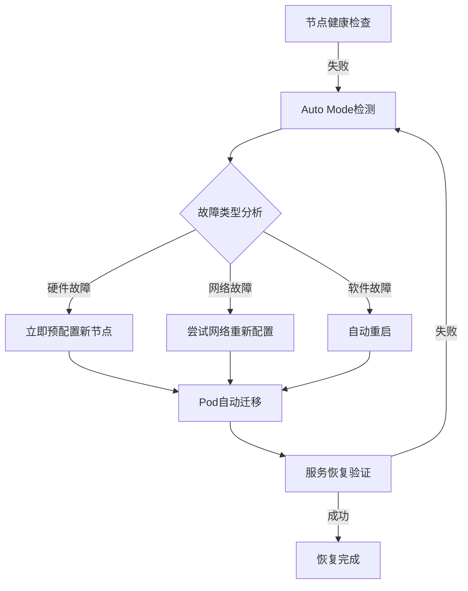

**自动恢复触发条件**：

- **NodeNotReady**: 节点处于NotReady状态超过5分钟
- **NetworkUnavailable**: 网络插件故障
- **MemoryPressure/DiskPressure**: 资源不足
- **Unschedulable**: 节点处于不可调度状态

**2. OS补丁自动化**

Auto Mode自动执行 **零停机OS补丁**：

```yaml
# Auto Mode节点自动更新策略 (无需用户配置)
# AWS自动管理的内部策略示例
nodeMaintenance:
  autoUpdate: true
  maintenanceWindow:
    preferredDays: ["Sunday", "Wednesday"]
    preferredHours: ["02:00-06:00"]  # UTC
  strategy:
    type: RollingUpdate
    maxUnavailable: 1
    respectPodDisruptionBudget: true
```

**补丁流程**：

1. **预配置新节点**: 使用最新AL2023 AMI创建新节点
2. **Pod安全迁移**: 遵守PDB，从旧节点迁移Pod到新节点
3. **移除旧节点**: 所有Pod迁移完成后终止旧节点
4. **验证**: 确认服务健康检查通过

**3. 安全服务集成**

Auto Mode与AWS安全服务自动集成，支持 **安全事件自动响应**：

```
GuardDuty Extended Threat Detection
  ↓ (检测到加密货币挖矿)
Auto Mode自动响应
  ↓
1. 隔离受影响的节点 (Taint: NoSchedule)
2. 预配置新节点
3. 将Pod迁移到干净的节点
4. 终止受感染节点并收集取证数据
5. 在CloudWatch Logs中记录事件
```

**4. 预测性视角：Auto Mode的MTTR改善**

**传统手动运维 vs Auto Mode对比**：

| 故障场景 | 手动运维MTTR | Auto Mode MTTR | 改善率 |
|--------------|----------------|----------------|--------|
| 节点硬件故障 | 15-30分钟 | 2-5分钟 | **缩短83%** |
| OS安全补丁 | 数小时 (计划停机) | 0分钟 (零停机) | **改善100%** |
| 网络插件故障 | 10-20分钟 | 1-3分钟 | **缩短85%** |
| 恶意软件感染 | 30分钟-1小时 | 5-10分钟 | **缩短80%** |

**预测性运维视角下Auto Mode的价值**：

- **先发制人替换**: 检测到节点性能下降后在故障发生前进行替换
- **自动容量管理**: 学习工作负载模式自动选择最优节点类型
- **无中断维护**: 无需用户介入自动执行安全补丁和升级
- **成本优化**: Spot实例中断时自动故障转移到On-Demand

:::tip Auto Mode + 预测性运维的协同效应
Auto Mode的自动恢复功能是 **响应式(Reactive)** 的，但与Container Network Observability数据结合后可实现 **预测式(Predictive)** 运维。通过检测网络性能下降模式，可以在故障发生前替换节点，或提前消除ML推理工作负载的网络瓶颈。
:::

---

## 3. Karpenter + AI预测

### 3.1 Karpenter基本工作原理

Karpenter检测到Pending Pod后 **自动选择合适的实例类型** 并进行预配置。

```yaml
# Karpenter NodePool配置
apiVersion: karpenter.sh/v1
kind: NodePool
metadata:
  name: default
spec:
  template:
    spec:
      requirements:
        - key: kubernetes.io/arch
          operator: In
          values: ["amd64", "arm64"]
        - key: karpenter.sh/capacity-type
          operator: In
          values: ["on-demand", "spot"]
        - key: karpenter.k8s.aws/instance-family
          operator: In
          values: ["m7g", "m7i", "c7g", "c7i", "r7g"]
        - key: karpenter.k8s.aws/instance-size
          operator: In
          values: ["medium", "large", "xlarge", "2xlarge"]
      nodeClassRef:
        group: karpenter.k8s.aws
        kind: EC2NodeClass
        name: default
  limits:
    cpu: "100"
    memory: 400Gi
  disruption:
    consolidationPolicy: WhenEmptyOrUnderutilized
    consolidateAfter: 30s
---
apiVersion: karpenter.k8s.aws/v1
kind: EC2NodeClass
metadata:
  name: default
spec:
  role: KarpenterNodeRole
  amiSelectorTerms:
    - alias: al2023@latest
  subnetSelectorTerms:
    - tags:
        karpenter.sh/discovery: my-cluster
  securityGroupSelectorTerms:
    - tags:
        karpenter.sh/discovery: my-cluster
  blockDeviceMappings:
    - deviceName: /dev/xvda
      ebs:
        volumeSize: 100Gi
        volumeType: gp3
        iops: 3000
        throughput: 125
```

### 3.2 基于AI预测的先发制人预配置

Karpenter本身对Pending Pod做出响应，但 **与AI预测结合** 后可以先发制人地预配置节点。

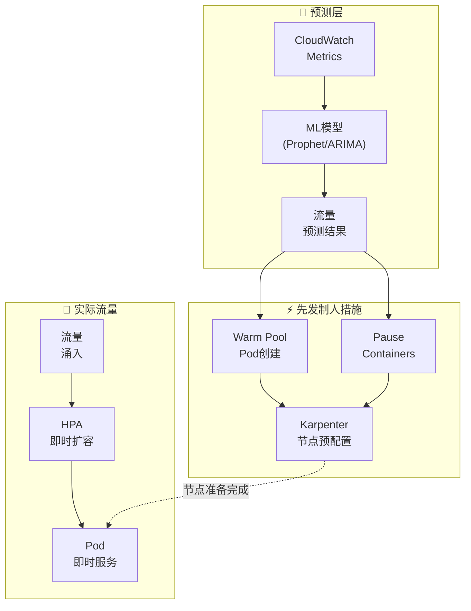

**先发制人预配置策略**：

```yaml
# 使用Placeholder Pod先发制人确保节点
apiVersion: apps/v1
kind: Deployment
metadata:
  name: capacity-reservation
  namespace: scaling
spec:
  replicas: 0  # 预测扩缩器动态调整
  selector:
    matchLabels:
      app: capacity-reservation
  template:
    metadata:
      labels:
        app: capacity-reservation
    spec:
      priorityClassName: capacity-reservation  # 低优先级
      terminationGracePeriodSeconds: 0
      containers:
        - name: pause
          image: registry.k8s.io/pause:3.9
          resources:
            requests:
              cpu: "1"
              memory: 2Gi
---
# 低优先级类 (被实际工作负载驱逐)
apiVersion: scheduling.k8s.io/v1
kind: PriorityClass
metadata:
  name: capacity-reservation
value: -10
globalDefault: false
description: "用于Karpenter节点先发制人预配置"
```

:::tip 先发制人预配置的原理

1. ML模型预测30分钟后流量将增加
2. 增加Placeholder Pod(pause container)的replicas
3. Karpenter检测到Pending Pod并预配置节点
4. 实际流量到来时HPA创建实际Pod
5. Placeholder Pod因低优先级被立即驱逐
6. 由于节点已准备就绪，Pod可以立即调度
:::

### 3.5 ARC + Karpenter集成自动AZ疏散

**ARC(Application Recovery Controller)** 是AWS的高可用性服务，自动检测AZ故障并将流量转移到健康的AZ。与Karpenter集成后可实现 **节点级别的自动恢复**。

#### ARC概述

Application Recovery Controller提供以下3个核心功能：

- **Readiness Check**: 持续监控应用程序健康状态
- **Routing Control**: 通过Route 53或ALB控制流量路由
- **Zonal Shift**: 按AZ单位自动或手动转移流量

#### Karpenter集成模式

```yaml
# 检测ARC Zonal Shift信号的Controller
apiVersion: v1
kind: ConfigMap
metadata:
  name: arc-karpenter-controller
  namespace: kube-system
data:
  config.yaml: |
    arcCluster: arn:aws:route53-recovery-control::ACCOUNT:cluster/CLUSTER_ID
    routingControls:
      - name: az-a-routing
        arn: arn:aws:route53-recovery-control::ACCOUNT:controlpanel/PANEL/routingcontrol/CONTROL_A
      - name: az-b-routing
        arn: arn:aws:route53-recovery-control::ACCOUNT:controlpanel/PANEL/routingcontrol/CONTROL_B
      - name: az-c-routing
        arn: arn:aws:route53-recovery-control::ACCOUNT:controlpanel/PANEL/routingcontrol/CONTROL_C
    karpenterNodePools:
      - default
      - gpu-pool
```

#### AZ故障自动恢复序列

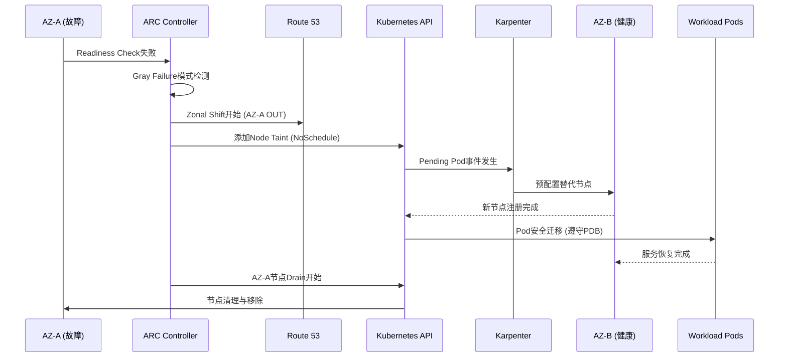

#### Gray Failure处理

**Gray Failure** 指的是不完全故障而是性能下降的状态。ARC检测以下模式：

- **网络延迟增加**: 平时5ms → 超过50ms
- **间歇性超时**: 1-5%的请求失败
- **资源争用**: CPU steal time增加、网络丢包

```python
# Gray Failure检测Lambda函数示例
import boto3
from datetime import datetime, timedelta

def detect_gray_failure(event, context):
    """
    基于Container Network Observability数据
    检测Gray Failure模式。
    """
    cloudwatch = boto3.client('cloudwatch')

    # 查询按AZ的网络延迟指标
    response = cloudwatch.get_metric_statistics(
        Namespace='ContainerInsights',
        MetricName='pod_network_rx_latency_ms',
        Dimensions=[
            {'Name': 'ClusterName', 'Value': 'my-cluster'},
            {'Name': 'AvailabilityZone', 'Value': 'ap-northeast-2a'}
        ],
        StartTime=datetime.utcnow() - timedelta(minutes=15),
        EndTime=datetime.utcnow(),
        Period=60,
        Statistics=['Average', 'Maximum']
    )

    # Gray Failure阈值检查
    datapoints = response['Datapoints']
    if len(datapoints) < 10:
        return {'status': 'insufficient_data'}

    avg_latency = sum(d['Average'] for d in datapoints) / len(datapoints)
    max_latency = max(d['Maximum'] for d in datapoints)

    # 基准：平均延迟 > 50ms 或最大延迟 > 200ms
    if avg_latency > 50 or max_latency > 200:
        trigger_zonal_shift('ap-northeast-2a')
        return {'status': 'gray_failure_detected', 'action': 'zonal_shift'}

    return {'status': 'healthy'}

def trigger_zonal_shift(az):
    """触发ARC Zonal Shift。"""
    arc = boto3.client('route53-recovery-cluster')
    arc.update_routing_control_state(
        RoutingControlArn='arn:aws:route53-recovery-control::ACCOUNT:...',
        RoutingControlState='Off'  # 阻断AZ-A流量
    )
```

#### Istio集成端到端恢复

使用Istio服务网格可实现 **L7层级的流量控制**：

```yaml
# Istio DestinationRule：AZ故障时自动故障转移
apiVersion: networking.istio.io/v1beta1
kind: DestinationRule
metadata:
  name: payment-service-dr
spec:
  host: payment-service
  trafficPolicy:
    outlierDetection:
      consecutiveErrors: 5
      interval: 30s
      baseEjectionTime: 30s
      maxEjectionPercent: 50
    loadBalancer:
      localityLbSetting:
        enabled: true
        failover:
          - from: ap-northeast-2a
            to: ap-northeast-2c
```

**端到端恢复流程**：

1. **ARC Readiness Check失败** → Zonal Shift开始
2. **Route 53** → 阻断发往AZ-A的外部流量
3. **Istio Envoy** → 阻断发往AZ-A内部Pod的East-West流量
4. **Karpenter** → 在AZ-C预配置替代节点
5. **Kubernetes** → 遵守PDB安全迁移Pod
6. **Istio** → 自动路由流量到新Pod

#### 预测性AZ管理

利用Container Network Observability数据 **先发制人地检测AZ性能异常**：

```promql
# 按AZ的网络错误率趋势
sum(rate(pod_network_rx_errors_total[5m])) by (availability_zone)
/ sum(rate(pod_network_rx_packets_total[5m])) by (availability_zone)
* 100

# 按AZ的平均Pod-to-Pod延迟
histogram_quantile(0.99,
  sum(rate(pod_network_latency_bucket[5m])) by (availability_zone, le)
)
```

**预测性AZ管理策略**：

- **趋势分析**: 学习过去7天各AZ的性能模式
- **预警**: 性能比基准下降20%时发出警报
- **先发制人转移**: 下降30%时考虑自动Zonal Shift
- **成本优化**: 考虑跨AZ流量成本的最优部署

:::warning ARC + Karpenter集成注意事项
ARC + Karpenter集成仅在PDB正确配置时才能保证安全的Pod迁移。请为所有生产工作负载配置PDB。

```yaml
apiVersion: policy/v1
kind: PodDisruptionBudget
metadata:
  name: payment-service-pdb
spec:
  minAvailable: 2
  selector:
    matchLabels:
      app: payment-service
```
:::

---

## 4. CloudWatch异常检测

### 4.1 异常检测频带

CloudWatch Anomaly Detection使用ML自动学习指标的 **正常范围频带**，检测超出频带的异常。

```bash
# 创建Anomaly Detection模型
aws cloudwatch put-anomaly-detector \
  --namespace "ContainerInsights" \
  --metric-name "pod_cpu_utilization" \
  --dimensions Name=ClusterName,Value=my-cluster \
  --stat "Average" \
  --configuration '{
    "ExcludedTimeRanges": [
      {
        "StartTime": "2026-01-01T00:00:00Z",
        "EndTime": "2026-01-02T00:00:00Z"
      }
    ],
    "MetricTimezone": "Asia/Seoul"
  }'
```

### 4.2 EKS指标应用

应用Anomaly Detection的核心EKS指标：

<AnomalyMetrics />

### 4.3 基于Anomaly Detection的告警

```bash
# 基于Anomaly Detection的CloudWatch Alarm
aws cloudwatch put-metric-alarm \
  --alarm-name "EKS-CPU-Anomaly" \
  --comparison-operator GreaterThanUpperThreshold \
  --threshold-metric-id ad1 \
  --evaluation-periods 3 \
  --datapoints-to-alarm 2 \
  --metrics '[
    {
      "Id": "m1",
      "MetricStat": {
        "Metric": {
          "Namespace": "ContainerInsights",
          "MetricName": "pod_cpu_utilization",
          "Dimensions": [
            {"Name": "ClusterName", "Value": "my-cluster"}
          ]
        },
        "Period": 300,
        "Stat": "Average"
      }
    },
    {
      "Id": "ad1",
      "Expression": "ANOMALY_DETECTION_BAND(m1, 2)"
    }
  ]' \
  --alarm-actions "arn:aws:sns:ap-northeast-2:ACCOUNT_ID:ops-alerts"
```

---

## 5. AI Agent自动事件响应

### 5.1 现有自动化的局限性

基于EventBridge + Lambda的自动化是 **规则式** 的，因此存在局限性：

```
[现有方式：规则式自动化]
CloudWatch Alarm → EventBridge Rule → Lambda → 固定操作

问题：
  ✗ "CPU > 80%就扩容" — 原因可能是内存泄漏
  ✗ "Pod重启 > 5次就告警" — 不同原因需要不同应对
  ✗ 无法应对复合故障
  ✗ 无法适应新模式
```

### 5.2 基于AI Agent的自主响应

<ResponsePatterns />

AI Agent基于 **上下文判断** 进行自主响应。

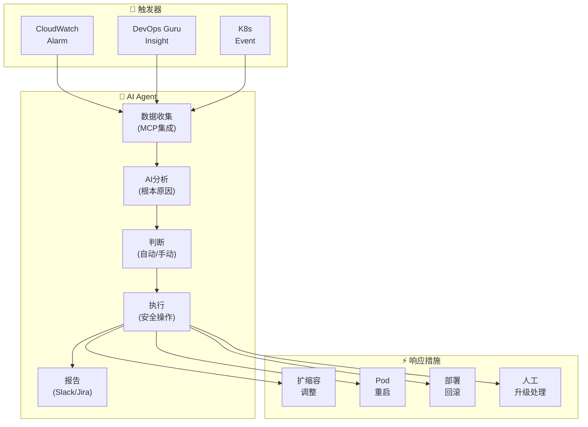

### 5.3 Kagent自动事件响应

```yaml
# Kagent：自动事件响应Agent
apiVersion: kagent.dev/v1alpha1
kind: Agent
metadata:
  name: incident-responder
  namespace: kagent-system
spec:
  description: "EKS事件自动响应Agent"
  modelConfig:
    provider: bedrock
    model: anthropic.claude-sonnet
    region: ap-northeast-2
  systemPrompt: |
    你是一个EKS事件响应Agent。

    ## 响应原则
    1. 安全优先：危险变更升级给人工处理
    2. 根本原因优先：针对原因而非症状进行响应
    3. 最小干预：仅执行最必要的操作
    4. 所有操作记录：自动报告到Slack和JIRA

    ## 自动操作允许范围
    - Pod重启 (CrashLoopBackOff, 5次以上)
    - HPA min/max调整 (当前值的±50%范围)
    - Deployment回滚 (到前一个版本)
    - 节点drain (MemoryPressure/DiskPressure)

    ## 升级处理对象
    - 可能导致数据丢失的操作
    - 影响50%以上replicas
    - StatefulSet相关变更
    - 网络策略变更

  tools:
    - name: kubectl
      type: kmcp
      config:
        allowedVerbs: ["get", "describe", "logs", "top", "rollout", "scale", "delete"]
        deniedResources: ["secrets", "configmaps"]
    - name: cloudwatch
      type: kmcp
      config:
        actions: ["GetMetricData", "DescribeAlarms", "GetInsight"]
    - name: slack
      type: mcp
      config:
        webhook_url: "${SLACK_WEBHOOK}"
        channel: "#incidents"

  triggers:
    - type: cloudwatch-alarm
      filter:
        severity: ["CRITICAL", "HIGH"]
    - type: kubernetes-event
      filter:
        reason: ["CrashLoopBackOff", "OOMKilled", "FailedScheduling"]
```

### 5.4 Strands Agent SOP：复合故障响应

```python
# Strands Agent：复合故障自动响应
from strands import Agent
from strands.tools import eks_tool, cloudwatch_tool, slack_tool, jira_tool

incident_agent = Agent(
    name="complex-incident-handler",
    model="bedrock/anthropic.claude-sonnet",
    tools=[eks_tool, cloudwatch_tool, slack_tool, jira_tool],
    sop="""
    ## 复合故障响应SOP

    ### Phase 1：情况评估 (30秒内)
    1. 查询CloudWatch告警和DevOps Guru洞察
    2. 确认相关服务的Pod状态
    3. 确认节点状态和资源利用率
    4. 确认最近部署历史 (10分钟内变更)

    ### Phase 2：根本原因分析 (2分钟内)
    1. 从日志中提取错误模式
    2. 指标相关性分析 (CPU, Memory, Network, Disk)
    3. 分析与部署变更的时间相关性
    4. 确认依赖服务状态

    ### Phase 3：自动响应
    按原因自动处理：

    **部署相关故障：**
    - 最近10分钟内存在部署 → 自动回滚
    - 回滚后确认状态 → 恢复正常则完成

    **资源不足：**
    - CPU/Memory > 90% → 调整HPA或Karpenter添加节点
    - Disk > 85% → 清理不必要的日志/镜像

    **依赖服务故障：**
    - RDS连接失败 → 确认连接池设置，必要时重启
    - SQS延迟 → 检查DLQ，消费者扩容

    **原因不明：**
    - 升级给人工处理
    - 在Slack中分享所有收集的数据

    ### Phase 4：事后处理
    1. 创建事件时间线
    2. 创建JIRA事件工单
    3. 在Slack #incidents频道发布报告
    4. 保存为学习数据 (反馈循环)
    """
)
```

:::info AI Agent的核心价值
超越EventBridge+Lambda，实现基于AI上下文的自主响应。通过 **MCP集成查询** 各种数据源（CloudWatch、EKS API、X-Ray、部署历史），即使是规则无法应对的复合故障，也能分析根本原因并自动执行适当的操作。
:::

### 5.5 CloudWatch Investigations — 基于AI的自动根本原因分析

**CloudWatch Investigations** 是基于AWS 17年运营经验构建的 **生成式AI自动调查系统**。事件发生时，AI自动生成假设、收集数据并执行验证调查工作流。

#### CloudWatch Investigations概述

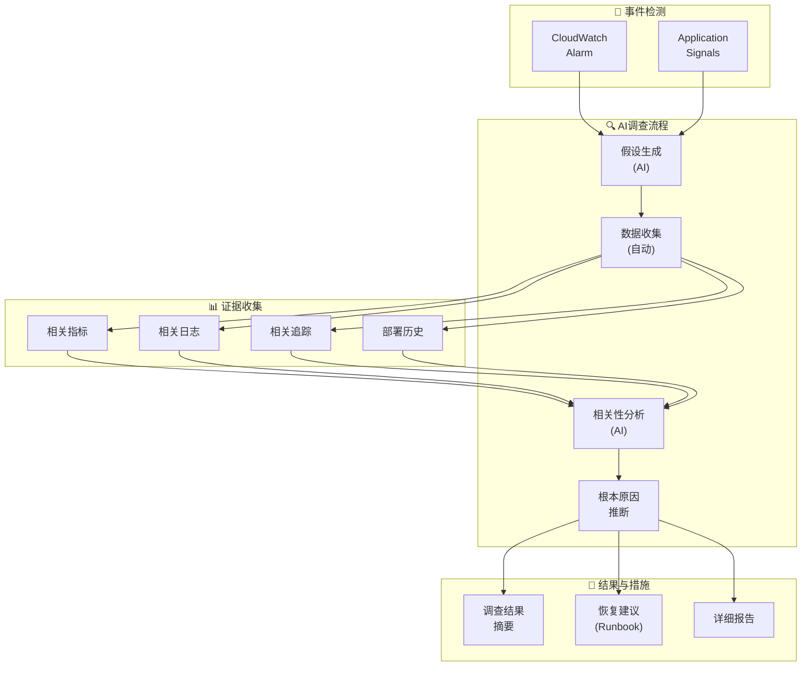

#### 核心功能

**1. Application Signals集成：基于服务拓扑的影响度自动分析**

CloudWatch Investigations利用Application Signals自动生成的服务拓扑来追踪 **故障传播路径**：

```yaml
# Application Signals自动服务拓扑示例
payment-gateway (错误率增加25%)
  └─> payment-service (延迟增加300%)
       ├─> postgres-db (连接池耗尽)
       └─> redis-cache (正常)
            └─> dynamodb (正常)
```

Investigations分析此拓扑：
- **Root Cause**: `postgres-db` 连接池耗尽
- **Impacted Services**: `payment-service`, `payment-gateway`
- **Propagation Path**: DB → Service → Gateway

**2. 相关指标/日志/追踪自动相关性分析**

```python
# Investigations执行的自动相关性分析示例

# 时间相关性
payment_service_errors.spike_at = "2026-02-12 14:23:00"
db_connection_pool.exhausted_at = "2026-02-12 14:22:55"
# → 相差5秒：DB问题先于服务错误发生

# 指标相关性
db_active_connections = 100 (达到max_connections)
payment_service_response_time = 5000ms (比平时50ms高100倍)
# → 强相关性：DB连接耗尽 → 服务延迟

# 日志模式分析
logs.error_pattern = "CannotGetJdbcConnectionException"
logs.frequency = 1,234 occurrences in last 5 minutes
# → 明确证据：DB连接不可用错误
```

**3. 基于假设的根本原因推断**

Investigations自动生成并验证以下假设：

| 假设 | 验证方法 | 结果 |
|------|----------|------|
| DB连接池耗尽 | 确认`db_connections`指标 | ✓ 已确认 |
| 网络延迟 | 分析VPC Flow Logs | ✗ 正常 |
| OOM(内存不足) | 确认容器内存指标 | ✗ 正常 |
| 部署后Bug | 查询最近部署历史 | ✓ 确认10分钟前有部署 |

**最终结论**: 最近部署中DB连接池配置被错误地从`maxPoolSize=50`改为`maxPoolSize=10`。

**4. 调查结果摘要与恢复建议**

```
━━━━━━━━━━━━━━━━━━━━━━━━━━━━━━━━━━━━━━━━━━
  CloudWatch Investigations结果摘要
━━━━━━━━━━━━━━━━━━━━━━━━━━━━━━━━━━━━━━━━━━

🔴 根本原因 (Root Cause):
   payment-service的DB连接池配置错误
   (maxPoolSize: 50 → 10被错误修改)

📊 影响度 (Impact):
   - payment-gateway: 错误率增加25%
   - payment-service: 延迟增加300%
   - 受影响请求：约15,000件

⏱️ 时间线:
   14:10 - 部署开始 (v1.2.3 → v1.2.4)
   14:22 - DB连接池开始耗尽
   14:23 - 服务错误急增告警触发
   14:25 - Investigations自动开始

💡 建议措施:
   1. 立即回滚: kubectl rollout undo deployment/payment-service
   2. 恢复DB连接池配置: maxPoolSize=50
   3. 添加部署前环境变量验证步骤
   4. 应用ConfigMap变更时的自动验证脚本

📋 相关资源:
   - Runbook: https://wiki/db-connection-pool-issue
   - 日志: CloudWatch Logs Insights查询链接
   - 指标: CloudWatch Dashboard链接
━━━━━━━━━━━━━━━━━━━━━━━━━━━━━━━━━━━━━━━━━━
```

#### 与DevOps Agent的区别

| 方面 | CloudWatch Investigations | Kagent / Strands Agent |
|------|--------------------------|------------------------|
| **运营方式** | AWS托管 (无需配置) | 用户安装·运维 |
| **分析范围** | AWS全局数据自动收集 | 仅配置的数据源 |
| **根本原因分析** | AI自动假设生成·验证 | 基于SOP规则执行 |
| **自定义** | 有限 (AWS预设) | 高 (完全自由度) |
| **自动恢复** | 仅提供建议 (不执行) | 可自动执行 |
| **成本** | 基于CloudWatch使用量 | 仅基础设施成本 |
| **学习曲线** | 无 (即时可用) | 中等 (需编写YAML) |

**推荐集成模式**：

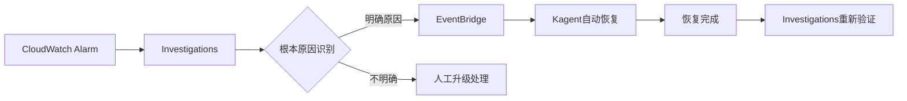

**集成示例：EventBridge Rule**

```json
{
  "source": ["aws.cloudwatch"],
  "detail-type": ["CloudWatch Investigation Complete"],
  "detail": {
    "conclusion": {
      "rootCauseType": ["Configuration Error", "Resource Exhaustion"]
    }
  }
}
```

```python
# EventBridge → Kagent自动恢复Lambda
def lambda_handler(event, context):
    """
    接收CloudWatch Investigations结果
    通过Kagent触发自动恢复。
    """
    investigation = event['detail']
    root_cause = investigation['conclusion']['rootCauseType']

    if root_cause == "Configuration Error":
        # 向Kagent请求ConfigMap回滚
        trigger_kagent_task(
            task_type="rollback_config",
            resource=investigation['affectedResources'][0],
            reason=investigation['conclusion']['summary']
        )
    elif root_cause == "Resource Exhaustion":
        # 向Kagent请求扩缩容
        trigger_kagent_task(
            task_type="scale_up",
            resource=investigation['affectedResources'][0],
            target_replicas=calculate_required_replicas()
        )
```

:::tip CloudWatch Investigations活用策略
CloudWatch Investigations是无需配置即可直接使用的托管AI分析。需要自定义自动化时请与Kagent/Strands Agent配合使用。

**推荐工作流**：
1. **一次分析**: CloudWatch Investigations自动识别根本原因
2. **二次响应**: 原因明确时 → Kagent/Strands自动恢复
3. **升级处理**: 原因不明确时 → 将调查结果传递给人工
:::

#### 实战场景：EKS Pod OOMKilled调查

```
[事件] 14:45 - payment-service Pod OOMKilled

[Investigations自动调查]

步骤1：假设生成
  - 假设A：内存泄漏
  - 假设B：流量突增导致的正常内存增长
  - 假设C：内存limits配置错误

步骤2：数据收集
  - Pod内存使用趋势：100Mi → 512Mi (4小时)
  - 流量趋势：无变化 (稳定)
  - Heap dump分析：Redis连接对象累积10,000个

步骤3：根本原因识别
  ✓ 假设A确认：内存泄漏 (Redis连接未释放)
  ✗ 假设B排除：流量无变化
  ✗ 假设C排除：limits设置适当 (512Mi)

步骤4：恢复建议
  即时措施：
    - kubectl rollout restart deployment/payment-service
    - 临时将内存limits增加到1Gi

  根本解决：
    - 修改Redis客户端代码 (正确关闭连接池)
    - 添加内存分析工具
    - 设置内存泄漏监控告警

  相关代码：
    文件: src/cache/redis_client.go
    问题: 缺少defer conn.Close()
    修复PR: https://github.com/...
```

### 5.6 Amazon Q Developer基于自然语言的运营自动化

**Amazon Q Developer** 是AWS的下一代AI助手，通过 **自然语言接口** 革命性地简化EKS运营。无需控制台浏览或复杂命令，可以用日常语言提问和请求操作。

#### 基于自然语言接口的EKS故障排查

Amazon Q Developer将 **自然语言查询** 自动转换为AWS API调用和kubectl命令并执行：

**场景1：查找OOM Pod**

```
[用户提问]
"帮我找到这个集群中发生OOM的Pod"

[Amazon Q Developer响应]
正在分析...

发现的OOM事件：
- payment-service-7d8f9c4b-xyz (namespace: payment)
  └─ 最近3次OOMKilled (过去1小时)
  └─ 内存limits: 512Mi, 实际使用: 520Mi
  └─ 建议: 将memory limits增加到1Gi

- cart-service-5a6b2d1c-abc (namespace: shopping)
  └─ 最近1次OOMKilled (过去30分钟)
  └─ 内存limits: 256Mi, 实际使用: 280Mi
  └─ 建议: 将memory limits增加到512Mi

执行的命令：
$ kubectl get events --all-namespaces --field-selector reason=OOMKilled
$ kubectl top pod -n payment payment-service-7d8f9c4b-xyz
$ kubectl describe pod -n payment payment-service-7d8f9c4b-xyz

需要执行下一步操作吗？
1. 自动调整memory limits (应用VPA)
2. 开始详细内存分析
3. 分析全部相关日志
```

**场景2：识别高负载节点**

```
[用户提问]
"过去1小时内CPU使用率超过80%的节点有哪些？"

[Amazon Q Developer响应]
正在查询CloudWatch Container Insights数据...

高负载节点列表：

1. ip-10-0-1-45.ap-northeast-2.compute.internal
   - 平均CPU: 87.3% (过去1小时)
   - 最大CPU: 94.1%
   - 实例类型: m5.xlarge (4 vCPU)
   - 运行中的Pod: 23个
   - 建议操作: 通过Karpenter添加节点或重新分配工作负载

2. ip-10-0-2-78.ap-northeast-2.compute.internal
   - 平均CPU: 82.5% (过去1小时)
   - 最大CPU: 89.7%
   - 实例类型: c5.2xlarge (8 vCPU)
   - 运行中的Pod: 31个
   - 建议操作: 将CPU密集型Pod迁移到其他节点

执行的CloudWatch查询：
namespace: ContainerInsights
metric: node_cpu_utilization
period: 1h
threshold: > 80%

要执行下一步操作吗？
1. 通过Karpenter自动预配置新节点
2. 手动迁移高负载Pod到其他节点
3. 检查和调整HPA设置
```

**场景3：Deployment回滚**

```
[用户提问]
"帮我回滚这个Deployment"

[Amazon Q Developer响应]
正在准备payment-service Deployment的回滚...

当前部署状态：
- Revision: 15
- 部署时间: 2026-02-12 14:30:00 (15分钟前)
- 错误率: 12.3% (比平时0.5%急剧增加)
- 上一个稳定版本: Revision 14 (错误率0.4%)

回滚目标：
- 当前: payment-service:v2.3.1 (Revision 15)
- 回滚: payment-service:v2.3.0 (Revision 14)

PDB确认：
- minAvailable: 2
- 当前Running: 5
- 回滚期间最低保证: 2个维持 ✓

执行命令：
$ kubectl rollout undo deployment/payment-service -n payment --to-revision=14

执行回滚吗？ (yes/no)
```

**场景4：网络连接问题诊断**

```
[用户提问]
"帮我找出payment-service无法连接database的原因"

[Amazon Q Developer响应]
正在诊断网络连接问题...

诊断结果：

1. DNS确认: ✓ 正常
   - database.payment.svc.cluster.local 解析成功
   - IP: 10.100.15.234

2. 网络策略确认: ✗ 发现问题
   - payment-service → database 连接被阻断
   - 原因: NetworkPolicy "database-access-policy"中
     payment-service的标签不在允许列表中

3. SecurityGroup确认: ✓ 正常
   - RDS SecurityGroup允许EKS节点

4. 日志分析:
   - 错误: "dial tcp 10.100.15.234:5432: i/o timeout"
   - 发生频率: 过去10分钟1,247次

解决方法:
$ kubectl edit networkpolicy database-access-policy -n payment

在ingress.from.podSelector中添加以下标签:
  matchLabels:
    app: payment-service  # ← 添加此标签

修改后的YAML预览:
---
apiVersion: networking.k8s.io/v1
kind: NetworkPolicy
metadata:
  name: database-access-policy
  namespace: payment
spec:
  podSelector:
    matchLabels:
      app: database
  ingress:
    - from:
        - podSelector:
            matchLabels:
              app: payment-service  # ← 已添加
        - podSelector:
            matchLabels:
              app: order-service
---

自动修复吗？ (yes/no)
```

#### Cost Explorer集成

Amazon Q Developer与 **AWS Cost Explorer** 集成，支持自然语言成本查询：

**场景1：成本增长原因分析**

```
[用户提问]
"这个月EKS成本为什么增加了？"

[Amazon Q Developer响应]
正在分析Cost Explorer数据...

成本增长分析 (2026年2月):

总EKS成本: $12,450 (环比+45%)
增长原因：

1. 计算成本增长: +$3,200 (贡献52%)
   - m5.4xlarge实例使用增加
   - 原因: ML推理工作负载增加 (vLLM部署)
   - 建议: 迁移到Graviton (m7g)可节省40%

2. 数据传输成本增长: +$1,800 (贡献29%)
   - 跨AZ流量增加 (150GB → 450GB)
   - 原因: 新微服务间的通信模式
   - 建议: 通过Topology Aware Hints优先同AZ通信

3. EBS存储成本增长: +$950 (贡献15%)
   - gp3卷使用量增加 (500GB → 1,200GB)
   - 原因: Prometheus指标保留期延长 (7天 → 30天)
   - 建议: 将长期保存数据迁移到S3

4. 负载均衡器成本增长: +$250 (贡献4%)
   - ALB LCU使用增加
   - 原因: API流量增加

详细成本仪表盘: (链接)
正在生成成本优化建议报告...
```

**场景2：Spot vs On-Demand成本对比**

```
[用户提问]
"切换到Spot实例可以节省多少？"

[Amazon Q Developer响应]
正在运行Spot节省模拟...

当前集群配置：
- On-Demand节点: 45个
- 实例类型: m5.xlarge, m5.2xlarge, c5.2xlarge
- 月费用: $8,500

Spot转换模拟 (70% Spot, 30% On-Demand):

场景A: 保守转换 (仅Stateless工作负载)
- Spot节点: 32个 (70%)
- On-Demand节点: 13个 (30%)
- 预估月费用: $3,200
- 节省额: $5,300/月 (节省62%)
- 风险度: 低 (Stateful工作负载保持On-Demand)

场景B: 积极转换 (大部分Spot)
- Spot节点: 40个 (89%)
- On-Demand节点: 5个 (11%)
- 预估月费用: $1,900
- 节省额: $6,600/月 (节省78%)
- 风险度: 中等 (Spot中断时部分服务受影响)

Spot中断应对：
- Karpenter自动重新预配置: 平均90秒
- Spot Instance Interruption Warning: 提前2分钟通知
- PDB保证最低可用性

建议：
1. 从场景A开始 (稳定性优先)
2. 监控2周
3. 稳定后扩展到场景B

正在生成Spot转换计划书...
```

#### MCP服务器集成低代码AIOps

Amazon Q Developer通过 **Model Context Protocol(MCP)** 与各种AWS服务集成，可以构建 **低代码AIOps解决方案**：

**MCP服务器集成架构**：

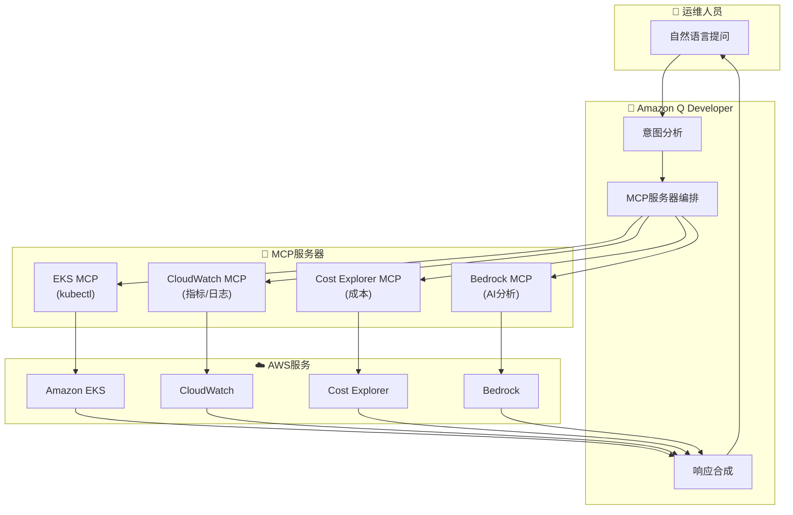


**综合运营视图示例**：

```
[用户提问]
"请综合展示 payment-service 的当前状态"

[Amazon Q Developer 回复]
payment-service 综合状态仪表板：

━━━━━━━━━━━━━━━━━━━━━━━━━━━━━━━━━━━━━━━━━━
  PAYMENT-SERVICE 状态 (2026-02-12 15:30)
━━━━━━━━━━━━━━━━━━━━━━━━━━━━━━━━━━━━━━━━━━

1. Kubernetes 状态 (EKS MCP)
   - Deployment: payment-service
   - Replicas: 5/5 Running
   - Image: payment-service:v2.3.1
   - 最近重启：无 (稳定)
   - PDB: minAvailable=2 (满足)

2. 性能指标 (CloudWatch MCP)
   - Request Rate: 1,234 req/s
   - P50 Latency: 45ms
   - P99 Latency: 280ms (SLO: 500ms) ✓
   - Error Rate: 0.3% (SLO: 1%) ✓
   - CPU 使用率: 65% (平均)
   - Memory 使用率: 72% (平均)

3. 成本 (Cost Explorer MCP)
   - 本月费用: $1,245
   - 环比: +12%
   - 主要费用: 计算 (m5.xlarge x 5)
   - 优化机会: 切换至 Spot 可节省 $750

4. AI 分析 (Bedrock MCP)
   - 状态: 正常
   - 趋势: 流量呈增长趋势 (周增 +15%)
   - 预测: 2周内需要扩容
   - 建议: 将 HPA maxReplicas 增加至 10

5. 近期事件 (CloudWatch Logs MCP)
   - 部署: 2天前 (v2.3.0 → v2.3.1) 成功
   - 告警: 无
   - 错误日志: 15条 (轻微，DB 连接超时)

━━━━━━━━━━━━━━━━━━━━━━━━━━━━━━━━━━━━━━━━━━

综合评估: 🟢 正常
下一步操作: 无需
持续观察: CPU/Memory 趋势监控

想要查看哪个项目的详细信息？(1-5)
```

**自然语言 → MCP 调用 → 结果分析 → 操作建议的自动循环**：

```python
# Amazon Q Developer 的内部运作 (概念性)
class QDeveloperAIOpsLoop:
    def process_query(self, user_query: str):
        """处理自然语言查询的自动循环"""

        # 1. 意图分析
        intent = self.analyze_intent(user_query)
        # 例: "payment-service 状态" → intents: ["k8s_status", "metrics", "cost"]

        # 2. 识别所需 MCP 服务器
        required_mcps = self.identify_mcps(intent)
        # 例: ["eks-mcp", "cloudwatch-mcp", "cost-explorer-mcp"]

        # 3. MCP 调用 (并行)
        results = await asyncio.gather(
            self.eks_mcp.get_deployment_status("payment-service"),
            self.cloudwatch_mcp.get_metrics("payment-service", period="1h"),
            self.cost_explorer_mcp.get_service_cost("payment-service")
        )

        # 4. 结果综合分析 (使用 Bedrock Claude)
        analysis = self.bedrock_mcp.analyze(
            prompt=f"请分析以下数据，评估综合状态并提出操作建议:\n{results}",
            model="anthropic.claude-sonnet-4.0"
        )

        # 5. 生成操作建议
        actions = self.generate_actions(analysis)
        # 例: ["HPA 调整", "考虑 Spot 切换", "加强日志监控"]

        # 6. 向用户响应
        return self.format_response(analysis, actions)
```

**MCP 服务器组合示例**：

| 问题类型 | 使用的 MCP 服务器 | 综合分析 |
|----------|----------------|----------|
| "Pod 为什么重启？" | EKS MCP + CloudWatch Logs MCP | 事件 + 日志关联分析 |
| "费用为什么增加了？" | Cost Explorer MCP + EKS MCP | 费用增长 + 资源变更关联分析 |
| "有网络延迟吗？" | CloudWatch MCP + EKS MCP | 指标 + 网络策略分析 |
| "有安全威胁吗？" | GuardDuty MCP + EKS MCP | 威胁检测 + Pod 状态分析 |

#### Kagent/Strands 的区别

| 方面 | Amazon Q Developer | Kagent / Strands |
|------|-------------------|------------------|
| **运营方式** | 对话式工具 (Interactive) | 自动化代理 (Autonomous) |
| **触发方式** | 用户提问 (On-demand) | 事件驱动 (Event-driven) |
| **主要用途** | 手动调查和分析 | 自动响应和恢复 |
| **执行权限** | 以读取为主 (部分写入) | 需要写入权限 (自动操作) |
| **配置复杂度** | 低 (即开即用) | 中等 (需要 YAML 配置) |
| **自定义** | 有限 (AWS 预设) | 高 (基于 SOP 完全控制) |
| **费用** | Q Developer 订阅费 | 仅基础设施费用 |
| **学习曲线** | 无 (自然语言) | 中等 (需要 Kubernetes 知识) |

**推荐组合模式**：

```
[场景 1: 事件发生]

1. Kagent/Strands (自动响应)
   - 告警检测 → 立即开始自动操作
   - 例: Pod 重启、扩容、回滚

2. Amazon Q Developer (手动调查)
   - 需要复杂根因分析时
   - 例: "这个 Pod 为什么一直重启？"

[场景 2: 定期检查]

1. Amazon Q Developer (手动调查)
   - "分析一下本周费用增加的原因"
   - "找出性能下降的服务"

2. Kagent/Strands (自动响应)
   - 接收 Q Developer 的建议并自动应用
   - 例: VPA 调整、HPA 配置变更

[场景 3: 预测性运营]

1. CloudWatch Anomaly Detection
   - 自动检测异常征兆

2. Amazon Q Developer (分析)
   - "这个异常征兆意味着什么？"
   - "过去是否有类似的模式？"

3. Kagent/Strands (先发制人)
   - 针对预测的问题进行先发制人的扩容
```

**集成工作流示例**：

```yaml
# Kagent Agent: 自动执行 Amazon Q Developer 的建议
apiVersion: kagent.dev/v1alpha1
kind: Agent
metadata:
  name: q-developer-executor
spec:
  description: "自动执行 Amazon Q Developer 的建议"
  triggers:
    - type: slack-command
      filter:
        command: "/q-execute"
  tools:
    - name: kubectl
      type: kmcp
    - name: amazon-q
      type: custom
      config:
        endpoint: "https://q.aws.amazon.com/api"
  workflow: |
    ## Q Developer 建议自动执行工作流

    1. 在 Slack 中向 Q Developer 提问
       例: "@q 请建议 payment-service 的优化方案"

    2. Q Developer 生成建议
       例: "将 HPA maxReplicas 增加至 10，应用 VPA"

    3. 用户批准
       命令: "/q-execute 建议编号"

    4. Kagent 自动执行
       - 变更 HPA 配置
       - 创建并应用 VPA
       - 在 Slack 中报告执行结果
```

:::tip Amazon Q Developer 的核心价值
Amazon Q Developer 通过**自然语言接口**大幅降低了 EKS 运营的入门门槛。即使不了解 kubectl 命令或 CloudWatch 查询语法，也可以用日常语言提问和请求操作。通过 **MCP 服务器集成**，自动组合多个数据源，可以构建**低代码 AIOps 解决方案**。

**推荐使用场景**：
1. **手动调查**：复杂问题的根本原因分析
2. **成本优化**：与 Cost Explorer 联动的成本洞察
3. **学习工具**：新团队成员的 EKS 运营学习
4. **Kagent/Strands 组合**：Q Developer(调查) + Kagent(自动响应)
:::

### 5.7 基于 Bedrock AgentCore 的自主运营

**Amazon Bedrock AgentCore** 是 Bedrock Agents 的核心引擎，可以在生产环境中构建**完全自主运营代理**。如果说 Kagent/Strands 是 Kubernetes 原生方法，那么 Bedrock AgentCore 就是 AWS 原生方法，通过 **guardrails** 和 **action groups** 明确控制安全的自动化范围。

#### 5.6.1 Bedrock AgentCore 架构

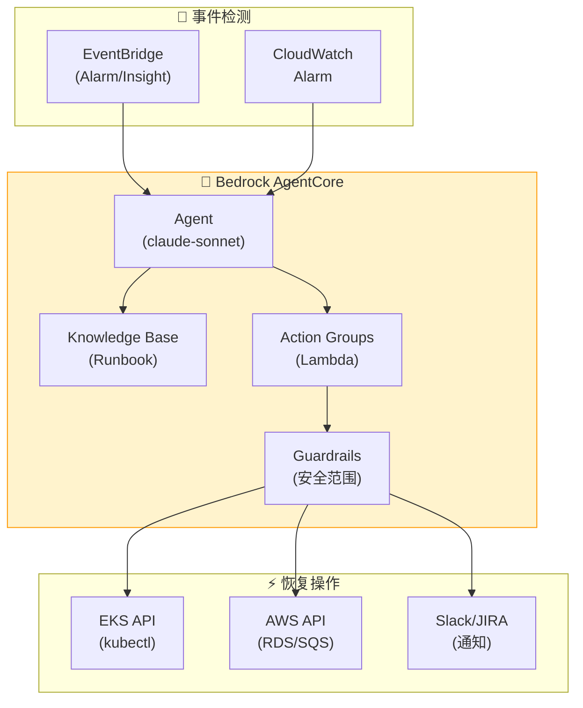

#### 5.6.2 Bedrock Agent 定义 — 事件自主恢复

```python
# Bedrock Agent 创建 — 事件自动响应
import boto3

bedrock = boto3.client('bedrock-agent', region_name='ap-northeast-2')

response = bedrock.create_agent(
    agentName='incident-auto-remediation',
    foundationModel='anthropic.claude-sonnet-v3',
    instruction="""
    你是 EKS 事件自动恢复代理。

    ## 核心原则
    1. 安全优先: 仅在 guardrails 范围内执行操作
    2. 根本原因分析: 解决原因而非症状
    3. 最小干预: 仅执行必要的最小变更
    4. 完全透明: 所有操作立即报告到 Slack 和 JIRA

    ## 自动恢复工作流
    Phase 1: 检测 (30秒内)
    - CloudWatch Alarm 分析
    - DevOps Guru Insight 收集
    - 相关 EKS 资源状态查询

    Phase 2: 诊断 (2分钟内)
    - Pod 日志和事件分析
    - 指标关联分析 (CPU/Memory/Network)
    - 部署历史确认 (最近10分钟变更)
    - 在 Knowledge Base 中搜索类似案例

    Phase 3: 自动恢复 (5分钟内)
    - 部署故障 → 自动回滚 (to previous stable revision)
    - 资源不足 → HPA 调整或 Pod 重启
    - 依赖服务故障 → 重启或重置连接
    - 原因不明 → 升级至人工处理

    Phase 4: 验证和报告
    - 恢复后状态确认 (确认指标恢复正常)
    - 创建事件时间线
    - Slack/JIRA 自动报告
    """,
    idleSessionTTLInSeconds=600,
    agentResourceRoleArn='arn:aws:iam::ACCOUNT_ID:role/BedrockAgentRole'
)

agent_id = response['agent']['agentId']
```

#### 5.6.3 Action Groups — 安全的恢复操作范围

```python
# Action Group 1: EKS 只读查询
bedrock.create_agent_action_group(
    agentId=agent_id,
    agentVersion='DRAFT',
    actionGroupName='eks-read-actions',
    actionGroupExecutor={
        'lambda': 'arn:aws:lambda:ap-northeast-2:ACCOUNT_ID:function:eks-read-handler'
    },
    apiSchema={
        'payload': '''
        {
          "openapi": "3.0.0",
          "info": {"title": "EKS Read API", "version": "1.0.0"},
          "paths": {
            "/pods": {
              "get": {
                "summary": "Get Pod list",
                "parameters": [
                  {"name": "namespace", "in": "query", "schema": {"type": "string"}}
                ],
                "responses": {"200": {"description": "Pod list"}}
              }
            },
            "/pods/{name}/logs": {
              "get": {
                "summary": "Get Pod logs",
                "parameters": [
                  {"name": "name", "in": "path", "required": true, "schema": {"type": "string"}},
                  {"name": "namespace", "in": "query", "schema": {"type": "string"}}
                ],
                "responses": {"200": {"description": "Pod logs"}}
              }
            },
            "/deployments/{name}/revisions": {
              "get": {
                "summary": "Get deployment revision history",
                "parameters": [
                  {"name": "name", "in": "path", "required": true, "schema": {"type": "string"}},
                  {"name": "namespace", "in": "query", "schema": {"type": "string"}}
                ],
                "responses": {"200": {"description": "Revision list"}}
              }
            }
          }
        }
        '''
    }
)

# Action Group 2: EKS 恢复操作 (应用 guardrails)
bedrock.create_agent_action_group(
    agentId=agent_id,
    agentVersion='DRAFT',
    actionGroupName='eks-remediation-actions',
    actionGroupExecutor={
        'lambda': 'arn:aws:lambda:ap-northeast-2:ACCOUNT_ID:function:eks-remediation-handler'
    },
    apiSchema={
        'payload': '''
        {
          "openapi": "3.0.0",
          "info": {"title": "EKS Remediation API", "version": "1.0.0"},
          "paths": {
            "/deployments/{name}/rollback": {
              "post": {
                "summary": "Rollback deployment to previous revision",
                "parameters": [
                  {"name": "name", "in": "path", "required": true, "schema": {"type": "string"}},
                  {"name": "namespace", "in": "query", "schema": {"type": "string"}},
                  {"name": "to_revision", "in": "query", "schema": {"type": "integer"}}
                ],
                "responses": {"200": {"description": "Rollback initiated"}}
              }
            },
            "/pods/{name}/restart": {
              "post": {
                "summary": "Restart Pod (delete and let controller recreate)",
                "parameters": [
                  {"name": "name", "in": "path", "required": true, "schema": {"type": "string"}},
                  {"name": "namespace", "in": "query", "schema": {"type": "string"}}
                ],
                "responses": {"200": {"description": "Pod restarted"}}
              }
            },
            "/hpa/{name}/adjust": {
              "post": {
                "summary": "Adjust HPA min/max replicas",
                "parameters": [
                  {"name": "name", "in": "path", "required": true, "schema": {"type": "string"}},
                  {"name": "namespace", "in": "query", "schema": {"type": "string"}},
                  {"name": "min_replicas", "in": "query", "schema": {"type": "integer"}},
                  {"name": "max_replicas", "in": "query", "schema": {"type": "integer"}}
                ],
                "responses": {"200": {"description": "HPA adjusted"}}
              }
            }
          }
        }
        '''
    }
)

# Action Group 3: 通知和报告
bedrock.create_agent_action_group(
    agentId=agent_id,
    agentVersion='DRAFT',
    actionGroupName='notification-actions',
    actionGroupExecutor={
        'lambda': 'arn:aws:lambda:ap-northeast-2:ACCOUNT_ID:function:notification-handler'
    },
    apiSchema={
        'payload': '''
        {
          "openapi": "3.0.0",
          "info": {"title": "Notification API", "version": "1.0.0"},
          "paths": {
            "/slack/send": {
              "post": {
                "summary": "Send Slack notification",
                "requestBody": {
                  "required": true,
                  "content": {
                    "application/json": {
                      "schema": {
                        "type": "object",
                        "properties": {
                          "channel": {"type": "string"},
                          "message": {"type": "string"},
                          "severity": {"type": "string", "enum": ["info", "warning", "critical"]}
                        }
                      }
                    }
                  }
                },
                "responses": {"200": {"description": "Message sent"}}
              }
            },
            "/jira/create-incident": {
              "post": {
                "summary": "Create JIRA incident ticket",
                "requestBody": {
                  "required": true,
                  "content": {
                    "application/json": {
                      "schema": {
                        "type": "object",
                        "properties": {
                          "title": {"type": "string"},
                          "description": {"type": "string"},
                          "severity": {"type": "string"}
                        }
                      }
                    }
                  }
                },
                "responses": {"200": {"description": "Ticket created"}}
              }
            }
          }
        }
        '''
    }
)
```

#### 5.6.4 Guardrails — 安全范围限制

```python
# Guardrails 定义 — 安全自动化范围限制
bedrock_guardrails = boto3.client('bedrock', region_name='ap-northeast-2')

guardrail_response = bedrock_guardrails.create_guardrail(
    name='incident-remediation-guardrails',
    description='事件自动恢复安全范围限制',
    topicPolicyConfig={
        'topicsConfig': [
            {
                'name': 'data-deletion',
                'definition': 'Any action that deletes persistent data, such as PV, StatefulSet, or database',
                'type': 'DENY'
            },
            {
                'name': 'security-policy-change',
                'definition': 'Changes to SecurityGroup, NetworkPolicy, RBAC, or IAM roles',
                'type': 'DENY'
            },
            {
                'name': 'namespace-critical',
                'definition': 'Actions on kube-system or critical infrastructure namespaces',
                'type': 'DENY'
            }
        ]
    },
    contentPolicyConfig={
        'filtersConfig': [
            {'type': 'HATE', 'inputStrength': 'HIGH', 'outputStrength': 'HIGH'},
            {'type': 'VIOLENCE', 'inputStrength': 'HIGH', 'outputStrength': 'HIGH'}
        ]
    },
    wordPolicyConfig={
        'wordsConfig': [
            {'text': 'delete pv'},
            {'text': 'delete statefulset'},
            {'text': 'drop database'},
            {'text': 'rm -rf'},
            {'text': 'delete namespace kube-system'}
        ],
        'managedWordListsConfig': [
            {'type': 'PROFANITY'}
        ]
    }
)

# 将 Guardrails 关联到 Agent
bedrock.associate_agent_guardrail(
    agentId=agent_id,
    agentVersion='DRAFT',
    guardrailIdentifier=guardrail_response['guardrailId'],
    guardrailVersion='DRAFT'
)
```

#### 5.6.5 Knowledge Base 集成 — Runbook 自动参考

```python
# Knowledge Base 创建 — Runbook 存储库
bedrock.create_knowledge_base(
    name='incident-runbook-kb',
    description='事件响应 Runbook 存储库',
    roleArn='arn:aws:iam::ACCOUNT_ID:role/BedrockKBRole',
    knowledgeBaseConfiguration={
        'type': 'VECTOR',
        'vectorKnowledgeBaseConfiguration': {
            'embeddingModelArn': 'arn:aws:bedrock:ap-northeast-2::foundation-model/amazon.titan-embed-text-v1'
        }
    },
    storageConfiguration={
        'type': 'OPENSEARCH_SERVERLESS',
        'opensearchServerlessConfiguration': {
            'collectionArn': 'arn:aws:aoss:ap-northeast-2:ACCOUNT_ID:collection/runbook-kb',
            'vectorIndexName': 'runbook-index',
            'fieldMapping': {
                'vectorField': 'embedding',
                'textField': 'text',
                'metadataField': 'metadata'
            }
        }
    }
)

# 将 Knowledge Base 关联到 Agent
bedrock.associate_agent_knowledge_base(
    agentId=agent_id,
    agentVersion='DRAFT',
    knowledgeBaseId='KB_ID',
    description='事件响应 Runbook 自动参考',
    knowledgeBaseState='ENABLED'
)
```

**Runbook 示例 (存储在 Knowledge Base 中)**：

```markdown
# Runbook: OOMKilled Pod 恢复

## 症状
- Pod Status: OOMKilled
- Event Reason: OOMKilled
- Container Exit Code: 137

## 根本原因分析
1. 检查内存使用量趋势 (过去24小时)
2. 检查内存泄漏模式 (渐进增长 vs 突增)
3. 在日志中检查大数据量处理

## 自动恢复操作
1. 临时措施: memory limits 增加2倍 (最大 4Gi)
2. Pod 重启
3. 内存使用量监控 (30分钟)

## 根本原因解决
1. 疑似内存泄漏: 升级至开发团队
2. 数据量增长: 建议应用 VPA
3. limits 设置不当: 建议 Right-sizing
```

#### 5.6.6 EventBridge 集成 — 自动触发

```json
{
  "source": ["aws.cloudwatch"],
  "detail-type": ["CloudWatch Alarm State Change"],
  "detail": {
    "alarmName": [{"prefix": "EKS-"}],
    "state": {
      "value": ["ALARM"]
    }
  }
}
```

**Lambda 函数 — 调用 Bedrock Agent**：

```python
import boto3
import json

bedrock_runtime = boto3.client('bedrock-agent-runtime', region_name='ap-northeast-2')

def lambda_handler(event, context):
    alarm_name = event['detail']['alarmName']
    alarm_description = event['detail']['alarmDescription']

    # 调用 Bedrock Agent
    response = bedrock_runtime.invoke_agent(
        agentId='AGENT_ID',
        agentAliasId='PROD',
        sessionId=f"incident-{alarm_name}-{event['time']}",
        inputText=f"""
        CloudWatch 告警已触发。

        告警名称: {alarm_name}
        描述: {alarm_description}
        发生时间: {event['time']}

        请自动诊断并恢复此事件。
        所有操作请报告到 Slack #incidents 频道。
        """
    )

    return {
        'statusCode': 200,
        'body': json.dumps('Agent invoked successfully')
    }
```

#### 5.6.7 Kagent + Bedrock Agent 混合模式

结合 Kagent（K8s 原生）和 Bedrock Agent（AWS 原生），可以实现最佳的自主运营。

| 方面 | Kagent | Bedrock Agent | 推荐用途 |
|------|--------|---------------|----------|
| **部署方式** | Kubernetes CRD | AWS 服务 | Kagent: 集群内操作<br/>Bedrock: AWS 资源操作 |
| **权限控制** | RBAC | IAM + Guardrails | Kagent: Pod/Deployment<br/>Bedrock: RDS/SQS/Lambda |
| **上下文** | 直接访问 K8s API | 通过 Action Groups 访问 | Kagent: K8s 事件优先<br/>Bedrock: CloudWatch 优先 |
| **安全机制** | RBAC + NetworkPolicy | Guardrails + Word Policy | 两者同时使用 |
| **Knowledge Base** | ConfigMap/Custom | OpenSearch Serverless | Bedrock: 大规模 Runbook |
| **费用** | 仅基础设施费用 | Bedrock API 调用费用 | Kagent: 频繁操作<br/>Bedrock: 复杂分析 |

**混合模式示例**：

```yaml
# Kagent: K8s 资源自动恢复
apiVersion: kagent.dev/v1alpha1
kind: Agent
metadata:
  name: k8s-remediation
spec:
  triggers:
    - type: kubernetes-event
      filter:
        reason: ["OOMKilled", "CrashLoopBackOff"]
  tools:
    - name: kubectl
      type: kmcp
  workflow: |
    ## K8s 资源自动恢复
    1. Pod 重启
    2. HPA 调整
    3. VPA 应用
    4. 调用 Bedrock Agent (需要 AWS 资源操作时)
---
# EventBridge Rule: CloudWatch → Bedrock Agent
{
  "source": ["aws.cloudwatch"],
  "detail-type": ["CloudWatch Alarm State Change"],
  "detail": {
    "alarmName": [{"prefix": "RDS-"}, {"prefix": "SQS-"}]
  }
}
```

**集成工作流**：

```
[事件发生]
      ↓
[K8s Event?]  YES → Kagent 自动响应 (Pod/Deployment 操作)
      ↓ NO
[CloudWatch Alarm?]  YES → 调用 Bedrock Agent (AWS 资源操作)
      ↓
[需要复杂根因分析?]
      ↓ YES
Bedrock Agent 参考 Knowledge Base → 自动应用 Runbook
      ↓
[Kagent + Bedrock Agent 协作]
Kagent: K8s 资源恢复
Bedrock Agent: RDS/SQS/Lambda 调整 + Slack 报告
```

:::info Bedrock AgentCore 的核心价值
Bedrock AgentCore 通过 **guardrails** 和 **action groups**，可以在生产环境中安全地实现完全自主运营。如果说 Kagent/Strands 是 K8s 原生方法，那么 Bedrock AgentCore 就是 AWS 原生方法，可以**将 AWS 资源（RDS、SQS、Lambda）纳入统一自动化**。通过 **Knowledge Base 集成**，自动参考历史 Runbook，学习并复现人类运营人员的决策模式。
:::

#### 5.7.1 Node Readiness Controller 与预测性节点管理

**Node Readiness Controller(NRC)** 是 Kubernetes 1.33+ 提供的节点就绪状态自动管理工具。它检测节点条件 (Node Condition) 变化并自动执行 taint/cordon 操作，是**从响应式运营转向预测式运营**的核心要素。

**NRC 在预测性运营中的角色**：

```
[响应式运营]
节点故障发生 → 手动 kubectl cordon → 手动 drain → 手动恢复
• 检测延迟: 5-10分钟
• 手动干预: 必需
• MTTR: 20-30分钟

[基于 NRC 的半自动运营]
Node Condition 变化 → NRC 自动应用 taint → 阻止新 Pod 调度
• 检测延迟: 30秒
• 手动干预: 仅恢复时需要
• MTTR: 5-10分钟

[AI + NRC 预测性运营]
AI 预测故障 → 预先更新 Node Condition → NRC 应用 proactive taint
• 检测延迟: 0分钟 (预测)
• 手动干预: 无
• MTTR: 2-5分钟 (预先疏散)
```

**Continuous 模式和自动恢复循环**：

NRC 支持 **Continuous 模式**，当 Node Condition 恢复时自动移除 taint。

```yaml
apiVersion: nrc.k8s.io/v1alpha1
kind: NodeReadinessRule
metadata:
  name: gpu-driver-health
spec:
  mode: Continuous  # 核心: 自动恢复
  conditions:
    - type: GPUDriverHealthy
      status: "False"
  action:
    taint:
      key: gpu-driver-unhealthy
      effect: NoSchedule
```

**自动恢复序列**：

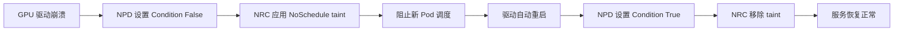

**实际场景: GPU 节点自动恢复**：

```bash
# 1. 故障检测 (NPD 检测到 GPU 驱动崩溃)
kubectl get node gpu-node-1 -o jsonpath='{.status.conditions[?(@.type=="GPUDriverHealthy")]}'
# Output: {"type":"GPUDriverHealthy","status":"False","reason":"DriverCrash"}

# 2. NRC 自动应用 taint (30秒内)
kubectl describe node gpu-node-1 | grep Taints
# Output: gpu-driver-unhealthy:NoSchedule

# 3. 驱动自动恢复 (DaemonSet watchdog)
kubectl logs -n kube-system nvidia-driver-watchdog-xxx
# Output: "Restarting nvidia-driver.service..."

# 4. NPD 检测到恢复
kubectl get node gpu-node-1 -o jsonpath='{.status.conditions[?(@.type=="GPUDriverHealthy")]}'
# Output: {"type":"GPUDriverHealthy","status":"True","reason":"DriverHealthy"}

# 5. NRC 自动移除 taint
kubectl describe node gpu-node-1 | grep Taints
# Output: <none>
```

**核心: 无需手动干预的完全自动恢复**。

**Chaos Engineering 集成**：

NRC 与 Chaos Engineering 结合，可以**预先验证故障响应能力**。

```yaml
# AWS FIS Experiment: 节点故障模拟
apiVersion: fis.aws.amazon.com/v1
kind: ExperimentTemplate
metadata:
  name: nrc-response-test
spec:
  description: "测量 NRC 的自动 taint 响应速度"
  actions:
    - name: inject-node-condition-failure
      actionId: aws:eks:inject-node-condition
      parameters:
        nodeSelector: gpu=true
        conditionType: GPUDriverHealthy
        conditionStatus: "False"
        duration: PT5M
  stopConditions:
    - source: aws:cloudwatch:alarm
      value: arn:aws:cloudwatch:...:alarm/pod-eviction-rate-high
  targets:
    - resourceType: aws:eks:node
      selectionMode: COUNT(1)
      resourceTags:
        gpu: "true"
```

**NRC dry-run 模式预先评估影响范围**：

```yaml
apiVersion: nrc.k8s.io/v1alpha1
kind: NodeReadinessRule
metadata:
  name: memory-pressure-dryrun
spec:
  mode: DryRun  # 不实际应用 taint，仅记录日志
  conditions:
    - type: MemoryPressure
      status: "True"
  action:
    taint:
      key: memory-pressure
      effect: NoExecute  # 模拟强制 Pod 终止
```

```bash
# DryRun 模式结果分析
kubectl logs -n kube-system node-readiness-controller | grep "DryRun"
# Output:
# [DryRun] Would apply taint to node-1: memory-pressure:NoExecute
# [DryRun] 15 pods would be evicted: [payment-service-xxx, order-service-yyy, ...]
# [DryRun] Estimated MTTR: 45 seconds
```

**AI 学习历史 NRC 事件模式 → 改进故障预测模型**：

```python
# CloudWatch Logs Insights: NRC taint 模式分析
query = """
fields @timestamp, node_name, condition_type, taint_key, pods_affected
| filter action = "taint_applied"
| stats count() by condition_type, bin(1h)
"""

# AI 学习数据集生成
import pandas as pd

nrc_events = cloudwatch_logs.query(query)
df = pd.DataFrame(nrc_events)

# 故障预测模型输入特征
features = [
    'condition_type',           # GPUDriverHealthy, MemoryPressure, DiskPressure
    'taint_frequency_1h',       # 过去1小时 taint 频率
    'node_age_days',            # 节点创建后经过的天数
    'pods_affected_avg',        # 平均受影响的 Pod 数量
]

# 基于 Prophet 的故障预测
model = Prophet()
model.fit(df[['timestamp', 'taint_frequency_1h']].rename(columns={'timestamp': 'ds', 'taint_frequency_1h': 'y'}))
forecast = model.predict(future)

# 预测结果 → 预先更新 Node Condition
if forecast['yhat'].iloc[-1] > threshold:
    k8s.patch_node_condition(
        node_name='gpu-node-1',
        condition_type='GPUDriverHealthy',
        status='False',
        reason='PredictedFailure'
    )
    # NRC 自动应用 proactive taint
```

**Karpenter + NRC 自主节点管理**：

结合 NRC 和 Karpenter，可以实现**完全自主的节点生命周期管理**。

```yaml
apiVersion: karpenter.sh/v1
kind: NodePool
metadata:
  name: gpu-pool
spec:
  disruption:
    consolidationPolicy: WhenEmpty
    budgets:
      - nodes: "1"
        schedule: "* * * * *"  # 每分钟检查
  template:
    metadata:
      labels:
        workload-type: gpu-inference
    spec:
      nodeClassRef:
        name: gpu-class
      requirements:
        - key: karpenter.sh/capacity-type
          operator: In
          values: ["spot", "on-demand"]
        - key: node.kubernetes.io/instance-type
          operator: In
          values: ["g5.xlarge", "g5.2xlarge"]
      taints:
        - key: gpu-not-ready
          effect: NoSchedule
          # NRC 在 GPU 准备完成后移除
```

**自主节点替换序列**：

```
1. NRC 对 gpu-node-1 应用 taint (GPU 驱动故障)
2. Karpenter 自动预配置替代节点 (gpu-node-2)
3. 对 gpu-node-2 应用 NRC bootstrap 规则
   → GPU 驱动初始化完成前 gpu-not-ready:NoSchedule
4. NPD 确认 GPU 准备完成 → Condition True
5. NRC 移除 gpu-not-ready taint
6. Scheduler 将工作负载迁移到 gpu-node-2
7. gpu-node-1 所有 Pod 终止后 Karpenter 删除节点
```

**全过程自动: 检测 → 隔离 → 替代 → 恢复 → 清理**

:::tip NRC + AI 的核心价值
Node Readiness Controller 提供了**响应式自动化**，但与 AI 结合后进化为**预测式自动化**。AI 学习历史 NRC 事件模式来预测故障，NRC 预先应用 taint，在**故障发生前疏散工作负载**。与 Karpenter 集成，可以完全自主化整个节点生命周期。
:::

**参考**: [Introducing Node Readiness Controller](https://kubernetes.io/blog/2026/02/03/introducing-node-readiness-controller/)

---

## 6. Kiro 程序化调试

### 6.1 指令式 vs 程序化响应对比

```
[指令式响应] — 手动、重复、成本高
━━━━━━━━━━━━━━━━━━━━━━━━━━━━━━━━━━━━━━━━━━
  运维人员: "payment-service 出现 500 错误"
  AI:       "在哪个 Pod 上发生的？"
  运维人员: "payment-xxx Pod"
  AI:       "请给我看日志"
  运维人员: (执行 kubectl logs 后复制粘贴)
  AI:       "看起来是 DB 连接错误，请检查 RDS 状态"
  运维人员: (在 AWS 控制台检查 RDS)
  ...重复...

  总耗时: 15-30分钟，大量手动操作

[程序化响应] — 自动、系统化、成本高效
━━━━━━━━━━━━━━━━━━━━━━━━━━━━━━━━━━━━━━━━━━
  告警: "payment-service 出现 500 错误"

  Kiro Spec:
    1. 通过 EKS MCP 查询 Pod 状态
    2. 收集并分析错误日志
    3. 检查相关 AWS 服务 (RDS, SQS) 状态
    4. 诊断根本原因
    5. 自动生成修复代码
    6. 创建 PR 并验证

  总耗时: 2-5分钟，自动化
```

### 6.2 Kiro + MCP 调试工作流

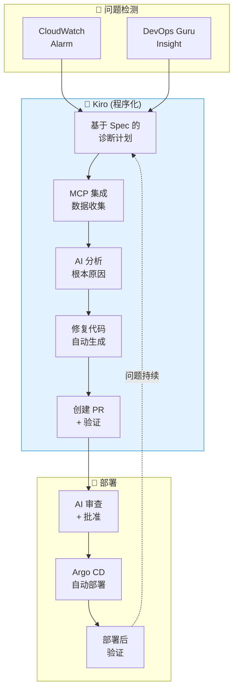

### 6.3 具体场景: OOMKilled 自动响应

```
[Kiro 程序化调试: OOMKilled]

1. 检测: payment-service Pod OOMKilled 事件

2. Kiro Spec 执行:
   → EKS MCP: get_events(namespace="payment", reason="OOMKilled")
   → EKS MCP: get_pod_logs(pod="payment-xxx", previous=true)
   → CloudWatch MCP: query_metrics("pod_memory_utilization", last="1h")

3. AI 分析:
   "payment-service 的内存使用量在启动后每2小时增加 256Mi，
    检测到内存泄漏模式。
    日志中确认 Redis 连接未正确关闭。"

4. 自动修复:
   - memory limits 256Mi → 512Mi (临时措施)
   - Redis 连接池清理代码补丁生成
   - 添加内存分析配置

5. PR 创建:
   Title: "fix: payment-service Redis connection leak"
   - deployment.yaml: memory limits 调整
   - redis_client.go: 添加 defer conn.Close()
   - monitoring: 添加内存使用量仪表板
```

:::tip 程序化调试的核心
通过 Kiro + EKS MCP **以程序化方式分析和解决**问题。相比指令式的手动响应，可以实现**成本高效且快速的自动化**，当相同问题重复出现时可以复用已学习的 Spec。
:::

---

## 7. AI Right-Sizing

### 7.1 基于 Container Insights 的推荐

CloudWatch Container Insights 分析 Pod 的实际资源使用模式，推荐适当的大小。

```promql
# 实际 CPU 使用量 vs requests 对比
avg(rate(container_cpu_usage_seconds_total{namespace="payment"}[1h]))
  by (pod)
/ avg(kube_pod_container_resource_requests{resource="cpu", namespace="payment"})
  by (pod)
* 100

# 实际 Memory 使用量 vs requests 对比
avg(container_memory_working_set_bytes{namespace="payment"})
  by (pod)
/ avg(kube_pod_container_resource_requests{resource="memory", namespace="payment"})
  by (pod)
* 100
```

### 7.2 VPA + ML 自动 Right-Sizing

```yaml
# VPA (Vertical Pod Autoscaler) 配置
apiVersion: autoscaling.k8s.io/v1
kind: VerticalPodAutoscaler
metadata:
  name: payment-service-vpa
  namespace: payment
spec:
  targetRef:
    apiVersion: apps/v1
    kind: Deployment
    name: payment-service
  updatePolicy:
    updateMode: "Auto"  # Off, Initial, Auto
  resourcePolicy:
    containerPolicies:
      - containerName: app
        minAllowed:
          cpu: 100m
          memory: 128Mi
        maxAllowed:
          cpu: "2"
          memory: 4Gi
        controlledResources: ["cpu", "memory"]
```

### 7.3 Right-Sizing 效果

<RightSizingResults />

:::tip K8s 1.35: In-Place Pod Resource Updates
从 K8s 1.35（2026.01，EKS 支持）起，引入了 **In-Place Pod Resource Updates** 功能，可以在不重启 Pod 的情况下动态调整 CPU 和内存。这解决了 VPA 最大的限制——"资源变更时 Pod 重启"的问题。即使是 StatefulSet 或对重启敏感的工作负载，也可以安全地进行垂直扩缩容。
:::

:::warning VPA 注意事项 (K8s 1.34 及以下)
在 K8s 1.34 及以下版本中，VPA `Auto` 模式通过重启 Pod 来调整资源。对于 StatefulSet 或对重启敏感的工作负载，建议使用 `Off` 模式仅查看推荐值，手动应用更安全。同时使用相同指标(CPU/Memory)的 VPA 和 HPA 可能会产生冲突。
:::

### 7.4 In-Place Pod Vertical Scaling (K8s 1.33+)

从 Kubernetes 1.33 起，**In-Place Pod Vertical Scaling** 进入 Beta 阶段，VPA 最大的缺点——**Pod 重启问题**得以解决。现在可以在不重启的情况下动态调整运行中 Pod 的 CPU 和内存。

#### In-Place Pod Resize 概述

现有 VPA 的问题：
- Pod 资源变更时**必须重启**
- 在 StatefulSet、数据库、缓存等**需要保持状态的工作负载**中难以使用
- 重启期间可能导致服务中断
- 与 PDB（Pod Disruption Budget）冲突

In-Place Resize 的解决方案：
- **动态调整运行中 Pod 的资源**
- 实时变更 cgroup 限制
- 无需重启即可增减资源
- **保持 QoS Class 时**无需重启

#### Kubernetes 版本状态

| Kubernetes 版本 | 状态 | Feature Gate | 备注 |
|----------------|------|--------------|------|
| 1.27 | Alpha | `InPlacePodVerticalScaling` | 实验性功能 |
| 1.33 | Beta | 默认启用 | 推荐生产测试 |
| 1.35+ (预计) | Stable | 默认启用 | 生产安全使用 |

**EKS 支持状态**：
- **EKS 1.33**（2026年4月预计）：可启用 Beta 功能
- **EKS 1.35**（2026年11月预计）：支持 Stable 版本

EKS 中启用 Feature Gate 的方法 (1.33 Beta)：
```bash
# EKS 集群创建时启用 Feature Gate (计划中)
aws eks create-cluster \
  --name my-cluster \
  --kubernetes-version 1.33 \
  --kubernetes-network-config '{"serviceIpv4Cidr":"10.100.0.0/16"}' \
  --role-arn arn:aws:iam::ACCOUNT_ID:role/EKSClusterRole \
  --resources-vpc-config subnetIds=subnet-xxx,subnet-yyy \
  --feature-gates InPlacePodVerticalScaling=true
```

:::info EKS Feature Gate 支持
EKS 在 Kubernetes 版本 GA 后一段时间才支持 Feature Gate。1.33 Beta 功能可能不会与 EKS 1.33 同时启用，请查看 AWS 官方文档。
:::

#### 工作原理

In-Place Resize 通过 **`resize` subresource** 变更运行中 Pod 的资源：

```yaml
# Pod 的 resize 状态确认
apiVersion: v1
kind: Pod
metadata:
  name: payment-service-abc123
spec:
  containers:
    - name: app
      resources:
        requests:
          cpu: "1"
          memory: 2Gi
        limits:
          cpu: "2"
          memory: 4Gi
status:
  resize: InProgress  # Proposed, InProgress, Deferred, Infeasible
  containerStatuses:
    - name: app
      allocatedResources:
        cpu: "1"
        memory: 2Gi
      resources:
        requests:
          cpu: "1.5"  # 新的请求值
          memory: 3Gi
```

**Resize 状态转换**：

```
Proposed (已提议)
  ↓
InProgress (进行中) — kubelet 变更 cgroup 限制
  ↓
[成功] Pod.spec.resources == Pod.status.allocatedResources
  或
[失败] Deferred (已延迟) — 资源不足，稍后重试
  或
[失败] Infeasible (不可行) — 需要变更 QoS Class，需要重启
```

#### VPA Auto 模式集成

当 In-Place Resize 可用时，VPA **自动在不重启的情况下调整资源**：

```yaml
apiVersion: autoscaling.k8s.io/v1
kind: VerticalPodAutoscaler
metadata:
  name: payment-service-vpa
spec:
  targetRef:
    apiVersion: apps/v1
    kind: Deployment
    name: payment-service
  updatePolicy:
    updateMode: "Auto"  # 支持 In-Place Resize 时无需重启即可调整
  resourcePolicy:
    containerPolicies:
      - containerName: app
        minAllowed:
          cpu: 100m
          memory: 128Mi
        maxAllowed:
          cpu: "4"
          memory: 8Gi
        controlledResources: ["cpu", "memory"]
        mode: Auto  # 自动应用 In-Place Resize
```

**VPA 动作流程**：

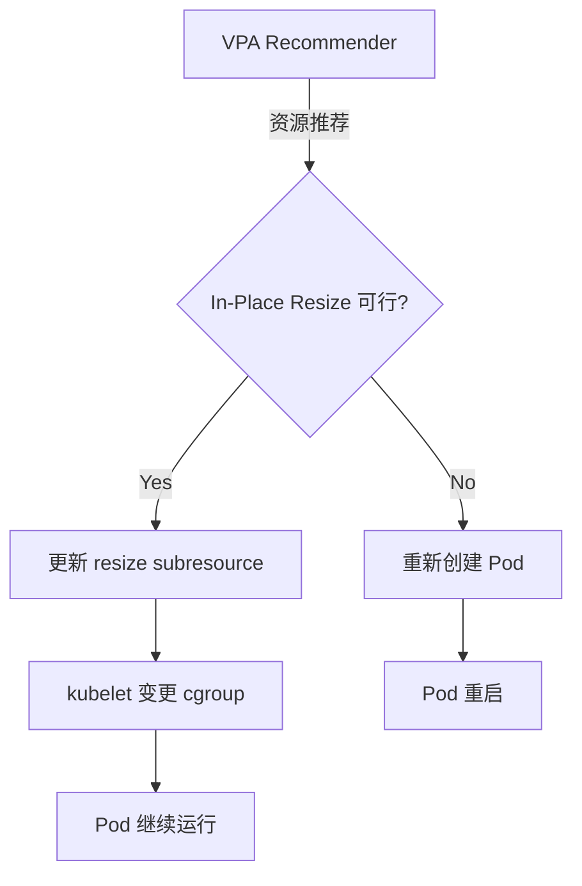

#### 约束条件

1. **CPU 可自由 resize**
   - CPU shares、CPU quota 可动态变更
   - cgroup CPU 控制器支持实时变更

2. **Memory 只能增加，不能减少**
   - 由于 Linux cgroup v1/v2 限制，内存 limit **减少时需要重启**
   - 内存增加是可以的（cgroup memory.limit_in_bytes 增加）
   - 内存减少转换为 Infeasible 状态 → 需要重新创建 Pod

```yaml
# Memory 增加: In-Place Resize 可行 ✅
resources:
  requests:
    memory: 2Gi → 4Gi  # OK，无需重启

# Memory 减少: In-Place Resize 不可行 ❌
resources:
  requests:
    memory: 4Gi → 2Gi  # Infeasible，需要重新创建 Pod
```

3. **QoS Class 变更时需要重启**

QoS Class 决定 Pod 的资源保障级别，变更时需要重启：

| 原 QoS | 新 QoS | In-Place Resize 可行? |
|----------|------------|---------------------|
| Guaranteed | Guaranteed | ✅ 可行 (保持 requests == limits) |
| Burstable | Burstable | ✅ 可行 |
| BestEffort | BestEffort | ✅ 可行 |
| Guaranteed | Burstable | ❌ 不可行 (需要重启) |
| Burstable | Guaranteed | ❌ 不可行 (需要重启) |

```yaml
# QoS Class 保持: In-Place Resize 可行 ✅
# Guaranteed → Guaranteed
resources:
  requests:
    cpu: "1"
    memory: 2Gi
  limits:
    cpu: "1"    # 保持 requests == limits
    memory: 2Gi
# → (变更后)
resources:
  requests:
    cpu: "2"
    memory: 4Gi
  limits:
    cpu: "2"    # 保持 requests == limits
    memory: 4Gi

# QoS Class 变更: In-Place Resize 不可行 ❌
# Guaranteed → Burstable
resources:
  requests:
    cpu: "1"
    memory: 2Gi
  limits:
    cpu: "1"
    memory: 2Gi
# → (变更后)
resources:
  requests:
    cpu: "1"
    memory: 2Gi
  limits:
    cpu: "2"    # requests != limits → QoS 变更
    memory: 4Gi
# → Infeasible，需要重新创建 Pod
```

#### StatefulSet 的安全垂直扩缩容模式

StatefulSet 需要保持状态，因此必须应用基于 In-Place Resize 的安全模式：

**模式 1: 保持 Guaranteed QoS**

```yaml
apiVersion: apps/v1
kind: StatefulSet
metadata:
  name: postgres
spec:
  replicas: 3
  template:
    spec:
      containers:
        - name: postgres
          image: postgres:15
          resources:
            requests:
              cpu: "2"
              memory: 4Gi
            limits:
              cpu: "2"    # requests == limits (Guaranteed QoS)
              memory: 4Gi
---
apiVersion: autoscaling.k8s.io/v1
kind: VerticalPodAutoscaler
metadata:
  name: postgres-vpa
spec:
  targetRef:
    apiVersion: apps/v1
    kind: StatefulSet
    name: postgres
  updatePolicy:
    updateMode: "Auto"
  resourcePolicy:
    containerPolicies:
      - containerName: postgres
        minAllowed:
          cpu: "1"
          memory: 2Gi
        maxAllowed:
          cpu: "4"
          memory: 8Gi
        controlledResources: ["cpu", "memory"]
        controlledValues: RequestsAndLimits  # 同时调整 requests 和 limits
```

**模式 2: 渐进式内存增加 (防止减少)**

```python
# 监控 VPA 推荐值防止内存减少
import boto3
from kubernetes import client, config

def safe_vpa_update(namespace, statefulset_name):
    """
    检查 VPA 推荐值，如果需要减少内存则仅发送告警，
    如果需要增加内存则执行 In-Place Resize
    """
    config.load_kube_config()
    v1 = client.CoreV1Api()

    # 查询当前 Pod 的内存使用量
    pods = v1.list_namespaced_pod(
        namespace=namespace,
        label_selector=f"app={statefulset_name}"
    )

    for pod in pods.items:
        current_memory = pod.spec.containers[0].resources.requests['memory']
        vpa_recommendation = get_vpa_recommendation(namespace, statefulset_name)

        if vpa_recommendation['memory'] < current_memory:
            # 内存减少仅发送告警
            send_alert(
                f"[WARNING] {pod.metadata.name}: VPA recommends memory decrease "
                f"({current_memory} → {vpa_recommendation['memory']}). "
                f"Manual Pod restart required for memory decrease."
            )
        elif vpa_recommendation['memory'] > current_memory:
            # 内存增加执行 In-Place Resize
            apply_in_place_resize(pod.metadata.name, vpa_recommendation)
```

**模式 3: 滚动更新与 In-Place Resize 组合**

```yaml
# StatefulSet 更新策略: 滚动更新 + In-Place Resize
apiVersion: apps/v1
kind: StatefulSet
metadata:
  name: cassandra
spec:
  replicas: 5
  updateStrategy:
    type: RollingUpdate
    rollingUpdate:
      partition: 0  # 所有 Pod 作为更新目标
  podManagementPolicy: OrderedReady
  template:
    spec:
      containers:
        - name: cassandra
          resources:
            requests:
              cpu: "4"
              memory: 8Gi
            limits:
              cpu: "4"
              memory: 8Gi
```

**更新场景**：

1. **CPU 增加**: 通过 In-Place Resize 立即应用 (无需重启)
2. **Memory 增加**: 通过 In-Place Resize 立即应用 (无需重启)
3. **Memory 减少**: 通过滚动更新逐一重启 Pod (保持 Quorum)

```bash
# 内存减少时安全滚动重启
kubectl rollout restart statefulset/cassandra -n database

# 监控滚动重启状态
kubectl rollout status statefulset/cassandra -n database

# 确认逐个 Pod 重启 (保持 Quorum)
# cassandra-4 → cassandra-3 → cassandra-2 → cassandra-1 → cassandra-0
```

#### 实战示例: Redis 集群内存增加

```yaml
# Redis StatefulSet
apiVersion: apps/v1
kind: StatefulSet
metadata:
  name: redis-cluster
  namespace: cache
spec:
  replicas: 6
  serviceName: redis-cluster
  template:
    spec:
      containers:
        - name: redis
          image: redis:7
          resources:
            requests:
              cpu: "1"
              memory: 4Gi
            limits:
              cpu: "1"
              memory: 4Gi
---
# VPA 自动内存增加
apiVersion: autoscaling.k8s.io/v1
kind: VerticalPodAutoscaler
metadata:
  name: redis-cluster-vpa
  namespace: cache
spec:
  targetRef:
    apiVersion: apps/v1
    kind: StatefulSet
    name: redis-cluster
  updatePolicy:
    updateMode: "Auto"
  resourcePolicy:
    containerPolicies:
      - containerName: redis
        minAllowed:
          memory: 4Gi
        maxAllowed:
          memory: 16Gi
        controlledResources: ["memory"]
        controlledValues: RequestsAndLimits
```

**In-Place Resize 执行结果**：

```bash
# 1. VPA 检测到内存增加需求
$ kubectl describe vpa redis-cluster-vpa -n cache
Recommendation:
  Container Recommendations:
    Container Name:  redis
    Target:
      Memory:  8Gi  # 推荐从 4Gi → 8Gi 增加

# 2. VPA 自动执行 In-Place Resize
$ kubectl get pod redis-cluster-0 -n cache -o yaml
status:
  resize: InProgress
  containerStatuses:
    - allocatedResources:
        memory: 4Gi
      resources:
        requests:
          memory: 8Gi  # 新的请求值

# 3. Kubelet 完成 cgroup 变更
$ kubectl get pod redis-cluster-0 -n cache -o yaml
status:
  resize: ""  # 完成后清空
  containerStatuses:
    - allocatedResources:
        memory: 8Gi  # 新资源分配完成

# 4. 确认无需重启即完成内存增加
$ kubectl exec redis-cluster-0 -n cache -- redis-cli INFO memory
used_memory:8589934592  # 8GB
maxmemory:8589934592

# 5. 确认 Pod 正常运行时间 (无重启)
$ kubectl get pod redis-cluster-0 -n cache
NAME              READY   STATUS    RESTARTS   AGE
redis-cluster-0   1/1     Running   0          15d  # 15天无重启
```

:::warning In-Place Pod Vertical Scaling 仍处于 Beta 阶段
In-Place Pod Vertical Scaling 在 Kubernetes 1.33 进入 Beta 阶段。生产环境建议在 **Kubernetes 1.35+ Stable 后引入**。Beta 期间 API 可能发生变更，EKS 可能在 Kubernetes GA 后一段时间才支持。

**建议**：
- **K8s 1.33-1.34**: 在开发/预发布环境中测试
- **K8s 1.35+**: 考虑在生产环境引入
- **EKS 用户**: 在 AWS 官方文档中确认 Feature Gate 支持时间
:::

:::tip In-Place Resize 的核心价值
VPA 最大的缺点——**Pod 重启问题**得以解决，StatefulSet、数据库、缓存、ML 推理服务等**需要保持状态的工作负载**也可以安全地应用垂直扩缩容。特别是内存增加可以无需重启立即生效，因此在流量突增时可以快速响应。
:::

---

## 8. 反馈循环

### 8.1 预测精度测量

```python
# 预测精度测量及模型重训练
import numpy as np

def calculate_accuracy(predicted, actual):
    """MAPE (Mean Absolute Percentage Error) 计算"""
    mape = np.mean(np.abs((actual - predicted) / actual)) * 100
    return {
        'mape': mape,
        'accuracy': 100 - mape,
        'over_prediction_rate': np.mean(predicted > actual) * 100,
        'under_prediction_rate': np.mean(predicted < actual) * 100
    }

def should_retrain(accuracy_history, threshold=85):
    """判断是否需要重训练"""
    recent_accuracy = np.mean(accuracy_history[-10:])
    if recent_accuracy < threshold:
        return True, f"近期精度 {recent_accuracy:.1f}% < 阈值 {threshold}%"
    return False, f"精度良好: {recent_accuracy:.1f}%"
```

### 8.2 自动重训练流水线

```yaml
# 预测模型自动重训练 CronJob
apiVersion: batch/v1
kind: CronJob
metadata:
  name: model-retrainer
  namespace: scaling
spec:
  schedule: "0 2 * * 0"  # 每周日 02:00
  jobTemplate:
    spec:
      template:
        spec:
          containers:
            - name: retrainer
              image: my-registry/model-retrainer:latest
              env:
                - name: AMP_WORKSPACE_ID
                  value: "ws-xxxxx"
                - name: TRAINING_WEEKS
                  value: "4"
                - name: ACCURACY_THRESHOLD
                  value: "85"
              resources:
                requests:
                  cpu: "2"
                  memory: 4Gi
          restartPolicy: OnFailure
```

### 8.3 A/B 扩缩容测试

```
[A/B 扩缩容]

组 A (50% 流量): 基于 HPA 的响应式扩缩容
组 B (50% 流量): 基于 ML 预测的先发制人扩缩容

比较指标:
  - P99 延迟差异
  - 扩缩容事件次数
  - 资源使用效率
  - 性价比
```

---

## 9. Chaos Engineering + AI

### 9.1 AWS Fault Injection Service (FIS)

```json
{
  "description": "EKS Pod 故障注入测试",
  "targets": {
    "eks-pods": {
      "resourceType": "aws:eks:pod",
      "selectionMode": "COUNT(2)",
      "resourceTags": {
        "app": "payment-service"
      },
      "parameters": {
        "clusterIdentifier": "my-cluster",
        "namespace": "payment"
      }
    }
  },
  "actions": {
    "terminate-pods": {
      "actionId": "aws:eks:terminate-pod",
      "parameters": {},
      "targets": {
        "Pods": "eks-pods"
      }
    }
  },
  "stopConditions": [
    {
      "source": "aws:cloudwatch:alarm",
      "value": "arn:aws:cloudwatch:ap-northeast-2:ACCOUNT_ID:alarm:PaymentServiceSLO"
    }
  ],
  "roleArn": "arn:aws:iam::ACCOUNT_ID:role/FISRole",
  "tags": {
    "Environment": "staging",
    "Team": "platform"
  }
}
```

### 9.2 基于 AI 的故障模式学习

Chaos Engineering 实验结果由 AI 学习，提升应对能力。

<ChaosExperiments />

```python
# FIS 实验后 AI 学习数据收集
from strands import Agent

chaos_analyzer = Agent(
    name="chaos-pattern-analyzer",
    model="bedrock/anthropic.claude-sonnet",
    sop="""
    ## Chaos Engineering 结果分析

    1. FIS 实验结果收集
       - 注入的故障类型
       - 系统响应时间
       - 恢复时间
       - 影响范围

    2. 模式分析
       - 故障传播路径映射
       - 薄弱点识别
       - 恢复瓶颈点定位

    3. 应对规则更新
       - 向现有 SOP 添加学习内容
       - 为新模式创建应对规则
       - 调整升级阈值

    4. 报告生成
       - 实验摘要
       - 发现的薄弱点
       - 建议改进事项
    """
)
```

:::tip Chaos Engineering + AI 反馈循环
通过 FIS 注入故障，AI 学习系统响应模式，AI Agent 的自动应对能力将持续提升。"故障注入 -> 观察 -> 学习 -> 应对改进"的反馈循环是自主运维的核心。
:::

### 9.4 AWS FIS 最新功能及生产安全保障

AWS Fault Injection Service(FIS) 在 2025-2026 年基准上提供了 **EKS 专用动作类型**和**自动中断机制**，使得在生产环境中也能安全地执行 Chaos Engineering。

#### FIS 最新 EKS 动作类型

FIS 提供了针对 EKS 工作负载的专用故障注入动作：

| 动作类型 | 说明 | 适用对象 | 使用场景 |
|----------|------|----------|----------|
| `aws:eks:pod-delete` | 删除特定 Pod | Pod | Pod 重启恢复力测试 |
| `aws:eks:pod-network-latency` | Pod 网络延迟注入 | Pod | 验证网络延迟时应用行为 |
| `aws:eks:pod-network-packet-loss` | Pod 网络丢包注入 | Pod | 不稳定网络环境模拟 |
| `aws:eks:node-drain` | 节点排空（安全 Pod 迁移） | Node | 节点维护场景测试 |
| `aws:eks:terminate-nodegroup-instances` | 终止节点组实例 | Node Group | 大规模节点故障恢复测试 |

**Pod 删除动作详情**：

```json
{
  "actionId": "aws:eks:pod-delete",
  "description": "通过 EKS Pod 删除测试重启恢复力",
  "targets": {
    "Pods": "eks-payment-pods"
  },
  "parameters": {
    "kubernetesServiceAccount": "fis-experiment-role",
    "maxPodsToDelete": "2",
    "podDeletionMode": "all-at-once"
  }
}
```

**网络延迟注入动作**：

```json
{
  "actionId": "aws:eks:pod-network-latency",
  "description": "Pod 网络延迟 200ms 注入",
  "targets": {
    "Pods": "eks-payment-pods"
  },
  "parameters": {
    "kubernetesServiceAccount": "fis-experiment-role",
    "duration": "PT5M",
    "delayMilliseconds": "200",
    "jitterMilliseconds": "50",
    "sources": "all",
    "destinations": "all"
  }
}
```

**丢包注入动作**：

```json
{
  "actionId": "aws:eks:pod-network-packet-loss",
  "description": "5% 丢包注入",
  "targets": {
    "Pods": "eks-payment-pods"
  },
  "parameters": {
    "kubernetesServiceAccount": "fis-experiment-role",
    "duration": "PT3M",
    "lossPercent": "5",
    "sources": "all",
    "destinations": "all"
  }
}
```

**节点排空动作**：

```json
{
  "actionId": "aws:eks:node-drain",
  "description": "节点安全排空（遵守 PDB）",
  "targets": {
    "Nodes": "eks-worker-nodes"
  },
  "parameters": {
    "kubernetesServiceAccount": "fis-experiment-role",
    "gracePeriodSeconds": "300",
    "skipWaitForDeleteTimeout": "false"
  }
}
```

#### 基于 stopConditions 的自动中断

FIS 的 **stopConditions** 功能在 SLO 违规时自动中断实验，保障生产环境安全性：

```json
{
  "description": "EKS Pod 故障注入 with SLO 保护",
  "stopConditions": [
    {
      "source": "aws:cloudwatch:alarm",
      "value": "arn:aws:cloudwatch:ap-northeast-2:ACCOUNT_ID:alarm:PaymentService-ErrorRate-SLO"
    },
    {
      "source": "aws:cloudwatch:alarm",
      "value": "arn:aws:cloudwatch:ap-northeast-2:ACCOUNT_ID:alarm:PaymentService-Latency-P99-SLO"
    },
    {
      "source": "aws:cloudwatch:alarm",
      "value": "arn:aws:cloudwatch:ap-northeast-2:ACCOUNT_ID:alarm:PaymentService-Availability-SLO"
    }
  ]
}
```

**CloudWatch Alarm 设置示例**：

```bash
# Error Rate SLO Alarm (错误率 > 5%)
aws cloudwatch put-metric-alarm \
  --alarm-name "PaymentService-ErrorRate-SLO" \
  --alarm-description "Stop FIS if error rate exceeds 5%" \
  --namespace "AWS/ApplicationELB" \
  --metric-name "HTTPCode_Target_5XX_Count" \
  --dimensions Name=LoadBalancer,Value=app/payment-lb/xxx \
  --statistic Sum \
  --period 60 \
  --evaluation-periods 2 \
  --threshold 50 \
  --comparison-operator GreaterThanThreshold \
  --treat-missing-data notBreaching

# Latency P99 SLO Alarm (P99 > 500ms)
aws cloudwatch put-metric-alarm \
  --alarm-name "PaymentService-Latency-P99-SLO" \
  --alarm-description "Stop FIS if P99 latency exceeds 500ms" \
  --namespace "ContainerInsights" \
  --metric-name "pod_http_request_duration_p99" \
  --dimensions Name=Service,Value=payment-service \
  --statistic Average \
  --period 60 \
  --evaluation-periods 3 \
  --threshold 500 \
  --comparison-operator GreaterThanThreshold

# Availability SLO Alarm (可用性 < 99.9%)
aws cloudwatch put-metric-alarm \
  --alarm-name "PaymentService-Availability-SLO" \
  --alarm-description "Stop FIS if availability drops below 99.9%" \
  --metric-name "AvailabilityRate" \
  --namespace "CustomMetrics" \
  --dimensions Name=Service,Value=payment-service \
  --statistic Average \
  --period 300 \
  --evaluation-periods 1 \
  --threshold 99.9 \
  --comparison-operator LessThanThreshold
```

#### 生产安全保障模式

**模式 1: PDB 集成 -- FIS 实验期间确保遵守 PDB**

```yaml
# Pod Disruption Budget 设置
apiVersion: policy/v1
kind: PodDisruptionBudget
metadata:
  name: payment-service-pdb
  namespace: payment
spec:
  minAvailable: 2  # 最少 2 个 Pod 始终保持 Running
  selector:
    matchLabels:
      app: payment-service
---
# FIS Experiment Template (自动遵守 PDB)
{
  "description": "Pod 删除实验（遵守 PDB）",
  "targets": {
    "eks-payment-pods": {
      "resourceType": "aws:eks:pod",
      "selectionMode": "COUNT(1)",
      "resourceTags": {
        "app": "payment-service"
      },
      "parameters": {
        "clusterIdentifier": "my-cluster",
        "namespace": "payment"
      }
    }
  },
  "actions": {
    "delete-pod-safely": {
      "actionId": "aws:eks:pod-delete",
      "parameters": {
        "kubernetesServiceAccount": "fis-experiment-role",
        "maxPodsToDelete": "1",
        "podDeletionMode": "one-at-a-time"
      },
      "targets": {
        "Pods": "eks-payment-pods"
      }
    }
  }
}
```

**FIS + PDB 动作流程**：

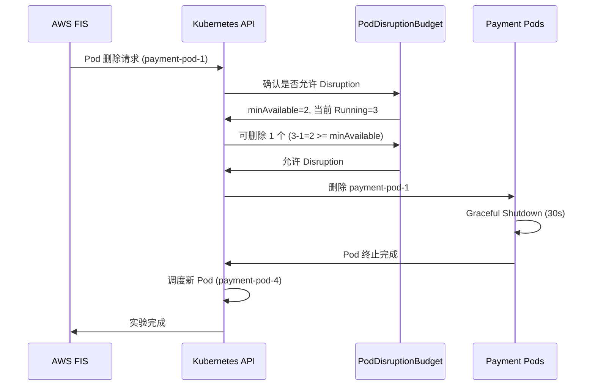

**PDB 违规场景**：

```bash
# 当前 Running Pods: 2 个（最小值）
$ kubectl get pods -n payment -l app=payment-service
NAME                READY   STATUS    RESTARTS   AGE
payment-pod-2       1/1     Running   0          5m
payment-pod-3       1/1     Running   0          5m

# FIS 尝试删除 Pod
$ aws fis start-experiment --experiment-template-id EXT123456

# Kubernetes 检查 PDB 并拒绝
# minAvailable=2, 当前=2 -> 删除 1 个后仅剩 1 个 -> PDB 违规
# -> FIS 实验失败（PDB 阻止 Disruption）

# FIS 实验日志
{
  "state": "failed",
  "reason": "PodDisruptionBudget prevents pod deletion. Current: 2, Required: 2"
}
```

**模式 2: 爆炸半径限制 -- 通过标签/命名空间限制实验范围**

```json
{
  "description": "限定范围的 Pod 故障实验",
  "targets": {
    "eks-test-pods": {
      "resourceType": "aws:eks:pod",
      "selectionMode": "PERCENT(25)",
      "resourceTags": {
        "environment": "staging",
        "chaos-experiment": "enabled",
        "team": "payments"
      },
      "filters": [
        {
          "path": "Namespace",
          "values": ["payment-staging"]
        },
        {
          "path": "Labels.version",
          "values": ["canary"]
        }
      ],
      "parameters": {
        "clusterIdentifier": "staging-cluster",
        "namespace": "payment-staging"
      }
    }
  }
}
```

**爆炸半径限制策略**：

| 限制方式 | 设置方法 | 示例 |
|----------|----------|------|
| **命名空间** | `filters.Namespace` | `payment-staging`（排除生产环境） |
| **标签选择** | `filters.Labels` | `version=canary`（仅金丝雀部署） |
| **基于标签** | `resourceTags` | `chaos-experiment=enabled`（显式加入） |
| **比例限制** | `selectionMode: PERCENT(N)` | `PERCENT(25)`（最多影响 25%） |
| **数量限制** | `selectionMode: COUNT(N)` | `COUNT(2)`（最多 2 个） |

**模式 3: 渐进式扩展 -- 1 个 Pod -> 10% Pod -> 25% Pod 分阶段扩展**

```json
{
  "description": "渐进式 Pod 删除实验",
  "actions": {
    "phase-1-single-pod": {
      "actionId": "aws:eks:pod-delete",
      "description": "Phase 1: 删除 1 个 Pod",
      "parameters": {
        "kubernetesServiceAccount": "fis-experiment-role",
        "maxPodsToDelete": "1"
      },
      "targets": {
        "Pods": "eks-payment-pods-phase1"
      }
    },
    "wait-1": {
      "actionId": "aws:fis:wait",
      "parameters": {
        "duration": "PT2M"
      },
      "startAfter": ["phase-1-single-pod"]
    },
    "phase-2-10-percent": {
      "actionId": "aws:eks:pod-delete",
      "description": "Phase 2: 删除 10% Pod",
      "parameters": {
        "kubernetesServiceAccount": "fis-experiment-role",
        "selectionMode": "PERCENT(10)"
      },
      "targets": {
        "Pods": "eks-payment-pods-phase2"
      },
      "startAfter": ["wait-1"]
    },
    "wait-2": {
      "actionId": "aws:fis:wait",
      "parameters": {
        "duration": "PT3M"
      },
      "startAfter": ["phase-2-10-percent"]
    },
    "phase-3-25-percent": {
      "actionId": "aws:eks:pod-delete",
      "description": "Phase 3: 删除 25% Pod",
      "parameters": {
        "kubernetesServiceAccount": "fis-experiment-role",
        "selectionMode": "PERCENT(25)"
      },
      "targets": {
        "Pods": "eks-payment-pods-phase3"
      },
      "startAfter": ["wait-2"]
    }
  },
  "stopConditions": [
    {
      "source": "aws:cloudwatch:alarm",
      "value": "arn:aws:cloudwatch:ap-northeast-2:ACCOUNT_ID:alarm:PaymentService-ErrorRate-SLO"
    }
  ]
}
```

**渐进式扩展流程**：

```
Phase 1: 删除 1 个 Pod
  ↓ (等待 2 分钟, SLO 监控)
Phase 2: 删除 10% Pod
  ↓ (等待 3 分钟, SLO 监控)
Phase 3: 删除 25% Pod
  ↓
[成功] 所有阶段通过 -> 系统恢复力验证完成
[失败] SLO 违规 -> 自动中断, 回滚
```

**模式 4: 回滚条件 -- latency P99 > 500ms 或 error rate > 5% 时自动中断**

```json
{
  "description": "网络延迟实验 with 自动回滚",
  "actions": {
    "inject-latency": {
      "actionId": "aws:eks:pod-network-latency",
      "description": "200ms 网络延迟注入",
      "parameters": {
        "kubernetesServiceAccount": "fis-experiment-role",
        "duration": "PT10M",
        "delayMilliseconds": "200",
        "jitterMilliseconds": "50"
      },
      "targets": {
        "Pods": "eks-payment-pods"
      }
    }
  },
  "stopConditions": [
    {
      "source": "aws:cloudwatch:alarm",
      "value": "arn:aws:cloudwatch:ap-northeast-2:ACCOUNT_ID:alarm:PaymentService-Latency-P99-SLO"
    },
    {
      "source": "aws:cloudwatch:alarm",
      "value": "arn:aws:cloudwatch:ap-northeast-2:ACCOUNT_ID:alarm:PaymentService-ErrorRate-SLO"
    }
  ],
  "roleArn": "arn:aws:iam::ACCOUNT_ID:role/FISExperimentRole",
  "tags": {
    "Environment": "production",
    "Team": "platform",
    "ChaosExperimentType": "network-latency"
  }
}
```

**自动回滚场景**：

```
[00:00] FIS 实验开始 -- 200ms 网络延迟注入
[00:00] CloudWatch Alarms 监控开始
  - Latency P99 SLO: 正常 (250ms < 500ms)
  - Error Rate SLO: 正常 (2% < 5%)
[00:03] Latency P99 升高检测: 450ms
[00:05] Latency P99 SLO 违规: 520ms > 500ms
[00:05] CloudWatch Alarm 触发: "PaymentService-Latency-P99-SLO"
[00:05] FIS 自动中断 (stopCondition 满足)
[00:05] 网络延迟移除（自动回滚）
[00:06] Latency P99 恢复: 280ms
[00:08] 系统恢复正常状态
```

#### FIS Experiment Template YAML 示例

```yaml
# FIS Experiment Template: EKS Pod 故障注入 + stopConditions
AWSTemplateFormatVersion: '2010-09-09'
Description: 'FIS Experiment Template for EKS Pod Fault Injection'

Resources:
  PaymentServiceFISExperiment:
    Type: AWS::FIS::ExperimentTemplate
    Properties:
      Description: 'EKS Pod 删除实验 with SLO 保护'
      StopConditions:
        - Source: 'aws:cloudwatch:alarm'
          Value: !GetAtt PaymentServiceErrorRateAlarm.Arn
        - Source: 'aws:cloudwatch:alarm'
          Value: !GetAtt PaymentServiceLatencyAlarm.Arn
      Targets:
        PaymentPods:
          ResourceType: 'aws:eks:pod'
          SelectionMode: 'COUNT(2)'
          ResourceTags:
            app: 'payment-service'
          Parameters:
            clusterIdentifier: !Ref EKSClusterName
            namespace: 'payment'
      Actions:
        DeletePods:
          ActionId: 'aws:eks:pod-delete'
          Parameters:
            kubernetesServiceAccount: !GetAtt FISServiceAccount.Name
            maxPodsToDelete: '2'
            podDeletionMode: 'one-at-a-time'
          Targets:
            Pods: 'PaymentPods'
      RoleArn: !GetAtt FISExperimentRole.Arn
      Tags:
        Environment: 'production'
        Team: 'platform'

  PaymentServiceErrorRateAlarm:
    Type: AWS::CloudWatch::Alarm
    Properties:
      AlarmName: 'PaymentService-ErrorRate-SLO'
      AlarmDescription: 'Stop FIS if error rate exceeds 5%'
      MetricName: 'HTTPCode_Target_5XX_Count'
      Namespace: 'AWS/ApplicationELB'
      Statistic: Sum
      Period: 60
      EvaluationPeriods: 2
      Threshold: 50
      ComparisonOperator: GreaterThanThreshold
      TreatMissingData: notBreaching

  PaymentServiceLatencyAlarm:
    Type: AWS::CloudWatch::Alarm
    Properties:
      AlarmName: 'PaymentService-Latency-P99-SLO'
      AlarmDescription: 'Stop FIS if P99 latency exceeds 500ms'
      MetricName: 'pod_http_request_duration_p99'
      Namespace: 'ContainerInsights'
      Statistic: Average
      Period: 60
      EvaluationPeriods: 3
      Threshold: 500
      ComparisonOperator: GreaterThanThreshold

  FISExperimentRole:
    Type: AWS::IAM::Role
    Properties:
      AssumeRolePolicyDocument:
        Version: '2012-10-17'
        Statement:
          - Effect: Allow
            Principal:
              Service: fis.amazonaws.com
            Action: 'sts:AssumeRole'
      ManagedPolicyArns:
        - 'arn:aws:iam::aws:policy/AWSFaultInjectionSimulatorEKSAccess'
      Policies:
        - PolicyName: FISCloudWatchAccess
          PolicyDocument:
            Version: '2012-10-17'
            Statement:
              - Effect: Allow
                Action:
                  - 'cloudwatch:DescribeAlarms'
                  - 'cloudwatch:GetMetricData'
                Resource: '*'

  FISServiceAccount:
    Type: AWS::EKS::ServiceAccount
    Properties:
      ClusterName: !Ref EKSClusterName
      Name: 'fis-experiment-role'
      Namespace: 'kube-system'
      RoleArn: !GetAtt FISExperimentRole.Arn

Parameters:
  EKSClusterName:
    Type: String
    Description: 'Name of the EKS cluster'
    Default: 'my-cluster'

Outputs:
  ExperimentTemplateId:
    Description: 'FIS Experiment Template ID'
    Value: !GetAtt PaymentServiceFISExperiment.Id
    Export:
      Name: !Sub '${AWS::StackName}-ExperimentTemplateId'
```

:::tip FIS 生产安全保障的核心
AWS FIS 的 **stopConditions** 和 **PDB 集成**是在生产环境中安全执行 Chaos Engineering 的核心功能。结合 SLO 违规时自动中断、渐进式扩展、爆炸半径限制，可以在**不影响用户**的情况下验证系统恢复力。

**建议**：
1. **始终设置 stopConditions**: 与 CloudWatch Alarm 联动，SLO 违规时自动中断
2. **必须设置 PDB**: 所有生产工作负载应用 PDB
3. **渐进式扩展**: 1 个 -> 10% -> 25% 分阶段扩展以确保安全性
4. **非生产环境优先**: 在预发布环境充分测试后再应用到生产环境
:::

### 9.5 基于 AI 的高级 Chaos Engineering

利用 AI 可以使 Chaos Engineering 从**手动实验设计 -> 智能自动设计**进化。通过学习过去的故障模式、自动定义 Steady State Hypothesis、GameDay 自动化，可以系统性地提升系统恢复力。

#### 9.5.1 学习过去故障模式 -> 自动建议新的混沌场景

AI 学习过去的事件数据，自动建议实际发生可能性较高的混沌场景。

```python
# 基于 AI 的混沌场景生成器
from strands import Agent
import boto3

fis_client = boto3.client('fis', region_name='ap-northeast-2')
cloudwatch_client = boto3.client('cloudwatch', region_name='ap-northeast-2')

chaos_designer = Agent(
    name="chaos-scenario-designer",
    model="bedrock/anthropic.claude-sonnet",
    sop="""
    ## 基于 AI 的混沌场景自动设计

    ### Phase 1: 过去事件分析（学习）
    1. 通过 CloudWatch Logs Insights 收集过去 6 个月事件
       - 按故障类型分析频率
       - 分析影响范围和恢复时间
       - 按根本原因分类（网络/资源/部署）

    2. 提取事件模式
       - 识别重复发生模式
       - 分析季节性/时间段模式
       - 基于依赖的连锁故障模式

    ### Phase 2: 自动生成混沌场景
    1. 按故障模式自动生成 FIS 实验模板
       - Pod OOMKilled 模式 -> 内存压力实验
       - 网络超时模式 -> 延迟注入实验
       - 节点故障模式 -> 节点终止实验

    2. 自动定义 Steady State Hypothesis
       - 基于过去 SLO 数据定义正常状态
       - 基于 CloudWatch Alarm 自动生成中断条件

    3. 建议实验优先级
       - 基于频率 x 影响度计算优先级
       - 优先建议未验证的故障场景

    ### Phase 3: 自动执行实验和分析
    1. 自动执行 FIS 实验（调度）
    2. 观察系统响应并收集指标
    3. 对比分析预期与实际结果
    4. 识别恢复力不足的领域并建议改进
    """
)
```

**实战示例: 基于过去事件的混沌场景自动生成**

```python
# Step 1: 收集过去事件数据
import json
from datetime import datetime, timedelta

def analyze_past_incidents():
    """通过 CloudWatch Logs Insights 分析过去事件"""
    logs_client = boto3.client('logs', region_name='ap-northeast-2')

    query = """
    fields @timestamp, detail.alarmName, detail.state.value, detail.state.reason
    | filter detail-type = "CloudWatch Alarm State Change"
    | filter detail.state.value = "ALARM"
    | stats count(*) as incident_count by detail.state.reason as failure_pattern
    | sort incident_count desc
    """

    start_time = int((datetime.now() - timedelta(days=180)).timestamp())
    end_time = int(datetime.now().timestamp())

    response = logs_client.start_query(
        logGroupName='/aws/events/cloudwatch-alarms',
        startTime=start_time,
        endTime=end_time,
        queryString=query
    )

    query_id = response['queryId']

    # 等待查询结果并返回
    import time
    while True:
        result = logs_client.get_query_results(queryId=query_id)
        if result['status'] == 'Complete':
            return result['results']
        time.sleep(2)

# Step 2: AI 基于事件模式建议混沌场景
incident_patterns = analyze_past_incidents()

scenario_prompt = f"""
过去 6 个月发生的事件模式:
{json.dumps(incident_patterns, indent=2)}

请基于这些模式执行以下操作:
1. 识别最频繁的故障模式 Top 5
2. 为每个模式创建 AWS FIS 实验模板
3. 定义 Steady State Hypothesis（基于 SLO）
4. 建议实验优先级（频率 x 影响度）
"""

response = chaos_designer.run(scenario_prompt)

# Step 3: 自动生成 AI 建议的 FIS 实验模板
# 示例输出:
"""
[AI 分析结果]

Top 5 故障模式:
1. Pod OOMKilled (37 次) -- 内存不足
2. Network Timeout (24 次) -- 外部 API 延迟
3. Node NotReady (18 次) -- 节点故障
4. Deployment Failed (12 次) -- 镜像 Pull 失败
5. RDS Connection Timeout (9 次) -- 数据库连接失败

建议的混沌场景:

[场景 1: 内存压力实验]
目的: 验证 Pod OOMKilled 应对能力
FIS 动作: aws:eks:inject-pod-memory-stress
目标: payment-service（过去发生 OOMKilled 37 次）
Steady State: memory_utilization < 85%, pod_restart_count < 5
优先级: 高（频率 37 x 影响度 9 = 333）

[场景 2: 网络延迟实验]
目的: 验证外部 API 延迟时的超时处理
FIS 动作: aws:eks:pod-network-latency
目标: order-service（调用外部 payment API）
Steady State: p99_latency < 500ms, error_rate < 1%
优先级: 中（频率 24 x 影响度 7 = 168）

[场景 3: 节点终止实验]
目的: 验证节点故障时 Pod 重新调度
FIS 动作: aws:eks:terminate-nodegroup-instances
目标: worker-node-group（终止 25%）
Steady State: available_pods >= minAvailable (PDB), scheduling_time < 60s
优先级: 高（频率 18 x 影响度 10 = 180）
"""
```

#### 9.5.2 AI 自动定义 Steady State Hypothesis

Chaos Engineering 的核心 **Steady State Hypothesis**（正常状态假设）由 AI 基于过去的指标数据自动定义。

```python
# Steady State Hypothesis 自动生成
steady_state_agent = Agent(
    name="steady-state-generator",
    model="bedrock/anthropic.claude-sonnet",
    sop="""
    ## Steady State Hypothesis 自动定义

    ### 输入数据
    1. 过去 30 天 CloudWatch 指标（正常状态期间）
       - RPS (Requests Per Second)
       - Error Rate
       - P50/P95/P99 Latency
       - CPU/Memory Utilization
       - Pod Restart Count

    2. 当前 SLO 设置
       - Availability SLO: 99.9%
       - Latency SLO: P99 < 500ms
       - Error Budget: 0.1%

    ### 正常状态定义逻辑
    1. 计算每个指标的正常范围
       - Baseline: 过去 30 天平均值
       - Acceptable Range: 平均值 +/- 2 sigma（标准差）
       - Alert Threshold: 平均值 + 3 sigma

    2. 基于 SLO 的上限设置
       - Error Rate: max(SLO threshold, 平均值 + 2 sigma)
       - Latency: min(SLO threshold, 平均值 + 2 sigma)

    3. 转换为 CloudWatch Alarm
       - Steady State 违规时自动中断 FIS 实验

    ### 输出
    - Steady State Hypothesis YAML
    - CloudWatch Alarm 定义（FIS stopConditions）
    """
)
```

**实战示例: Steady State 自动生成**

```python
def generate_steady_state_hypothesis(service_name: str, lookback_days: int = 30):
    """基于 AI 的 Steady State Hypothesis 自动生成"""

    # Step 1: 收集过去指标
    end_time = datetime.now()
    start_time = end_time - timedelta(days=lookback_days)

    metrics = {
        'error_rate': cloudwatch_client.get_metric_statistics(
            Namespace='AWS/ApplicationELB',
            MetricName='HTTPCode_Target_5XX_Count',
            Dimensions=[{'Name': 'LoadBalancer', 'Value': f'app/{service_name}-lb'}],
            StartTime=start_time,
            EndTime=end_time,
            Period=300,
            Statistics=['Average', 'Maximum']
        ),
        'latency_p99': cloudwatch_client.get_metric_statistics(
            Namespace='ContainerInsights',
            MetricName='pod_http_request_duration_p99',
            Dimensions=[{'Name': 'Service', 'Value': service_name}],
            StartTime=start_time,
            EndTime=end_time,
            Period=300,
            Statistics=['Average']
        )
    }

    # Step 2: AI 定义正常状态
    prompt = f"""
    服务: {service_name}
    过去 {lookback_days} 天指标数据:
    {json.dumps(metrics, indent=2, default=str)}

    请生成以下内容:
    1. Steady State Hypothesis（正常状态基准）
    2. FIS stopConditions 用的 CloudWatch Alarm 定义
    3. 实验期间需监控的核心指标列表
    """

    response = steady_state_agent.run(prompt)

    # 示例输出:
    """
    [Steady State Hypothesis: payment-service]

    ## 正常状态基准 (Baseline: 过去 30 天平均值)

    1. Error Rate
       - Baseline: 0.3%
       - Acceptable Range: 0% - 0.8% (平均值 +/- 2 sigma)
       - Alert Threshold: 1.2% (平均值 + 3 sigma)
       -> FIS stopCondition: error_rate > 1.2%

    2. Latency P99
       - Baseline: 320ms
       - Acceptable Range: 200ms - 440ms
       - Alert Threshold: 560ms
       -> FIS stopCondition: p99_latency > 560ms

    3. Availability
       - Baseline: 99.97%
       - Acceptable Range: 99.9% - 100%
       - Alert Threshold: 99.8%
       -> FIS stopCondition: availability < 99.8%

    4. Pod Restart Count (5 分钟窗口)
       - Baseline: 0.1 次
       - Acceptable Range: 0 - 1 次
       - Alert Threshold: 3 次
       -> FIS stopCondition: restart_count > 3

    ## CloudWatch Alarm 定义 (FIS stopConditions)

    ```yaml
    stopConditions:
      - source: aws:cloudwatch:alarm
        value: arn:aws:cloudwatch:region:account:alarm:payment-ErrorRate-SSH
      - source: aws:cloudwatch:alarm
        value: arn:aws:cloudwatch:region:account:alarm:payment-LatencyP99-SSH
      - source: aws:cloudwatch:alarm
        value: arn:aws:cloudwatch:region:account:alarm:payment-Availability-SSH
      - source: aws:cloudwatch:alarm
        value: arn:aws:cloudwatch:region:account:alarm:payment-RestartCount-SSH
    ```

    ## 核心监控指标
    1. RPS (正常范围: 800-1200 req/s)
    2. Active Connections (正常范围: 50-150)
    3. Database Connection Pool (正常范围: 10-30)
    """

    return response
```

#### 9.5.3 GameDay 自动化 -- AI 生成场景 + 执行 + 分析

**GameDay**（灾难恢复演练）由 AI 完全自动化。从场景生成到执行、结果分析全部自主完成。

```python
# GameDay 自动化 Agent
gameday_orchestrator = Agent(
    name="gameday-orchestrator",
    model="bedrock/anthropic.claude-opus",  # 复杂决策 -> 使用 Opus
    sop="""
    ## GameDay 自动化工作流

    ### Phase 1: 事前计划 (D-7)
    1. 分析过去事件 -> 生成现实场景
    2. 定义参与团队及角色（自动通知）
    3. 定义 Steady State Hypothesis
    4. 准备 Rollback Plan

    ### Phase 2: 执行准备 (D-1)
    1. 确认预发布环境状态
    2. 准备 Monitoring Dashboard (AMG)
    3. 向参与者发送 GameDay 简报 (Slack)
    4. 验证 stopConditions

    ### Phase 3: GameDay 执行 (D-Day)
    1. 场景 1: Pod 故障注入（执行 FIS）
       - 观察时间: 10 分钟
       - 验证自动恢复
       - 收集指标

    2. 场景 2: 网络延迟注入
       - 观察时间: 15 分钟
       - 验证超时处理
       - 分析用户影响

    3. 场景 3: 数据库故障
       - 观察时间: 20 分钟
       - 验证 Failover
       - 测量恢复时间

    ### Phase 4: 事后分析 (D+1)
    1. 重建时间线
    2. 分析恢复时间 (MTTR)
    3. 识别薄弱点并建议改进
    4. 自动生成 Post-Mortem 报告
    5. 创建 JIRA 工单（改进任务）
    """
)
```

**实战示例: 自动化 GameDay 执行**

```python
# GameDay 场景定义
gameday_scenario = {
    "name": "EKS 复合故障应对演练",
    "date": "2026-02-20",
    "environment": "staging",
    "scenarios": [
        {
            "id": "scenario-1",
            "name": "Pod 大量终止 (25% 同时故障)",
            "fis_template_id": "EXT-pod-termination-25pct",
            "duration": "10m",
            "expected_behavior": "HPA 自动扩容, 60 秒内恢复",
            "success_criteria": "error_rate < 2%, p99_latency < 800ms"
        },
        {
            "id": "scenario-2",
            "name": "网络延迟 300ms 注入",
            "fis_template_id": "EXT-network-latency-300ms",
            "duration": "15m",
            "expected_behavior": "Circuit Breaker 动作, Fallback 响应",
            "success_criteria": "timeout_rate < 5%, fallback_success > 95%"
        },
        {
            "id": "scenario-3",
            "name": "RDS Failover 模拟",
            "fis_template_id": "EXT-rds-failover",
            "duration": "20m",
            "expected_behavior": "Connection Pool 重连, 无数据丢失",
            "success_criteria": "connection_retry_success > 99%, data_consistency = 100%"
        }
    ]
}

# GameDay 自动执行
def run_automated_gameday(scenario):
    """基于 AI 的 GameDay 自动执行"""

    # Phase 1: 事前准备
    print("[Phase 1] GameDay 事前准备开始...")
    gameday_orchestrator.run(f"""
    GameDay 场景:
    {json.dumps(scenario, indent=2)}

    请执行以下操作:
    1. 向参与团队发送 Slack 通知（日期、场景概要）
    2. 创建 AMG 仪表板（实时监控）
    3. 验证 stopConditions
    """)

    # Phase 2: 按场景执行
    print("[Phase 2] GameDay 场景执行开始...")
    results = []

    for scenario_item in scenario['scenarios']:
        print(f"  -> 执行中: {scenario_item['name']}")

        # 启动 FIS 实验
        experiment = fis_client.start_experiment(
            experimentTemplateId=scenario_item['fis_template_id']
        )

        experiment_id = experiment['experiment']['id']

        # 等待实验完成
        import time
        while True:
            status = fis_client.get_experiment(id=experiment_id)
            state = status['experiment']['state']['status']

            if state in ['completed', 'stopped', 'failed']:
                break

            time.sleep(10)

        # 收集结果
        result = {
            'scenario_id': scenario_item['id'],
            'experiment_id': experiment_id,
            'state': state,
            'metrics': collect_metrics_during_experiment(experiment_id)
        }
        results.append(result)

        # AI 分析
        analysis_prompt = f"""
        场景: {scenario_item['name']}
        预期行为: {scenario_item['expected_behavior']}
        成功标准: {scenario_item['success_criteria']}
        实际结果:
        {json.dumps(result, indent=2)}

        请分析以下内容:
        1. 是否满足成功标准
        2. 预期与实际行为对比
        3. 发现的薄弱点
        4. 改进建议
        """

        scenario_analysis = gameday_orchestrator.run(analysis_prompt)
        result['ai_analysis'] = scenario_analysis

    # Phase 3: 综合分析及报告生成
    print("[Phase 3] GameDay 结果分析及报告生成...")

    final_report_prompt = f"""
    GameDay 全部结果:
    {json.dumps(results, indent=2)}

    请生成包含以下内容的 Post-Mortem 报告:
    1. Executive Summary（管理层摘要）
    2. 各场景详细结果
    3. 时间线重建
    4. 薄弱点及改进任务（按优先级）
    5. 需创建 JIRA 工单的改进任务列表
    """

    final_report = gameday_orchestrator.run(final_report_prompt)

    # Slack 报告
    slack_client = boto3.client('chatbot', region_name='ap-northeast-2')
    slack_client.send_message(
        Channel='#gameday-results',
        Message=final_report
    )

    # 自动创建 JIRA 工单
    create_jira_tickets_from_report(final_report)

    return final_report

# 执行
report = run_automated_gameday(gameday_scenario)
```

**AI 生成的 GameDay 报告示例**：

```markdown
# GameDay Post-Mortem 报告
Date: 2026-02-20 | Environment: Staging | Duration: 45 分钟

## Executive Summary
执行了 3 个场景, 2 个成功, 1 个部分成功。
- Pod 大量终止: 成功（恢复时间 45 秒）
- 网络延迟: 部分成功（Timeout 7% 发生）
- RDS Failover: 成功（Failover 时间 18 秒）

主要发现: Circuit Breaker 超时设置不足

## 场景 1: Pod 大量终止
目标: 验证 25% Pod 同时终止时的自动恢复
结果: 成功
- 恢复时间: 45 秒（目标: 60 秒以内）
- Error Rate: 1.2%（目标: < 2%）
- P99 Latency: 680ms（目标: < 800ms）

发现事项:
- HPA 在 40 秒内完成新 Pod 创建
- PDB 适当限制了同时终止
- 成功将用户影响最小化

## 场景 2: 网络延迟
目标: 验证 300ms 延迟注入时 Circuit Breaker 动作
结果: 部分成功
- Timeout Rate: 7%（目标: < 5%）
- Fallback Success: 98%（目标: > 95%）

发现事项:
- Circuit Breaker 动作正常
- 但超时设置过短（当前: 500ms）
- 建议: 将超时增加到 800ms

薄弱点:
- order-service 的 payment-api 调用超时设置不足
- 无重试逻辑（直接返回 503 错误）

## 场景 3: RDS Failover
目标: 验证 RDS Failover 时的连接重试
结果: 成功
- Failover 时间: 18 秒
- Connection Retry Success: 100%
- Data Consistency: 100%

发现事项:
- Connection Pool 自动重连成功
- 中断事务的请求自动重试成功

## 改进任务（按优先级）

### P0 (紧急)
- [ ] order-service: payment-api 超时 500ms -> 800ms 增加
- [ ] order-service: 添加重试逻辑 (exponential backoff)

### P1 (高)
- [ ] 编写 Circuit Breaker 设置标准化文档
- [ ] 全公司服务超时设置审查

### P2 (中)
- [ ] 改进 GameDay 自动化脚本（更多场景）
- [ ] 在 Observability 仪表板添加 Circuit Breaker 状态

## JIRA 工单创建
- INFRA-1234: order-service 超时设置改进
- INFRA-1235: Circuit Breaker 设置标准化文档
- INFRA-1236: 全公司服务超时审计
```

:::tip 基于 AI 的高级 Chaos Engineering 的核心
利用 AI 可以使 Chaos Engineering 从**手动实验设计 -> 智能自动设计**进化。通过学习过去的故障模式自动建议实际发生可能性较高的场景，基于数据定义 Steady State Hypothesis，完全自动化 GameDay，从而系统性地提升系统恢复力。

**核心价值**：
1. **数据驱动场景**: 过去事件分析 -> 现实的混沌场景
2. **自动正常状态定义**: 基于指标自动生成 Steady State Hypothesis
3. **GameDay 自动化**: 场景生成 -> 执行 -> 分析 -> 报告生成全部自动化
4. **持续改进**: AI 学习实验结果 -> 改进下次实验
:::

### 9.6 基于预测的成本优化

结合预测扩缩容和 AI 分析，可以同时实现**性能保持 + 成本优化**。通过结合流量预测和 Spot 实例中断预测，动态调整 On-Demand 与 Spot 的比例，提前防止预算超支。

#### 9.6.1 流量预测 + Spot 中断预测结合

结合 Karpenter 的 Spot 实例使用和流量预测，均衡维持**成本效率和稳定性**。

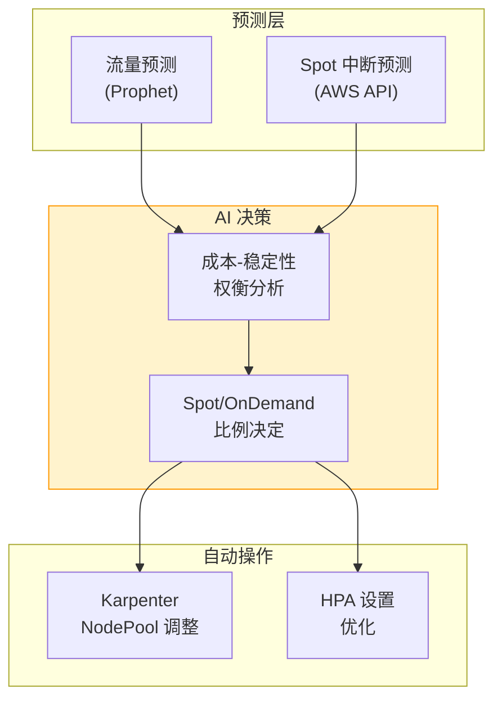

**基于 Spot 中断预测的比例调整**：

```python
# Spot 中断预测 + 流量预测集成扩缩器
import boto3
from datetime import datetime, timedelta

ec2_client = boto3.client('ec2', region_name='ap-northeast-2')
cloudwatch_client = boto3.client('cloudwatch', region_name='ap-northeast-2')

def predict_spot_interruption_risk(instance_types: list[str], availability_zones: list[str]) -> dict:
    """Spot 实例中断风险预测"""

    # 查询 Spot 中断建议（最近 5 分钟数据）
    risk_scores = {}

    for az in availability_zones:
        for instance_type in instance_types:
            # 从 CloudWatch 查询 Spot 中断频率
            response = cloudwatch_client.get_metric_statistics(
                Namespace='AWS/EC2Spot',
                MetricName='InterruptionRate',
                Dimensions=[
                    {'Name': 'AvailabilityZone', 'Value': az},
                    {'Name': 'InstanceType', 'Value': instance_type}
                ],
                StartTime=datetime.now() - timedelta(hours=24),
                EndTime=datetime.now(),
                Period=3600,
                Statistics=['Average']
            )

            if response['Datapoints']:
                avg_interruption_rate = sum(dp['Average'] for dp in response['Datapoints']) / len(response['Datapoints'])
                risk_scores[f"{instance_type}/{az}"] = avg_interruption_rate
            else:
                risk_scores[f"{instance_type}/{az}"] = 0.0

    return risk_scores

def calculate_optimal_spot_ratio(traffic_prediction: dict, spot_risk: dict) -> dict:
    """基于流量预测 + Spot 风险度计算最优 Spot 比例"""

    predicted_rps = traffic_prediction['predicted_rps']
    prediction_confidence = traffic_prediction['confidence']  # 0.0 - 1.0

    # 平均 Spot 中断风险度
    avg_spot_risk = sum(spot_risk.values()) / len(spot_risk) if spot_risk else 0.0

    # 决策逻辑
    if avg_spot_risk > 0.05:  # 5% 以上中断风险
        # 高风险: 增加 On-Demand 比例
        spot_ratio = 0.3
        ondemand_ratio = 0.7
        reason = "Spot 中断风险高 (>5%)"

    elif prediction_confidence < 0.7:  # 预测置信度低
        # 不确定性高: 增加 On-Demand 比例（稳定性优先）
        spot_ratio = 0.5
        ondemand_ratio = 0.5
        reason = "流量预测置信度低 (<70%)"

    elif predicted_rps > 5000:  # 预计高流量
        # 高峰时间: 增加 On-Demand 比例（性能优先）
        spot_ratio = 0.4
        ondemand_ratio = 0.6
        reason = "预计高流量 (>5000 RPS)"

    else:
        # 正常: 最大化 Spot 比例（成本优化）
        spot_ratio = 0.8
        ondemand_ratio = 0.2
        reason = "正常运营条件（成本优化）"

    return {
        'spot_ratio': spot_ratio,
        'ondemand_ratio': ondemand_ratio,
        'reason': reason,
        'estimated_cost_saving': calculate_cost_saving(spot_ratio)
    }

def calculate_cost_saving(spot_ratio: float) -> float:
    """基于 Spot 比例估算成本节省"""
    # 假设: Spot 实例比 On-Demand 便宜 70%
    spot_discount = 0.7
    return spot_ratio * spot_discount * 100  # 百分比

# 执行示例
spot_risk = predict_spot_interruption_risk(
    instance_types=['c6i.xlarge', 'c5.xlarge'],
    availability_zones=['ap-northeast-2a', 'ap-northeast-2b', 'ap-northeast-2c']
)

traffic_pred = {
    'predicted_rps': 3500,
    'confidence': 0.85
}

optimal_ratio = calculate_optimal_spot_ratio(traffic_pred, spot_risk)

print(f"""
[基于预测的 Spot 比例调整]
流量预测: {traffic_pred['predicted_rps']} RPS (置信度: {traffic_pred['confidence']:.0%})
Spot 中断风险: {sum(spot_risk.values()) / len(spot_risk):.2%}

建议比例:
- Spot: {optimal_ratio['spot_ratio']:.0%}
- On-Demand: {optimal_ratio['ondemand_ratio']:.0%}

依据: {optimal_ratio['reason']}
预计成本节省: {optimal_ratio['estimated_cost_saving']:.1f}%
""")
```

#### 9.6.2 通过预测扩缩容动态调整 On-Demand 与 Spot 比例

动态调整 Karpenter NodePool 设置，根据预测的流量和 Spot 风险度维持最优比例。

```yaml
# Karpenter NodePool: 动态 Spot 比例调整
apiVersion: karpenter.sh/v1
kind: NodePool
metadata:
  name: dynamic-spot-pool
spec:
  template:
    spec:
      requirements:
        - key: karpenter.sh/capacity-type
          operator: In
          values: ["spot", "on-demand"]
        - key: kubernetes.io/arch
          operator: In
          values: ["amd64"]
        - key: node.kubernetes.io/instance-type
          operator: In
          values: ["c6i.xlarge", "c5.xlarge", "c6a.xlarge"]

      # Spot 比例动态调整（默认值: 70% Spot, 30% On-Demand）
      kubelet:
        systemReserved:
          cpu: 100m
          memory: 100Mi

  # Spot 中断处理策略
  disruption:
    consolidationPolicy: WhenUnderutilized
    expireAfter: 720h  # 30 天

  # 基于权重的比例控制
  weight: 100
---
# Lambda 函数: Karpenter NodePool 动态更新
import boto3
import json

eks_client = boto3.client('eks', region_name='ap-northeast-2')
k8s_client = boto3.client('eks', region_name='ap-northeast-2')  # 代替 kubectl 使用

def update_karpenter_nodepool_weights(optimal_ratio: dict):
    """更新 Karpenter NodePool 的 Spot/OnDemand 权重"""

    spot_weight = int(optimal_ratio['spot_ratio'] * 100)
    ondemand_weight = int(optimal_ratio['ondemand_ratio'] * 100)

    # NodePool 更新（使用 API 代替 kubectl apply）
    nodepool_patch = {
        "spec": {
            "template": {
                "spec": {
                    "requirements": [
                        {
                            "key": "karpenter.sh/capacity-type",
                            "operator": "In",
                            "values": ["spot", "on-demand"],
                            "weight": {
                                "spot": spot_weight,
                                "on-demand": ondemand_weight
                            }
                        }
                    ]
                }
            }
        }
    }

    # 记录 CloudWatch 指标
    cloudwatch_client.put_metric_data(
        Namespace='Karpenter/CostOptimization',
        MetricData=[
            {
                'MetricName': 'SpotRatio',
                'Value': optimal_ratio['spot_ratio'],
                'Unit': 'Percent',
                'Timestamp': datetime.now()
            },
            {
                'MetricName': 'EstimatedCostSaving',
                'Value': optimal_ratio['estimated_cost_saving'],
                'Unit': 'Percent',
                'Timestamp': datetime.now()
            }
        ]
    )

    print(f"Karpenter NodePool 更新: Spot {spot_weight}%, OnDemand {ondemand_weight}%")

# EventBridge Rule: 每 5 分钟执行
def lambda_handler(event, context):
    # 1. 获取流量预测
    traffic_pred = get_traffic_prediction()

    # 2. Spot 中断风险预测
    spot_risk = predict_spot_interruption_risk(
        instance_types=['c6i.xlarge', 'c5.xlarge'],
        availability_zones=['ap-northeast-2a', 'ap-northeast-2b', 'ap-northeast-2c']
    )

    # 3. 计算最优比例
    optimal_ratio = calculate_optimal_spot_ratio(traffic_pred, spot_risk)

    # 4. 更新 Karpenter NodePool
    update_karpenter_nodepool_weights(optimal_ratio)

    # 5. Slack 通知（比例变更时）
    if abs(optimal_ratio['spot_ratio'] - 0.7) > 0.1:  # 相比默认值变更超过 10%
        send_slack_notification(
            channel='#cost-optimization',
            message=f"""
            Karpenter Spot 比例自动调整

            **调整依据**: {optimal_ratio['reason']}
            **新比例**: Spot {optimal_ratio['spot_ratio']:.0%}, On-Demand {optimal_ratio['ondemand_ratio']:.0%}
            **预计成本节省**: {optimal_ratio['estimated_cost_saving']:.1f}%

            流量预测: {traffic_pred['predicted_rps']} RPS (置信度 {traffic_pred['confidence']:.0%})
            Spot 中断风险: {sum(spot_risk.values()) / len(spot_risk):.2%}
            """
        )

    return {
        'statusCode': 200,
        'body': json.dumps(optimal_ratio)
    }
```

#### 9.6.3 基于 CloudWatch 指标的成本异常检测

利用 CloudWatch Anomaly Detection 提前检测预算超支并自动告警。

```python
# 成本异常检测设置
import boto3

cloudwatch_client = boto3.client('cloudwatch', region_name='ap-northeast-2')
ce_client = boto3.client('ce', region_name='ap-northeast-2')  # Cost Explorer

# Step 1: 将日成本指标记录到 CloudWatch
def record_daily_cost_to_cloudwatch():
    """将 Cost Explorer 数据记录为 CloudWatch Custom Metric"""

    # 查询昨日成本
    yesterday = (datetime.now() - timedelta(days=1)).strftime('%Y-%m-%d')
    today = datetime.now().strftime('%Y-%m-%d')

    response = ce_client.get_cost_and_usage(
        TimePeriod={
            'Start': yesterday,
            'End': today
        },
        Granularity='DAILY',
        Metrics=['UnblendedCost'],
        Filter={
            'Dimensions': {
                'Key': 'SERVICE',
                'Values': ['Amazon Elastic Kubernetes Service', 'Amazon EC2']
            }
        }
    )

    total_cost = float(response['ResultsByTime'][0]['Total']['UnblendedCost']['Amount'])

    # 记录 CloudWatch 指标
    cloudwatch_client.put_metric_data(
        Namespace='AWS/Billing',
        MetricData=[
            {
                'MetricName': 'DailyEKSCost',
                'Value': total_cost,
                'Unit': 'None',
                'Timestamp': datetime.now()
            }
        ]
    )

    return total_cost

# Step 2: 设置 Anomaly Detection
cloudwatch_client.put_anomaly_detector(
    Namespace='AWS/Billing',
    MetricName='DailyEKSCost',
    Stat='Sum'
)

# Step 3: 设置异常成本告警
cloudwatch_client.put_metric_alarm(
    AlarmName='EKS-Cost-Anomaly-Detection',
    AlarmDescription='EKS 日成本异常检测 (Anomaly Detection)',
    ActionsEnabled=True,
    AlarmActions=[
        'arn:aws:sns:ap-northeast-2:ACCOUNT_ID:cost-alerts'
    ],
    MetricName='DailyEKSCost',
    Namespace='AWS/Billing',
    Statistic='Sum',
    Period=86400,  # 24 小时
    EvaluationPeriods=1,
    ThresholdMetricId='ad1',
    ComparisonOperator='LessThanLowerOrGreaterThanUpperThreshold',
    Metrics=[
        {
            'Id': 'm1',
            'ReturnData': True,
            'MetricStat': {
                'Metric': {
                    'Namespace': 'AWS/Billing',
                    'MetricName': 'DailyEKSCost'
                },
                'Period': 86400,
                'Stat': 'Sum'
            }
        },
        {
            'Id': 'ad1',
            'Expression': 'ANOMALY_DETECTION_BAND(m1, 2)',  # 2 standard deviations
            'Label': 'DailyEKSCost (expected)'
        }
    ]
)

print("成本异常检测设置完成: CloudWatch Anomaly Detection + Alarm")
```

#### 9.6.4 基于预测模型的 Reserved Instances/Savings Plans 优化

利用 ML 模型预测未来资源使用量，优化 Reserved Instances 或 Savings Plans 的购买。

```python
# RI/Savings Plans 购买优化
from prophet import Prophet
import pandas as pd

def predict_baseline_capacity(historical_data: pd.DataFrame) -> dict:
    """基于过去资源使用量预测 Baseline 容量"""

    # Prophet 模型训练
    model = Prophet(
        yearly_seasonality=True,
        weekly_seasonality=True,
        daily_seasonality=False
    )

    # 过去实例小时(instance-hours)数据
    df = historical_data[['ds', 'y']].copy()  # ds: 日期, y: 实例小时
    model.fit(df)

    # 预测未来 90 天
    future = model.make_future_dataframe(periods=90)
    forecast = model.predict(future)

    # Baseline 计算: 下位 20% percentile（始终需要的最低容量）
    baseline_capacity = forecast['yhat'].quantile(0.20)

    # 峰值容量: 上位 95% percentile
    peak_capacity = forecast['yhat'].quantile(0.95)

    return {
        'baseline_capacity': baseline_capacity,
        'peak_capacity': peak_capacity,
        'forecast': forecast
    }

# 执行示例
historical_data = pd.DataFrame({
    'ds': pd.date_range(start='2025-08-01', end='2026-02-01', freq='H'),
    'y': [50, 52, 48, 55, 60, 58, 62, ...]  # 每小时实例数
})

prediction = predict_baseline_capacity(historical_data)

print(f"""
[RI/Savings Plans 购买建议]

Baseline 容量 (下位 20%): {prediction['baseline_capacity']:.0f} 实例
-> 建议: 为 {prediction['baseline_capacity']:.0f} 个实例购买 1 年 RI

Peak 容量 (上位 95%): {prediction['peak_capacity']:.0f} 实例
-> Baseline 超出部分: {prediction['peak_capacity'] - prediction['baseline_capacity']:.0f} 个
-> 超出部分使用 Spot + On-Demand 组合

预计成本节省:
- 应用 RI 时: 30-40% 节省
- 应用 Spot 时: 60-70% 节省（高峰时段）
- 总预计节省: 约 45%（混合策略）
""")
```

**Cost Explorer 集成 -- 实时成本跟踪**

```yaml
# CloudWatch Dashboard: 成本优化现状
apiVersion: v1
kind: ConfigMap
metadata:
  name: cost-optimization-dashboard
data:
  dashboard.json: |
    {
      "widgets": [
        {
          "type": "metric",
          "properties": {
            "title": "日 EKS 成本趋势",
            "metrics": [
              ["AWS/Billing", "DailyEKSCost", {"stat": "Sum"}],
              [".", ".", {"stat": "Sum", "id": "ad1", "expression": "ANOMALY_DETECTION_BAND(m1, 2)"}]
            ],
            "period": 86400,
            "region": "ap-northeast-2"
          }
        },
        {
          "type": "metric",
          "properties": {
            "title": "Spot vs On-Demand 比例",
            "metrics": [
              ["Karpenter/CostOptimization", "SpotRatio"],
              [".", "OnDemandRatio"]
            ],
            "period": 300,
            "region": "ap-northeast-2"
          }
        },
        {
          "type": "metric",
          "properties": {
            "title": "累计成本节省额",
            "metrics": [
              ["Karpenter/CostOptimization", "EstimatedCostSaving"]
            ],
            "period": 86400,
            "stat": "Sum",
            "region": "ap-northeast-2"
          }
        },
        {
          "type": "metric",
          "properties": {
            "title": "Spot 中断频率",
            "metrics": [
              ["AWS/EC2Spot", "InterruptionRate", {"stat": "Average"}]
            ],
            "period": 3600,
            "region": "ap-northeast-2"
          }
        }
      ]
    }
```

:::info 基于预测的成本优化的核心
结合流量预测和 Spot 中断预测，可以在**不降低性能**的情况下大幅降低成本。通过 Karpenter 的动态 Spot 比例调整最大化成本效率，通过 CloudWatch Anomaly Detection 提前防止预算超支，通过基于 ML 的容量预测优化 RI/Savings Plans 购买。

**成本节省策略**：
1. **最大化 Spot 比例**: 正常时段 80% Spot, 高峰时段 40% Spot
2. **Baseline RI 购买**: 为下位 20% percentile 容量购买 1 年 RI
3. **异常检测**: 通过 CloudWatch Anomaly Detection 提前预警预算超支
4. **动态调整**: 每 5 分钟基于流量预测 + Spot 风险度调整比例

**预期效果**：
- Spot 利用: 60-70% 成本节省（对比 On-Demand）
- RI 利用: 30-40% 成本节省（对比 On-Demand）
- 混合策略: 总计 45-50% 成本节省（基于预测优化）
:::

---

## 10. 集成运维仪表板

### 10.1 AMG 仪表板配置

<MaturityTable />

集成运维仪表板同时显示预测数据和实际数据。

```json
{
  "dashboard": {
    "title": "EKS 预测运维仪表板",
    "panels": [
      {
        "title": "流量预测 vs 实际",
        "type": "timeseries",
        "targets": [
          {
            "expr": "sum(rate(http_requests_total{namespace='payment'}[5m]))",
            "legendFormat": "实际 RPS"
          },
          {
            "expr": "predicted_rps{service='payment'}",
            "legendFormat": "预测 RPS"
          }
        ]
      },
      {
        "title": "扩缩容事件",
        "type": "timeseries",
        "targets": [
          {
            "expr": "kube_deployment_spec_replicas{deployment='payment-service'}",
            "legendFormat": "当前 Replicas"
          },
          {
            "expr": "predicted_replicas{deployment='payment-service'}",
            "legendFormat": "预测所需 Replicas"
          }
        ]
      },
      {
        "title": "SLO 现状",
        "type": "gauge",
        "targets": [
          {
            "expr": "1 - (sum(rate(http_requests_total{status=~'5..'}[30d])) / sum(rate(http_requests_total[30d])))",
            "legendFormat": "可用性 SLO"
          }
        ],
        "thresholds": {
          "steps": [
            {"value": 0.999, "color": "green"},
            {"value": 0.995, "color": "yellow"},
            {"value": 0, "color": "red"}
          ]
        }
      },
      {
        "title": "Error Budget 剩余",
        "type": "stat",
        "targets": [
          {
            "expr": "error_budget_remaining_percent{service='payment'}",
            "legendFormat": "剩余 Error Budget"
          }
        ]
      },
      {
        "title": "预测精度",
        "type": "stat",
        "targets": [
          {
            "expr": "prediction_accuracy_percent",
            "legendFormat": "精度"
          }
        ]
      },
      {
        "title": "事件自动响应率",
        "type": "stat",
        "targets": [
          {
            "expr": "auto_remediation_success_rate",
            "legendFormat": "自动响应成功率"
          }
        ]
      }
    ]
  }
}
```

### 10.2 核心仪表板面板

<DashboardPanels />

---

## 11. 总结

### 11.1 引入路线图

```
Phase 1: 构建可观测性基础
  └── AMP/AMG + CloudWatch + Anomaly Detection

Phase 2: 预测扩缩容
  └── Prophet/ARIMA + Karpenter 先发制人配置

Phase 3: AI Agent 扩展
  └── Q Developer + Strands + Kagent + MCP 集成

Phase 4: Kiro 编程式调试
  └── Kiro Spec -> 自动诊断 -> 自动修复

Phase 5: Chaos Engineering + 反馈循环
  └── FIS 实验 -> AI 学习 -> 自主运维进化
```

### 11.2 后续步骤

- **[1. AIOps 战略指南](./aiops-introduction.md)**: 预测运维的上层战略 -- AIOps 全局
- **[2. 智能可观测性栈](./aiops-observability-stack.md)**: 预测运维的数据基础 -- 可观测性构建
- **[3. AIDLC 框架](./aidlc-framework.md)**: 包含预测运维的 AI 开发生命周期

### 11.3 学习路径

```
[上一篇] 1. AIOps 战略指南 -- 理解战略和方向性
     ↓
[上一篇] 2. 智能可观测性栈 -- 构建数据采集·分析基础
     ↓
[上一篇] 3. AIDLC 框架 -- AI 驱动开发方法论
     ↓
[当前文档] 4. 预测扩缩容及自动恢复 -- 实现自主运维
```

:::info 相关文档

- [1. AIOps 战略指南](./aiops-introduction.md) -- AIOps 全局战略
- [2. 智能可观测性栈](./aiops-observability-stack.md) -- 可观测性基础设施
- [3. AIDLC 框架](./aidlc-framework.md) -- AI 驱动开发方法论
:::
