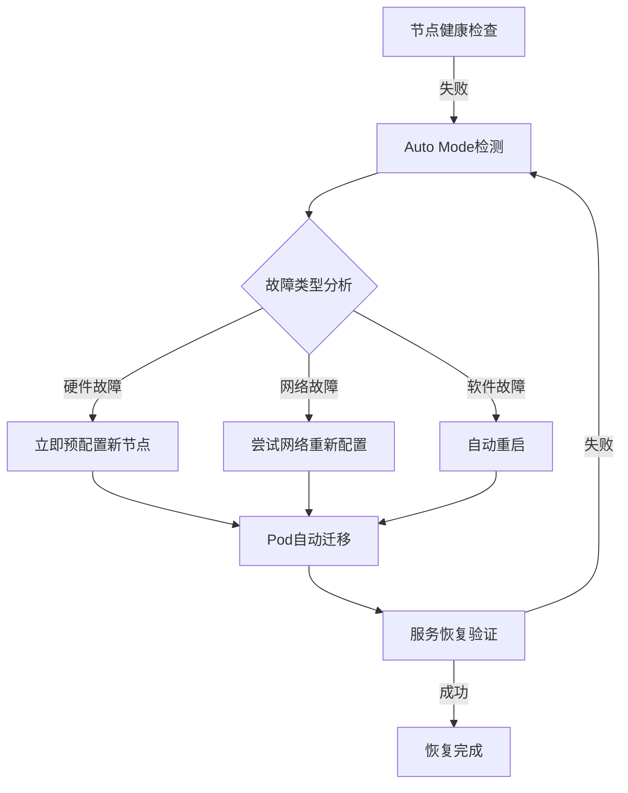
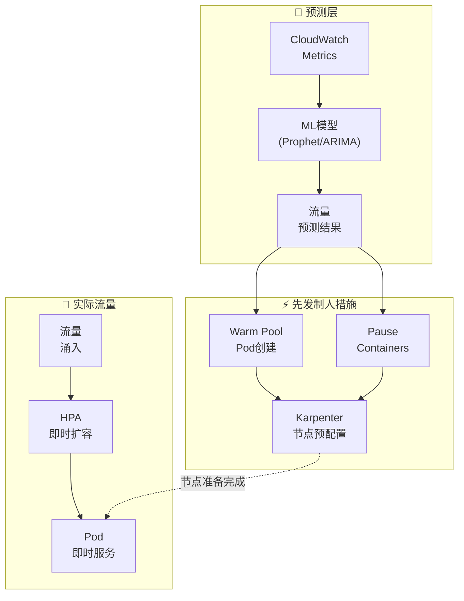
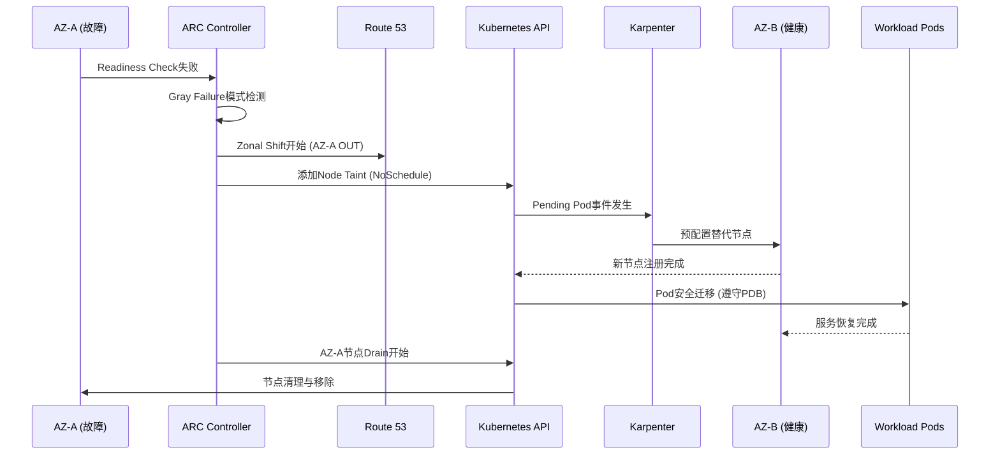
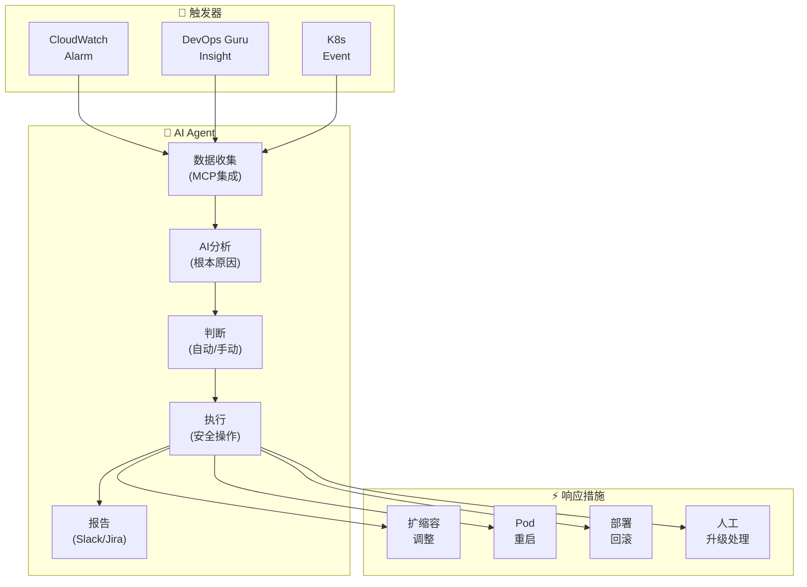
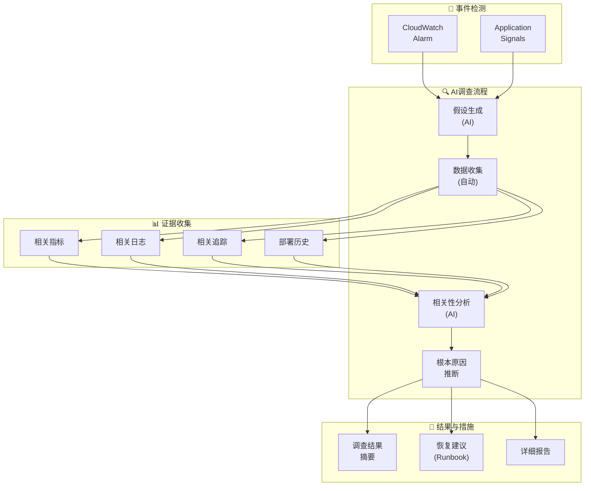
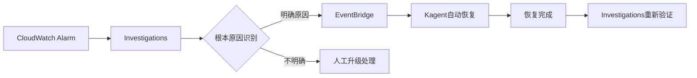
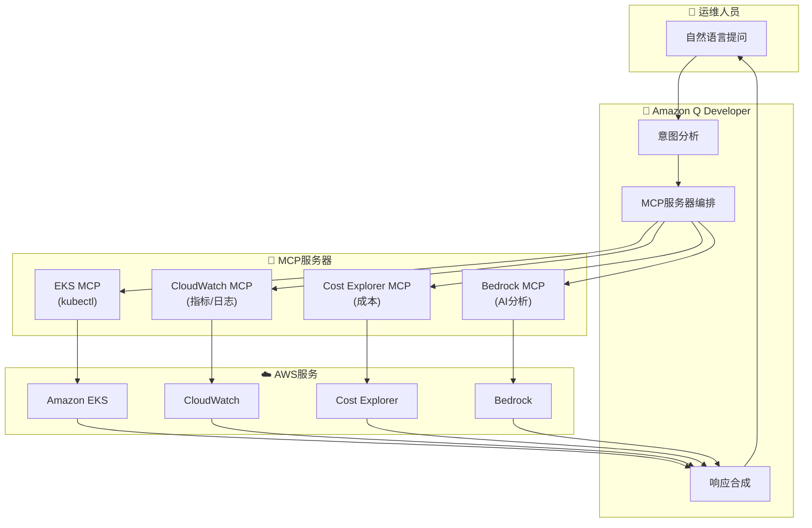

import { ScalingComparison, ResponsePatterns, MaturityTable, EvolutionStages, MLModelComparison, AnomalyMetrics, RightSizingResults, ChaosExperiments, DashboardPanels } from '@site/src/components/PredictiveOpsTables';

# 预测性扩缩容与自动恢复模式

> 📅 **撰写日期**: 2026-02-12 | **修改日期**: 2026-02-14 | ⏱️ **阅读时间**: 约29分钟

---

## 1. 概述

### 1.1 从响应式到自主式

EKS运营的演进分为 **响应式 → 预测式 → 自主式** 三个阶段。

<EvolutionStages />

:::info 本文档的范围
超越响应式扩缩容的局限，涵盖基于ML的预测性扩缩容和通过AI Agent实现的自主恢复模式。特别以Kiro+MCP为基础的 **程序化调试** 和Kagent/Strands为基础的 **自动事件响应** 为核心进行说明。
:::

### 1.2 为什么需要预测性运营

- **HPA的局限性**: 指标超过阈值后才响应 → 用户体验已受影响
- **冷启动问题**: 新Pod启动需要30秒-2分钟 → 流量突增时无法应对
- **节点预配置延迟**: 即使是Karpenter，节点启动也需要1-3分钟
- **复合故障**: 单一指标无法检测的多因素故障日益增多
- **成本低效**: 过度预留冗余资源 → 成本浪费

---

## 2. 基于ML的预测性扩缩容

### 2.1 HPA的局限性

HPA(Horizontal Pod Autoscaler)基于 **当前指标** 进行响应，因此存在结构性局限。

<ScalingComparison />

```
[HPA的响应式扩缩容]

流量 ████████████████████████░░░░░░░░░
                      ↑ 超过阈值
                      |
Pod数  ██████████░░░░████████████████████
                  ↑ 开始扩容
                  |  (延迟发生)
用户   ✓✓✓✓✓✓✓✓✗✗✗✓✓✓✓✓✓✓✓✓✓✓✓✓✓✓
体验              ↑ 性能下降区间

[ML预测性扩缩容]

流量 ████████████████████████░░░░░░░░░
             ↑ 预测时点 (30分钟前)
             |
Pod数  ██████████████████████████████████
             ↑ 提前扩容
             |
用户   ✓✓✓✓✓✓✓✓✓✓✓✓✓✓✓✓✓✓✓✓✓✓✓✓✓✓
体验     (无性能下降)
```

### 2.2 时间序列预测模型

用于预测EKS工作负载流量模式的代表性ML模型：

<MLModelComparison />

### 2.3 基于Prophet的预测性扩缩容实现

```python
# 基于Prophet的EKS流量预测
import boto3
from prophet import Prophet
import pandas as pd
from datetime import datetime, timedelta

def fetch_metrics_from_amp(workspace_id, query, hours=168):
    """从AMP查询过去7天的指标"""
    client = boto3.client('amp', region_name='ap-northeast-2')
    end_time = datetime.utcnow()
    start_time = end_time - timedelta(hours=hours)

    response = client.query_range(
        workspaceId=workspace_id,
        query=query,
        startTime=start_time,
        endTime=end_time,
        step='5m'
    )
    return response

def predict_scaling(metrics_df, forecast_hours=2):
    """使用Prophet预测未来流量"""
    # 转换为Prophet格式
    df = metrics_df.rename(columns={
        'timestamp': 'ds',
        'value': 'y'
    })

    model = Prophet(
        changepoint_prior_scale=0.05,
        seasonality_mode='multiplicative',
        daily_seasonality=True,
        weekly_seasonality=True,
    )
    model.fit(df)

    # 预测未来forecast_hours
    future = model.make_future_dataframe(
        periods=forecast_hours * 12,  # 5分钟间隔
        freq='5min'
    )
    forecast = model.predict(future)

    return forecast[['ds', 'yhat', 'yhat_upper', 'yhat_lower']]

def calculate_required_pods(predicted_rps, pod_capacity_rps=100):
    """基于预测RPS计算所需Pod数"""
    # 使用上限值(yhat_upper)确保安全余量
    required = int(predicted_rps / pod_capacity_rps) + 1
    return max(required, 2)  # 最少维持2个

def apply_scaling(namespace, deployment, target_replicas):
    """通过kubectl应用扩缩容"""
    import subprocess
    cmd = f"kubectl scale deployment/{deployment} -n {namespace} --replicas={target_replicas}"
    subprocess.run(cmd.split(), check=True)
    print(f"Scaled {deployment} to {target_replicas} replicas")
```

### 2.4 基于CronJob的预测性扩缩容自动化

```yaml
# 定期执行预测性扩缩容的CronJob
apiVersion: batch/v1
kind: CronJob
metadata:
  name: predictive-scaler
  namespace: scaling
spec:
  schedule: "*/15 * * * *"  # 每15分钟执行
  jobTemplate:
    spec:
      template:
        spec:
          serviceAccountName: predictive-scaler
          containers:
            - name: scaler
              image: my-registry/predictive-scaler:latest
              env:
                - name: AMP_WORKSPACE_ID
                  value: "ws-xxxxx"
                - name: TARGET_NAMESPACE
                  value: "payment"
                - name: TARGET_DEPLOYMENT
                  value: "payment-service"
                - name: FORECAST_HOURS
                  value: "2"
              resources:
                requests:
                  cpu: 500m
                  memory: 1Gi
                limits:
                  cpu: "1"
                  memory: 2Gi
          restartPolicy: OnFailure
```

### 2.5 网络性能预测及ML推理工作负载优化

EKS的 **Container Network Observability** 可以精细监控Pod-to-Pod通信模式，提前预测网络瓶颈并优化ML推理工作负载的性能。

#### Container Network Observability数据应用

**1. Pod-to-Pod通信模式 → 网络瓶颈预测**

```python
# 基于Container Network Observability指标的瓶颈预测
import boto3
from prophet import Prophet
import pandas as pd

def predict_network_bottleneck(cluster_name, namespace):
    """
    预测Pod-to-Pod网络延迟，判断瓶颈可能性。
    """
    cloudwatch = boto3.client('cloudwatch')

    # 查询Container Network Observability指标
    metrics = cloudwatch.get_metric_data(
        MetricDataQueries=[
            {
                'Id': 'rx_latency',
                'MetricStat': {
                    'Metric': {
                        'Namespace': 'ContainerInsights',
                        'MetricName': 'pod_network_rx_latency_ms',
                        'Dimensions': [
                            {'Name': 'ClusterName', 'Value': cluster_name},
                            {'Name': 'Namespace', 'Value': namespace}
                        ]
                    },
                    'Period': 300,
                    'Stat': 'Average'
                }
            },
            {
                'Id': 'tx_bytes',
                'MetricStat': {
                    'Metric': {
                        'Namespace': 'ContainerInsights',
                        'MetricName': 'pod_network_tx_bytes',
                        'Dimensions': [
                            {'Name': 'ClusterName', 'Value': cluster_name},
                            {'Name': 'Namespace', 'Value': namespace}
                        ]
                    },
                    'Period': 300,
                    'Stat': 'Sum'
                }
            }
        ],
        StartTime=datetime.utcnow() - timedelta(days=7),
        EndTime=datetime.utcnow()
    )

    # 使用Prophet模型预测未来2小时
    df = pd.DataFrame({
        'ds': [d['Timestamp'] for d in metrics['MetricDataResults'][0]['Timestamps']],
        'y': [d for d in metrics['MetricDataResults'][0]['Values']]
    })

    model = Prophet(changepoint_prior_scale=0.05)
    model.fit(df)

    future = model.make_future_dataframe(periods=24, freq='5min')
    forecast = model.predict(future)

    # 瓶颈预测：预计延迟将比平时增加2倍以上
    baseline = df['y'].mean()
    predicted_peak = forecast['yhat'].iloc[-1]

    if predicted_peak > baseline * 2:
        return {
            'bottleneck_risk': 'HIGH',
            'predicted_latency_ms': predicted_peak,
            'baseline_latency_ms': baseline,
            'action': 'consider_network_policy_optimization'
        }
    return {'bottleneck_risk': 'LOW'}
```

**2. 跨AZ流量趋势 → 成本优化预测**

```promql
# 跨AZ网络流量成本追踪
sum(rate(pod_network_tx_bytes{
  source_az!="", dest_az!="",
  source_az!=dest_az
}[5m])) by (source_az, dest_az)
* 0.01 / 1024 / 1024 / 1024  # $0.01/GB
```

**成本优化策略**：

- **拓扑感知调度**: 利用Kubernetes Topology Aware Hints优先选择同一AZ内通信
- **服务网格优化**: 通过Istio locality load balancing最小化跨AZ流量
- **基于预测的部署**: ML模型学习通信模式并建议最优AZ部署方案

```yaml
# 启用Topology Aware Hints
apiVersion: v1
kind: Service
metadata:
  name: ml-inference-service
  annotations:
    service.kubernetes.io/topology-mode: Auto
spec:
  selector:
    app: ml-inference
  ports:
    - port: 8080
  type: ClusterIP
```

#### ML推理工作负载性能预测

**1. Ray、vLLM、Triton、PyTorch工作负载网络性能监控**

```yaml
# vLLM推理服务网络监控
apiVersion: v1
kind: ConfigMap
metadata:
  name: vllm-network-monitoring
data:
  metrics.yaml: |
    # Container Network Observability指标
    metrics:
      - pod_network_rx_bytes
      - pod_network_tx_bytes
      - pod_network_rx_latency_ms
      - pod_network_rx_errors_total

    # 额外自定义指标
    custom_metrics:
      - name: vllm_inference_network_throughput_mbps
        query: |
          sum(rate(pod_network_rx_bytes{app="vllm-inference"}[1m]))
          / 1024 / 1024

      - name: vllm_model_load_network_time_ms
        query: |
          histogram_quantile(0.99,
            rate(pod_network_rx_latency_bucket{
              app="vllm-inference",
              operation="model_load"
            }[5m])
          )
```

**Ray分布式推理网络模式**：

```python
# Ray集群的网络瓶颈检测
import ray
from ray import serve

@serve.deployment
class LLMInferenceDeployment:
    def __init__(self):
        self.model = load_model()
        self.network_monitor = NetworkMonitor()

    async def __call__(self, request):
        # 网络延迟追踪
        start_time = time.time()

        # Ray的分布式推理调用
        result = await self.model.generate(request.prompt)

        network_latency = time.time() - start_time

        # 发送自定义指标到CloudWatch
        self.network_monitor.record_latency(network_latency)

        # 检测到网络瓶颈时触发扩容
        if network_latency > 200:  # 超过200ms
            trigger_scale_out()

        return result
```

**2. 推理延迟 → 扩容触发预测**

```python
# 基于ML推理延迟的预测性扩缩容
def predict_inference_scaling(service_name, forecast_hours=2):
    """
    学习推理延迟模式，预测需要扩容的时间点。
    """
    # 收集过去7天的推理延迟数据
    latency_data = fetch_inference_latency_from_cloudwatch(
        service_name=service_name,
        days=7
    )

    # 收集请求量数据
    request_volume = fetch_request_volume(service_name, days=7)

    # 分析延迟与请求量的相关性
    df = pd.DataFrame({
        'timestamp': latency_data['timestamps'],
        'latency_p99': latency_data['p99'],
        'request_rate': request_volume['rate']
    })

    # 计算阈值：P99延迟 > 500ms时的请求量
    threshold_requests = df[df['latency_p99'] > 500]['request_rate'].min()

    # 使用Prophet预测未来请求量
    prophet_df = df[['timestamp', 'request_rate']].rename(
        columns={'timestamp': 'ds', 'request_rate': 'y'}
    )

    model = Prophet()
    model.fit(prophet_df)

    future = model.make_future_dataframe(
        periods=forecast_hours * 12,  # 5分钟间隔
        freq='5min'
    )
    forecast = model.predict(future)

    # 预测需要扩容的时间点
    scale_out_needed = forecast[
        forecast['yhat'] > threshold_requests
    ]['ds'].min()

    if pd.notna(scale_out_needed):
        # 在预测时间30分钟前先发制人地扩容
        preemptive_time = scale_out_needed - timedelta(minutes=30)

        return {
            'scale_out_recommended': True,
            'recommended_time': preemptive_time,
            'predicted_request_rate': forecast.iloc[-1]['yhat'],
            'threshold': threshold_requests,
            'current_replicas': get_current_replicas(service_name),
            'recommended_replicas': calculate_required_replicas(
                forecast.iloc[-1]['yhat'],
                threshold_requests
            )
        }

    return {'scale_out_recommended': False}
```

**3. GPU利用率 + 网络带宽相关性分析**

```promql
# GPU利用率与网络带宽的相关性
# (NVIDIA DCGM Exporter指标 + Container Network Observability)

# GPU利用率
DCGM_FI_DEV_GPU_UTIL{
  namespace="ml-inference",
  pod=~"vllm-.*"
}

# 同时网络接收带宽
sum(rate(pod_network_rx_bytes{
  namespace="ml-inference",
  pod=~"vllm-.*"
}[1m])) by (pod)

# 相关性分析：GPU利用率 < 50% && 网络带宽 > 100MB/s
# → 网络瓶颈正在阻碍GPU利用率
```

**优化策略**：

```yaml
# 解决网络瓶颈：启用Enhanced Networking和ENA Express
apiVersion: karpenter.sh/v1
kind: NodePool
metadata:
  name: ml-inference-pool
spec:
  template:
    spec:
      requirements:
        - key: karpenter.k8s.aws/instance-family
          operator: In
          values: ["p5", "p4d"]  # 最新GPU实例 (支持ENA Express)
        - key: karpenter.k8s.aws/instance-size
          operator: In
          values: ["24xlarge", "48xlarge"]
      nodeClassRef:
        name: ml-inference-class
---
apiVersion: karpenter.k8s.aws/v1
kind: EC2NodeClass
metadata:
  name: ml-inference-class
spec:
  amiSelectorTerms:
    - alias: al2023@latest
  userData: |
    #!/bin/bash
    # 启用ENA Express (100Gbps网络性能)
    ethtool -K eth0 ena-express on

    # TCP BBR拥塞控制 (高带宽优化)
    echo "net.ipv4.tcp_congestion_control=bbr" >> /etc/sysctl.conf
    sysctl -p
```

#### EKS Auto Mode自动恢复/自愈

**EKS Auto Mode** 自动检测和恢复节点故障，大幅提升 **MTTR（平均恢复时间）**。

**1. 自动节点故障检测与替换**



**自动恢复触发条件**：

- **NodeNotReady**: 节点处于NotReady状态超过5分钟
- **NetworkUnavailable**: 网络插件故障
- **MemoryPressure/DiskPressure**: 资源不足
- **Unschedulable**: 节点处于不可调度状态

**2. OS补丁自动化**

Auto Mode自动执行 **零停机OS补丁**：

```yaml
# Auto Mode节点自动更新策略 (无需用户配置)
# AWS自动管理的内部策略示例
nodeMaintenance:
  autoUpdate: true
  maintenanceWindow:
    preferredDays: ["Sunday", "Wednesday"]
    preferredHours: ["02:00-06:00"]  # UTC
  strategy:
    type: RollingUpdate
    maxUnavailable: 1
    respectPodDisruptionBudget: true
```

**补丁流程**：

1. **预配置新节点**: 使用最新AL2023 AMI创建新节点
2. **Pod安全迁移**: 遵守PDB，从旧节点迁移Pod到新节点
3. **移除旧节点**: 所有Pod迁移完成后终止旧节点
4. **验证**: 确认服务健康检查通过

**3. 安全服务集成**

Auto Mode与AWS安全服务自动集成，支持 **安全事件自动响应**：

```
GuardDuty Extended Threat Detection
  ↓ (检测到加密货币挖矿)
Auto Mode自动响应
  ↓
1. 隔离受影响的节点 (Taint: NoSchedule)
2. 预配置新节点
3. 将Pod迁移到干净的节点
4. 终止受感染节点并收集取证数据
5. 在CloudWatch Logs中记录事件
```

**4. 预测性视角：Auto Mode的MTTR改善**

**传统手动运维 vs Auto Mode对比**：

| 故障场景 | 手动运维MTTR | Auto Mode MTTR | 改善率 |
|--------------|----------------|----------------|--------|
| 节点硬件故障 | 15-30分钟 | 2-5分钟 | **缩短83%** |
| OS安全补丁 | 数小时 (计划停机) | 0分钟 (零停机) | **改善100%** |
| 网络插件故障 | 10-20分钟 | 1-3分钟 | **缩短85%** |
| 恶意软件感染 | 30分钟-1小时 | 5-10分钟 | **缩短80%** |

**预测性运维视角下Auto Mode的价值**：

- **先发制人替换**: 检测到节点性能下降后在故障发生前进行替换
- **自动容量管理**: 学习工作负载模式自动选择最优节点类型
- **无中断维护**: 无需用户介入自动执行安全补丁和升级
- **成本优化**: Spot实例中断时自动故障转移到On-Demand

:::tip Auto Mode + 预测性运维的协同效应
Auto Mode的自动恢复功能是 **响应式(Reactive)** 的，但与Container Network Observability数据结合后可实现 **预测式(Predictive)** 运维。通过检测网络性能下降模式，可以在故障发生前替换节点，或提前消除ML推理工作负载的网络瓶颈。
:::

---

## 3. Karpenter + AI预测

### 3.1 Karpenter基本工作原理

Karpenter检测到Pending Pod后 **自动选择合适的实例类型** 并进行预配置。

```yaml
# Karpenter NodePool配置
apiVersion: karpenter.sh/v1
kind: NodePool
metadata:
  name: default
spec:
  template:
    spec:
      requirements:
        - key: kubernetes.io/arch
          operator: In
          values: ["amd64", "arm64"]
        - key: karpenter.sh/capacity-type
          operator: In
          values: ["on-demand", "spot"]
        - key: karpenter.k8s.aws/instance-family
          operator: In
          values: ["m7g", "m7i", "c7g", "c7i", "r7g"]
        - key: karpenter.k8s.aws/instance-size
          operator: In
          values: ["medium", "large", "xlarge", "2xlarge"]
      nodeClassRef:
        group: karpenter.k8s.aws
        kind: EC2NodeClass
        name: default
  limits:
    cpu: "100"
    memory: 400Gi
  disruption:
    consolidationPolicy: WhenEmptyOrUnderutilized
    consolidateAfter: 30s
---
apiVersion: karpenter.k8s.aws/v1
kind: EC2NodeClass
metadata:
  name: default
spec:
  role: KarpenterNodeRole
  amiSelectorTerms:
    - alias: al2023@latest
  subnetSelectorTerms:
    - tags:
        karpenter.sh/discovery: my-cluster
  securityGroupSelectorTerms:
    - tags:
        karpenter.sh/discovery: my-cluster
  blockDeviceMappings:
    - deviceName: /dev/xvda
      ebs:
        volumeSize: 100Gi
        volumeType: gp3
        iops: 3000
        throughput: 125
```

### 3.2 基于AI预测的先发制人预配置

Karpenter本身对Pending Pod做出响应，但 **与AI预测结合** 后可以先发制人地预配置节点。



**先发制人预配置策略**：

```yaml
# 使用Placeholder Pod先发制人确保节点
apiVersion: apps/v1
kind: Deployment
metadata:
  name: capacity-reservation
  namespace: scaling
spec:
  replicas: 0  # 预测扩缩器动态调整
  selector:
    matchLabels:
      app: capacity-reservation
  template:
    metadata:
      labels:
        app: capacity-reservation
    spec:
      priorityClassName: capacity-reservation  # 低优先级
      terminationGracePeriodSeconds: 0
      containers:
        - name: pause
          image: registry.k8s.io/pause:3.9
          resources:
            requests:
              cpu: "1"
              memory: 2Gi
---
# 低优先级类 (被实际工作负载驱逐)
apiVersion: scheduling.k8s.io/v1
kind: PriorityClass
metadata:
  name: capacity-reservation
value: -10
globalDefault: false
description: "用于Karpenter节点先发制人预配置"
```

:::tip 先发制人预配置的原理

1. ML模型预测30分钟后流量将增加
2. 增加Placeholder Pod(pause container)的replicas
3. Karpenter检测到Pending Pod并预配置节点
4. 实际流量到来时HPA创建实际Pod
5. Placeholder Pod因低优先级被立即驱逐
6. 由于节点已准备就绪，Pod可以立即调度
:::

### 3.5 ARC + Karpenter集成自动AZ疏散

**ARC(Application Recovery Controller)** 是AWS的高可用性服务，自动检测AZ故障并将流量转移到健康的AZ。与Karpenter集成后可实现 **节点级别的自动恢复**。

#### ARC概述

Application Recovery Controller提供以下3个核心功能：

- **Readiness Check**: 持续监控应用程序健康状态
- **Routing Control**: 通过Route 53或ALB控制流量路由
- **Zonal Shift**: 按AZ单位自动或手动转移流量

#### Karpenter集成模式

```yaml
# 检测ARC Zonal Shift信号的Controller
apiVersion: v1
kind: ConfigMap
metadata:
  name: arc-karpenter-controller
  namespace: kube-system
data:
  config.yaml: |
    arcCluster: arn:aws:route53-recovery-control::ACCOUNT:cluster/CLUSTER_ID
    routingControls:
      - name: az-a-routing
        arn: arn:aws:route53-recovery-control::ACCOUNT:controlpanel/PANEL/routingcontrol/CONTROL_A
      - name: az-b-routing
        arn: arn:aws:route53-recovery-control::ACCOUNT:controlpanel/PANEL/routingcontrol/CONTROL_B
      - name: az-c-routing
        arn: arn:aws:route53-recovery-control::ACCOUNT:controlpanel/PANEL/routingcontrol/CONTROL_C
    karpenterNodePools:
      - default
      - gpu-pool
```

#### AZ故障自动恢复序列



#### Gray Failure处理

**Gray Failure** 指的是不完全故障而是性能下降的状态。ARC检测以下模式：

- **网络延迟增加**: 平时5ms → 超过50ms
- **间歇性超时**: 1-5%的请求失败
- **资源争用**: CPU steal time增加、网络丢包

```python
# Gray Failure检测Lambda函数示例
import boto3
from datetime import datetime, timedelta

def detect_gray_failure(event, context):
    """
    基于Container Network Observability数据
    检测Gray Failure模式。
    """
    cloudwatch = boto3.client('cloudwatch')

    # 查询按AZ的网络延迟指标
    response = cloudwatch.get_metric_statistics(
        Namespace='ContainerInsights',
        MetricName='pod_network_rx_latency_ms',
        Dimensions=[
            {'Name': 'ClusterName', 'Value': 'my-cluster'},
            {'Name': 'AvailabilityZone', 'Value': 'ap-northeast-2a'}
        ],
        StartTime=datetime.utcnow() - timedelta(minutes=15),
        EndTime=datetime.utcnow(),
        Period=60,
        Statistics=['Average', 'Maximum']
    )

    # Gray Failure阈值检查
    datapoints = response['Datapoints']
    if len(datapoints) < 10:
        return {'status': 'insufficient_data'}

    avg_latency = sum(d['Average'] for d in datapoints) / len(datapoints)
    max_latency = max(d['Maximum'] for d in datapoints)

    # 基准：平均延迟 > 50ms 或最大延迟 > 200ms
    if avg_latency > 50 or max_latency > 200:
        trigger_zonal_shift('ap-northeast-2a')
        return {'status': 'gray_failure_detected', 'action': 'zonal_shift'}

    return {'status': 'healthy'}

def trigger_zonal_shift(az):
    """触发ARC Zonal Shift。"""
    arc = boto3.client('route53-recovery-cluster')
    arc.update_routing_control_state(
        RoutingControlArn='arn:aws:route53-recovery-control::ACCOUNT:...',
        RoutingControlState='Off'  # 阻断AZ-A流量
    )
```

#### Istio集成端到端恢复

使用Istio服务网格可实现 **L7层级的流量控制**：

```yaml
# Istio DestinationRule：AZ故障时自动故障转移
apiVersion: networking.istio.io/v1beta1
kind: DestinationRule
metadata:
  name: payment-service-dr
spec:
  host: payment-service
  trafficPolicy:
    outlierDetection:
      consecutiveErrors: 5
      interval: 30s
      baseEjectionTime: 30s
      maxEjectionPercent: 50
    loadBalancer:
      localityLbSetting:
        enabled: true
        failover:
          - from: ap-northeast-2a
            to: ap-northeast-2c
```

**端到端恢复流程**：

1. **ARC Readiness Check失败** → Zonal Shift开始
2. **Route 53** → 阻断发往AZ-A的外部流量
3. **Istio Envoy** → 阻断发往AZ-A内部Pod的East-West流量
4. **Karpenter** → 在AZ-C预配置替代节点
5. **Kubernetes** → 遵守PDB安全迁移Pod
6. **Istio** → 自动路由流量到新Pod

#### 预测性AZ管理

利用Container Network Observability数据 **先发制人地检测AZ性能异常**：

```promql
# 按AZ的网络错误率趋势
sum(rate(pod_network_rx_errors_total[5m])) by (availability_zone)
/ sum(rate(pod_network_rx_packets_total[5m])) by (availability_zone)
* 100

# 按AZ的平均Pod-to-Pod延迟
histogram_quantile(0.99,
  sum(rate(pod_network_latency_bucket[5m])) by (availability_zone, le)
)
```

**预测性AZ管理策略**：

- **趋势分析**: 学习过去7天各AZ的性能模式
- **预警**: 性能比基准下降20%时发出警报
- **先发制人转移**: 下降30%时考虑自动Zonal Shift
- **成本优化**: 考虑跨AZ流量成本的最优部署

:::warning ARC + Karpenter集成注意事项
ARC + Karpenter集成仅在PDB正确配置时才能保证安全的Pod迁移。请为所有生产工作负载配置PDB。

```yaml
apiVersion: policy/v1
kind: PodDisruptionBudget
metadata:
  name: payment-service-pdb
spec:
  minAvailable: 2
  selector:
    matchLabels:
      app: payment-service
```
:::

---

## 4. CloudWatch异常检测

### 4.1 异常检测频带

CloudWatch Anomaly Detection使用ML自动学习指标的 **正常范围频带**，检测超出频带的异常。

```bash
# 创建Anomaly Detection模型
aws cloudwatch put-anomaly-detector \
  --namespace "ContainerInsights" \
  --metric-name "pod_cpu_utilization" \
  --dimensions Name=ClusterName,Value=my-cluster \
  --stat "Average" \
  --configuration '{
    "ExcludedTimeRanges": [
      {
        "StartTime": "2026-01-01T00:00:00Z",
        "EndTime": "2026-01-02T00:00:00Z"
      }
    ],
    "MetricTimezone": "Asia/Seoul"
  }'
```

### 4.2 EKS指标应用

应用Anomaly Detection的核心EKS指标：

<AnomalyMetrics />

### 4.3 基于Anomaly Detection的告警

```bash
# 基于Anomaly Detection的CloudWatch Alarm
aws cloudwatch put-metric-alarm \
  --alarm-name "EKS-CPU-Anomaly" \
  --comparison-operator GreaterThanUpperThreshold \
  --threshold-metric-id ad1 \
  --evaluation-periods 3 \
  --datapoints-to-alarm 2 \
  --metrics '[
    {
      "Id": "m1",
      "MetricStat": {
        "Metric": {
          "Namespace": "ContainerInsights",
          "MetricName": "pod_cpu_utilization",
          "Dimensions": [
            {"Name": "ClusterName", "Value": "my-cluster"}
          ]
        },
        "Period": 300,
        "Stat": "Average"
      }
    },
    {
      "Id": "ad1",
      "Expression": "ANOMALY_DETECTION_BAND(m1, 2)"
    }
  ]' \
  --alarm-actions "arn:aws:sns:ap-northeast-2:ACCOUNT_ID:ops-alerts"
```

---

## 5. AI Agent自动事件响应

### 5.1 现有自动化的局限性

基于EventBridge + Lambda的自动化是 **规则式** 的，因此存在局限性：

```
[现有方式：规则式自动化]
CloudWatch Alarm → EventBridge Rule → Lambda → 固定操作

问题：
  ✗ "CPU > 80%就扩容" — 原因可能是内存泄漏
  ✗ "Pod重启 > 5次就告警" — 不同原因需要不同应对
  ✗ 无法应对复合故障
  ✗ 无法适应新模式
```

### 5.2 基于AI Agent的自主响应

<ResponsePatterns />

AI Agent基于 **上下文判断** 进行自主响应。



### 5.3 Kagent自动事件响应

```yaml
# Kagent：自动事件响应Agent
apiVersion: kagent.dev/v1alpha1
kind: Agent
metadata:
  name: incident-responder
  namespace: kagent-system
spec:
  description: "EKS事件自动响应Agent"
  modelConfig:
    provider: bedrock
    model: anthropic.claude-sonnet
    region: ap-northeast-2
  systemPrompt: |
    你是一个EKS事件响应Agent。

    ## 响应原则
    1. 安全优先：危险变更升级给人工处理
    2. 根本原因优先：针对原因而非症状进行响应
    3. 最小干预：仅执行最必要的操作
    4. 所有操作记录：自动报告到Slack和JIRA

    ## 自动操作允许范围
    - Pod重启 (CrashLoopBackOff, 5次以上)
    - HPA min/max调整 (当前值的±50%范围)
    - Deployment回滚 (到前一个版本)
    - 节点drain (MemoryPressure/DiskPressure)

    ## 升级处理对象
    - 可能导致数据丢失的操作
    - 影响50%以上replicas
    - StatefulSet相关变更
    - 网络策略变更

  tools:
    - name: kubectl
      type: kmcp
      config:
        allowedVerbs: ["get", "describe", "logs", "top", "rollout", "scale", "delete"]
        deniedResources: ["secrets", "configmaps"]
    - name: cloudwatch
      type: kmcp
      config:
        actions: ["GetMetricData", "DescribeAlarms", "GetInsight"]
    - name: slack
      type: mcp
      config:
        webhook_url: "${SLACK_WEBHOOK}"
        channel: "#incidents"

  triggers:
    - type: cloudwatch-alarm
      filter:
        severity: ["CRITICAL", "HIGH"]
    - type: kubernetes-event
      filter:
        reason: ["CrashLoopBackOff", "OOMKilled", "FailedScheduling"]
```

### 5.4 Strands Agent SOP：复合故障响应

```python
# Strands Agent：复合故障自动响应
from strands import Agent
from strands.tools import eks_tool, cloudwatch_tool, slack_tool, jira_tool

incident_agent = Agent(
    name="complex-incident-handler",
    model="bedrock/anthropic.claude-sonnet",
    tools=[eks_tool, cloudwatch_tool, slack_tool, jira_tool],
    sop="""
    ## 复合故障响应SOP

    ### Phase 1：情况评估 (30秒内)
    1. 查询CloudWatch告警和DevOps Guru洞察
    2. 确认相关服务的Pod状态
    3. 确认节点状态和资源利用率
    4. 确认最近部署历史 (10分钟内变更)

    ### Phase 2：根本原因分析 (2分钟内)
    1. 从日志中提取错误模式
    2. 指标相关性分析 (CPU, Memory, Network, Disk)
    3. 分析与部署变更的时间相关性
    4. 确认依赖服务状态

    ### Phase 3：自动响应
    按原因自动处理：

    **部署相关故障：**
    - 最近10分钟内存在部署 → 自动回滚
    - 回滚后确认状态 → 恢复正常则完成

    **资源不足：**
    - CPU/Memory > 90% → 调整HPA或Karpenter添加节点
    - Disk > 85% → 清理不必要的日志/镜像

    **依赖服务故障：**
    - RDS连接失败 → 确认连接池设置，必要时重启
    - SQS延迟 → 检查DLQ，消费者扩容

    **原因不明：**
    - 升级给人工处理
    - 在Slack中分享所有收集的数据

    ### Phase 4：事后处理
    1. 创建事件时间线
    2. 创建JIRA事件工单
    3. 在Slack #incidents频道发布报告
    4. 保存为学习数据 (反馈循环)
    """
)
```

:::info AI Agent的核心价值
超越EventBridge+Lambda，实现基于AI上下文的自主响应。通过 **MCP集成查询** 各种数据源（CloudWatch、EKS API、X-Ray、部署历史），即使是规则无法应对的复合故障，也能分析根本原因并自动执行适当的操作。
:::

### 5.5 CloudWatch Investigations — 基于AI的自动根本原因分析

**CloudWatch Investigations** 是基于AWS 17年运营经验构建的 **生成式AI自动调查系统**。事件发生时，AI自动生成假设、收集数据并执行验证调查工作流。

#### CloudWatch Investigations概述



#### 核心功能

**1. Application Signals集成：基于服务拓扑的影响度自动分析**

CloudWatch Investigations利用Application Signals自动生成的服务拓扑来追踪 **故障传播路径**：

```yaml
# Application Signals自动服务拓扑示例
payment-gateway (错误率增加25%)
  └─> payment-service (延迟增加300%)
       ├─> postgres-db (连接池耗尽)
       └─> redis-cache (正常)
            └─> dynamodb (正常)
```

Investigations分析此拓扑：
- **Root Cause**: `postgres-db` 连接池耗尽
- **Impacted Services**: `payment-service`, `payment-gateway`
- **Propagation Path**: DB → Service → Gateway

**2. 相关指标/日志/追踪自动相关性分析**

```python
# Investigations执行的自动相关性分析示例

# 时间相关性
payment_service_errors.spike_at = "2026-02-12 14:23:00"
db_connection_pool.exhausted_at = "2026-02-12 14:22:55"
# → 相差5秒：DB问题先于服务错误发生

# 指标相关性
db_active_connections = 100 (达到max_connections)
payment_service_response_time = 5000ms (比平时50ms高100倍)
# → 强相关性：DB连接耗尽 → 服务延迟

# 日志模式分析
logs.error_pattern = "CannotGetJdbcConnectionException"
logs.frequency = 1,234 occurrences in last 5 minutes
# → 明确证据：DB连接不可用错误
```

**3. 基于假设的根本原因推断**

Investigations自动生成并验证以下假设：

| 假设 | 验证方法 | 结果 |
|------|----------|------|
| DB连接池耗尽 | 确认`db_connections`指标 | ✓ 已确认 |
| 网络延迟 | 分析VPC Flow Logs | ✗ 正常 |
| OOM(内存不足) | 确认容器内存指标 | ✗ 正常 |
| 部署后Bug | 查询最近部署历史 | ✓ 确认10分钟前有部署 |

**最终结论**: 最近部署中DB连接池配置被错误地从`maxPoolSize=50`改为`maxPoolSize=10`。

**4. 调查结果摘要与恢复建议**

```
━━━━━━━━━━━━━━━━━━━━━━━━━━━━━━━━━━━━━━━━━━
  CloudWatch Investigations结果摘要
━━━━━━━━━━━━━━━━━━━━━━━━━━━━━━━━━━━━━━━━━━

🔴 根本原因 (Root Cause):
   payment-service的DB连接池配置错误
   (maxPoolSize: 50 → 10被错误修改)

📊 影响度 (Impact):
   - payment-gateway: 错误率增加25%
   - payment-service: 延迟增加300%
   - 受影响请求：约15,000件

⏱️ 时间线:
   14:10 - 部署开始 (v1.2.3 → v1.2.4)
   14:22 - DB连接池开始耗尽
   14:23 - 服务错误急增告警触发
   14:25 - Investigations自动开始

💡 建议措施:
   1. 立即回滚: kubectl rollout undo deployment/payment-service
   2. 恢复DB连接池配置: maxPoolSize=50
   3. 添加部署前环境变量验证步骤
   4. 应用ConfigMap变更时的自动验证脚本

📋 相关资源:
   - Runbook: https://wiki/db-connection-pool-issue
   - 日志: CloudWatch Logs Insights查询链接
   - 指标: CloudWatch Dashboard链接
━━━━━━━━━━━━━━━━━━━━━━━━━━━━━━━━━━━━━━━━━━
```

#### 与DevOps Agent的区别

| 方面 | CloudWatch Investigations | Kagent / Strands Agent |
|------|--------------------------|------------------------|
| **运营方式** | AWS托管 (无需配置) | 用户安装·运维 |
| **分析范围** | AWS全局数据自动收集 | 仅配置的数据源 |
| **根本原因分析** | AI自动假设生成·验证 | 基于SOP规则执行 |
| **自定义** | 有限 (AWS预设) | 高 (完全自由度) |
| **自动恢复** | 仅提供建议 (不执行) | 可自动执行 |
| **成本** | 基于CloudWatch使用量 | 仅基础设施成本 |
| **学习曲线** | 无 (即时可用) | 中等 (需编写YAML) |

**推荐集成模式**：



**集成示例：EventBridge Rule**

```json
{
  "source": ["aws.cloudwatch"],
  "detail-type": ["CloudWatch Investigation Complete"],
  "detail": {
    "conclusion": {
      "rootCauseType": ["Configuration Error", "Resource Exhaustion"]
    }
  }
}
```

```python
# EventBridge → Kagent自动恢复Lambda
def lambda_handler(event, context):
    """
    接收CloudWatch Investigations结果
    通过Kagent触发自动恢复。
    """
    investigation = event['detail']
    root_cause = investigation['conclusion']['rootCauseType']

    if root_cause == "Configuration Error":
        # 向Kagent请求ConfigMap回滚
        trigger_kagent_task(
            task_type="rollback_config",
            resource=investigation['affectedResources'][0],
            reason=investigation['conclusion']['summary']
        )
    elif root_cause == "Resource Exhaustion":
        # 向Kagent请求扩缩容
        trigger_kagent_task(
            task_type="scale_up",
            resource=investigation['affectedResources'][0],
            target_replicas=calculate_required_replicas()
        )
```

:::tip CloudWatch Investigations活用策略
CloudWatch Investigations是无需配置即可直接使用的托管AI分析。需要自定义自动化时请与Kagent/Strands Agent配合使用。

**推荐工作流**：
1. **一次分析**: CloudWatch Investigations自动识别根本原因
2. **二次响应**: 原因明确时 → Kagent/Strands自动恢复
3. **升级处理**: 原因不明确时 → 将调查结果传递给人工
:::

#### 实战场景：EKS Pod OOMKilled调查

```
[事件] 14:45 - payment-service Pod OOMKilled

[Investigations自动调查]

步骤1：假设生成
  - 假设A：内存泄漏
  - 假设B：流量突增导致的正常内存增长
  - 假设C：内存limits配置错误

步骤2：数据收集
  - Pod内存使用趋势：100Mi → 512Mi (4小时)
  - 流量趋势：无变化 (稳定)
  - Heap dump分析：Redis连接对象累积10,000个

步骤3：根本原因识别
  ✓ 假设A确认：内存泄漏 (Redis连接未释放)
  ✗ 假设B排除：流量无变化
  ✗ 假设C排除：limits设置适当 (512Mi)

步骤4：恢复建议
  即时措施：
    - kubectl rollout restart deployment/payment-service
    - 临时将内存limits增加到1Gi

  根本解决：
    - 修改Redis客户端代码 (正确关闭连接池)
    - 添加内存分析工具
    - 设置内存泄漏监控告警

  相关代码：
    文件: src/cache/redis_client.go
    问题: 缺少defer conn.Close()
    修复PR: https://github.com/...
```

### 5.6 Amazon Q Developer基于自然语言的运营自动化

**Amazon Q Developer** 是AWS的下一代AI助手，通过 **自然语言接口** 革命性地简化EKS运营。无需控制台浏览或复杂命令，可以用日常语言提问和请求操作。

#### 基于自然语言接口的EKS故障排查

Amazon Q Developer将 **自然语言查询** 自动转换为AWS API调用和kubectl命令并执行：

**场景1：查找OOM Pod**

```
[用户提问]
"帮我找到这个集群中发生OOM的Pod"

[Amazon Q Developer响应]
正在分析...

发现的OOM事件：
- payment-service-7d8f9c4b-xyz (namespace: payment)
  └─ 最近3次OOMKilled (过去1小时)
  └─ 内存limits: 512Mi, 实际使用: 520Mi
  └─ 建议: 将memory limits增加到1Gi

- cart-service-5a6b2d1c-abc (namespace: shopping)
  └─ 最近1次OOMKilled (过去30分钟)
  └─ 内存limits: 256Mi, 实际使用: 280Mi
  └─ 建议: 将memory limits增加到512Mi

执行的命令：
$ kubectl get events --all-namespaces --field-selector reason=OOMKilled
$ kubectl top pod -n payment payment-service-7d8f9c4b-xyz
$ kubectl describe pod -n payment payment-service-7d8f9c4b-xyz

需要执行下一步操作吗？
1. 自动调整memory limits (应用VPA)
2. 开始详细内存分析
3. 分析全部相关日志
```

**场景2：识别高负载节点**

```
[用户提问]
"过去1小时内CPU使用率超过80%的节点有哪些？"

[Amazon Q Developer响应]
正在查询CloudWatch Container Insights数据...

高负载节点列表：

1. ip-10-0-1-45.ap-northeast-2.compute.internal
   - 平均CPU: 87.3% (过去1小时)
   - 最大CPU: 94.1%
   - 实例类型: m5.xlarge (4 vCPU)
   - 运行中的Pod: 23个
   - 建议操作: 通过Karpenter添加节点或重新分配工作负载

2. ip-10-0-2-78.ap-northeast-2.compute.internal
   - 平均CPU: 82.5% (过去1小时)
   - 最大CPU: 89.7%
   - 实例类型: c5.2xlarge (8 vCPU)
   - 运行中的Pod: 31个
   - 建议操作: 将CPU密集型Pod迁移到其他节点

执行的CloudWatch查询：
namespace: ContainerInsights
metric: node_cpu_utilization
period: 1h
threshold: > 80%

要执行下一步操作吗？
1. 通过Karpenter自动预配置新节点
2. 手动迁移高负载Pod到其他节点
3. 检查和调整HPA设置
```

**场景3：Deployment回滚**

```
[用户提问]
"帮我回滚这个Deployment"

[Amazon Q Developer响应]
正在准备payment-service Deployment的回滚...

当前部署状态：
- Revision: 15
- 部署时间: 2026-02-12 14:30:00 (15分钟前)
- 错误率: 12.3% (比平时0.5%急剧增加)
- 上一个稳定版本: Revision 14 (错误率0.4%)

回滚目标：
- 当前: payment-service:v2.3.1 (Revision 15)
- 回滚: payment-service:v2.3.0 (Revision 14)

PDB确认：
- minAvailable: 2
- 当前Running: 5
- 回滚期间最低保证: 2个维持 ✓

执行命令：
$ kubectl rollout undo deployment/payment-service -n payment --to-revision=14

执行回滚吗？ (yes/no)
```

**场景4：网络连接问题诊断**

```
[用户提问]
"帮我找出payment-service无法连接database的原因"

[Amazon Q Developer响应]
正在诊断网络连接问题...

诊断结果：

1. DNS确认: ✓ 正常
   - database.payment.svc.cluster.local 解析成功
   - IP: 10.100.15.234

2. 网络策略确认: ✗ 发现问题
   - payment-service → database 连接被阻断
   - 原因: NetworkPolicy "database-access-policy"中
     payment-service的标签不在允许列表中

3. SecurityGroup确认: ✓ 正常
   - RDS SecurityGroup允许EKS节点

4. 日志分析:
   - 错误: "dial tcp 10.100.15.234:5432: i/o timeout"
   - 发生频率: 过去10分钟1,247次

解决方法:
$ kubectl edit networkpolicy database-access-policy -n payment

在ingress.from.podSelector中添加以下标签:
  matchLabels:
    app: payment-service  # ← 添加此标签

修改后的YAML预览:
---
apiVersion: networking.k8s.io/v1
kind: NetworkPolicy
metadata:
  name: database-access-policy
  namespace: payment
spec:
  podSelector:
    matchLabels:
      app: database
  ingress:
    - from:
        - podSelector:
            matchLabels:
              app: payment-service  # ← 已添加
        - podSelector:
            matchLabels:
              app: order-service
---

自动修复吗？ (yes/no)
```

#### Cost Explorer集成

Amazon Q Developer与 **AWS Cost Explorer** 集成，支持自然语言成本查询：

**场景1：成本增长原因分析**

```
[用户提问]
"这个月EKS成本为什么增加了？"

[Amazon Q Developer响应]
正在分析Cost Explorer数据...

成本增长分析 (2026年2月):

总EKS成本: $12,450 (环比+45%)
增长原因：

1. 计算成本增长: +$3,200 (贡献52%)
   - m5.4xlarge实例使用增加
   - 原因: ML推理工作负载增加 (vLLM部署)
   - 建议: 迁移到Graviton (m7g)可节省40%

2. 数据传输成本增长: +$1,800 (贡献29%)
   - 跨AZ流量增加 (150GB → 450GB)
   - 原因: 新微服务间的通信模式
   - 建议: 通过Topology Aware Hints优先同AZ通信

3. EBS存储成本增长: +$950 (贡献15%)
   - gp3卷使用量增加 (500GB → 1,200GB)
   - 原因: Prometheus指标保留期延长 (7天 → 30天)
   - 建议: 将长期保存数据迁移到S3

4. 负载均衡器成本增长: +$250 (贡献4%)
   - ALB LCU使用增加
   - 原因: API流量增加

详细成本仪表盘: (链接)
正在生成成本优化建议报告...
```

**场景2：Spot vs On-Demand成本对比**

```
[用户提问]
"切换到Spot实例可以节省多少？"

[Amazon Q Developer响应]
正在运行Spot节省模拟...

当前集群配置：
- On-Demand节点: 45个
- 实例类型: m5.xlarge, m5.2xlarge, c5.2xlarge
- 月费用: $8,500

Spot转换模拟 (70% Spot, 30% On-Demand):

场景A: 保守转换 (仅Stateless工作负载)
- Spot节点: 32个 (70%)
- On-Demand节点: 13个 (30%)
- 预估月费用: $3,200
- 节省额: $5,300/月 (节省62%)
- 风险度: 低 (Stateful工作负载保持On-Demand)

场景B: 积极转换 (大部分Spot)
- Spot节点: 40个 (89%)
- On-Demand节点: 5个 (11%)
- 预估月费用: $1,900
- 节省额: $6,600/月 (节省78%)
- 风险度: 中等 (Spot中断时部分服务受影响)

Spot中断应对：
- Karpenter自动重新预配置: 平均90秒
- Spot Instance Interruption Warning: 提前2分钟通知
- PDB保证最低可用性

建议：
1. 从场景A开始 (稳定性优先)
2. 监控2周
3. 稳定后扩展到场景B

正在生成Spot转换计划书...
```

#### MCP服务器集成低代码AIOps

Amazon Q Developer通过 **Model Context Protocol(MCP)** 与各种AWS服务集成，可以构建 **低代码AIOps解决方案**：

**MCP服务器集成架构**：


