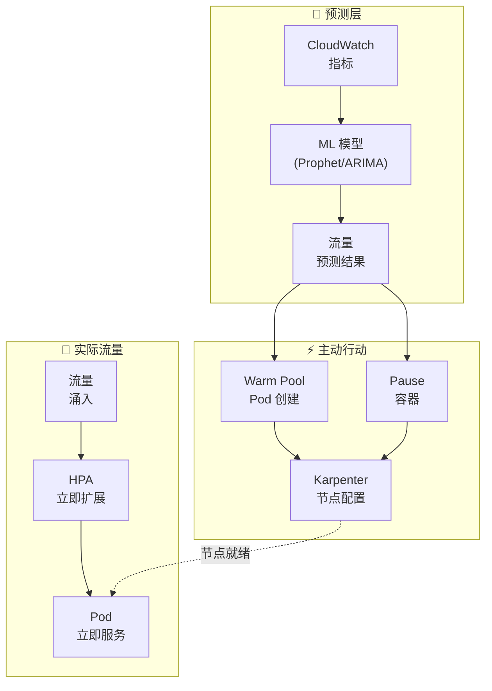
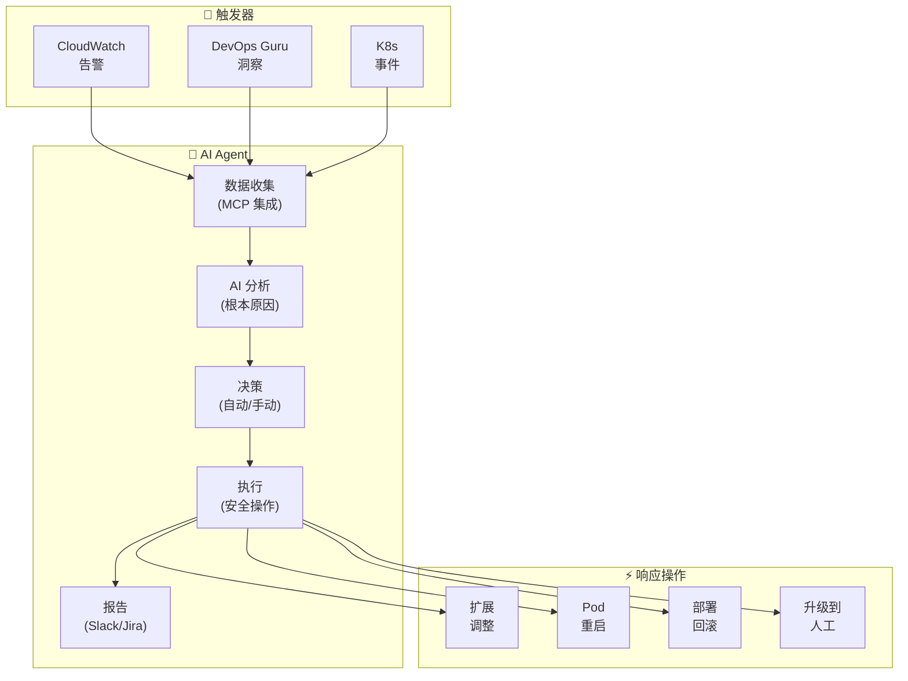
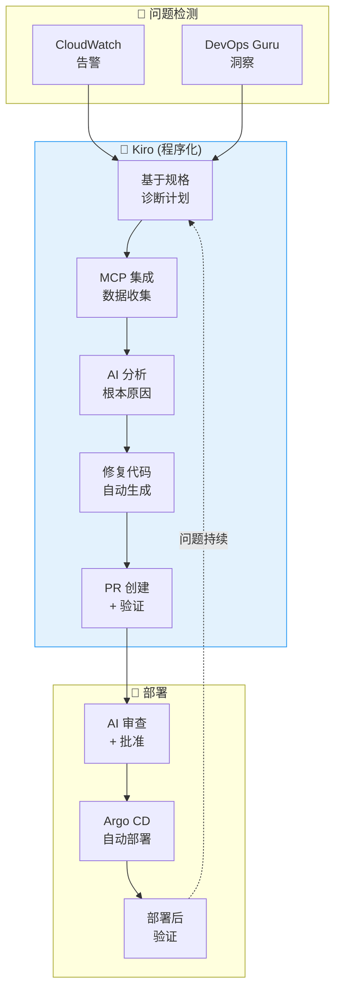

import { ScalingComparison, ResponsePatterns, MaturityTable, EvolutionStages, MLModelComparison, AnomalyMetrics, RightSizingResults, ChaosExperiments, DashboardPanels } from '@site/src/components/PredictiveOpsTables';

# 预测性扩展和自动修复模式

> 📅 **撰写日期**: 2026-02-12 | ⏱️ **阅读时间**: 约 30 分钟 | 📌 **参考环境**: EKS 1.35+, Karpenter v1.1+, CloudWatch, Kiro

---

## 1. 概述

### 1.1 从响应式到自主式

EKS 运维的演进遵循三个阶段:**响应式 → 预测式 → 自主式**。

<EvolutionStages />

:::info 本文档范围
超越响应式扩展的局限性,本文档涵盖基于 ML 的预测性扩展和通过 AI Agents 的自主恢复模式。它特别关注使用 Kiro+MCP 的**程序化调试**和使用 Kagent/Strands 的**自动事件响应**。
:::

### 1.2 为什么需要预测性运维

- **HPA 局限性**: 在指标超过阈值后才响应 → 用户影响已经发生
- **冷启动问题**: 新 Pod 启动需要 30 秒-2 分钟 → 无法处理流量峰值
- **节点配置延迟**: 即使是 Karpenter 也需要 1-3 分钟启动节点
- **复杂故障**: 单一指标无法检测到的复合原因故障越来越多
- **成本效率低下**: 过度的资源缓冲 → 浪费成本

---

## 2. 基于 ML 的预测性扩展

### 2.1 HPA 局限性

HPA (Horizontal Pod Autoscaler) 因为响应**当前指标**而存在结构性局限。

<ScalingComparison />

```
[HPA 响应式扩展]

流量 ████████████████████████░░░░░░░░░
                      ↑ 超过阈值
                      |
Pod 数量 ██████████░░░░████████████████████
                  ↑ 开始扩容
                  |  (发生延迟)
用户体验 ✓✓✓✓✓✓✓✓✗✗✗✓✓✓✓✓✓✓✓✓✓✓✓✓✓✓
               ↑ 性能下降期

[ML 预测性扩展]

流量 ████████████████████████░░░░░░░░░
             ↑ 预测点 (提前 30 分钟)
             |
Pod 数量 ██████████████████████████████████
             ↑ 预先扩容
             |
用户体验 ✓✓✓✓✓✓✓✓✓✓✓✓✓✓✓✓✓✓✓✓✓✓✓✓✓✓
         (无性能下降)
```

### 2.2 时间序列预测模型

用于预测 EKS 工作负载流量模式的代表性 ML 模型:

<MLModelComparison />

### 2.3 基于 Prophet 的预测性扩展实现

```python
# 基于 Prophet 的 EKS 流量预测
import boto3
from prophet import Prophet
import pandas as pd
from datetime import datetime, timedelta

def fetch_metrics_from_amp(workspace_id, query, hours=168):
    """从 AMP 查询最近 7 天的指标"""
    client = boto3.client('amp', region_name='ap-northeast-2')
    end_time = datetime.utcnow()
    start_time = end_time - timedelta(hours=hours)

    response = client.query_range(
        workspaceId=workspace_id,
        query=query,
        startTime=start_time,
        endTime=end_time,
        step='5m'
    )
    return response

def predict_scaling(metrics_df, forecast_hours=2):
    """使用 Prophet 预测未来流量"""
    # 转换为 Prophet 格式
    df = metrics_df.rename(columns={
        'timestamp': 'ds',
        'value': 'y'
    })

    model = Prophet(
        changepoint_prior_scale=0.05,
        seasonality_mode='multiplicative',
        daily_seasonality=True,
        weekly_seasonality=True,
    )
    model.fit(df)

    # 预测接下来的 forecast_hours
    future = model.make_future_dataframe(
        periods=forecast_hours * 12,  # 5 分钟间隔
        freq='5min'
    )
    forecast = model.predict(future)

    return forecast[['ds', 'yhat', 'yhat_upper', 'yhat_lower']]

def calculate_required_pods(predicted_rps, pod_capacity_rps=100):
    """根据预测的 RPS 计算所需的 Pod 数量"""
    # 使用上界 (yhat_upper) 作为安全边际
    required = int(predicted_rps / pod_capacity_rps) + 1
    return max(required, 2)  # 保持最小值为 2

def apply_scaling(namespace, deployment, target_replicas):
    """通过 kubectl 应用扩展"""
    import subprocess
    cmd = f"kubectl scale deployment/{deployment} -n {namespace} --replicas={target_replicas}"
    subprocess.run(cmd.split(), check=True)
    print(f"Scaled {deployment} to {target_replicas} replicas")
```

### 2.4 基于 CronJob 的预测性扩展自动化

```yaml
# 定期执行预测性扩展的 CronJob
apiVersion: batch/v1
kind: CronJob
metadata:
  name: predictive-scaler
  namespace: scaling
spec:
  schedule: "*/15 * * * *"  # 每 15 分钟运行一次
  jobTemplate:
    spec:
      template:
        spec:
          serviceAccountName: predictive-scaler
          containers:
            - name: scaler
              image: my-registry/predictive-scaler:latest
              env:
                - name: AMP_WORKSPACE_ID
                  value: "ws-xxxxx"
                - name: TARGET_NAMESPACE
                  value: "payment"
                - name: TARGET_DEPLOYMENT
                  value: "payment-service"
                - name: FORECAST_HOURS
                  value: "2"
              resources:
                requests:
                  cpu: 500m
                  memory: 1Gi
                limits:
                  cpu: "1"
                  memory: 2Gi
          restartPolicy: OnFailure
```

---

## 3. Karpenter + AI 预测

### 3.1 Karpenter 基本操作

Karpenter 检测 Pending Pods 并**自动选择合适的实例类型**进行配置。

```yaml
# Karpenter NodePool 配置
apiVersion: karpenter.sh/v1
kind: NodePool
metadata:
  name: default
spec:
  template:
    spec:
      requirements:
        - key: kubernetes.io/arch
          operator: In
          values: ["amd64", "arm64"]
        - key: karpenter.sh/capacity-type
          operator: In
          values: ["on-demand", "spot"]
        - key: karpenter.k8s.aws/instance-family
          operator: In
          values: ["m7g", "m7i", "c7g", "c7i", "r7g"]
        - key: karpenter.k8s.aws/instance-size
          operator: In
          values: ["medium", "large", "xlarge", "2xlarge"]
      nodeClassRef:
        group: karpenter.k8s.aws
        kind: EC2NodeClass
        name: default
  limits:
    cpu: "100"
    memory: 400Gi
  disruption:
    consolidationPolicy: WhenEmptyOrUnderutilized
    consolidateAfter: 30s
---
apiVersion: karpenter.k8s.aws/v1
kind: EC2NodeClass
metadata:
  name: default
spec:
  role: KarpenterNodeRole
  amiSelectorTerms:
    - alias: al2023@latest
  subnetSelectorTerms:
    - tags:
        karpenter.sh/discovery: my-cluster
  securityGroupSelectorTerms:
    - tags:
        karpenter.sh/discovery: my-cluster
  blockDeviceMappings:
    - deviceName: /dev/xvda
      ebs:
        volumeSize: 100Gi
        volumeType: gp3
        iops: 3000
        throughput: 125
```

### 3.2 基于 AI 预测的主动配置

虽然 Karpenter 本身响应 Pending Pods,但**将其与 AI 预测结合**可以实现主动节点配置。



**主动配置策略**:

```yaml
# 占位 Pod 主动确保节点
apiVersion: apps/v1
kind: Deployment
metadata:
  name: capacity-reservation
  namespace: scaling
spec:
  replicas: 0  # 由预测性扩展器动态调整
  selector:
    matchLabels:
      app: capacity-reservation
  template:
    metadata:
      labels:
        app: capacity-reservation
    spec:
      priorityClassName: capacity-reservation  # 低优先级
      terminationGracePeriodSeconds: 0
      containers:
        - name: pause
          image: registry.k8s.io/pause:3.9
          resources:
            requests:
              cpu: "1"
              memory: 2Gi
---
# 低优先级类 (被实际工作负载驱逐)
apiVersion: scheduling.k8s.io/v1
kind: PriorityClass
metadata:
  name: capacity-reservation
value: -10
globalDefault: false
description: "用于 Karpenter 主动节点配置"
```

:::tip 主动配置原理

1. ML 模型预测 30 分钟后流量增加
2. 增加占位 Pod 的副本(pause 容器)
3. Karpenter 检测 Pending Pods 并配置节点
4. 当实际流量到达时,HPA 创建真实 Pods
5. 占位 Pods 由于低优先级立即被驱逐
6. 由于节点已就绪,Pods 立即调度
:::

---

## 4. CloudWatch 异常检测

### 4.1 异常检测带

CloudWatch 异常检测使用 ML 自动学习指标的**正常范围带**并检测这些带之外的异常。

```bash
# 创建异常检测模型
aws cloudwatch put-anomaly-detector \
  --namespace "ContainerInsights" \
  --metric-name "pod_cpu_utilization" \
  --dimensions Name=ClusterName,Value=my-cluster \
  --stat "Average" \
  --configuration '{
    "ExcludedTimeRanges": [
      {
        "StartTime": "2026-01-01T00:00:00Z",
        "EndTime": "2026-01-02T00:00:00Z"
      }
    ],
    "MetricTimezone": "Asia/Seoul"
  }'
```

### 4.2 EKS 指标应用

应用异常检测的核心 EKS 指标:

<AnomalyMetrics />

### 4.3 基于异常检测的告警

```bash
# 基于异常检测的 CloudWatch 告警
aws cloudwatch put-metric-alarm \
  --alarm-name "EKS-CPU-Anomaly" \
  --comparison-operator GreaterThanUpperThreshold \
  --threshold-metric-id ad1 \
  --evaluation-periods 3 \
  --datapoints-to-alarm 2 \
  --metrics '[
    {
      "Id": "m1",
      "MetricStat": {
        "Metric": {
          "Namespace": "ContainerInsights",
          "MetricName": "pod_cpu_utilization",
          "Dimensions": [
            {"Name": "ClusterName", "Value": "my-cluster"}
          ]
        },
        "Period": 300,
        "Stat": "Average"
      }
    },
    {
      "Id": "ad1",
      "Expression": "ANOMALY_DETECTION_BAND(m1, 2)"
    }
  ]' \
  --alarm-actions "arn:aws:sns:ap-northeast-2:ACCOUNT_ID:ops-alerts"
```

---

## 5. AI Agent 自动事件响应

### 5.1 传统自动化的局限性

基于 EventBridge + Lambda 的自动化是**基于规则的**并且有局限性:

```
[传统方法: 基于规则的自动化]
CloudWatch 告警 → EventBridge 规则 → Lambda → 固定操作

问题:
  ✗ "CPU > 80% 时扩展" — 根本原因可能是内存泄漏
  ✗ "Pod 重启 > 5 次时告警" — 不同原因需要不同响应
  ✗ 无法处理复杂故障
  ✗ 无法适应新模式
```

### 5.2 基于 AI Agent 的自主响应

<ResponsePatterns />

AI Agents 通过**基于上下文的判断**自主响应。



### 5.3 Kagent 自动事件响应

```yaml
# Kagent: 自动事件响应代理
apiVersion: kagent.dev/v1alpha1
kind: Agent
metadata:
  name: incident-responder
  namespace: kagent-system
spec:
  description: "EKS 事件自动响应代理"
  modelConfig:
    provider: bedrock
    model: anthropic.claude-sonnet
    region: ap-northeast-2
  systemPrompt: |
    您是一个 EKS 事件响应代理。

    ## 响应原则
    1. 安全第一: 将风险变更升级给人工
    2. 根本原因优先: 处理原因,而非症状
    3. 最小干预: 仅执行必要的操作
    4. 记录所有操作: 自动向 Slack 和 JIRA 报告

    ## 允许的自动操作
    - Pod 重启 (CrashLoopBackOff, 5+ 次)
    - HPA min/max 调整 (当前值的 ±50%)
    - 部署回滚 (到先前版本)
    - 节点排空 (MemoryPressure/DiskPressure)

    ## 升级目标
    - 可能导致数据丢失的操作
    - 影响 50%+ 副本的更改
    - StatefulSet 相关更改
    - 网络策略更改

  tools:
    - name: kubectl
      type: kmcp
      config:
        allowedVerbs: ["get", "describe", "logs", "top", "rollout", "scale", "delete"]
        deniedResources: ["secrets", "configmaps"]
    - name: cloudwatch
      type: kmcp
      config:
        actions: ["GetMetricData", "DescribeAlarms", "GetInsight"]
    - name: slack
      type: mcp
      config:
        webhook_url: "${SLACK_WEBHOOK}"
        channel: "#incidents"

  triggers:
    - type: cloudwatch-alarm
      filter:
        severity: ["CRITICAL", "HIGH"]
    - type: kubernetes-event
      filter:
        reason: ["CrashLoopBackOff", "OOMKilled", "FailedScheduling"]
```

### 5.4 Strands Agent SOP: 复杂故障响应

```python
# Strands Agent: 复杂故障自动响应
from strands import Agent
from strands.tools import eks_tool, cloudwatch_tool, slack_tool, jira_tool

incident_agent = Agent(
    name="complex-incident-handler",
    model="bedrock/anthropic.claude-sonnet",
    tools=[eks_tool, cloudwatch_tool, slack_tool, jira_tool],
    sop="""
    ## 复杂故障响应 SOP

    ### 阶段 1: 情况评估 (30 秒内)
    1. 查询 CloudWatch 告警和 DevOps Guru 洞察
    2. 检查相关服务的 Pod 状态
    3. 检查节点状态和资源利用率
    4. 审查最近的部署历史 (10 分钟内的更改)

    ### 阶段 2: 根本原因分析 (2 分钟内)
    1. 从日志中提取错误模式
    2. 指标相关性分析 (CPU, Memory, Network, Disk)
    3. 分析与部署更改的时间相关性
    4. 检查依赖服务状态

    ### 阶段 3: 自动响应
    按根本原因分类的操作:

    **部署相关故障:**
    - 如果 10 分钟内有部署 → 自动回滚
    - 回滚后检查状态 → 如果恢复正常则完成

    **资源短缺:**
    - CPU/Memory > 90% → 调整 HPA 或添加 Karpenter 节点
    - Disk > 85% → 清理不必要的日志/镜像

    **依赖服务故障:**
    - RDS 连接失败 → 检查连接池设置,必要时重启
    - SQS 延迟 → 检查 DLQ,扩展消费者

    **未知原因:**
    - 升级给人工
    - 在 Slack 上分享所有收集的数据

    ### 阶段 4: 后处理
    1. 生成事件时间线
    2. 创建 JIRA 事件工单
    3. 向 Slack #incidents 频道发布报告
    4. 保存为学习数据 (反馈循环)
    """
)
```

:::info AI Agents 的核心价值
超越 EventBridge+Lambda,基于 AI 上下文的自主响应成为可能。通过**通过 MCP 集成查询各种数据源**(CloudWatch、EKS API、X-Ray、部署历史),AI 可以分析规则无法处理的复杂故障的根本原因并自动执行适当的操作。
:::

---

## 6. Kiro 程序化调试

### 6.1 指令式 vs 程序化响应比较

```
[指令式响应] — 手动、重复、高成本
━━━━━━━━━━━━━━━━━━━━━━━━━━━━━━━━━━━━━━━━━━
  操作员: "payment-service 500 错误发生"
  AI:       "发生在哪个 Pod?"
  操作员: "payment-xxx Pod"
  AI:       "请显示日志"
  操作员: (执行 kubectl logs 并复制粘贴)
  AI:       "看起来像 DB 连接错误。请检查 RDS 状态"
  操作员: (在 AWS 控制台检查 RDS)
  ...重复...

  总时间: 15-30 分钟,多个手动任务

[程序化响应] — 自动化、系统化、成本高效
━━━━━━━━━━━━━━━━━━━━━━━━━━━━━━━━━━━━━━━━━━
  告警: "payment-service 500 错误发生"

  Kiro 规格:
    1. 通过 EKS MCP 查询 Pod 状态
    2. 收集并分析错误日志
    3. 检查相关 AWS 服务 (RDS, SQS) 状态
    4. 诊断根本原因
    5. 生成自动修复代码
    6. 创建 PR 并验证

  总时间: 2-5 分钟,自动化
```

### 6.2 Kiro + MCP 调试工作流



### 6.3 具体场景: OOMKilled 自动响应

```
[Kiro 程序化调试: OOMKilled]

1. 检测: payment-service Pod OOMKilled 事件

2. Kiro 规格执行:
   → EKS MCP: get_events(namespace="payment", reason="OOMKilled")
   → EKS MCP: get_pod_logs(pod="payment-xxx", previous=true)
   → CloudWatch MCP: query_metrics("pod_memory_utilization", last="1h")

3. AI 分析:
   "在 payment-service 中检测到内存泄漏模式,启动后每 2 小时
    增加 256Mi。
    日志确认 Redis 连接未正确关闭。"

4. 自动修复:
   - memory limits 256Mi → 512Mi (临时措施)
   - 生成 Redis 连接池清理代码补丁
   - 添加内存分析配置

5. PR 创建:
   标题: "fix: payment-service Redis 连接泄漏"
   - deployment.yaml: 调整内存限制
   - redis_client.go: 添加 defer conn.Close()
   - monitoring: 添加内存使用仪表板
```

:::tip 程序化调试的核心
通过 Kiro + EKS MCP,问题被**程序化地分析和解决**。与手动指令式响应相比,这实现了**成本高效和快速的自动化**,学习的规格可以在相同问题重复时重用。
:::

---

## 7. AI 资源调优

### 7.1 基于 Container Insights 的建议

CloudWatch Container Insights 分析实际 Pod 资源使用模式以推荐适当的大小。

```promql
# 比较实际 CPU 使用 vs 请求
avg(rate(container_cpu_usage_seconds_total{namespace="payment"}[1h]))
  by (pod)
/ avg(kube_pod_container_resource_requests{resource="cpu", namespace="payment"})
  by (pod)
* 100

# 比较实际内存使用 vs 请求
avg(container_memory_working_set_bytes{namespace="payment"})
  by (pod)
/ avg(kube_pod_container_resource_requests{resource="memory", namespace="payment"})
  by (pod)
* 100
```

### 7.2 基于 VPA + ML 的自动资源调优

```yaml
# VPA (Vertical Pod Autoscaler) 配置
apiVersion: autoscaling.k8s.io/v1
kind: VerticalPodAutoscaler
metadata:
  name: payment-service-vpa
  namespace: payment
spec:
  targetRef:
    apiVersion: apps/v1
    kind: Deployment
    name: payment-service
  updatePolicy:
    updateMode: "Auto"  # Off, Initial, Auto
  resourcePolicy:
    containerPolicies:
      - containerName: app
        minAllowed:
          cpu: 100m
          memory: 128Mi
        maxAllowed:
          cpu: "2"
          memory: 4Gi
        controlledResources: ["cpu", "memory"]
```

### 7.3 资源调优结果

<RightSizingResults />

:::tip K8s 1.35: 原地 Pod 资源更新
从 K8s 1.35 开始(2026年1月,EKS 支持),**原地 Pod 资源更新**功能允许在不重启 Pod 的情况下动态调整 CPU 和内存。这解决了 VPA 最大的局限性"资源更改时 Pod 重启"。垂直扩展现在对 StatefulSets 和重启敏感的工作负载也是安全的。
:::

:::warning VPA 注意事项 (K8s 1.34 及以下)
在 K8s 1.34 及以下版本中,VPA `Auto` 模式会重启 Pods 以调整资源。对于 StatefulSets 或重启敏感的工作负载,使用 `Off` 模式仅检查建议并手动应用更安全。同时使用 VPA 和 HPA 与相同指标(CPU/Memory)可能会导致冲突。
:::

---

## 8. 反馈循环

### 8.1 测量预测准确性

```python
# 测量预测准确性并重新训练模型
import numpy as np

def calculate_accuracy(predicted, actual):
    """计算 MAPE (平均绝对百分比误差)"""
    mape = np.mean(np.abs((actual - predicted) / actual)) * 100
    return {
        'mape': mape,
        'accuracy': 100 - mape,
        'over_prediction_rate': np.mean(predicted > actual) * 100,
        'under_prediction_rate': np.mean(predicted < actual) * 100
    }

def should_retrain(accuracy_history, threshold=85):
    """确定是否需要重新训练"""
    recent_accuracy = np.mean(accuracy_history[-10:])
    if recent_accuracy < threshold:
        return True, f"最近准确率 {recent_accuracy:.1f}% < 阈值 {threshold}%"
    return False, f"准确率良好: {recent_accuracy:.1f}%"
```

### 8.2 自动重新训练流水线

```yaml
# 预测模型自动重新训练 CronJob
apiVersion: batch/v1
kind: CronJob
metadata:
  name: model-retrainer
  namespace: scaling
spec:
  schedule: "0 2 * * 0"  # 每周日 02:00
  jobTemplate:
    spec:
      template:
        spec:
          containers:
            - name: retrainer
              image: my-registry/model-retrainer:latest
              env:
                - name: AMP_WORKSPACE_ID
                  value: "ws-xxxxx"
                - name: TRAINING_WEEKS
                  value: "4"
                - name: ACCURACY_THRESHOLD
                  value: "85"
              resources:
                requests:
                  cpu: "2"
                  memory: 4Gi
          restartPolicy: OnFailure
```

### 8.3 A/B 扩展测试

```
[A/B 扩展]

组 A (50% 流量): 基于 HPA 的响应式扩展
组 B (50% 流量): 基于 ML 预测的主动扩展

比较指标:
  - P99 延迟差异
  - 扩展事件数量
  - 资源使用效率
  - 成本-性能比
```

---

## 9. 混沌工程 + AI

### 9.1 AWS Fault Injection Service (FIS)

```json
{
  "description": "EKS Pod 故障注入测试",
  "targets": {
    "eks-pods": {
      "resourceType": "aws:eks:pod",
      "selectionMode": "COUNT(2)",
      "resourceTags": {
        "app": "payment-service"
      },
      "parameters": {
        "clusterIdentifier": "my-cluster",
        "namespace": "payment"
      }
    }
  },
  "actions": {
    "terminate-pods": {
      "actionId": "aws:eks:terminate-pod",
      "parameters": {},
      "targets": {
        "Pods": "eks-pods"
      }
    }
  },
  "stopConditions": [
    {
      "source": "aws:cloudwatch:alarm",
      "value": "arn:aws:cloudwatch:ap-northeast-2:ACCOUNT_ID:alarm:PaymentServiceSLO"
    }
  ],
  "roleArn": "arn:aws:iam::ACCOUNT_ID:role/FISRole",
  "tags": {
    "Environment": "staging",
    "Team": "platform"
  }
}
```

### 9.2 基于 AI 的故障模式学习

AI 从混沌工程实验结果中学习以提高响应能力。

<ChaosExperiments />

```python
# FIS 实验后收集 AI 学习数据
from strands import Agent

chaos_analyzer = Agent(
    name="chaos-pattern-analyzer",
    model="bedrock/anthropic.claude-sonnet",
    sop="""
    ## 混沌工程结果分析

    1. 收集 FIS 实验结果
       - 注入的故障类型
       - 系统反应时间
       - 恢复时间
       - 影响范围

    2. 模式分析
       - 映射故障传播路径
       - 识别脆弱点
       - 识别恢复瓶颈

    3. 更新响应规则
       - 将学习添加到现有 SOP
       - 为新模式创建响应规则
       - 调整升级阈值

    4. 生成报告
       - 实验摘要
       - 发现的脆弱性
       - 推荐的改进
    """
)
```

:::tip 混沌工程 + AI 反馈循环
通过使用 FIS 注入故障并让 AI 学习系统反应模式,AI Agent 的自动响应能力持续改进。"故障注入 → 观察 → 学习 → 响应改进"的反馈循环是自主运维的核心。
:::

---

## 10. 集成运维仪表板

### 10.1 AMG 仪表板配置

<MaturityTable />

集成运维仪表板将预测和实际数据一起显示。

```json
{
  "dashboard": {
    "title": "EKS 预测性运维仪表板",
    "panels": [
      {
        "title": "流量预测 vs 实际",
        "type": "timeseries",
        "targets": [
          {
            "expr": "sum(rate(http_requests_total{namespace='payment'}[5m]))",
            "legendFormat": "实际 RPS"
          },
          {
            "expr": "predicted_rps{service='payment'}",
            "legendFormat": "预测 RPS"
          }
        ]
      },
      {
        "title": "扩展事件",
        "type": "timeseries",
        "targets": [
          {
            "expr": "kube_deployment_spec_replicas{deployment='payment-service'}",
            "legendFormat": "当前副本"
          },
          {
            "expr": "predicted_replicas{deployment='payment-service'}",
            "legendFormat": "预测所需副本"
          }
        ]
      },
      {
        "title": "SLO 状态",
        "type": "gauge",
        "targets": [
          {
            "expr": "1 - (sum(rate(http_requests_total{status=~'5..'}[30d])) / sum(rate(http_requests_total[30d])))",
            "legendFormat": "可用性 SLO"
          }
        ],
        "thresholds": {
          "steps": [
            {"value": 0.999, "color": "green"},
            {"value": 0.995, "color": "yellow"},
            {"value": 0, "color": "red"}
          ]
        }
      },
      {
        "title": "剩余错误预算",
        "type": "stat",
        "targets": [
          {
            "expr": "error_budget_remaining_percent{service='payment'}",
            "legendFormat": "剩余错误预算"
          }
        ]
      },
      {
        "title": "预测准确率",
        "type": "stat",
        "targets": [
          {
            "expr": "prediction_accuracy_percent",
            "legendFormat": "准确率"
          }
        ]
      },
      {
        "title": "事件自动响应率",
        "type": "stat",
        "targets": [
          {
            "expr": "auto_remediation_success_rate",
            "legendFormat": "自动响应成功率"
          }
        ]
      }
    ]
  }
}
```

### 10.2 核心仪表板面板

<DashboardPanels />

---

## 11. 结论

### 11.1 采用路线图

```
阶段 1: 构建可观测性基础
  └── AMP/AMG + CloudWatch + 异常检测

阶段 2: 预测性扩展
  └── Prophet/ARIMA + Karpenter 主动配置

阶段 3: AI Agent 扩展
  └── Q Developer + Strands + Kagent + MCP 集成

阶段 4: Kiro 程序化调试
  └── Kiro 规格 → 自动诊断 → 自动修复

阶段 5: 混沌工程 + 反馈循环
  └── FIS 实验 → AI 学习 → 自主运维演进
```

### 11.2 后续步骤

- **[AIOps 介绍](./aiops-introduction.md)**: 预测性运维的更高层策略 — 整体 AIOps 上下文
- **[智能可观测性堆栈](./aiops-observability-stack.md)**: 预测性运维的数据基础 — 构建可观测性
- **[AIDLC 框架](./aidlc-framework.md)**: 包括预测性运维的 AI 开发生命周期

### 11.3 学习路径

```
[前置] AIOps 介绍 — 理解策略和方向
     ↓
[前置] 智能可观测性堆栈 — 构建数据收集/分析基础
     ↓
[前置] AIDLC 框架 — AI 驱动的开发方法论
     ↓
[当前文档] 预测性扩展和自动修复 — 实现自主运维
```

:::info 相关文档

- [AIOps 策略指南](./aiops-introduction.md) — 整体 AIOps 策略
- [构建智能可观测性堆栈](./aiops-observability-stack.md) — 基于可观测性的基础设施
- [AIDLC 框架](./aidlc-framework.md) — AI 驱动的开发方法论
:::
