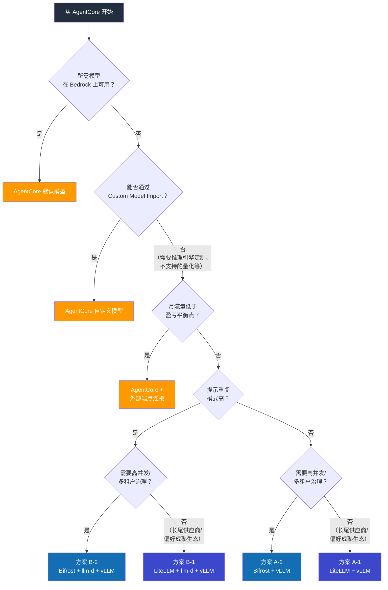

# 推理平台基准测试：Bedrock AgentCore vs EKS 自建

> **创建日期**：2026-03-18 | **状态**：计划

## 目标

以 Bedrock AgentCore 为默认推理平台，量化验证何时以及在何种条件下需要自建 EKS。同时对比自建 EKS 中 LLM 网关（LiteLLM vs Bifrost）和缓存感知路由（llm-d）组合的性能/成本差异。

:::info 默认前提
**Bedrock AgentCore 为默认选择。** 作为托管服务，AWS 负责构建时间、运维负担和扩缩。通过 Custom Model Import 也支持开源/自定义模型，因此仅凭模型支持不能作为自建的理由。只有在需要**推理引擎级别控制、大规模成本优化或缓存路由**时才有必要自建。
:::

---

## 对比目标

| 配置 | 描述 | 验证目的 |
|------|------|----------|
| **基准. AgentCore（默认模型）** | 直接使用 Bedrock 提供的模型 | 参考基准 |
| **基准+. AgentCore（自定义模型）** | 通过 Custom Model Import 服务自定义模型 | 托管环境中的自定义模型性能/成本 |
| **方案 A-1. EKS + LiteLLM + vLLM** | LiteLLM 网关，标准负载均衡 | 使用现有生态的自建方案 |
| **方案 A-2. EKS + Bifrost + vLLM** | Bifrost 网关，标准负载均衡 | 高性能网关效果验证 |
| **方案 B-1. EKS + LiteLLM + llm-d + vLLM** | LiteLLM + 缓存感知路由 | 验证 llm-d 附加价值 |
| **方案 B-2. EKS + Bifrost + llm-d + vLLM** | Bifrost + 缓存感知路由 | 验证最优组合 |

### 架构配置

```
基准:     Client → AgentCore Gateway → Bedrock 推理（默认模型）
基准+:    Client → AgentCore Gateway → Bedrock 推理（Custom Import 模型）

方案 A-1: Client → LiteLLM  → kgateway (RoundRobin) → vLLM Pods
方案 A-2: Client → Bifrost  → vLLM Pods (Bifrost 负载均衡)

方案 B-1: Client → LiteLLM  → llm-d (Prefix-Cache Aware) → vLLM Pods
方案 B-2: Client → Bifrost  → llm-d (Prefix-Cache Aware) → vLLM Pods
```

:::tip llm-d 连接方式
llm-d 提供 OpenAI 兼容端点，因此 LiteLLM 和 Bifrost 都可以通过将 `base_url` 指向 llm-d 服务来简单集成。网关选择和 llm-d 集成是独立的。
:::

---

## LLM 网关对比：LiteLLM vs Bifrost

网关选择直接影响自建 EKS 的平台性能和运维。

| 项目 | LiteLLM（Python） | Bifrost（Go） |
|------|:-----------------:|:------------:|
| **网关开销** | 数百 us/req | 约 11 us/req（快 40-50 倍） |
| **内存占用** | 基准 | 小约 68% |
| **供应商支持** | 100+ | 20+（主要供应商原生支持） |
| **成本追踪** | 内置 | 内置（分层：key/team/customer） |
| **可观测性** | Langfuse 原生集成 | 内置（请求追踪、Prometheus） |
| **语义缓存** | 内置 | 内置（约 5ms 命中） |
| **防护栏** | 内置 | 内置 |
| **MCP Tool 过滤** | 有限 | 内置（按 Virtual Key） |
| **治理（Virtual Keys）** | API Key 管理 | 分层（key/team/customer 预算/权限） |
| **速率限制** | 内置 | 分层（key/team/customer） |
| **回退/负载均衡** | 内置 | 内置 |
| **Web UI** | 内置 | 内置（实时监控） |
| **Langfuse 集成** | 原生插件（仅需配置） | 通过 OTel 或 Langfuse OpenAI SDK 包装器（应用层） |
| **社区/参考案例** | 成熟（16k+ GitHub stars） | 增长中（3k+ GitHub stars） |

### 为什么网关开销对 Agentic AI 很重要

Agent 在单个任务中会进行多次顺序 LLM 调用。网关开销随每次调用累积：

```
Agent 1 任务 = LLM 调用 → 工具 → LLM 调用 → 工具 → LLM 调用 → 响应
               (网关)         (网关)         (网关)

LiteLLM:  约 300us x 5 次调用 = 约 1.5ms 累积
Bifrost:  约 11us  x 5 次调用 = 约 0.055ms 累积

占推理时间（数百毫秒到秒）的比例：1-3% vs 0.01-0.1%
```

对单次请求可忽略不计，但高并发 + Agent 多次调用环境可能产生尾部延迟差异。

---

## AgentCore 提供范围

| 领域 | AgentCore 提供 | 自建需要 |
|------|---------------------|----------------------|
| 推理（默认模型） | Claude、Llama、Mistral 等开箱即用 | vLLM + GPU + 模型部署 |
| 推理（自定义模型） | Custom Model Import / Marketplace | vLLM + GPU + 模型部署 |
| 扩缩 | 自动（托管） | Karpenter + HPA/KEDA |
| Agent 运行时 | 内置 Agent Runtime | LangGraph / Strands 自建 |
| MCP 连接 | 内置 MCP Connector | 部署/运维 MCP 服务器 |
| 防护栏 | Bedrock Guardrails | 网关内置（Bifrost/LiteLLM） |
| 可观测性 | CloudWatch 集成 | Langfuse + Bifrost/LiteLLM 内置 + Prometheus |
| 安全 | IAM 原生、VPC 集成 | Pod Identity + NetworkPolicy |
| 运维 | 无需（托管） | GPU 监控、模型更新、事件响应 |

---

## 验证问题

| # | 问题 | 场景 |
|---|------|----------|
| Q1 | AgentCore 默认模型性能是否满足生产 SLA？ | 1 |
| Q2 | Custom Model Import 性能与直接 vLLM 服务相比如何？ | 2 |
| Q3 | Custom Model Import 有哪些限制？（量化、批处理策略等） | 2 |
| Q4 | 在什么流量规模下自建更具成本效益？ | 7 |
| Q5 | AgentCore 能否处理复杂的 Agent 工作流需求？ | 5 |
| Q6 | llm-d 缓存优化效果是否足以逆转成本差距？ | 3、6 |
| Q7 | AgentCore 在突发流量时的响应如何？ | 9 |
| Q8 | AgentCore 的隔离性是否满足多租户环境？ | 6 |
| Q9 | LiteLLM vs Bifrost 网关开销在实践中是否显著？ | 4 |
| Q10 | Bifrost + llm-d 组合是否稳定运行？ | 4 |

---

## 测试环境

```
区域：us-east-1

基准（AgentCore 默认模型）：
  - Bedrock Claude 3.5 Sonnet（按需 + 预留）
  - Bedrock Llama 3.1 70B（按需）
  - AgentCore Agent Runtime + MCP Connector
  - Bedrock Guardrails、CloudWatch

基准+（AgentCore 自定义模型）：
  - Llama 3.1 70B 微调模型 → Custom Model Import
  - 相同 AgentCore 运行时

方案 A-1（EKS + LiteLLM + vLLM）：
  - EKS v1.32、Karpenter v1.2
  - g5.2xlarge（A10G）x 4、vLLM v0.7.x
  - Llama 3.1 70B（AWQ 4bit）
  - LiteLLM v1.60+ → kgateway（RoundRobin）
  - Langfuse v3.x + Prometheus

方案 A-2（EKS + Bifrost + vLLM）：
  - 相同 EKS/vLLM 配置
  - Bifrost（最新版）→ vLLM（Bifrost 负载均衡）
  - Bifrost 内置可观测性 + Prometheus

方案 B-1（EKS + LiteLLM + llm-d + vLLM）：
  - 方案 A-1 + llm-d v0.3+

方案 B-2（EKS + Bifrost + llm-d + vLLM）：
  - 方案 A-2 + llm-d v0.3+
  - Bifrost base_url → llm-d 服务端点

负载生成：Locust + LLMPerf
```

---

## 测试场景

### 场景 1：简单推理 — AgentCore 基准性能

- 每次不同提示，输入 500 / 输出 1000 Token
- 并发：1、10、50、100、200
- 目标：基准（默认模型）
- **验证**：AgentCore TTFT、TPS 是否满足生产 SLA？

### 场景 2：Custom Model Import vs vLLM 直接服务

- 相同模型（Llama 3.1 70B）在基准+ vs 方案 A-1/A-2 上服务
- 输入 500 / 输出 1000 Token，并发：1、10、50、100
- 测量：TTFT、TPS、E2E 延迟
- **验证**：Custom Import 的性能差异和限制
  - 量化选项对比（Import 支持范围 vs vLLM AWQ/GPTQ/FP8）
  - 批次大小/并发处理控制可用性
  - 模型更新周转时间（Import 重新部署 vs vLLM 滚动更新）

### 场景 3：重复系统提示 — 缓存效果

- 3 个固定系统提示（各 2000 Token）+ 仅用户输入变化
- 并发：10、50、100
- 目标：基准（Prompt 缓存）vs 方案 A-1/A-2 vs 方案 B-1/B-2（llm-d）
- **验证**：Bedrock Prompt 缓存 vs llm-d Prefix 缓存 vs Bifrost 语义缓存，TTFT/成本对比

### 场景 4：网关开销 — LiteLLM vs Bifrost

- LiteLLM 和 Bifrost 各自作为相同 vLLM 后端的网关
- 并发：1、10、50、100、500、1000
- 有/无 llm-d 组合：A-1 vs A-2、B-1 vs B-2
- 测量：网关额外延迟（p50/p95/p99）、内存使用、CPU 使用、错误率
- **验证**：
  - Q9 — 高并发下网关开销是否产生显著差异？
  - Q10 — Bifrost → llm-d 连接是否稳定运行？
  - Agent 多次调用（5 轮）的累积开销差异

### 场景 5：多轮 Agent 工作流

- 5 轮对话 + 3 次工具调用（网页搜索、数据库查询、计算）
- AgentCore：Agent Runtime + MCP Connector
- EKS：LangGraph + MCP Server（Bifrost MCP 工具过滤 vs LiteLLM）
- **验证**：AgentCore Agent Runtime 复杂工作流处理能力、定制化限制

### 场景 6：多租户

- 5 个租户，各有不同的系统提示/防护栏策略
- AgentCore：基于 IAM 的隔离
- EKS + LiteLLM：基于 API Key 的隔离
- EKS + Bifrost：Virtual Key 分层治理（按 team/customer 预算、权限）
- EKS + llm-d：按租户的缓存路由
- **验证**：AgentCore 隔离级别 vs EKS、Bifrost Virtual Key 治理效果

### 场景 7：盈亏平衡点探索

- 逐步增加负载：1、5、10、30、50、100 req/s
- 计算每级别 6 种配置的月度成本
- **验证**：推导精确的成本交叉点

### 场景 8：长时间运行（24 小时）

- 30 req/s，持续 24 小时
- 总成本、稳定性（错误率）、性能波动
- **验证**：AgentCore 成本可预测性 vs EKS GPU 空闲成本

### 场景 9：突发流量

- 正常 10 req/s → 100 req/s 持续 5 分钟 → 回到 10 req/s
- **验证**：AgentCore 限流/排队行为 vs EKS Karpenter 扩展延迟

---

## 测量指标

| 类别 | 指标 | 基准 | 基准+ | A-1（LiteLLM） | A-2（Bifrost） | B-1（LiteLLM+llm-d） | B-2（Bifrost+llm-d） |
|----------|--------|:--------:|:---------:|:-----:|:------:|:-----:|:------:|
| **性能** | TTFT（p50/p95/p99） | O | O | O | O | O | O |
| | TPS（输出 tokens/sec） | O | O | O | O | O | O |
| | E2E 延迟 | O | O | O | O | O | O |
| | 吞吐量（req/s） | O | O | O | O | O | O |
| | 冷启动 | O | O | O | O | O | O |
| **网关** | 网关额外延迟 | - | - | O | O | O | O |
| | 网关内存使用 | - | - | O | O | O | O |
| | 网关 CPU 使用 | - | - | O | O | O | O |
| **缓存** | Bedrock Prompt 缓存节省 | O | O | - | - | - | - |
| | 语义缓存命中率 | - | - | - | O | - | O |
| | KV 缓存命中率 | - | - | - | - | O | O |
| **成本** | 月度总成本（按流量级别） | O | O | O | O | O | O |
| | 有效每 Token 成本 | O | O | O | O | O | O |
| | 空闲成本 | - | - | O | O | O | O |
| **治理** | 租户隔离级别 | O | O | O | O | O | O |
| | 预算/速率限制精度 | O | O | O | O | O | O |
| **运维** | 构建时间 | O | O | O | O | O | O |
| | 灾难恢复时间 | O | O | O | O | O | O |
| | 所需人员/技能集 | O | O | O | O | O | O |

---

## 成本模拟

### 固定成本（月度）

| 项目 | 基准 | 基准+ | A-1/A-2 | B-1/B-2 |
|------|:--------:|:---------:|:-------:|:-------:|
| GPU 实例（g5.2xlarge x4） | - | - | 约 $4,800 | 约 $4,800 |
| EKS 集群 | - | - | $73 | $73 |
| llm-d（CPU Pod） | - | - | - | 约 $50 |
| 网关（LiteLLM/Bifrost） | - | - | 约 $50 | 约 $50 |
| Langfuse（自托管） | - | - | 约 $100 | 约 $100 |
| Bedrock 预留 | 另行计算 | 另行计算 | - | - |

### 可变成本

| 项目 | 基准 | 基准+ | A-1/A-2 | B-1/B-2 |
|------|----------|-----------|---------|---------|
| 计费方式 | 按 Token | 按 Token | GPU 时间分配 | GPU 时间分配 |
| 缓存节省 | Prompt 缓存折扣 | Prompt 缓存折扣 | 语义缓存（Bifrost） | KV 缓存 + 语义缓存 |
| 空闲成本 | 无（按需） | 无（按需） | GPU 空闲时计费 | GPU 空闲时计费 |

### 预期成本曲线

```
月度成本
  ^
  |  AgentCore 按需
  |          \
  |           \                      / A-1 (LiteLLM+vLLM)
  |            \                    / A-2 (Bifrost+vLLM)
  |             \                  /
  |    AgentCore \                /  B-1 (LiteLLM+llm-d)
  |    预留       \              /  / B-2 (Bifrost+llm-d)
  |                \            / / /
  |                 \          / / /
  |                  \        / / /
  |                   X      / /  <-- 盈亏平衡点
  |                  / \    / /
  |  EKS 固定成本--/---\--/-/----------
  |               /     \/
  +-------------------------------------------> 流量 (req/s)
       5    10    30    50    100
```

| 流量范围 | 建议 | 原因 |
|------------|------|------|
| 低于盈亏平衡点 | **AgentCore 按需** | 无 GPU 固定成本，即时启动 |
| 盈亏平衡点附近 | **AgentCore 预留** | 折扣吞吐量，仍为托管 |
| 高于盈亏平衡点 + 多样提示 | **方案 A-2（Bifrost）** | 低开销，治理 |
| 高于盈亏平衡点 + 重复提示 | **方案 B-2（Bifrost+llm-d）** | 缓存效果 + 低开销 |

---

## 决策流程图



---

## 证明 EKS 自建合理性的条件

:::warning 仅当 AgentCore 不足时才考虑自建
当满足以下一项或多项条件时，自建 EKS 才有充分理由。
:::

| 条件 | 原因 |
|------|------|
| 精细的推理引擎控制 | 自由选择 vLLM 调度、批处理策略、量化（AWQ/GPTQ/FP8） |
| 大规模流量成本优化 | 超过盈亏平衡点后每 Token 成本逆转 |
| KV 缓存路由 | 通过 llm-d Prefix 缓存最大化 TTFT/GPU 效率 |
| 多租户治理 | 通过 Bifrost Virtual Keys 实现精细的按 team/customer 预算/权限控制 |
| 即时采用最新模型 | 在 Bedrock Import 之前使用社区最新模型 |
| 数据主权 / 断网环境 | 无法调用 Bedrock API 的环境 |

---

## 可观测性栈配置

自建 EKS 的可观测性栈因网关选择而异。

### 基于 LiteLLM（A-1、B-1）

```
应用（Langfuse SDK） ──→ Langfuse Server（Trace/Span）
LiteLLM ──→ Langfuse Server（原生集成，请求/成本日志）
vLLM + llm-d ──→ Prometheus → Grafana（GPU、KV 缓存指标）
```

### 基于 Bifrost（A-2、B-2）

```
应用（Langfuse SDK） ──→ Langfuse Server（Trace/Span）
Bifrost（OTel 插件） ──→ OTLP Collector ──→ Langfuse Server（网关级 Trace）
Bifrost ──→ Prometheus → Grafana（成本/Token/延迟指标）
Bifrost ──→ Bifrost Web UI（实时监控）
vLLM + llm-d ──→ Prometheus → Grafana（GPU、KV 缓存指标）
```

:::note 无论选择哪种网关都需要 Langfuse
Bifrost 的内置可观测性监控网关层（请求/成本/延迟）。完整的 Agent 工作流追踪（连接多次调用、提示质量评估、会话跟踪）由 Langfuse 处理。两个层面互补，而非替代。
:::

---

## 结果报告结构（计划）

| 章节 | 内容 |
|------|------|
| 执行摘要 | 清晰区分"何时 AgentCore 足够"和"何时需要自建" |
| AgentCore 基准性能 | 默认模型 TTFT、TPS、吞吐量基准 |
| Custom Import vs vLLM | 相同模型的性能/成本/限制对比 |
| 网关对比 | LiteLLM vs Bifrost 开销、治理、稳定性 |
| 缓存策略对比 | Bedrock Prompt 缓存 vs Bifrost 语义缓存 vs llm-d Prefix 缓存 |
| Agent 运行时对比 | AgentCore Runtime vs LangGraph 能力/灵活性 |
| 成本盈亏平衡 | 按流量范围的 6 种配置成本图 + 交叉点 |
| 可观测性栈 | 按网关的可观测性配置对比 |
| 决策指南 | 工作负载特性 → 最优配置流程图 |
| 迁移路径 | 从 AgentCore → EKS 迁移的工作量和风险 |
